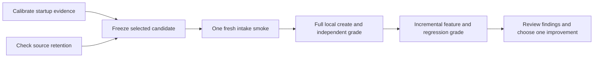

# ShipLoop: next experiments after the graph and observer audit

Status: proposed next experiments, with the completed audit correction recorded
below. Keep the current graph and Improve completion policy. First remove known
observation uncertainties, then establish one valid local create/feature result. Use existing
runners, receipts, fixtures and review documents throughout.

## Evidence and what remains unknown

The frozen working candidate passed **230 offline apparatus tests**, with no
failures, errors or skips, in 194.80 seconds. The separate real CLI composition
suite passed three tests, including its fixed 34-stage route, in 86.77 seconds
wall time. These results include the live-derived interim-exit correction and
the separately owned behavior-capture correction; they do not certify a later
publication candidate. The short real CLI/host-observer bridge took 1.48 seconds.

One live Grok intake smoke took **20.22 minutes** and durably accepted intake,
imported the selected Improve child, and advanced to discovery. Its verdict
remains `partial-smoke-failed`: a successful startup recovery used a shell `&&`
form outside the observer's supported attribution grammar. No game was created
or tested in that prefix. The child made two material correction rounds before
two trivial-only reviews. This is one cost observation, not a general estimate.

The run also exposed placeholder exit-code zeroes on nonterminal tool updates;
the parser and mock bridge now cover that pattern. Sanitized input archives omit
some executable files; separately retained frozen sources preserve this trial's
reproducibility. Earlier Checkers evidence showed that accepting the graph's
activities can coexist with missing interaction tests and an incompatible GAS
artifact. Therefore assess **offered activity, accepted transition, and actual
work evidence separately**.

[shiploop-graph-validation-followup-2026-09-17.md — implementation record: frozen validation and live limits](../docs/shiploop-graph-validation-followup-2026-09-17.md),
[SAMPLES-2026-09-17.md — full-create observations: earlier application failures](../test/experiments/shiploop_e2e/SAMPLES-2026-09-17.md).

## 1. Calibrate startup and decide a small bootstrap clarification

**Hypothesis:** the observed missing-parent failure needs a clearer startup
precondition, while unsupported shell syntax needs honest attribution rather
than a broader shell interpreter.

Use a copied package and disposable Git repository with distinct absent workspace
roots. Record actual commands, exits and returned state; replay their native
event shapes through the existing adapter. Add only cases not already covered.

| Case | Required result |
| --- | --- |
| Existing parent; direct terminal CLI start | Successful start is attributable |
| Missing parent; direct CLI start | Actual failure is observed; no accepted start |
| Create and verify parent in a separate call; direct CLI start | Successful start is attributable; script creates the workspace root |
| Supported literal newline/semicolon prelude ending in CLI | Existing narrow parser contract remains covered |
| Successful `mkdir ... && CLI` recovery | Durable success can be recorded independently; CLI attribution remains unknown |
| Short-circuited `&&`, trailing `; true`, substitution or masked status | No successful CLI attribution from the outer zero alone |

The current card shows `workspace start`; the script explicitly rejects a missing
parent. If the focused reproduction confirms the live failure, pilot this minimal
addition before the existing example in a copied `skills/shiploop/SKILL.md`. Recheck the
selected candidate first so newer bootstrap guidance is not duplicated:

[SKILL.md — startup example: current bootstrap instruction](../skills/shiploop/SKILL.md),
[shiploop_workspace.py — _workspace_root: parent existence requirement](../skills/shiploop/scripts/shiploop_workspace.py).

> Ensure the parent of `WORKSPACE_ROOT` exists before starting. If it needs to be
> created, do that in a separate call and check that setup succeeded. Leave the
> workspace root itself for the script to create.

**Decision/stop:** retain this clarification only if the focused test and next
live smoke support it. Do not make the runtime create arbitrary missing parents,
weaken attribution, or infer successful execution from `&&` syntax. If existing
supported forms work, no parser extension is needed. An unchanged candidate is
also a valid outcome of this calibration.

**Files and suite:** `SKILL.md` startup example;
`shiploop_workspace.py::_workspace_root`; `grok_adapter.py` command attribution;
`test_grok_adapter.py`; the existing short observer bridge. Run the focused test
methods, then `check_suite.py --suite harness` only if observer code changes.
No live calls in this experiment.

### Completed follow-through: terminal-exit parity

Consolidation implemented the audit correction in `538c264`, now included in
sealed candidate `8e55eb63987211aa7295c85bf24b27e2b70361fc`. It rejects interim
exit placeholders and prevents a later failed tool update from being certified
by an earlier success. Raw observations remain available for diagnostics. The
focused controls cover missing final exit, final zero/nonzero, and failure after
completion across audit, lifecycle/isolation attribution and behavior capture.
Preserve these regressions; do not reimplement this correction from the older
shared working tree.

The candidate's separate full apparatus result is **235 selected: 234 passed,
one optional external-product fixture skipped, zero failures/errors**, in
176.30 seconds. Its strict wrapper correctly reports `incomplete-or-failed`
(exit 2), not a complete pass. This does not replace the earlier frozen 230/230
receipt. Exact-candidate CI subsequently passed all groups and the hermetic
aggregate. Candidate `8e55eb63987211aa7295c85bf24b27e2b70361fc` was published to
`origin/main`; a GitHub comparison independently verified identical main content
at this receipt check. Later authorized main changes do not alter this receipt.
Post-push CI also passed for this exact commit:
[GitHub Actions — published candidate: post-push validation](https://github.com/whichguy/skill-craft/actions/runs/35303301998).
The dirty shared checkout has not been reconciled; that remains an ownership-coordinated follow-up, never
a wholesale reset or sync. No new live run has started after the recorded intake.

`final-e2e-apparatus-v3/result.json — candidate apparatus: selected, passed and skipped counts` (external/private retained artifact; not included in this repository),
[test_audit.py — terminal update regression: implemented parity controls](../test/experiments/shiploop_e2e/test_audit.py),
[GitHub Actions — sealed candidate: aggregate validation](https://github.com/whichguy/skill-craft/actions/runs/35301513750).

## 2. Calibrate source retention without redesigning redaction

**Confirmed gap:** the retained live `package-inputs/index.json` has 71 saved
files and 23 omitted runtime scripts; `harness-inputs/index.json` has 25 saved
files and 17 omitted observer modules. Every omission is labeled
`credential-shaped-input`. The ordinary selected runtime and observer source
closures cannot be reconstructed from those blobs. A digest identifies missing
bytes but cannot reconstruct them. The cause is the whole-file sanitizer gate;
which benign syntax triggered each omission still needs calibration.

Existing tests cover product freezing and run-artifact omissions, but do not
exercise `freeze_package`/`freeze_harness`. The smallest next addition is one
focused package-freezing test family for ordinary source, fake credential values,
and manifest coverage, reused for the observer snapshot. The product-closure
cases below remain a separate boundary check, not a substitute for that test.

Exercise `run.py::freeze_package` and `freeze_harness` with ordinary shipped
Python/Markdown files, harmless credential-related identifiers/examples, and
synthetic secret-shaped strings. Never use real credentials as test data. Keep
the existing raw-log redaction tests. Separately test `freeze_product` and the
GAS artifact inspector with a small complete app, then a missing/dynamic source
dependency. This second check protects product replay; it does not prove that
the skill or observer archive is complete.

**Required evidence:** every selected source file is either retained with its
original digest or explicitly omitted; synthetic secret values never appear in
retained output. Demonstrate whether each archive can reconstruct its own
selected inputs. Known missing or insecure application dependencies must fail artifact inspection;
dynamic or unsupported constructions remain unverified. Neither can pass. Preserve separate exact, reviewed local source copies when
sanitized archives are incomplete; never call an incomplete archive a full
reproduction package.

**Decision/stop:** first report which rule caused each observed omission. Change
only that existing snapshot condition if a narrow correction retains benign
source while all secret controls still pass. Otherwise keep explicit omission
reporting and the separate frozen source copy. No new archive format, general
redactor, or retention service.

**Files and suite:** `run.py::freeze_package/freeze_harness/freeze_product`,
`capture.py::_sanitize_text`, `test_run.py`, and existing evidence/GAS tests.
Use focused methods; run `--suite harness` for snapshot changes and `--suite games`
only for a changed product-inspection boundary. No live calls.
[run.py — freeze_package: sanitized-source omission rule](../test/experiments/shiploop_e2e/run.py),
[run.py — freeze_product: separate product-source retention](../test/experiments/shiploop_e2e/run.py).

## 3. Freeze the consolidated candidate and run one intake smoke

**Ready:** relevant implementation/CI results are recorded for the selected
revision; candidate and observer are stable; experiments 1–2 have explicit
outcomes. Freeze ShipLoop and its selected Improve package outside the observer
checkout. Record all hashes, dirty content if any, Grok version and invocation.

Use the already demonstrated private process-local `GROK_HOME` selection. Verify
its skill links resolve to these exact standalone copies; `--skill-root` checks
selection but does not configure Grok discovery. Refresh the copies and private
bindings after any candidate edit. Keep global skill links unchanged and retain
only references to existing auth/config, never their contents in trial evidence.

Run only the catalog's `ttt-create` prompt with `--stop-after-stage intake`, from
a **new physically empty product CWD**, in a fresh Grok process. Preserve the
literal one-shot prompt; do not add evaluator hints or repair messages. Use
`grok-4.6`, **xhigh**, **7,200 seconds**, and the existing **1,000-turn cap**.
Disable memory/resume and automatic updates as in the proven isolated preflight.

**Pass:** stable selected sources, valid capture/isolation checks, attributable
startup, one accepted intake action, its real selected Improve import and parent
callback, and discovery next. An intentional intake stop is partial, not complete
application delivery; missing terminal end at that stop is not itself a full-run
failure. Keep the original earlier failed smoke unchanged.

**Stop:** any selection drift, observer-control exposure, missing callback or
unqualified startup ends this attempt. Diagnose before dependent live work; do
not retry until green or silently downgrade its qualification. This is one model
invocation, capped at two hours. The previous 20-minute sample shows that a live
intake smoke is not the routine fast smoke suite.

## 4. Run the smallest full local create/feature chain

Only after the intake smoke qualifies:

1. Run the existing `ttt-create` case in another new empty CWD, fresh process,
   with the same settings and no stop-stage. Keep the original prompt.
2. Independently verify and grade the returned candidate before it becomes a
   baseline. Check actual browser gameplay, legal turns, wins/draws/restart,
   post-game lock, GAS artifact compatibility, and the planned delivery scope.
   Use the existing external browser-driver mapping and review/grade receipt
   workflow; author a mapping for this actual candidate rather than reuse stale
   application selectors or accept model-written tests alone.
3. Run `ttt-guidance` in that **same returned repository**, with its valid create
   receipt as baseline, in another fresh Grok process. Independently verify
   player highlighting and possible moves, plus the original gameplay checks.
   Review source ancestry, existing specs/UI decisions and the implementation
   delta. Preserve the established application; do not substitute a line-churn
   threshold for evidence of incremental development. If the requested behavior
   already existed, label the feature trial non-causal and revise a later case.

**Graph audit for both full runs:** use the existing workflow-review evidence to
map each offered packet/action to its producer result, matching Improve import,
accepted transition and next action. Inspect the substantive references too:
what test was selected, what ran, what failed or was blocked, and whether the
original functional/non-functional requirements survived. An accepted transition
with absent work evidence is an activity-quality failure; an unattributed command
is an observation gap. Do not conflate them or create a new activity-log schema.

**Pass:** both complete streams and runtime histories qualify, the create and
feature each receive independent local grades, base behavior passes before and
after, and source/return evidence supports incrementality. **Stop** feature work
if creation is partial, invalid or ungradable. Never promote the intake-only
repository into this baseline. A single successful pair proves a sample, not a
reliability rate. Budget: at most two further model invocations, two hours each,
plus separately recorded local verification time. No best-move refinement yet.

## 5. Measure review cost, then choose one justified improvement

First use existing audit timestamps, tool receipts and durable child records to
tabulate accepted stages, repeats/blocks, elapsed time, and available terminal
usage. Count material versus trivial reviews only where child records support
it. If Improve's duration or token usage cannot be separated, report unknown;
do not infer it from stage counts, subagent counts, or total wall time.
Use the corrected candidate observer for new success/failure counters. Historical
audits and runs on the older shared observer retain their original limitations;
timing observations do not depend on those counters.
[run.py — report: performance evidence limits](../test/experiments/shiploop_e2e/run.py).

For each observed defect, retain the failing packet, source candidate, relevant
stdout/stderr and application check. Choose at most one prompt or script fix
that addresses that defect. Reuse the existing mock machinery for deterministic
regressions; a mock pass never proves that Grok understood the corrected skill.

Only if the full trials show avoidable repeated work should a separate prompt
comparison be planned. Freeze before/after copies; hold model, effort, request,
baseline and budget constant; predeclare the targeted outcome. Start with one
pair and retain failures. A promising result needs another fresh pair before
calling it repeatable; that four-run follow-up is separate from this campaign's
budget. Do not lower xhigh or weaken the two qualifying reviews merely because
one intake took 20 minutes.

## Execution cadence and teardown

Commands below run from the repository root. Use new output directories outside
the checkout when retaining receipts.

| Need | Existing command or selection |
| --- | --- |
| Fast model-free graph smoke | `python3 -B test/experiments/shiploop_e2e/check_suite.py --suite mock` |
| Short real boundary check | `python3 -B test/shiploop-full-runtime.test.py FullRuntimeCompositionTests.test_v3_intake_host_observer_bridge` |
| Workflow evidence edits | `python3 -B test/experiments/shiploop_e2e/check_suite.py --suite workflow` |
| Observer/snapshot edits | Focused methods, then `check_suite.py --suite harness` |
| Final relevant integration | `check_suite.py --suite all`, plus `python3 -B test/shiploop-full-runtime.test.py` for runtime-boundary changes |
| Live launch check | One `ttt-create` run with `--stop-after-stage intake` |
| Full incremental check | `ttt-create`, independent grade, then `ttt-guidance` with the valid baseline |

Share only immutable source copies across cases. Each trial gets a new process,
profile, output and product folder, except the intentional feature baseline.
Keep evaluator controls outside model-visible workspaces; author/run independent
verification after generation. At teardown, confirm the captured process and its
children ended, retain failed evidence and predecessor sources, record shared
checkout/global-selection hygiene, and remove only disposable test-owned
resources after their retention need is resolved. No automatic deletion of
trial evidence or shared worktrees.

The proposed live campaign has **three invocations and a six-hour maximum model
budget**, with early stops at each failed prerequisite. Offline calibration and
independent verification are additional, separately measured work.

## Deferred work and decision basis

| Candidate | Decision and trigger |
| --- | --- |
| One second game | Defer until a valid TTT pair; choose Checkers if another GAS/interaction-retention stress case is needed |
| Hosted GAS delivery | Separate later phase after local qualification; requires an identified deployment and actual hosted interaction evidence |
| Automatic v3 trace-to-mock exporter | Defer until a clean retained v3 trace and a concrete regression justify conversion |
| New fake LLM, shell interpreter, scheduler, event schema or dashboard | Reject for this increment; existing runners and receipts meet the demonstrated needs |
| ShipLoop graph rewrite or extra generic completion gates | Defer unless a reproduced transition defect or repeated evidence loss requires it |

The primary evidence is the local failed/qualified boundaries above. General
evaluation guidance also distinguishes transcripts from actual outcomes and
warns that deterministic graders can reject valid variations; that supports
calibrating observation before changing the application workflow.
[Anthropic — Demystifying evals for AI agents: transcripts, outcomes and grader limitations](https://www.anthropic.com/engineering/demystifying-evals-for-ai-agents).
Deferring speculative infrastructure follows
[Martin Fowler — YAGNI: build capabilities when their need is established](https://martinfowler.com/bliki/Yagni.html).
