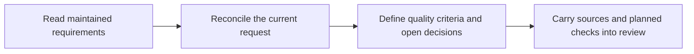

# ShipLoop requirements definition: investigation and validation

2026-09-17. Scope: defining non-functional requirements and incorporating a new
request into existing maintained specifications. The implementation puts explicit
requirements-definition work in the existing discovery, research and spec stages.
It introduces no graph node, result schema, additional scheduler or specification
store.

The current explicit request and later clarification of that same request replace
only conflicting older clauses. Compatible requirements, bounds, exceptions,
negative cases and cross-cutting policies remain applicable. A newer draft, observed
code or unverified host summary cannot silently replace accepted intent. Measured
baselines inform feasibility; they do not select a user's policy or prove a target.

## Plan and experiment design

The [preregistered plan](../test/experiments/shiploop_requirements/README.md) and
[oracle](../test/experiments/shiploop_requirements/oracle.md) freeze four cases:
preserve an existing contract, explicitly replace one latency bound, handle a
vague request with conflicting/missing sources, and keep a local CLI proportionate.

Requirements lived in real, linked fixture files. Fresh agents received actual
rendered protocol-3 packets, not requirements pasted into the task prompt. A
second fresh agent independently inspected the copied files when producing each
spec. Synthetic navigator predecessor state selected the relevant producer; no
callbacks, Improve campaign, live stage traversal, application implementation,
benchmark, browser session or deployment ran.

The study launched 18 participant contexts: four discovery, four cold spec, two
spec replications, two document edits, and six paired comparison attempts.
Seventeen produced all four requested artifacts. One comparison participant
exceeded its six-minute instruction window and, after a stop reminder and roughly
one minute of finalization overrun, was interrupted with no output. It remains
UNKNOWN; it was not replaced or rerun. Other timing records are completion
*detection* times, not independently verified provider runtimes.

Three independent semantic evaluator contexts graded the outputs. A separate
read-only code reviewer checked routing, integration and the proposed extra
paragraph. The host default model was used without overrides; exact provider
build and hidden reasoning were not controlled. At most four participants ran
concurrently. Instruction boundaries were not filesystem sandboxes.

## Observations and adjudication

| Experiment | Observed result |
| --- | --- |
| Discovery, four cases | Located the applicable sources, preserved quality conditions, distinguished drafts/code from accepted intent, and exposed conflicting or missing evidence. All four met the discovery-scoped criteria. |
| Initial cold specs | The override draft falsely called a nonempty license empty. The ambiguity draft omitted the unaffected user-controlled deletion exception for manually exported diagnostics. The preserve draft omitted the required license source-list entry; that is an inventory defect, not evidence of deleting the license. The proportional CLI draft met its applicable criteria. |
| Fresh spec replications | Override retained the contract. Ambiguity again omitted the exported-diagnostics deletion exception while preserving the disputed retention periods and other known conditions. |
| Actual document edits, two cases | Each changed only `docs/catalog-requirements.md`. Override changed 420 to 275 ms at the same workload; ambiguity retained 420 ms and recorded open decisions. License, export and diagnostics-policy files were byte-for-byte unchanged. One source inventory omitted the license, despite its actual preservation. |
| Paired comparison | The candidate ambiguity arm timed out; its original arm again omitted the diagnostic deletion exception. Both completed override arms preserved affected requirements, but only the original listed every required source. Both clarification arms used 250 ms; the original additionally documented rejecting the stale 900-ms host note. Neither listed the license in that case. No candidate benefit was established. |

Grading itself needed correction. The first evaluator treated not repeating an
unrelated license in a read-only draft as deletion of a contract clause. The
second correctly separated source inventory from document preservation, but
incorrectly cited another case's lines as evidence that the original ambiguity
draft preserved the deletion exception. The coordinator checked the exact file;
a separate correction restored C2 FAIL for that omission and confirmed the repeat.
All original grades and corrections remain available. No grade was silently
rewritten to make a trial pass.

## Implementation decision

**Retain the implemented NFR/spec-reconciliation guidance. Defer the additional
647-character pre-handoff checklist paragraph tested in the comparison.** The two
completed pairs favored the original on source-record completeness, and the
candidate did not produce an ambiguity artifact. This does not demonstrate that
the extra wording caused worse behavior, but it does not meet the preregistered
adoption condition. The paragraph remains only in external experiment inputs.
The missing ambiguity result is UNKNOWN; the evaluator's convenience “B winner”
field for its sole completed arm is not treated as a comparative win.

The repeated exception omission is a confirmed producer-draft limitation across
three original-guidance ambiguity attempts. It is not proof of deletion from a
maintained source, and actual document edits preserved that policy. The existing
Improve review must still challenge completeness; this study did not execute
that review or prove it catches the omission. No additional phase or state
machinery is justified by these observations.

The implemented [requirements-definition.md - reconciliation and quality criteria](../skills/shiploop/references/requirements-definition.md) establishes applicable source status and
natural maintained homes, records preserve/add/modify/retire decisions, defines
proportionate quality scenarios with workload and observable acceptance criteria,
and carries both new and preserved conditions into planning and Improve review.
Material uncertainty gates only dependent work; missing evidence is not N/A.
The authoritative home is edited narrowly when the active step permits edits.

Navigator protocols 1/2/3 carry the guide locator, and current/cold protocol-3
Improve context carries the review duty. Legacy packets deliberately select the
`requirements-definition` section of `behavioral-requirements.md`, whose direct
link routes to the full guide. Routing checks establish reachability, not model
compliance. The frozen model trials cover protocol-3 producers only.

Concurrent requirements/reference, UI and Backchain work changed the live package
after the study freeze. Those changes are preserved; the frozen behavioral results
must not be represented as model validation of every later merged prompt. Current
routing/integration checks are reported separately.

## Verification

123 checks passed across nine focused suites: navigator 36, navigator-v3 15,
discovery 27, reference-routing 8, navigator-dry-run 7, cross-run 11,
research-template 7, prompt-integrity 10, and the study helper 2. Initial failures
observed while concurrent reference/Backchain edits were incomplete were rerun
successfully after their owner finished integration. A mistyped dry-run filename
ran no tests; its launch-error log is retained beside the successful correctly
named suite. These counts are mechanical checks, not semantic experiment passes.

Ruff passed for the changed navigator/protocol modules and experiment helper.
`git diff --check` and `scripts/sync-plugin-views.sh --check shiploop` passed.
The independent code review found no broken legacy route or authority conflict;
its pending generated-package mismatch was closed by the successful parity check.
The source worktree contained other coordinated changes; this study had not
committed or pushed its artifacts when grading closed. The final source hashes and Git HEAD are retained in
`validation/final-source-receipt.json`, independently of the frozen trial snapshot.

No full repository aggregate, live Improve convergence, generated application,
Grok/Claude/Hermes execution matrix, hosted delivery or performance target was
validated by this study. Repeated producer omissions remain a reason to require
the existing independent review, not a basis to claim perfect prompt compliance.

## Provenance and locally retained evidence

Local study identifier: `nfr-spec-2026-09-17-mavqxmo6`.
The study custodian retains the raw evidence outside the repository. It is not
included in this publication, so the historical model outcomes cannot be fully
audited from these six files alone. The reusable helper and fixture definitions
support new discovery/spec trials; reproducing the exact historical comparison
also requires the separately retained frozen package and supplemental scripts.

- Frozen working-tree HEAD: `2db1f210f56a273dd877a33607d9152d601db5f8`.
  The package included uncommitted work; HEAD alone does not identify its contents.
- Frozen package inventory SHA-256:
  `dba4c46c2b7072b7a3c635d03e081b133d1e87388a83f1f9bbd7abae427d7b32`.
- Frozen requirements guide SHA-256:
  `1e178262b95d54ee846578a7909448b3a8f732a26b12d136636992aa4cd03989`.
- `manifest.json`, `frozen-inputs/`, and `frozen-skill/` retain initial inputs.
  `supplemental-setup.py` and `supplemental-manifest.json` prepared the repeats
  and document trials; the base helper handles discovery/spec only.
- `comparison-plan.md`, `prepare-comparison.py`, `comparison-manifest.json`,
  and the blinded condition-assignment mapping preserve the prospective comparison
  plan, exact candidate and randomized assignment. The mapping was withheld
  from the evaluator until grading finished.
- `audit-after-initial.json`, `audit-document.json`, and `audit-comparison.json`
  distinguish immutable inputs, permitted document edits and missing outputs.
  `comparison-input-audit.json` verifies matched repository content, predecessor
  notes and instructions after normalizing only root paths and synthetic IDs.
- `judges/` retains raw scores, adjudication and its correction. Participant
  outputs, exact producer packets and document diffs remain under `trials/`
  and `comparison/`; source reads are participant-reported, not an independent
  filesystem-access trace.
- `coordination.json`, `metrics.json`, and `validation/` retain launch/status,
  partial text-size measurements, test logs and the final source receipt.

The 17 completed participants produced 219,135 artifact characters, roughly
54,784 tokens using char/4. This excludes tool reads, reasoning and other output
and is **not billed token usage**. The candidate adds 647 guide characters,
roughly 162 tokens only if read. No latency or cost superiority is established.

## Publication follow-up

The stable NFR implementation is published in commit
`855040644721fd5451c3fd86e522e4499a8ebcad` on
`codex/shiploop-requirements-references`. This follow-up publishes the six study
files from an isolated checkout based on that commit, without importing unrelated
shared-worktree changes. The focused helper tests mock Git; real CLI initialization
and preparation are checked separately. Neither verification launches models.
