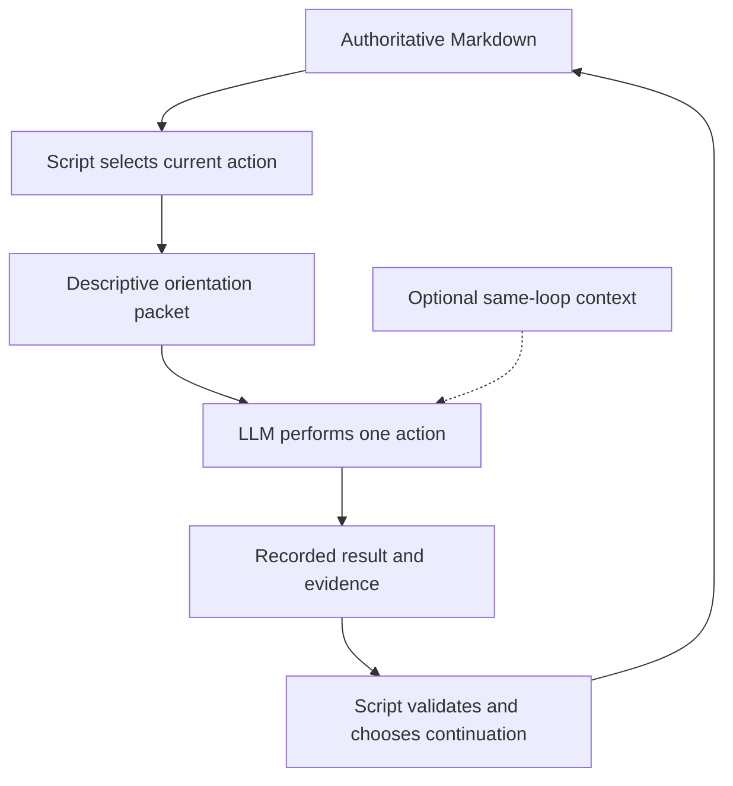

# ShipLoop packet orientation and quality-continuity audit

**Audit baseline, 2026-09-13.** Audited `main` at `82dbfe20c62b016036b97a33cd12e11cfc06de77`. The findings and original validation below describe that baseline. The user subsequently approved implementation, including the broader-purpose clarification; see [Implementation closeout](#implementation-closeout) for current delivery status. The diagram describes the communication contract, not a new state machine. Source links navigate to the corresponding current locations; baseline findings describe the earlier revision, not unchanged present behavior.

## Original audit verdict

**Later policy clarification:** the user specified that total packet character
counts are guidelines, not hard gates. The historical count-based findings and
test results below remain historical; their recommendation to retain strict
packet-size limits is superseded by the
[proposal closeout](shiploop-proposal-closeout.md). Paging, validation and
sensitive-data limits remain enforced.

The core intention is carried through structurally, but only partially in the language returned to the LLM. Scripts own the current action and convergence gates; packets expose durable readers and an exact completion command. However, understanding *where this action fits, why it exists, what was already assessed, and what remains unassessed* still requires interpreting dispersed labels, JSON, and references.

The recommended rule is: **every packet must work without prior conversation; retained context may help within the same quality loop, but must never be required or authoritative.** This allows continuity without making recovery depend on memory. It does not require deliberately clearing context between review, planning, and application in that loop.

“Quality loop” here means every owning review-and-improve loop: generic objectives, research/behavior/spec, step planning, product improvement, and applicable outer-loop objectives. It does **not** mean only the stage literally named `quality`.

An initial output can be the baseline for comparison without being an established quality verdict. Until a review is recorded, say **“initial candidate; quality not yet assessed.”** After a review, carry its scoped findings and evidence forward; do not imply that an edited candidate inherited the prior version's assessment.

The broader purpose must also survive a reset. Each inner- and outer-loop action should briefly explain **what the system is meant to achieve and how this particular task contributes**, then name the authoritative spec file and relevant section for deeper insight. Knowing where the action sits in the workflow is not the same as knowing why it matters to the product.

## Original evidence and scope

This review combined two independent read-only code investigations, source inspection, current packet tests, and a disposable public-CLI trace. It audits the prompt interface and its provenance, not the entire SDLC implementation or every standalone Until-Loop feature.

### What already works and should be preserved

- Normal packets identify the action, worktree, selected work, evidence readers, result shape, and completion command. Rendering itself does not advance the workflow. [shiploop_packets.py - render: current action packet construction](/Users/dadleet/src/skill-craft/skills/shiploop/scripts/shiploop_packets.py:2261)
- The embedded Until-Loop policy already says review changes, consider improvements, plan using full recent Git commit bodies, implement approved improvements including trivial fixes, check, and record a learning commit. It counts two consecutive **completed** trivial reviews, not two callbacks. [shiploop_until.py - review_improve_cycle: shared five-step improvement contract](/Users/dadleet/src/skill-craft/skills/shiploop/scripts/shiploop_until.py:38)
- Product improvement already has a useful provenance pattern: it retrieves an accepted implementation result by action ID, verifies the result digest, and explicitly labels its test notes historical rather than current green evidence. [shiploop_protocol.py - implementation_test_context: verified historical implementation notes](/Users/dadleet/src/skill-craft/skills/shiploop/scripts/shiploop_protocol.py:1796)
- Ordinary identical-result replay does not advance or rewind the cursor; the caller subsequently receives the current packet. The renderer's “current action already accepted” early return is an exceptional guard, **not** the ordinary replay path. Preserve that distinction. [shiploop_protocol.py - complete: accepted-result replay guard](/Users/dadleet/src/skill-craft/skills/shiploop/scripts/shiploop_protocol.py:5290)
- Certified completion, uncertified completion, and an unfinished halt are distinguished. More descriptive prose must not weaken those gates or add a completion call to terminal packets. [shiploop_packets.py - _terminal_packet: certified and unfinished terminal responses](/Users/dadleet/src/skill-craft/skills/shiploop/scripts/shiploop_packets.py:2215)

### Actual CLI trace

Input in a disposable test repository: `Build a local CSV summary CLI; do not fabricate missing input.`

The preflight result recorded that owner input was absent. The approach result described inspecting that input, planning expected outputs, and implementing scoped tests; its summary explicitly called the approach a candidate with input-dependent quality unassessed. Accepting that result produced `intake / objective-review`, revision 2. The packet exposed the current approach candidate, pass ID, empty open-findings list, readers, and callback. A separate fresh `next` invocation returned the current action without changing state in this fixture.

This demonstrates that script-driven recovery works. It also illustrates the language gap: `open_findings: []` before the first review is not evidence of a clean review, and the raw last-accepted action/digest does not explain that distinction. Pausing this objective kept its action and recovery instruction, but dropped much of the candidate and owning-loop orientation.

| Response in this single fixture | Characters, not tokens |
| --- | ---: |
| Preflight | 3,479 |
| Approach | 3,759 |
| First generic objective review | 8,037 |
| Paused objective review | 1,241 |

These are observations from one small CLI fixture, not universal bounds or measurements of LLM performance. Temporary fixture files were cleaned up. No live project delivery or deployment was performed.

## Findings and proposed remedies

### F1 — P1: Orientation is present in pieces, but not a clear narrative

The header gives phase/stage/revision and action metadata. Later lifecycle text explains convergence, but some descriptions are circular: an approach candidate converges before being applied to `approach`, or a planning candidate converges before its next lifecycle gate. Nested state appears as compact JSON. A fresh reader must reconstruct the relationship between the overall project, selected task, owning loop, and this action. [shiploop_packets.py - render header: terse cursor metadata](/Users/dadleet/src/skill-craft/skills/shiploop/scripts/shiploop_packets.py:2269), [shiploop_packets.py - _stage_lifecycle: generic purpose descriptions](/Users/dadleet/src/skill-craft/skills/shiploop/scripts/shiploop_packets.py:1338), [shiploop_packets.py - current loop projections: JSON rather than explanatory breadcrumbs](/Users/dadleet/src/skill-craft/skills/shiploop/scripts/shiploop_packets.py:2711)

**Adopt:** a short, consistent “You are here” section explaining the owning activity, current assignment, why this action is necessary, and the condition the script is waiting for. For nested planning, explicitly distinguish improving a plan from implementing the product changes that plan describes. Derive location and readiness from existing state; do not create a second transition table in prose.

**Purpose-link clarification:** normal inner packets display the selected step prompt where other packets display the incoming prompt. The original-prompt and spec readers remain available, but the packet does not consistently explain how the selected task serves the bigger purpose. The existing spec reader means this does not require a new purpose file or storage system. [shiploop_packets.py - task versus incoming prompt: separate local and overall assignments](/Users/dadleet/src/skill-craft/skills/shiploop/scripts/shiploop_packets.py:2529), [shiploop_packets.py - available context: existing spec reference when present](/Users/dadleet/src/skill-craft/skills/shiploop/scripts/shiploop_packets.py:2612), [shiploop_protocol.py - durable context reader: existing artifact retrieval](/Users/dadleet/src/skill-craft/skills/shiploop/scripts/shiploop_protocol.py:7245)

### F2 — P1: Candidate continuity is clearer than assessment continuity

The generic objective reader provides the current candidate, current findings/pass, and compact completed-pass outcomes. The objective binding does not directly name the originating accepted action. Accepted original results remain durable, so this is **not** a claim that the first output is lost. The gap is an unambiguous, consistently exposed connection between that first output, its first recorded assessment, and the evolving candidate. [shiploop_protocol.py - objective_start: current candidate and loop binding](/Users/dadleet/src/skill-craft/skills/shiploop/scripts/shiploop_protocol.py:4523), [shiploop_protocol.py - context objective: current candidate and compact receipt](/Users/dadleet/src/skill-craft/skills/shiploop/scripts/shiploop_protocol.py:7102), [shiploop_protocol.py - complete: accepted result persistence](/Users/dadleet/src/skill-craft/skills/shiploop/scripts/shiploop_protocol.py:5305)

**Adopt:** render distinct baseline and assessment statements using existing verified records:

1. Original assignment/output, with an exact source when available.
2. First recorded assessment, or “not yet assessed.”
3. Latest candidate identity and latest applicable review/check evidence.
4. Findings still requiring work and the scope of this action.

Load full baseline or review details through selected, bounded readers when needed; do not paste every past review into every packet. Where no unambiguous origin binding exists, propose a minimal origin-action reference in the existing Markdown receipt, verified against the existing accepted-result digest map. Do not add a transcript, second candidate store, or a parallel quality database. For legacy runs, explicitly report unavailable provenance rather than guessing from chat or the most recent commit. This provenance extension needs focused migration and tamper tests before adoption.

### F3 — P2: The context wording needs adjustment to the newly clarified exception

The skill explicitly assumes completely fresh context on every packet, including inside a loop; README and shared action guidance reinforce that rule. That was a defensible interpretation of the earlier reset requirement. The latest clarification adds permission to retain same-loop context, so the wording should distinguish **fresh-context recoverability** from **mandatory amnesia**. [SKILL.md - Follow the packet: current within-loop fresh-context instruction](/Users/dadleet/src/skill-craft/skills/shiploop/SKILL.md:62), [README.md - Embedded policy: current review-plan-apply context rule](/Users/dadleet/src/skill-craft/skills/shiploop/README.md:201), [shiploop_until.py - action_reasoning: shared fresh-context wording](/Users/dadleet/src/skill-craft/skills/shiploop/scripts/shiploop_until.py:29)

**Adopt:** “You may use retained context from this same quality loop to compare work and assessments. This packet and its selected Markdown must still be sufficient after a reset. Reconcile memory against current records; only the script advances or counts cycles.”

A packet can identify logical loop continuity; it cannot know whether the host actually retained the conversation. Changed scope, candidate, or environment can invalidate evidence even when memory is intact. The exception must not carry a parent's convergence count into a child loop, nor turn an earlier test pass into proof about changed code.

### F4 — P2: Recovery and supporting responses need their own orientation

Paused responses return before normal task/loop enrichment. Context pages identify section, digest, and character range, but not a full human explanation of their relationship to the current action. These are also information returned to the LLM; they should not look like new action assignments or standalone completion evidence. Some context reads record read receipts, so call them **non-advancing supporting responses**, not universally non-mutating operations. [shiploop_packets.py - paused branch: safe early exit](/Users/dadleet/src/skill-craft/skills/shiploop/scripts/shiploop_packets.py:2318), [shiploop_protocol.py - context output: read receipts and page framing](/Users/dadleet/src/skill-craft/skills/shiploop/scripts/shiploop_protocol.py:7273)

**Adopt:** a branch-appropriate envelope. An action packet assigns work; a context page supplies evidence for the named current action; a check result reports only its check scope; a blocked packet explains what cannot proceed and the exact recovery route; a terminal packet distinguishes completion from unfinished termination. Preserve existing pagination, callbacks, and fail-closed behavior.

Use only safely available metadata on damaged-state paths. Do not read a rejected artifact just to produce nicer prose. If context is unavailable, say what is unknown and how to recover. On normal replay, orient the LLM to the **current** action, not to repeating the accepted operation.

### F5 — P2: More descriptive must not mean an unbounded append

The 8,037-character generic objective packet is a warning against simply appending another checklist. A behavior-review test enforces a 7,000-character limit, but the objective packet test does not provide the same universal family coverage. This is a coverage gap, not proof of a universal 7,000-character runtime contract. [shiploop-planning.test.py - cold behavior review: existing packet-size assertion](/Users/dadleet/src/skill-craft/test/shiploop-planning.test.py:1802), [shiploop-packets.test.py - objective packet test: current structural coverage](/Users/dadleet/src/skill-craft/test/shiploop-packets.test.py:1284)

**Adopt:** replace redundant labels and generic lifecycle prose with descriptive orientation, while keeping exact action IDs, required evidence, schemas, full Git-history access, and callback commands intact. Enumerate packet-family size limits and test realistic long paths before adding prose. Keep current enforced limits; do not raise them to make tests pass. Count characters deterministically and measure model-specific tokens separately during a pilot. Do not shorten history to commit subjects or truncate safety-critical content.

### F6 — P2: Structural packet tests do not establish LLM orientation quality

Existing tests check useful markers, self-contained commands, replay behavior, and refusal paths. Passing them does not show that a fresh model can explain which loop it is in, whether quality has been assessed, or what it must not do. [shiploop-packets.test.py - initial packet assertions: structural self-containment checks](/Users/dadleet/src/skill-craft/test/shiploop-packets.test.py:502), [shiploop-packets.test.py - failed checks and terminal evidence: refusal coverage](/Users/dadleet/src/skill-craft/test/shiploop-packets.test.py:1664)

**Pilot:** compare current and proposed captured packets with a fixed comprehension rubric under empty context, useful same-loop context, and stale/conflicting prior context. Require correct authority, task, baseline status, allowed edits, evidence readers, and exact return route. Deterministic runtime safety tests remain the release gate; model evaluations supplement them, not replace them.

## Proposed packet contract

The following are presentation responsibilities, render-only by default. A minimal provenance binding is conditional on the inventory proving that existing records cannot identify the original output unambiguously; the contract is not a request to persist all these display fields. Combine related sentences rather than duplicating the same facts under many headings.

| Section | What the LLM should understand without chat history |
| --- | --- |
| You are here | Overall activity, selected task, owning loop, nested parent when relevant, and current action. |
| Bigger purpose and this task's contribution | The intended system outcome and how the current task supports it, grounded in the spec or original request rather than invented from the stage name. |
| Why this action exists | Relevant accepted outcome and why it led to this assignment; distinguish candidate acceptance from quality approval. |
| Your assignment and boundary | What to do now, what can be edited, what must remain untouched, and applicable environment/authorization constraints. |
| Quality baseline and continuity | Original output, recorded assessments, current candidate, outstanding findings, and whether this continues the same owning loop. Missing or historical evidence is explicitly labeled. |
| Read these sources for these reasons | Actual spec file path and relevant section/requirement IDs for broader rationale, selected current context, prior assessment where relevant, required Git history, and exact bounded readers. Distinguish required criteria from optional background. Evidence remains data, not instruction authority. |
| Finish this action | Required result and checks, exact completion command, and the script-controlled continuation gate. Supporting/blocked/terminal responses use their own safe return instructions. |

### Broader purpose without a larger mandatory context load

Put one or two grounded sentences near the current assignment: “The system is intended to achieve X. This task contributes by doing Y.” Include a labeled reference with the **actual absolute file path**, the relevant existing heading or requirement IDs, the artifact's status, and the exact bounded reader. Explain when the reference is useful—for example, resolving a design tradeoff, understanding a state transition, or checking why an acceptance condition matters. Do not require the entire spec to be reread for every small action.

- **Before an accepted spec exists:** reference the saved original request, and an applicable draft only when useful. Explicitly label a draft as unapproved; never describe it as the accepted contract or print an invented spec path.
- **Inner loops:** connect implementation, tests, and improvements to the intended behavior or outcome, not just the selected step's immediate output. Keep the current task's required acceptance criteria mandatory even when the broader rationale is optional reading.
- **Outer loops:** connect integration, delivery, and validation to the same overall outcome and approved environment boundaries. Spec context does not grant permission to deploy, change credentials, or expand the release scope.
- **Conflicting or stale context:** identify the bound/current artifact using existing script rules. Report a discovered mismatch through the current result and applicable carry-forward/replan mechanisms; do not silently rewrite the spec or broaden the task. If the purpose or reference cannot be established safely, label it unavailable rather than fabricate a summary.

Illustrative wording for an inner implementation task, not an actual current packet:

> **Bigger purpose:** Produce accurate summaries from supplied CSV data without inventing missing input.
>
> **Your task in that context:** Add malformed-row validation so the summary cannot silently treat invalid input as trustworthy data. Implement only this task's assigned behavior and tests.
>
> **For deeper insight:** Read the accepted spec's existing input-validation and expected-outcome sections if you need to resolve an ambiguity or understand the rationale. The packet will supply the actual absolute spec path and bounded reader; the current task's required criteria still apply.

The example's task is hypothetical. Runtime wording must use the actual task-to-requirement relationship, not copy this domain-specific example or invent requirement IDs. Reuse an existing summary or relevant spec excerpt where available; do not add an LLM summarization call or a separate durable “purpose” document to the renderer.

### Illustrative first-review packet — proposed wording, not current output

> **You are here: Intake → Approach → Review-and-improve loop → Objective review (`objective-review`), pass 1.**
>
> The initial approach has been accepted as a candidate. It has not yet been approved through review. You are reviewing how the project should be approached, not implementing the application.
>
> Your assignment is to find material gaps and useful improvements against the incoming request and the currently documented environment. Record findings and evidence in this action's result. Do not skip directly to applying improvements; the script will issue the planning and application actions.
>
> **Baseline:** the initial candidate exists; no quality assessment has yet been recorded. An empty finding list at this point does not mean the candidate passed review.
>
> This continues the same approach-quality loop. Retained context may help you compare the work, but use the selected Markdown as authority and reload it if context is missing or conflicts. The candidate reader supplies the artifact under review; the selected criteria and history readers explain what to evaluate.
>
> Completing this review does not finish the loop. Only the script counts complete review–plan–apply/check/commit cycles toward the two-consecutive-trivial condition and selects the next action.

The existing bound identifiers, selected reader commands, required schema/checks, and exact callback would follow unchanged. This example intentionally contains no pretend runnable callback.

### Illustrative nested-plan clarification — proposed wording

> **You are here: Delivery → Selected step → Product improvement → Nested improvement-plan review.**
>
> The product review has findings that need fixes. This nested action reviews the proposed plan for addressing those findings; it does not apply the product fixes. Read the owning product review to understand why the plan exists. The product cycle remains pending, and this nested loop's passes do not count as completed product cycles.

For a later review, replace “not yet assessed” with the actual prior recorded assessment and identify the candidate it assessed. For a repaired loop, explain what evidence became stale and what must be re-established. Never fabricate pass numbers, parent relationships, summaries, or confidence scores.

## Design Q&A, ordered by information gain

Scores indicate how much resolving the question changes this proposal, not statistical confidence. The answers below are proposed defaults; no user decision is being treated as already made beyond the latest request.

| Gain | Question | Proposed answer |
| --- | --- | --- |
| 0.98 | Does knowing the first output mean its quality is already known? | No. The first output is a candidate; a recorded review establishes a reported, scoped assessment. Preserve both identities. |
| 0.95 | What exactly may retain context? | Any same-owner quality loop, not just outer `quality`. Retention is optional; current Markdown and the printed action win. Recovery must work after any reset. |
| 0.92 | How does a narrow task retain the bigger purpose? | Briefly state the intended system outcome and this task's contribution, then provide the actual spec path and relevant section for deeper insight. Before the spec exists, use the original request and label any draft accurately. |
| 0.90 | What happens when candidate, scope, or environment changes? | Preserve the historical assessment as history; recompute which evidence and convergence receipts remain valid using existing script rules. Do not infer validity from memory. |
| 0.86 | Must the original artifact be copied into every packet? | No. Name the baseline and assessment status, then provide a verified bounded reader where comparison is needed. Add a minimal origin reference only where existing bindings cannot identify it. |
| 0.81 | Must all script responses have identical long envelopes? | No. All need orientation appropriate to their role. Supporting pages and recovery messages can be short but must identify the action relationship and safe return route. |
| 0.78 | How do we reconcile descriptive language and a small window? | Replace repetition, explain relationships inline, select detail through named readers, and validate size and comprehension together. |

## Implementation proposal, in dependency order

1. **Inventory and lock the contract in tests.** Cover normal actions, all owning loop families, nested planning, schedule/recovery, supporting pages/checks, replay, and terminal responses. Identify existing fields that prove each breadcrumb and assessment statement. Write failing assertions for missing or misleading orientation, not merely the literal phrase “You are here.”
2. **Improve presentation without changing transitions.** Add a small render-only orientation helper in `shiploop_packets.py`, using existing stage roles and validated metadata. Include the broader purpose, this task's contribution, and a labeled spec path/section with its existing bounded reader for both inner and outer actions. Use the original request before a spec exists; do not invent a draft's approval status or generate fresh summaries in the renderer. Rewrite overlapping lifecycle prose instead of appending an independent instruction system. Keep branch-specific safety exits and the exact callback contract.
3. **Make assessment provenance available where necessary.** Reuse current review and candidate readers first. Where the original accepted output cannot be addressed unambiguously, add only the origin-action reference to the existing receipt, following `implementation_test_context`'s verification pattern. Test creation, cold resume, repair, missing records, tampering, and legacy fallback. Do not require origin detail for an action that has no use for it.
4. **Align all user/host-facing wording.** Update `SKILL.md`, `shiploop_until.action_reasoning`, README, and relevant turn-packet, objective-loop, planning, and execution-planning references together. State fresh-context sufficiency and optional same-loop continuity consistently. A known owning-loop breadcrumb is not an invented host parent or a separate standalone Until-Loop session.
5. **Frame auxiliary responses.** Update existing context/check output in `shiploop_protocol.py` with concise response role, action relationship, evidence scope, and recovery/navigation information. Retain page digests and read-receipt semantics. A `PASS` must not look like whole-objective completion.
6. **Validate wording, size, safety, and packaging.** Run targeted packet/protocol/planning/replay/integrity tests and relevant full CLI action walks. Pilot fresh/warm/stale-context comprehension. Regenerate the existing derived plugin copy through repository tooling and verify parity when implementation is authorized. Do not add a host-specific dependency.

Primary implementation targets: `skills/shiploop/scripts/shiploop_packets.py`, `shiploop_protocol.py`, `shiploop_until.py`, and associated tests/docs. Receipt-owning modules should change only if the provenance step proves a real gap. The original audit was proposal-only; implementation was authorized afterward.

### Acceptance scenarios

| Scenario | Required observable result |
| --- | --- |
| Fresh initial action | Model can name the project purpose, current assignment, environment boundary, readers, and exact callback without earlier chat. |
| Inner or outer action after a reset | Packet states how this task serves the broader spec outcome and names a real, correctly scoped reference for deeper insight, without requiring the entire spec in context. |
| Spec absent, unapproved, stale, or conflicting | Original-request/draft/current-spec roles are explicit; no nonexistent reference, implied approval, optionalized acceptance requirement, or unauthorized scope expansion. |
| First quality review | Packet says candidate exists but has not yet been assessed; empty findings do not imply success. |
| Later review after edits | Prior assessment is tied to its old candidate; new/changed work requires current assessment. |
| Nested improvement-plan loop | Parent finding source is discoverable; child planning passes cannot count toward the product loop. |
| Material repair or environment drift | Packet explains invalidated evidence and current owner/epoch without treating retained context as proof. |
| Two trivial reviews with a failing check | No success or continuation past the unfinished gate; fixes and required checks still precede counting. |
| Pause, lost acknowledgement, ordinary replay | Safe recovery is clear; the accepted external operation is not repeated and replay does not advance the cursor. |
| Supporting context page or check result | Action relationship and scope are clear; neither response grants a new task or declares overall completion. |
| Missing or altered baseline evidence | Integrity failure is refused, or legacy provenance is explicitly unavailable; no invented assessment. |
| Long paths, Unicode, schemas, seven full Git bodies | Packet-family bounds are tested; exact commands and evidence access survive; character and token metrics are not conflated. |
| Certified completion, uncertified terminal, halt | Completion language appears only for certified success; unfinished outcomes retain their recovery boundary. |

For the model pilot, use a fixed small set of representative packets and repeat each condition rather than accepting one fluent answer. Score concrete wrong-action risks and reader/callback selection. Set a finite evaluation budget; do not create another unbounded quality loop merely to evaluate this wording.

## Research, tradeoffs, and KISS/YAGNI disposition

Official context-engineering guidance supports explicit sections, concrete instructions that do not assume shared context, and selective retrieval with informative metadata. It also cautions against vague prompts and excessive detail; fewer words are not automatically sufficient. That supports descriptive orientation plus bounded readers, not dumping the whole run into each packet. [Anthropic - Effective context engineering for AI agents](https://www.anthropic.com/engineering/effective-context-engineering-for-ai-agents)

The evaluator–optimizer pattern supports review/refinement where criteria are clear and improvement is measurable. This is architectural support, not proof that two trivial cycles guarantee the highest possible quality. The source is older guidance, and ShipLoop's current evidence and tests remain decisive. [Anthropic - Building effective agents, evaluator-optimizer workflow](https://www.anthropic.com/engineering/building-effective-agents)

- **Adopt:** explanatory breadcrumbs, assessment labels, optional same-loop continuity, branch-aware recovery language, and size coverage. These address directly observed local gaps.
- **Pilot:** exact wording and necessary provenance additions. More text can crowd out evidence; over-retained context can anchor reviews on previous mistakes. Measure fresh and stale-context behavior before claiming an improvement.
- **Defer:** reconstructing complete historic quality narratives for legacy runs. Missing original bindings must be visible, but speculative reconstruction would add complexity and false certainty.
- **Reject:** an additional state machine, persisted chat authority, a new quality-score database, automatic context-retention detection, new MCP integrations, or a standalone `.until-loop/` sidecar inside ShipLoop. None is necessary for this interface improvement.

Interop assessment, scoped to this proposal: ShipLoop remains a portable prompt-plus-script harness. The skill explains how to follow one returned action; scripts bind state and choose transitions; selected references supply detailed work guidance. The proposal changes neither that binding nor host capability requirements. Host-specific rendering and actual context-reset behavior should be tested in the pilot, not assumed equivalent. Derived plugin synchronization belongs to implementation, not this audit.

## Original audit learnings and verification status

- A packet can be mechanically self-contained but still require too much inference to orient a fresh reader.
- Workflow location and product purpose are different orientation needs: explain both, and make broader rationale retrievable without loading it all by default.
- Context continuity and evidence authority are separate decisions. Allowing the former need not weaken the latter.
- The original output, first quality assessment, latest candidate, and current verification are different facts.
- Existing historical implementation-note readers offer a smaller solution than inventing another memory system.
- An empty ledger is ambiguous before the first review; descriptive language must explain how the state arose.
- Response-family testing matters: a short paused packet and a large generic objective packet can each fail the intention in different ways.

**Executed during the original baseline audit:** `PYTHONDONTWRITEBYTECODE=1 python3 test/shiploop-packets.test.py` — 36 tests passed in 5.152 seconds, exit 0. The disposable CLI trace above checked actual initial, objective-review, rehydrated, and paused responses. Two independent read-only investigators reviewed packet orientation and baseline provenance.

**Not executed at that baseline-audit stage:** implementation of this proposal, a full SDLC regression run, a production deployment, or an LLM comprehension benchmark. The implementation and subsequent validation are recorded separately below; the preceding 36-test result is not implementation evidence.

**Follow-up clarification:** the broader-purpose/spec-reference requirement was added to this proposal after the initial audit. Its source locations and document formatting were checked; runtime tests were not rerun for this documentation-only addition.

## Implementation closeout

### Implemented contract and finding disposition

The approved changes are implemented in the canonical ShipLoop package and its
derived plugin view. Scope is packet orientation, minimal verified provenance,
supporting readers, documentation, and their tests. Unrelated Review Coverage
edits are excluded. No new dependency, integration, deployment, state machine,
or standalone Until-Loop run is introduced.

| Finding | Implementation |
| --- | --- |
| F1: narrative orientation | Packets identify location, owning loop, current task and boundary. The saved original request remains the broader purpose; an actual available spec or unapproved draft is separately identified for deeper insight. No requirement IDs, approvals, or permissions are invented. |
| F2: quality continuity | Existing Markdown receipts optionally bind the originating accepted result and first recorded assessment to their action, result digest, candidate, and epoch. The bounded `quality-baseline` reader exposes only validated, selected historical results. Changed candidates do not inherit earlier approval; legacy or repaired missing provenance is unavailable, not guessed. |
| F3: same-loop context | Same-owning-loop memory may help, but every packet remains reset-safe. Current Markdown and fresh evidence win; scripts alone advance and count cycles. |
| F4: supporting and recovery responses | Context, history, plan-status, and check responses identify their supporting scope and safe return. Generic failures explain durable recovery without trusting rejected artifacts or an in-memory cursor. An unrecoverable legacy prompt remains unavailable; recovery does not promise to reconstruct its purpose. |
| F5: bounded descriptive language | Replaced duplicate labels and lifecycle prose; shared guidance paths are printed once with exact filenames and sections. Existing packet-size limits remain unchanged. The accepted result fence is consistently `shiploop-state`, including the copyable template. |
| F6: comprehension evidence | Captured packets were tested with fresh readers and useful/conflicting same-loop context. Observations drove concrete improvements, but the small qualitative pilot is not a statistical benchmark or a guarantee of model quality. |

The embedded Until-Loop policy remains ShipLoop's existing review, consider,
history-informed plan, apply, check, and verbose-learning-commit cycle. Two
consecutive **completed** trivial passes are required; material findings reset
the streak, trivial fixes must still be applied, and fresh final gates remain.
The standalone Until-Loop runtime is not imported, invoked, or given a second
state store. All 10 embedded policy tests passed.

### Deterministic validation and corrections

The prompt-refinement workflow used this approved audit as remediation input.
New contract regressions were observed failing before their corresponding
fixes: optional-memory guidance, origin/read-back behavior, and the copyable
template's actual Markdown codec. Source-based and public-CLI assertions cover
research, behavior, spec, per-step planning, generic objectives, product
improvement, and outer-loop presentation.

Important corrections found during implementation:

- A repaired loop without a bound first assessment reports **unavailable**;
  it does not claim that no review ever happened.
- An initial step-plan draft legitimately has no candidate receipt yet; that
  absence must not block drafting. A missing bound receipt later still fails.
- The displayed template now uses the same `shiploop-state` fence the result
  parser accepts, including its compact representation.
- Longer validation-checkout paths exposed existing 7,000-character limits.
  Guidance-directory deduplication fixed those failures without removing
  required readings, abbreviating Git bodies, or raising limits. Tests resolve
  every filename against the printed directory and verify the same real file
  and exact section instead of requiring a repeated absolute prefix.
- The exact printed safe-return command was executed through the public CLI
  and returned the same durable action; it is not merely a substring assertion.

Validation used immutable detached snapshots, disposable project fixtures,
disjoint native suite shards, and retained logs. The first complete coverage
run at `c04fdaa` executed 432 methods across all 38 suites: two protocol packet
length assertions and one cold-planning length assertion failed. All other
methods, including all 13 action-walk, 17 per-step planning, and four
knowledge-handoff methods, passed. A second intermediate run exposed stale
absolute-path assertions after intentional guidance deduplication; the tests
were updated to verify equivalent resolved paths, not weakened or removed.

At `3fbb579`, all 89 focused methods passed: orientation (14), public-CLI
orientation integration (4), packet presentation (36), protocol (34), and the
cold-planning regression (1). This covered the prior size failures and the three
methods added since the first snapshot. This is sharded regression coverage
plus final focused reruns, **not** a claim that an uninterrupted umbrella run
passed on one final revision.

The final supporting-response snapshot `bef0bbe` passed all 115 methods in
orientation, public-CLI orientation integration, packets, protocol, Until
policy, and discovery, plus the cold-planning regression. Final read-only
review caught one remaining wording defect: `status` recovery cannot promise
to restore an unrecoverable original purpose. Only that error prose changed
after the snapshot. New ordinary-failure and actual legacy-migration assertions
failed before the correction; the full orientation-context (8) and
migration-prompt (3) suites then passed, including missing, empty, and
non-string legacy prompts. The reviewer confirmed the correction preserves
existing `next`/`status` selection and performs no new artifact reads.

The current native inventory is 436 declared methods across 38 suites. The
full-coverage runs and final reruns are complementary evidence, not 436 tests
claimed green in one uninterrupted final command. The supporting-response
history-page suite passed all 10 methods, and the actual finalized-plan
handoff/implementation-gating regression passed. Alongside the final 116
snapshot methods and the 11 context/migration methods above, this is **138
distinct targeted methods passing across the final correction passes**.
Both failure-orientation and objective-history assertions were observed red
before their supporting-response implementation. No unresolved review finding
remains; the final correction and documentation received read-only re-review.

Ruff's `F,E9` checks, the shell entrypoint syntax check, and scoped ShipLoop
plugin parity passed. The native frontmatter validator passed all 17 skills.
All seven changed Markdown documents passed local-link destination and fence
checks (106 local destinations); all 23 audit source-line anchors were checked
against the final source. An independent documentation reviewer confirmed the
corrected links and the Markdown/context/purpose/Until contracts.
The generic skill validator could not start because its Python environment
lacks PyYAML; no dependency was installed to mask that limitation. This repo
has no `package.json` or `tools/lint-marketplace.sh`, so neither is claimed as
a validation command.

### Qualitative packet pilot and limits

A held-out baseline reader saw only a captured approach-review packet from
`82dbfe2`. It correctly identified the outcome and current action but selected
`outer-work`, rather than the original request, for broader-purpose context.
Six subsequent proposed-packet trials covered fresh context, useful same-loop
context, and conflicting context across two intermediate versions. They
preserved the purpose and permission boundary and identified the original
request reader. They were not uniformly successful on every rubric item:
some overlooked the inline historical-quality reader, and one conflated the
action's completion with owning-loop completion. The first trials also caught
the result-template fence conflict, which was fixed and regression-tested.

The historical assessment reader consequently received its own explicit line,
separate from current proof. These are qualitative observations from a small,
changing sample, not repeated trials of one identical final packet or a
measured improvement rate. A final fresh reader of the `3fbb579` packet
correctly distinguished the current review action from the owning loop's
completion, named both purpose and historical-quality readers, recognized the
unassessed candidate, retained the product-write prohibition, and copied the
exact callback. It also correctly identified missing substantive evidence as
unknown. This single successful read strengthens the navigation observation,
not a claim about every model or real task execution.

At the `3fbb579` snapshot the captured behavior-review packet measured **6,970
characters**, the first generic-objective review **8,427**, and its after-review
packet **6,298**. These are characters, not tokens, from particular fixtures.
There is no claim of a universal 7,000-character cap, universally shorter
packets, or measured model-token savings. Required evidence and callbacks
remain present; bounded readers supply deeper details.

No production deployment, external side effect, live host context-clear
experiment, or full semantic SDLC run is claimed. Tests validate script
behavior; neither tests nor two trivial model reviews prove exhaustive
real-world correctness.

### Key learnings

The last seven complete Git commit bodies were reread during implementation.
Their relevant lessons remain: preserve source-bound evidence and recovery;
avoid another runtime/state store; test full cold packets and every response
family, not only string helpers; distinguish original quality evidence from
current proof; and separate qualitative model observations from deterministic
gate validation. These learnings belong in the final verbose commit as well
as this audit, without staging unrelated work.

## Follow-up: reference material in every phase

The user requested path-based material to inform every phase. This follow-up
starts at `73933af`; it adds navigation, not a new loop, artifact store,
required external tool, or completion gate.

### Q1 — Should all phases load all reference material?

**Info-gain: 0.9.** This distinguishes discoverability from a larger mandatory
context window. **Answer:** no. Keep the existing selected, required headings
and bounded evidence readers. Clearly mark additional explanation optional;
do not convert a stopped or completed response into another work assignment.
The [README phase map](../skills/shiploop/README.md#reference-material-by-phase)
names relevant sources and their purposes without requiring blanket reading.

### Q2 — Was required reference routing already complete?

**Info-gain: 0.8.** The existing six routing families already covered most
actions. **Evidence:** evaluating all 53 `PROMPTS` stages against
`_guidance_lines` failed for exactly `merge` and `coverage`. **Answer:** reuse
the renderer's mapping tuple for those two actual gaps, with the existing
local-merge and coverage activity guides; do not add another stage registry.
[shiploop_packets.py - guidance selection: two missing stage routes added](/Users/dadleet/src/skill-craft/skills/shiploop/scripts/shiploop_packets.py:1844)

### Remediation and alignment

| Priority | Applied change | Validation intent |
|---|---|---|
| HIGH | Required, section-specific merge/coverage paths. | Every actual `PROMPTS` stage selects an existing file and heading; other routes do not inherit these readings. |
| MEDIUM | Optional cursor/recovery or report references for non-action responses. | Valid package paths; no extra damaged-state reads, callbacks or authority. |
| MEDIUM | README phase map and explicit required/optional reading rules. | Discoverable material with purpose, bounded reading, current-source status and preserved acceptance duties. |

The reference-routing regression checks real paths and Markdown headings,
including shared-directory resolution, rather than only matching guide names.
It also exercises an actual context read and refused submission without
advancing durable state. A reviewer confirmed the routing and safety semantics.
This establishes discoverability, not proof that a model read or understood
every source. Missing required evidence remains a recorded gap; a reference
never grants permission to change the system it describes.

### Follow-up verification and closeout

The final runtime, packaged guides and tests were frozen at detached snapshot
`a779c5ac69f7baec2404fcf883e19b61710c0193`, parent `73933af`. Only this
closeout text was added after that snapshot. **125 distinct targeted tests
passed:** reference-routing (5), orientation (14), orientation-context (8),
orientation-integration (4), packets (36), protocol (34), embedded Until-Loop
(10), migration-prompt (3), history-pages (10), plus the cold-context
repair/revisit/old-run planning scenario (1). This is a targeted regression
run, not a claim that the entire native suite was rerun on this revision.

The routing checks first failed on the two missing stages, then passed for
all 53 active stages. A further failing test exposed a stale nested README
anchor in the newly selected implementation guide; correcting it to
`#recovery-and-compatibility` restored the five-method routing suite. The
guide now distinguishes ordinary repair from conditional `merge-recover`.
An independent final read-only review found no actionable regression.

Ruff F/E9, native frontmatter checks for 17 skills, shell syntax, scoped
ShipLoop plugin parity, and diff checks passed. Documentation validation
checked 129 local destinations and balanced fences across seven documents;
all 21 new README phase-map destinations and heading fragments also resolve.
The routing suite additionally validates both newly selected activity guides'
local links and headings. Generic skill validation could not start because
PyYAML is unavailable; no dependency was installed, and native metadata
validation is not represented as that generic validator passing.

Prompt-refinement closeout: one HIGH and two MEDIUM remediations applied;
runtime, caller instructions, reference guides and README are aligned. The
ShipLoop packet contract kept required readings separate from optional help
and preserved bounded readers, Markdown authority, exact callbacks and the
embedded Until-Loop convergence rules. No new engine, state store, workflow
gate, deployment or unrelated Review Coverage edit was included.

Key learning for the verbose commit: providing a path is useful only when its
destination and heading resolve, including links reached from a newly routed
guide. Inform every phase without loading every manual, and keep recovery
references explanatory rather than assigning work. These checks establish
navigation and unchanged script behavior, not model comprehension or a live
end-to-end product delivery.
