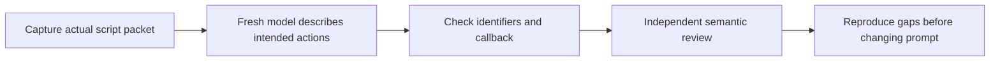

# Packet teach-back: a small reverse dry run



## Recommendation: pilot outside the delivery loop

Yes: test **what the model understood before testing what it executes**. A
fresh reader describes its scope, reference-reading plan, ordered actions,
result destination, callback, continuation and stopping conditions. This can
expose confusing packets that still pass string-based runtime tests.

Keep this a maintainer test, not another mandatory ShipLoop stage or a new
state machine. Scripts still choose every transition; model explanations
never advance state. The probe does not install a model provider, start a
standalone Until-Loop, run model-returned commands, or modify delivery prompts.

This design combines deterministic identity checks with a separate semantic
rubric. Repeated trials and review of actual traces are useful, but expressed
intent is not an observed outcome. Model graders also need calibration.
[Anthropic — evaluation structure and grader tradeoffs](https://www.anthropic.com/engineering/demystifying-evals-for-ai-agents)
supports that distinction; it does not establish this local probe's accuracy.

## What the small test contains

The [probe — capture, export and mechanical grading](../test/shiploop-teachback.py)
reuses the existing real-CLI integration fixture. It creates and cleans up a
disposable Git repository, then exports three unedited packets:

| Case | Actual fixture progression | Interpretation being tested |
|---|---|---|
| `review` | Preflight and approach accepted; first objective review issued. | Review the unassessed approach, read evidence/history, report findings; do not implement or finalize. |
| `plan` | A material absent-input finding is accepted by the review callback. | Plan improvements for the current finding; prior review is history, not proof that the candidate is now good. |
| `paused` | The same planning action is paused awaiting owner input. | Remain unfinished; no result or completion callback; resolve the blocker before permitted recovery. |

For example, the script accepts a review finding about missing CSV input and
returns `objective-plan`. A new model should describe planning that correction
from the referenced evidence, not inventing CSV data, editing product code,
or claiming the approach loop is complete. It copies the current callback,
then explains that the **script's reply** determines the next assignment.

The capture verifies callbacks against the fixture's independent durable
action ID, run directory and expected inbox path. A digest binds each
exported prompt to its oracle. These files are evaluation artifacts, not a
replacement for ShipLoop's authoritative Markdown state.

## Run it

From the repository root, choose a **new** output directory:

```sh
python3 test/shiploop-teachback.py prepare --output /tmp/shiploop-teachback-example
```

Give a fresh model **only** one `prompts/review.md`, `prompts/plan.md`, or
`prompts/paused.md` file's text. Do not supply the `evaluator/` folder, this
guide, previous trial answers, or chat history. Prefer a tool-disabled model
invocation. If the host must read the input file, permit only that bootstrap
read and audit the transcript for additional tools. A prompt saying "no tools"
is not technical sandbox enforcement. The public prompts and evaluator files
are separated for selective sharing, not protected by a filesystem security
boundary; do not upload the whole export directory. Captures retain absolute
local paths and may expose usernames or repository layout. Use an approved
host or inspect them before sharing externally. The probe makes no network
calls and provides no automatic provider integration.

Save the returned JSON verbatim as `response.json` in `evaluator/review/` (or
the corresponding other case folder). Then:

```sh
python3 test/shiploop-teachback.py grade \
  --case /tmp/shiploop-teachback-example/evaluator/review \
  --response /tmp/shiploop-teachback-example/evaluator/review/response.json
```

Exit 0 means **mechanical checks passed, semantic review still required**.
The printed verdict is `NEEDS_SEMANTIC_REVIEW`, never semantic PASS. Exit 1
means identity, callback, path or response-shape mismatch; exit 2 means the
probe could not evaluate the input. Never execute a returned command. Use
exports only after a successful prepare command. Capture failure leaves no
output; a later write failure can leave partial files. Preserve them for
diagnosis and choose a new output path rather than overwriting or trusting an
incomplete export. This small test intentionally has no recovery state machine.

An independent reader now uses the held-out `rubric.md` and actual packet to
grade seven dimensions: scope, reference plan, sequence, quality distinction,
continuation, stopping/authority, and honesty. Quote the answer supporting
each verdict. Missing evidence is UNKNOWN, not PASS. Any unauthorized action,
fabricated evidence, false completion or wrong callback is a critical failure.
Do not demand substantive facts from files the model could not read.

## Use failures to improve packets

Record source revision and dirty state, prompt digest, model/host and settings
when available, trial ID, verbatim response, mechanical output, and a quoted
semantic assessment. Keep these beside the captured prompt, not in a live run.
Repeat identical cases in fresh contexts (start with three trials per case);
retain failures, not only the best answer. Do not claim repeatability from a
single successful read or from two self-reported trivial reviews.

For each failure, first distinguish **packet ambiguity**, **model omission**,
**unavailable reference**, and **incorrect rubric expectation**. Reproduce the
gap before proposing a minimal packet change. Freeze grading criteria before
comparing old/new packets; use fresh readers and hold-out cases so the model
is not merely coached to the answer. Re-run deterministic runtime tests too.
The probe never automatically edits a packet or approves a deployment.

## Boundaries and verification

This initial pilot tests packet-only interpretation and reference navigation,
not the contents of referenced material. A later, separate probe could provide
selected read-only context pages. Full execution/outer-loop completion,
implementation checks, terminal certification, adversarial evidence, and
cross-model reliability remain covered by other tests or future pilots—not
by these three captures. Existing [packet contract](../skills/shiploop/references/turn-packet.md)
and [orientation integration tests](../test/shiploop-orientation-integration.test.py)
remain authoritative evidence for the corresponding runtime behavior.

Run the deterministic probe regressions with:

```sh
PYTHONDONTWRITEBYTECODE=1 python3 test/shiploop-teachback.test.py
```

They check real captures, hidden expectations, no answer execution, stale
identities, invented paused callbacks, malformed responses, overwrite refusal
and changed-prompt detection. They intentionally demonstrate that plausible
structure with meaningless prose is **not** a semantic pass.

## Initial local pilot

On 2026-09-13, three fresh Codex subagents each received one captured packet
from ShipLoop `115240e`, followed by one additional paused trial after the
evaluation wrapper explicitly specified arrays of strings. Each reader had
no inherited task conversation and was instructed to perform only its one
bootstrap prompt-file read, then produce text without other tools. Exact
backend model/temperature metadata was not captured, so this is not a
cross-model or reproducibility benchmark. The source worktree had this
uncommitted probe and unrelated Review Coverage edits; no runtime packet
source was changed for these trials.

| Trial | Mechanical result | Independent semantic result |
|---|---|---|
| Initial review | Identity, callback, result path and shape accepted; semantic review required. | FAIL on whole-run stopping; UNKNOWN on historical-reader coverage and complete quality-cycle explanation. |
| Initial plan | Identity/callback/path matched; `read_first` objects failed the string-array checker. | FAIL on whole-run stopping; UNKNOWN on complete quality-cycle explanation. |
| Initial paused | Identity and absent callback/result matched; same string-array format failure. | All seven applicable semantic criteria PASS. |
| Revised-wrapper paused | All mechanical checks accepted; semantic review required. | All seven applicable semantic criteria PASS for this one response. |

The review reader's `workflow_complete_when` said "two consecutive verified
and audited trivial review passes"; the plan reader made the same owning-loop
versus whole-run conflation. Neither packet's local convergence predicate
establishes full delivery. The review reader also omitted `quality-baseline`
from its reading plan. In contrast, the initial paused reader said "The
captured packet does not provide a final acceptance criterion." An independent
grader treated that uncertainty as correct, rather than requiring unseen
terminal wording. Omitted explanations were UNKNOWN, not assumed correct.

The two shape failures exposed ambiguity in **our evaluation wrapper**, not
an unsafe ShipLoop interpretation: "array of relevant paths/commands/sections"
did not unambiguously mean strings. The revised wrapper says "array of strings".
The final paused response obeyed that shape and retained the recovery boundary.
This is not evidence of a general prompt-quality improvement rate.

Two grounded **proposals, not applied runtime changes**, emerge:

1. Near active `Until` text, explicitly distinguish owning-loop convergence
   from whole-run completion; require a later terminal response for the latter.
2. Revisit placement of the historical-quality reader within the review
   reading sequence, preserving that historical evidence is not current proof.

Test those wording candidates on repeated, held-out cases before adoption.
No trial establishes actual coding, test execution, or delivery success.
The semantic grader evaluated reported intent, not an instrumented execution
trace. Neither a successful paused response nor green probe tests establish
general model comprehension.

Local raw prompts, expected fields, response JSON and frozen rubric remain in
`/tmp/shiploop-teachback-pilot-v2-115240e/` and
`/tmp/shiploop-teachback-pilot-v3-115240e/`; these temporary artifacts are not a
permanent benchmark dataset. The v2 files were copied into the final public/
evaluator layout for grading without changing their bytes. Prompt digests:

| Trial | SHA-256 |
|---|---|
| Initial review | `9343d2723d4d27b3667153b090b7433bd71d4a9f18aea4ecde45e54dc895e8d9` |
| Initial plan | `ac32ad739cd1679ee11d228472677f37ef6c92169cf3503944afcca19c7e3fe1` |
| Initial paused | `3e692acd90e4b38026b17753f83c3897fead588eb7925880b925fc199906b033` |
| Revised-wrapper paused | `9e7bb7cf53d618552972e4037eda07b4d60caf5bdecb92f2b1f833843b749147` |

Final deterministic verification used detached snapshot
`200b77c5b48af6fea9e1d677bd4207a9ae459cd1`: **32 distinct targeted tests
passed** (teach-back 9, orientation 14, orientation integration 4, reference
routing 5). A malformed-oracle regression was observed failing before the
input-error diagnostic fix. Ruff F/E9, shell syntax, local documentation
destinations/fences and diff hygiene passed. An independent code review's
sharing, failure-output and path-privacy concerns were addressed and re-reviewed
clean; the final small error-diagnostic correction received its regression.
Only this guide's pilot/verification record differs from the tested snapshot.
This is not a full native-suite rerun; no skill package or runtime source was
changed, so no plugin synchronization or production deployment was needed.

ShipLoop's packet contract kept the probe outside real state transitions;
the test-planning workflow supplied positive and negative mechanical cases;
evidence-first review kept this a local pilot with explicit semantic limits.
