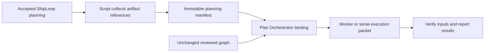

# ShipLoop planning artifacts → Plan Orchestrator

Status: implemented and locally qualified for source publication. Installation
and marketplace rollout are separate from repository publication.
Prepared 2026-09-19 against the historical ShipLoop `a8716f6` and Plan
Orchestrator `2d324d0` baseline. This document makes no installed-package,
publication, or native-worker-success claim.



## Decision and completion criteria

Adopt a script-produced, versioned planning-artifact manifest passed by absolute
file reference and SHA-256. Pass the same reference to Plan Orchestrator and its
workers, including cold recovery and serial execution. Keep the reviewed graph
unchanged. This is an input contract, not another scheduler or status store.

“All planning artifacts” means every planning output recorded by the current
ShipLoop invocation, its explicitly referenced project/source documents, and
the accepted planning/review evidence available at the binding boundary. The
complete catalog remains available; current requirements, other-item context,
and superseded/history material must be distinguishable. Future stages have no
artifact yet and must not be fabricated or required prematurely.

Done means a fresh worker in a sibling worktree can discover and read all its
required planning inputs without inherited conversation or a guessed cwd;
missing or changed required inputs prevent a fresh start or acceptance;
recovery yields the same manifest; normal progress does not invalidate it.
Transport correctness does not prove that an agent understood every document.

## Historical baseline and scope

The baseline increment targeted **navigator v3 implementation chains**. At the
historical baseline, binding required an active v3 `implement` action with no
active Improve child and initialized the dispatcher with only `{owner, graph}`.
The source implementation described below extends that boundary with the
separate immutable planning-context reference; this baseline description is not
a claim about an installed selected package.

At that baseline, V3 planning authority was `state.md`'s validated `history`, `accepted`,
`work_items`, `bound_plan`, and `improve_results`. Accepted action records are
also written to `results/<action>.md`
(`shiploop_navigator.py:_latest_result_record`, lines 1575–1588).
`evidence_refs` are currently arbitrary nonempty strings, not a validated file
registry (`_canonical_result`, lines 155–176). Their text must not be mistaken
for a fully resolved file handoff.

Do not require managed/legacy `planning/*.md`, `step-planning/*`, or
`backchain/plan.md` files in a v3 run. They are inputs only when explicitly
referenced. `state-files.md` explicitly redirects navigator-v3 readers to its
own protocol; its legacy catalog is not the v3 producer inventory.

At that baseline, the execution graph and selected package bytes were frozen and
checked. Plan Orchestrator's `plan-run.js` could snapshot explicitly supplied
resources, but ShipLoop did not call it. The implemented transport still does
not introduce another allocated run just to carry this manifest; the selected
Plan Dispatcher remains Plan Orchestrator's execution component.

## Artifact inventory

Derive this from validated navigator records, not a recursive repository scan
or a fixed set of guessed filenames. Register additional files at their
producer; retain root-qualified source references.

| Family | V3 source | Treatment |
| --- | --- | --- |
| Existing plan and accepted planning context | `bound_plan`, accepted intake and planning producers | Reference accepted planning decisions and files; project only planning-safe inline values. The original user prompt is excluded from the generated brief and projection. |
| Discovery and research | Accepted root discovery/research results and their references | Preserve inspected sources, decisions, gaps, and freshness qualifications |
| Requirements and design | Accepted spec/plan and referenced product documents | Include functional/NFR, architecture, interfaces, auth, data, UI and deployment constraints when produced |
| Environment and preparation | Accepted discovery/prepare, initial baseline evidence, item baseline | Preserve target/environment and readiness limits; a recorded baseline is not a new pass |
| Test planning | Accepted root test-strategy; item step-plan/test-spec/test-author/test-red and any carried revisions | Include harness, setup/teardown, fixtures, test dependencies, suite membership and local/remote decisions |
| Overall and item plans | Accepted plan/work-item context; item select-work and step-plan; exact reviewed execution graph | Preserve ready/done contracts and direct dependencies unchanged |
| Planning improvement | `improve_results[action]` for accepted planning producers, actual retained child receipts and evidence | Retain final accepted decisions and review provenance; no new review counter |
| Other items and history | Planning outputs from other items, repeated/blocked attempts, earlier revisions and corrective-replan inputs | Available by reference, explicitly labeled; never automatically promoted to current requirements |
| Later release/system-test planning | Existing accepted outputs only when a prior corrective cycle produced them | Mark their provenance; do not demand later-stage artifacts at initial `implement` |
| External source files | Explicit references in accepted planning results or the bound input plan | Permit authorized local project documents outside the run directory; preserve URL references separately |

Reuse the v3 latest accepted test-strategy/current-item test-decision selection
rules (`shiploop_navigator.py`, lines 925–989). Preserve every registered
planning artifact in the complete index, even when it is not on a worker's
immediate reading list. Do not silently truncate the index.

## Implemented source contract

Create `chains/<action>/planning-artifacts.json` and its deterministic sibling
`planning-brief.md` once when binding a newly reviewed graph. Their names are
distinct from runtime state. The JSON contains a
schema marker, source run/action/item identity, original graph reference,
artifact entries, unresolved references, and historical classifications. The
brief is a deterministic consolidation of key reference statements, decisions,
constraints, acceptance context, and complete reference locators from the
accepted planning pass. It is supporting material, not an original user prompt
or worker-task rewrite: the graph step's `task`, `ready`, and `done` remain the
sole assignment directive.
The source records its planning capture revision for provenance only; later runtime
revision changes do not change the bound planning context.
The manifest does not contain its own digest.

Implemented manifest shape (abridged):

```json
{
  "schema": "shiploop-planning-artifacts/v1",
  "source": {"run_id": "R1", "action_id": "implement-1", "workitem": "W1", "revision": 42},
  "graph": {"path": "/runs/R1/execution-graph.json", "sha256": "<digest>"},
  "briefing": {"path": "/runs/R1/chains/implement-1/planning-brief.md", "sha256": "<digest>"},
  "artifacts": [
    {
      "path": "/project/docs/auth-spec.md",
      "sha256": "<digest>",
      "roles": ["requirements", "authentication"],
      "producers": ["spec-1"],
      "classification": "current",
      "required_for": ["*"]
    }
  ],
  "unresolved_refs": [],
  "reference_only": []
}
```

The shared wire reference includes the expected owner identity, so a caller
cannot accidentally bind another run's otherwise valid manifest:

```json
{
  "path": "/runs/R1/chains/implement-1/planning-artifacts.json",
  "sha256": "<digest>",
  "source": {"run_id": "R1", "action_id": "implement-1"}
}
```

1. **Collect automatically.** Read accepted v3 producer results, their planning
   references, relevant work-item planning values, and imported Improve evidence.
   The collector excludes `state.prompt`; accepted planning decisions and
   references are supporting material, while the step task/ready/done contract
   remains the only assignment. Cross-check result files against accepted records.
2. **Resolve declarations explicitly without changing v3 results.** Preserve
   every `evidence_refs` string verbatim. A read-only `chain planning-inputs`
   operation lists accepted source records, directly resolved absolute file
   references, and unresolved references keyed by existing action/reference
   position. For ambiguous/relative references, the script requests a resolution
   document supplied at bind: each original entry maps to an absolute file,
   a URL-only citation, or a non-file evidence statement with rationale. The
   caller cannot remove the original entry. Required file inputs cannot be
   relabeled as citations to bypass a missing-input failure. Keep the accepted
   record as the source and retain resolutions in the immutable manifest.
   Producer/Improve prompts must list every produced planning file in existing
   `evidence_refs` and preserve those references in revised final results.
   Inline-only planning remains valid. No new navigator protocol or result
   schema is needed; no recursive Markdown-link or repository scan is implied.
3. **Preserve file identity.** Store canonical absolute paths and whole-file
   hashes. A fragment/section locator is a reading hint, not a substitute for
   file identity. Deduplicate identical files while retaining all roles and
   producer provenance. Explicit external local paths are valid; do not impose
   a run-root-only rule that would lose product specifications.
4. **Stabilize only what needs it.** Reference stable accepted result files and
   durable source documents directly. For inline planning values in mutable
   `state.md`, emit an immutable planning-only projection; exclude cursor,
   attempts, accepted execution state and worker status. For an input expected
   to be edited during this chain, capture its reviewed version as immutable
   evidence with its original source locator. Do not hash all of `state.md`, a
   live receipt, or a directory as a planning dependency.
5. **Bind alongside the graph.** Introduce a versioned chain binding with
   `planning_context:{path,sha256}`. New ShipLoop chain bindings require a
   complete manifest. Graph bytes/digest remain identical to the reviewed
   candidate. Review receipts may point to that original digest; the manifest
   may point to the receipts. There is no circular hash dependency.
6. **Pass through Plan Orchestrator itself.** Extend dispatcher `init` with
   optional `planning_context` for a new dispatcher state version, retain that
   immutable reference in the existing run record, and return it from
   `packet`/fresh execution responses. Before initialization, verify the manifest
   digest and expected source run/action, its graph-file digest, and that the
   parsed/validated referenced graph equals the graph being initialized. Compare
   normalized graphs in the dispatcher using its existing canonicalizer; do not
   confuse the raw graph-file digest with the dispatcher graph digest. ShipLoop
   must pass it at `_init_child`, not merely add it to the final worker prompt.
   The referenced manifest is the single input index. Repeated immutable
   references in binding/packets are not additional mutable state.
7. **Check selected-package compatibility first.** Add a read-only dispatcher
   capability response for this context-ref contract. Check it before any new
   chain-side write, including namespace/manifest creation, the chain binding,
   and child-init intent. A selected older package cannot silently
   discard the context. Existing graph-only dispatcher runs and v1–v3 ShipLoop
   bindings remain recoverable without migration or retrofitted evidence.
8. **Deliver the complete index.** Parallel and serial packets, including cold
   recovery, contain the identical manifest reference. Worker instructions say
   to verify it, read current shared constraints and task-required sources,
   and consult other entries as needed. Full artifact bodies do not get
   repeated in every prompt; opaque historical records are not instructions.

The implementation leaves v3 result validation, stored accepted records and
replay digests unchanged. Existing graph-only dispatcher state keeps its original
schema; context-bound state is explicitly versioned, and old packages cannot load
it by dropping unknown fields. The new chain-binding version supplies the context
contract; existing v1–v3 bindings are not upgraded in place.

The script can guarantee inventory of recorded outputs and references, not
infer an unrecorded file hidden in conversation. Producer instructions,
planning review, and the completeness fixture must verify that generated
planning files are registered. Unknown or ambiguous current-required inputs
remain visible and block binding until resolved. Historical, optional and
URL-only references remain listed with their availability limits and do not
block unrelated execution. A reference-only URL is not
proof of downloaded or worker-readable content; material remote content needs
an explicitly supplied local artifact before execution depends on it.

## Implementation landing

The new `chain planning-inputs --run-dir --action --graph
[--planning-resolutions]` operation is read-only: it reports the accepted
source records, exact generated files, directly resolved local references, and
resolution requirements without changing navigator state. `chain bind` consumes
the resolution document and creates the manifest/brief atomically only after
the selected dispatcher advertises support for the planning-context contract.
New bindings use v4 and always carry the manifest reference; old v1-v3 bindings
recover without migration. The bridge, not the collector, owns binding,
capability preflight, dispatcher initialization, and packet projection.

The collector preserves original reference strings and explicitly registered
external local files. It snapshots only mutable planning producers that must be
stable for this execution, and never turns progress state, worker status, or
history URLs into required material. The dispatcher retains the optional
context reference in its existing run state and returns its exact value in
packets. This landing records the source implementation boundary, but does not
claim final gates, package synchronization, installation, publication, or native
qualification.

## Navigation, freshness, and recovery

- Every entry has `required_for`: `["*"]` for shared required input, explicit
  graph step IDs for task-specific requirements, or `[]` for catalog-only
  history/reference material. Current shared requirements default to `["*"]`.
  Validate IDs against the reviewed graph. Planning review owns semantic
  classification; the script cannot infer relevance from a filename, and a
  missing required input cannot be downgraded just to bypass the gate.
- The existing scripts still choose claims, successors, waits, retries,
  integration and completion. The manifest grants no new action.
- Validate manifest identity and required input availability before a fresh
  start; revalidate before accepting work. A native worker must report BLOCKED
  if its actual context cannot read a required reference. Main-process access
  alone does not establish worker access.
- An input failure suppresses new launch grants and acceptance, but must leave
  observation, result capture, inspection, retirement and safe cleanup usable.
  Do not put artifact validation in an unconditional gate that prevents those
  recovery operations. `next`, `packet`, `report`, `receipt`, `retry`, `takeover`
  and cleanup retain their existing ownership/safety checks without this new
  availability gate; inspection can show the context fault. Required input
  faults block binding initially and only the affected starts/acceptance later.
  An invalid manifest identity affects all steps because its classifications
  cannot be trusted.
- Keep an already-running attempt attached to its original context. Do not
  rebuild the manifest silently on a status update or after a changed spec.
  Material new planning inputs require the existing replan/review boundary and
  a new binding/dispatcher run through the supported parent replan path; the
  next planning context supersedes rather than edits the old. Retain the prior
  immutable manifest. Use existing run/action identities, not a new manifest
  revision counter or ledger. A same-action replacement unsupported by current
  orchestration remains blocked until the existing reconciliation boundary is
  used; this increment does not add graph mutation.
- Required current inputs missing or changed are blockers. Historical/reference
  sources that are unavailable remain explicitly unavailable; they cannot
  satisfy a requirement or justify a clean completeness claim.
- Preserve manifests and required sources at least as long as the run and its
  recovery/evidence records. Do not put them inside a disposable worker
  worktree. Absolute paths target the shared filesystem; unsupported remote
  workers require explicit materialization and are outside this increment.
- Publish the manifest atomically once, before committing its binding; include
  its digest in the existing child-init intent. An interrupted bind reuses only
  the exact intact manifest and binding inputs. A changed or partial file must
  not be silently overwritten or used to create a second child.
- No new queue, ledger, polling loop, automatic model subprocess, or Ask-Agent
  worktree/merge behavior is introduced.

## Implementation sequence and ownership

The table records intended responsibilities and qualification evidence. Source
changes may exist for these steps; the listed observables are not all individually
proven by this document.

| Step | Depends on | Owned changes | Ready / done evidence |
| --- | --- | --- | --- |
| A: Freeze fixtures and wire contract | — | Shared manifest/ref examples; current v3/legacy fixtures | Existing baselines recorded; reviewed schema has no graph hash cycle |
| B: ShipLoop collection | A | New `shiploop_planning_context.py`; v3 producer/Improve prompts; existing accepted-result readers | Complete current-run inventory from accepted records; explicit unresolved references; no mutable-status copy |
| C: Dispatcher context transport | A | Plan Orchestrator `state.js`, `dispatch.js`, skill/protocol docs | Capability preflight, versioned init ref and graph/source matching, recovery/packet preservation; old-run behavior unchanged |
| D: ShipLoop binding and launch | B, C | `shiploop_chain.py` binding/init/recovery/enrichment; skill/reference documentation | New bindings pass exact manifest to dispatcher; serial and parallel packets preserve it |
| E: Composed validation and docs | D | New focused tests plus existing real-Git lifecycle fixture; README/package views | Cold fan-out/join runs consume external planning files, merge all accepted work and clean workers |

B and C can run in separate **sibling worktrees** after A, using the same
fixture contract. D joins both. E is the release gate. Keep implementation and
independent integration verification distinct, and update generated plugin
views using the repository's synchronization script.

Add a separately pinned context-capable dispatcher fixture with source commit
and file hashes. Retain `test/fixtures/plan-dispatcher-v1` and
`plan-dispatcher-v2` for compatibility tests; do not relabel old fixture bytes as
new support. Initial delivery is source integration; installed skill selection
must explicitly choose the qualified context-capable package.

## Qualification matrix

These are required qualification targets, not a claim that every row has passed.
Start with the established repository smoke/baseline, then run focused transport
tests and the existing real-Git lifecycle case; do not rebuild the scheduler or
duplicate all existing lifecycle tests.

| Test | Required observable result |
| --- | --- |
| Complete v3 producer inventory | All accepted planning result files, declared artifacts, original refs and matching Improve evidence are discoverable; current/history/other-item distinctions survive |
| No legacy-file assumptions | A genuine v3 run lacking `planning/*.md`/`backchain/plan.md` binds successfully using its actual records |
| External paths and resolution | Documents outside run/worker roots, spaces, fragments, Unicode and changed cwd resolve to the exact files; ambiguous paths are reported |
| Missing/damaged input | Required missing files, wrong digests, invalid file types and swapped manifest fail before launch or acceptance, without accidental worktree allocation |
| No silent context drop | Selected old dispatcher refuses new context-aware binding before mutations; old runs still recover unchanged |
| Wrong run/action/graph | A valid manifest from another binding is rejected even if its files and digest are valid; parsed graph and raw file identities are checked separately |
| Free-text reference resolution | Preserve every old evidence string; ambiguous refs produce explicit resolution requests; source records/replay digests stay unchanged and missing file inputs cannot be waived as citations |
| Graph/review identity | Reviewed graph bytes and graph digest are unchanged; final review receipt remains valid; no self-referential manifest hash |
| Cold recovery | Restart the parent process and use its returned commands; dispatcher and worker packet carry the same context reference |
| Interrupted binding | Crash before/after manifest publication and child-init intent; retry preserves one immutable manifest and initializes at most one child |
| Required versus catalog-only | A missing A-only input blocks A without blocking unrelated B; unavailable history remains visible and cannot satisfy a requirement |
| Parallel progress | A and B use one manifest; accepting A releases C while B continues; parent status/ledger writes do not invalidate B or C |
| Changed planning input | Change a required spec between bind/start and between start/acceptance; new work/acceptance blocks while result collection and cleanup still work |
| Replan and history | New reviewed context gets a new binding; previous versions remain audit-only; never switch a live worker to new inputs |
| Parallel run isolation | Two invocations targeting independent checkouts retain different manifest/graph/run identities and cannot consume each other's context |
| Artifact-only behavior | Fixture workers derive code requirements from referenced files absent from inline tasks; independently check generated code, fan-in behavior, target ancestry and cleanup |
| Serial parity | The same artifact-only case succeeds in main-context execution without a native handle |
| Large inventory | Every registered entry remains reachable; packet size grows with references, not the total bytes of all documents |
| Retention | Removing worker worktrees leaves the manifest and required planning evidence readable |

Use exact assertions for identities, completeness, ordering, Git effects and
failures. Evaluate model understanding by observable code behavior/semantic
criteria, not exact prose. A separate bounded native Ask-Agent pilot should
verify actual file access by fresh agents; deterministic worker passes alone
do not establish model compliance or host capability.

After focused passes, run the required Plan Orchestrator local-change gate,
ShipLoop's full core/three-shard aggregate, metadata/plugin parity, and diff
checks. Preserve the distinction between source merge, installed package
activation, and native qualification.

## Evidence and alternatives

- **Adopt file-reference discovery and explicit required inputs.** Spec Kit's
  [check-prerequisites.sh](https://raw.githubusercontent.com/github/spec-kit/main/scripts/bash/check-prerequisites.sh)
  builds a document inventory and rejects missing prerequisites; its
  [implementation prompt](https://raw.githubusercontent.com/github/spec-kit/main/templates/commands/implement.md)
  tells the consumer which planning files to read. Reuse the pattern, not its
  scheduler or unrelated approval policy.
- **Defer full-body prompt injection.** The
  [AGENTS.md evaluation](https://arxiv.org/abs/2602.11988v2) reports that context
  files did not generally improve success in its studied tasks and increased
  inference costs. This does not measure ShipLoop; it supports separately
  testing actual artifact use instead of assuming more prompt text is better.
- **Reject graph-source injection after review.** The current frozen graph
  contract already supplies the decisive local evidence: injecting a manifest
  would change the reviewed identity. A separate input reference is simpler.
- **Reject another run allocator or mutable registry.** Existing navigator
  records, chain binding and dispatcher run already own their respective
  state. `plan-run.js` remains useful independently; no wrapper allocation is
  needed for this handoff.

The local evidence below records completed checks and remaining qualification
separately. This document does not establish installed-package activation or
publication.

## Implementation evidence — 2026-09-19

The worker assignment is the graph step's `task`, `ready`, and `done`. The
generated brief contains planning reference statements; its projection excludes
`state.prompt`. Planning-bound dispatcher packets also omit `source.goal` as a
top-level prompt field. Graph-only legacy packets retain their previous API.
Sentinel regressions cover claim, native start, serial start, and the generated
brief/projection. The graph bytes remain unchanged.

Completed local checks:

- Plan Orchestrator: required `make test-fast` harness gate `PASS_CLEAN`, 190
  reported named checks, zero failures, no product-file changes during the gate.
  Run: `20260919T204946Z-8cfce6` under
  `/Users/dadleet/.grok/runs/test-harness/planning-context-20260919/`.
  Inspected stderr contains expected negative-test diagnostics and installer
  help. The host-install skip text is not native-host qualification.
- ShipLoop core and all 95 suites passed: shard 1 has 32 suites, shard 3 has
  31, and shard 2 has 32. The first shard-2 run stopped because its dispatcher
  fixture was updated during execution. Its six earlier suites passed; the
  entire 25-case lifecycle suite was rerun successfully after the fixture froze,
  then the remaining 25 suites passed. The final 13-case action-walk suite also
  passed. No failed fixture run is counted as a pass.
- Final focused coverage passed: 8 collector cases, 9 composed context cases,
  16 handoff cases, 36 existing chain cases, and 25 Git lifecycle cases. The
  recovery case additionally verifies that revisiting an earlier rejected
  digest creates a new append-only intent instead of reusing an older event.
- Independent review found and confirmed the fix for the extra graph-goal field.
  It also reviewed the handoff recovery correction described below.

Local logs and the inventory accounting are retained in
`/private/tmp/planning-artifact-implementation-20260919/verification-summary.json`.
Affected chain/handoff/context suites were rerun after their respective final
changes; this evidence does not claim one uninterrupted run of every suite on
one frozen checkout. Source/plugin parity and dispatcher fixture hashes match.

Repeat the focused material and orchestration checks from the ShipLoop checkout:

```sh
python3 -B test/shiploop-planning-context.test.py
python3 -B test/shiploop-chain-planning-context.test.py
python3 -B test/shiploop-chain-handoff.test.py
python3 -B test/shiploop-chain.test.py
python3 -B test/shiploop-chain-lifecycle.test.py
```

The complete repository gate is `bash test/run-all.sh --group core`, followed
by each of `--group shiploop-1`, `--group shiploop-2`, and `--group shiploop-3`.
The composed workers are deterministic Python processes with real Git effects;
they do not launch a model. The native pilot below is separate evidence.

### Native Ask-Agent pilot

Three fresh general-purpose Codex native contexts exercised `A []`, `B []`,
`C [A,B]`. A and B ran concurrently in sibling worktrees; C was released by the
script only after their independently checked contributions were integrated.
The code behavior was derived from the shared planning references: `alpha()`,
`beta()`, then `joined() == 'alpha-beta'`. This is a small behavioral pilot,
not evidence of broad model quality, token savings, or other native hosts.

| Task | Status | Contribution | Native type / substitution | Integration |
| --- | --- | --- | --- | --- |
| A | SUCCEEDED and accepted | `883da622bdd378b60f93fea245127f4fccfe290b` | default / none | Integrated; worker removed |
| B | SUCCEEDED and accepted | `c8f5d16872d7bdfe0249326a962fa80965620db6` | default / none | Integrated as `216e5791d2f06e132e160d176ca6e5d059cc91ae`; worker removed |
| C | SUCCEEDED and accepted | `c865c4a0f9aa8497196a08111d616ecc06666daf` | default / none | Integrated; worker removed |

Local retained fixture root:
`/private/var/folders/_n/cth41tgs171367b_gghs0kgm0000gn/T/shiploop-chain-5nq4e63b`.
Worker paths were `.work-trees/project/native-A`, `native-B`, and `native-C`
under that root; all are now deleted. Required handoffs/checks were archived
under `run/chains/nav-d4518c3c59104ca08f9ab7f5f05dd257/handoffs/` before removal.
`native-trace.json` records script transitions and final Git state. The target
`.work-trees/project/initiating-feature` is clean at C's commit. Primary `main`
remains at `d54d5b3fe73d3562e9da3b1dd53e6af9c23cd79e`; only those two checkouts
remain. The final script response has `navigation.complete: true`; its returned
parent `next` command was executed and correctly resumes the parent implement
action. Chain completion does not assert completion of the entire ShipLoop run.

Collection notes: all workers returned through native notifications; no worker
remains running. The parent's C launch example incorrectly specified lowercase
`succeeded`. Import rejected it. After the worker corrected its receipt, retry
exposed an existing pre-validation intent bug. The fix validates a new handoff
before recording intent and permits a corrected historical rejection only when
a matching error exists and there are no archive/report/receipt effects. It
appends the corrected intent without changing the original event or error.
The corrected import, independent verification, merge, cleanup, and finish all
succeeded. New repeatable tests cover prevention, legacy recovery, and refusal
when partial effects exist. The pilot used the context-capable dispatcher copy
before the final goal-field omission; its graph had no `source.goal`. Dedicated
final-source sentinel tests qualify that omission separately.

The source and plugin mirror are qualified for repository publication. Git
history records their commit and merge status. Installed-package activation
and marketplace rollout were not performed by this increment.

The dispatcher fixture is pinned to Plan Orchestrator commit
`ef8a931916aa5fda06cfa87e2e1b6bd4ecc35e00`; every copied package file matches its recorded hash.
