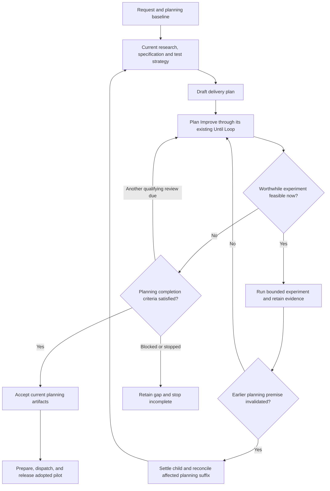

# Experiment-informed ShipLoop planning

Status: authorized implementation and release plan. This document records the design and its gates; the [results report](shiploop-planning-experiments-results-2026-09-21.md) records execution and the delivered scope. Opt-in V4 capability and changing the default are separate decisions.

## Decision

Reorganize planning into three responsibilities: establish a working baseline, refine a provisional plan through evidence and experiments, and accept a coherent set of planning artifacts before preparation or dispatch. Keep the existing prelude stages and actual Improve/Until ownership. Pilot a narrow pre-dispatch reconciliation route in a fresh, explicitly marked navigator-v4 run when findings invalidate earlier planning decisions. The authorization reaches implementation and release after the opt-in capability gate; a separate behavioral-benefit gate governs any default change.

The change is more than another experiment-selection sentence, but smaller than a new scheduler or global experiment phase. Early research continues to answer questions visible before a plan exists. Plan Improve takes responsibility for questions revealed by the proposed solution.

## Baseline basis

Implementation starts from clean tracked source `f14103d20e2219cd14f652f91dbc1725908464f2` in the isolated `codex/planning-experiments` worktree. The initial assessment also inspected unrelated working changes in the original checkout; those remain outside this change. The fresh baseline passed smoke plus navigator, standalone Improve, planning-context and chain-context suites before implementation.

- The current prelude is intake, discovery, research, spec, test-strategy, plan, prepare. [V3 prelude](https://github.com/whichguy/skill-craft/blob/f14103d20e2219cd14f652f91dbc1725908464f2/skills/shiploop/scripts/shiploop_navigator_v3_prompts.py#L63)
- Plan remains a draft until its actual Improve handoff completes. The child may supply a revised final result before the queue is accepted. [Plan producer](https://github.com/whichguy/skill-craft/blob/f14103d20e2219cd14f652f91dbc1725908464f2/skills/shiploop/scripts/shiploop_navigator_v3_prompts.py#L704), [Improve result import](https://github.com/whichguy/skill-craft/blob/f14103d20e2219cd14f652f91dbc1725908464f2/skills/shiploop/scripts/shiploop_navigator.py#L823)
- Research already specifies discriminating experiments, evidence fidelity, bounds, cleanup and outcome-to-plan consequences. Reuse that policy. [Research experiments](https://github.com/whichguy/skill-craft/blob/f14103d20e2219cd14f652f91dbc1725908464f2/skills/shiploop/references/research-loop.md#run-bounded-discriminating-experiments)
- The optional native Backchain/Until child is plan-only. Plan Improve must not launch a nested Backchain/Until controller. This proposal expands the existing plan Improve work contract; it does not expand Backchain into a project executor. [Backchain handoff](https://github.com/whichguy/skill-craft/blob/f14103d20e2219cd14f652f91dbc1725908464f2/skills/shiploop/scripts/shiploop_navigator_v3_prompts.py#L1375)
- V3 currently permits corrective `replan` only at outer stages; it has no general early rewind. [Result validation](https://github.com/whichguy/skill-craft/blob/f14103d20e2219cd14f652f91dbc1725908464f2/skills/shiploop/scripts/shiploop_navigator.py#L155)
- A focused V3 protocol calibration advanced synthetic upstream receipts to a real plan child, then confirmed that proposed `research` and `test-strategy` reconciliation fields are rejected as unsupported while the parent remains at `plan` and the active child is preserved. Its `pursue opt-in v4` disposition establishes a missing safe early-return transition, not model behavior, a successful project run, or a reason to default-enable V4. Recorded evidence: `/tmp/shiploop-planning-experiments-20260922/baseline-protocol.json` (`c471d5d5ca68294852eff08e57d085261a35095c618a7879b0aac12db9288b51`).
- The current ephemeral Improve bridge accepts only a `complete` child with its qualifying trivial reviews and no remaining callback; it cannot settle a stopped child. Its normal receipt accepts only successful-review fields, so reconciliation needs a separate bounded validator/archive path rather than a weaker success import. [Terminal bridge](https://github.com/whichguy/skill-craft/blob/f14103d20e2219cd14f652f91dbc1725908464f2/skills/shiploop/scripts/shiploop_standalone_improve.py#L629), [Receipt shape](https://github.com/whichguy/skill-craft/blob/f14103d20e2219cd14f652f91dbc1725908464f2/skills/shiploop/scripts/shiploop_standalone_improve.py#L482)
- Current planning-context selection marks the latest completed result independently for each planning stage as current, so a reconciliation must add a versioned current-revision projection rather than rely on per-stage recency. V3 history entries also have a fixed five-field shape with no timestamp. [Current-source selection](https://github.com/whichguy/skill-craft/blob/f14103d20e2219cd14f652f91dbc1725908464f2/skills/shiploop/scripts/shiploop_planning_context.py#L238), [V3 history validation](https://github.com/whichguy/skill-craft/blob/f14103d20e2219cd14f652f91dbc1725908464f2/skills/shiploop/scripts/shiploop_navigator.py#L369)

The preceding assessment ran 31 navigator-v3, 7 research-template and 16 probe-decisions tests successfully against its recorded snapshot. That is historical local-mechanics evidence, not a current full-suite baseline or evidence that this proposal improves plans.

## Proposed planning flow

The feedback edge belongs to the planning lifecycle; the accepted implementation dependency graph remains acyclic. Reconciliation starts at the earliest affected producer, including discovery when necessary. The diagram groups these upstream producers for readability.

| Responsibility | Existing owner | Proposed behavior |
| --- | --- | --- |
| Establish a working baseline | Discovery, research, spec, test-strategy and their Improve children | Retain current evidence, requirements and planned verification. Stage completion establishes a reviewed current version, not an irrevocable fact. |
| Refine a provisional plan | Plan producer and existing plan Improve child | Draft enough architecture and dependencies to expose assumptions. Design, execute and evaluate worthwhile experiments; revise the candidate. |
| Accept coherent planning artifacts | Existing plan-result acceptance boundary | Confirm current research/spec/test-strategy/plan agree, due planning checks are satisfied and no stale result authorizes preparation. This is a guard on acceptance, not another review loop. |

Do not move all research after the plan. Do not perfect the full dependency graph before any empirical learning. Draft the graph, revise it as evidence arrives, and bind its final identity only after plan Improve completes.

## One empirical review cycle

The plan Improve child performs this work under its existing Until Loop callback:

1. Read the current draft, applicable source versions and prior observations. Identify consequential assumptions and their affected decisions or consumers.
2. Reuse sufficient current evidence. Otherwise choose the smallest experiment whose plausible outcomes could change a decision or establish whether proceeding is justified. Name the hypothesis, alternatives, discriminator, representative setup, allowed effects, cost bound and outcome-to-decision mapping before execution.
3. Build and run only authorized, bounded experimental fixtures or probes. Check whether the apparatus exercised the intended boundary. For noisy observations, declare appropriate controls or repetitions before interpreting the result.
4. Record observed outcome, evidence fidelity, source/configuration/target identity, actual commands/results, cleanup and limitations. Separate an invalid experiment from a valid negative result.
5. Revise the draft and its planned checks, or return an upstream-reconciliation need. Reassess remaining experiments after a result; do not blindly run an obsolete batch.
6. Verify the affected plan relationships and report this complete cycle to Until Loop. Material findings or repairs reset the existing convergence streak. Do not add a second counter or privately run several convergence cycles inside one callback.

The mandatory duty is screening consequential uncertainty. A task can legitimately require zero experiments. Required baselines and acceptance checks remain due even when an exploratory experiment is unnecessary.

### Edit scope and ownership

The parent supplies explicit candidate-plan, evidence-note and scratch-fixture locations in the existing child scope. The child may create disposable experimental code and run relevant existing facilities there. It may not promote prototype code into the product, repair the baseline to make it green, mutate production, or acquire persistent infrastructure merely to finish planning. Existing user authority governs any permitted external probe.

Use the existing consumer-owned child workspace contract; do not create a competing worktree owner. Experiment artifacts must be excluded from product integration. Cleanup has an explicit owner, including interruption and incomplete exit. If the selected child's scope or filesystem contract cannot support a required fixture, retain that limitation rather than silently widening access.

Until Loop owns iteration and terminal state; Improve owns experimental work and semantic review; ShipLoop owns stage transitions and accepted planning versions. Plan Dispatcher receives the accepted graph afterward. Backchain remains a dependency-planning aid; plan Improve may use the existing one-pass diagnostic, never launch nested convergence.

### Completion and incomplete stops

Plan Improve completes only with incorporated results, no worthwhile unresolved experiment due now, coherent current planning artifacts, applicable planning checks, and its existing two qualifying trivial/no-change reviews. Every material open condition must either be resolved or represented by a valid execution prerequisite that prevents its consumer from starting. Required unresolved architecture choices cannot be labeled deferred merely to accept a graph.

A confirming observation can justify proceeding without changing the graph. A timeout, inaccessible target, invalid apparatus or inconclusive result does not confirm an assumption. Lack of a plan diff is not proof of convergence.

Carry one investigation's allowance in a stable Markdown notebook that follows that investigation across child iterations, reconciliations, and action-ID changes. This follows the existing research policy as a host-accounted advisory rule: the runtime cannot observe native tools or a watchdog and must not pretend to mechanically prevent a renewed allowance. Every recovery packet names the notebook locator and current allowance. Tests prove that recovery wording and locator survive; they do not claim that a runtime counter enforces nonrenewal. Exhaustion is incomplete, not another trivial pass. Independent work may proceed only within its actual owner and prerequisites.

## Pre-dispatch reconciliation

Introduce a packet-issued reconciliation operation, distinct from successful Improve completion. Pilot it only in a fresh `navigator_protocol_version: 4` state. The following narrow contract is binding for implementation:

- It is available only for a parked initial `plan` action, before any `prepare`, work-item, chain, integration, or return effect. Its target is exactly one earliest affected producer: `discovery`, `research`, `spec`, or `test-strategy`. V1–V3 states retain their exact saved shapes and behavior; an old reader may refuse V4 rather than misread it, and a V4 reader retains the legacy V3 projection for legacy input.
- The child returns an evidenced need to reconcile: target, invalidated premise, and supporting observations. It never reports successful plan convergence.
- A dedicated V4 `settle_incomplete` bridge accepts only the bound ephemeral child's terminal `stopped` packet with no callback, absent temporary state, `classification` of `non-trivial` or `unresolved`, `exit_assessment` of `unsatisfied` or `unknown`, and `continuation_assessment: cancelled`. The parent first collects or cancels the actual worker; a host-preserved packet is structural evidence, not authenticated proof of process death. Legacy durable children remain incomplete. This path never calls `complete()`, `finish_improve()`, or `_apply_result()`.
- The bridge returns immutable writes at `improve/<parked-action>/terminal.json`, evidence archive paths, and `improve/<parked-action>/receipt.md`. The latter serializes the exact returned stopped record, including the submitted receipt; callers cannot select another archive destination.
- In one durable save transaction, archive the child evidence, accept the canonical non-success result `{outcome: reconcile, summary, evidence_refs, reconciliation_target}`, and append one `planning_reconciliations` event in authoritative `state.md`. History retains exactly `{stage, outcome, summary, workitem, action}`; V3 gains no new result fields, outcome, or timestamps. Earlier results/receipts remain unchanged.
- Each event has exactly `action`, `target`, `binding_id`, `recorded_at`, `clock_source`, and `receipt_sha256`. The unique action and binding must match the plan/reconcile result and stopped record; target matches `reconciliation_target`; the digest covers the fixed archived receipt bytes. Event-list position and history order are authoritative. `recorded_at` is parseable UTC with `clock_source: local-utc`, informational rather than a monotonic time authority. Recovery validates the archived receipt, terminal packet and evidence identities; exact replay is a no-op, conflicting replay is rejected.
- `current_actions(state)` is derived, never stored as a redundant `prior_projection` snapshot. For each ordered reconciliation event it invalidates the prior accepted fixed suffix from that target through `plan`; only subsequent accepted `done` results can govern the new suffix. Planning context, navigator packet construction, test-strategy selection, chain binding, protocol/dry-run, consumer delivery, and preparation all consume this one projection. The `reconcile` row is audit evidence, never a current `plan` completion.
- The bridge then issues a fresh action at the target and reruns the fixed suffix through `plan` with normal Improve handoffs. Reused evidence is named explicitly. Each fresh producer/child has fresh action identity and review count; late or duplicate callbacks cannot advance the replacement revision or repeat effects.
- Preparation becomes eligible only after a new coherent planning version is accepted. A scope or authority change remains a user decision; experimental facts cannot silently weaken requirements.

Use this one V4 collection and derived `current_actions` projection in existing authoritative state, not another plan database or a copy of Until runtime state. Design state validation, serialization, archive transaction, reader refusal/legacy behavior, and packet contracts together before implementation.

### Findings that arrive after dispatch

This first change does not add arbitrary active-worker graph replacement. Ordinary implementation-local uncertainty stays in step planning and verification. A late architecture-changing result blocks affected work until an existing supported correction route can represent the change; otherwise retain an explicit incomplete handoff. Do not edit the graph bound to an active dispatcher.

If an architecture experiment requires substantial product implementation first, keep the architecture-dependent consumers unresolved. A separately scoped feasibility slice can produce evidence, followed by a new reviewed planning decision. A generic “experiment completed” edge is not evidence that the tested condition holds. General staged execution and re-binding are a separate follow-up proposal, not hidden scope in this change.

## Durable evidence without another controller

Use the existing plan/research notes and `evidence_refs`. Append dated experiment records containing the decision, hypothesis, source/target identity, predeclared discriminator, observations, fidelity, plan impact and cleanup. Maintain a compact current summary with pointers to the original records; supersession must preserve their history. Keep the investigation-allowance notebook with these records, but do not misrepresent it as runtime-enforced state.

The runtime's rolling Until handoff is not the experiment history. A fresh context must recover the governing planning version, original request, current candidate, prior findings, remaining allowance, pending cleanup, next useful uncertainty and exact child/parent recovery locators. Keep large logs behind locators. The existing ephemeral runtime receipt is control evidence, not an independent proof that the experiment ran.

## Implementation slices and dependencies

These are the implementation dependencies. Completion evidence and experimental outcomes are recorded separately as work proceeds.

| ID | Depends on | Deliverable and completion evidence |
| --- | --- | --- |
| P0 | None | Fresh source/consumer identity and isolated workspace; current baseline results with failures, coverage limits and exact commands retained before runtime/test/config edits. |
| P1 | P0 | Reviewed V4-only contract for empirical plan Improve, the exact `settle_incomplete` admission rule and archive path, canonical non-success `reconcile` result with unchanged five-field history, ordered reconciliation events, derived `current_actions`, advisory notebook allowance, and legacy compatibility. Each outcome has one owner and legal continuation. |
| P2 | P0 | Frozen scenario corpus and pilot rubric with the recorded V3 protocol calibration as a protocol-only baseline: synthetic setup receipts reached a plan child, `research`/`test-strategy` returns were rejected, and parent/child records were preserved. Add only the workflow-faithful behavior trials needed for the gate; record a pursue/defer/reject disposition without calling synthetic setup a model review. |
| P3 | P1, P2 pursue disposition | Isolated opt-in V4 candidate implementing bounded experiment duties plus settlement, reconciliation, `current_actions` projection, and acceptance behavior. Focused tests prove a stopped child cannot enter the successful import path or `_apply_result`, old receipts cannot authorize new work, and experimental files cannot enter product integration. |
| P4 | P3 | Cold recovery, replay, source-selection, compatibility and dispatcher-boundary tests pass for the candidate. Each negative case verifies a concrete blocked transition or preserved artifact, including old-reader V4 refusal and V4 legacy-input handling. |
| P5 | P2, P4 | Paired workflow-faithful pilot of current behavior versus candidate, followed by independent evidence review and a recorded adopt/revise/reject decision. Incomplete runs remain visible. |
| P6 | P5, adoption justified | Reviewed docs and derived plugin views, applicable full hermetic checks, and a fresh installed-consumer invocation establish the delivered behavior and its limits. Default adoption remains evidence-backed; no active-run retrofit. |
| P7 | P6 | The adopted scoped change is committed on its isolated branch, merged into the agreed target, pushed, and recorded with commit, merge, remote-ref, and preserved-unrelated-work evidence. A defer or reject preserves the decision and has no release commit. |

P2 is an evidence gate, not a ceremonial pretest. A `defer` or `reject` disposition records why the current behavior is sufficient or the hypothesis remains unproven, then ends the proposed change without P3–P7 implementation work. Only a documented `pursue` disposition releases P3. P2 may run its narrow V3 protocol calibration while P1 is reviewed; it blocks only this V4 pilot, never unrelated code edits. P1 must settle the incomplete-child protocol before P3 edits. Inside P3, behavior prompts/experiment evidence guidance and the runtime reconciliation/readers may be developed in parallel only after that shared contract is fixed; one owner integrates the result. P4 depends on both. P5 must exercise actual candidate callbacks for behavioral evidence rather than promoting the synthetic V3 setup calibration into a workflow result.

### Expected change surface

| Area | Likely files | Responsibility |
| --- | --- | --- |
| Plan producer and Improve contract | `skills/shiploop/scripts/shiploop_navigator.py`, `references/planning-experiments.md` | V4 packet locators and empirical review duties, allowed effects, stop semantics and reconciliation handoff; preserve the V3 prompt. |
| Parent transition, importer and persistence | `skills/shiploop/scripts/shiploop_navigator.py`, `shiploop_standalone_improve.py`, `shiploop_protocol.py`, and `shiploop_navigator_dry_run.py` | Add a V4-only incomplete-child settlement/archive path without weakening success import; never route it through `_apply_result`; persist the canonical reconciliation result, fixed receipt, and ordered event atomically; reject stale/replayed work. |
| Current-source selection and dispatch context | `skills/shiploop/scripts/shiploop_planning_context.py`, `shiploop_chain.py`, `shiploop_consumer_delivery.py`, and navigator packet readers | Derive one `current_actions` projection from V4 reconciliation events; preserve historical evidence without treating it as current authority; inventory exact V3-only gates before permitting V4. |
| Guidance and explanation | `references/research-loop.md`, `references/navigator.md`, `references/backchain-planning.md`, applicable Improve context guidance, `SKILL.md`, `README.md` | One consistent planning lifecycle, effects boundary, experiment contract and cold recovery. |
| Verification and distribution | Existing navigator-v3/Improve/planning-context/workspace suites, a focused reconciliation suite, test experiment corpus, generated ShipLoop plugin view | Prove transitions and isolation; measure planning quality; keep generated packages derived from source. |

No generic Until runtime change is presumed. No Backchain plan schema or Plan Dispatcher algorithm change is presumed. If implementation inspection proves one necessary, update P1 and rerun its review before widening P3.

## Validation and adoption

| Case | Required observable result |
| --- | --- |
| Sufficient current evidence | No gratuitous experiment; normal planning completes with current evidence. |
| False assumption visible only at runtime | Representative probe finds it; the accepted plan changes the affected decision. |
| Valid confirmation | Evidence is retained and consumed without manufacturing a product change. |
| Invalid apparatus or inconclusive result | Assumption stays open; no false trivial pass or plan acceptance. |
| Plan-local finding | Candidate and affected checks change; unrelated upstream stages are not restarted. |
| Research/spec/test premise invalidated | Earliest affected suffix reruns; old receipts cannot unlock prepare or dispatch. |
| Budget, authority or access exhausted | Honest incomplete result; no budget refill, scope expansion or substitute target. |
| Interrupted child and cleanup | Cold recovery locates the same owner, observations and cleanup; no blind replay. |
| Stale or duplicate callback | No second transition, accepted-history rewrite or repeated experiment effect. |
| Stopped child requesting reconciliation | A V4 settlement archive and non-success parent reconciliation record exist before the fresh upstream action; the successful Improve import path remains unavailable. |
| Reconciliation event serialization | The V4 collection validates unique action, history/list order, constrained target, fixed receipt digest, and advisory UTC clock/source; V3 history rejects added fields. |
| Allowance recovery | The stable Markdown notebook locator and remaining allowance are present in recovery guidance across action changes; no test claims runtime enforcement that it cannot provide. |
| Preparation or dispatcher already started | Early reconciliation is rejected and existing work is preserved. |
| Experiment needs product implementation | Dependent architecture remains unresolved; no experiment-completed-as-success edge. |
| Old saved run and generated package | Legacy behavior remains usable; new marked run receives the reviewed candidate instructions. |
| Adopted release | The isolated scoped commit, target merge, remote push, generated view, and installed-consumer receipt identify the same delivered revision while unrelated original checkout work remains outside it. |

Measure correct resulting decisions, retained material findings, evidence fidelity, correct incomplete outcomes, wasted experiments, elapsed time and token use. Use identical frozen inputs, isolated runs, preregistered criteria and more than one trial for decisive improvements. Include both experiment-needed and no-experiment controls. Grade actual output/effects and the revised plan, not preferred tool-call wording.

Proposed pilot threshold: at least two distinct consequential planning improvements over the baseline, at least one repeated in a fresh trial, no lost correct baseline finding, no false readiness or unauthorized effects, and all required recovery/compatibility scenarios passing. Report cost descriptively; preregister an acceptable task-specific overhead before execution. If the baseline already handles every semantic case or improvement cannot be replicated, retain V3 as the default. An opt-in V4 release may still proceed when the missing early-return capability is demonstrated and its transition, recovery and compatibility checks pass; semantic ties do not establish a default benefit.

The earlier four-pair research-cue study found four ties and retained its baseline. It did not test empirical plan Improve or upstream reconciliation, but supports keeping a real adoption gate. [Prior results](shiploop-probe-decisions-results-2026-09-18.md)

Implementation verification begins with focused suites selected in P0 and expands to `bash test/shiploop.test.sh` plus required repository checks. Inspect generated plugin parity and actual installed skill identity separately. Hermetic transition tests do not prove model behavior; the live pilot does not replace regression or compatibility checks.
