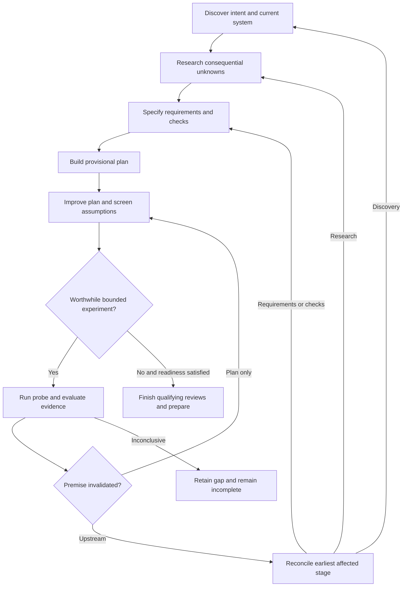

# ShipLoop planning intent repair

Discovery establishes the current system, user intent, constraints, and unknowns.
Research resolves consequential unknowns using existing evidence first. Specification
and test strategy turn that knowledge into requirements and observable checks.
Planning builds a provisional dependency plan; its existing Improve child tests
consequential assumptions and accepts only a coherent, sufficiently supported plan.
Experiments are a method within that review, not a new mandatory phase.

The upstream arrow represents the packet-issued v4 reconciliation route to the
earliest affected discovery, research, specification, or test-strategy stage.
The stopped child must be collected and its evidence retained before that return.
Zero experiments is valid; missing evidence is never converted into a pass.

## Implementation and dependencies

| Order | Change | Completion evidence |
| --- | --- | --- |
| 1 | Add focused failing packet and consumer regressions | New tests fail on missing intended contracts at baseline `918de64752ba4d253393c1891764a553493de48a` |
| 2 | State the initial v4 Plan Improve objective, exit criteria, and frozen scratch scope in the actual child handoff | Cold packets carry materiality, inconclusive, zero-experiment, authority, and existing-loop rules |
| 3 | Clarify v1/v2 direct-stage versus v3/v4 producer/child ownership in shared references | No ambiguous generic resubmission or child replacement after parent pause |
| 3a | Admit the same v3/v4 whole-skill binding in the selected Improve card and its README | A stopped return permits only the packet-issued parent reconciliation route; workers never call the parent |
| 4 | Export decision-relevant evidence even when plan decisions are unchanged | Registered confirming evidence reaches the planning brief; missing required evidence fails visibly |
| 5 | Derive current planning source locators from existing accepted-action projection and require whole-queue revalidation after reconciliation | Fresh packets distinguish current sources from invalidated history without another ledger |
| 6 | Review compact handoff wording with bounded cold-reader cases | Preserve original constraints, evidence, limits, and exact parent return ownership; adopt shortening only if these survive |
| 7 | Version, regenerate distribution views, verify, and publish source and marketplace | Scoped regressions, smoke/package checks, independent review, exact-candidate CI and release receipts |

The implementation preserves v3 as default, the v4 opt-in boundary, existing
Until Loop qualifying reviews and budget, Markdown authority, worker task/ready/done
contracts, and the prohibition on replacing a dispatched graph. It adds no
experiment scheduler, runtime state, schema, or autonomous model launcher.

## Verification

The unchanged baseline already passed 72 targeted checks: v3 guidance (34), v4
navigator (10), v4 consumers (4), planning context (9), and chain planning context
(15). The chain suite's first run exceeded its 180-second bound and remains a
timeout; one authorized retry passed under 600 seconds. Evidence is retained in
`/Users/dadleet/Documents/Codex/2026-09-22/shiploop-planning-intent-audit/`.

Candidate qualification will run those affected suites plus repository smoke,
actual Improve composition, research-template, generated-view consistency, and
package checks. The new packet regressions first failed on the missing experiment
contract and current-source view (13 tests, two expected failures); the five
consumer tests passed, including evidence-only final-result transport. Prompt semantics need bounded
fresh-context interpretation as well as hermetic assertions: sufficient prior
evidence, confirmation without plan change, upstream disproof, inconclusive
results, and exhausted allowance. These are not live generated-application E2E
claims. A full repository CI tier is unnecessary unless review reveals a
cross-subsystem risk those checks do not cover. Required PR CI still applies.

Independent review rejected substantive Backchain prompt pruning for this repair:
its selected-resource and no-nested-loop constraints still protect the boundary.
Only duplicate v4 guide/notebook labels are removed. Compact child context retains
the operative objective, exit criteria, constraints, findings, and source locators.
