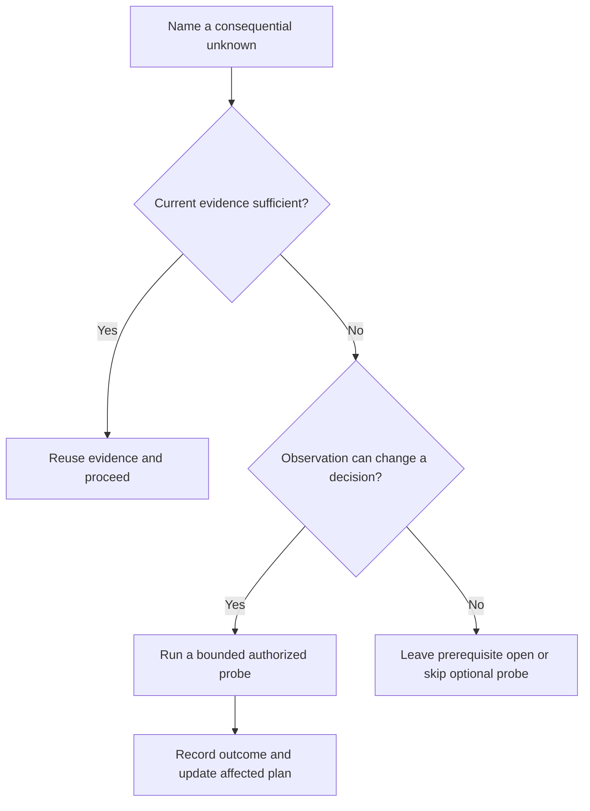

# ShipLoop experiment selection: findings and implemented proposal

**Decision: retain the current production prompt; implement the experiment corpus
and evaluation safeguards.** Four paired experiments produced four ties and zero
material improvements from the proposed 66-word research cue. The preregistered
adoption threshold was not met. No replication was launched because replication
was reserved for an initial consequential candidate win.

This supports continuing ShipLoop's existing conditional experimentation policy:
reuse sufficient current evidence, inspect consequential gaps, and run the
smallest authorized observation that can change a plan. It does not establish
that all tasks or hosts behave correctly. Neither blanket optimism nor mandatory
preflight experiments for every tool are justified by these results.

## What ran

The [preregistered plan](shiploop-probe-decisions-plan-2026-09-18.md) froze the
candidate, four questions, finding-retention veto, replication rule, and bounds
before measured workers launched. The baseline was the actual navigator-v3
research producer from the working tree based on `004447f`, including existing
uncommitted work. Both arms received identical current research references.

Eight fresh Codex CLI workers completed, followed by four independent blinded
judge sessions. No worker edited supplied source. All four reference/altered
fixture pairs calibrated successfully. The gateway preflight verified seven
conditions, including outside-read denial, full receipts, call limits, and report
reserve. Workers used the CLI default model; its selected identity was not
observed, so no named-model claim is made.

| Experiment | Observed behavior in both arms | Blind judgment | Workspace calls, baseline / cue |
| --- | --- | --- | --- |
| F1: reuse versus changed binding | Reused valid ledger evidence; made one current fulfillment read after target/role drift; preserved the live-access limitation. | Tie | 16 / 17 |
| F2: implementation premise | Observed manifest 3.1.0 versus loaded 2.6.4; preview accepted malformed input while committed writing raised `KeyError`; prior output survived and staging was removed. Both planned a thin CLI using the existing writer. | Tie | 24 / 24 |
| F3: opportunistic reuse | Selected the native formatter, rejected unrelated preview reuse, and checked exact Unicode/UTF-8 output because the documented representative probe reserialized its result. | Tie | 22 / 21 |
| F4: access and uncertainty | Distinguished scope denial/not-started from timeout/unknown; kept both export prerequisites open and formatting independent. Neither substituted the unrelated connector. | Tie | 22 / 20 |

No judge reported missing required findings, violations, or lost consequential
findings. All arms passed the rubric's decision, evidence-fidelity, block-scope,
probe-proportionality, and revalidation checks. These are semantic judgments over
these cases, not runtime enforcement guarantees.

A concrete F2 trace shows why the policy works: the request requires failure to
preserve prior output; preview accepts a second row missing `id`; an isolated
committed-write probe reaches that row and raises `KeyError`; the original
destination remains intact and the staging file disappears. Both plans preserve
the existing staging/replacement mechanism and add CLI-boundary acceptance
checks. Preview success alone would have supported the wrong claim.

The cue saved two calls across all four cases (median paired difference -0.5),
but that was not a correctness improvement. In F4 it avoided an additional
catalog listing whose source had already been inspected. In F3 the baseline
executed more boundary examples, while the cue retained their plan consequences
as explicit source inferences. The judge treated neither difference as a material
win. This is contrary evidence to adding more prompt text for this purpose.

| Descriptive measurement | Baseline | Cue |
| --- | ---: | ---: |
| Summed worker elapsed seconds | 325.357 | 308.910 |
| Workspace calls | 84 | 82 |
| CLI input tokens, including cached input | 1,320,407 | 1,326,634 |
| CLI cached input tokens | 1,131,136 | 1,138,432 |
| CLI output tokens | 13,110 | 13,074 |

Worker elapsed time totaled 634.267 seconds; reviewers totaled 126.310 seconds.
These are sums of measured subprocess durations, not total task wall time or
native-helper accounting. Concurrent execution and this small sample make speed
and token comparisons descriptive only. Cached tokens are included in input
tokens and must not be added again.

## Proposal and implementation

1. **Retain production behavior.** No new preflight stage, scheduler, state schema,
   connector, or research paragraph is introduced. The existing guide already
   ties experiments to consequential uncertainty and outcome-to-plan changes.
   [research-loop.md - Frozen bounded experiments: conditional probes and plan consequences](../test/experiments/shiploop_probe_decisions/evidence/2026-09-18/guides/references/research-loop.md#run-bounded-discriminating-experiments)
2. **Keep the four calibrated cases as reusable evaluation inputs.** The new
   `test/experiments/shiploop_probe_decisions` corpus models sufficient evidence,
   drift, runtime/commit differences, useful reuse, and narrow unresolved
   prerequisites. Altered fixtures reverse decisive outcomes so a fixture that
   merely repeats its expected label cannot pass calibration.
3. **Require evidence before adopting future wording.** The test-only adapter
   freezes paired inputs, rejects input drift and unregistered launches, retains
   receipts, creates blinded evidence packets, and preserves incomplete runs.
   Its candidate contract allows exactly one declared cue insertion. These are
   experiment controls, not a second ShipLoop runtime.
4. **Protect scoring integrity.** Independent review identified that the executed
   adapter trusted private rubric hashes stored only in mutable study state.
   An independent exact-byte reconstruction confirmed all four rubric packets
   matched the manifest-validated frozen cases and calibration. That check occurred
   after F1–F3 judges launched and before F4 launched; the timing is retained.
   The implemented adapter now reconstructs those facts during validation and
   binds rubric/calibration/bundle hashes in the judge packet. A regression check
   rejects coordinated mutation of both rubric and state digest.
5. **Include no-model regressions in normal checks.** The new suite is registered
   in the existing ShipLoop inventory, with test documentation and inventory
   count updated. It checks fixture behavior, isolation, input integrity,
   calibrated rubrics, paired preparation, bounded launch requests, and blind
   collection. Live model comparisons remain an explicit experiment operation.

The production research duty continues to require actual-fit evidence and leave
unsupported questions open. Discovery already inspects relevant local skill
contracts and executes the starting test baseline; the cue does not justify
skipping these required checks.
[baseline-research-prompt.md - Frozen research duty: actual-fit evidence and unresolved questions](../test/experiments/shiploop_probe_decisions/evidence/2026-09-18/guides/baseline-research-prompt.md)

## Verification and limits

- Final new corpus/adapter suite: **16 tests passed**.
- Existing targeted baseline checks: **73 tests passed** across navigator-v3,
  routing, and generalized-discovery apparatus suites.
- Broader isolated hermetic run: **partial**, with the core group and **78 of 84
  ShipLoop suites passing**. Seventy-three completed serially; five more completed
  in isolated copies with matching source hashes. The remaining six suites were
  stopped or not started after affected-code validation completed; they are
  unverified, not passes. The interrupted commands did not exit successfully.
  The unverified suites are planning, step-planning, Improve bridge, invalidation,
  managed package, and action walk. This leaves a broader regression coverage
  limit; no production code changed in this task. Completion accounting, partial
  logs, and the reason for stopping are retained. Generated-package parity passed
  in both checkouts.
- After integration into the shared checkout: **16 corpus/adapter tests** and
  **14 inventory checks passed**. Its inventory has **85 ShipLoop suites** because
  a concurrent local-skill suite was preserved. The broader observations bind
  to the isolated snapshot; they are not a claim that the newly merged 85-suite
  shared checkout received another full run.
- The first isolated aggregate failed because the snapshot omitted untracked
  generated plugin files. Those failures were retained; packages were regenerated
  from canonical source in the isolated checkout before rerunning. This was an
  isolation/setup correction, not a product fix or a passing initial baseline.

The study is a single-host research-producer component comparison on synthetic
local fixtures, not full ShipLoop/Improve execution or real MCP, authentication,
deployment, or consumer verification. The fixture write probe performs actual
local temporary-file writes; service responses are modeled. Workers explicitly
received the research references, so this does not measure whether a full host
will discover or load those references unaided.

Blinding withheld prompt contents and the variant mapping, but the historical
bundles retain source paths, timestamps, guide hashes and byte counts. Two judges
explicitly noted those identifiers and reported not inferring a mapping. This is
imperfect blinding; the conservative retain-baseline decision does not claim
statistical equivalence or candidate superiority. Eight successful workers and
four ties do not establish a general reliability rate.

The [evidence archive](../test/experiments/shiploop_probe_decisions/evidence/2026-09-18/README.md)
contains frozen inputs, source snapshots, full coordinator receipts, reports,
private mappings, exact judge inputs and verdicts, measurements, and verification
logs. The original executed helper is preserved separately from the hardened
adapter so future code is not misrepresented as the code that ran this study.

## Publication verification

The publication candidate was prepared in an isolated checkout from remote
`main` at `5a073503bcfe35e620461498b3fa438afe94d0bc`, preserving unrelated shared
checkout changes. Only this study's harness, evidence, documentation, and test
registration were selected; no production skill or generated package changed.
The current inventory contains 89 ShipLoop suites after adding this one.

On that candidate, all 16 probe-decision tests, 15 inventory checks, and 43
shared generalized-discovery apparatus tests passed. Generated-package parity
and whitespace checks passed. The 232 archived files match their retained
SHA-256 manifest. These fresh publication checks are separate from the historical
partial broader run above; no model experiment was repeated.
