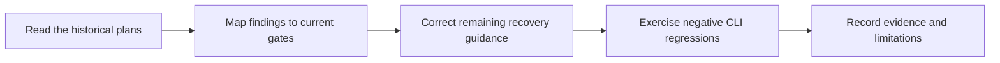

# ShipLoop simplicity and quality-review closeout

**Completed historical closeout — delivered in `ac6cb43`.** Findings and test
counts below belong to that closeout, not a new verification run. Source links
open the maintained module or named reference section; locate the named symbol
rather than relying on the original, now-stale current-tree line offsets.
Use the [operator README](../skills/shiploop/README.md) for maintained guidance
and the [proposal disposition index](shiploop-proposal-closeout.md) for later work.

Source baseline: `414b3e94cb6b520d265257919ec9d280b053db9f`.
This record closes the implementation requests in the
[simplicity plan](shiploop-simplicity-plan.md) and the historical
[quality review](/Users/dadleet/src/shiploop-quality-review.md). It does not
rewrite the review's findings at its original `68324cf` baseline.

## Implementation disposition

The simplicity plan shipped in `c548bc9`. The shared constitution remains a
decision aid in the existing testing/documentation reference, selected by eight
source-editing/planning routes. No extra loop, state schema, dependency, or
style-enforcement engine was added. Its compact iteration table still retains
test criteria, independent oracles, lint, carry-forward, learning commits, and
broader-plan review. See
[testing-and-documentation.md — constitution: scoped defaults](../skills/shiploop/references/testing-and-documentation.md#implementation-constitution)
and [shiploop_protocol.py — constitution routing: eight applicable actions](../skills/shiploop/scripts/shiploop_protocol.py).

The quality review's six runtime corrections are already present in this
baseline. The remaining work here is an actionable recovery-order correction
and stronger end-to-end regression evidence, not replacing those gates.

| Finding | Recorded correction and named consumer | Regression evidence |
| --- | --- | --- |
| F1: Late source revision after convergence | Final verification requires the last accepted primary commit, clean worktree, and that iteration's passing evidence. [shiploop_protocol.py — require_final_verify_convergence_bound: reject late revisions](../skills/shiploop/scripts/shiploop_protocol.py) | Existing real-Git helper tests cover committed/staged drift. The added CLI action walk creates a source commit after two trivial passes, runs green checks, proves finalization refuses without changing durable state, and proves repair retains the code but restarts review. |
| F2: Unreviewed outer changes | Outer closure requires the integrated-step baseline; dirty/staged/committed product changes are refused, while the separately certified review ledger is distinguished. Product fixes use corrective DAG work. [shiploop_protocol.py — require_outer_product_baseline: preserve reviewed product](../skills/shiploop/scripts/shiploop_protocol.py) | Boundary tests exercise dirty and committed changes, staged-only changes, missing anchors, and certified/uncertified ledger changes. The existing outer-replan action walk exercises a corrective pending step without rewriting completed receipts. |
| F3: Unlanded merge intent | `merge-recover` checks that Git is unambiguous, the target is unlanded, the branch is a valid descendant, and both checkouts are clean before retaining provenance and restarting review. [shiploop_protocol.py — merge_recover: explicit unlanded recovery](../skills/shiploop/scripts/shiploop_protocol.py) | The dirty-worktree test now follows the actual supported order: preserve and commit scoped work, recover, then review and reverify. It also proves verification is unavailable before recovery and the refusal leaves state unchanged. |
| F4: Conflicting lifecycle placement | A typed preparation/publication DAG step is legal only when the matching lifecycle placement is `dag`; that placement also requires a typed step. Initial/revised candidates use the same validator. [shiploop_protocol.py — validate_lifecycle_steps: symmetric placement checks](../skills/shiploop/scripts/shiploop_protocol.py) | Lifecycle tests cover both activities against none, outer placement, missing DAG activity, and valid DAG placement. |
| F5: Oversized full Git body | Required bounded reads use fragments with action/HEAD/message identity, offset, digest, and complete-coverage gates; the index is not body proof. shiploop_history.py — record_bounded_page: bounded identity-bound fragments (removed in ShipLoop 0.23.0) | History-page tests cover large Unicode bodies, all four reader routes, partial reads, holes, replay/drift, line endings, and hostile continuation-like text. |
| F6: Missing migrated prompt context | Migration materializes the retained prompt in the same transaction, preserves matching existing prompt content, and pauses on unusable intent rather than fabricating it. [shiploop_protocol.py — migrate: original-request recovery](../skills/shiploop/scripts/shiploop_protocol.py) | Migration tests exercise exact prompt recovery followed by bounded cold retrieval, unsafe IDs, and missing/invalid prompt refusal. |

## Narrow follow-up changes

The previous dirty-worktree diagnostic said to reverify *before* `merge-recover`,
although `verify` is not an allowed activity at the merge cursor. The diagnostic
and README now use the executable order. Recovery still does not stage files,
discard work, abort Git, or infer permission; the host preserves/reconciles the
intended changes and makes the scoped commit. Only then can recovery restart the
required Improve review/check cycle.

The new F1 test uses the public CLI from initialization through actual planning,
implementation, and two committed trivial Improve iterations. A later source
commit still passes lint and product checks, but cannot complete final verification.
An explicit repair retains that source and invalidates the prior convergence.
This complements the existing direct-guard regression instead of introducing a
second harness or another state transition.

## Verification

All **112 distinct focused tests** below passed for this follow-up:

| Command / selection | Passing tests |
| --- | ---: |
| `python3 test/shiploop-packets.test.py` | 29 |
| `python3 test/shiploop-protocol.test.py` | 34 |
| `python3 test/shiploop-objectives.test.py` | 18 |
| `python3 test/shiploop-boundaries.test.py` | 10 |
| `python3 test/shiploop-merge-recovery.test.py` | 7 |
| `python3 test/shiploop-history-pages.test.py` | 10 |
| `python3 test/shiploop-migration-prompt.test.py` | 3 |
| `python3 test/shiploop-action-walk.test.py ShipLoopActionWalkTests.test_post_convergence_commit_with_green_checks_requires_inner_repair` | 1 |

The recovery-order assertion failed before the diagnostic correction and the
seven-case recovery suite passed afterward. The new F1 CLI walk passed in about
84 seconds; the full history-page suite passed in about 65 seconds. Packet and
protocol suites were rerun after the final source change and plugin sync.
This is focused regression coverage: the earlier full 380-test result belongs
to baseline `414b3e9`, and the other action-walk cases were not rerun here.

Ruff, runtime bytecode compilation, `git diff --check`, package frontmatter
checks (17 skills), new document links/current source anchors, and scoped
ShipLoop plugin parity passed. Independent review found the pending derived-copy
sync; synchronization resolved it, with no remaining semantic finding in this
follow-up. The original review retains its historical line anchors; this
closeout now links to named modules/sections so old offsets cannot masquerade
as current decisive source locations.

## Boundaries retained

- Required reads are bounded in characters and paginated. This is not a
  tokenizer-specific or total-context-window certification. Legacy explicit
  unbounded history display remains available but is not a small-context read.
- Global preparation is placed before affected work; step-specific preparation
  remains a dependency of its actual consumers, not every unrelated step.
- Two trivial passes and passing checks do not prove semantic completeness.
- Tests are isolated local fixtures; no live platform or host model is certified.
- Canonical skill source and its derived plugin view must match. Unrelated
  Review Coverage work and host installation/configuration remain untouched.
