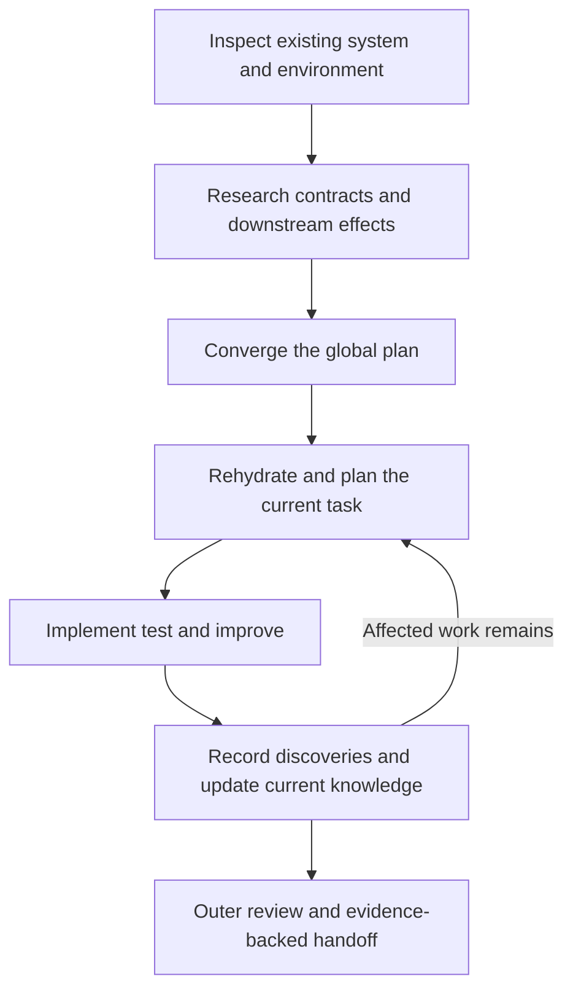
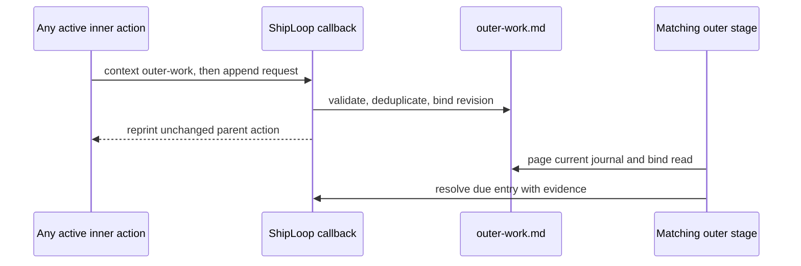

# ShipLoop: system-aware planning and artifact consumption

## Status, scope, and decision

**Implemented and locally regression-validated, 2026-09-12.** The audit baseline
was `c548bc98161f1ce613bd5e10e70a3f33a1e8ee50` in
`/Users/dadleet/src/skill-craft`. This document records both the approved
design and the implemented-worktree boundaries; it is not by itself proof that
every new gate has passed an end-to-end run, is committed, changes a running
ShipLoop session, authorizes remote access, or certifies a deployment.
Unrelated review-coverage changes remain outside this scope.

Adopt three improvements together:

1. Establish a system-level context model before the global plan, then require
   each inner task to inspect its relevant current slice before coding.
2. Investigate selected remote interactions through their actual contracts and
   downstream effects, usually two or three meaningful boundaries deep, with
   risk-based expansion and evidence-backed stopping conditions.
3. Give every generated artifact a declared, reachable consumer: a normal
   decision/check, a diagnostic/recovery operation, or final delivery review.
   Test that consumer. A file merely existing, being hashed, or being linked is
   not evidence that its meaning was used.

Keep the one-invocation skill and existing action/result CLI. Markdown remains
authoritative. Use ShipLoop's incorporated until policy, not a second standalone
state machine. New runs now select a seven-message immutable history policy;
existing runs without that marker retain the legacy ten-message requirement.
The implemented outer-work side callback and final delivery/handoff objective
remain bounded additions to this existing protocol, not a separate workflow.

### Implementation record

The following items are implemented. The focused and integrated local validation
is recorded in section 9; live-platform and qualitative model trials remain
separate from this deterministic acceptance evidence:

| Slice | Current implementation boundary | Deliberate limit |
| --- | --- | --- |
| System context | A versioned research-evidence extension validates bounded observations, roles, interfaces, interactions, question/source links, and selected task projections. | It validates durable references and invalidates stale planning context; it does not discover a platform or prove a host-reported probe. |
| Task uptake and history | Step context/identity binds selected system context; new-run pass receipts bind the seven-message history policy while legacy receipts retain ten. | It does not make a full history window a proof of semantic understanding. |
| Early observations | A script-issued `OBS-…` callback records a compatible non-secret, unverified current fact before parent completion, with replay-safe receipt/history and existing-route recovery. | It cannot resolve a blocker, turn a check green, prove a remote fact, or bypass repair/replan/pause; unsupported routes reject before mutation. |
| Artifact readers | Allowlisted artifact catalog, archive diagnostics, and check-log excerpts are bounded, path-safe, and screened. | Diagnostics do not restore historical authority, execute content, or make redaction a secrecy guarantee. |
| Outer work and handoff | Any active inner action can append a script-issued, replay-safe outer-work obligation; outer quality/publish/handoff must page and resolve work due at their stage. New-run handoff is a converged objective. | The journal records a dependency and evidence only; it never grants deployment authority or creates an external effect. |

### Non-goals

- No vendor-specific implementation, mandatory MCP server, new integration, or
  automatic installation of SDKs or style tools.
- No mandatory dev/test/stage/prod account topology for every project.
- No general enterprise architecture database, separate research scheduler,
  duplicated schema library, or new runtime artifact registry database.
- No unrestricted rewriting of historical evidence or approved requirements.
- No automatic production mutation, credential update, dependency auto-updater,
  or repeated publication implied by a quality loop.
- No claim that read receipts or two trivial passes prove understanding or
  exhaustive quality.

## 1. Verified audit findings

This table is the source-audit snapshot at the baseline named above. Its
“Gap and recommended action” column explains why the implementation exists;
the implementation record and later matrices describe its current worktree
status rather than rewriting the historical finding. Links intentionally point
to the current corresponding symbol or section, not a claim that current code
still has the historical gap.

| ID | Baseline evidence (historical snapshot) | Gap and recommended action |
| --- | --- | --- |
| A1 | Discovery already instructs inspection of MCP resources, CLIs, SDKs, syntax, module boundaries, client/service calls and publication. [platform-discovery.md — discovery checklist: existing breadth](/Users/dadleet/src/skill-craft/skills/shiploop/references/platform-discovery.md:20) | Preserve this; make the depth, evidence, and downstream consumers explicit rather than adding another broad checklist. |
| A2 | Platform records bind selected interfaces/writers, identity, authority, setup, development validation, promotion and route ordering. [shiploop_discovery.py — validate_machine: platform contract](/Users/dadleet/src/skill-craft/skills/shiploop/scripts/shiploop_discovery.py:256), [shiploop_discovery.py — validate_lifecycle: dependency ordering](/Users/dadleet/src/skill-craft/skills/shiploop/scripts/shiploop_discovery.py:420) | These do not establish operation-specific input/output/error contracts or a named environment-role map. Extend references and validations narrowly. |
| A3 | Research has stable question/source IDs, evidence bounds, a nine-part rubric and convergence gates. [shiploop_research.py — RUBRIC and bounds: research model](/Users/dadleet/src/skill-craft/skills/shiploop/scripts/shiploop_research.py:23) | The relationship between an initial question, its deeper questions, an interaction contract, and affected tasks is not a first-class validated link. Add small reference fields, not full remote schemas. |
| A4 | Inner planning already reviews code, environment, dependencies, flows, edge cases and second-order effects. [execution-planning.md — Review rubric: existing task duties](/Users/dadleet/src/skill-craft/skills/shiploop/references/execution-planning.md:185) | Clarify the required task-specific decision and evidence for each dimension, including environment roles and library invocation conventions. |
| A5 | Step context contains direct suppliers/consumers and five artifact digests. Its identity binds code/worktree, spec, environment, behavior, DAG and knowledge. [shiploop_protocol.py — step_plan_step_context: current projection](/Users/dadleet/src/skill-craft/skills/shiploop/scripts/shiploop_protocol.py:1801), [shiploop_protocol.py — step_plan_context_identity: drift checks](/Users/dadleet/src/skill-craft/skills/shiploop/scripts/shiploop_protocol.py:1863) | It lacks an explicit selected research/interaction-contract projection and direct research certificate binding in that identity. Add bounded source locators and exact applicable bindings. |
| A6 | `context_evidence` requires nonempty lists for step, implementation, environment and dependencies. [shiploop_step_planning.py — check_context_evidence: structural evidence gate](/Users/dadleet/src/skill-craft/skills/shiploop/scripts/shiploop_step_planning.py:708) | Nonempty prose does not establish that a particular source or role was consulted. Add resolvable reference checks where deterministic; assess conclusions through review and real tests. |
| A7 | Current knowledge supports revising an existing discovery ID within its domain, with new provenance/revision. [shiploop_knowledge.py — apply_result: current-entry replacement](/Users/dadleet/src/skill-craft/skills/shiploop/scripts/shiploop_knowledge.py:399) | Do not introduce a second current-facts journal. Reuse this ledger and make current/superseded interpretations explicit in packets. |
| A8 | Carry-forward is after successful verification, and cannot rewrite frozen contracts; later research has transitive pending-step ordering. [carry-forward.md — checkpoint and authority: permitted updates](/Users/dadleet/src/skill-craft/skills/shiploop/references/carry-forward.md:3), [carry-forward.md — mandatory mapping: future work](/Users/dadleet/src/skill-craft/skills/shiploop/references/carry-forward.md:142) | A discovery that prevents successful testing needs a durable submission route before successful verification. Extend existing callbacks deliberately; never wait for a false PASS to record it. |
| A9 | The final report's fixed sources included quality and handoff, but not preparation, coverage or delivery records. [shiploop_report.py — _FIXED_SOURCES: current terminal input set](/Users/dadleet/src/skill-craft/skills/shiploop/scripts/shiploop_report.py:27) | Add meaningful selected-field consumers and source bindings for these outer records. Do not describe current HTML as consuming every final artifact. |
| A10 | The artifact inventory documented purpose/authority but not a complete producer-to-reader contract; some audit archives had no dedicated semantic consumer. The generic context fallback is constrained by a public section allowlist. [state-files.md — Reader and writer map: conditional catalog](/Users/dadleet/src/skill-craft/skills/shiploop/references/state-files.md:65), [shiploop_protocol.py — context parser: public retrieval boundary](/Users/dadleet/src/skill-craft/skills/shiploop/scripts/shiploop_protocol.py:6181) | Add a scenario-aware reader matrix and coverage tests. A fallback branch alone does not establish a reachable reader; keep audit-only material out of ordinary cold prompts. |
| A11 | Inbox paths are real and printed by packets; completion reads the submitted result. [shiploop_packets.py — packet result path and callback: inbox contract](/Users/dadleet/src/skill-craft/skills/shiploop/scripts/shiploop_packets.py:2308) | Document inbox result/manifest drafts in the inventory and clarify that an arbitrary note is not accepted durable knowledge. Do not falsely remove the inbox or invent a replacement. |
| A12 | Survey documentation described a sequence-stage freeze, but the runtime already records `environment_sha256` when accepting survey, before research. [survey.md — Freeze discipline: corrected timing](/Users/dadleet/src/skill-craft/skills/shiploop/references/survey.md:195), [shiploop_protocol.py — complete: survey environment binding](/Users/dadleet/src/skill-craft/skills/shiploop/scripts/shiploop_protocol.py:4909) | Correct the documentation; distinguish accepting the survey baseline from later sequence certification. Do not rely on the stale wording to allow untracked research edits to environment state. |

The audit is source-based plus focused regression checks. It is not a live audit
of any connected service. Mechanical binding, host-reported observations, and
semantic judgment must remain separate in documentation and reports.

## 2. Establish the whole-system context first

The initial approach/survey should answer the following, scoped to the requested
change. Preserve stable IDs and source locations, not copied repositories or
transcripts.

| Dimension | Required investigation and resulting decision |
| --- | --- |
| Existing state | Initial persisted/business state; valid transitions; migrations; configuration/feature flags; queues/jobs/caches; fixtures and data ownership. Distinguish observed state from required future state. |
| Existing code | Entry points, modules/functions, public contracts, current tests, dependency versions, generated/reserved files, repository conventions and nearby consumers. Decide reuse, modify or add with reasons. |
| Existing systems | In-process components, services, storage, remote platforms and integration boundaries. Identify sources of truth and existing writers; local Git is not proof of remote deployment. |
| Environment roles | Which roles actually exist or are required: local, development, test, staging, production or a task-specific equivalent. Identify permitted actions, safe role/target probes, test-data constraints and isolation. |
| Differences and promotion | Runtime/API/schema/configuration/version differences across selected roles; consequences for tests; build/artifact provenance; migration order, rollback and verification where promotion applies. |
| Operational constraints | Access/authority, rate and size limits, availability, async work, concurrency, quotas, security/data handling and maintenance constraints that can change the design. |
| Unknowns | Which uncertainties block a decision, which can be resolved by scoped research, and which need the user. An unavailable system is not evidence of inapplicability. |

Use environment roles as labels, not assumed account names or secret resource
identifiers. A single developer environment may satisfy several roles with a
justified isolation policy. A production-only connection does not authorize
using production as a test fixture. Do not create an environment merely to fill
a table. Record required-but-unavailable roles as blockers.

### Global plan outputs

The converged global plan must map requirements and behavior transitions to:

- affected components and interaction contracts;
- required initial state and setup/fixtures;
- producer/consumer dependencies and a forward execution sequence;
- Ready and Done criteria for each task;
- test scope and actual test surface/environment;
- data/configuration migration and compatibility work, when needed;
- conditional promotion/rollback and final evidence;
- the canonical artifacts that will be updated and their later readers.

This is a compact system map within existing environment/research/plan records,
not another scheduler. The inner microplan elaborates the current task against
fresh evidence; it does not repeat or silently replace the global plan.

## 3. Research two or three meaningful boundaries deep

Depth means following causal dependencies, not visiting three websites or
forcing three nested records for every trivial local change.

| Investigation level | Questions | Required output |
| --- | --- | --- |
| 1: Exposed surface | What selected tool/resource/CLI/API is available? Which exact operation applies? Which role and version are observed? What is the allowed writer? | Inventory/probe evidence, operation and source references, authority limitations. |
| 2: Real invocation contract | What does that operation actually call? What are the input/output/error envelopes, serialization, required/optional/null semantics, registration/export rules, async/cancellation and pagination behavior? Which SDK/client idiom is supported? | Compact operation contract with primary/local sources and a concrete success/failure trace. |
| 3: Downstream behavior | What state, service or resource does the call depend on or change? What happens on duplicate requests, partial commit, stale reads, timeout, retry, concurrency, rate limits, version mismatch or differing environment roles? | State transitions, failure/recovery rules, second-order effects, test obligations and unresolved dependencies. |

For a high-risk or unresolved dependency, continue beyond level three when it
could change correctness, permission, data safety, tests or deployment. For a
simple local operation, stop earlier with a concrete justification. If a deeper
layer is opaque, record its public guarantees and uncertainty; do not invent
its implementation or probe outside authorized scope.

### Per-interaction compact contract

Record only fields that change a decision. Use stable interaction IDs and
references to authoritative schema/docs, not copies of entire vendor schemas:

- Caller and callee; operation; relevant environment role and permitted writer.
- Input/output shapes, error representation and one minimal safe example.
- State preconditions, effects, completion/read-back condition and invariants.
- SDK/library/version, supported invocation idiom and relevant local wrapper.
- Retry/idempotency/timeout/cancellation/pagination/transaction semantics as
  applicable, with explicit unknown or not-applicable reasoning.
- Source/version/observation references, expected evidence and revalidation
  triggers.
- Related research questions, requirements/transitions, consumers and test cases.

Keep the full explanation in `research.md` with source/question records in
`research-evidence.md`. The survey owns interface identity and route declarations
in `environment.md`; it should point to planned investigation rather than assert
answers not yet obtained. Research follows the accepted, hash-bound survey
baseline; it must not silently write later conclusions into `environment.md`.

For machine checks, extend existing versioned records with the minimum links:
parent question IDs, applicable interface/role IDs, and stable source/contract
references. Validate IDs, scope, referential integrity, duplicate/conflicting
records and required unknowns. Depth is a review requirement; a numeric depth
field alone must never be accepted as proof of investigation.

Current research limits include 64 question/source rows per array and 24 source
references per question. Preserve
limits initially. If material questions exceed the supported inventory, report
the capacity blocker and revise the scoped investigation design; never truncate
questions or mark unresolved work trivial. Do not automatically increase bounds
or schedule later research that is needed to make the current decision.

### Library and code-style discovery

Distinguish **behavioral conventions** from formatting preferences:

- Protocol/library conventions: supported public entry points, resource lifetime,
  sync/async usage, connection pooling, transactions, exceptions/results,
  cancellation, cleanup, retry ownership and generated-code boundaries.
- Project conventions: applicable repository guidance, existing validators,
  wrappers, linters, tests and idiomatic nearby code.
- Documentation conventions: concise contracts at changed public boundaries;
  comments explaining surprising constraints or decisions; source links where
  useful. No boilerplate comment quota or compressed unreadable identifiers.

Resolve contradictions explicitly. Do not copy an outdated local pattern that
violates the current supported API; do not replace established project style
merely because an unrelated style guide looks attractive. Reuse the existing
implementation constitution and selected reference routing.

## 4. Required uptake at each phase

| Phase | Mandatory context/decision | Durable output or gate |
| --- | --- | --- |
| Approach and survey | Existing system/code/state; requested scope; applicable roles and interfaces; uncertainty inventory. | Environment/approach candidates plus named research questions; converge through existing objective loops. |
| Research | Trace selected boundaries, primary/local evidence, contradictions, idioms, state effects and test feasibility. | Research pair and question/source links; no unresolved required question at finalization. |
| Behavior and spec | Translate discovered contracts into sequence flows, guards, transitions, errors, recovery and independent expected outcomes. | Behavior/spec/lifecycle candidates with stable source/contract references. |
| Global sequence | Build actual prerequisites, consumers, environment setup/test/promotion ordering, Ready/Done and artifact-reader obligations. | Existing human plan and DAG; no disconnected research or verification work. |
| Initial step plan | Read current code/config/tests, accepted contract slice, applicable roles, suppliers/consumers, current knowledge and last seven full Git messages. | Compact microplan and criteria matrix; resolve current blockers before coding. |
| Improve planning | Repeat with the current diff, parent findings, actual test results, environment observations and relevant library semantics. | Revised plan; changed context resets affected convergence. |
| Implement and verify | Follow the accepted task plan and invocation idioms; refine tests with code-specific learnings; run lint and all required tests against correct roles. | Code/test/doc results and action-bound check evidence. No mock substituted for a required real boundary. |
| Discovery/checkpoint | Ask whether new facts alter the current task, pending work, system map, tests, docs or authority. | Current knowledge update, reopened review, mapped pending work or explicit pause. |
| Post-inner | Reassess broader steps and downstream consumers against new knowledge, not only task success. | Compatible pending-plan revision and required research-producer dependencies. |
| Outer quality/handoff | Reconcile expected versus observed behavior, role/version differences, actual evidence and artifact consumers. | Fresh quality checks, conditional authorized promotion, converged delivery/handoff summary and derived HTML. |

### Task-plan contents

Use one compact section in the existing plan candidate, with these eight items:

1. **Task contract:** exact outcome, scope, Ready/Done and parent findings.
2. **Current reality:** inspected symbols/call sites/tests/configuration, existing
   data/state, relevant diff and whether code is absent, partial or already done.
3. **System and role bindings:** applicable interaction IDs, versions, role(s),
   allowed effects, readiness probes and mismatches that matter.
4. **Source uptake:** which research/behavior/spec conclusions apply and what
   changed since the last evidence; Git lesson to adopt, reject or retain.
5. **Ordered microplan:** edits, local prerequisites, post-code test refinement,
   documentation and verification. Backchain each required output/check to a
   current fact or earlier producer; do not introduce a recursive scheduler.
6. **Test criteria:** case and requirement IDs, input/pre-state, expected
   output/post-state/effects, test selector, fixture, role and check command.
7. **Impact review:** adjacent/transitive consumers, persisted data, callbacks,
   caches, permissions, rollback, observability and documentation.
8. **Open findings:** blocker, next investigation or broader-plan disposition.
   No unanswered material condition hidden behind an optimistic Ready status.

At each cold boundary, packets must return selected IDs, authoritative locators,
digests/revisions, concise constraints, unresolved obligations and bounded paging
commands. They must not rely on remembered architecture or dump every past
research record. Include the same necessary constraints on repair-capable stages,
including failed verification, because the host may change code there.

**Source-traced current example:** input `context --section environment` reads
`environment.md`, obtains the current scoped knowledge overlay, and returns a
bounded response labeled “Frozen environment baseline” and “Current operational
knowledge overlay.” This lets a fresh host distinguish baseline from new
observations. The bounded `step-context` now adds the selected task/direct-
consumer system-context projection and its research binding; a changed binding
cannot release an old microplan. Neither projection proves that a remote probe
is still current.
[shiploop_protocol.py — step_plan_step_context: selected system-context projection](/Users/dadleet/src/skill-craft/skills/shiploop/scripts/shiploop_protocol.py:1801),
[shiploop_protocol.py — system_context_context: task and direct-consumer selection](/Users/dadleet/src/skill-craft/skills/shiploop/scripts/shiploop_protocol.py:2479)

### Shared improvement policy

Every substantive candidate goes through its existing parent loop: review the
current artifacts and latest seven full commits, plan/apply fixes, verify, and
make the verbose learning commit. Material changes reset convergence. Apply and
check trivial fixes too. Two consecutive qualifying trivial passes with no open
findings permit fresh final checks; failure, unavailable evidence or exhausted
budget is unfinished. Do not recursively wrap callbacks, Git commits, probes or
publication in independent loops.

The generic objective implementation currently treats every candidate-byte edit
as material. Retain that conservative rule unless a separately reviewed change
establishes how genuine trivial edits can count safely. Document the possible
extra unchanged passes rather than claiming all loop families already classify
edits identically.

### History policy compatibility

For new runs, propose a script-owned immutable run policy such as
`history_policy: {version: 2, required_limit: 7}`. Each pass binds the effective
policy along with its existing action/HEAD/full-body paging evidence. Renderers,
retrieval and all validators use that bound policy, not separate hard-coded
counts or a host-selected limit. An explicit unknown/invalid policy fails closed.

Existing runs/receipts without the new marker retain the legacy ten-message
policy throughout that run. Do not silently reinterpret them as seven or lower
their obligations mid-pass. The minimal rollout is new-runs-only; an intentional
mid-run upgrade is deferred until an explicit repair/migration design preserves
completed evidence and creates fresh affected passes. Add fixtures for generic
objectives, research/behavior/spec, step planning and product Improve, including
fewer-than-seven commits, partial pages, tampering and legacy ten-message proof.

## 5. Keep current knowledge editable without rewriting history

“Anyone can update an artifact” should mean any phase/worker can submit a
source-backed proposed update, while the script owns admission, revision and
invalidation. It must not mean arbitrary writes to script-owned state.

| Artifact class | Update policy | Downstream effect |
| --- | --- | --- |
| Mutable active candidates | Submit a complete revision or approved scoped transformation through the owning action. Preserve untouched IDs and content. | Revalidate candidate/ledger; invalidate old checks and reset affected convergence. |
| Current operational observations | Reuse stable discovery IDs in `knowledge.md`, with current provenance, revision, scope and revalidation instructions. | Next applicable packet reads the current value; superseded history remains historical. |
| Pending global work | Use existing compatible pending-only plan revision and obligation mapping. | Rebind changed pending consumers; required research producer runs first. |
| Accepted environment/research/spec baseline | Before execution, use controlled revisit/reconvergence. After execution starts, retain baseline and attach compatible current observations; real scope/contract/permission changes require direction and explicitly replanned/new work. | Never silently certify completed work against a different contract. |
| Results, pass archives, checks and operation evidence | Preserve recorded facts. Corrections are new linked observations/results, not edits that make past evidence appear different. | Reassess affected current claims; do not repeat a remote effect to repair prose. |
| Product code, README, interface docs | Edit through scoped product work, subject to its tests and repository authority. | Review dependent code/docs/tests and commit the change. |
| Derived report | Regenerate from accepted source records and validate. | Changed source invalidates report integrity; HTML never changes workflow state. |
| Generic ShipLoop improvements | Update the existing deduplicated proposal journal with provenance. | Final handoff presents proposals; a product run cannot self-modify ShipLoop. |

Use the effective environment projection to present **approved baseline + current
scoped observations**, with their provenance and unresolved conflicts. An overlay
may update a current observation, but cannot override permission, the selected
writer, or an acceptance requirement. Do not present a historical probe as current
access or a scheduled research task as an answered question.

### Early-observation submission

New versioned runs expose `context --section observation` while a parent action
is active. It issues a deterministic `OBS-…` ticket with that parent action,
parent stage/step, expected knowledge revision, a closed result template, and
the exact `done` callback. The host first pages current knowledge; it must not
invent the side-action ID or edit the parent cursor.

The callback accepts at least one existing-schema, non-secret discovery with
safe evidence, current revision, learnings, scope, disposition, rationale, and
revalidation data. It deliberately has no resolution field: it records an
unverified `not-run` fact rather than a successful `verify` result or an
authority decision. Empty routine checkpoints are rejected. A pause,
permission, or contract blocker is rejected before mutation: use the ordinary
pause/direction path or the owning carry-forward route instead.

One transaction updates `knowledge.md`, writes its immutable
`knowledge-history/OBS-…` checkpoint, writes `observations/OBS-….md`, binds the
receipt/state hashes, and leaves the parent action unfinished. An identical
replay is safe; a changed replay or stale knowledge revision is refused. An
informational fact before a bound proof can return to the existing parent work.

If a new fact needs a context/proof repair, ShipLoop accepts it only when the
current stage has a compatible existing route: approach/survey/post-inner
objectives and inner planning/execution can archive/rebind through that route;
informational preflight facts can preserve the parent unchanged. Unsupported
outer or other stage combinations are rejected before mutation, not silently
parked in an unrecoverable pause. For an accepted repair route, `resume` cannot
reuse the prior check/convergence; use the printed repair/replan route (initial
`implement` can reopen step-plan repair), or seek direction for a broader
contract/authority change. This preserves cold-resume correctness without a
general in-place rebaseline engine.

### Outer-work discovery callback

Some inner discoveries are neither a current product-code repair nor a generic
ShipLoop improvement proposal: they are durable prerequisites for a later
quality, publication, or handoff activity. The implemented answer is a lazy,
Markdown-authoritative `outer-work.md` journal rather than a new scheduler or a
second knowledge database.

The callback contract is intentionally narrow:

- `context --section outer-work` supplies the current effective entries, a
  script-issued request ID, current revision, append/resolve templates, and
  exact continuation command. Inner work must read existing entries before
  choosing a stable `entry_id`/`dedupe_key`.
- `journal --target outer --operation append --action PARENT --result FILE`
  accepts an obligation with target `quality`, `publish`, or `handoff`, concrete
  prerequisite/outcome/evidence/rationale, and explicit no-authority statement.
  It persists a separate replay receipt and returns the parent action unchanged.
- The file is created only after an accepted append. Its append-only events
  derive effective entries; exact request replay is safe, changed replay is
  rejected, duplicate semantic dependencies do not create a second obligation,
  and changed details can reopen an entry.
- At the named outer stage, the host pages the full current record and calls
  the script-issued `resolve` callback with current revision, evidence, and
  reason. Only the matching stage can resolve. `planned` is not done; there is
  no waived, skipped, or implied-deployment state.
- A pending quality row blocks quality/publish/handoff; a pending publish row
  blocks publish/handoff; a pending handoff row blocks handoff. A changed journal
  invalidates an active outer objective's convergence rather than inheriting its
  trivial streak.

This callback is available from any active inner action, including one whose
normal check is not yet successful. It does not make the inner action complete,
does not permit a remote call, and does not substitute for the existing
carry-forward/replan/pause route when the discovery changes the product plan or
authority. The generic `shiploop-improvements.md` journal remains proposal-only
and distinct. See Outer-work journal (removed in ShipLoop 0.23.0).

## 6. Artifact producer/consumer audit and closure plan

The catalog below covers run-artifact families, including conditional artifacts;
it does not claim every byte of every instance has been semantically interpreted.
Implemented reader routes are marked as such; focused producer/reader tests and
the full local regression inventory passed. This does not prove that a host
semantically understood every artifact instance.

**Reader classes:** decision/context (content informs next work), validator
(structured meaning is checked), diagnostic/recovery (used only when needed),
and delivery (reported to the user). Integrity-only reads are labeled separately.
Human read acknowledgements establish delivery, not comprehension. No requirement
to feed all archives/logs into each LLM context.

| Generated family | Existing consumer / condition | Closure / remaining validation |
| --- | --- | --- |
| `state.md`, `run.md`, `prompt.md` | Runtime/recovery and phase context; markers protect authority. | Keep; preserve original intent rather than rewriting it with discoveries. |
| `preflight.md`, `approach.md` | Packet-selected baseline context; approach/survey/sequence reconcile the accepted preflight/approach records when present. | Implemented bounded reader routing; retain the records as accepted baseline evidence rather than recreating their facts from chat. |
| `environment.md` | Validators, frozen bindings, environment context and revalidation. | Implemented selected system/role references in task context; validate that source-content updates invalidate the binding. |
| `research.md`, `research-evidence.md`, `behavior.md`, spec/lifecycle drafts | Planning candidates, host review and certificate gates. | Implemented interaction/question/consumer links and bounded cold-context uptake; validate across legacy/new-run fixtures. |
| `spec.md`, `lifecycle.md`, `plan.md`, `backchain/plan.md` | Acceptance, scheduler, task context and quality/report readers. | Require traceable task-specific selections and product-output consumers. |
| `knowledge.md` | Bound current ledger and fully paged review selection. | Reuse current-entry update model; expand appropriate stage readers/submissions. |
| `knowledge-history/<action>.md` | Immutable carry-forward or early-observation checkpoint; current knowledge/provenance, replay guards, and allowlisted archive diagnostics can use it. | Keep it historical: diagnostics compare provenance/revision without restoring an old checkpoint as current authority. |
| `knowledge-reads/<action>.md` | Continued paging and completion validation. | Keep; do not claim semantic understanding. |
| `observations/<OBS-id>.md` | Script-issued early-observation receipt; replay guard and current-knowledge provenance. | Its record establishes only accepted unverified host input; test identical replay, changed replay, stale revision, and required recovery routing. |
| `outer-work.md` | Script-issued inner append/outer resolution callback; the rendered ledger is paged for inner deduplication and outer-stage gates. | Implemented: bounded context offers templates/continuations; dedupe/revision/provenance are validated; quality/publish/handoff must read and resolve due rows. Test that an absent optional journal stays honest and changed bytes reset affected outer convergence. |
| `journal-requests/<id>.md` | Immutable append/resolve callback replay receipt; allowlisted audit diagnostic. | Exact replay is safe and changed payloads fail. It never consumes the parent action or establishes a remote effect. |
| `outer-work-reads/<action>.md` | Context-paging transaction records the current rendered journal digest and covered offsets. | The matching outer transition requires full current coverage; a changed journal invalidates the receipt rather than reusing convergence. |
| `planning/<kind>.md`, iterations and certificates | Active loop validation, finalization and report learning extraction. | Keep exact reference validation; label current cursor versus immutable pass separately. |
| `objectives/<loop>.md` plus candidates/passes/abandoned/certificate | Objective context, archive validation, finalization and report. | Reuse for final delivery/handoff objective; bind original publication evidence. |
| `step-planning/<loop>.md` plus candidates/passes/abandoned/certificate | Current context, exact-byte/structured archive checks and implementation release. | Add relevant research/role binding without broadening source-edit permission. |
| `steps/<id>.md`, `results/<action>.md` | Lifecycle, replay, historical test projection, platform proof and report. | Keep; every newly introduced result field must have a named consuming decision or diagnostic. |
| `inbox/<action>.md`, inbox check-manifest drafts | Printed host submission paths; completion/check commands consume them. | Add missing inventory entries; abandoned/unsubmitted drafts are not accepted state. Clarify observation submission versus arbitrary scratch notes. |
| `checks/*.md`, `manifests/*.md`, `check-attempts/*.md` | Verification, manifest comparison, acceptance checks and report attempt summaries. | Keep; retain failed/unrun states and do not substitute existence for passing evidence. |
| `logs/<action>/<attempt>/...` | Check output evidence; host diagnostic instructions, no automatic report content reader. | Implemented: bounded, path-safe diagnostic retrieval resolves the selected check record and screens stdout/stderr (or combined output) before emitting an excerpt. Do not bulk ingest logs or promise perfect redaction. |
| Full `history-pages/*.md` and loop history archives | Full-body paging/identity gates and host review. | Implemented immutable seven-message policy for new runs; retain the historical ten-message policy for old receipts. |
| History navigation `*-index.md` | Navigation display; reachable only through the bounded `history-pages` audit diagnostic, not a normal semantic reader. | Preserve existing files for bounded inspection, but do not add navigation-only duplicates. Indexes never satisfy full-message reading or restore current evidence. |
| `history.md` | Append history and terminal timeline/report. | Keep; use actual transitions, not reconstructed chat history. |
| `shiploop-improvements.md` | Deduplication, packet guidance, final handoff/report. | Keep as proposal-only; final objective reviews relevance, duplicates and unresolved proposals. |
| `preparation.md`, `coverage.md`, `delivery.md` | Packet-selected outer context and selected terminal report inputs when present/required. | Implemented bounded reader/report selection; missing conditional records remain honest and fail only when their lifecycle route requires them. |
| `quality.md`, `handoff.md` | Terminal report, completion assessment, and versioned handoff objective. | Implemented final-objective binding to outer evidence and outer-work journal; reconcile facts, evidence limitations and generic proposals. |
| `merge-recoveries/<action>.md` | Duplicate recovery evidence also embedded in the step receipt; reachable through an allowlisted bounded audit diagnostic. | The diagnostic permits local historical inspection only; it neither restores current evidence nor replays a recovery. Keep/retire this duplicate only through a reviewed compatibility decision. |
| `planning-history/...` | Revisit/upgrade/replan archives; no dedicated semantic archive reloader found. | Implemented allowlisted bounded archive listing and selected historical record/reason inspection for diagnostics; never silently restore superseded approval. |
| `migration.md`, `legacy-backup/...` | Migration provenance/prompt recovery; backups intentionally preserve old input. | Diagnostic provenance/backup inspection only; no automatic legacy re-import or new JSON authority. |
| `transaction.md` | Locked write-ahead recovery validates and rolls forward pending writes. | Keep recovery consumer; test crashes between writes. Not an LLM knowledge artifact. |
| `.lock`, atomic-write temporary files, temporary validation trees, Git worktrees/branches and local exclude metadata | Locking, atomic replacement, candidate validation and Git tooling consume these operational resources. | Include operational write paths in the census, but do not invent LLM readers for locks or temporary files. Check safe recovery/cleanup and Git/worktree isolation using existing storage/merge tests. |
| `report.html`, `state.md.report` | Report consistency reader and final user presentation. | Validate accepted-source facts, escaping and required sections; a link alone does not prove the user read it. |
| Legacy `recap.html` | Historical view, not current-run authority. | Mark legacy-only with optional historical viewer; stop treating it as a newly required deliverable. |
| Product outputs declared in DAG `produces` | Dependent task input, acceptance test, or final deliverable. | Require one actual applicable reader/test/final consumer for each output, not a fake extra task. Terminal products may be consumed by acceptance/final delivery. |

### Reader closure rule

For each generated family, record in the existing state-files reference or a
linked compact table: producer, canonical path pattern, authority, permitted
updater, consumer, trigger, content used, invalidation rule and regression test.
Keep this as package documentation/test data, not mutable run state.

Make the test inventory a closed matrix of `(artifact family, producer route,
reader class, trigger)`. Require the relevant content-sensitive reader only for
each applicable combination. Do not demand all four reader classes or all routes
for every artifact. A terminal validator/report or on-demand diagnostic reader
can be sufficient for its declared purpose.

A normal decision artifact needs a normal-path consumer. A crash journal needs
a recovery consumer. A diagnostic archive needs a reachable, tested diagnostic
reader and a stated retention purpose. A redundant copy with no useful consumer
should not be generated in future runs just to satisfy a checklist. Preserve
existing historical files unless separately authorized to remove them.

Use the current command family for bounded readers, with explicitly allowlisted
artifact kinds and stable IDs; do not add an arbitrary-file read API. Raw logs
remain excluded from ordinary context and the HTML report. A diagnostic result
may contain a sanitized excerpt selected by validated action/attempt/check IDs
resolved through the check record, never a host-provided path. Default to at most
4 KiB or 80 lines, whichever is smaller; inspect a bounded surrounding window
before redacting and do not count clipped output as a complete log review.

Validate containment, symlinks, regular-file type, binary/oversize handling and
paging. Never execute content. Withhold excerpts when sensitive content cannot
be safely presented; point to authorized local inspection instead. Test secrets
split across lines/chunks and retain a warning that pattern screening cannot
guarantee redaction. Artifacts remain local to the authorized run; adding a
reader does not authorize external transmission. Missing diagnostics must be
reported honestly, not repair current authority or imply success.

Source anchors for important reader distinctions:

- [shiploop_protocol.py — write_knowledge_checkpoint: checkpoint creation](/Users/dadleet/src/skill-craft/skills/shiploop/scripts/shiploop_protocol.py:643)
- [shiploop_step_planning.py — assert_receipt: archive semantic and byte checks](/Users/dadleet/src/skill-craft/skills/shiploop/scripts/shiploop_step_planning.py:426)
- [shiploop_protocol.py — complete: publish and handoff writes](/Users/dadleet/src/skill-craft/skills/shiploop/scripts/shiploop_protocol.py:5387)
- [shiploop_delivery.py — valid_complete_report: consistency not comprehension](/Users/dadleet/src/skill-craft/skills/shiploop/scripts/shiploop_delivery.py:220)
- [shiploop_store.py — recover: transaction consumer](/Users/dadleet/src/skill-craft/skills/shiploop/scripts/shiploop_store.py:419)

## 7. Implementation sequence and acceptance criteria

These rows preserve the approved dependency order. P0–P5 have implementation and
local regression evidence recorded in section 9. The slices received focused
tests, independent review, and integrated lint/tests; their mutually dependent
changes are delivered together in one scoped learning commit. Synchronize only
the derived ShipLoop plugin view; preserve unrelated work.

| Order | Files / responsibility | Definition of Ready | Definition of Done |
| --- | --- | --- | --- |
| P0: Reader baseline (locally validated) | `references/state-files.md`, context dispatcher, report reader inventory, focused artifact-consumer tests | Final writer/reader census, conditional scenarios and authority classes agreed | Closed family/route/reader/trigger matrix; bounded baseline/outer/diagnostic readers and inbox distinction documented/tested. It does not imply host comprehension. |
| P1: System and research contracts (locally validated) | `platform-discovery.md`, `research-loop.md`, `shiploop_system_context.py`, `shiploop_research.py`, planning gates | Ownership split between frozen survey and later research defined; local-only and opaque-system behavior specified | Stable role/interface/question/contract references; parent/dependency linkage; required unresolved boundaries block; no fabricated source/probe. |
| P2: Global and task uptake (locally validated) | `execution-planning.md`, `testing-and-documentation.md`, `shiploop_step_planning.py`, `shiploop_packets.py`, protocol context/identity | P1 references available and source versions stable | Baseline/approach normal readers wired; global sequence and cold initial/Improve/repair packets select current relevant contracts/roles; stale research or context invalidates plans; versioned seven-message policy applied safely. |
| P3: Discoveries and invalidation (locally validated) | `shiploop_knowledge.py`, `shiploop_observations.py`, outer-work callback/protocol transactions, `carry-forward.md`, revalidation adapters | Allowed early-submission stages, compatible update classes and pause behavior explicitly specified | Early observations and outer-work dependencies can be durably submitted before successful tests without completing the parent. Focused/integration tests cover replay, recovery, and invalidation behavior. |
| P4: Audit readers and terminal reconciliation (locally validated) | Context dispatcher, report/delivery modules, objective adapters, diagnostic references | P0 reader gaps classified; P3 update semantics stable | Bounded archive/log diagnostics; final delivery evidence/handoff converges, binds outer evidence/journal, and surfaces unresolved limitations; report source changes invalidate report. |
| P5: Integration and documentation (locally validated) | Existing regression suites, README/workflow diagrams, derived ShipLoop plugin view | All earlier slice checks pass; representative fixtures defined | End-to-end cold runs and failure/recovery paths pass; no orphan introduced; source/plugin parity; measured packet sizes remain bounded; validation evidence and limitations recorded. |

P0 census/docs/tests and P1 design can proceed independently. P2 depends on P1;
P3 depends on the selected reference/update contract; P4 can start diagnostic
work after P0, but terminal reconciliation must integrate P2/P3. P5 follows all.
Do not add a new generic workflow framework to implement these slices.

Apply the same explicit compatibility discipline to new research, discovery,
context and checkpoint schemas: introduce a version marker, emit the new shape
for new runs, and retain old validation for existing runs. Never silently insert
invented contract IDs or retroactively claim a legacy run passed new gates.
Unknown explicit versions fail closed; diagnostic access remains available.
Any later in-place upgrade needs its own tested interruption/reconvergence route.
Reuse existing packet-size bounds and paginated context; do not raise the bounds
just to fit a larger checklist. Put critical selected constraints in the packet
and deeper evidence behind exact scoped locators.

### Regression and acceptance scenarios

| ID | Scenario | Expected observable result |
| --- | --- | --- |
| T1 | Small local parser fix, no remote platform | Current code/tests are inspected; explicit local-only applicability; no invented SDK, environment or connector. |
| T2 | Existing client → MCP/adapter → service/storage boundary | Research identifies the real callable operation, envelopes, state effect and supported client idiom; plan/test cases cite those references. |
| T3 | Tool says read-only but mutation semantics/authority are unclear | No mutation based solely on annotation; uncertainty remains blocked until safe evidence/direction resolves it. |
| T4 | Only production access exists, task requires isolated destructive tests | Required role/isolation remains blocked; no automatic fixture creation or production test. |
| T5 | SDK wraps retries; application proposes a second retry layer | Research/plan assesses duplicate effects and retry ownership; test proves the chosen safe policy, not merely eventual success. |
| T6 | Dev and staging have different schema/API/runtime behavior | Explicit compatibility investigation and real-boundary tests or blocker; mock success does not satisfy remote acceptance. |
| T7 | New remote fact discovered during a failing test | Persist discovery via the selected callback without claiming verify success; rotate/reopen or pause; cold restart retains it. |
| T8 | A scoped current fact is updated under the same discovery ID | Current projection shows the new revision; history preserves the previous observation; unrelated scope is not silently reinterpreted. |
| T9 | Two workers submit from the same prior knowledge revision | First accepted transaction wins; stale second update rejected without lost obligations or overwriting evidence. |
| T10 | Required research is scheduled for a future consumer | Consumer cannot start before its mapped research producer; scheduling is not treated as an answer. |
| T11 | Research/role/code context changes between review and apply | Old candidate/check/certificate cannot release coding; affected loop requires repair and fresh convergence. |
| T12 | Two trivial passes followed by a late material change | Clean streak cannot close the objective; material change resets it and all relevant checks rerun. |
| T13 | Seven recent full Git messages versus subject-only/partial/stale pages | New policy requires complete current pages and learning assessment; old receipt policy is preserved or explicitly upgraded. |
| T14 | Generated outer record is omitted or changed | Applicable reader detects omission/change; report facts and source digest reflect the correct version. Optional absent routes stay honest. |
| T15 | Archive/log diagnostic includes malformed data, traversal, symlink or credential-like text | Safe bounded refusal/redaction as appropriate; no arbitrary file access, bulk leak or false evidence. |
| T16 | Crash mid-write or uncertain publication callback | Transaction recovery/replay preserves state; inspect prior external outcome rather than repeating publication. |
| T17 | Fixture suite covers every required family/route/reader/trigger matrix row, including applicable normal, failed, halted, revisit, migration and recovery cases | Each produced applicable artifact has its declared content-sensitive consumer assertion; no artifact is required on an impossible or unrelated route. |
| T18 | Context cleared after every action, including an Improve repair | Next packet alone supplies correct source locators, selected constraints, result shape and callback; no remembered decisions needed. |
| T19 | Final app/source/test/docs output has no later DAG consumer | Acceptance test and final handoff may consume it; orphan intermediate artifacts fail plan review rather than gaining fake downstream work. |
| T20 | Scope/writer/permission actually changes | Pause for explicit direction; knowledge update cannot authorize it, rewrite a historical attestation, or certify old completed work. |
| T21 | Observation checkpoint replay, changed-payload retry or crash while parent verify is unfinished | One checkpoint result/knowledge revision is accepted; conflicting replay rejected; parent remains unfinished and cannot be replayed as success. Affected checks require fresh action-bound verification. |
| T22 | Any active inner action journals an outer dependency before its normal check passes | Script-issued append creates or deduplicates a bounded `outer-work.md` obligation and own receipt, then reprints the unchanged parent action; the parent cannot be completed by the callback. |
| T23 | Outer journal is absent, stale, incomplete, changed during convergence, or contains due planned work | An absent optional journal does not invent a gate; a created journal requires full current action-bound paging. Due entries block their target/later outer stage until matching-stage resolution; changed bytes reset/reject affected objective convergence. |
| T24 | Outer append/resolve is replayed, cross-stage, or attempts to claim authority | Exact replay is safe; changed request is refused; only the named stage resolves; no record status or text can waive an obligation or authorize a remote effect. |

Use executable behavioral tests rather than only prompt-string assertions.
Add cold-host qualitative trials for T1/T2/T4/T5, assessed against predetermined
decisions, to check whether instructions elicit the intended reasoning. Label
those trials separately from deterministic tests; they are not proof of universal
model reliability. Test artifact consumers by changing meaningful fields and
asserting a changed decision/diagnostic/report, not only a successful file open.

## 8. Research basis and tradeoffs

These primary sources inform generic questions, not a mandated technology stack:

| Evidence | Decision and limit |
| --- | --- |
| [MCP tools specification — schemas, results and errors](https://modelcontextprotocol.io/specification/2025-11-25/server/tools) | Adopt explicit operation/envelope/error investigation. Tool annotations are hints, not independent proof of safe effects. Inspect the connected version; do not assume every server supports this specification revision. |
| [MCP security guidance — proxy and authorization boundaries](https://modelcontextprotocol.io/docs/2025-11-25/tutorials/security/security_best_practices) | Investigate the adapter-to-service trust boundary, not just the tool name. Do not collect credential values or treat access as blanket permission. |
| [Twelve-Factor — dev/prod parity](https://www.12factor.net/dev-prod-parity) | Adopt investigation of meaningful environment differences. This older SaaS guidance is not a reason to force identical infrastructure or three environments on every project. |
| [Google AIP-194 — retry safety](https://google.aip.dev/194) | Adopt investigation of retry semantics/ownership. Its RPC guidance illustrates why a universal retry rule is inappropriate; follow the selected API's contract. |
| [Google code-review guidance — design, context, style and complexity](https://google.github.io/eng-practices/review/reviewer/looking-for.html) | Reuse local conventions and review effects on the whole system. Reject speculative abstractions, formatting churn and an oversized universal constitution. |

Adopt the scoped context/reader improvements. Pilot structured evidence fields and
cold-host depth prompts on representative fixtures before making them mandatory
for existing runs. Defer a general rebaseline engine and a new dependency graph
database. Reject mandatory connector installations, blind remote retries and
full-history/full-repository loading at each action.

## 9. Validation record and closeout boundary

The initial bullets preserve the original audit evidence; the current regression
record follows separately. Local workflow acceptance is not live deployment
evidence or a guarantee of model reasoning quality.

- Read-only source inspections covered discovery/research, task-context uptake,
  knowledge update routes, artifact producers/readers, and terminal report inputs.
- Current baseline suites passed: discovery 17 tests (5.888 seconds), step
  planning 17 tests (258.304 seconds), knowledge 4 tests (506.297 seconds),
  38 tests total. These validate existing behavior, not the proposed additions.
- Independent plan review prompted stronger checkpoint/replay semantics,
  explicit history compatibility, a conditional reader matrix and bounded
  diagnostic privacy criteria. Source verification also corrected an audit
  assumption about which generic context paths are actually allowed.
- A second review confirmed those material fixes and requested two wording
  corrections: accepted/hash-bound survey timing and T17's conditional matrix
  coverage. Both were applied to the plan before implementation started.
- All 23 local source links passed file-existence and line-bound checks.
  The proposal's trailing-whitespace check and repository `git diff --check`
  passed. These are document-integrity checks, not semantic proof of the plan.
- Current worktree implementation adds the versioned system-context, immutable
  history-policy, early-observation, bounded artifact-reader, outer-work, and
  handoff-objective boundaries described above. Their source-level tests and
  integration suites are the acceptance evidence; this document alone is not
  that evidence.
- No documentation or callback in this plan authorizes a credential change,
  external installation, remote probe, publication, deployment, push, or other
  production mutation. Commit identity remains a separate Git fact to verify.

### Current implementation validation

All **380 tests in the 32 suites** listed by `test/shiploop.test.sh` passed on the
implemented source. The suites were run as component commands, not claimed as
one uninterrupted shell-harness invocation. The 12 action-walk cases ran in
isolated subprocesses with at most three concurrent cases; all passed (about
323 seconds elapsed). No production source changed during that final run.

| Suite group | Individual passing test counts |
| --- | --- |
| Storage and boundaries | store 7; evidence 8; validators 39; privacy 7; risk 11; boundaries 10 |
| Discovery and research uptake | discovery 17; system-context 7; revalidation 8; revalidation-context 1 |
| Journals and readers | history-policy 8; outer-work 14; outer-work-protocol 5; observations 9; observations-protocol 4; artifacts 7; artifact-consumers 5 |
| Planning and objective gates | objectives 18; contracts 10; contract-protocol 10; planning 28; step-planning 17; until 7 |
| Delivery and recovery | delivery 8; report 16; packets 29; protocol 34; history-pages 10; merge-recovery 7; migration-prompt 3; knowledge 4; action-walk 12 |

The primary action walk exercises a real inner-action journal callback,
unchanged parent action, transition to outer quality, refusal without a current
full journal read, refusal with an unresolved due obligation, matching-stage
resolution, final two-pass handoff convergence, and the terminal HTML/report
transaction. Other cases cover cold resume, failed checks, material reset,
learning-commit requirements, full Git-message paging, foreign worktrees,
session-head drift, and corrective outer replanning.

Review-driven fixes include replay receipts bound in authoritative state,
rejecting unsupported early-observation recovery before mutation, preserving
every optional objective-context binding, using real check-runner log records,
and admitting only the bound final handoff certificate to the terminal report
transaction. The final independent code review reported no further concrete
journal, read-gate, or terminal source-binding defect.

Ruff, bytecode compilation of changed runtime modules, `git diff --check`,
frontmatter validation (17 skills), local documentation checks, and scoped
ShipLoop source/plugin synchronization checks passed. The existing 7,000-character
packet regression bound was preserved. Package README links stay within the
distributed package rather than depending on this repository-only plan.

Limitations: tests use isolated local fixtures, including simulated connected
platform contracts. No live service was mutated or deployed. Qualitative
fresh-model trials for research depth remain a separate pilot; deterministic
read/evidence gates and two trivial passes cannot prove comprehension or
exhaustiveness. Missing version markers preserve existing-run schemas and
history policy; this change does not silently upgrade an in-progress legacy run.
