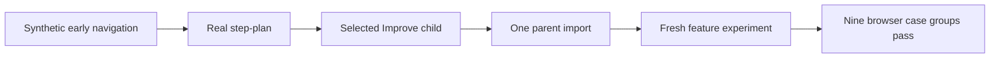

# ShipLoop UI consumer pilot: current results

Date: 2026-09-17. **Status:** implemented and verified. The bounded planning
boundary, guidance correction and separate consumer-feature experiment are complete.

This follows the requested bounded route—real producer, selected Improve, then
one parent return—before feature work in a fresh context
([shiploop-ui-followup-plan-2026-09-17.md - bounded web-pilot route](shiploop-ui-followup-plan-2026-09-17.md)).
The experiment is a local static web fixture with a controlled service double,
not a hosted or native product
([README.md - Incremental UI consumer pilot: local fixture scope](../test/experiments/shiploop_ui_consumer/README.md)).

## Completed planning boundary

The early navigator records from `intake` through `select-work` are explicitly
synthetic setup. The actual boundary began at `step-plan`
`nav-204e80fbb3644098808ccd2211d4a08c`. While its Improve child was active, a
parent import was rejected with exit 2 and no parent change. After the child
completed, the first import and an intentional duplicate both exited 0; the
record reports one new import, an unchanged parent after the duplicate, parent
stage `test-spec`, and baseline feature files.

The selected Improve is the physical card at
`<home>/src/until-loop-v2/examples/improve`, bound to the v2 Until Loop
runtime. Its receipt records terminal `done`, cycle 3 of 8, a material
verification-handoff correction, and two later trivial/no-change reviews. This
establishes the narrow `step-plan → Improve → parent import` trace; it does not
establish a full ShipLoop run.

## Baseline and guidance findings

Actual Chromium P1 caught a baseline CSS defect: `#detail { display: grid; }`
overrode native `hidden` semantics, leaving the list and detail visible together
when P1 expected the list to open before detail. The retained correction adds
`[hidden] { display: none !important; }`; the corrected baseline P1 then passed.
The later `Account Alpha Beta` label mismatch was a separate harness
label-extraction observation on that corrected baseline, not the CSS defect.
These are rendered-baseline observations, not feature results.

The ordering-sensitive cases also justified a small testing-guide correction.
The guide now requires controlled release **or** an ordered retained trace, and
rejects a delay plus eventual-state assertion as proof of an interleaving; it
also requires bounded waits and teardown release
([testing-and-documentation.md - ordering and interruption evidence](../skills/shiploop/references/testing-and-documentation.md)).
The separate guidance-only Improve completed at cycle 3: cycle 1 made the
material trace alternative, while cycles 2 and 3 were clean. That result is
guidance evidence only; it does not turn focused browser checks into a final
consumer result.

The current source-check record reports 58 passing scoped tests—discovery 27,
reference routing 8, v3 navigator 19, and actual-Improve CLI 4—with plugin
parity also passing. After another task changed the shared v3 prompt, the three
affected suites passed again (55 checks), with stable source hashes during the
rerun. These source checks are separate from the browser evidence below.

## Fresh feature experiment and final browser result

A separate fresh-context worker started feature implementation only after the
accepted import. Its full browser suite passed all nine case groups. The owner
then copied the frozen product and harness into the repository example and ran
its documented baseline and full commands: **baseline P1 passed; P1–P8 and X1
passed, with zero failures**. This verifies the retained consumer path as well as
the temporary implementation. Independent source review found no actionable defect.

| Cases | Observed result |
| --- | --- |
| P1 | Existing list/detail/edit/save/cancel/back journeys, keyboard/touch paths, labels, palette and typography preserved against the baseline report. |
| P2, P3, X1 | Remote updates preserve dirty text, caret, focus and scroll; late reads cannot regress confirmed state; a newer draft survives an earlier save acknowledgment. |
| P4, P5 | Conflict reapply uses the current revision and a new intent ID. Lost confirmation supports committed lookup and unknown-lookup replay with the same original intent ID and one committed effect; lookup failures retain recovery. |
| P6 | Alpha → beta → alpha invalidates the held old-session callback despite the account name matching again. |
| P7 | Normal cues are interrupted by newer state; reduced motion retains current status/actions without nonessential motion. A real Web Animation's running and canceled states are observed. |
| P8 | Duplicate/missed hints reconcile current state on resume; a failed refresh retains recovery; event bursts are coalesced and stale success messages are not replayed. |

The browser was Chrome `153.0.8010.48`. Final served feature SHA-256 is
`dfb3624b988d6e0f3edb3e16ac80220323eba801f439014c38ddd897bcfbe437`;
final harness SHA-256 is
`9aa60cb495b5b509639eceaf9dc3903297965a2e6d95e1279855f6623901e162`.
The worker's prior green full report used the same executable files before a
README-only clarification; the owner's retained-copy run binds the final digest.

Two concrete browser findings were incorporated without weakening the contract:
Chrome coalesced overlapping same-URL reads, so explicit manual reads now have
independent request URLs; Chrome retried bare socket-dropped POSTs, so the service
double now truncates confirmation after commit until operation lookup. The latter
makes the intended uncertain outcome deterministic and distinguishes transport
retries from application replay. All earlier failed reports remain in the
original temporary study; those failures are not rewritten as product passes.

Run the retained example using
[README.md - Run: baseline and complete browser commands](../test/experiments/shiploop_ui_consumer/README.md#run).
The output is real browser rendering and interaction against a controlled local
service. P8 visibility is **synthetically injected**, with polling additionally
checked using Playwright clock emulation. It does not establish native suspension,
wall-clock background operation, assistive-technology usability, remote backend
behavior or deployment. The earlier native/headless planning study's partial
outcomes remain separate; this web pilot does not close those execution gaps.

## Compact evidence index

All paths below are relative to
`<study-root>`.

| Evidence | Captured fact |
| --- | --- |
| `evidence/synthetic-state-summary.json` | Eight predecessor actions are synthetic; `step-plan` is the first actual boundary action. |
| `evidence/premature-import-valid-path.json` | Active child import rejected; parent unchanged. |
| `evidence/actual-handoff-result.json` | Child `done`, cycle 3; imports idempotent; parent SHA-256 `028440999426e…`; plan SHA-256 `f041dfe2236e…`. |
| `run/improve/nav-204e80fbb3644098808ccd2211d4a08c/receipt.md` | Bound Improve receipt; terminal state SHA-256 `eb6b57c609ad…`; contract SHA-256 `fbf62112dfb6…`. |
| `harness/artifacts/baseline-p1-20260917T000000Z/report.json` and `evidence/baseline-manifest.json` | Original P1 recorded `list opens before detail` false; corrected CSS SHA-256 `cd3106112e5d…`. The later label-extraction observation is separately retained in `baseline-p1-observed-20260918T0230Z/report.json`. |
| `evidence/guidance-improve-result.json` | Guidance Improve `done`, cycles 3, clean reviews 2/3; candidate SHA-256 `905c17b98c64…`. |
| `evidence/final-source-checks.json`, `evidence/post-concurrent-change-checks.json` | 58 scoped tests and plugin parity passed; after concurrent v3 edits, all 55 affected checks passed again against stable current bytes. |
| `evidence/retained-baseline-run/report.json`, `evidence/retained-feature-run/report.json` | Final retained-copy browser commands: baseline 1/0; full feature 9/0, with final harness and product identities. |
| `evidence/independent-feature-review.md` | Current source review and precise locators; no actionable defect. |

The portable apparatus is
`test/experiments/shiploop_ui_consumer/`; its reports bind the served product and
harness digests while keeping browser reruns separate from LLM/Improve activity
([README.md - Field Notes browser acceptance harness: report identity and separation](../test/experiments/shiploop_ui_consumer/harness/README.md)).

## Delivered changes

The existing global and feature planning routes now retain component, interaction
and skin premises; client/shared state and non-user events; early available design
skill use; restrained accessible async cues; and toolkit/deployment fit. They
carry existing design/code decisions and precise references into the normal
automatic Improve handoff. This follow-up adds only the evidenced temporal-test
paragraph to canonical ShipLoop guidance and its generated mirror; no new stage,
state schema, scheduler, framework dependency or persistent integration was added.

The opt-in example retains the accepted specification/design, corrected baseline,
feature and independent browser/service harness. Compact original result records
are copied under its
[evidence directory - manifest: retained result identities](../test/experiments/shiploop_ui_consumer/evidence/manifest.json).
Machine-local roots in the published records are tokenized; the manifest binds
both original and published file digests. Screenshots and full runtime logs remain
in the original study outside this package. Browser reruns do not execute an LLM or Improve.
The shared repository contains other tasks' work; this task did not stage, commit,
push or reset that checkout.

## Publication follow-up

The UI planning foundation was already present on `origin/main` at `97b6269`
through `8550406`. This follow-up commits the remaining temporal-test paragraph,
generated mirror, four UI research/implementation reports and opt-in browser
example from an isolated checkout. Repository-source links in these reports
are relative for checkout portability; their earlier line locators were
historical observations, not promises about current source line numbers.
Prior local-only statements above describe the original experiment, before
this separate user-authorized publication. Publication outcome is reported
with the actual commit and remote verification in the task.

Pre-publication verification on the isolated `97b6269` base passed 55 scoped
checks (discovery 27, reference-routing 8, navigator-v3 16, actual-improve-cli 4). Generated ShipLoop parity
and independent baseline/full browser reruns also passed. These are new checks;
the dated experiment records above retain their original counts and identities.
