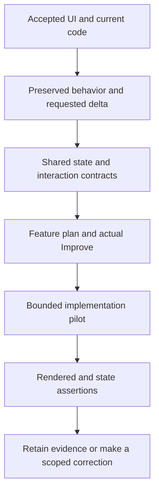

# ShipLoop UI planning follow-up: experiments and implementation plan

Date: 2026-09-17. This continues the implemented interaction/UI guidance and reviews what remains to incorporate from earlier UI requirements. It does not reopen completed implementation or claim a generated plan proves product behavior.

The implemented foundation is in publication commit `855040644721fd5451c3fd86e522e4499a8ebcad`, branch `codex/shiploop-requirements-references`; this task verified that commit exists locally and independently confirmed the remote branch SHA with `git ls-remote` (temporary evidence: `publication-check.json`). Shared `main` has other ongoing changes and is not that publication checkout. The earlier full regression results and scoped Improve review remain documented in [shiploop-interaction-ui-implementation-2026-09-17.md — Verification results: prior checks and their scope](shiploop-interaction-ui-implementation-2026-09-17.md).

## Decision under test

Retain the compact current ShipLoop guidance unless an experiment identifies missing instructions. The immediate uncertainty is whether the normal review corrects imperfect plans and whether an incremental native UI plan preserves existing interactions under asynchronous changes. A later consumer pilot must establish rendered behavior.

The two new probes use temporary fixtures under:
`<temporary>/shiploop-ui-followup-mzni5elg`.

The probes use a frozen copy of current shared-workspace prompts and references; they are not a certification of every file in the publication commit. Each has expectations and content hashes written before its worker starts. Fresh workers cannot read the hidden expectations, prior experiment assessments or this report. These are bounded case studies, not statistical evidence of general model reliability.

## Prior UI requirements reconciled

| Earlier requirement | Current coverage and what implementation must preserve |
| --- | --- |
| Components, interaction model, branding/skin | Keep the three views in an existing design/spec document. Reuse actual components, contracts, variants, native conventions and accepted tokens. A feature is a delta, not automatic redesign. |
| Existing UI/code and incremental changes | Compare accepted requirements with observed behavior. Preserve unaffected journeys and subclauses. Correct conflicting observed defects; do not elevate every existing line of code into a requirement. |
| Prior interaction continuity | Preserve applicable back/forward or native navigation, save/cancel, keyboard/touch paths, focus and selection, draft text, scroll/reading position, accessible names and adaptive layout. Link the existing case/source for each affected interaction. |
| Client and server state | Identify presentation/draft/cache/pending/confirmed roles, actual authority, allowed writers, durability, account scope and conflict policy. Include unknown outcomes, repeated intent, stale callbacks, logout and applicable migration/restart behavior. |
| Incoming messages/connections, with or without a UI | Preserve schema/authentication, acknowledgement meaning, durable obligations, ordering, replay and bounded capacity. Do not invent stricter unknown-field rejection or compatibility rules while the existing parser contract is unresolved. Select request/response, polling or bidirectional connections from actual need and host capability. “Live” does not itself select a transport. |
| Rich UI and minimalist useful animation | Complete loading/empty/error/success/conflict states. Map actual transitions to truthful cues and recovery actions; keep reduced-motion and accessible equivalents. Coalesce attention without losing required domain events. Do not replay stale celebrations after resume. |
| Frontend design skill | Discover/read suitable current-host guidance early and retain identity/digest plus decisions. The user brief, existing accepted identity and platform constraints govern application of aesthetic advice. An incompatible web technique is not a native-platform requirement. |
| Bootstrap, Material and deployment fit | Reuse a suitable existing toolkit. Adopt or migrate only for an evidenced gap. Check asset/runtime/CSP/embedding/lifecycle/accessibility constraints using the production artifact and claimed target. |
| Improve after UI decisions | Use the existing automatic planning handoff, before implementation. Review decisions and proposed checks there; actual rendered evidence belongs after implementation. Do not add another loop, result field or scheduler. |

These requirements are already supported by [behavioral-requirements.md — UI-specific planning: three views, existing design and async continuity](../skills/shiploop/references/behavioral-requirements.md), [behavioral-requirements.md — Incoming events: state and connection agreements](../skills/shiploop/references/behavioral-requirements.md), and [project-knowledge.md — Maintained requirements: preserve or change the accepted delta](../skills/shiploop/references/project-knowledge.md). The compact stage prompts deliberately link this guidance instead of repeating every conditional question.

## Follow-up experiment A: actual Improve of imperfect plans

Question: does the existing review instruction and actual installed Improve workflow repair the known partial outputs without expanding the producer prompt?

Inputs are the unchanged semantic content of the prior final web/headless plans, their accepted fixture contracts and the current `improve_prompt("step-plan")`. The plans are copied into a separate Git repository with one disclosed fixture baseline commit. Absolute paths are rebased to the new fixture and frozen guide copy; raw originals remain unchanged. Locator rebasing also fixes some formerly ambiguous candidate paths, so later locator validity cannot be attributed to Improve detecting those original errors.

The worker reads the selected installed Improve card and follows its own bound Until Loop runtime, with explicit no-commit and plans-only edit scope. It must read all available history when fewer than seven commits exist, run meaningful plan checks, and finish two consecutive trivial-only reviews. This is a real standalone Improve execution using ShipLoop's review instruction; it is not an end-to-end ShipLoop bound-child/import run.

Predeclared expectations: correct commit/ack ordering in the web unknown-result trace; add the distinct headless post-ack/pre-processing crash recovery; test exact 8-active/100-pending capacity boundaries; preserve valid UI/headless decisions; retain actionable references and honest unrun product checks. The worker is not told which defects to find.

Result: the installed physical Improve card resolved to `<home>/src/until-loop-v2/examples/improve/SKILL.md` and used its own bound v2 runtime. That adapter accepted `done` at **cycle 3/4**, after one material cycle and two recorded no-change reviews. Oracle-blind independent review contributed two passes during the material corrections. A coordinator resume continued the same saved run; no replacement runtime or contract was created.

The review repaired five substantive areas: visible/resume snapshot consumer coverage, exact headless capacity boundaries, conflict rebase using the current server revision plus a new operation ID, persistent failure/recovery after rejected reconciliation, and unsupported closed-schema assumptions. Only the two fixture plans changed. Checks were whitespace and structural plan probes; no product test ran.

**The experiment outcome is still partial.** Comparing the frozen output with the predeclared expectations found two remaining issues:

- `review-fixture/web/plan.md:107` still says the service commits after acknowledging. The accepted mutation commits before confirmation. The correct unknown-outcome trace is: durable commit → response lost → same-operation-ID reconciliation.
- `review-fixture/headless/plan.md:183` still tests commit-before-ack interruption/redelivery. Recovery prose exists, but the distinct **ack delivered → crash before processing → restart without redelivery → one local effect** test remains missing.

The capacity correction and preserved architecture/UI requirements met their expectations. File-reference validity remains usable, but preparation had already rebased locators, so it is not independent evidence of Improve finding the earlier locator errors. Raw and reviewed plans remain frozen; the root assessment is `review-final-assessment.json`.

Evidence is in `review-fixture/.until-loop/working.md`, its terminal `state.json`, final capture `evidence/improve-evidence-20260918T014650Z-52095b358ad7.json`, and `evidence/cycle-3-plan-integrity-check.md`. Candidate digest was `f47523e21a0f0dba4b7aec8bbb93220b24674791975a9046c44b36421d4427e2`. This demonstrates actual adapter execution and useful review corrections; it does not establish that all semantic expectations were satisfied. Two recorded clean reviews alone did not close these temporal-contract gaps.

## Follow-up experiment B: incremental native UI planning

Question: does the same technology-neutral prompt preserve an existing mobile interaction model when asynchronous notifications and lifecycle changes are introduced?

The synthetic iPhone document app already has native list/detail/editor components, system typography, indigo tokens, secure account-scoped drafts and accepted save/cancel/back/scroll behavior. A supplied source stub overwrites editor text and clears focus during refresh, contradicting the maintained requirements. The requested feature displays a service-owned export's status, including after suspension or process relaunch. Notifications are lossy hints, not authoritative completion or access grants. A supplied frontend-design card must be interpreted within the existing native brief.

A fresh worker receives the full current navigator-rendered `step-plan` packet. Preceding navigation/Improve records are explicitly synthetic setup. It may produce only a plan and result, with no callbacks, review execution, app build or deployment. Ten criteria were declared before launch: preserve baseline and three UI views; appropriately apply design guidance; detect the existing overwrite/focus defect; protect drafts and identity; honor lifecycle ownership; reconcile authoritative state; distinguish arrival from notification-tap navigation; provide restrained accessible cues; plan concrete platform checks; and preserve references/normal Improve routing.

Result: independent assessment found **9 of 10 criteria met, 1 partial**. The plan preserves native components/brand and prior journeys; identifies the existing draft-overwrite/focus defect; protects draft, identity and lifecycle boundaries; and correctly applies only compatible parts of the supplied frontend-design card. It treats a notification as an invalidation, separates a user's tap from ordinary arrival, and plans native rather than browser substitutes for lifecycle evidence.

The partial result is locator precision: five `result.json` heading fragments use title case instead of generated lowercase Markdown anchors. A digest is also encoded as a fragment, although it is metadata rather than a real heading. All referenced files exist; the design-card digest independently matches. Correct the anchors and retain the digest in ordinary notes. Raw outputs remain unchanged, so this is a recorded review obligation, not a manufactured clean pass.

The actual navigator accepts the three-field result in memory and keeps the same `step-plan` action pending for automatic Improve; stored fixture state remains unchanged. `mobile-mechanical-assessment.json` and `mobile-semantic-assessment.json` retain the distinct mechanical and semantic findings. No functioning iOS project, simulator or device is present; model planning cannot establish native execution behavior.

## Implementation plan after these probes

**Recommendation: retain the implemented guidance and pilot the executable consumer checks below.** Both remaining temporal requirements are already stated in the guide; repeating them in a larger general prompt is not justified by these samples. Carry concrete critical cases into the existing spec/test notes and actual Improve context, then verify their expected outcomes. The native probe supports the generalization, with a small locator correction still needed in its raw result. No additional ShipLoop production-source change is made in this follow-up.

1. **Keep the implemented planning foundation.** Reopen only affected requirements/design/code/test sections. Use existing notes to record preserve/add/modify/retire decisions and exact locators. Resolve both the file and the actual section anchor; keep content digests as metadata, not invented heading fragments. Do not add universal checklists or more unconditional packet text merely because a model can omit a requirement. Change canonical guidance only for a demonstrated missing or misleading rule.
2. **Build one bounded incremental web consumer pilot in a temporary product.** Start from a small executable branded list/detail/editor baseline with declared existing journeys and components. Add only asynchronous export status and note reconciliation using an explicit controllable service double. Run the real ShipLoop producer → selected actual Improve → parent-return route, with a fresh context for feature work. Verify the accepted child evidence is imported once and implementation waits for planning review. Existing pure-state receipt tests do not satisfy this execution claim.
3. **Exercise the preserved interactions and adverse updates.** Compare before/after branding, component behavior, labels, save/cancel/navigation, keyboard focus, selection and scroll. Resolve two reads in reverse order, deliver an old-account response after switching accounts, change a draft while a save is pending, lose a response after commit, interrupt a cue with a newer update, and resume after a burst. Expected outcomes are fixed from the accepted fixture contract before code; newer intent and current identity must win according to that contract. Put these case IDs and exact interruption/outcome traces in the ordinary spec/test notes supplied to Improve. The hidden oracle is an experiment control, not a recommendation to hide production acceptance criteria from the review.
4. **Verify the rendered consumer, not just state functions.** Use a real browser against the production fixture build, with normal and reduced motion. Assert actual displayed text/actions, focus/selection/scroll and state effects. Observe cue start/cancellation/completion with event-level timing assertions; screenshots establish visual states only. Check accessible status semantics and use assistive-technology/manual observation for claims automation cannot establish. A service double proves its simulated boundary, not a real hosted service or OS background scheduling.
5. **Add target-specific execution only for an actual target claim.** A native/mobile product needs its own build, simulator/device and supported lifecycle/notification tests. Web emulation cannot prove suspension, relaunch or native navigation. A headless product instead needs its actual durable acceptance/restart/capacity tests and no visual-design exercise. Keep unavailable target checks pending rather than converting them to N/A or claiming success from the planning probe.
6. **Integrate only the demonstrated correction.** If a pilot exposes a policy gap, edit `skills/shiploop/references/behavioral-requirements.md` or the existing testing guidance first; change the two navigator prompt catalogs only if routing or stage-local framing is deficient. Add a focused regression for the actual gap in the existing discovery/reference tests, regenerate the ShipLoop plugin view, and run appropriate focused checks plus actual Improve on the bounded change. If the policy was clear and the implementation simply violated it, repair the product/plan and keep the ShipLoop baseline.

### Minimum consumer-pilot cases

These are proposed independent acceptance cases for the next executable web fixture, not tests run in this follow-up. Use the corresponding existing product requirement when applying them to a real application.

| Case | Controlled input / interruption | Required observation |
| --- | --- | --- |
| P1 Existing journeys | Repeat the declared list/detail/edit/save/cancel/back journey before and after the feature. | Existing labels, tokens, component behavior and applicable keyboard/touch navigation remain consistent. |
| P2 Update during editing | Place the caret in a dirty note, then receive a confirmed export-status change. | Status updates; text, selection, focus and reading position remain intact. |
| P3 Reversed responses | Apply revision 11 for the active document, then deliver an older request's revision 10 response. | Confirmed view does not regress and the old response does not overwrite the current draft. |
| P4 Conflict/reapply | Server rejects an edit against revision 10 and supplies revision 11; user explicitly chooses to reapply local text. | The outgoing new intent carries revision 11 and a new operation ID; local text remains the user's chosen value. |
| P5 Unknown save result | Commit succeeds, response is lost, user retries the same unchanged intent. | Lookup/retry uses the same scoped operation ID and produces the allowed single effect; no false rejection or success is inferred from the timeout. |
| P6 Identity change | Switch accounts before an old request completes. | No old account data, draft, cue or callback affects the replacement account. |
| P7 Motion interruption | A relevant state change starts a cue, then a newer state arrives; repeat with reduced motion. | Current status/actions remain truthful and usable; old visual work is canceled, focus stays intentional, and motion completion never owns processing. |
| P8 Resume and event burst | Hide/resume after duplicate or missed updates; include a fetch failure. | Reconcile current authority, avoid repeated stale success/announcement bursts, retain actionable error/retry and preserve drafts. |

Where a separate headless receiver is selected, its own contract adds distinct checks for **ack delivered → crash before processing → restart without redelivery** and for **exactly eight active or 100 pending → next admission rejected without retention/ack**. These are not extra queues or requirements imposed on the web fixture.

Definition of ready: executable baseline, accepted prior/delta requirements, independent expected cases, controllable async boundary, known production build/browser route, selected available Improve/design guidance, and explicit evidence destinations. A native execution claim additionally requires the actual platform environment.

Definition of done: observed preserved journeys and correct state-to-consumer outcomes for the chosen cases; actual review/return evidence; no broadened redesign or transport assumptions; current source/test/design locators in carry-forward notes; and separate reporting of local, simulated, target and deployed evidence. The next pilot should stop once these cases resolve the known uncertainty, unless a concrete failure justifies another bounded experiment.

## Primary-source checks behind the plan

Apple describes background transitions as preparation for suspension, and foreground transitions as the time to restore/update UI and resources. This supports testing lifecycle-aware reconciliation rather than assuming continuous client execution. [Apple — Preparing your UI to run in the background](https://developer.apple.com/documentation/UIKit/preparing-your-ui-to-run-in-the-background), [Apple — Preparing your UI to run in the foreground](https://developer.apple.com/documentation/uikit/preparing-your-ui-to-run-in-the-foreground).

W3C's status-message guidance calls for programmatically determinable feedback without requiring focus, and notes that excessive announcements can make an application too chatty. Reduced-motion checks must preserve the usable information while suppressing nonessential movement. [W3C — Status Messages](https://www.w3.org/WAI/WCAG22/Understanding/status-messages.html), [W3C — Technique C39](https://www.w3.org/WAI/WCAG21/Techniques/css/C39.html).

These sources substantiate the platform/accessibility mechanisms; the exact product interaction and conflict policies still come from the accepted product brief. No new framework, dependency or persistent integration is justified by this follow-up alone.

## Completion and limits

The two follow-up experiments are complete as bounded studies: the native producer result was accepted mechanically with a 9-met/1-partial semantic assessment; actual Improve completed its runtime and produced useful corrections but retained the two stated temporal gaps. A read-only reviewer found no material issue in the implementation-plan structure, and the owner verified its local source links. The next consumer-pilot cases above are planned, not run. No shared source, tests, generated package, index, framework installation or deployment changed in this follow-up.

## Subsequent consumer-pilot implementation

The accepted follow-up is now implemented. See [shiploop-ui-consumer-results-2026-09-17.md - completed planning handoff and browser evidence](shiploop-ui-consumer-results-2026-09-17.md) for the actual Improve/import trace, final nine-case browser result, retained runnable example and scoped testing-guidance correction. Earlier study results and their limitations above remain historical evidence.
