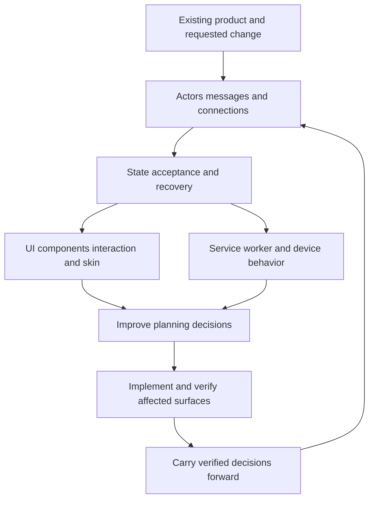

# ShipLoop interaction, UI and state planning research — 2026-09-17

**Recommendation: establish a shared interaction and state contract, with explicit UI-specific planning where a human-facing surface exists.** People, services, peers, devices, schedulers and lifecycle events can initiate work. Cover the applicable incoming/outgoing requests, messages and connections, their acceptance rules and observable effects. Preserve the three connected UI views—components, interaction model, and branding/skin—as a specialization of that shared contract, including client persistence, purposeful motion and deployment-compatible tooling. Derive each feature specification from verified existing design, code and behavior; carry only relevant decisions and source references into the inner loop. Use suitable locally available design guidance when applicable; this review found and applied `frontend-design`. Platform APIs are grounding examples, not required technologies.

This document records the research recommendation. The subsequent [implementation plan and experiment results](shiploop-interaction-ui-implementation-2026-09-17.md) track its implementation and verification. The diagram describes knowledge flow, not a replacement execution graph. Initial inspection used `<workspace>`, branch `main`, HEAD `78f829c4725962fc0d0a7e6b185a667a29c86268`, with substantial pre-existing tracked and untracked work. Findings describe the inspected worktree, including its pending changes; they do not establish released or installed-package behavior. The initial research pass authored only this report; follow-up changes are recorded separately.

The revised plan has six outputs: an existing-product baseline; the requested feature delta; a shared interaction/state agreement with applicable UI premises; an Improve-reviewed feature implementation plan; real consumer-outcome and state-reconciliation evidence; and updated reusable project decisions. The follow-up research adds client persistence, shared authority, conflict policies, mobile lifecycle, offline work, incremental compatibility, incoming-event semantics and connection recovery. Interaction and UI planning decisions receive the selected actual Improve skill automatically at their existing producer handoff; a separate user request to review them is not needed. The user's further direction establishes a fairly rich UI by default, purposeful restrained motion for asynchronous activity, and explicit evaluation of UI platforms against the actual deployment environment. A headless feature still plans its interactions and outcomes; it has no UI-design obligation unless it affects a human-facing surface.

## What ShipLoop already does

The existing behavioral guidance is stronger than a generic “plan the UI” instruction. It requires actors, communication direction, channels, presentation versus authoritative state, latency/freshness and offline tradeoffs, and relevant duplicate, stale, out-of-order, reconnect and retry cases. It also says a hosted page need not make every operation a server call. These decisions are already supposed to survive through source locators in work-item context. [behavioral-requirements.md - Actors, channels, and state ownership: existing interaction contract](../skills/shiploop/references/behavioral-requirements.md)

There is also explicit UI craft guidance: the retained survey contract records `ui_craft`, requires a referenced design-producing seed when `ui=true`, and says later steps consume its identity, layout and feedback decisions. The validator tests check the design seed and its downstream dependency. This is useful precedent, but those retained survey/DAG checks must not be described as a universal gate on the current navigator route. [survey.md - Conditional typed fields: UI craft and seed requirement](../skills/shiploop/references/survey.md), [survey.md - Human-facing surfaces: design precedes surface implementation](../skills/shiploop/references/survey.md), [shiploop-validators.test.py - test_ui_dag_requires_a_design_seed: structural coverage](../test/shiploop-validators.test.py)

The current skill card makes navigator v3 the default and restricts older descriptions to their saved or explicitly selected compatibility modes. V3 discovery/research mentions reusable skills; `step-plan` revalidates capabilities and conventions. It does not give UI work an explicit three-view design obligation or require frontend-design use before implementation. The named `skill-assess` producer follows implementation and documentation, so it cannot be the first opportunity to select a planning skill. [SKILL.md - New runs: v3 overrides retained modes](../skills/shiploop/SKILL.md), [shiploop_navigator_v3_prompts.py - DUTIES discovery and research: generic capability discovery](../skills/shiploop/scripts/shiploop_navigator_v3_prompts.py), [shiploop_navigator_v3_prompts.py - DUTIES step-plan: bounded feature planning](../skills/shiploop/scripts/shiploop_navigator_v3_prompts.py), [shiploop_navigator_v3_prompts.py - INNER: skill assessment follows document](../skills/shiploop/scripts/shiploop_navigator_v3_prompts.py)

The distinction is visible in implementation: retained validation checks `ui_craft` and the design-producing DAG dependency, while navigator v3 selects its own graph and prompt catalog. [shiploop - ui_craft_gaps: retained reference check](../skills/shiploop/scripts/shiploop), [shiploop - DAG UI validation: retained design dependency](../skills/shiploop/scripts/shiploop), [shiploop_navigator.py - graph selection: distinct v3 route](../skills/shiploop/scripts/shiploop_navigator.py)

Browser verification already requires exercising relevant interactions and asserting user-visible outcomes. A page-load screenshot is explicitly insufficient. Reusable knowledge also already belongs in repository-owned documents, with short locators rather than copied manuals. These mechanisms should carry UI decisions too. [testing-and-documentation.md - Layers and real boundaries: browser evidence](../skills/shiploop/references/testing-and-documentation.md), [project-knowledge.md - Retain learnings: durable repository knowledge](../skills/shiploop/references/project-knowledge.md)

**Assessment:** the shared behavioral contract is already actor-neutral. The principal additions are explicit incoming-event/connection questions and a durable UI specialization applied early in the active route. Async correctness is already covered conceptually; it needs a clearer connection to accepted events, connection readiness, rendered states where applicable, and consumer-specific acceptance evidence.

The follow-up audit also found that reversed-completion experiments already exist in the research guide. Reuse that guidance instead of presenting stale-response testing as a new ShipLoop invention. The addition is a systematic link from existing application state to pending user intent, shared decisions and visible recovery. [research-loop.md - Interaction contract experiments: reversed results and acceptance policy](../skills/shiploop/references/research-loop.md)

## Begin with the existing product

An incremental feature should extend a verified baseline. A missing design document or knowledge index is not evidence that the product is new. ShipLoop already directs discovery to read current code, existing architecture/design documents and prior-run references, then specify a delta. The change proposed here makes that existing obligation concrete for UI and state. [project-knowledge.md - Discover persistent context: existing code and design sources](../skills/shiploop/references/project-knowledge.md), [project-knowledge.md - Carry context: specify the delta from existing behavior](../skills/shiploop/references/project-knowledge.md)

For the affected surface, inspect available design briefs, decision records, approved mockups, maintained component examples/stories, theme resources, screenshots, actual screens, routes, client stores, data repositories, caches, sync adapters, service contracts and tests. Follow only relevant sources; do not inventory the entire product for a small change. Identify the branch/build/environment of observations. A screenshot shows an appearance, code shows an implementation, a test asserts a selected expectation, and an accepted specification states intended behavior; none substitutes for all the others.

The feature specification should state:

| Disposition | What to record |
| --- | --- |
| Preserve | Existing journeys, component contracts, visual identity, accessibility behavior, data meaning and compatibility that this request relies on |
| Reuse | Exact component/token/state/service/test examples with source locators and applicable versions |
| Change | The requested behavioral or visual delta and why each affected contract changes |
| Reconcile | Documentation/code/runtime disagreements, known defects and obsolete patterns; what evidence resolves them or what remains open |
| Migrate, if needed | Persisted drafts/caches/queued operations, deployed older clients and API/schema compatibility; the required transition and recovery checks |

Explicit user and binding repository requirements govern the target behavior. Existing code and historical design are evidence to evaluate, not automatic permission to preserve defects or broaden a feature into a redesign. When old guidance and current implementation disagree materially, record both, inspect rationale and current behavior, and resolve the decision before dependent changes. Do not claim a baseline was verified when a required observation was unavailable.

Capture a missing design premise from the implemented product as an **observed baseline**, retaining uncertainty until accepted by the normal planning/review process. A feature may introduce a justified new component or state mechanism, but should first consider extending the existing one. Preserve platform conventions: a web control and an iPhone control can share meaning and brand without sharing identical layout or interaction mechanics.

Do not force an early design-producing work item for every incremental change. Reuse an adequate premise and plan a narrow delta; add substantive design work only when the feature changes or lacks the necessary foundation. Initial discovery, tests and documentation remain proportional to the affected behavior.

## Design skills found and applied

Identical `frontend-design/SKILL.md` files are present under `~/.claude/skills` and `~/.grok/skills`. Their SHA-256 was `1608ea77fbb6fc30d13a97d12cfa8ebf31358d40f0dd97beed24829d6b3f45dd`. The same path was absent under `~/.codex/skills`, and the current Codex skill catalog did not advertise it. I read the existing file directly and applied its planning and critique process to this proposal; that is not an automatic-discovery or installation claim.

The local skill calls for subject/audience/purpose, a compact visual plan with tokens and layout sketches, critique before building, and screenshot-based critique while building. That is the basis for the visual premise and before/after review proposed here. Its broader design advice should remain subordinate to the actual brief: a small feature in an established product should preserve its typography and brand unless the request changes them. SKILL.md - Ground it in the subject: audience and purpose (observed host-local `frontend-design/SKILL.md`; identity recorded above), SKILL.md - Process: visual plan and critique before implementation (observed host-local `frontend-design/SKILL.md`; identity recorded above), SKILL.md - Restraint and self-critique: responsive, focus, motion and screenshots (observed host-local `frontend-design/SKILL.md`; identity recorded above)

The portable rule should be capability-based: discover, select and read a suitable locally available design skill, recording its actual identity and version or content digest. If none is available, perform the same UI planning from project guidance and the shared reference, recording that fallback. Do not require the literal name `frontend-design`, search another host's private installation by default, hard-code this machine's paths, or import aesthetic-risk directives as binding product requirements. This session's direct reading of a known local file is evidence of use here, not a portable discovery mechanism.

| Candidate | Decision | Benefit and fit | Cost, risk and contrary evidence |
| --- | --- | --- | --- |
| Existing `frontend-design` | Use now as applicable guidance; pilot explicit ShipLoop routing | Already available in two local hosts; compact visual planning and critique | Primarily visual; does not specify distributed consistency or comprehensive component behavior. Distinctiveness must not trigger rebranding on each feature. |
| Vercel `web-design-guidelines` | Pilot as a complementary review reference | Concrete checks for keyboard, focus, forms, async feedback and responsive behavior | The skill fetches changing upstream rules. Some are opinionated or framework-specific; record the source revision/date and filter against project requirements. |
| Impeccable | Defer installation; consider a bounded future pilot if the lighter approach underperforms | Public artifact separates product context, visual documentation, UX shaping, audit and hardening | Current distribution includes an engine and optional/integrated host hooks, adding maintenance and lifecycle considerations. Its aesthetic prohibitions can conflict with an existing brand. |
| Design-token interchange tooling | Defer tooling; adopt semantic token vocabulary where useful | Shared named decisions help separate component meaning from theme values | A small app can use existing CSS variables. A token compiler or formal interchange format is not required. |

Primary sources: [Anthropic frontend-design source](https://github.com/anthropics/skills/blob/main/skills/frontend-design/SKILL.md), [Vercel review skill source](https://raw.githubusercontent.com/vercel-labs/agent-skills/main/skills/web-design-guidelines/SKILL.md), [Vercel interface guidance](https://vercel.com/design/guidelines), [Impeccable source and installation description](https://github.com/pbakaus/impeccable), [Design Tokens Format Module 2025.10](https://www.designtokens.org/tr/2025.10/format/).

These are source-backed capabilities, not measured evidence that any skill improves ShipLoop output. Broad search surfaced both enthusiastic and dissatisfied reports about frontend-design results; those anecdotes did not determine the recommendation. A concrete conflict is visible in primary sources: the installed skill prefers sentence case, while Vercel's fetched review rules prescribe title case. Their preferences cannot both become unconditional project rules. [Vercel command.md - Content and Copy](https://raw.githubusercontent.com/vercel-labs/web-interface-guidelines/main/command.md)

## Generalize the interaction contract; retain explicit UI planning

**Adopt the generalization in planning, without prescribing a new runtime architecture.** Begin with who or what initiates work and who consumes its outcome. Add the relevant surface-specific detail: a UI needs components, human interaction and visual design; a webhook endpoint needs an incoming-message contract; a streaming peer needs a connection/subscription contract; a scheduled worker needs start, overlap and restart semantics. One feature may span several of these. These are conditional planning views, not mandatory packages, services, layers or new ShipLoop stages.

This builds directly on the current actor/channel/state guidance, which already covers system-to-system and system-to-user interactions, return paths, trust, delivery, persistence and display. The new specificity belongs beside that guidance rather than in an isolated UI-only checklist. [behavioral-requirements.md - Actors, channels, and state ownership: existing shared contract](../skills/shiploop/references/behavioral-requirements.md)

| Shared question | Record when applicable | UI-specific consequence |
| --- | --- | --- |
| Origin and recipient | Person, service, peer, device, scheduled trigger or lifecycle signal; direction and trust/identity scope on each hop | Distinguish the person's pending intent from updates initiated elsewhere |
| Meaning | Command/request to perform work, query, reported fact, invalidation hint or lifecycle signal; payload/schema version and expected response | A received notification is not automatically an accepted UI edit or proof the displayed data is current |
| Acceptance and state | Allowed operation, validation, owner, invariant, read source, durability and local/shared conflict policy | Components render provisional, confirmed, stale or conflicted states according to the same agreement |
| Delivery and completion | Relevant identity/correlation, acknowledgment boundary, ordering scope, replay/duplicates, deadlines, retry/cancellation and partial-failure recovery | Separate received, accepted, committed, synchronized and displayed; state which milestones the feature actually needs |
| Connection and capacity | Per-request or persistent channel; session/subscription lifecycle, resynchronization and bounded handling of slow consumers or bursts | Distinguish connected from authenticated, subscribed, synchronized and ready; preserve usability during recovery |
| Observable result | Reply, changed state, outgoing event, external effect, operator signal or rendered UI, with evidence at the relevant boundary | Retain accessible status, focused feedback, restrained motion and the accepted visual identity |

These questions do not imply that every interaction changes state or needs a persistent connection. Keep existing direct/local calls when they satisfy the contract. Reuse the current sequence/transition notation and acceptance IDs; a small stateless interaction may need only its input, output and error behavior.

### Incoming messages and other non-user triggers

For an applicable inbound boundary, identify the expected producer and authorized account/tenant, the receiving operation, accepted types and schema versions, size/rate limits where material, and whether the payload is a command, snapshot, delta or refresh hint. Authenticate the source and authorize the resulting action through the actual platform contract; a source field or claimed tenant in a payload does not establish authority. A transport adapter may normalize a message, but must preserve origin, permission and business semantics. Shared invariants should remain consistent across UI and machine entrypoints without forcing all entrypoints through an identical handler.

Distinguish event identity, operation identity, correlation, resource revision and replay position. Reuse supplied identifiers according to their documented scope; do not assume one value safely serves every purpose. Decide which duplicates are safe no-ops, which updates require version/causal order, how stale data is handled, and what happens for unsupported or invalid input. A past event can describe a true historical occurrence without being the current entity state. Existing replayed messages and older producers/consumers belong in incremental compatibility planning.

Name each acknowledgment's actual guarantee. If acknowledging transfers responsibility for required durable work, establish the chosen durable acceptance boundary before that acknowledgment. If processing remains asynchronous, preserve a recovery path for accepted work. When state, deduplication records and external effects cannot commit together, specify the actual retry/reconciliation or compensation rule. A broker receipt or successful HTTP delivery does not by itself prove domain completion, downstream delivery, display or human attention. Avoid an unqualified exactly-once claim.

Choose burst/overload behavior explicitly when it matters: bounded concurrency/buffering, flow control, producer retry or deliberate rejection. Dropping or combining **domain events** requires domain permission; grouping visual notifications does not authorize losing business effects. Identify who owns exhausted retries or unprocessable messages and how failure is observed and recovered, using existing facilities where adequate. For scheduled triggers, check overlap and missed/catch-up work only where the feature requires it. No broker, queue, event bus, event-sourced store or observability platform is mandated.

### Connections and subscriptions have their own lifecycle

Where a connection exists, cover relevant establishment/admission, authentication, subscription scope, readiness, activity, loss, reconnect, resubscribe/resync and cleanup. Model connection/session state, operation outcome and domain-data freshness separately; an open transport proves none of the latter by itself. A presence signal may be advisory rather than definitive when detection can lag.

Specify who initiates and accepts the connection, permitted messages in each phase, identity/permission expiry, deadlines and heartbeat responsibility where supported, reconnect/backoff limits, and graceful shutdown or intentional stop. Prevent work and callbacks from an old session or account from changing a replacement session's state. Reconnect should restore required subscriptions and recover missed state using the existing cursor/replay/snapshot protocol; make the snapshot-to-live handoff cover gaps and duplicates when required. If recovery is impossible within the retained history, define a fresh baseline or explicit incomplete state.

Check the actual deployment's inbound reachability, protocol/proxy support, idle and execution limits, scale-out/session assumptions, available callback/RPC paths and mobile/background restrictions. Choose full duplex only when the interaction needs independent messages in both directions. A supported request/response or polling path may meet the requirement. The UI toolkit is a separate choice and does not establish transport support.

### Preserve the UI-specific contract

Keep the existing UI premise and quality bar below. Its interaction view consumes shared state/acceptance decisions and adds human intent, navigation, focus, keyboard/touch, validation, attention and recovery actions. Its component view defines presentation responsibilities and states. Its skin supplies visual identity and restrained motion. A machine-originated update may refresh an existing component, create a relevant notification, or intentionally have no visible effect; it must not always open a dialog or produce a toast.

Define what happens with no active UI. Background work that the product promises independently of the screen must continue through its actual owner; the next UI session obtains the supported current state. A purely in-page feature can instead have a page-bounded lifetime if that is the requirement. Rendering or animation must not become the only place where required domain processing occurs. Conversely, successful headless processing does not prove that a required UI updated, announced the change or preserved a user's draft.

### Research supporting the generalization

- **AsyncAPI** separates message/channel descriptions from send/receive operations. This is useful vocabulary for documenting an interaction; adopting its schema or generator is unnecessary for a small Markdown contract. [AsyncAPI - Document introduction](https://www.asyncapi.com/docs/concepts/asyncapi-document), [AsyncAPI - Operations](https://www.asyncapi.com/docs/concepts/asyncapi-document/adding-operations)
- **CloudEvents** provides scoped event identity and payload metadata, while its primer explicitly leaves producer/consumer processing models outside its scope. An envelope helps describe an event; it does not settle authority, ordering, execution or security. Prefer a released specification when selecting a contract. [CloudEvents 1.0.2 - Specification](https://github.com/cloudevents/spec/blob/v1.0.2/cloudevents/spec.md), [CloudEvents - Primer](https://github.com/cloudevents/spec/blob/main/cloudevents/primer.md)
- **RabbitMQ** documents publisher confirms and consumer acknowledgments as separate mechanisms. That is a concrete reason to name the completion milestone rather than use an undifferentiated delivered/success flag. [RabbitMQ - Confirms and acknowledgments](https://www.rabbitmq.com/docs/confirms)
- **Stripe's webhook guidance** documents duplicate and out-of-order event delivery. This grounds the incoming-message acceptance and recovery questions; it does not prescribe Stripe or a queue for other products. [Stripe - Event ordering and duplicate handling](https://docs.stripe.com/webhooks#event-ordering)
- **WebSocket and Socket.IO** illustrate the connection boundary: WebSocket ping/pong concerns endpoint responsiveness, while Socket.IO explicitly notes that connection-state recovery may fail and requires application resynchronization handling. A responsive transport is not evidence of current domain state. [RFC 6455 - Ping](https://www.rfc-editor.org/rfc/rfc6455.html#section-5.5.2), [Socket.IO - Connection state recovery](https://socket.io/docs/v4/connection-state-recovery/)

**Decision:** adopt the shared questions and conditional UI/connection/message views; pilot them with one headless incoming-event case and one event-to-UI case. Defer new message standards, transports, middleware and state infrastructure until a concrete product gap justifies them. The risk of overgeneralization is a generic checklist that hides UI craft or imposes distributed machinery on local work; retaining explicit UI duties and applicability-based questions addresses both.

## The proposed UI premise

Keep the user's three layers as **planning views**, not mandatory libraries, directories, or independently deployed components. Product purpose, content, accessibility and performance constrain all three. A supporting client/shared-state agreement makes the interaction model executable; it does not mandate a fourth UI package or a synchronization engine.

| View | Initial planning establishes | Each affected feature identifies |
| --- | --- | --- |
| Components | Existing primitives and compositions; responsibilities; platform semantics; input/event contracts; variants; adaptive composition | Reused or new components, changed contracts and states, focus/keyboard/touch behavior, and how the implementation follows existing examples |
| Interaction model | Main journeys, navigation, state ownership, transitions, validation, feedback, recovery, persistence and concurrency semantics | Trigger → transient state → authoritative outcome; changed transitions, failure cases, race handling, and user-visible assertions |
| Branding / skin | Accepted visual direction, typography, semantic color/spacing/motion tokens, imagery, density and layout principles | Tokens/variants reused or intentionally changed; visual fit across relevant sizes, themes and content extremes |

Connect the views. For example, `SaveButton` renders the interaction model's `saving` state using the accepted loading treatment. A theme change may alter its colors without altering submission semantics. Color tokens should express roles such as action, error and focus, so skinning does not silently change meaning. The DTCG source supports named, reusable design decisions; adopting its full file format is a separate tooling decision. It is a Community Group specification, not a W3C Standard. [Design Tokens Format Module - Introduction and status](https://www.designtokens.org/tr/2025.10/format/)

Accessibility is part of component behavior as well as appearance. On the web, adding an ARIA role does not supply keyboard behavior; prefer appropriate native controls and verify the relevant browser/assistive-technology combinations. Native apps need equivalent checks through their own platform semantics and accessibility tools; web ARIA rules are an analogy, not their API contract. [WAI-ARIA APG - A role is a promise](https://www.w3.org/WAI/ARIA/apg/practices/read-me-first/)

Store the accepted premise in an existing design/architecture document and link it from `SHIPLOOP.md`. Create a focused document only if no suitable home exists. Include purpose, boundaries, evidence, accepted decisions, unresolved questions and revalidation triggers. Keep the feature context to its relevant locator and a short decision summary. This follows the current cross-run knowledge policy. [project-knowledge.md - Carry context into the new plan: delta and locator reuse](../skills/shiploop/references/project-knowledge.md)

## Rich interaction and purposeful motion by default

**Adopt as the product-quality premise:** a fairly rich interface with coherent visual hierarchy, polished reusable components, responsive layouts, complete interaction states, contextual feedback, and useful direct interactions. Consider search/filtering, inline editing, progressive disclosure, keyboard/touch conveniences, and undo where they serve the actual task. The accepted feature scope determines which capabilities belong. Incremental work improves the affected experience while preserving the existing product's identity. Complexity and decorative motion are not measures of richness.

Make motion a small, explicit part of all three UI views: components expose visual states; the interaction model determines the event and its meaning; the skin supplies shared timing, easing, emphasis and reduced-motion treatments. Prefer existing platform/framework transitions and a few semantic tokens. An extra animation library needs a concrete unmet requirement. Set and validate timings for the actual interaction and device; do not impose one duration on every product.

For each meaningful asynchronous interaction, plan **trigger → truthful state → visible cue → accessible status → final/recovery state**. Suggested treatments are design proposals to validate against the product:

| Event or state | Purposeful treatment | Meaning and persistence |
| --- | --- | --- |
| User starts an operation | Immediate pressed/pending feedback; a scoped progress treatment when the wait merits it | The request started; keep unrelated work usable and choose duplicate-submission behavior deliberately |
| Local draft or offline queue becomes durable | Quiet inline status, optionally a brief state transition | Say saved on this device or queued when that is all the evidence establishes |
| Authoritative confirmation | Brief check transition or local emphasis plus stable status where confirmation matters | Confirm only the operation actually accepted; completion of an animation cannot establish a shared commit |
| Remote data arrives | Briefly emphasize the affected region or show a new-updates affordance | Preserve current input, focus, reading position and user-controlled ordering; avoid unexpected jumps |
| Conflict, failure or unknown outcome | Persistent inline explanation and the available recovery action | Do not hide unresolved work behind an expiring toast or animate uncertain work as successful |
| Connection restored and data reconciled | One concise recovery status after reconciliation | A live connection alone does not mean queued changes committed or cached data became current |

Keep state and motion loosely coupled: render the latest accepted application state even if a transition is interrupted, disabled, or never finishes. Cancel obsolete presentation work when navigating, switching identities or receiving superseding data. Coalesce noisy visual notifications while preserving required domain events and unresolved actions; on resume, reconcile first and show current status rather than replaying a backlog of decorative animations. Progress percentages require meaningful measured progress. Provide a long-wait or unknown-outcome path when completion cannot be established.

Use noninterruptive status announcements for routine updates and reserve urgent interruption for conditions that justify it. Preserve keyboard focus, provide text/icon meaning beyond color and movement, and honor platform reduced-motion settings with an equally understandable static or less animated state. Essential actions and failure information must remain available beyond transient feedback. Validate notification timing and any pause/dismiss behavior against accessibility needs. W3C's status-message guidance supports announcing relevant updates without taking focus; its animation guidance supports disabling nonessential interaction motion. The latter is a WCAG AAA criterion, adopted here as a product preference rather than misrepresented as a universal AA requirement. [W3C - Status messages](https://www.w3.org/WAI/WCAG22/Understanding/status-messages.html), [W3C - Animation from interactions](https://www.w3.org/WAI/WCAG22/Understanding/animation-from-interactions.html)

For automatically moving or updating content shown alongside other content, assess the applicable pause/stop/hide or update-frequency requirements and essential exceptions. Reducing motion alone does not resolve disruptive auto-updates. Implement such controls when applicable, while allowing underlying synchronization to continue according to the state contract. [W3C - Pause, Stop, Hide](https://www.w3.org/WAI/WCAG22/Understanding/pause-stop-hide.html)

Motion must stay responsive under rapid inputs, event bursts and the target device's load. Measure representative interactions in the production artifact; avoid unnecessary layout work, repeated flashing, and animation that delays an available result. Bootstrap's own transition API illustrates why this matters: its methods return before a transition finishes and calls during a transition can be ignored. Such presentation behavior needs lifecycle handling, not an assumption that a visual callback owns business correctness. [Bootstrap - Asynchronous functions and transitions](https://getbootstrap.com/docs/5.3/getting-started/javascript/#asynchronous-functions-and-transitions)

## Select UI platforms for the deployment environment

**Adopt a framework-selection obligation; select the dependency per product.** Start with the maintained components, framework and design system already in use. Identify any actual gap, compare suitable alternatives, and retain the chosen package/version, required features, tradeoff and deployment evidence in the UI premise. For an incremental feature, a short reuse decision usually suffices. A materially new library or uncertain hosting constraint warrants a bounded compatibility probe before dependent implementation. Installation alone does not establish fit.

Separate a design language such as Material Design from a particular implementation such as React Material UI, Angular Material or Material Web. Record the exact implementation and supported runtime. A design skill, component library, application framework and hosting platform serve different responsibilities; none substitutes for the others.

| Candidate family | When to evaluate it | Decisive fit checks and recommendation |
| --- | --- | --- |
| Existing maintained design system or platform controls | First candidate for established applications | **Adopt/reuse** when it can meet the feature. Extend its states, tokens and accessibility behavior; justify migrations explicitly. |
| Bootstrap | HTML-oriented or server-rendered web UI, including constrained delivery of compiled assets | **Pilot where appropriate.** Compiled CSS/JS can run without a build step, with local assets or an allowed CDN. Include only needed capabilities. In React/Vue/Angular, use a compatible integration or CSS without competing DOM ownership; Bootstrap documents conflicts with its direct JS plugins. [Bootstrap - Getting started](https://getbootstrap.com/docs/5.3/getting-started/introduction/), [Bootstrap - Framework integration](https://getbootstrap.com/docs/5.3/getting-started/javascript/#usage-with-javascript-frameworks) |
| Material UI for React | An existing or justified React application needing its component set | **Pilot against the selected React/build/rendering setup.** React is a peer dependency; the default styling engine is Emotion. Where applicable, validate server-rendered styles, hydration and the actual CSP. [Material UI - Installation](https://mui.com/material-ui/getting-started/installation/), [Material UI - Server rendering](https://mui.com/material-ui/guides/server-rendering/), [Material UI - CSP](https://mui.com/material-ui/guides/content-security-policy/) |
| Other Material implementations | An application whose runtime matches the implementation, such as Angular Material or Android Compose Material 3 | **Evaluate the actual package, support status and platform contract.** Material Web currently declares maintenance mode pending new maintainers; **defer new adoption by default** without a specific maintenance rationale. This does not establish the status of other Material libraries. [Material Web - README and status](https://github.com/material-components/material-web), [Android - Material 3 in Compose](https://developer.android.com/develop/ui/compose/designsystems/material3) |
| Native or existing cross-platform toolkit | An iPhone/mobile app or product already using such a toolkit | **Prefer the existing platform-compatible implementation.** SwiftUI is one native Apple example. Preserve native navigation, controls, accessibility and lifecycle semantics while sharing brand and domain meaning. A web toolkit only fits where an intentional web surface belongs. [Apple - SwiftUI](https://developer.apple.com/swiftui/) |

This comparison is a selection guide, not a universal ranking or automatic installation rule. A custom/branded UI can use existing primitives and tokens where a complete component suite would add more cost than value. Conversely, a mature suite may supply the rich interaction baseline more reliably than recreating it. Check accessibility in the composed application: Bootstrap itself documents possible insufficient contrast in some default color combinations and component-specific accessibility responsibilities. [Bootstrap - Accessibility](https://getbootstrap.com/docs/5.3/getting-started/accessibility/)

Record only deployment constraints relevant to the choice:

- **Build versus runtime:** available package/build tools, runtime and OS/browser/WebView versions, and whether the host receives static assets, server templates, a client bundle, a native package or a supported server runtime. A locally built bundle may be deployable even when the host cannot run its build tooling; server-rendering requirements need a supported server.
- **Asset and style delivery:** permitted CDN or bundled assets, fonts/icons, version pinning, CSP and inline/runtime style rules, module loading, base paths and routing. Adapt to the host's security policy; do not weaken it silently to make a library demo work. Bootstrap documents embedded SVG considerations for strict CSP. [Bootstrap - CSP and embedded SVGs](https://getbootstrap.com/docs/5.3/customize/overview/#csps-and-embedded-svgs)
- **Host integration:** iframe/embedding boundaries, navigation, overlays and focus, authentication and supported RPC/network transports; mobile lifecycle and notification permissions when relevant. For example, Apps Script HTML Service imposes iframe navigation restrictions and HTTPS requirements for active assets. These facts require validation in that host, not assumptions from a standalone development page. [Google - HTML Service restrictions](https://developers.google.com/apps-script/guides/html/restrictions)
- **Operational fit:** startup/bundle and interaction performance on representative hardware, accessibility, theming/localization needs, package maintenance, required-feature licensing, and compatibility of deployed assets/clients with the service.

Validate an uncertain choice with one representative production-built screen: load its actual assets, open a layered control, use keyboard/touch navigation, submit an async operation, exercise failure/recovery and reduced motion, and refresh/re-enter through the supported routing/auth path. Run target-dependent checks in the target environment. A documented preview can establish only the specific conditions it demonstrably reproduces, such as matching asset paths or CSP; it cannot resolve an unknown target-host constraint. Existing current deployment evidence can satisfy unchanged constraints. If target access is unavailable, retain the unverified constraint; a dev-server or preview result must not become a target-compatibility claim.

## State ownership and reconciliation, including client/shared state

Treat storage location, UI read source, permission to modify data, and authority to accept a shared outcome as separate decisions. They may coincide in a simple app, but a local read model can serve the UI while a remote service enforces shared business rules. A local-first collaborative document can instead have multiple writable replicas and explicit merge rules. A client-only tool may need no remote state at all.

Ownership, acceptance, durability and reconciliation also apply to service/worker/device interactions. The following detailed roles ground those shared concerns in client behavior; a headless consumer uses the relevant equivalents, such as its checkpoint and pending work, without inventing presentation state or a UI.

For the affected feature, classify the relevant state without imposing an exhaustive inventory:

| State role | Examples | Decisions needed |
| --- | --- | --- |
| Presentation | Focus, selection, navigation, expanded panels | Owner and lifetime; whether any part should survive navigation/restart or be shared |
| Draft / local intent | An unfinished form, an unsent edit | What is durable, explicit save versus autosave, discard/restore rules, and handling a remote update while editing |
| Cached or replicated domain data | Downloaded records, a local database | Read source, authority, freshness, invalidation, and how remote changes enter the local view |
| Pending operations | Submitted commands, an offline queue, optimistic changes | Identity, dependencies/order, durability, confirmation, unknown outcomes, retry and cancellation |
| Committed domain state | A shared record, available inventory, document replicas | Authorized writers, invariants, acceptance/merge rule, revision or causal metadata and visibility to other clients |
| Derived values | Filtered lists, totals, badges | Which underlying values determine them; avoid independent copies that can drift unless their lifecycle is justified |

These are roles, not six stores. A state value can move through several roles. The contract may be a paragraph for a small feature or a compact table/diagram for a consequential flow, retained in existing project documentation.

For each affected entity or operation, assess these seven questions and record only applicable decisions. A concise not-applicable reason is enough where there is no relevant boundary; purely presentational work must not invent persistence, synchronization or identity machinery. Shared writes, durable pending work and identity boundaries require the corresponding acceptance/recovery decisions before dependent implementation:

1. **Who owns what?** Identify local and shared owners, the UI read source, allowed writers and account/device scope. State the invariant that must remain true, including any cross-record constraint.
2. **What survives?** Specify navigation, refresh, application restart, offline periods and background suspension. Choose transient state, durable draft, cache or queued work according to the requirement. A pending queue is only durable if its operations and recovery metadata survive the relevant interruption.
3. **What does the user see and what does it mean?** Define when the screen is edited, saving, saved locally, pending sync, confirmed, stale, conflicted or rejected—only the states that apply. Do not let optimistic rendering imply a shared commit or successful delivery to another device. Do not erase newer draft input when an older acknowledgment arrives.
4. **How is a change accepted?** Identify the action's base version or equivalent precondition, operation identity where retries matter, validation, authorization and commit boundary. The responsible authority checks these together as required for correctness. Scope deduplication and outcome lookup to the authenticated principal/account and tenant as applicable, bind an operation ID to its original intent, and reject reuse with changed payload or preconditions. A client-generated ID alone cannot establish retry safety or authorization. Distinguish the operation ID, resource revision and feed cursor: they answer different questions.
5. **How are competing edits reconciled?** Choose a rule per data type: reject/refresh, preserve-and-resolve, merge independently changed fields, a justified overwrite rule, or a supported replicated-data algorithm. State how local draft, last-known base and newly received remote data are compared. Automatic merge must preserve domain invariants; a successful merge is not itself proof of valid business state.
6. **How does synchronization recover?** Select invalidate-and-refetch, ordered change replay, snapshot refresh or another existing protocol. Address missed/duplicate events, deletion versus an offline edit, expired cursors, unknown commit outcomes and dependent queued work where relevant. If persistent data or old clients are affected, account for schema/protocol upgrades and recovery after rollback. Reachability alone is not proof of freshness or authorization.
7. **What changes on identity or permission transitions?** Scope local data, queued work and callbacks to the correct account/tenant. On logout, account switch or revoked access, stop old synchronization and apply an explicit retention/clear/quarantine policy. An old callback must not populate the new account's screen; an old queued mutation must not execute as the new user.

“Negotiation” here means the application's defined acceptance and reconciliation procedure, not a mandatory new network handshake. A typical service-authoritative flow is local intent → optional durable pending record → command with known preconditions → authorized validation and commit/conflict → reconciliation of local data and visible status. Other authority models must state their equivalent agreement.

| Policy | Fits when | Boundary to make explicit |
| --- | --- | --- |
| Local-only or local durable | The feature does not require shared agreement | Reset, retention and device/account scope; no invented server |
| Online commit with a retained local draft | A shared invariant must be checked before confirmation | Offline editing may be allowed while final submission remains unavailable |
| Durable queued/offline writes | Delayed acceptance is tolerable | Restart-safe intent, idempotency or reconciliation, dependencies and visible failures |
| Version-checked shared edits | Concurrent overwrites must be detected | Reject stale changes or explicitly merge/resubmit; preserve the user's draft |
| Last-write-wins | Discarding a competing value is an accepted product tradeoff | Define ordering/tie rules; do not equate device clocks or network arrival with user intent |
| Replicated collaborative edits | Concurrent/offline editing is central to the product | Validate merge semantics, history/storage cost, permissions and business constraints; no automatic CRDT adoption |

A pushed update can be an invalidation hint or an authoritative versioned event. Specify which. Request/response, polling, WebSocket and mobile notification channels do not themselves provide a conflict policy, safe retries, durable local data or globally correct state.

## Additional research and its implications

The following sources inform the recommendation; the planning contract above is a synthesis, not a claim that one source specifies the whole design.

- **Offline architecture:** Android explicitly separates the app's local read source from network state and distinguishes online-only, queued and lazy writes. That supports choosing persistence and write policy per operation rather than demanding one model for the whole application. Its last-write-wins example is one option, not proof that overwriting edits is acceptable for every product. [Android - Offline-first architecture](https://developer.android.com/topic/architecture/data-layer/offline-first)
- **Native synchronization:** Apple's CKSyncEngine requires persisted engine state across launches and leaves application-specific conflict handling to the app. Scheduling depends on system conditions. The app must also react to account changes in its own storage. A sync library therefore does not replace product decisions about conflicts, local retention and identity. [Apple - CKSyncEngine](https://developer.apple.com/documentation/cloudkit/cksyncengine-4b4w9)
- **Conditional changes:** HTTP `If-Match` is a concrete example of preventing stale overwrites by checking the version previously read. The portable requirement is a conditional acceptance rule, not mandatory HTTP headers. [RFC 9110 - If-Match](https://datatracker.ietf.org/doc/html/rfc9110#section-13.1.1)
- **Ambiguous results and retries:** AWS describes caller-scoped request identifiers, atomic recording of deduplication and effects, retention limits, and rejection when the same identifier is reused with different intent. Apply the principle where mutations may be retried; an operation key alone is not an unlimited exactly-once guarantee. [AWS Builders' Library - Idempotent APIs](https://aws.amazon.com/builders-library/making-retries-safe-with-idempotent-APIs/)
- **Client lifecycle:** Chrome documents frozen/discarded pages where callbacks stop or never run. Apple does not guarantee background notification delivery. Preserve required work before suspension and reconcile on resume; a background schedule or open connection cannot be the only recovery mechanism. [Chrome - Page Lifecycle API](https://developer.chrome.com/docs/web-platform/page-lifecycle-api), [Apple - Background updates](https://developer.apple.com/documentation/usernotifications/pushing-background-updates-to-your-app)
- **State structure:** React advises avoiding contradictory, redundant and duplicated state. This is a useful example of keeping confirmed data, pending intent and derived UI views coherent; it does not prescribe React or a global store for other clients. [React - Choosing state structure](https://react.dev/learn/choosing-the-state-structure)
- **Contrary evidence against blanket centralization or blanket merging:** Local-first research supports independent replicas, while coordination research shows that whether safe coordination-free execution is possible depends on operations and invariants. Our resulting design rule is to choose authority and merge policy by the product's constraints. Eventual convergence alone does not establish that an exclusive booking or other shared constraint was respected. [Ink & Switch - Local-first software](https://www.inkandswitch.com/essay/local-first/), [Bailis et al. - Coordination avoidance](https://arxiv.org/abs/1402.2237)

**Adopt** these conditional planning questions. **Pilot** their prompt application in an incremental web case and a native lifecycle case. **Defer** new state libraries, databases, sync engines, CRDTs and persistent integrations until an actual application's needs justify them. Existing implementation and supported platform facilities are the first candidates. Frontend design guidance helps the visible experience; it does not replace state/consistency analysis, and web-oriented advice must be adapted or supplemented for a native client.

## Automatic Improve after interaction and UI planning decisions

Treat Improve as part of completing interaction planning whenever the stage produces, selects, materially revises or accepts reuse of relevant behavior, connection, design or state decisions. Include the explicit UI review whenever a human-facing surface is affected. The user does not need to invoke it again. Batch a coherent stage's decisions into its normal result; do not launch a separate review for every small choice.

Current navigator v3 already requires an actual Improve handoff after every producer attempt and keeps the parent action pending until the selected child completes and its evidence is imported. The proposal adds an explicit UI/state review scope to that existing boundary; it does not add another review controller or claim the current generic scope already guarantees good UI judgment. [shiploop_navigator_v3_prompts.py - COMMON: actual Improve follows every producer attempt](../skills/shiploop/scripts/shiploop_navigator_v3_prompts.py), [shiploop_navigator_v3_prompts.py - improve_prompt: child ownership and parent return](../skills/shiploop/scripts/shiploop_navigator_v3_prompts.py)

The planned contract is:

1. **Trigger at the existing boundary.** Include the shared interaction/state contract and applicable UI premises from discovery/research/spec/global planning, each affected `step-plan`, and relevant later revisions in that producer's actual Improve handoff. Reviewing a small inherited decision can be narrow; reusing it does not silently skip its applicability check.
2. **Give Improve the actual candidate.** Retain the requested feature delta, existing design/code/protocol baseline, actor and incoming/outgoing interaction contracts, connection lifecycle, state agreement, deployment constraints, acceptance criteria, open questions and evidence locators. For affected UI, also retain selected design guidance, component/interaction/skin decisions, motion/notification policy and UI-platform choice. Preserve this context in the bound child's recovery material without copying whole manuals.
3. **Challenge the decision, then improve it.** Check missing non-user entrypoints, ambiguous message/acknowledgment semantics, unsafe replay, connection-versus-state confusion, ownership/confirmation, reconciliation, lifecycle/identity gaps, unsupported hosting assumptions, unnecessary infrastructure and missing tests. For affected UI, also check unintended redesign, inconsistent component or visual choices, inaccessible interactions, distracting or misleading motion, insufficient interaction quality and framework fit. Resolve material conflicts within the authorized scope; preserve unresolved prerequisites as incomplete.
4. **Respect the stage.** During planning, Improve can correct the in-scope plan/design/spec and its intended checks. It must not implement future product work to claim the plan is sound, nor require rendered evidence from a UI that has not yet been built. Later implementation/verification reviews assess the actual target UI and state outcomes.
5. **Use the selected skill's completion contract.** Read its actual card and bound runtime. The currently inspected Improve policy requires two distinct consecutive completed reviews with only trivial findings/fixes or no changes; material changes reset that streak and invalidate affected evidence. The parent does not invent its own counter or accept an inline self-critique as an actual Improve run. review-policy.md - Review-cycle obligations: convergence and current evidence (observed selected Until Loop/Improve package; local historical evidence)
6. **Resume through the existing owner.** If Improve changes the decisions, it reviews those changes within the same active child campaign; do not recursively launch another Improve child. Only the accepted matching child return allows ShipLoop to continue according to its existing route. Missing required Improve binding, blocked work or unresolved material findings leave the action pending. Preserve the parent's scope and commit constraints.

The benefit is decision review before dependent implementation and renewed review when subsequent feature work changes the premises. This is an automatic part of the proposed workflow, while the scope of the review stays proportional. It is not permission to replay a previous review receipt against a changed candidate.

The Improve follow-up rechecked the current v3 handoff on `main` at `367699affad56d5a399ef6d24f4c14db0b4f07a8`, with unrelated worktree changes still present. This research task has inspected the Improve card, shared policy and bound Until Loop instructions to specify the integration. Its independent report reviews are not claimed as completed standalone Improve runtime campaigns.

## Revised workflow: initial planning and feature development

| Point in the existing workflow | Proposed responsibility | Reviewable output |
| --- | --- | --- |
| Discovery / research | Inspect existing code, protocols, design, actors, ingress/egress, connections, stores and deployment constraints; select applicable design guidance and UI-platform candidates | A source-backed baseline, reuse candidates and gaps; no assumption that missing docs means a new product |
| Spec / overall plan | Specify the feature delta, shared interaction/connection/state contract and applicable UI views, motion and platform choice; order missing foundations before consumers | Contract/premise locators, acknowledgment and recovery rules, deployment-fit evidence or planned probe, compatibility needs and consumer-specific acceptance outcomes |
| Step plan | Trace affected UI and non-UI entrypoints through accepted state and consumer outcomes; revalidate changed assumptions | Exact handlers/components, state owners, call sites, target-environment checks, tests and documentation; justified departures and prerequisites |
| Implement / verify | Extend current code; exercise actual receiving, processing, state and downstream boundaries; additionally verify target UI when present | Protocol and state evidence, applicable rendered/accessibility/motion/performance checks, deployment compatibility and preserved-behavior regressions |
| Automatic existing Improve handoff after each relevant producer | Invoke selected actual Improve before dependent work proceeds; review the baseline, feature delta, shared contract and applicable UI premise | Current scoped review evidence, corrected decisions or unresolved blockers, and accepted child return through the existing lifecycle |
| Document / carry forward | Reconcile design and code; update reusable interaction/state rules and applicable component examples; explain superseded decisions | Compact repository references usable by future features and fresh agent contexts |

Use a design skill at the first consequential design decision, not merely at a later reusable-skill assessment. For a tiny change, one premise reference and a focused check may suffice. For a new product, an explicit design-producing work item can produce the missing foundation using the existing dependency mechanism. No new global graph node or duplicate review loop is proposed.

A feature is **ready** when its relevant baseline, requested delta, shared interaction/state/connection decisions, deployment fit and consumer-specific acceptance outcomes are resolved sufficiently to implement; affected UI also needs its design, feedback and motion premises. It is **done** when the actual candidate satisfies those outcomes and preservation/compatibility checks, with design and code reconciled in durable documentation. Missing required receiving/processing/target-UI evidence remains unverified; absence of a particular optional design skill alone should not halt otherwise supported work. Product-state recovery is separate from ShipLoop's agent-context recovery: both may need testing, but they prove different things.

## Browser communication examples for the platform-neutral contract

Asynchronous browser work is a timing model. Full duplex is a communication capability. A responsive UI can use local events or ordinary asynchronous request/response without a persistent bidirectional channel.

| Need | Starting mechanism to evaluate | Planning obligations |
| --- | --- | --- |
| One browser, local interaction | Local state and events | State lifetime, responsiveness, reset/undo behavior |
| User action requests data or mutation | Request/response or supported platform RPC | Pending/success/error, cancellation semantics, stale results, mutation outcome and safe retry |
| Shared data can tolerate periodic refresh | Polling | Freshness budget, overlap prevention, visibility/offline behavior, backoff and load |
| Server-originated updates with ordinary client commands | Server-sent events plus requests, if supported | Reconnect/resume or resnapshot, freshness indication, duplicates, auth and deployment support |
| Frequent bidirectional messages with a demonstrated latency need | WebSocket, if supported | Connection lifecycle, application acknowledgments, state resync, overload, authorization and deployment support |

SSE is server-to-client; WebSocket supports two-way messaging, but the browser WebSocket API does not provide automatic backpressure. These capabilities are selection inputs, not default recommendations. [MDN - Server-sent events](https://developer.mozilla.org/en-US/docs/Web/API/Server-sent_events/Using_server-sent_events), [MDN - WebSocket API](https://developer.mozilla.org/en-US/docs/Web/API/WebSockets_API)

For each affected async interaction, record only applicable obligations:

- What the user sees before, during and after the operation, including empty, partial, stale, offline and failure states when meaningful.
- Which response may update the current screen, how requests are identified, and what happens after navigation or reset.
- Whether rendering is optimistic; which source confirms success; and how failure rolls back, reconciles or requests user action.
- What cancellation and timeout actually mean. Aborting browser work is not proof a server mutation did not commit.
- Whether retry can safely repeat an operation, including application-level operation identity or outcome lookup when necessary.
- How push connections reconnect and recover state; how pending work, subscriptions and buffers are cleaned up or bounded.

Visible waiting, success and error messages should be available to assistive technology without unnecessary focus changes or excessively chatty announcements. Retry policy must also distinguish idempotent operations from mutations whose outcome is unknown. [W3C WCAG 2.2 - Status messages](https://www.w3.org/WAI/WCAG22/Understanding/status-messages.html), [RFC 9110 - Idempotent methods and retry semantics](https://datatracker.ietf.org/doc/html/rfc9110#section-9.2.2)

For Google Apps Script specifically, `google.script.run` is asynchronous, may execute calls in an unexpected order, and supplies success/failure handlers. Its documented limit of ten concurrent server calls is a concrete reason to avoid unbounded per-keystroke requests. This is one platform example, not a ShipLoop default or a claim that the API supplies server push. [Google Apps Script - HTML service communication](https://developers.google.com/apps-script/guides/html/communication)

## Worked examples

### Incoming completion message with an optional connected UI

This is a hypothetical product trace, not an executed test. Assume an existing report-export service owns background jobs, accepts versioned completion events from an authorized worker and exposes a snapshot/change-feed contract to its UI.

1. The worker emits completion event E for export J, revision 12, while the user's screen is closed. The receiver validates the producer, tenant, message contract and expected job transition. It records the accepted completion and event handling at the durability boundary required by this service, then sends the corresponding acknowledgment. No UI or animation is needed for that processing.
2. The UI later opens a connection, establishes its authorized subscription, and obtains a snapshot plus a valid continuation position through the existing gap-free handoff protocol. These are distinct milestones. It becomes current only after the required baseline and subsequent changes reconcile.
3. The report component renders the completed export and available action using the existing brand, accessible status and optional brief emphasis. It need not celebrate a historical completion simply because the screen reopened. Neither a notification receipt nor the transport opening proves that the report is ready.
4. Duplicate E has the defined no-op/result behavior and does not repeat consequential effects. A late revision-11 update cannot regress this chosen versioned state. If the UI drops and its replay position expires, it establishes a fresh authorized baseline; any unsent local edits are handled under their own draft/conflict policy.

The outcome is testable at three separate boundaries: accepted durable job state, the API/feed's consumer contract, and the required rendered UI. An invalid tenant must not update another tenant's job or screen. A receipt followed by a crash before required durable acceptance would violate this example's acknowledgment promise; removing the UI must not break its promised background processing. A purely headless consumer can use the same completion contract and skip the visual portion entirely.

### Async search in an existing web screen

This is a hypothetical trace, not a test performed on an application. Consider an existing branded member-search screen using request/response.

The input changes from `ann` to `anna`. The interaction controller starts requests 41 and 42, with 42 representing the current query. The search field remains usable; the result region communicates that results are updating. Response 42 arrives first and renders results for `anna`. Response 41 arrives afterward and is ignored because its request/query identity is obsolete. A failure for the current query produces the planned retry state while preserving the typed query. Focus stays in the search field.

The component layer defines the field, result list and status region. The interaction layer owns the request identities and visible states. The skin supplies the existing spacing, type and status treatments; it does not define which response is authoritative. Browser checks deliberately resolve responses in reverse order, exercise failure and keyboard use, and inspect narrow and wide layouts with long names.

This works because response arrival order cannot overwrite the meaning of the current input. The meaningful boundary is a mutation: the same “ignore stale response” rule is insufficient for saving a record. The plan must also establish the authoritative mutation outcome before an automatic retry can be called safe.

### Incremental feature with an offline edit and a shared conflict

This is also hypothetical. An existing member app has a branded contact card, a local record store and version-checked shared records. The request adds editable notes that can be drafted offline. Preserve the card, navigation, theme and existing sync adapter; extend their contracts only where notes require it.

1. The phone reads record revision 7. The user edits its note offline. Persist the draft and its base revision if restart recovery is required. The screen says the draft is saved on this device; it does not claim other devices have it.
2. Another client edits the same note and commits revision 8. On reconnection, the phone submits operation A with its base revision 7 under the original account identity.
3. The shared service atomically checks the relevant precondition, detects the mismatch and does not overwrite revision 8. The app preserves the draft and shows the current shared note alongside it. The product's chosen rule requires user resolution for this same-field conflict. Independent field changes could instead merge only under an explicit validated policy.
4. The user resolves the conflict. Submit operation B with the new intent and current base revision. B is a new operation because its payload/precondition changed. The service validates and commits revision 9, but its reply is lost.
5. The phone retains an unknown/pending outcome, not a false failure or confirmation. On resume, a supported operation lookup or retry of the identical B within the service's deduplication contract recovers its outcome without duplicating the effect. Update confirmed local data and status without erasing edits the user made after B.

The interaction/data responsibilities determine acceptance and reconciliation. The component layer presents drafts, pending work and conflict resolution. The skin applies the existing typography and status treatments. A process-kill/relaunch test checks the selected durable boundary; two-client tests check shared outcomes. A web app uses the same product contract with its supported persistence and lifecycle APIs.

The motion/notification extension makes this same trace perceptible: the draft can gain a quiet saved-on-device label; sending B shows a scoped pending cue; the lost reply leaves that cue in an uncertain state with recovery status. Only recovered authoritative confirmation permits a brief confirmed treatment and stable status. Reduced motion supplies the same information immediately. A later remote edit may receive localized emphasis, but must not move focus or erase newer input. This is a hypothetical acceptance scenario, not a tested application result.

The boundary is deliberate: if the user switches accounts while B is pending, the app must not replay B under the new account or apply B's callback to its screen. If the operation record has expired and the outcome remains unknowable, reconcile against authoritative evidence or surface the uncertainty instead of promising safe automatic replay.

## Minimal implementation proposal

The following is proposed wording, not an applied patch. Keep one shared reference and short conditional prompt cues:

> For every affected interaction, inspect the relevant existing implementation, protocols, state/storage/service contracts, design and observable behavior. Specify what to preserve, reuse, change and reconcile, including older clients, producers, consumers and persisted work where affected. Identify initiators and recipients beyond the user. Record applicable incoming/outgoing message meaning, identity/schema, source authorization, state authority, durability, acknowledgment/completion boundary, ordering/replay, retry/cancellation, capacity and failure ownership. For connections/subscriptions, record applicable admission/authentication, readiness, loss, resubscribe/resynchronization and cleanup semantics, including stale-session rejection and actual deployment support. Bind retries/outcome lookup to the authorized scope and original intent where relevant. Use the smallest supported mechanism that satisfies the requested behavior.
>
> Where a human-facing surface is affected, retain explicit component, interaction and branding/skin premises. Apply suitable available design guidance and retain its identity/version, or use repository guidance and this reference. Plan a fairly rich, coherent interface with complete interaction states, purposeful restrained motion and accessible notification behavior. Relate human intent and machine-originated updates through the shared state contract; define attention, focus, reduced motion, interrupted transitions and UI-absent behavior. Evaluate existing and suitable UI platforms against actual build/runtime, hosting, asset/security and performance constraints. Record a scoped reuse/selection decision and resolve material deployment uncertainty.
>
> Carry compact contract/premise locators and decision summaries into global/feature planning and existing actual Improve handoffs. Review shared interactions plus applicable UI decisions automatically after relevant decision-bearing producers; dependent work waits for the accepted child return. Keep revisions inside that campaign and preserve planning-only scope. Verify real receiving, state and consumer-outcome boundaries, plus the production-built target UI when required. Revalidate the affected subset and retain reusable decisions in existing project documents. No new ShipLoop control-state schema, graph node, completion counter, mandatory design skill, UI framework, message standard, queue or transport is required.

Concrete insertion points:

| File | Proposed narrow change |
| --- | --- |
| `references/behavioral-requirements.md` | Extend existing actor/channel guidance with conditional incoming-message and connection questions; reuse sequence/transition records. Add the explicit UI specialization: three views, rich interaction, motion/notification policy, client state and deployment-fit selection. Preserve proportionality. |
| `references/survey.md` | Align retained interaction and human-facing guidance with the shared contract and conditional UI specialization; preserve compatibility semantics. |
| `scripts/shiploop_navigator_v3_prompts.py` | Extend the shared interaction-guide cue in `COMMON`, focused discovery/research cues and existing `IMPROVE_SCOPES`/`improve_prompt` to carry message/connection/state and applicable UI locators. Add short stage-specific cues only where shared inheritance is insufficient; avoid copying the complete checklist into every duty or adding a controller. |
| `scripts/shiploop_navigator_prompts.py` | Add only non-gating shared interaction and conditional UI-reference cues for v1/v2; preserve saved state, schemas, stages and callback acceptance. |
| `references/testing-and-documentation.md` | Connect evidence rules to headless ingress/processing/recovery, connection admission/resync and event-to-UI outcomes; retain explicit motion/accessibility/performance, production-host and preserved-behavior checks. |
| `references/project-knowledge.md` | Name existing protocol/event/connection contracts and applicable UI design/code/state decisions as examples in the delta/locator policy; no second inventory or state file. |

Reuse `references/research-loop.md` for uncertain interaction/concurrency experiments and `references/execution-planning.md` for the existing flow, edge-condition and second-order-effect rubric. Add a short cross-reference only if needed; avoid parallel checklists that diverge. [execution-planning.md - Coverage rubric: state, edge cases and persisted-data impacts](../skills/shiploop/references/execution-planning.md)

The packet already supplies a locator to the interaction guide. First reuse that route; add a dedicated UI anchor locator only if a cold-context pilot shows the existing path is insufficient. [shiploop_navigator.py - packet guide locators: current interaction reference](../skills/shiploop/scripts/shiploop_navigator.py)

Compatibility decision: v3 receives the explicit shared interaction duties and conditional UI specialization; v1/v2 receive advisory reference guidance, with separate packet tests for each protocol. Managed/legacy keep their existing `ui_craft` and design-seed validation unchanged. No saved run acquires a new machine-enforced acceptance field or a retroactive design gate.

The actual standalone-skill invocation described above is the current v3 route. Retained modes keep their established review bindings; do not claim that an older embedded-policy review executed the standalone skill or migrate a saved run to make that claim.

## Verification before adopting the routing change broadly

First extend focused packet and recovery fixtures: a new UI; an incremental feature with existing components/brand/state handling; conflicting or missing design documents; web and native clients; a headless receiver; a reconnecting subscription; unavailable optional design guidance; and stale/missing contract references. Check that relevant baseline/delta, message/connection/state and applicable UI locators reach planning and the v3 Improve child without new scheduler state or copied manuals. Test the v1/v2 advisory cue separately. These fixtures prove delivery of instructions and recovery context, not application behavior. Reuse the existing cold-convention coverage pattern. [shiploop-navigator.test.py - test_cold_step_plan_preserves_convention_sources_without_interpreting_them: recovery test pattern](../test/shiploop-navigator.test.py)

Extend those planning fixtures with an existing suitable UI toolkit, a constrained host where a proposed library's asset/style/runtime assumptions fail, and a native client for which web-specific components are inappropriate. Check that the rich-interaction premise, scoped motion/notification decisions and deployment-fit evidence reach the affected feature plan and Improve child. An adequate existing choice must not cause repeated full-market framework searches or automatic migration.

Add shared-interaction and UI decision producer → actual Improve child → parent return cases. Check that implementation cannot proceed while its planning review is pending/blocked, that the child receives current baseline/contract/premise locators and planning-only scope, and that child revisions remain within the existing campaign. A headless case must retain its authority/schema/acknowledgment/replay/capacity/connection review while correctly omitting visual-design duties. In a real selected-skill pilot, inspect actual review records for substantive treatment. Synthetic receipts or prompt strings establish routing only, not execution or semantic review quality. Later material decision changes require current review evidence for the revised scope; an old receipt does not count.

For the async behavior claim, require a separate application/browser fixture: deliberately resolve two requests in reverse order and assert that only the current result renders; exercise the planned failure, safe retry and cancellation semantics. A controlled network fixture proves client behavior within its stated limits; retain a real supported platform-boundary check when that boundary matters. Neither packet assertions nor a screenshot can substitute for this execution evidence.

Then run bounded incremental application pilots with a fresh agent context between contract/premise creation and feature work. Retain the existing branded web and native/mobile durable-intent cases; add a headless incoming-event case and an event-to-UI case, combining them with existing pilots where useful. Select only applicable checks from this matrix:

| Case | Required observation |
| --- | --- |
| Incremental feature | Existing components/brand and unaffected journeys remain consistent; any replacement is justified by the request |
| Headless receiver and unsupported input | Authorized compatible messages produce the intended result without an open UI; invalid schema/origin/tenant input follows the specified rejection path without unauthorized effects. |
| Durable acceptance, duplicates and restart | Crash on each relevant side of acknowledgment/commit; retained work recovers without lost accepted effects or unsafe duplication within the chosen contract. |
| Incoming order, replay and old producer versions | Stale, duplicate and unsupported events obey their specified rules; a delayed historical event cannot silently regress current state. |
| Connection admission, loss and expired history | Transport-up is not reported as fully ready before required auth/subscription/resync; expired cursors recover through the chosen baseline; old-session callbacks cannot affect the new identity. |
| Burst, slow consumer and unrecoverable input | Bounded capacity and rejection/retry rules hold; required domain events are not lost by visual coalescing; exhausted work remains observable with a defined recovery owner. |
| Event-to-UI and UI absence | Required background processing completes through its owner; later rendering reflects accepted state, preserves local drafts and applies the intended attention policy. |
| Async notification and motion | Pending/local/confirmed/conflicted labels follow actual state; interrupted or absent animation cannot stall or fabricate an outcome |
| Reduced motion and accessible feedback | The same status and actions remain understandable and operable; focus stays intentional; appropriate announcements and applicable pause/dismiss/update controls work |
| Event burst, resume and rapid repeated input | Obsolete visual work is cancelled; updates/announcements are grouped sensibly; current status stays responsive without replaying stale success cues |
| Framework and host compatibility | Production assets, styles, overlays, navigation and async integration work under the claimed target constraints; exercise blocked/disallowed assets or style mechanisms when relevant |
| Stale read or remote update while editing | Obsolete results cannot replace current intent; dirty user input survives according to the chosen policy |
| Two clients modify the same entity | The selected conflict rule preserves the intended data and invariants; conflicts are visibly actionable |
| Duplicate submission or lost acknowledgment | At most the intended effect within the actual retry contract; unknown outcomes reconcile without false confirmation |
| Offline edit and process/page restart | Required drafts/operations persist, ordering is maintained, and eventual reconciliation is correct |
| Delete versus offline edit | The defined policy avoids unintended resurrection or silent loss |
| Logout/account switch/permission loss | Old data, pending work and late callbacks cannot leak into or act as another identity |
| Changed storage/API schema | Relevant existing drafts/queued operations and older clients retain their specified compatibility or explicit upgrade path |
| Local-only or stateless interaction | The relevant input/output/error contract is covered without invented distributed state or connection machinery. |
| No UI | All relevant machine interaction/state/connection outcomes remain verified; no visual-design campaign is introduced. |

Separate model/protocol tests, local persistence/integration checks and actual browser/native UI checks. A simulated background event does not prove every real OS scheduling condition; use the target environment for claims that depend on it. Record source/package identity, actual skill content used, prior baseline, requested delta, artifacts, screenshots, assertions, failures, time and token cost. A native pilot that cannot run remains pending; web results cannot establish native lifecycle behavior.

For motion, a still screenshot proves neither timing nor interruption behavior. Use an observed transition or appropriate event-level assertions for those claims, plus manual/assistive-technology checks where automation cannot establish the experience. Compare measured startup and input responsiveness with the product's stated performance budget on representative devices. A component-library accessibility claim does not replace checks of the composed screen.

Suggested focused suites after implementation: `test/shiploop-discovery.test.py`, `test/shiploop-navigator.test.py`, `test/shiploop-navigator-v3.test.py`, `test/shiploop-cross-run.test.py`, `test/shiploop-validators.test.py`, and `test/shiploop-prompt-integrity.test.py`. Regenerate plugin views from canonical sources when preparing a release; do not edit generated skill bodies independently.

A structural pass proves routing and preservation, not good design judgment. A visual screenshot proves appearance at that state, not synchronization correctness or accessibility. Adopt the broader routing only when both the preserved premises and the resulting behavior are supported. No application pilot, browser/native run, installation, ShipLoop source modification, commit or release was performed for this research.
