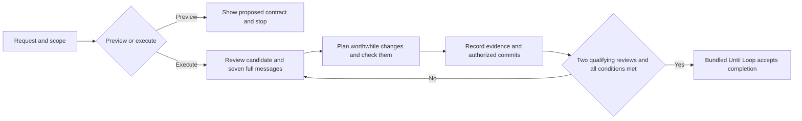

# Improve



Improve reviews a repository candidate, makes warranted changes, checks the
result, and continues until two distinct consecutive reviews find only trivial
issues or no changes. It uses the last seven reachable Git commit messages as
context. A material finding or fix resets the clean-review count.

The agent evaluates the work and evidence. The bundled Until Loop runtime
stores the execution contract and validates its transitions; it does not decide
whether a review was semantically complete or count truthful review passes.

## Use

Ask normally; the user does not supply runtime flags or JSON:

```text
Dry-run $improve on these changes. Show the scope and stopping conditions without writing files.
Use $improve on the parser changes, preserving its public API.
Use $improve on formatter.py and its tests. Do not stage or commit anything.
Use $improve on these changes and make an audit commit for every completed iteration, including no-change reviews.
```

Preview may inspect permitted context and show the proposed contract. It does
not initialize or resume a run, edit product files, execute project checks,
stage changes, or create a commit. A later execution request is required to do
the proposed work.

Execution needs filesystem and command access, Git for history and commits,
Python 3 for the bundled runtime, and the tools required by the selected
project checks. If the repository has no commits, Improve discloses the absent
history. An execution that requires commits remains incomplete until that
constraint is resolved.

## Package layout and installation

`SKILL.md` is the public Improve entrypoint. Its internal runtime dependency is
`runtime/until-loop/`; install or distribute the whole leaf, never only the
card. The nested runtime is not a second independently installed Improve
parent.

For a **skill-directory** install, use this repository's installer to place the
`improve` leaf in a supported host skill directory. For a **marketplace**
install, use the generated plugin view for this same leaf. Both forms retain
the package-relative runtime binding. A successful discovery/install does not
establish that every host can execute every project check.

This is release candidate **0.1.0-rc.1**. The bundled Until Loop runtime is
**0.3.0-rc.3**. The package has a relocation regression under the source
repository, but it is not a claim of a completed multi-host rollout, stable
release, universal model behavior, or universal Python/tool compatibility.

## Review contract

| Question | Default behavior |
|---|---|
| What gets reviewed? | An explicit file list, branch range, or baseline takes precedence. Otherwise freeze initial HEAD and review the initial staged, unstaged, and relevant untracked candidate plus later edits in this run. |
| What do the seven messages mean? | Read their full text each cycle, or all available messages if fewer exist. They inform the plan; they do not define the diff range or authorize unrelated work. |
| What is trivial? | Non-semantic spelling, formatting, or explanatory polish with evidence that behavior is unchanged. Behavior fixes, public-contract changes, and missing required regression coverage are material. |
| When are commits made? | After applicable checks pass, commit authorized scoped work with Review, Plan, Changes, Validation, Key learnings, and Remaining work. Preserve unrelated staged and unstaged hunks. |
| What if a review changes nothing? | Record a distinct substantive review in `.until-loop/working.md`; do not manufacture an edit or empty commit. An explicit audit-commit-every-iteration request is the exception. |
| When is it complete? | Two distinct, fully completed consecutive trivial-only or no-change reviews, no unresolved material finding, current relevant checks, and every other contract obligation satisfied. |

The full obligations and their evidence boundary are in
[review-policy.md](references/review-policy.md) and
[evidence-capture.md](references/evidence-capture.md). The parent card binds
them to [the bundled Until Loop card](runtime/until-loop/ADAPTER.md).

## Research and proposed experiments

[The Improve research decision record in the source repository](https://github.com/whichguy/skill-craft/blob/main/docs/improve-research.md)
documents evaluated GitHub mechanisms, proposed pilot arms, controls, and
promotion criteria. It proposes no behavior change for this release candidate.

## Provenance and packaging boundary

This package was derived from the `until-loop-v2` source at Git commit
`7b3b9122690f75a3e68e4fddee6e7a126302b27c`.

- The parent card, review policy, collector, and agent metadata originated in
  `examples/improve/` at that commit. The parent received marketplace
  frontmatter and now binds to `runtime/until-loop/ADAPTER.md` rather than a
  parent-directory runtime card.
- The collector now resolves its validator through the package-relative
  `runtime/until-loop/scripts/until_loop_v2.py` path. It does not import a
  surrounding source checkout.
- The bundled runtime contains the source card, execution scripts, and protocol
  references required by its v1/v2 adapters. Runtime scripts
  were copied byte-for-byte from that commit. The internal card is named
  `ADAPTER.md` so recursive host discovery exposes only Improve. Protocol
  references were updated to use that filename. The card's validation paragraph
  points to this package's relocation boundary instead of unshipped source
  tests and historical reports.
- The source repository's tests, experiment output, validation manifests,
  activation reports, working-checkout instructions, `.git` data, and bytecode
  are intentionally excluded. They are not runtime dependencies.

The package license is [MIT](LICENSE). The upstream card at this provenance
also declares MIT; this package does not make any broader attribution or
cross-host validation claim.

## Repository and release ownership

The canonical package stays in `skill-craft/skills/improve`. Its version and
marketplace pin can advance independently of other leaves using the existing
installer, plugin-view generator, and validation suite. A separate repository
is deferred until Improve needs separate maintainers, issue tracking, or a
release process. In either location, updating the bundled Until Loop snapshot
requires an explicit provenance update and compatibility checks.

## Maintainer validation

From the source repository, run:

```sh
bash test/improve.test.sh
```

The test copies the leaf to a path with spaces and, without a surrounding source
checkout, verifies a read-only v2 preview, the bundled collector's validator,
bad-state rejection, and package containment. It does not run arbitrary
repository changes or prove semantic review quality.
