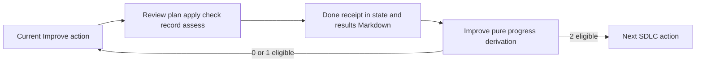

# Receipt-derived review progress

This is the narrow, pure progress rule used by Improve-owned
`review_progress.py` when a parent has explicitly selected a review-receipts
protocol. It is not an execution engine, a state store, a command interface,
or finalization authority. ShipLoop packages a local copy so its protocol-2
packet can derive progress from that run's accepted Markdown receipts without
starting a standalone Improve or Until Loop.



The script persists the receipt in its existing `state.md` and `results/`
Markdown ledger. `review_progress.py` reads the ordered contiguous receipts and
returns a derived streak; it writes no counter or files. That is one counter
owner, not a claim that the ledger proves the host's semantic assertions.

## Complete iteration receipt

At a protocol-2 Improve node, one action is exactly one complete
review/plan/apply/check/record/assess iteration. A successful `done` result
must have nonempty outer `evidence_refs` plus this exact `review` object:

| Field | Required value |
| --- | --- |
| `candidate_before` | Nonempty host descriptor of the candidate and scope before the iteration. |
| `candidate_after` | Nonempty host descriptor of the candidate and scope after the iteration. |
| `classification` | One of `material`, `trivial`, `none`, or `uncertain`. |
| `checks` | One of `passed`, `failed`, `stale`, or `incomplete`. |
| `improvements_complete` | A Boolean saying that accepted improvements were actually applied. |
| `open_findings` | A list of nonempty strings; use `[]` only when none remain. |

The result-only command printed in the packet is the only completion callback.
Its generated result path carries the script-issued action identity, so a host
must not add a reconstructed action ID, choose a successor, or submit an
unrelated result path.

For example, two no-change reviews can converge without a code edit or commit:

````markdown
```shiploop-state
{
  "outcome": "done",
  "summary": "No worthwhile change after the current scoped review.",
  "evidence_refs": ["notes/nav-review-17.md"],
  "review": {
    "candidate_before": "HEAD abc123; W1 parser scope",
    "candidate_after": "HEAD abc123; W1 parser scope",
    "classification": "none",
    "checks": "passed",
    "improvements_complete": true,
    "open_findings": []
  }
}
```
````

A second eligible receipt whose `candidate_before` is exactly `HEAD abc123; W1
parser scope` is the second clean pass and permits the next SDLC action. This
example is a host report, not proof that the Git state, review, or checks really
have that result.

## What counts and what resets

An eligible receipt is a `done` outcome with `classification` `trivial` or
`none`, `checks` `passed`, `improvements_complete: true`, no open findings, and
continuity with the prior receipt: the prior `candidate_after` must equal the
current `candidate_before`. Two eligible contiguous receipts advance the SDLC.

The following reset the streak to zero and do not count as a clean pass:

- `material` or `uncertain` classification;
- `failed`, `stale`, or `incomplete` checks;
- unapplied improvements (`improvements_complete: false`) or any open finding;
- a `repeat` or `blocked` result.

Candidate drift also resets the streak, but it is evaluated **before** the
current receipt counts: when a prior `candidate_after` differs from the current
`candidate_before`, reset first; if that current receipt is otherwise eligible,
it becomes the first new pass.

`pause` and `resume` create no review receipt and neither count nor reset one.
After resumption, rehydrate the current candidate and check continuity before
claiming a clean pass. A repeated callback, diagnostic step, or a bare green
check is not another review.

## Evidence, history, and commit boundaries

The receipt validates shape and derives a rule only. Candidate descriptors,
semantic materiality, check status, completeness, findings, and evidence
references are host claims, not machine proof. Keep a durable review note with
the actual basis, plan or no-change reason, checks, learnings, reviewer scope,
and limitations.

Each iteration still follows the shared Improve policy: read the latest seven
full Git commit messages (or every available message when fewer exist), use
that history to inform only authorized scope, and retain learnings. A genuine
no-change or explicit no-commit iteration is permitted; do not fabricate an
edit or empty commit merely to make it count. It does not waive an
owner/shared-policy obligation to create an authorized learning or audit commit
when one is required.

This rule applies only to the opt-in navigator protocol-2 pilot. Navigator
protocol 1 retains its host-judged whole-campaign Improve action. Existing
managed and legacy runs remain unchanged, including managed-controller audit
SHA and terminal-certificate semantics.
