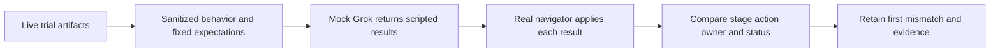

# Captured behavior and fast Grok/DAG replay



This suite checks ShipLoop's routing without waiting for a model to build an
application. The mock supplies deterministic agent results; the production
navigator still owns every state transition. Fixture expectations are fixed
independently of that routing implementation. A change to the DAG therefore
requires an explicit fixture review rather than silently changing the oracle.

## Run the short suite

From the skill-craft repository root:

```sh
python3 -B skills/shiploop-e2e-audit/harness/check_suite.py --suite mock
python3 -B skills/shiploop-e2e-audit/harness/dag_replay.py \
  --output /tmp/shiploop-dag-replay-01
```

Choose a new output directory. The first command runs assertion and mutation
tests. The second retains an inspectable replay report and per-case evidence.
Use `dag_replay.py --help` for explicit case selection and source selection.
Neither command launches Grok or another model, contacts a service, or executes
commands from a captured transcript. The live runner's two-hour cap and `xhigh`
setting apply to live requests, not to these deterministic replays.

## Capture a behavior fixture

Live trials write a derived `behavior.json` beside their original raw
capture and result. Interrupted or incomplete attempts retain explicit gaps.
Export a retained trial without changing its original records:

```sh
python3 -B skills/shiploop-e2e-audit/harness/behavior_capture.py \
  --trial /absolute/retained/trial \
  --output /tmp/shiploop-behavior-01.json
```

The portable record retains source hashes, requested settings, process outcomes,
native-event counts, accepted action order, result outcomes, work-item ownership,
and original outcome qualifications. It replaces free-text summaries and work
item labels with synthetic labels. It does not copy prompts, model prose,
commands, product source, credentials, or user paths. Original raw logs remain
the audit authority; the compact record deliberately cannot answer every
semantic question about a run.

The exporter normalizes navigator protocol 4 states. A state of any
other protocol is kept only as an `unsupported-protocol` qualification. No
retained trial is exported as a replay case: its record lacks the complete
producer and Improve callback sequence, and the exporter must not invent
missing control calls or child receipts. DAG replay instead uses independently
authored synthetic protocol 4 cases, labeled `kind: synthetic`. A successful
replay of accepted stage order cannot rehabilitate a live product result, and
preexisting history is not relabeled as work performed by a fresh one-shot
request.

## Mock boundary and failure evidence

`mock_grok.py` implements a dedicated JSONL request/response protocol, not a
replacement for the installed Grok executable. It returns fixture responses
bound to the current action and request. Its native-shaped events are marked
synthetic. `dag_replay.py` consumes those values through the real navigator
state API and records expected versus actual transitions, source/fixture
identity, state and packet hashes, and transport output. Captured shell text is
never executable input to either component.

Operator-authored mock cases are trusted local test data, and their scripted
result text is retained in debug output. Keep those cases non-sensitive. The
allowlisted sanitization guarantee applies to the live-behavior exporter; the
mock transport is not a general secret scrubber for arbitrary custom fixtures.

The cases state the Improve schedule literally rather than importing it. Only
the planning checkpoints (`spec`, `test-strategy`, `plan`, `step-plan`,
`test-spec`, `system-test-author`, `release-plan`) and the successful
carry-forward that leaves no work item pending park their action for Improve.
For example, a `spec` producer response must leave the same action waiting for
Improve, and a synthetic Improve completion then advances to `test-strategy`.
An `intake` producer response instead advances directly to `discovery`; a
control that expects any other edge must fail at that first event. Other
controls exercise work-item order, repetition, blocked/resumed work, cold state
reload, corrective work, and stale or conflicting callbacks. A replay mismatch
is an apparatus/protocol result; it is not an application-test result.

The report pins the ShipLoop and fixture inputs used. Changes during replay
invalidate that observation. A case must be protocol 4; a case of any other
protocol or kind is rejected before replay. Review an intentional DAG change
against the current contract and update the literal expectations.

## Evidence limits

Every mock result is simulation-only with zero model calls. It does not prove
prompt comprehension, reviewer quality, game behavior, deployment, or one-shot
success. Direct navigator calls with synthetic Improve receipts test the parent
handoff; they do not certify the standalone Improve runtime's receipt checks.
The repository's existing `shiploop-actual-improve-cli.test.py` and
`shiploop-standalone-improve.test.py` cover that separate CLI/runtime boundary.

Existing host-shape fixtures test what the observer can attribute from real
shell shapes, including heredoc limitations and a masked failure. Existing
recovery-isolation fixtures reject old-run reuse. Keep those tests beside DAG
replay: a completed stage sequence alone cannot establish either transport
attribution or fresh-request identity. Separate observer regression tests check
the protocol 4 smoke boundaries and callbacks: the `plan` selection means the
plan accepted after its Improve child, and each accepted action needs its own
callback (`improve-complete` for an action with an Improve record, `complete`
otherwise). A checkpoint producer callback alone cannot satisfy
lifecycle evidence. These fixture checks do not establish a new live Grok
smoke result.

| Existing check | Contract |
| --- | --- |
| `python3 -B test/shiploop-full-runtime.test.py` | Full 34-stage route, real child runtime, worktree return, recovery and generated package selection |
| `check_suite.py --suite mock` | Fast routing, fixed fixture expectations and negative controls |
| `check_suite.py --suite workflow` | Recorded workflow evidence, protocol 4 checkpoint Improve inventory and campaign qualifications |

Live `result.json` retains lifecycle counts and missing callback IDs; `audit.json`
retains stage counts. DAG replay `report.json` retains ordered transitions,
owners, action IDs, state hashes and packets. The CLI composition test reports
failing command outputs in its assertion diagnostics; its internal trace is
temporary and is removed during cleanup. Capture the unittest stdout/stderr when
retained diagnostics are needed. These checks do not claim exhaustive branch
coverage merely because all 34 stages were visited.
