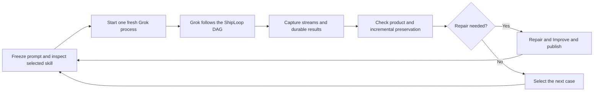
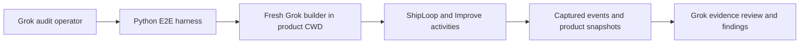
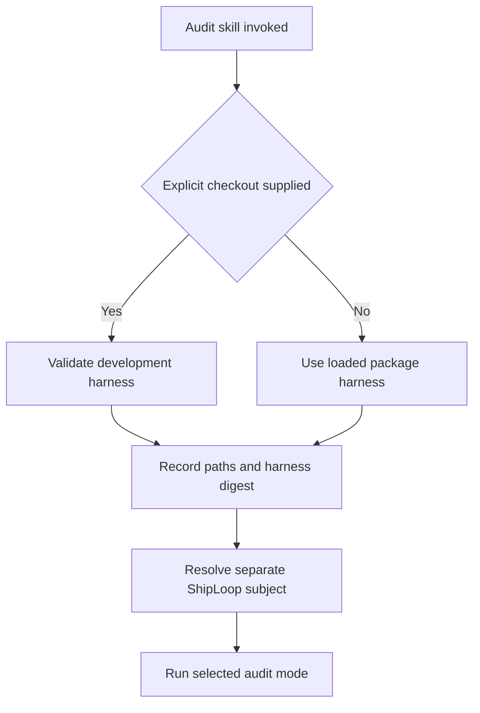

# ShipLoop one-shot Grok E2E campaign



This is an **opt-in live test harness for ShipLoop itself**. It launches the
normal Grok CLI with one literal `/shiploop …` prompt, observes the process and
the returned product, and records separate verdicts. It never completes a
ShipLoop callback, supplies a generated plan, sends a repair prompt, or silently
retries a failed request. The scenario catalog contains ten requests: nine GAS
create/feature/refinement requests for tic-tac-toe, checkers and Battleship, plus
one Salesforce checkers create in the authenticated default developer org.
GAS game cases exercise the configured Google Apps Script deployment MCP: each
create publishes a dedicated test application, each feature reuses that project,
and the audit requires candidate-bound hosted browser evidence. Mock and
stage-prefix smoke remain deliberately partial and cannot establish delivery.
Each launch selects exactly one case. The audit operator evaluates it, completes
any authorized repair/Improve/publication/retest cycle, then selects the next
case. No suite invocation launches a multi-case batch.

The primary result is the audit of ShipLoop's behavior. Use
[WORKFLOW-REVIEW.md](WORKFLOW-REVIEW.md) and `workflow-review-template.json` to
review each run's durable state, scope decisions, selected versus executed
tests, Improve evidence, recovery, and performance. Report this beside product
and callback verdicts; a working game alone does not establish workflow quality.
The source repository additionally retains the design history in
`docs/shiploop-e2e-full-suite-plan-2026-09-17.md`; that historical document is
not required to run an installed package.

## Run the audit from Grok

Use **`/shiploop-e2e-audit`** to ask Grok to operate this harness and review
ShipLoop's behavior. `/shiploop create ...` is the application request sent to
the separate builder process. The audit skill is
[`shiploop-e2e-audit/SKILL.md`](../SKILL.md);
it reuses this harness and does not add another scheduler.



### Install once and invoke

Install **shiploop-e2e-audit** and **shiploop** through your host's configured
marketplace. The audit package includes this harness, fixtures and audit schemas;
no skill-craft clone is needed. ShipLoop is a separate subject dependency, not
a bundled private copy. Live ShipLoop also needs its selected Improve skill.
The user installs these dependencies deliberately; invoking the audit does not
install/repoint them. Runtime prerequisites are Python **3.10+** and Git. Using
Grok as the audit operator or live builder also requires an authenticated Grok
CLI. The mock checks themselves need no model access when invoked directly with
Python; game verifier fixtures may also need Node.js.

Use the marketplace for consumer installation and updates. Keep one discovered
installation of each skill; do not add same-name skill-directory links beside
marketplace packages. A development checkout is source code, not another
installed copy. The explicit `checkout` override below can select development
harness scripts without installing a duplicate audit card.

```sh
grok --model grok-4.6 --reasoning-effort xhigh
```

Open a **new Grok session in any directory** after installation so it discovers the skill.
Substitute your supported model ID and executable path where needed. In Grok,
use any of these prompts:

```text
/shiploop-e2e-audit mock
/shiploop-e2e-audit check
/shiploop-e2e-audit launch-smoke model=grok-4.6 only=ttt-create
/shiploop-e2e-audit planning-smoke model=grok-4.6
/shiploop-e2e-audit ttt-create model=grok-4.6 reasoning-effort=xhigh timeout=7200 max-turns=1000 permission-mode=default
/shiploop-e2e-audit review /absolute/path/to/retained-trial
```

These are **free-form skill prompts**, interpreted by the audit operator.
The actual Python CLI commands are below. Both source symlinks and copied
marketplace packages use the harness beside the loaded audit card, even when
Grok starts in an empty folder or unrelated repo. An explicit
`checkout=/absolute/path/to/skill-craft` selects a development harness override.
Include
`output=/absolute/new-directory` if you want to choose the retained location.
With no mode the skill runs mock checks, not a live campaign. A live invocation
runs one selected case per command; it does not by itself authorize retries.
An explicit repair-and-continue campaign also authorizes the between-trial
operator steps described below, with review and freshness checks before each
new attempt.

### Shell one-shot from a fresh empty folder

This launches **Grok itself as the audit operator**, which discovers the skill
and runs its harness. After installing the audit and ShipLoop skills, run:

```sh
audit_parent="$(mktemp -d "${TMPDIR:-/tmp}/shiploop-e2e-grok.XXXXXX")"
mkdir "$audit_parent/empty-cwd"
printf '%s\n' "/shiploop-e2e-audit mock output=\"$audit_parent/results\"" \
  > "$audit_parent/prompt.txt"

(
  cd "$audit_parent/empty-cwd" || exit 1
  grok --cwd "$PWD" --prompt-file "$audit_parent/prompt.txt" --verbatim \
    --output-format streaming-json \
    --model grok-4.6 --reasoning-effort xhigh \
    --max-turns 1000 --background-wait-timeout 7200 \
    --permission-mode default --no-auto-update
) > "$audit_parent/grok.stdout.jsonl" 2> "$audit_parent/grok.stderr.log"
grok_status=$?
printf 'Grok exit: %s\nEvidence directory: %s\n' "$grok_status" "$audit_parent"
```

To run the full real tic-tac-toe create from a second fresh empty operator CWD,
use separate audit and product parents. Do **not** create the product or results
paths before launch: the missing product path is outside the auditor controls,
and the harness owns both paths.

```sh
live_audit_parent="$(mktemp -d "${TMPDIR:-/tmp}/shiploop-e2e-live-audit.XXXXXX")"
live_product_parent="$(mktemp -d "${TMPDIR:-/tmp}/shiploop-e2e-live-product.XXXXXX")"
mkdir "$live_audit_parent/operator-empty"
printf '%s\n' \
  "/shiploop-e2e-audit ttt-create model=grok-4.6 reasoning-effort=xhigh timeout=7200 max-turns=1000 permission-mode=default repo=\"$live_product_parent/tic-tac-toe\" output=\"$live_audit_parent/results\"" \
  > "$live_audit_parent/prompt.txt"

(
  cd "$live_audit_parent/operator-empty" || exit 1
  grok --cwd "$PWD" --prompt-file "$live_audit_parent/prompt.txt" --verbatim \
    --output-format streaming-json \
    --model grok-4.6 --reasoning-effort xhigh \
    --max-turns 1000 --background-wait-timeout 9000 \
    --permission-mode default --no-auto-update
) > "$live_audit_parent/grok.stdout.jsonl" 2> "$live_audit_parent/grok.stderr.log"
grok_status=$?
printf 'Grok exit: %s\nAudit evidence: %s\nProduct parent: %s\n' \
  "$grok_status" "$live_audit_parent" "$live_product_parent"
```

Use an installed, supported model ID and Grok executable. The prompt file and
logs are siblings of the empty CWD; `results` must **not** exist before launch.
No `checkout=` or installed skill path is needed. The selected audit package
supplies the harness for both marketplace copies and source symlinks.

The second command launches a separate builder from the missing
`$live_product_parent/tic-tac-toe` path. Its literal `ttt-create` prompt
requires the real configured Google Apps Script deployment MCP to create, stage,
promote, and publish a dedicated test app, then interact with its hosted web-app
URL. It does not change the host's permission mode or access configuration. If a
candidate-specific hosted verifier is not configured, the builder still runs; the
audit operator must establish hosted evidence afterward or retain the result as
`unverified`. The builder cap is 7200 seconds; the outer 9000-second native wait
allows additional time for capture and audit work. This is an allowance, not a
guarantee that a complete audit will fit.

Historical trials retain their frozen literal prompt and `prompt_sha256`.
The September 18 hosted trial said create/deploy/publish without explicitly
requiring production promotion; its choice of staging is not evidence of prompt
drift. The revised catalog makes stage then guarded production promotion
explicit for new trials. Do not rewrite old prompts or runner results.

For the mock command, inspect `$audit_parent/results/result.json` for `status`,
test/failure/skip counts, and selected subject. For the full command, inspect
`$live_audit_parent/results/result.json`, `manifest.json`, retained MCP/browser
evidence, and the auditor's `audit/` review for separate run, product,
deployment, hosted-behavior, and workflow dispositions. Inspect the corresponding
`grok.stdout.jsonl` for actual skill reads/commands and `grok.stderr.log` for host
errors. An exit code alone is not a test verdict. The starting empty CWD should
remain empty in mock mode.

The outer command makes real Grok model calls with requested `xhigh` effort.
The inner mock suite's `model_calls: 0` describes **that suite only**: it checks
fixture responses and DAG traversal without launching a game builder. This
distinction lets you test Grok operating the audit skill without claiming a
live generated application passed. The shell redirects retain raw operator
streams; the Python harness separately provides bounded, redacted capture for
its live builder runs.

For a live prefix test, use the same shell recipe with this prompt in a **new**
attempt directory:

```text
/shiploop-e2e-audit launch-smoke model=grok-4.6 only=ttt-create reasoning-effort=xhigh timeout=7200 max-turns=1000 output=/absolute/new-smoke-results
```

The shell's `--model` selects the auditor; `model=` in the skill prompt selects
the separate builder. `--background-wait-timeout` controls Grok's native wait,
not an OS wall-clock kill. For live runs, allow the outer process enough time
for the selected cases plus audit and cleanup; the harness enforces each
builder's `timeout` and retains partial evidence. A launch smoke only verifies
the configured graph prefix. Neither command silently changes permissions.

Inside headless Grok, the audit operator must launch the runner through
`run_terminal_command(background=true, timeout=0)`, retain the returned task ID,
and wait with `get_command_or_subagent_output(task_ids=[that_id], timeout_ms=60000)`.
Repeat the native wait if the task is still running, then inspect the retained
results and write/validate the workflow review before sending a final response.
This also applies when the runner exits nonzero. `monitor` is asynchronous;
starting a monitor and promising to audit later does not keep the model turn
active for post-run work. The September 18 real operator exposed that failure;
a separate real Grok probe verified task-ID wait followed by an audit marker.
See [the September 18 real-run findings](SAMPLES-2026-09-18.md) for the retained
timeout, subject drift, review-only recovery, and evidence limits.

### How an invocation from another repo finds the harness



The operator uses the **selected card's absolute path** exposed by the host's
skill context and runs its bundled `scripts/resolve_harness.py`. If the host
does not expose that location, the operator asks for it instead of guessing.
The helper selects the package's own `harness/` by default. It never chooses a
different harness merely because the current repo contains one. It validates
an explicit development `checkout` without fallback and records the actual
harness digest plus source HEAD/dirty state where available. A copied package
does not need Git metadata. The harness files live only once in the source tree,
at `skills/shiploop-e2e-audit/harness`; the old
`test/experiments/shiploop_e2e` path is a compatibility symlink. The standard
plugin generator materializes the whole skill, so distribution needs no special
installer or download step.

For example, suppose the host-selected card is
`/installed/plugin/skills/shiploop-e2e-audit/SKILL.md`. A bare
`/shiploop-e2e-audit` from `/work/new-game` binds
`/installed/plugin/skills/shiploop-e2e-audit/harness`, records
`binding_source=package`, then runs that absolute `check_suite.py` with
`--suite mock`, the resolved separate ShipLoop `--skill-root`, and a new external
output directory. The starting folder stays empty. This works the same way for
a materialized marketplace package and a source-backed symlink.

The operator resolves the **ShipLoop subject** from an explicit `skill-root` or
the host-selected installed card. In Grok, `grok inspect --json` reports the
user-invocable `shiploop` record's `source.path`, including marketplace paths.
Live/check resolve it from the intended product CWD, then the runner verifies
that discovery matches. Mock can use an explicit package path without Grok
installed. Missing or ambiguous subjects stop with a prerequisite to resolve;
the audit never tests an undisclosed bundled ShipLoop copy. Retained review
does not require an installed subject.

For the direct command examples below, bind `HARNESS` to the absolute `harness/`
directory beside the selected audit card. From the source checkout that is
`$PWD/skills/shiploop-e2e-audit/harness`. Focused no-model binding regressions:

```sh
python3 -B -m unittest discover -s "$HARNESS" -p test_checkout_binding.py
```

### Arguments and defaults

Use one mode followed by `key=value` fields. Quote paths with spaces; repeated
`only` / `artifact-root` fields or JSON string arrays are supported. Underscore
spellings such as `max_turns` normalize to the documented `max-turns`. These
fields are interpreted by Grok; they are not passed unchanged to Python. The
[skill's complete argument mapping](../SKILL.md#argument-reference)
specifies the exact CLI option and mode restrictions for every field.

| Field | Default or requirement |
| --- | --- |
| Mode | `mock` if omitted; `check` runs no-model host preflight; a named live suite, one catalog step, or `review PATH` must be explicit. |
| `checkout` | Optional development harness override; default uses the loaded package's bundled harness. No clone is required for marketplace installs. Invalid explicit paths stop. |
| `python` | Resolved `python3`, version 3.10+; use an explicit executable if PATH selects an older Python. |
| `model` | Required for live runs; names the builder model, not the current Grok auditor's model. In `check`, an optional recorded label (default `not-selected`), not a model-availability test. |
| `output` | If omitted, Grok chooses and reports a new external result directory. In review mode it selects an analyst directory; in `check`, an operator capture directory. Never reuse prior output. |
| `repo` | Single create: omitted means a new external empty folder. Feature: required existing original product. Suite: automatically allocated unless exactly one selected case overrides it. Check: supplied existing directory, or an allocated empty preflight directory. |
| `baseline` | Required canonical verified predecessor `result.json` for standalone/isolated features; forbidden for create. Full suites carry qualified predecessors forward. |
| `only` | Exactly one suite case, e.g. `only=ttt-create`. Required for multi-case suites; omitted is valid only for a one-case suite. Multiple selected cases are rejected before launch. |
| `timeout` | 7200 seconds per single run; a suite uses each catalog case's budget (currently 7200) unless overridden. Positive finite seconds. |
| `max-turns` | 1000 per single run; suite catalog values (currently 1000) unless overridden. Positive integer. |
| `reasoning-effort` | `xhigh` requested for the builder; child reviewer effort still needs observation. |
| `permission-mode` | `default`; explicit choices: `default`, `acceptEdits`, `auto`, `dontAsk`, `bypassPermissions`. |
| `grok`, `git` | Optional executable paths; otherwise resolve installed Grok and let the runner probe a working Git. |
| `skill-root` | Separate installed ShipLoop package; if omitted in the skill, resolve the host-selected card. Passed to offline `check_suite.py` as well as live/check `run.py`; does not install/repoint the subject. |
| `stop-after-stage` | Single-step partial run only; omit for full. Use the skill reference / `run --help` for supported prelude stages. Suites own their boundary. |
| `artifact-root` | Optional repeated additional known workspace directories, outside trial output; normal product/sibling workspace scan remains. |
| `verifier` | Optional JSON argv array for a real independent checker; a full result needs independent platform deployment, source-to-deployment identity and candidate-specific hosted browser evidence. GAS uses staging/promotion; Salesforce uses dev-org/deployment/component/Lightning proof. No shell string or fabricated review. |
| `verifier-timeout` | 300 seconds for that checker, separate from the builder cap; positive finite value. |
| `max-log-bytes` | 268435456 bytes (256 MiB) per captured stream/event file; positive integer. |
| `max-event-line-chars` | 4194304 characters (4 Mi) per native event; positive integer. |
| Review path | Required retained trial/suite directory after `review`; starts no builder. |

Resolve `python` and supplied `git` first: names use PATH, relative executable
paths use the starting CWD. Resolve `checkout` against that CWD, then other
filesystem fields against the helper's `path_base`: starting CWD by default,
or explicit checkout when supplied. `~` expands. Other executable
names use PATH. Use absolute
executable/input paths inside `verifier` JSON; `$HOME` there is not shell-expanded.
For mock/apparatus modes, `checkout`, `python`, `output` and `skill-root` apply.
Review accepts `checkout`, `python`, `output` and the retained path. Live-only fields in either
mode, unknown keys, conflicting scalar values, and invalid combinations need
correction before execution; Grok must not silently discard them.
`check` additionally accepts `repo`, `model`, `grok`, `git`, and `skill-root`;
it has no live budget/selection/verifier arguments and does not require login.
Its output directory retains preflight stdout, stderr and exit code.

Examples with the live settings made explicit:

```text
/shiploop-e2e-audit launch-smoke checkout=/absolute/skill-craft only=ttt-create model=grok-4.6 reasoning-effort=xhigh timeout=7200 max-turns=1000 permission-mode=default output=/absolute/new-smoke-output
/shiploop-e2e-audit ttt-create checkout=/absolute/skill-craft model=grok-4.6 reasoning-effort=xhigh timeout=7200 max-turns=1000 permission-mode=default repo=/absolute/new-empty-product output=/absolute/new-create-output
/shiploop-e2e-audit review /absolute/retained-trial checkout=/absolute/skill-craft output=/absolute/new-review-output
```

Supply real paths. For a live run, `output` must not exist yet; the runner creates
it. Keep product/output directories separate and outside installed audit/subject
packages and any selected source checkout.
For a multi-case suite, do not supply one `repo` or `baseline`; select exactly
one case with `only` when reusing an external product. A selected feature's
`baseline` also requires its original `repo`. A custom `stop-after-stage` belongs
on a single catalog step, not on a suite.

Before launching, Grok prints its resolved settings and exact command as a
progress record. This does not add a confirmation step. Keep that record to
compare the requested settings with `manifest.json` after the run. The skill
does not pass invented `--checkout`, `--python`, `--control-root`, `--resume`, or
`--improve-skill` flags to `run.py`.

### Full-chain verifier prerequisite

For each full create/feature case, supply an actual independent checker that
implements the receipt contract described below, or establish and grade its
evidence before selecting the next case:

```text
/shiploop-e2e-audit ttt-full only=ttt-create model=grok-4.6 verifier=["/absolute/configured-independent-checker"]
```

Replace that placeholder with a configured checker; one is **not bundled as a
universal app verifier**. Without it, the selected create remains unverified and
cannot qualify either dependent feature. A selected single `ttt-create` still runs the
full builder request, including its authorized dedicated-test deployment. After
the builder exits, the audit operator must establish candidate-specific hosted
verification from the real MCP and browser evidence or preserve `unverified`.
Use that stepwise route when adapting a newly generated app.
An unattended checker must obtain independent evidence and review bound to
each actual post-run candidate. A static pre-run `reviews.json` cannot normally
know those candidate digests. Passing `verify_suite.py` alone does not supply
that workflow; it still needs real drivers and matching independent reviews.

The auditor reads this README, runs the command, waits for completion, and
reviews the retained evidence. It must not build the game itself, rewrite the
catalog prompt, supply callback answers, repair a live trial, or redeploy a
candidate merely to get a receipt. For example,
`launch-smoke only=ttt-create` selects the tic-tac-toe intake case, starts a
fresh builder from an empty folder, and stops after accepted intake plus the
required observed callback. Its successful result is
`partial-smoke-passed`, with the product still `unverified`; that folder
cannot qualify as the baseline for a feature case.

### Choose the subject version explicitly

Installing the **audit** skill does not replace installed `shiploop` or
`improve`. The audit operator resolves the host-selected ShipLoop card and passes
its package directory explicitly. Live/check also require exactly one real,
user-invocable `improve` record from `grok inspect --json`; that record alone
selects Improve. The direct live Python CLI retains `~/.grok/skills/shiploop` as
a convenience default for skill-directory installs; marketplace operators must
use the actual selected path. In live/check, `--skill-root` asserts the ShipLoop
package Grok must discover, not an override that makes Grok load it or a way to
select Improve. The inspector fails if another skill shadows either selection.

Direct **offline** `check_suite.py` and `dag_replay.py` commands have a development
default: an exact source-tree installation uses its `skills/shiploop` sibling;
a materialized package defaults to `~/.grok/skills/shiploop`. Supply
`--skill-root` to test another installed package. Receipts identify the resolved
subject and digest and label the default source. The `/shiploop-e2e-audit`
operator always passes the actual host-selected subject explicitly, so its
behavior does not depend on these convenience defaults.

Before a consumer campaign, the operator prepares ShipLoop and Improve through
the existing marketplace entries, then opens a fresh Grok session and records
both selected paths. The evaluator does not install, publish, update or repoint
them. `checkout` changes the harness source only; it cannot bypass subject
freshness.

### Mandatory freshness gate before each evaluation

`run.py check`, `run.py run`, and every one-case live suite preflight both
selected skills: ShipLoop and Improve. For each, the gate compares three
identities: the newest committed source skill and generated package on
`whichguy/skill-craft` branch `main`, the immutable package pin on
`whichguy/skill-craft-market` branch `main`, and the actual selected local skill.
The gate reads fresh remote heads using temporary bare Git repositories. It
compares file bytes and executable modes, including published plugin metadata;
matching version labels alone are not proof. `--skill-root` applies only to
ShipLoop; Improve must resolve from one real user-invocable `grok inspect`
record. Unrelated source commits do not require republishing an unchanged
package. Uncommitted developer edits are not treated as a release candidate by
this consumer evaluation path.

| Status | Meaning and effect |
| --- | --- |
| `ready` | Current source, published package and selected installation agree; launch may proceed. |
| `unpublished-source` | Newest source/package differs from the immutable published package, or generated views lag source; no builder launch. |
| `installed-stale` | Selected local skill differs from the published current package; no builder launch. |
| `freshness-unverified` | Network/Git/catalog/package verification failed; no builder launch. |

A blocked trial exits 2, prints the reason, retains `freshness.json` and
`result.json`, and marks its overall status `blocked-preflight`. `freshness.json`
contains `skills.shiploop` and `skills.improve`, each with selected, source,
published/catalog-pin identities and source-to-generated, source-to-published,
and selected-to-published comparisons. `check` preserves its ShipLoop
`selection` and compatible `package_sha256`, and adds `improve_selection` plus
explicit `improve_package_sha256`; it exits 2 when blocked, with
`live_model_called: false`. There is no freshness bypass flag or silent local
fallback. Preparation belongs outside the evaluator; after publication/update,
rerun the same check.

Each receipt binds the remote commits observed at preflight time. Local discovery
and bytes for both selected skills are checked again immediately before launch
and after completion; a changed Improve selection stops before any model launch.
Upstream is not rechecked after the run. A release that appears during an
evaluation does not retroactively change its candidate or verdict. These checks
do not lock remote branches or packages against concurrent changes.

Do not edit the subject packages or the harness during a run. A fresh builder
process re-inspects and fingerprints the selected source each request, so an
intentional change between requests is visible in the next manifest.
See [source selection and fingerprints](#skill-changes-are-selected-again-for-every-request).

### Equivalent commands and retained locations

Run this block from any directory after substituting the two actual selected
package paths. It creates a durable external parent; each result directory
below is new. Keep that parent after the audit.

```sh
AUDIT_ROOT="$(mktemp -d "${TMPDIR:-/tmp}/shiploop-audit.XXXXXX")"
AUDIT_SKILL_ROOT="/absolute/directory-containing-audit-SKILL.md"
HARNESS="$AUDIT_SKILL_ROOT/harness"
GROK_BIN="$(command -v grok)"
# If Grok is not on PATH, set GROK_BIN to its actual absolute executable.
SHIPLOOP_ROOT="/absolute/directory-containing-selected-shiploop-SKILL.md"

python3 -B "$HARNESS/check_suite.py" --suite mock --skill-root "$SHIPLOOP_ROOT" --output "$AUDIT_ROOT/mock"
python3 -B "$HARNESS/run.py" list
python3 -B "$HARNESS/run.py" suites

# Read-only host/skill/Git preflight; no model call.
mkdir "$AUDIT_ROOT/preflight-product"
python3 -B "$HARNESS/run.py" check --repo "$AUDIT_ROOT/preflight-product" \
  --grok "$GROK_BIN" --skill-root "$SHIPLOOP_ROOT" --model grok-4.6

# Live: one deliberately partial case, with the literal create prompt.
python3 -B "$HARNESS/run.py" suite \
  --suite launch-smoke --only ttt-create --output "$AUDIT_ROOT/launch-smoke" \
  --grok "$GROK_BIN" --skill-root "$SHIPLOOP_ROOT" --model grok-4.6 \
  --reasoning-effort xhigh --timeout 7200 --max-turns 1000

# Alternative live run: one full create attempt from a new empty product CWD.
# The literal catalog prompt requires a real configured MCP deployment; without
# a configured verifier, retain its hosted result as unverified until audited.
python3 -B "$HARNESS/run.py" run \
  --step ttt-create --repo "$AUDIT_ROOT/product-ttt" \
  --output "$AUDIT_ROOT/ttt-create" --grok "$GROK_BIN" \
  --skill-root "$SHIPLOOP_ROOT" --model grok-4.6 \
  --reasoning-effort xhigh --timeout 7200 --max-turns 1000
```

Choose the live command you need; the two examples are separate attempts, not
steps that must both run. The runner creates the missing create-product folder
and starts Grok **from that folder**. Do not run `git init` there first.
The suite creates its own empty products outside its output tree and records
their paths in `suite-execution.json`.

`--permission-mode` remains `default`. If your already-authorized unattended
posture requires another supported mode, pass it explicitly; the skill must not
silently choose `bypassPermissions`. The harness is not an OS sandbox.
Each case has a two-hour model allowance; a three-case full chain uses three
separate invocations with a review checkpoint between them. Configure each
shell/background job for its selected case **plus final capture/cleanup**. Let the runner enforce its timeout;
an outer kill at exactly 7200 seconds can interrupt receipt finalization.

The runner passes the same budget to Grok's native background wait. Check the
manifest's actual argv when using a different CLI version; an unsupported flag
is an apparatus failure. Requested `xhigh` applies to the builder invocation.
Inspect effective owner **and delegated reviewer** settings in available native
evidence; do not infer child effort from the parent flag.

A full create may finish building and deploying yet exit **2** because
candidate-specific hosted verification is missing. Full chains such as
`ttt-full` require configured, reviewed
[local semantic drivers and independent review receipts](#independent-verification-and-incremental-feature-runs).
This harness supplies no automated GAS hosted-browser driver. Without the
separate actual hosted observation and deployment evidence, preserve
`unverified` and blocked dependent cases; do not call the chain passed.
A later feature must use the **same original product repo** and verified
predecessor `result.json`, not a smoke folder or a newly regenerated game.

For that stepwise route, finish the create, establish its actual MCP staging and
promotion receipts plus a candidate-specific hosted browser observation, run any
needed local semantic adapter and scope/return review, then pass the typed hosted
observation and raw receipt references through the independent review input. Use
[`run.py grade`](#independent-verification-and-incremental-feature-runs) with
the resulting pinned receipt. Only if the current predecessor result qualifies
as `passed`, invoke the next step with its exact existing product and baseline:

```text
/shiploop-e2e-audit ttt-guidance model=grok-4.6 repo=/absolute/original-product baseline=/absolute/create-trial/result.json
```

This is a new one-shot feature request, not a resume of the create. Repeat the
independent verification before `ttt-best-move`. Do not use
`--diagnostic-unverified-baseline` to bypass this chain's verification gate.

### What Grok must return after an audit

For mock mode, return the command, `mock/result.json`, passed/failed/skipped
counts and the no-model limitation. For a live case, retain and explain:

| Output | Audit use |
| --- | --- |
| `result.json`, `REPORT.md` | Read separate process, protocol, product and incrementality outcomes. |
| `manifest.json`, `prompt.txt` | Confirm literal request, actual paths, argv, source digests and budget. |
| `capture/stdout.log`, `capture/stderr.log`, `capture/events.jsonl` | Trace actual commands, failures, timing and capture gaps. |
| `artifacts/`, `navigation.json`, `host-observations.json` | Reconcile accepted graph activities, Improve imports and return evidence. |
| `product-before/`, `product-after/`, `change.json` | Inspect delivered files, actual test coverage and incremental preservation. |
| `verification/` deployment/browser observations | Confirm platform-specific deployment and source linkage: GAS staging/promotion and `scriptId`/version/deployment/`/exec`, or Salesforce DX job/org/components/Lightning route; inspect hosted interaction traces. |
| `audit/WORKFLOW-REVIEW.md`, `audit/workflow-review.json` | Auditor-authored findings, evidence, limitations and smallest next experiments. |

The last row is **written by the audit skill**, not automatically by `run.py`.
For suites, also return `suite-result.json`, `suite-execution.json` and a
top-level `AUDIT.md` linking every attempted/blocked case. Keep failures and
interruptions in the record. `review` mode produces the same analysis from
retained data without restarting the builder.

If `audit/` already contains a review, write the new interpretation to a fresh
directory such as `audit-review-02/`; do not overwrite the original review.
Use that directory consistently for its JSON, evidence and validation output.
Read the current clock for `reviewed_at`; captured event/receipt timestamps take
precedence over an analyst's unsupported timestamp.

Follow [WORKFLOW-REVIEW.md](WORKFLOW-REVIEW.md). Bind a copy of the current
`workflow-review-template.json` to the trial, candidate, baseline, skill and
harness digests. Put cited evidence copies under the review's own `audit/`
directory, with relative paths and SHA-256 values required by the schema.
Validate that completed review through the existing Python API:

```sh
python3 -B - "$HARNESS" /absolute/trial/result.json \
  /absolute/trial/audit/workflow-review.json <<'PY'
import json
import sys
from pathlib import Path

sys.path.insert(0, sys.argv[1])
from workflow_review import validate_review

result = json.loads(Path(sys.argv[2]).read_text())
review_path = Path(sys.argv[3])
review = json.loads(review_path.read_text())
validation = validate_review(review, result, review_path.parent)
review_path.with_name("validation.json").write_text(
    json.dumps(validation, indent=2) + "\n"
)
print(json.dumps(validation, indent=2))
PY
```

Validation checks evidence binding/completeness, not the truth of the review.
Inspect its returned `status`, gaps and unverified dimensions; process exit zero
alone is not a passing review. Keep the runner's original results unchanged.
Mark missing nested host events or effective child settings as unverified.
A test marker or two clean review claims do not prove test semantics: replay
concrete examples where practical, reconcile planned tests with executed tests,
and distinguish local rendered interaction from pure-rule checks or hosted GAS
evidence. End with specific, evidence-backed ShipLoop/harness improvements,
not only a pass count.


## Fast mock Grok and DAG checks

Use Python 3.10 or newer for this E2E apparatus; the game oracles use
`zip(..., strict=True)`. On macOS, keep that interpreter explicit when selecting
Command Line Tools Git: prepending its directory to `PATH` can also select
Apple's older Python 3.9. The September 17 fix validation used Python 3.14.7.

```sh
python3 -B "$HARNESS/check_suite.py" --suite mock
python3 -B "$HARNESS/dag_replay.py" --output /tmp/shiploop-dag-replay-01
```

These commands use scripted Grok responses with the real navigator transition
code, including current-protocol synthetic cases and sanitized paths retained
from real E2E runs. Future live trials also write `behavior.json` for repeatable
analysis and case derivation. Source drift, wrong edges, callback conflicts, and
missing evidence remain visible. Mock passes cannot establish live application
or model success. See
[MOCK-REPLAY.md — capture, replay, and evidence boundaries](MOCK-REPLAY.md).

## Short suites and selected cases

All model runs default to **`--reasoning-effort xhigh`**. This includes the
outer auditor, review-only sessions, and delegated model work, not only the
application builder. A different effort requires an explicit operator override.
The low-level `grok_adapter.build_argv` pins `xhigh` for omitted or `None` effort;
blank values fail instead of falling back to the host default. An explicit
override is recorded in the trial manifest and forwarded unchanged after
whitespace normalization.

The operator must verify a native reviewer's effort independently. Parent
`xhigh` does not establish a child's effective effort. Use a controllable
launch path or report that prerequisite. Record a documented native equivalent
where necessary, and retain unknown/unsupported settings as limitations.
Non-model shell commands need no effort flag, and custom verifier argv remains
an exact user-supplied contract.

The exact model and requested effort are retained in each manifest. Use `suites` to list the current
case selections and budgets without calling a model:

```sh
python3 "$HARNESS/run.py" suites
python3 "$HARNESS/run.py" suite \
  --suite launch-smoke --only ttt-create --output /tmp/shiploop-launch-01 --model grok-4.6
python3 "$HARNESS/run.py" suite \
  --suite launch-smoke --only checkers-create \
  --output /tmp/shiploop-checkers-01 --model grok-4.6
```

| Suite | Cases | Observation boundary |
| --- | --- | --- |
| `launch-smoke` | Tic-tac-toe and checkers create | Accepted `intake` and its real callback |
| `planning-smoke` | Tic-tac-toe create | Reviewed plan: v2 `plan-improve`; v3 accepted `plan` after Improve |
| `ttt-full` | Create, guidance, best-move refinement | Full verified deployment, hosted behavior, and predecessor chain |
| `checkers-full` | Create, guidance, hint-toggle refinement | Full verified deployment, hosted behavior, and predecessor chain |
| `battleship-full` | Create, status/history, history-filter refinement | Full verified deployment, hosted behavior, and predecessor chain |
| `games-full` | All nine requests | Three independent deployed product chains |
| `salesforce-checkers-full` | One Salesforce checkers create | Existing default dev org, real metadata deployment and authenticated Lightning behavior |

Initial live observations and retained failed attempts are recorded in
[SAMPLES-2026-09-17.md](SAMPLES-2026-09-17.md).

All suites default to a **two-hour (7200-second)** cap and a secondary cap of
1000 turns. Partial suites stop at their chosen stage when reached.
Historical runs retain their recorded 80-minute caps; compare future two-hour
runs as a distinct budget condition.
The manifest owns per-case time/turn caps; `--timeout` and `--max-turns` override
them for a campaign. Caps are not expected durations. `--only` accepts exactly
one case ID or scenario step ID per invocation. A multi-case selection is
rejected before output creation, preflight or model launch. One-case suites may
omit `--only`. A selected feature reuses its retained, verified predecessor with
`--repo` and `--baseline`; a failed or unverified create cannot qualify that
baseline. Review the finished or interrupted attempt before selecting another
case, including a case from an independent family. Retain planned and unrun
cases in the external campaign inventory rather than silently dropping them.

Default suite products live in a separate, durable temporary parent with opaque
repo names, outside the campaign's `--output` tree. `suite-execution.json` records
the product-key-to-repo mapping so subsequent cases use the same physical repo.
Retain that parent for feature work and auditing; the suite does not automatically
delete it. An explicit `--repo` must not contain, or be contained by, campaign
controls. The suite does not resume an existing output directory; independent
feature invocations still use the verified `--repo` and `--baseline` contract.

A partial run sends exactly the same application prompt as its full case.
The observer waits for matching durable accepted results and captured successful
host-tool completions, then signals the private process group. It never submits
a callback or tells Grok to skip SDLC stages. `partial-smoke-passed` establishes
only that prefix, and cannot become a full product pass or predecessor. A missed
boundary, timeout, missing callback, changed skill, or truncated capture fails
the smoke; extra accepted stages are reported as `partial-smoke-overshot`.
Polling is not an atomic pause: work on the next action can begin before the
stop signal, and edits are not rolled back. Retain these disposable workspaces
for audit; do not use them as verified feature baselines.

For a shorter feature-prefix check against a verified product:

```sh
python3 "$HARNESS/run.py" run \
  --step ttt-guidance --repo /absolute/verified/tic-tac-toe \
  --baseline /absolute/previous-trial/result.json \
  --output /tmp/shiploop-feature-intake-01 --model grok-4.6 \
  --stop-after-stage intake --timeout 7200 --max-turns 1000
```

Choose any prelude boundary through `plan-improve`. The legacy review names
`research-improve`, `spec-improve`, and `plan-improve` remain selection aliases:
on protocol 3 they resolve to the corresponding accepted stage after its Improve
child completes. Callback auditing requires `improve-complete` for protocol 3;
its earlier producer `complete` call does not establish stage acceptance.
INNER boundaries are not exposed because the same stage recurs across work
items and needs a separate explicit selection contract.

**Implemented versus unproven:** the runner, capture/identity checks, scenario
catalog, receipt validation, composite game-oracle framework, source-closure
check, workflow-review validation, and fast fake-host tests are local apparatus.
No passing apparatus test establishes ten live Grok passes, a universal browser
adapter, or hosted Apps Script/Lightning behavior. Independent UI verification still
requires a candidate-specific hosted browser observation with retained trace for
the returned app.
There is deliberately no assumed universal Apps Script emulator or mandated
application framework. Missing verification remains `unverified` and does not
become a passing skip.

## Start with three deployed tic-tac-toe requests

Run these commands from the repository root. Choose an actual model ID supported
by your installed Grok; the runner requires it rather than silently inheriting
a changing default. Each output directory must be new. All campaign artifacts
and generated games should live outside the skill-craft checkout.

```sh
python3 "$HARNESS/run.py" list
python3 -m unittest discover -s "$HARNESS" -p 'test_*.py'
python3 "$HARNESS/run.py" check --repo /absolute/disposable/repository
python3 "$HARNESS/run.py" run \
  --step ttt-create \
  --repo /tmp/shiploop-campaign/products/tic-tac-toe \
  --output /tmp/shiploop-campaign/trials/ttt-create-01 \
  --model YOUR_GROK_MODEL --reasoning-effort xhigh --timeout 7200 \
  --max-turns 1000 --permission-mode default
```

The runner creates a missing product folder for `create` and leaves Git
bootstrap to Grok/ShipLoop. New-app cases require a physically empty folder, with no preinitialized `.git`. Both the process CWD and Grok `--cwd` are that folder; feature cases use the existing original product root. It refuses
a nonempty new-app fixture, a product subdirectory inside another Git repo,
overwriting trial output, or storing evidence inside the product.

`--permission-mode` defaults to Grok's `default`; it is recorded. If the
installed host needs an approval, the unattended request may stop. Configure a
suitable **existing authorized** posture explicitly for a live campaign; the
runner does not turn approvals off automatically. `--timeout` (default 7200
seconds / 2 hours) and `--max-turns` (default 1000) are initial pilot caps, not measured
performance claims. Freeze the same caps for compared runs. A timeout retains
evidence and stops the captured process group; it is never success or an automatic retry.
Before stopping that group, the runner takes a bounded process ancestry snapshot
and signals separately sessioned descendant groups whose leaders still match
their observed PID, process group, and start time. Parent relationships establish
ownership in the initial snapshot. It records signals and
limitations under `process.group_termination.descendant_cleanup`. Unrelated or
identity-changed groups are excluded. If the parent has already exited and its
children have been reparented, ancestry cannot establish ownership: the receipt
reports that gap and does not claim to have stopped those unknown orphans.

Grok inherits its normal authenticated environment; no auth files or environment
dump are copied into the report. Its configured deployment MCP must complete the
normal authorized route for the dedicated test app; publishing does not imply an
anonymous access mode. Memory is disabled for the child process and auto-update
is disabled in argv. The runner is **not a filesystem/network
sandbox**. Use disposable products and your existing tool permission boundaries.
The live catalog prompt authorizes only the dedicated-test deployment it names,
not ordinary documentation reads, unrelated model/network access, or arbitrary
repairs/redeployments. Full effect isolation would require a separately
validated host sandbox; this harness does not claim it.

The full `run` command returns 0 only for a completely graded pass; 2 also covers an
otherwise completed build/deployment that still needs independent hosted
verification. Inspect `result.json` and `REPORT.md` to distinguish those cases.
An explicitly partial run returns 0 for `partial-smoke-passed`, with product
verification still `unverified`. Suites return 0 only when every selected case
satisfies its declared scope.

On macOS, when the Git probe selects Command Line Tools, the child also receives
`DEVELOPER_DIR=/Library/Developer/CommandLineTools`. This prevents a login shell's
PATH reset from selecting an unusable Xcode Git; no system toolchain setting is
changed. The override is recorded. Default artifact roots cover the product and
`.shiploop-runs` under its parent and grandparent; pass `--artifact-root` for
another known workspace location. Missing capture is unverified, never inferred.

Live capture defaults to 256 MiB per stream/event file and 4 Mi characters per
native event (`--max-log-bytes`, `--max-event-line-chars`). Grok can represent one
tool result as both text and byte arrays, so ordinary source reads can exceed
128 KiB. Direct `rawOutput.output`, `stdout`, `stderr`, and `bytes` arrays whose
members are byte values are bounded-decoded, credential-sanitized, and re-encoded;
benign arrays retain their values. Arrays outside `rawOutput` remain semantic JSON
and are not decoded. `redacted_byte_arrays` records recognized transports changed
by redaction. A malformed or oversized recognized transport increments
`invalid_byte_arrays`, makes capture incomplete with explicit truncation, and fails
grading. Exceeding either configured limit is also explicit truncation; the harness
never silently treats dropped evidence as complete.

## Skill changes are selected again for every request

The E2E harness launches Grok; ShipLoop runs as a skill plus scripts inside that
Grok conversation. The model follows the action packets and calls the scripts
to record progress through the graph. Setting the harness's `xhigh` default does
not require ShipLoop to launch another model or use `shiploop drive`.

Each request starts a fresh OS process and session; neither `--continue` nor
`--resume` is passed. Before launch and again after exit, `grok inspect --json`
runs with the product as cwd. Its selected `shiploop` source must resolve to
`--skill-root` (default `~/.grok/skills/shiploop`), while its selected `improve`
source must come from exactly one real user-invocable Improve record. The option
is a ShipLoop **expected identity assertion**, not a Grok option, installation,
profile edit, or override; it cannot select Improve. A repo-local stale skill
that shadows either expected selection fails preflight. Two distinct installed
ShipLoop cards also fail preflight, as does a reported collision or a qualified
`invocableAs` route such as `user:shiploop`. The harness keeps the literal
`/shiploop` scenario prompt; it does not silently rewrite it to select a
different package. Resolve the install selection before starting a new audit,
and keep any package used by an ongoing run stable.

The entire selected package is hashed, including prompt/reference/script files
and resolved symlink dependencies. The manifest retains both logical and
resolved locations; `package-inputs/` retains the observed source bytes by digest
for later diagnosis (credential-shaped content is omitted and reported).
Editing ShipLoop between requests therefore changes the
next manifest's digest. Changes during a request invalidate that trial. Keep
the source stable for the lifetime of a live run; do not fix ShipLoop while that
run is still sampling it.

`harness-inputs/` separately freezes the observer's Python and JSON sources,
including the suite catalog; its digest is in the trial manifest. This lets an
audit distinguish a ShipLoop revision change from a capture/grading change.
`observer-provenance.json` retains per-file hashes even when source bytes are
omitted. The runner fingerprints at trial entry, checks again after preflight
and immediately before model launch, and compares after observation/verifier
execution. A detected change prevents launch or invalidates the trial; later
grading cannot restore a pass. Keep observer sources stable for the entire
runner process, including between suite cases: these disk checks do not directly
attest already-imported Python bytecode or detect a change restored between checks.

Native stream command advertisements and successful ShipLoop tool invocations
are separate observations. Inspection and disk hashes prove which package was
selected on disk; they do not prove that a model obeyed every instruction or
reveal its hidden context. Actual script use must be observed in structured
tool events. A full pass additionally requires observed start, every accepted
action's `complete`/`done` callback, and the worktree return, bound to that new
run's paths/action IDs. An `init` call plus completed-looking files is insufficient.
For shell strings, only the final executable command can receive automatic
lifecycle credit. Earlier commands share a final status that does not establish
their individual success. Conditional/pipeline syntax, control flow, dynamic
assignments, and unsupported heredocs stay unattributed. The adapter supports a
narrow standalone quoted Python heredoc followed by one literal terminal
ShipLoop callback; it never evaluates shell code to interpret it.
Missing or truncated host telemetry is an evidence limitation.

Captured model tool inputs are also checked for absolute-path references to
campaign/trial controls and observer source. Observed references invalidate the
trial and cannot be cleared by a later passing verifier or grade. These are
conservative input-reference observations, not proof that every attempted read
succeeded. Model text and tool output are not treated as file access; the
observer's own launch argv is not a model tool call. This check does not establish
absence of relative traversal, encoded paths, shell indirection, or unreported
access. Moving controls away from product ancestors reduces accidental exposure;
neither the layout nor this detector is an OS sandbox.

Late grading re-fingerprints the running observer against the trial's frozen
identity. Editing the observer after capture invalidates that trial's grade;
it does not silently reinterpret the old run as a pass. Missing or conflicting
identity fields in observer-bound receipts also fail closed. Unbound historical
receipts retain an explicitly reported legacy compatibility path.

The September 17 inspection found `SKILL.md` at 0.11.1 and a legacy 0.9 entry
description in `commands/shiploop.md`. Both are part of the package fingerprint.
Keep the original baseline for the first campaign; investigate an observed
routing failure before changing production prompts.

## Salesforce default dev-org preflight

`salesforce-checkers-full` contains only `salesforce-checkers-create`. It uses
existing Salesforce DX authentication and leaves the created test app available
for inspection; there is no automatic org/app deletion. Before launching, the
operator must verify the default target matches the user's intended org. This
read-only example retains only safe identity fields and developer-edition
evidence. Supply the expected ID, instance URL and Lightning host from independently
confirmed user context, not by accepting whatever the default returns. Run it from the intended
empty product CWD so project-local Salesforce configuration cannot change the
selection between the check and launch. Keep its output outside the product.

```sh
python3 - /absolute/new-target-preflight.json EXPECTED_ORG_ID https://EXPECTED.my.salesforce.com EXPECTED.lightning.force.com <<'PY'
import datetime, json, subprocess, sys
from pathlib import Path
from urllib.parse import urlparse

def sf(*args):
    process = subprocess.run(['sf', *args, '--json'], capture_output=True,
                             text=True, timeout=45)
    if process.returncode:
        raise SystemExit('Salesforce preflight failed; no model may launch')
    return json.loads(process.stdout)['result']

target = sf('org', 'display')
expected_id, expected_url = sys.argv[2], sys.argv[3].rstrip('/')
if (target.get('id'), str(target.get('instanceUrl', '')).rstrip('/')) != (expected_id, expected_url):
    raise SystemExit('Default target differs from the intended org; stop')
if target.get('connectedStatus') != 'Connected':
    raise SystemExit('Default target is not connected; stop')
instance_host = urlparse(target['instanceUrl']).hostname or ''
if not instance_host.endswith('.my.salesforce.com'):
    raise SystemExit('Confirm the Lightning host independently for this instance; stop')
observed_lightning_host = instance_host[:-len('.my.salesforce.com')] + '.lightning.force.com'
if observed_lightning_host != sys.argv[4]:
    raise SystemExit('Lightning host differs from the intended My Domain; stop')
org = sf('data', 'query', '--target-org', target['username'], '--query',
         'SELECT Id, OrganizationType, IsSandbox FROM Organization LIMIT 1')['records'][0]
if org.get('Id') != expected_id or org.get('OrganizationType') != 'Developer Edition':
    raise SystemExit('Target is not the confirmed Developer Edition org; stop')
receipt = {'schema': 'shiploop-e2e-salesforce-target-preflight/1',
           'status': 'connected', 'org_type': 'developer',
           'expected_org_id': expected_id, 'observed_org_id': target['id'],
           'expected_instance_url': expected_url,
           'observed_instance_url': target['instanceUrl'].rstrip('/'),
           'expected_lightning_host': sys.argv[4],
           'observed_lightning_host': observed_lightning_host,
           'is_sandbox': org.get('IsSandbox'), 'product_cwd': str(Path.cwd().resolve()),
           'checked_at': datetime.datetime.now(datetime.timezone.utc).isoformat()}
with Path(sys.argv[1]).open('x') as output:
    json.dump(receipt, output, indent=2)
print('Confirmed intended developer org; sanitized receipt retained')
PY
```

For standard My Domain instances, the Lightning host is derived from the
observed instance hostname; this is an identity check, not a browser visit.
The display response is parsed in memory because it can include an access token;
never print the raw response or save it as an artifact. This example does not
log in, set a default, refresh a package or deploy. Developer Edition can have
`IsSandbox: false`; sandbox status alone does not establish the intended target.
If `sf` or the configured Salesforce DX tools are unavailable, report the
prerequisite instead of changing authentication or using another org.

Launch only when requested, through the ordinary one-shot route:

```text
/shiploop-e2e-audit salesforce-checkers-full model=grok-4.6 repo=/absolute/empty-product salesforce-preflight=/absolute/new-target-preflight.json
```

The receipt must be checked within 15 minutes of launch and name the same
explicit empty product directory in `product_cwd`. Both `run` and `suite` require
`--salesforce-preflight` for this Salesforce step; a Salesforce suite also needs
`--repo`. The runner rejects missing, malformed, stale or mismatched receipts
before output creation or a model call, and pins the accepted sanitized receipt
in the manifest. Post-run deployment proof must use that same receipt hash.
It accepts only the documented safe fields; tokens and other
extra fields must never be included. This validates an independently obtained
preflight, not live Salesforce authentication. Keep the default-org configuration
unchanged between the external check and launch.

The full literal prompt is in `scenarios.json`. This call may build and deploy
the dedicated test app. It does not imply independent product verification is
already configured. Afterward use the Salesforce evidence contract in
[CASES.md](CASES.md) and the normal `verify_suite.py`/`run.py grade` route below;
without real candidate-bound deployment and authenticated UI evidence, keep the
result unverified. No Salesforce browser automation is supplied by this harness.

## Independent verification and incremental feature runs

The runner saves read-only `product-before/` and `product-after/` source copies
plus hash manifests. Product files are hashed even when Git ignores them.
Credentials and external symlinks keep hash identities but are omitted from
copies. Git metadata and untracked conventional dependency/runtime cache trees
are excluded and reported in `skipped`; explicitly tracked inputs remain hashed.
Creating or removing an excluded cache does not itself change product identity.
The exclusion names are declared in `evidence.py`; they do not cover arbitrary
build/output directories. A copy with omissions may need a separately established
hosted verification environment before replay. The runner writes
`verification-template.json` with every required assertion
unverified. Use an independent checker to populate it with real evidence, or
pass `--verifier '["/absolute/checker", "argument"]'`. This is structured argv,
never a shell string. The checker runs after Grok has exited, receives
`SHIPLOOP_E2E_TRIAL`, `SHIPLOOP_E2E_REPO`, `SHIPLOOP_E2E_BASELINE`, and `SHIPLOOP_E2E_EVIDENCE`, writes its
artifacts under that evidence directory, and emits one JSON receipt on stdout.
Its own stdout/stderr and exit status are captured separately. It must not edit
the product, invoke a model mock, or replace the builder's deployment; the runner
checks the candidate digest again afterward.
Both `pass` and `fail` declarations, including incremental reviews, require at
least one valid pinned evidence artifact. A bare failure declaration is an
invalid receipt, not evidence that the current product failed. Use `blocked` or
`unverified` when the observation is unavailable.

To validate an independently produced receipt later:

```sh
python3 "$HARNESS/run.py" grade \
  --trial /tmp/shiploop-campaign/trials/ttt-create-01 \
  --receipt /tmp/shiploop-campaign/trials/ttt-create-01/verification.json
```

Receipts bind the exact trial, candidate, baseline, required check IDs, and
nonempty evidence files by SHA-256. Receipt validation proves binding and
completeness; it cannot authenticate a checker's claim merely because an
artifact exists. For full games, use actual platform deployment receipts
(GAS staging/promotion or Salesforce DX), source-to-deployment mapping, and hosted browser evidence for
behavior, plus an independent source/behavior review for lineage. Agent-authored
tests are useful evidence but cannot replace the independent checks. Review the
raw artifacts before treating a reported pass as credible.

`verify_suite.py` is the common receipt assembler and **local** semantic verifier
for the catalog. It chooses an explicitly supplied bounded driver by
step ID or game family, replays retained source/baseline/candidate behavior,
performs GAS entrypoint/resource-closure checks for GAS cases, and consumes a separately
supplied independent review for scope, return, deployment, hosted behavior, and
incremental-integration claims. It does not open, replay, or otherwise verify a
published URL. Salesforce uses the separate target/deployment/component/Lightning
proof contract in [CASES.md](CASES.md), with the same checkers rule oracle and
receipt binding. Neither platform has a universal hosted-browser driver bundled.
It emits the existing hash-bound receipt schema.
Use it through `run.py --verifier` so its own process capture and post-verifier
candidate-digest check remain in effect:

```sh
python3 "$HARNESS/run.py" run \
  --step ttt-create --repo /tmp/shiploop-campaign/products/tic-tac-toe \
  --output /tmp/shiploop-campaign/trials/ttt-create-01 --model grok-4.6 \
  --verifier '["python3","/absolute/audit-package/harness/verify_suite.py","--drivers","/absolute/drivers.json","--review","/absolute/reviews.json"]'
```

`drivers.json` has schema `shiploop-e2e-drivers/1` and maps a step ID or family
ID to structured argv, optional timeout, output bound, and JSON configuration.
Relative adapter paths resolve from the registry's own directory. `--review` input
must be independently authored and hash-bound to the trial, candidate, and
baseline; it is not candidate-owned product evidence.
`--review` accepts one `shiploop-e2e-independent-review/1` record or a registry
keyed by step ID. The verifier accepts `--driver-timeout` and
`--max-driver-output-bytes` when the caller needs tighter bounds. It never
discovers selectors or invents a local server route.

This is an intentionally unconfigured shape; replace every placeholder with an
actual reviewed **local semantic** adapter before using it. An absent driver
leaves its local semantic checks unverified. A full live pass also needs the
separate candidate-specific hosted observation in `--review`.

```json
{
  "schema": "shiploop-e2e-drivers/1",
  "drivers": {
    "tic-tac-toe": {
      "argv": ["node", "adapters/browser_driver.cjs", "--mapping", "adapters/REVIEWED_MAPPING.cjs", "--playwright", "/absolute/playwright", "--browser", "/absolute/chrome"],
      "timeout_seconds": 60,
      "max_output_bytes": 8388608,
      "config": {"mapping_scope": "replace-with-reviewed-local-candidate-identity"}
    }
  }
}
```

An independent-review placeholder is also deliberately unverified. The actual
record must bind the exact trial/candidate/baseline digests and materialized
external evidence; it cannot be written into the product under review. For a
full GAS case, it carries the typed `authorized-deployment` and
`hosted-game-behavior` observations whose references lead to the raw MCP and
browser artifacts. Those two observations, and the hosted browser trace, must
agree on the candidate's `{script_id, version_number, deployment_id,
web_app_url}` identity tuple. Salesforce instead uses its three `salesforce-*`
review-owned checks, target/deployment/source bindings and oracle observations
defined in [CASES.md](CASES.md#salesforce-deployment-and-lightning-proof).

For GAS, hosted `cases[].check_id` values must cover the cumulative cases returned by
`verify_suite._behavior_cases(family, step)`. A guidance case must replay the base
game on the current deployed candidate as well as the new guidance behavior;
the best-move refinement must replay base, guidance, and best-move cases. A
predecessor's old green trace cannot prove its behavior survived in the new
deployment.

```json
{
  "schema": "shiploop-e2e-independent-review/1",
  "step_id": "ttt-guidance",
  "trial_id": "REPLACE_WITH_TRIAL_ID",
  "candidate_digest": "REPLACE_WITH_CANDIDATE_DIGEST",
  "baseline_digest": "REPLACE_WITH_BASELINE_DIGEST",
  "rationale": "Placeholder only: no scope, return, or lineage conclusion.",
  "classification": "unverified",
  "prior_entry_reachable": false,
  "feature_integrated": false,
  "evidence": [],
  "review_owned_checks": [
    {"id": "authorized-deployment", "status": "unverified", "evidence": [], "details": "Replace with the candidate-bound MCP stage/promotion and source-mapping observation."},
    {"id": "hosted-game-behavior", "status": "unverified", "evidence": [], "details": "Replace with the candidate-bound hosted browser observation and trace."},
    {"id": "run-returned-to-product", "status": "unverified", "evidence": [], "details": "Replace after independent review."}
  ]
}
```

The supplied `adapters/browser_driver.cjs` is a trusted external, read-only
**local** browser observation boundary. It serves only the mapping's explicitly
assembled entrypoint; sibling assets and external requests are unavailable. It
cannot qualify `hosted-game-behavior` for this campaign. That required proof is
a separate audit-authored typed hosted observation in `--review`: its browser
trace records structured actions and observed outcomes at the candidate's
published `/exec` URL. Neither the local driver nor `verify_suite.py` produces
that observation. Neither route is an OS/network sandbox or autonomously
generalizes a mapping. Before/after source hashes detect persistent drift, but
cannot detect a driver that changes source and restores it before returning, or
prove that its observations are truthful. Review the adapter and its mapping as
trusted test code; a matching digest is not enforced read-only execution.
`adapters/tictactoe_20260917.cjs` is pinned to the inspected September 17
TTT baseline source hashes and deliberately rejects a changed candidate. It
establishes only that known local mapping, not a portable hosted Tic-tac-toe
adapter or a mapping for later feature output. Checkers and Battleship behavior
oracles are implemented, but each returned app still needs separate actual
hosted observations; a local driver registry entry is optional additional
semantic evidence, not hosted proof.

After independently grading the predecessor, run a fresh feature request:

```sh
python3 "$HARNESS/run.py" run \
  --step ttt-guidance \
  --repo /tmp/shiploop-campaign/products/tic-tac-toe \
  --output /tmp/shiploop-campaign/trials/ttt-guidance-01 \
  --baseline /tmp/shiploop-campaign/trials/ttt-create-01/result.json \
  --model YOUR_GROK_MODEL
```

Then use `ttt-best-move` with the guidance result as predecessor. The original
product path and exact pre-feature content must match the predecessor. Each
feature uses a new Grok session and should create a fresh external ShipLoop run;
old completed runs are preserved, never resumed as the new request. Default
artifact scanning covers the product and sibling `.shiploop-runs`; use repeated
`--artifact-root` for other known external workspace locations. Missing capture
is unverified; the observer never invokes `next` to manufacture a packet.

`--diagnostic-unverified-baseline` permits exploratory continuation after an
unverified predecessor while preserving the same bytes and lineage. Such trials
are explicitly diagnostic and cannot be graded as full passes. It is not a
replacement-app fallback. A broken or changed predecessor is still rejected.

For each feature, use the saved read-only external copy of the pre-feature product
for regression and absent-before/present-after checks. A feature already present
in that baseline is a non-causal observation, not evidence that this request
implemented it. File retention, ancestry, renames and churn are diagnostic
signals; no arbitrary changed-line threshold proves or disproves a rewrite.
Review that the earlier reachable game and its behavior remain, with the new
feature integrated into it. A justified material refactor needs explicit review.

## Offline apparatus groups and workflow inventory

Run the complete no-model apparatus or a focused group without launching Grok:

```sh
python3 "$HARNESS/check_suite.py" --suite all
python3 "$HARNESS/check_suite.py" --suite games
python3 "$HARNESS/check_suite.py" --suite workflow
python3 "$HARNESS/check_suite.py" --suite regressions
```

The groups are fixture checks only: `harness` covers capture, source/receipt,
runner, suite, and audit contracts; `games` covers game oracles, closure,
composite verification, and driver transport; `workflow` covers review
inventory, campaign comparison, and recovery isolation; `regressions` is the
cross-cutting retained-failure set. `check_suite.py` writes an optional receipt
with `model_calls: 0`; it is not a live campaign result.

Use `shiploop-e2e-workflow-review/2` for a complete per-trial workflow review.
In addition to the eight dimensions, it inventories every selected test ID and
every Improve action ID, then gives each selected test an observed method and
disposition and each Improve action reviewer availability, scope, currency, and
fallback limitation when needed. Omitted inventory items, HTTP/DOM/engine
substituted for a selected interaction, or missing reviewer availability remain
gaps or unverified; they cannot become a product pass through the catalog grader.
Campaign comparison keeps planned-but-not-run cases, failures, interruptions,
missing reviews, observer versions, and changed settings in the denominator.

## Preregistered campaign accounting

`campaign.py` is read-only. It never launches, retries, grades around, or
selects away a model run. Give it a `shiploop-e2e-campaign/1` manifest before
launching an arm, then point each planned case at its retained trial only after
the trial exists:

```sh
python3 "$HARNESS/campaign.py" \
  --manifest /absolute/campaign.json --output /tmp/shiploop-campaign-report-01
```

Every arm needs an `id`, `expected_skill_digest`, complete `expected_settings`,
and planned cases with `step_id`, positive `repetition`, optional `trial`, and
optional `workflow_review`. `expected_settings` must contain the runner-derived
fields `prompt_sha256`, `model`, `reasoning_effort`, `timeout_seconds`,
`max_turns`, `permission_mode`, `partial`, `stop_after_stage`, `observer_digest`,
`baseline_digest`, `initial_source_digest`, `verifier_identity`, and
`verifier_inputs_sha256`. Values must be frozen before launch; a retrospective
manifest may describe history, but the report labels missing or changed settings
as comparability limits rather than calling it preregistered.

```json
{
  "schema": "shiploop-e2e-campaign/1",
  "arms": [
    {
      "id": "baseline",
      "expected_skill_digest": "REPLACE_WITH_FROZEN_SKILL_DIGEST",
      "expected_settings": {
        "prompt_sha256": "REPLACE_WITH_LITERAL_PROMPT_SHA256",
        "model": "grok-4.6",
        "reasoning_effort": "xhigh",
        "timeout_seconds": 7200,
        "max_turns": 1000,
        "permission_mode": "REPLACE_WITH_FIXED_PERMISSION_MODE",
        "partial": false,
        "stop_after_stage": null,
        "observer_digest": "REPLACE_WITH_FROZEN_OBSERVER_DIGEST",
        "baseline_digest": null,
        "initial_source_digest": "REPLACE_WITH_FROZEN_INITIAL_SOURCE_DIGEST",
        "verifier_identity": "REPLACE_WITH_VERIFIER_IDENTITY",
        "verifier_inputs_sha256": "REPLACE_WITH_FROZEN_VERIFIER_INPUT_DIGEST"
      },
      "cases": [
        {"step_id": "ttt-create", "repetition": 1, "trial": null, "workflow_review": null}
      ]
    }
  ]
}
```

The JSON is a template, not runnable evidence. For feature cases,
`baseline_digest` and `initial_source_digest` must describe the exact verified
predecessor snapshot. For a create case `baseline_digest` is `null`. Keep every
planned row, including `trial: null`, in the report denominator.

## Fresh requests versus recovery isolation

A later feature is a fresh one-shot request even when its words match a retained
earlier request. For a fresh request, `next` may not target a run present in the
trial's `initial-evidence.json`; a new matching run/workspace identity must be
observed and the old state must remain unchanged. Explicit recovery is a separate
experiment and is not a new feature claim.

The retained validation-chain attempt at
`/Users/dadleet/tmp/shiploop-e2e-20260917-validation-chain/trials/ttt-guidance`
is classified as this recovery-isolation experiment, not as a clean TTT E06
feature-chain trial. Its fresh Grok process found the active earlier
`tic-tac-toe-indicator` root and successfully invoked `next` on it rather than
starting a fresh workspace. Preserve that evidence as a failing cross-run-boundary
observation. It remains an originally selected feature attempt in all-attempt
accounting, while being excluded from claims of clean feature implementation or
causal feature comparison.

## What the audit keeps

| Artifact | What it establishes |
| --- | --- |
| `prompt.txt`, `manifest.json` | Literal request, requested model, limits, argv, selected package and hashes |
| `package-inputs/` | Captured version of selected prompt, reference and script bytes |
| `capture/stdout.log`, `capture/stderr.log` | Separate sanitized streams, preserving their received content |
| `capture/events.jsonl` | Timestamped per-stream receipt order and native JSON payloads when parseable |
| `before.json`, `after.json`, `change.json` | Product file hashes, Git state and descriptive change evidence |
| `initial-evidence.json`, `artifact-index.json`, `artifacts/` | Existing-run identities and sampled durable state/results/returns/report |
| `navigation.json`, `host-observations.json` | Derived timeline and host observations; not independent semantic proof |
| `audit.json` | Elapsed time, reported terminal usage, observed failed tools, tool timing, work-item and callback counts |
| `verification.json`, `grade.json`, `verification/` | Independently supplied assertions bound to the exact candidate |
| `result.json`, `REPORT.md` | Process, skill, protocol, product and incrementality outcomes separately |

Capture sanitizes common credential patterns before writing; it does not create
a raw secret-bearing backup. Credential-shaped durable state/results/reports
are rejected from the archive with a recorded reason rather than silently
rewriting authoritative state. Result and per-stream metadata distinguish
`redacted_byte_arrays` from `invalid_byte_arrays`; for recognized raw-output
byte transports, only malformed or oversized values make capture incomplete.
Truncation,
invalid JSON, dropped bytes and capture errors are explicit. Stream timestamps
represent observer receipt order, not an invented total ordering of concurrent
child writes. Sampled state can miss rapid intermediate writes; accepted result
records and native tool events supplement it. Improve's internal reviews are not
separate DAG nodes: assess their real test/review evidence rather than inventing
a count from navigator transitions.

## Use observations to improve ShipLoop

Evaluate every case as it runs and immediately after it stops. Select one case,
retain its streaming status, then inspect stdout, stderr, error/recovery events,
actual tests, callback/return logic, Improve evidence and independent product
verification. Write the workflow review before selecting another case. Keep
harness, environment, protocol/agent, product, preservation and verifier failures
separate. A recovered tool error needs explanation, not automatic success or
failure. A terminal failure remains in the campaign accounting.

For an authorized repair-and-continue campaign, prepare evidence-supported fixes
in an isolated checkout. Do not alter an active trial's selected packages,
observer or product. Wait until it and its owned work stop before publishing
or refreshing. Run regressions and the selected Improve skill to completion,
commit/merge/publish the changed packages using the existing marketplace entries,
refresh the installed packages, then run the no-model freshness `check`. Only a
ready receipt permits a fresh retest; the runner never performs these repairs
or package updates itself. An unpublished or stale candidate stops continuation.

Retest the affected case before advancing. Give every attempt a new output path
and candidate identity. A create retest uses a new empty product repository and
dedicated test application; a feature comparison uses an equivalent verified
predecessor, not an already-mutated failed candidate. Keep the failed attempt,
fix and Improve receipts, publication identity, freshness receipt, retest and
next-case decision linked in the campaign report. Do not retry without a
documented change or resolved prerequisite, and do not hide earlier failures.

The nine-case GAS plan and the separate Salesforce case are catalogs, not
instructions to launch everything in one process. `run.py suite --suite ttt-full
--only ttt-create ...` returns after that one case. After its review and grade,
the next invocation selects `ttt-guidance` with the same original `--repo` and
the qualifying create's `--baseline`. The user can authorize a continuing
campaign without removing these evaluation checkpoints.

For a proposed ShipLoop change, retain the failing baseline, make one scoped
change, and run fresh trials with the changed package digest. A fair feature
comparison needs equivalent starting product snapshots, host/model, capability
availability, and budgets; independent greenfield generations are not the same
input. Replicate a promising fix with a preregistered holdout (for example,
Connect Four) before claiming general improvement. Compare all selected trials:

```sh
python3 "$HARNESS/run.py" compare \
  /tmp/shiploop-campaign/trials/ttt-create-01 \
  /tmp/shiploop-campaign/trials/ttt-create-candidate-01
```

The report is descriptive. Three sequential requests are a dependency chain,
not three independent reliability samples. Do not change prompts or increase
timeouts for one arm without recording a new study condition.

Known limits for the first live pilot: literal transport is verified against
Grok's documented CLI, while headless slash expansion still needs observation
in a real model run; only locally resolvable shell commands can be correlated
automatically. Dynamic command generation remains visible in the streams but
may require independent review. The harness does not quietly grant it a pass.

This design follows outcome-plus-transcript evaluation and calibration against
faulty fixtures ([Anthropic's agent evaluation guidance](https://www.anthropic.com/engineering/demystifying-evals-for-ai-agents)),
preserved tests alongside new passing behavior ([SWE-bench grading](https://www.swebench.com/SWE-bench/api/harness/)),
and explicit consistent budgets ([Terminal-Bench timeout guidance](https://www.tbench.ai/news/leaderboard-integrity-and-timeouts)).
Infrastructure changes can affect observed performance, so attribute failures
before adjusting ShipLoop ([Anthropic's infrastructure noise study](https://www.anthropic.com/engineering/infrastructure-noise)).

Hosted delivery is required for each full GAS case: use the configured MCP to
provision or update its dedicated GAS test application, retain
candidate-to-deployment identity, and verify the live consumer's behavior at the
published `/exec` URL. Local HTML, stubbed GAS services, an HTTP 200, or a
ShipLoop completion declaration cannot establish that result. The Salesforce
case instead requires an actual DX metadata deployment to the confirmed default
dev org and authenticated Lightning interactions bound to that candidate; see
[the Salesforce proof contract](CASES.md#salesforce-deployment-and-lightning-proof).
