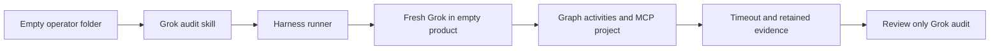

# Real Grok audit operator and hosted create — September 18, 2026

This was a real Grok operator launching a real Grok builder, not a mock run.
The attempt did **not** produce a verified game. Retain that distinction when
using these observations to change ShipLoop or the audit harness.

## Invocation and result

The operator started in an empty directory with `/shiploop-e2e-audit ttt-create`,
no `checkout=`, Grok 4.6, xhigh, default permissions, and a separate missing
product path. The harness created that physically empty product directory and
launched a fresh Grok process there with the literal `/shiploop` create prompt.
The selected audit card was a source symlink. Materialized marketplace packages
were tested separately with offline binding/execution checks; this live attempt
does not prove a marketplace installation was used.

| Observation | Retained result |
| --- | --- |
| Builder budget | 7200 seconds, 1000 turns; elapsed 7200.39568 seconds |
| Process | Timed out, exit -15; capture not truncated |
| Graph | Ten accepted activities: intake through prepare, then select-work, step-plan, test-spec |
| Work items | Zero of three completed; W-BOOT baseline Improve active |
| Product | Original product contained only Git metadata; no returned game |
| Real external effect | Nested MCP `create` succeeded for a dedicated Apps Script project |
| Hosted delivery | No verified game deployment, promotion, or hosted gameplay |
| Subject | Changed during execution; final package comparison found nine changed files |
| Runner verdict | `invalid-trial`, product `unverified`, lifecycle `unverified` |

The original operator exited zero after starting an asynchronous monitor, without
writing its audit. A separate **review-only** Grok 4.6/xhigh invocation inspected
the retained attempt and wrote `audit/WORKFLOW-REVIEW.md`,
`audit/workflow-review.json`, and `audit/validation.json`. It did not resume or
retry the builder. The review process exited zero after 597.479843 seconds;
validation returned `supported-gap` with `errors: []`. Validation checks
declarations and pinned references, not the semantic truth of the review.

The review's `reviewed_at` value is later than its captured process finish.
Use captured process/event times for chronology; preserve the original review
instead of silently correcting it. The card now requires an observed clock.

## What the evidence does and does not establish

The runner captured parent tool calls, while installed ShipLoop launched nested
Grok through `shiploop drive`. Durable navigator state accepted ten activities,
but the parent event stream contained zero matching completion callbacks. This
is an observation gap, not evidence that no nested actions happened. The Grok
review correctly describes this limit within the runner's trial folder.
Separate public native-event retention confirms the nested MCP project creation
and native session metadata selected Grok 4.6/xhigh. It does not establish every
delegated reviewer's settings, a deployment, or hosted gameplay.

For the first seven preparation stages, fourteen completed context-host turns
recorded 26.92 minutes producing artifacts and 61.41 minutes reviewing them.
Review consumed 69.5% of those paired wall-clock seconds. This single attempt had
subject drift; it supports measuring review overhead, not removing review gates.
Streaming usage counters were not summed into an invented cost.

The original timeout stopped its captured process group but left detached
descendants alive. External cleanup used previously observed process identity
records and stopped those verified groups after the cap; no verified owned
process remained. That intervention is distinct from the original runner's
`isolation: pass`, which describes source/control isolation, not process cleanup.
The cleanup receipt started at 21:21:08 UTC, after builder exit at 21:20:06 UTC.

The frozen literal prompt requested create/deploy/publish, without naming
production promotion. The model's staging interpretation is not prompt drift.
Future catalog prompts explicitly require stage then guarded production
promotion to match the verifier. Old prompts and results remain immutable.

## Bounded changes and follow-up

- **Operator completion:** require native task-ID waiting, then review before a
  final response. A separate real Grok probe launched a five-second job, called
  `get_command_or_subagent_output(..., timeout_ms=60000)`, observed job completion at
  21:31:08 UTC, and wrote an audit marker at 21:31:23 UTC. Exit zero in 44.926
  seconds. This proves the completion mechanism, not the corrected two-hour
  create-to-audit round trip; that full round trip has not been rerun.
- **Timeout cleanup:** snapshot descendant identities before parent termination,
  signal only attributable detached groups, bound cleanup time, and record gaps.
  Unknown children already reparented before observation remain unclaimed.
  Regression tests cover real detached processes, unrelated-process survival,
  reused identities, inherited output pipes, and exhausted cleanup budgets.
- **Feature verification:** require cumulative hosted behavior on each current
  deployment. A new feature passing alone cannot hide a broken predecessor.
- **ShipLoop experiments:** retain sanitized child callback receipts bound to
  run/thread/turn; measure stage and review time on a frozen version; distinguish
  a required-but-blocked browser check from delivery success. Do not weaken
  review or return unfinished work automatically on this evidence alone.

Do not use this create as a feature baseline. No automatic builder retry was
performed. No generated game or marketplace release is claimed.

## Local evidence locators

These retained runtime artifacts are outside the source tree and are not shipped
inside the marketplace package. They may not exist on another machine.

- Real attempt root: `/Users/dadleet/tmp/shiploop-grok-hosted-audit-jow4mxib`.
  Inspect `trial/{manifest.json,result.json,prompt.txt,capture/,audit/}`;
  `operator-result.json` and `review-operator-result.json` distinguish the two
  real audit operator invocations.
- Supplementary public observations under that root:
  `codex-observations/mcp-create-public-events.json`,
  `nested-model-selection.json`, `preparation-timing.json`, and
  `deadline-cleanup/cleanup.json`. The latter three also live under
  `codex-observations/`.
- Native wait probe: `/Users/dadleet/tmp/grok-native-wait-probe.cwZBnn`, with
  `operator-result.json`, `grok.stdout.jsonl`, and `empty-cwd/audit-marker.json`.
- Exact pre-change audit apparatus copy: the real attempt root's
  `frozen-audit-package/` and `frozen-audit-package-manifest.json`.

Raw output, product trees, native session stores, and process captures remain
external. Do not copy private model reasoning or credentials into source reports.
