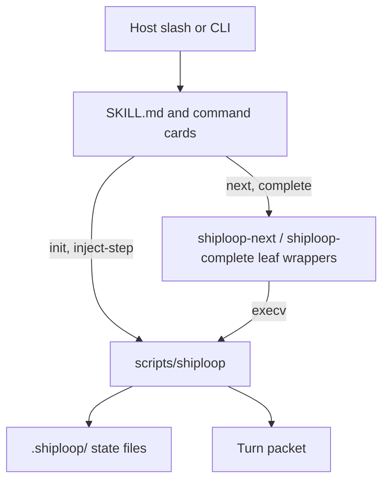
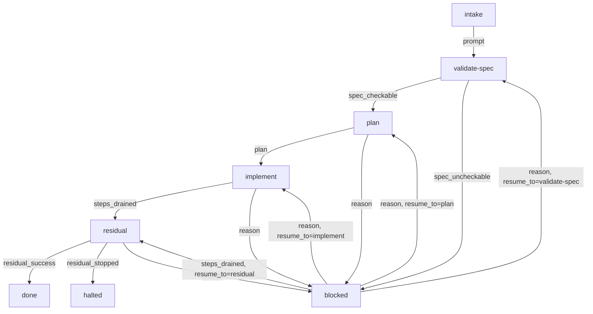
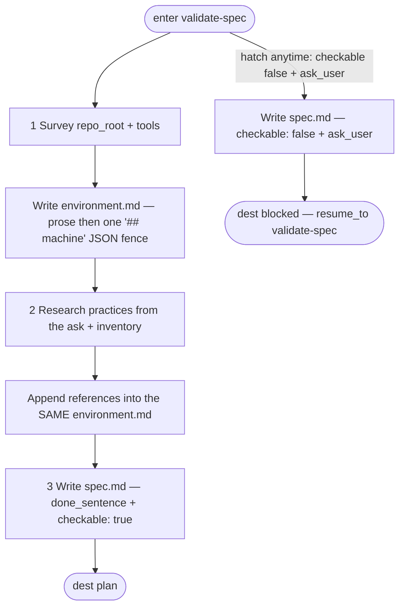
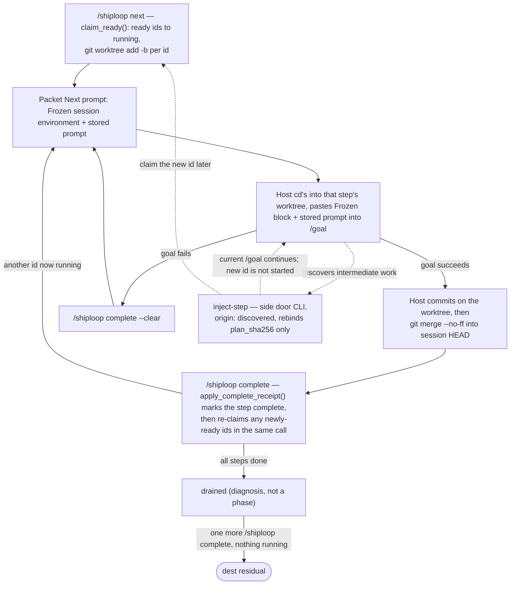
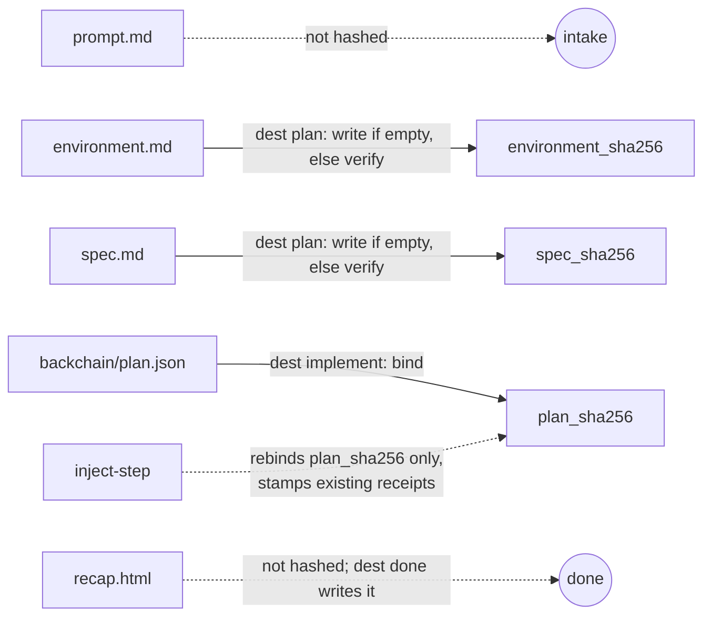

# ShipLoop

**Ship the project.** One session harness: survey the bound repo and tools,
researches applicable practices into `environment.md`, freeze a checkable spec,
sequence-plan once, then walk ready steps until the work is landed and a
walk-back HTML recap exists.

ShipLoop never auto-merges and never claims engine `COMPLETE`.

Package leaf: `skills/shiploop`. Invoke: `/shiploop`. Version: **0.8.5**.

Canonical companions (do not duplicate their contracts here):

- [SKILL.md](SKILL.md) — host procedure
- [references/state-files.md](references/state-files.md) — SoT table and hashes
- [references/survey.md](references/survey.md) — survey + practices prefix
- [references/turn-packet.md](references/turn-packet.md) — packet headings
- [references/transitions.json](references/transitions.json) — legal phase edges
- skill-craft [docs/LOOP-ENGINEERING.md](../../docs/LOOP-ENGINEERING.md) — ShipLoop track

---

## How the pieces interact

```text
User / host
    │
    ├─ /shiploop            → commands/shiploop.md
    │                           exec scripts/shiploop init? then next
    ├─ /shiploop next       → commands/shiploop-next.md
    │                           exec scripts/shiploop-next
    │                           → execv scripts/shiploop next
    ├─ /shiploop complete   → commands/shiploop-complete.md
    │                           host commit+merge if this was a /goal
    │                           exec scripts/shiploop-complete
    │                           → execv scripts/shiploop complete
    └─ inject-step          → commands/shiploop-inject.md
                                exec scripts/shiploop inject-step
```

| Layer | Lives in | Role |
|-------|----------|------|
| **Skill card** | `SKILL.md` | When to use, three-branch init, echo You are here |
| **Slash / command cards** | `commands/shiploop.md`, `shiploop-next.md`, `shiploop-complete.md`, `shiploop-inject.md` | Thin host verbs. They do not implement the SM. |
| **Leaf wrappers** | `scripts/shiploop-next`, `scripts/shiploop-complete` | Refuse the wrong subcommand, then `execv` the harness |
| **Harness (stateless printer)** | `scripts/shiploop` | The only SM. Reads `.shiploop/`, checks hashes, claims steps, prints the packet. Does **not** invent implement `/goal` text. |
| **Activity prompts** | `references/activities/<phase>.md` | Exact Next-prompt body for every phase except in-flight implement (that prints each step’s stored `prompt`) |
| **Survey / packet / ledger contracts** | `references/survey.md`, `turn-packet.md`, `ledger-contract.md`, `state-files.md` | What the host must write; what the script shape-checks |
| **Sibling skills** | `dep_roots.backchain`, `dep_roots.review-coverage` | Plan calls **backchain** once. Residual calls **review-coverage** Phase B. Missing backchain is a Missing line, not a vendored copy. |

The harness is **file-driven**. After `init`, every command walks from cwd to
`.shiploop/`, loads `state.json`, re-checks frozen hashes, then either mutates
one artifact and reprints the packet, or refuses (exit 2). It does not call
host MCP APIs. It does not write the product tree except by creating per-step
git worktrees under `<repo>/.worktrees/`.



**What this is:** the four routes from the ASCII list above, collapsed to
one picture. `init` and `inject-step` call the harness directly; only
`next` and `complete` pass through a leaf wrapper first (`refuse` the wrong
subcommand, then `execv`). The packet is a printout — implement and
residual may paste into `/goal`, but that is host work after the packet,
not a fifth route and not what every phase does. **What this is not:**
there is no second SM between the wrapper and the harness —
`scripts/shiploop` is the only state machine in this package.

---

## Exhaustive workflow

Phases (from `transitions.json`; there is **no** `survey` / `setup` / `inject`
phase):

`intake → validate-spec → plan → implement → residual → done`
(or `halted` from residual). Every working phase after intake can dest `blocked`.



**What this is:** every legal edge in `references/transitions.json`, the
only phase list the script (`PHASES` / `forward_dest` / `legal_edge`) knows.
**What this is not:** there is no `survey`, `setup`, `initiation`, or
`inject` box — those are jobs/CLI verbs inside `validate-spec` and
`implement`, not phases. `blocked` can resume to exactly the phase named in
`state.resume_to` (`apply_update` refuses any other resume target); the four
`blocked → *` edges above are the only four legal resumes.

### 0. Start or resume (three-branch init)

| Situation | Command |
|-----------|---------|
| No `.shiploop/state.json` | `python3 "$CLI" init --prompt "…" --repo PATH` (run dir defaults to `PATH/.shiploop`) |
| **New ask** on an existing run | `init --force --prompt "…" --repo PATH` (refused if `--prompt` is empty — **before** any wipe) |
| Lost context, **same** ask | `/shiploop next` (no `--force`) |
| Phase is `blocked` | Read `ask_user` / `resume_to`, then `/shiploop complete --reason "…"` |

`--force` wipes **session** files (`environment.md`, `spec.md`, DAG, receipts,
`recap.html`, leftover json twins). It does **not** delete the product tree
(app sources, product `README.md`).

`--implementer host` is the only legal implementer. `init --repo PATH`
without `--run-dir` writes `PATH/.shiploop`, not `$PWD/.shiploop`.

### 1. Intake

Host writes the original ask to `.shiploop/prompt.md` (non-empty). No
`done_sentence` yet. Closer: `/shiploop complete` → dest `validate-spec`
(`need: prompt`).

### 2. Validate-spec — survey, then practices, then spec

One phase, **three jobs in order**. Guide: `references/survey.md`. Activity:
`references/activities/validate-spec.md`.

1. **Survey** the bound `repo_root` and this session’s tools. Write **one**
   file, `.shiploop/environment.md`: prose brief, then a unique H2 titled
   exactly `machine` with one fenced JSON object. Keys: `kind`, `augment`,
   `references`, `tools`, `mcp`, `mcp_considered`, `handles`, `initiation`,
   `ui`, `ui_craft`. **IF EXISTS** read product `README.md`, ADRs, CI,
   `AGENTS.md`, leftover `.specify/memory/constitution.md` — cite, do not
   invent. Do **not** write the product README here.
2. **Research practices** from the ask + that inventory. Pull URLs, in-repo
   paths, official docs, skill references, MCP resource URIs. If an MCP
   server or its tools **document how to use them**, that text is a
   reference — inventory alone is not enough. Append into the **same**
   `environment.md` (`references[{path, why}]`). No second SoT file. No
   secrets. No research skills in `dep_roots`.
3. **Write spec** `.shiploop/spec.md`: labeled `done_sentence:` and
   `checkable: true|false` exactly once at line start, outside fences. The
   spec’s **final product duty** is a README create (absent) or revise
   (present) — as a late DAG step in **plan**, not a validate-spec write.
   While expanding the spec, also answer: deploy preparation before the
   walk (yes/what or none); deploy/publish after the walk (**outer-loop**,
   **dag**, or **none**); and whether residual should run a `/goal`
   quality test-and-fix pass on outer-loop completion.



**What this is:** the three jobs inside **one** SM phase, in the order
`validate-spec.md` / `survey.md` require (survey → practices → spec).
`dest plan` is what `load_environment()` / `load_spec()` /
`handles_block_plan()` gate. `dest blocked` is the hatch (`forward_dest`
returns `"blocked"` when `checkable is False`) and does **not** require
`environment.md` — that is why the hatch is drawn from enter, not after
`envAppend`. **What this is not:** survey and practices are not separate
phases or a second SoT file — both write into the same `environment.md`.
A `list`/`ask` handle does **not** auto-dest `blocked`; it fails `dest
plan` unless the host uses this hatch (`create` is dest-plan-legal).

**Blocked hatch (no new edges):** if a handle/UI question must be asked first,
write `spec.md` with `checkable: false` and `ask_user:`, then dest `blocked`
(`need` stays `spec_uncheckable`). dest blocked does not require
`environment.md`. dest **plan** requires a checkable spec, `environment.md`
shape, and no handle still `list` or `ask`. `create` is dest-plan-legal.

### 3. Plan

Spec and environment are **frozen**. Host calls sibling **backchain** once
and persists the DAG at `.shiploop/backchain/plan.json`. Every seed step
must have:

- `statement` — short diagnosis label
- `prompt` — **exact** inner-loop paste body (newlines OK; no other control characters)
- `produces` / `inputs` / `origin: seed`

Each seed `prompt` must cite every `references[].path` from `environment.md`,
and end with a `Tools:` block (Watch with / Use /
Don't use / Assume) that includes the frozen `mcp_considered` token. Include prep / intermediate deploy / cleanup when implied,
and a **README create/revise as a late successor**. The spec's three
placement answers decide which of those fire: deploy preparation *is* the
early prep step; **dag** publish *is* the deploy step; **outer-loop**
publish and a quality `/goal` stay out of the DAG (residual owns them).
Then write `plan.md` with a labeled `done_sentence` that equals the spec.
Do not write a `plan.json` wrapper; leftover wrappers are inert.

dest `plan` **writes** `environment_sha256` / `spec_sha256` when empty (first
bind) and **verifies** them when set. It always clears `plan_sha256` and
receipts (replan hatch).

While `backchain/plan.json` is not written yet, the packet dest is
`implement` (Missing lists the plan files; When done invoke is
`/shiploop complete`). dest `blocked` is only for a **written** illegal
DAG — not the empty start of plan. dest `implement` also requires a git
`HEAD` so worktrees can fork; an empty repo needs an initial commit first.

### 4. Implement

`/shiploop next` (and complete after a step) **claims** newly ready ids
`running` and creates `shiploop/<run_id>/<id>` worktrees under
`<repo>/.worktrees/` (hidden via `.git/info/exclude`).

**Next prompt** always starts with `Use this prompt as much as possible.`
Then the harness prints worktree / branch / HOST FLAG, a **Frozen session
environment** block (`mcp-considered` / `tools` / `mcp`), then each
**running** step’s stored `prompt` **verbatim**. Paste the Frozen block
together with the stored prompt into host `/goal`. Do not paste worktree,
branch, or HOST FLAG. The script does not compose a `/goal` from
`statement` / `produces` / suppliers / worktree. `cd` to the worktree
named in Look here; do not edit the session checkout.

Inner loop (host, not a phase): green-first or TDD (failing test first),
prefer `/goal`, then a verbose pathspec commit that records a **learning**.
Never `git add -A`.

When the `/goal` is done: **you** commit on the worktree and merge the kept
branch into the session checkout (`git merge --no-ff`). Then
`/shiploop complete`. The next worktree forks `HEAD`. ShipLoop does not
auto-merge. Failure: `--clear`. Hard stop: `--blocked --reason`.

**inject-step** (phase implement only, including drained): add a discovered
intermediate without dest `plan` (that would wipe receipts). Requires
`--statement`, `--prompt`, `--produces`. Pre-image: DAG bytes must still
hash to `state.plan_sha256`. `--before` is `todo` or `ready` only; appends
`{need: produces, from: new id}`. Write order: DAG → receipts → state last.
Then `/shiploop next`.

When every step is `done`, implement is **drained** (a diagnosis, not a
phase). Next complete dests `residual`.



**What this is:** the loop `apply_complete_receipt` / `claim_ready` /
`create_step_worktree` actually run, plus `inject-step` as a CLI call inside
implement (dashed — it is a mid-loop side door, not a state or a second
phase). `complete`'s own `claim_and_print()` re-runs `claim_ready()` before
printing, so a completed step's newly-ready dependents are claimed and
printed in that **same** `/shiploop complete` call. `--clear` also
`claim_and_print()`s (the cleared id is ready again and is re-claimed in
that same call). `inject-step` does **not** claim the new id — that is the
one case that still needs `/shiploop next` (or the next `complete`) to
`claim_ready()`. Otherwise a separate `/shiploop next` is only a reprint
after lost context.
Draining takes **two** `/shiploop complete` calls: one completes the last
running step, a second (with nothing running) is the one that dests
`residual` — `implement-drained.md` says this explicitly: *"ShipLoop does not
auto-`--to residual` when the last step completes."* **What this is not:**
there is no auto-merge (`complete` refuses a branch that is not yet an
ancestor of `HEAD`) and no nested `/goal` inside implement's `/goal`.

### 5. Residual

Session closer only. dest `residual` binds an empty `bound_plan` to
`.shiploop/plan.md` (then repo `PLAN.md`) when that file has
`## Review Coverage`; otherwise it fails closed — do not wait for dest
`done`. Run review-coverage Phase B for the bound plan under `/goal`
(one `/review-converge` per turn). Ledger: repo-root `REVIEW_CONVERGE.md`.
Do not treat a foreign or unlanded ledger as success.

When the ledger is `complete` and landed (or the plan has a real residual
waiver), do only what the frozen spec named: a `/goal` quality test-and-fix
pass if it said yes (skip if no), then **outer-loop** deploy/publish if it
said outer-loop (skip if dag or none), then dest `done`. A real waiver
changes Diagnosis / Progress from “run Phase B” to “residual waived —
quality/publish then dest done”, and Next prompt uses `residual-waived.md`
instead of `residual.md`. When the ledger
is `stopped (...)`, dest `halted`. Those dests write `.shiploop/recap.html`
from the run files after the dest event is appended to `history.jsonl`.
The recap's **Verified** section reports review-coverage (complete+landed,
waived, or stopped) and states that quality `/goal` and outer-loop publish
are host-owned — dest done does not witness them and does not treat the
frozen `done_sentence` as harness-verified. Do not hand-author the recap.

### 6. Done (or halted)

`recap.html` is the harness-written walk-back for someone who left and came
back. It opens as a reveal of **key accomplishments** and a diagram of
**implementation outcomes**, then **intent, original spec, materially
changed, end result, outcome, verified**. dest `done` refuses a missing,
empty, non-HTML, or briefing-thin file. `--force` unlinks it. The file is
**not** hashed.

---

## The turn packet

Every `next`, `complete`, and slash reprint prints this order after the
banner `shiploop — session harness`:

| H2 | What it is |
|----|------------|
| **You are here** | Session rail + phase lines, then (in implement) a walk rail of each step's statement and `todo` / `ready` / `running` / `done`. Then Diagnosis. |
| **Progress** | HOST FLAG (extra worktree folder — do not re-root), then begin/finish this phase or running step: worktree folder, branch, session checkout, what complete does next. |
| **Reminder** | Ask one-liner + frozen `done_sentence`. No body dump. |
| **Look here** | First line `Reference only — not the next action.` Phase-scoped paths only. |
| **Next prompt** | First line `Use this prompt as much as possible.` Implement: Frozen session environment, then the stored prompt. Other phases: the activity file. |
| **When done invoke** | `invoke /shiploop complete` (plus `--clear` / `--blocked` when that is the hatch). |
| **Missing** | Same gaps `update` would refuse. |

Look-here matrix (absolute path + one-line why):

| Phase | Pointers |
|-------|----------|
| intake | `state.json`, `prompt.md` (create), activity |
| validate-spec | prompt, `environment.md` (`1. survey —` write-first / `load_environment` gaps / written), `survey.md`, `spec.md` (`2. spec —` after env / `load_spec` gaps / written), `state.json` |
| plan | frozen spec + environment, `backchain/plan.json` (create), `plan.md` (create), backchain SKILL |
| implement | frozen spec, DAG, required `environment.md` (frozen survey), running `steps/<id>.json` + worktree, activity; `plan.md` if-needed |
| implement-drained | spec, DAG, `implement-drained.md` |
| residual | ledger, bound plan, spec, review-coverage SKILL, `recap.html` (written at dest done) |
| done | `recap.html`, spec |
| blocked | `state.json` (ask/reason/resume), activity |

---

## State files (how they maintain the run)

Everything below is under the **run dir** (default: walk from cwd to
`.shiploop/`). Never inside this package. Detail:
[references/state-files.md](references/state-files.md).

| File | Who writes | What it is SoT for |
|------|------------|--------------------|
| `state.json` | every harness command | phase, `run_id`, `repo_root`, hashes, `dep_roots`, blocked/resume, bound plan, `terminal` (review-coverage close mode: `success` / `waived` / `halted`) |
| `prompt.md` | `init` | original ask |
| `environment.md` | host during validate-spec | survey + practices (prose + `## machine` JSON). Hashed as the whole file. |
| `spec.md` | host during validate-spec | labeled `done_sentence` / `checkable` / optional `ask_user`. Hashed as the whole file. |
| `backchain/plan.json` | host during plan; `inject-step` mutates | canonical DAG (`statement`, `prompt`, `produces`, `inputs`, `origin`) |
| `plan.md` | host during plan | human sequence + labeled `done_sentence` (must equal spec.md at dest implement; not hashed, so a later edit does not fail-closed; may lag the DAG after inject) |
| `steps/<id>.json` | `start-step` / complete / inject stamp | receipt: `running` or `complete`, worktree, branch, `plan_sha256` |
| `history.jsonl` | every command | append-only event log |
| `recap.html` | dest done / dest halted | walk-back briefing from run files (not hashed) |

There is **no** `environment.json`, `spec.json`, `implement.json`, or
host-authored `plan.json`. Leftover `plan.json` wrappers are inert;
`init --force` still unlinks them.

**Same sentence, three surfaces (not three SoTs):** labeled `done_sentence` in
`spec.md` ≡ labeled line in `plan.md` ≡ `backchain.goal`. dest implement
refuses drift. `plan.md` is not hashed, so editing it after dest implement
does not fail-closed on `next`.

**Hashes**

- `environment_sha256 = sha256(environment.md)`
- `spec_sha256 = sha256(spec.md)`
- `plan_sha256 = sha256(backchain/plan.json)` (plan.md unhashed)



**What this is:** the three real hashes and what binds/clears them. **What
this is not**: `plan_sha256` clears on `dest plan` (replan hatch) and rebinds
only on `dest implement` or `inject-step` — it does not track `environment.md`
or `spec.md`, which is why editing either after bind requires
`blocked → validate-spec` to clear all three. Two grandfather cases keep old
runs from wedging: an **empty** `environment_sha256` is skipped by
`check_frozen_hashes` (`if env_h`) until `dest plan` writes it via
`bind_or_verify_hash` (pre-0.7 run, or a run that never reached `dest plan`);
a **leftover** `spec.json` twin is still accepted if the stored `spec_sha256`
equals the legacy pair hash `sha256(spec.md + \0 + spec.json)`, until
`blocked → validate-spec` clears the hashes and the next `dest plan` rebinds
to `sha256(spec.md)` alone. `recap.html` is never hashed — dest `done` /
`halted` write it from the run files, then dest `done` checks it is HTML
and has the briefing words (intent, original spec, accomplished, changed,
end result, outcome, verified).

After first bind, editing spec or environment requires `blocked → validate-spec`
(clears all three hashes and receipts). `inject-step` rebinds `plan_sha256`
only and stamps existing receipts so completed work stays done.

**Product `README.md`** is **not** session state. It lives in the bound repo.
Survey reads it; the last DAG step writes it. Never put machine keys, handles,
or secrets there. `--force` never deletes it.

---

## Session A vs Session B

| | Session A — greenfield | Session B — brownfield |
|---|---|---|
| `environment.md` | `kind: greenfield`, `augment: false` | `kind: brownfield`, `augment: true`; cites existing README and app paths |
| Product `README.md` | created as the **last** product DAG step | revised as the **last** product DAG step |
| `initiation` | often `needed` + a `create` handle | often `none` or `done` (inspect an existing container) |
| Everything else | same SM, hashes, worktrees, stored prompts | same |

Handles are tool-agnostic (list → inspect, or dest blocked). Google Apps
Script is an example, not a script branch.

---

## CLI (harness)

```sh
CLI="$SKILL_ROOT/scripts/shiploop"
python3 "$CLI" init --prompt "…" --repo PATH [--force] [--bound-plan PATH]
python3 "$CLI" next
python3 "$CLI" complete [--id ID] [--clear] [--blocked --reason TEXT] [--resume-to PHASE]
python3 "$CLI" update --to PHASE [--reason TEXT] [--resume-to PHASE]
python3 "$CLI" status [--human]
python3 "$CLI" start-step --id ID
python3 "$CLI" complete-step [--id ID]
python3 "$CLI" clear-step [--id ID]
python3 "$CLI" inject-step --statement "…" --prompt "…" --produces "…" \
  [--id Sn] [--need NEED --from ID] [--before ID ...]
```

Host verbs: `/shiploop`, `/shiploop next`, `/shiploop complete`. Those exec
the wrappers, which exec the harness. `complete-step` / `update --to` / `--id`
are overrides. `capture` always fails closed.

| Exit | Meaning |
|------|---------|
| 0 | Success |
| 2 | Blocked (illegal edge, missing artifact, hash drift, empty `--force`, missing prompt, …) |
| 64 | Usage |

---

## Not this product

| You want | Use |
|----------|-----|
| Offline freeze / prove / stop | `evidence-gates` |
| Residual×2 engine alone | `review-coverage` / `review-converge` |
| Sequence DAG authoring | sibling `backchain` (called from plan) |

---

## Install

From the skill-craft repo root:

```sh
./install.sh --skill shiploop
./scripts/sync-plugin-views.sh shiploop
```

If a host still has old `steer`, `steer-next`, or `steer-complete-next` skill
dirs, uninstall those and install `shiploop`. Old `.steer/` run dirs are not
adopted — start a new run (or rename the directory to `.shiploop` yourself).

---

## Tests

```sh
bash test/shiploop.test.sh
node test/skill-frontmatter.test.js
bash scripts/sync-plugin-views.sh --check
```

(`--check` may still fail on unrelated dirty plugin views.)
