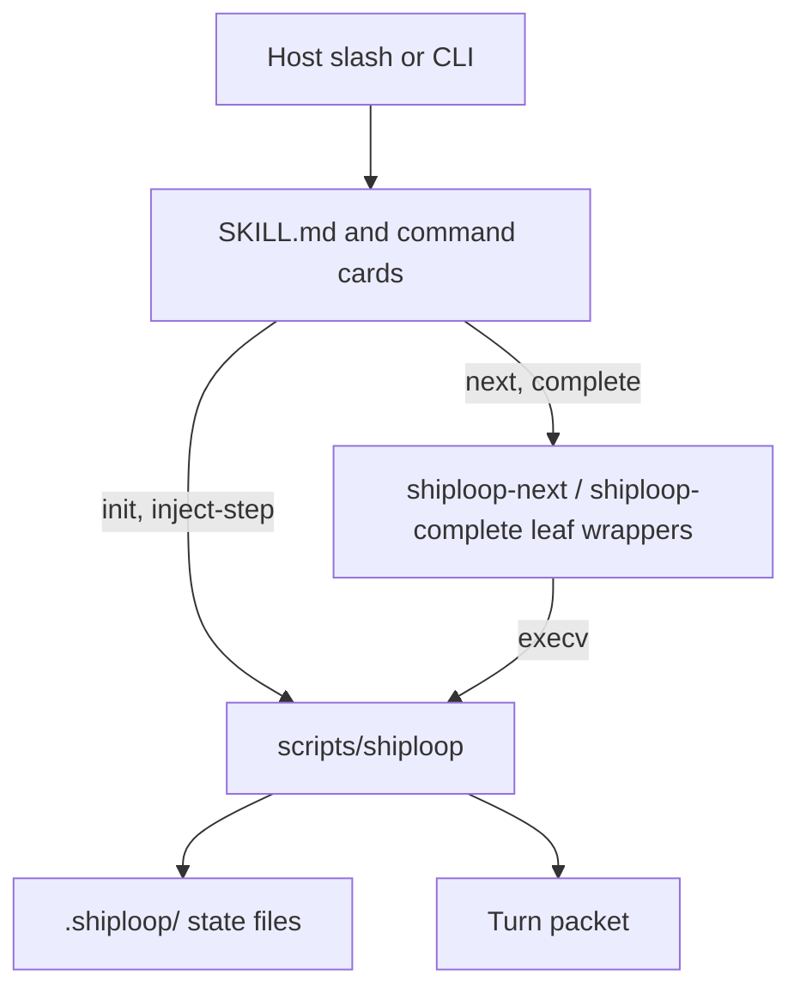
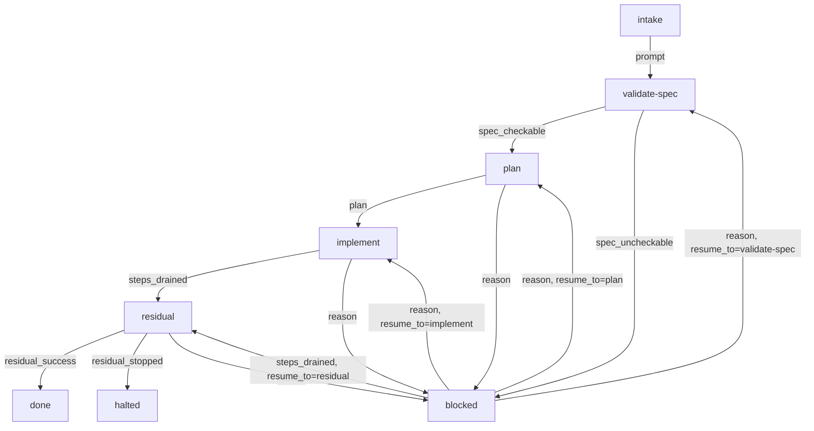
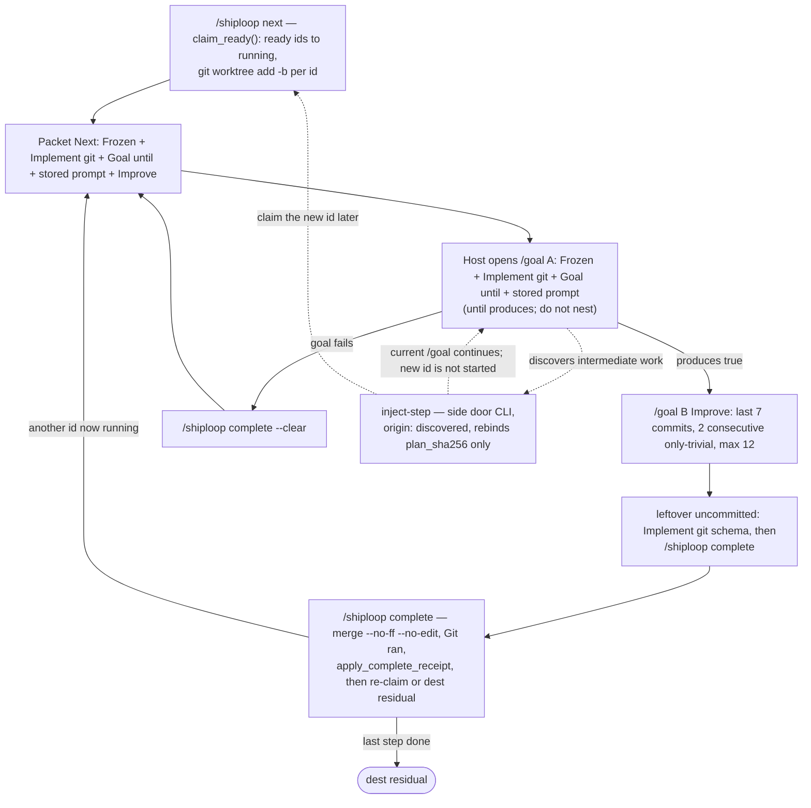
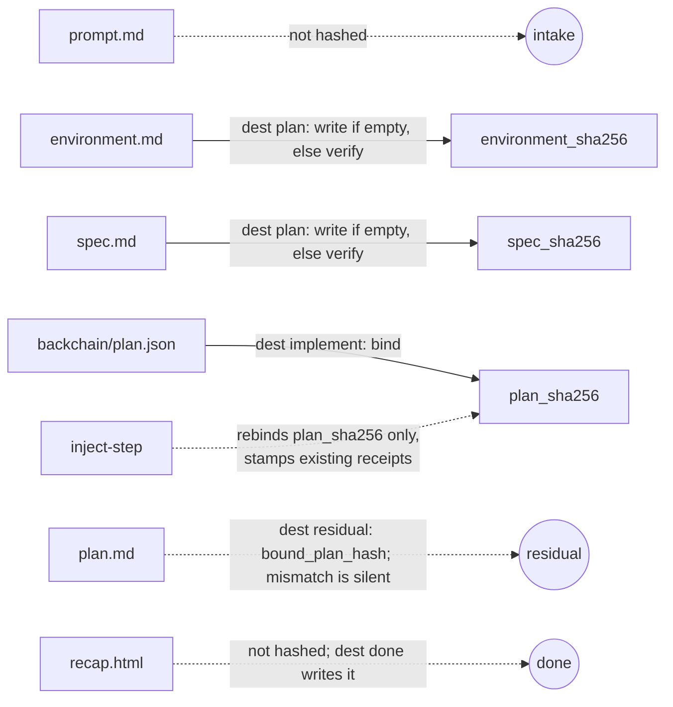

# ShipLoop

**Ship the project.** One session harness: survey the bound repo and tools,
researches applicable practices into `environment.md`, freeze a checkable spec,
sequence-plan once, then walk ready steps until the work is landed and a
walk-back HTML recap exists.

ShipLoop never conflict-resolves a merge and never claims engine `COMPLETE`.

Package leaf: `skills/shiploop`. Invoke: `/shiploop`. Version: **0.8.16**.

Canonical companions (do not duplicate their contracts here):

- [SKILL.md](SKILL.md) — host procedure
- [references/state-files.md](references/state-files.md) — SoT table and hashes
- [references/survey.md](references/survey.md) — survey + practices prefix
- [references/turn-packet.md](references/turn-packet.md) — packet headings
- [references/transitions.json](references/transitions.json) — legal phase edges
- skill-craft [docs/LOOP-ENGINEERING.md](../../docs/LOOP-ENGINEERING.md) — ShipLoop track

---

## How the pieces interact

```text
User / host
    │
    ├─ /shiploop            → commands/shiploop.md
    │                           exec scripts/shiploop init? then next
    ├─ /shiploop next       → commands/shiploop-next.md
    │                           exec scripts/shiploop-next
    │                           → execv scripts/shiploop next
    ├─ /shiploop complete   → commands/shiploop-complete.md
    │                           leftover commit if this was a /goal
    │                           exec scripts/shiploop-complete
    │                           → execv scripts/shiploop complete (merges)
    └─ inject-step          → commands/shiploop-inject.md
                                exec scripts/shiploop inject-step
```

| Layer | Lives in | Role |
|-------|----------|------|
| **Skill card** | `SKILL.md` | When to use, three-branch init, echo You are here |
| **Slash / command cards** | `commands/shiploop.md`, `shiploop-next.md`, `shiploop-complete.md`, `shiploop-inject.md` | Thin host verbs. They do not implement the SM. |
| **Leaf wrappers** | `scripts/shiploop-next`, `scripts/shiploop-complete` | Refuse the wrong subcommand, then `execv` the harness |
| **Harness (stateless printer)** | `scripts/shiploop` | The only SM. Reads `.shiploop/`, checks hashes, claims steps, prints the packet. Does **not** invent implement `/goal` text. |
| **Activity prompts** | `references/activities/<phase>.md` | Exact Next-prompt body for every phase except in-flight implement (that prints each step’s stored `prompt`) |
| **Survey / packet / ledger contracts** | `references/survey.md`, `turn-packet.md`, `ledger-contract.md`, `state-files.md` | What the host must write; what the script shape-checks |
| **Sibling skills** | `dep_roots.backchain`, `dep_roots.review-coverage` | Plan calls **backchain** once. Residual calls **review-coverage** Phase B. Missing backchain is a Missing line, not a vendored copy. |

The harness is **file-driven**. After `init`, every command walks from cwd to
`.shiploop/`, loads `state.json`, re-checks frozen hashes, then either mutates
one artifact and reprints the packet, or refuses (exit 2). It does not call
host MCP APIs. It does not write the product tree except by creating per-step
git worktrees under `<repo>/.worktrees/`.



**What this is:** the four routes from the ASCII list above, collapsed to
one picture. `init` and `inject-step` call the harness directly; only
`next` and `complete` pass through a leaf wrapper first (`refuse` the wrong
subcommand, then `execv`). The packet is a printout — implement and
residual may paste into `/goal`, but that is host work after the packet,
not a fifth route and not what every phase does. **What this is not:**
there is no second SM between the wrapper and the harness —
`scripts/shiploop` is the only state machine in this package.

## How skill logic works

The host chat is not the controller (clear, compact, model swap). After
`init`, every turn is:

```text
invoke /shiploop (or next / complete)
  → scripts/shiploop is the only SM
  → read .shiploop/, check hashes, maybe claim a step
  → print one turn packet
  → host does only the Next prompt
  → invoke /shiploop complete (or next if context was lost)
```

`SKILL.md` is when to use, three-branch init, and “echo You are here.”
Command cards are thin verbs. Leaf wrappers refuse `update` / the wrong
subcommand, then `execv` the harness. Activity files are the exact
Next-prompt body for every phase **except** in-flight implement (that
prints each running step’s stored DAG `prompt` plus a Frozen session
environment reprint). The harness does not invent implement `/goal` text.

**Two printed channels (not the same mechanism).** Look here is **not interpolated**.
Next **is interpolated** except in-flight implement (stored `prompt` verbatim).
Activity Next bodies must not use packet-level H2 (`## `); Next is bounded
by the next packet H2 (`## When done invoke`). Jobs inside the body use
`###` or below.

| Channel | First line | How files get in |
|---------|------------|------------------|
| **Look here** | `Reference only — not the next action.` | **not interpolated.** `kind  abs-path  why`. `survey.md` has no `{{tokens}}` (they would print raw). |
| **Next prompt** | `Use this prompt as much as possible.` | **is interpolated** (`activity_body` mapping) except in-flight implement, which prints the stored `prompt` **verbatim**. |

**Missing** is dest-scoped: `missing_for(state, run_dir, forward_dest())`.
That is the same function `update --to` uses, **not** the same dest on
every reprint. In-flight implement (`forward_dest` is `None`) lists
`dep_roots.backchain` only — it does **not** run `load_environment` /
`load_spec` / `wrapper_pair` / `dag_gaps`. dest `plan` runs
`load_spec` / `load_environment` / `handles_block_plan` / `exclusive_gaps`. dest
`implement` runs `wrapper_pair` / `dag_gaps` / backchain / git `HEAD`.
Look-here independently reprints those load_* / `wrapper_pair` why
strings even when Missing is empty. Those Look-here lines are the
“fields marked done,” not host-authored `survey: done` markers.

**Siblings:** plan calls **backchain** once (`dep_roots.backchain`).
Residual calls **review-coverage** Phase B. Missing backchain is a
Missing line, not a vendored copy. `scripts/shiploop` is the only SM.
complete merges (`--no-ff --no-edit`); it does not resolve conflicts.
No engine `COMPLETE`. Git command split:
[Git sequence (harness vs host)](#git-sequence-harness-vs-host).

---

## Exhaustive workflow

Phases (from `transitions.json`; there is **no** `survey` / `setup` / `inject`
phase):

`intake → validate-spec → plan → implement → residual → done`
(or `halted` from residual). Every working phase after intake can dest `blocked`.



**What this is:** every legal edge in `references/transitions.json`, the
only phase list the script (`PHASES` / `forward_dest` / `legal_edge`) knows.
**What this is not:** there is no `survey`, `setup`, `initiation`, or
`inject` box — those are jobs/CLI verbs inside `validate-spec` and
`implement`, not phases. `blocked` can resume to exactly the phase named in
`state.resume_to` (`apply_update` refuses any other resume target); the four
`blocked → *` edges above are the only four legal resumes.

### 0. Start or resume (three-branch init)

| Situation | Command |
|-----------|---------|
| No `.shiploop/state.json` | `python3 "$CLI" init --prompt "…" --repo PATH` (run dir defaults to `PATH/.shiploop`) |
| **New ask** on an existing run | `init --force --prompt "…" --repo PATH` (refused if `--prompt` is empty — **before** any wipe) |
| Lost context, **same** ask | `/shiploop next` (no `--force`) |
| Phase is `blocked` | Read `ask_user` / `resume_to`, then `/shiploop complete --reason "…"` |

`--force` wipes **session** files (`environment.md`, `spec.md`, DAG, receipts,
`recap.html`, leftover `playbook.md`, leftover json twins). It does **not** delete the product tree
(app sources, product `README.md`).

`--implementer host` is the only legal implementer. `init --repo PATH`
without `--run-dir` writes `PATH/.shiploop`, not `$PWD/.shiploop`.

### 1. Intake

Host writes the original ask to `.shiploop/prompt.md` (non-empty). No
`done_sentence` yet. Closer: `/shiploop complete` → dest `validate-spec`
(`need: prompt`).

### 2. Validate-spec — survey, then practices, then spec

One phase, **three jobs in order**. Guide: `references/survey.md`. Activity:
`references/activities/validate-spec.md`.

1. **Survey** the bound `repo_root` and this session’s tools. Write **one**
   file, `.shiploop/environment.md`: prose brief, then a unique H2 titled
   exactly `machine` with one fenced JSON object. Keys: `kind`, `augment`,
   `references`, `tools`, `mcp`, `mcp_considered`, `exclusive`, `handles`, `initiation`,
   `ui`, `ui_craft`. **IF EXISTS** read product `README.md`, ADRs, CI,
   `AGENTS.md`, leftover `.specify/memory/constitution.md` — cite, do not
   invent. Do **not** write the product README here.
2. **Research practices** from the ask + that inventory. Pull URLs, in-repo
   paths, official docs, skill references, MCP resource URIs. If an MCP
   server or its tools **document how to use them**, that text is a
   reference — inventory alone is not enough. Deeply research those MCP
   servers and destination services (schemas, resources, docs) for style,
   library, module format, or behavior; record overt findings in
   `references[{path, why}]`. **Reuse before add:** search bound `repo_root`
   **and** the destination; do not duplicate, conflict with, or arbitrarily
   add a new library for the same job. Answer exclusive-writer /
   overlapping-tool / library / enablement questions (conflicts, not as backups). Fold
   the named writer's libraries, file/runtime layout, and platform preconditions
   into the **same**
   `environment.md` (`references[{path, why}]`). Probe enablement before an
   `initiation: needed` create. In-bounds `tools`/`mcp` means dest-writes can
   succeed now (or a `create` handle will enable them). Failed enablement is
   dest blocked; do not omit `exclusive[].use` from those lists. When `exclusive` is nonempty,
   `references` must be nonempty. Do not write `playbook.md`. Do not invent a
   Writer playbook heading. No secrets. No research skills in `dep_roots`.
   If the writer above fails, stop and invoke /shiploop complete --blocked --reason … — do not switch writers.
3. **Write spec** `.shiploop/spec.md`: labeled `done_sentence:` and
   `checkable: true|false` exactly once at line start, outside fences. The
   spec’s **final product duty** is a README create (absent) or revise
   (present) — as a late DAG step in **plan**, not a validate-spec write.
   While expanding the spec, also answer: deploy preparation before the
   walk (yes/what or none); deploy/publish after the walk (**outer-loop**,
   **dag**, or **none**); and whether residual should run a `/goal`
   quality test-and-fix pass on outer-loop completion.


**What this is:** the three jobs inside **one** SM phase, in the order
`validate-spec.md` / `survey.md` require (survey → practices → spec).
`dest plan` is what `load_environment()` / `load_spec()` /
`handles_block_plan()` / `exclusive_gaps()` gate. `dest blocked` is the hatch (`forward_dest`
returns `"blocked"` when `checkable is False`) and does **not** require
`environment.md` — that is why the hatch is drawn from enter, not after
`envAppend`. **What this is not:** survey and practices are not separate
phases or a second hashed SoT — both write into the same `environment.md`.
Do not write `playbook.md`.
A `list`/`ask` handle does **not** auto-dest `blocked`; it fails `dest
plan` unless the host uses this hatch (`create` is dest-plan-legal).

**Blocked hatch (no new edges):** if a handle/UI question must be asked first,
write `spec.md` with `checkable: false` and `ask_user:`, then dest `blocked`
(`need` stays `spec_uncheckable`). dest blocked does not require
`environment.md`. dest **plan** requires a checkable spec, `environment.md`
shape, and no handle still `list` or `ask`. `create` is dest-plan-legal.

### 3. Plan

Spec and environment are **frozen**. Host calls sibling **backchain** once
and persists the DAG at `.shiploop/backchain/plan.json`. Survey already
exercised handles before the machine fence. Native backchain is draft →
dependency review → resolve → elaborate; do not audit the persisted DAG for
new experiments. Every seed step must have:

- `statement` — short diagnosis label
- `prompt` — **exact** inner-loop paste body (newlines OK; no other control characters)
- `produces` / `inputs` / `origin: seed`

Each seed `prompt` must cite every `references[].path` from `environment.md`,
and end with a `Tools:` block (Watch with / Use /
Don't use / Assume) that includes the frozen `mcp_considered` token and each
`exclusive[].dont_use` token. Include prep / intermediate deploy / cleanup when implied,
and a **README create/revise as a late successor**. The spec's three
placement answers decide which of those fire: deploy preparation *is* the
early prep step; **dag** publish *is* the deploy step; **outer-loop**
publish and a quality `/goal` stay out of the DAG (residual owns them).
Then write `plan.md` with a labeled `done_sentence` that equals the spec.
Do not write a `plan.json` wrapper; leftover wrappers are inert.

dest `plan` **writes** `environment_sha256` / `spec_sha256` when empty (first
bind) and **verifies** them when set. It always clears `plan_sha256` and
receipts (replan hatch).

While `backchain/plan.json` is not written yet, the packet dest is
`implement` (Missing lists the plan files; When done invoke is
`/shiploop complete`). dest `blocked` is only for a **written** illegal
DAG — not the empty start of plan. dest `implement` also requires a git
`HEAD` so worktrees can fork; an empty repo needs an initial commit first.

### 4. Implement

Command-level git (who runs `git worktree add` vs `merge --no-ff --no-edit`):
[Git sequence (harness vs host)](#git-sequence-harness-vs-host).

`/shiploop next` (and complete after a step) **claims** newly ready ids
`running` and creates `shiploop/<run_id>/<id>` worktrees under
`<repo>/.worktrees/` (hidden via `.git/info/exclude`).

**Next prompt** always starts with `Use this prompt as much as possible.`
Then the harness prints worktree / branch / HOST FLAG, a **Frozen session
environment** block (`mcp-considered` / `tools` / `mcp` / `Exclusive:` / `See:`),
**Implement git**, **Goal until**, each **running** step’s stored `prompt`
**verbatim**, then **Improve**. Paste Frozen + Implement git + Goal until +
stored prompt as host **`/goal` A** (until produces; do not wrap a second
`/goal`; do not work in the parent chat without until). When produces is
true, close A and open **`/goal` B** = Frozen + Implement git + Improve
(do not nest). Improve until two consecutive only-trivial cycles (last 7
git commits; max 12 then leftover + complete). Do not paste HOST FLAG.
Implement git names the worktree, branch, and session checkout
(`repo_root` main tree). The script does not compose `/goal` A from
`statement` / `produces` / suppliers / worktree. Work in the Look-here
worktree (do not re-root the host chat; do not edit the session checkout).

Inner loop (host, not a phase): green-first or TDD (failing test first),
prefer `/goal` A. Before planning each iteration: `git -C <worktree> log -10
--format=full`; treat bodies as key learnings; follow every `See: <sha>`.
Pathspec commit on the worktree (never `git add -A`) with a verbose body,
`Key learnings:`, and `See: <full sha> <subject>` for prior lesson commits.
Do not merge from the worktree cwd.

When `/goal` A produces is true: Improve `/goal` B, leftover uncommitted
work gets the same Implement git schema (log -10, `Key learnings:`,
`See: <sha>`), then `/shiploop complete`. The harness merges
(`git -C <session-checkout> merge --no-ff --no-edit shiploop/<run_id>/<id>`),
prints Git ran, and dests residual when this was the last step. If `/goal`
already committed, do not invent a second finish commit. Do not run a bare
`git merge` from the worktree cwd — that would merge into the step branch.
The next worktree forks `HEAD`. Conflicted or dirty complete is exit 2 with
the git transcript; fix and retry. Failure: `--clear`. Hard stop:
`--blocked --reason`.

**inject-step** (phase implement only, including drained): add a discovered
intermediate without dest `plan` (that would wipe receipts). Requires
`--statement`, `--prompt`, `--produces`. Pre-image: DAG bytes must still
hash to `state.plan_sha256`. `--before` is `todo` or `ready` only; appends
`{need: produces, from: new id}`. Write order: DAG → receipts → state last.
Then `/shiploop next`.

When every step is `done`, implement is **drained** (a diagnosis, not a
phase). The completing `/shiploop complete` dests `residual`. `/shiploop
next` while drained reprints this diagnosis and does not dest.



**What this is:** the loop `apply_complete_receipt` / `claim_ready` /
`create_step_worktree` actually run, plus `inject-step` as a CLI call inside
implement (dashed — it is a mid-loop side door, not a state or a second
phase). `complete`'s own `claim_and_print()` re-runs `claim_ready()` before
printing, so a completed step's newly-ready dependents are claimed and
printed in that **same** `/shiploop complete` call. `--clear` also
`claim_and_print()`s (the cleared id is ready again and is re-claimed in
that same call). `inject-step` does **not** claim the new id — that is the
one case that still needs `/shiploop next` (or the next `complete`) to
`claim_ready()`. Otherwise a separate `/shiploop next` is only a reprint
after lost context.
The completing `/shiploop complete` of the last running step dests
`residual` in the same call (one outcome line `completed <id>`). A
`/shiploop next` while drained still prints `implement-drained.md` and
does not dest — that file is a reprint after a residual-gate failure or
lost context. **What this is not:** complete does not resolve merge
conflicts (exit 2 with Git ran) and there is no nested `/goal` inside
implement's `/goal`.

### 5. Residual

Session closer only. dest `residual` binds an empty `bound_plan` in this
order: explicit `init --bound-plan PATH` wins (even if that path later
disappears); else the first candidate that already has `## Review Coverage`
(`.shiploop/plan.md`, then repo-root `PLAN.md`); else fail closed (exit 2,
gap *"bound_plan empty: add ## Review Coverage to .shiploop/plan.md or pass --bound-plan"*). Do not wait for dest
`done`. Run review-coverage Phase B for the bound plan under `/goal`
(one `/review-converge` per turn). Ledger: repo-root `REVIEW_CONVERGE.md`.
Do not treat a foreign or unlanded ledger as success.

When the ledger is `complete` and landed (or the plan has a real residual
waiver), do only what the frozen spec named: a `/goal` quality test-and-fix
pass if it said yes (skip if no), then **outer-loop** deploy/publish if it
said outer-loop (skip if dag or none), then dest `done`. A real waiver
changes Diagnosis / Progress from “run Phase B” to “residual waived —
quality/publish then dest done”, and Next prompt uses `residual-waived.md`
instead of `residual.md`. When the ledger
is `stopped (...)`, dest `halted`. Those dests write `.shiploop/recap.html`
from the run files after the dest event is appended to `history.jsonl`.
The recap's **Verified** section reports review-coverage (complete+landed,
waived, or stopped) and states that quality `/goal` and outer-loop publish
are host-owned — dest done does not witness them and does not treat the
frozen `done_sentence` as harness-verified. Do not hand-author the recap.

### 6. Done (or halted)

`recap.html` is the harness-written walk-back for someone who left and came
back. It opens as a reveal of **key accomplishments** and a diagram of
**implementation outcomes**, then **intent, original spec, materially
changed, end result, outcome, verified**. dest `done` refuses a missing,
empty, non-HTML, or briefing-thin file. `--force` unlinks it. The file is
**not** hashed.

---

## Git sequence (harness vs host)

Intake / validate-spec / plan / residual do **not** create worktrees.
dest `implement` requires a git `HEAD` (plan-phase packets dest
`implement`, so Missing can list “create an initial commit” then).
`inject-step` is not a git operation.

**Who runs git.** The harness never `git add`, `commit`, or `push`. It
does run `merge --no-ff --no-edit` on complete and prints `Git ran:`
(argv + exit + stdout/stderr). The host never creates or removes
worktrees. Harness calls are always `git -C` (never `cd`).

**Closer vs SM.** `/shiploop complete` is the **host closer card**: if this
was an implement `/goal`, pathspec-commit leftovers on the worktree if
needed, then exec the harness. `apply_complete_receipt` refuses dirty or
empty branches, runs `git -C <session-checkout> merge --no-ff --no-edit
<branch>`, prints Git ran, then removes the worktree (keeps the branch).
Conflicts are exit 2 with that transcript.

**HOST FLAG vs cwd.** Implementation work happens **in** the Look-here
worktree (cwd for `/goal`). Do **not** re-root the host chat into that
folder. Merge dest is the **session checkout**. Merge with
`git -C <session-checkout>`, not by `cd` into the product repo.

### Harness

| When | Command / effect |
|------|------------------|
| dest implement / `claim_ready` | `git rev-parse --is-inside-work-tree` and `HEAD`; empty repo → Missing “create an initial commit so implement can isolate worktrees” |
| first worktree | append `.worktrees/` to `.git/info/exclude` (not a tracked `.gitignore`) |
| claim ready id | `git worktree add -b shiploop/<run_id>/<id> <repo>/.worktrees/shiploop/<run_id>/<id> HEAD`; refuse reuse of that path; receipt stores `worktree`, `branch`, `base_sha` |
| complete | `git status --porcelain` in the worktree must be empty; `git rev-list --count <base_sha>..<branch>` must be `> 0`; then `git -C <session-checkout> merge --no-ff --no-edit <branch>` (recorded in Git ran); ancestor check; `git worktree remove --force`; **keep** the branch; receipt `worktree: ""`. Last running step dests residual in the same call. |
| `--clear` | `git worktree remove --force` **and** `git branch -D` for that id **and descendants**; next `claim_ready` forks a new worktree from current `HEAD` |
| `init --force` | wipe every worktree and `shiploop/<run_id>/*` branch for this run |

Several running ids: each gets its own worktree claimed from the `HEAD` at
claim time. Complete needs `--id` or cwd in that worktree.

### Host (implement `/goal` only)

1. Work in the Look-here worktree (do not re-root the chat; do not edit
   the session checkout). Session checkout = `repo_root` main working tree.
2. Before planning each inner iteration: `git -C <worktree> log -10
   --format=full`. Pathspec add + commit with a verbose body, `Key
   learnings:`, and `See: <full sha> <subject>`. **Never `git add -A`.**
   Do not merge from this cwd.
3. **Before** the harness `complete` runs, leftover uncommitted work gets
   the same commit schema. Do not merge from this cwd.
4. Then `/shiploop complete`. The harness merges:

   ```sh
   git -C <session-checkout> merge --no-ff --no-edit shiploop/<run_id>/<id>
   ```

   and prints `Git ran:`. Empty, dirty, or conflicted complete is exit 2
   with that transcript. Same call re-claims newly ready ids or dests
   residual when this was the last step. The next worktree forks `HEAD`.

Product `README.md` is not session state (survey reads it; last DAG step
writes it; `--force` never deletes it).

---

## The turn packet

Every `next`, `complete`, and slash reprint prints this order after the
outcome line (when the command prints one) and the banner
`shiploop — session harness`. `next` prints `next — claimed <ids> (<phase>)`
or `next — reprint (<phase>)` first. `init` / `complete` / `update` print
`initialized …` / `updated -> …` / `completed <id>` / `cleared <id>` first.

| H2 | What it is |
|----|------------|
| **You are here** | Session rail + phase lines, then (in implement) a walk rail using the same glyphs: `●` done / `▶` current (`running` or `ready`) / `○` waiting, still with `S1: running` / `todo` / `done` and waiting-on. No `✗` on steps (blocked is a session phase). Then Diagnosis. `complete-step` / `clear-step` / `inject-step` do not reprint; `/shiploop next` or `status --human` is the live reprint. |
| **Progress** | HOST FLAG (extra worktree folder — do not re-root), then begin/finish this phase or running step: worktree folder, branch, session checkout, what complete does next. |
| **Reminder** | Ask one-liner + frozen `done_sentence`. No body dump. |
| **Look here** | First line `Reference only — not the next action.` Phase-scoped paths only. |
| **Next prompt** | First line `Use this prompt as much as possible.` Implement: Frozen, Implement git, Goal until, stored prompt (`/goal` A until produces), Improve (`/goal` B). Paste Frozen + Implement git + stored prompt as A; when produces, B. Do not nest. Do not paste HOST FLAG. Other phases: the activity file. |
| **When done invoke** | `invoke /shiploop complete` (plus `--clear` / `--blocked` when that is the hatch). |
| **Missing** | dest-scoped `missing_for(..., forward_dest())` — not every load_* gap on every reprint. In-flight implement dest is `None`. |

After Missing, when the harness recorded mutating git, a **Git ran:** trailer
(not an H2) lists each `$ git -C …` argv, `exit N`, and stdout/stderr.

Look-here matrix (absolute path + one-line why):

| Phase | Pointers |
|-------|----------|
| intake | `state.json`, `prompt.md` (create), activity |
| validate-spec | prompt, `environment.md` (`1. survey —` write-first / `load_environment` gaps / written), `survey.md`, `spec.md` (`2. spec —` after env / `load_spec` gaps / written), `state.json`. Those ordinals are files, not the three Next jobs (survey / practices / spec). Practices append into `environment.md`. |
| plan | frozen spec + environment, `backchain/plan.json` (create), `plan.md` (missing: write labeled done_sentence equal to spec (create); if present: `wrapper_pair` gaps or sequence plan pointer), backchain SKILL |
| implement | frozen spec, DAG, required `environment.md` (frozen survey), running `steps/<id>.json` + worktree, activity; `plan.md` if-needed |
| implement-drained | spec, DAG, `implement-drained.md` |
| residual | ledger, bound plan, spec, review-coverage SKILL, `recap.html` (written at dest done) |
| done | `recap.html`, spec |
| blocked | `state.json` (ask/reason/resume), activity |

---

## Files the skill uses

Three operator worlds (do not flatten). The plugin tree
`plugins/shiploop/skills/shiploop/` is a **generated twin** of the leaf —
edit `skills/shiploop/`, then `./scripts/sync-plugin-views.sh shiploop`.
Do not hand-edit the plugin copy.

| World | Where | Role |
|-------|--------|------|
| Skill package | `skills/shiploop/` | How to run: `SKILL.md`, `commands/`, `references/activities/`, `survey.md`, `state-files.md`, `turn-packet.md`, `transitions.json`, `scripts/` |
| Run dir | `<repo>/.shiploop/` | This session’s durable state |
| Product repo | bound `repo_root` | App tree, `.worktrees/`, `REVIEW_CONVERGE.md`, product `README.md` |

**How prompts use files**

| Channel | What it reads |
|---------|----------------|
| Look-here | Pointers only (`kind  abs-path  why`). Phase-scoped. validate-spec ordinals: `1. survey —` / `2. spec —` (files: `environment.md`, `spec.md` — not Next jobs 1/2/3). Plan `plan.md`: missing why is `write labeled done_sentence equal to spec (create)`; if present, `wrapper_pair` gaps or `sequence plan pointer`. Implement `plan.md` is `if-needed` only (no equality re-litigation). |
| Next (non-implement) | Interpolated activity body (`{{SPEC_MD}}`, `{{ENV_MD}}`, `{{BACKCHAIN_JSON}}`, `{{PLAN_MD}}`, …). |
| Next (implement, in-flight) | Frozen + Implement git + Goal until + stored `prompt` verbatim (`/goal` A) + Improve (`/goal` B). Not `implement.md` as `/goal` A. |
| Closer / inject | Leftover host commit, then harness `complete` (merge + Git ran). `inject-step` mutates DAG + receipts and does not claim. |

`environment.md` is mixed, not prose-only: a nonempty brief, then exactly
one H2 titled `machine` with one fenced JSON object (`kind`, `augment`,
`references`, `tools`, `mcp`, `mcp_considered`, `exclusive`, `handles`, `initiation`,
`ui`, `ui_craft`). dest plan shape-checks that fence (`load_environment` /
`validate_machine` / `handles_block_plan` / `exclusive_gaps`). Practices append into the
**same** file. Do not write `playbook.md`. `exclusive` is the writer map; Frozen
emits dest-blocked when rows exist.

### Run-dir files (how they maintain the run)

Everything below is under the **run dir** (default: walk from cwd to
`.shiploop/`). Never inside this package. Detail:
[references/state-files.md](references/state-files.md).

| File | Who writes | What it is SoT for |
|------|------------|--------------------|
| `state.json` | every harness command | phase, `run_id`, `repo_root`, hashes, `dep_roots`, blocked/resume, bound plan, `terminal` (review-coverage close mode: `success` / `waived` / `halted`) |
| `prompt.md` | `init` | original ask |
| `environment.md` | host during validate-spec | survey + practices (prose + `## machine` JSON including `exclusive`). Hashed as the whole file. |
| `spec.md` | host during validate-spec | labeled `done_sentence` / `checkable` / optional `ask_user`. Hashed as the whole file. |
| `backchain/plan.json` | host during plan; `inject-step` mutates | canonical DAG (`statement`, `prompt`, `produces`, `inputs`, `origin`) |
| `plan.md` | host during plan | human sequence + labeled `done_sentence` (must equal spec.md at dest implement; not hashed into `plan_sha256`; dest residual may store `bound_plan_hash`; may lag the DAG after inject) |
| `steps/<id>.json` | `start-step` / complete / inject stamp | receipt: `running` or `complete`, worktree, branch, `plan_sha256` |
| `history.jsonl` | every command | append-only event log |
| `recap.html` | dest done / dest halted | walk-back briefing from run files (not hashed) |

There is **no** `environment.json`, `spec.json`, `implement.json`, or
host-authored `plan.json`. Leftover `plan.json` wrappers are inert;
`init --force` still unlinks them.

**Same sentence, three surfaces (not three SoTs):** labeled `done_sentence` in
`spec.md` ≡ labeled line in `plan.md` ≡ `backchain.goal`. dest implement
refuses drift. `plan.md` is not hashed into `plan_sha256`, so editing it
after dest implement does not fail-closed on `next`.

**Hashes**

- Freeze (fail-closed, exit 2 on drift after bind):
  - `environment_sha256 = sha256(environment.md)`
  - `spec_sha256 = sha256(spec.md)`
  - `plan_sha256 = sha256(backchain/plan.json)` (`plan.md` unhashed here)
- Residual bind (not fail-closed): `state.bound_plan_hash = sha256(plan.md)`
  when dest residual auto-binds a plan with `## Review Coverage`. A later
  byte change does **not** `die`; `plan_waiver()` returns None and the
  ledger may read `foreign`. Do not merge `plan.md` into a file that keeps
  receiving post-bind edits.



**What this is:** the three freeze hashes plus residual `bound_plan_hash`,
and what binds/clears them. **What this is not**: `plan_sha256` clears on
`dest plan` (replan hatch) and rebinds only on `dest implement` or
`inject-step` — it does not track `environment.md` or `spec.md`, which is
why editing either after bind requires `blocked → validate-spec` to clear
all three. `bound_plan_hash` is not a freeze hash: mismatch is silent. Two grandfather cases keep old
runs from wedging: an **empty** `environment_sha256` is skipped by
`check_frozen_hashes` (`if env_h`) until `dest plan` writes it via
`bind_or_verify_hash` (pre-0.7 run, or a run that never reached `dest plan`);
a **leftover** `spec.json` twin is still accepted if the stored `spec_sha256`
equals the legacy pair hash `sha256(spec.md + \0 + spec.json)`, until
`blocked → validate-spec` clears the hashes and the next `dest plan` rebinds
to `sha256(spec.md)` alone. `recap.html` is never hashed — dest `done` /
`halted` write it from the run files, then dest `done` checks it is HTML
and has the briefing words (intent, original spec, accomplished, changed,
end result, outcome, verified).

After first bind, editing spec or environment requires `blocked → validate-spec`
(clears all three hashes and receipts). `inject-step` rebinds `plan_sha256`
only and stamps existing receipts so completed work stays done.

**Product `README.md`** is **not** session state. It lives in the bound repo.
Survey reads it; the last DAG step writes it. Never put machine keys, handles,
or secrets there. `--force` never deletes it.

---

## Session A vs Session B

| | Session A — greenfield | Session B — brownfield |
|---|---|---|
| `environment.md` | `kind: greenfield`, `augment: false` | `kind: brownfield`, `augment: true`; cites existing README and app paths |
| Product `README.md` | created as the **last** product DAG step | revised as the **last** product DAG step |
| `initiation` | often `needed` + a `create` handle | often `none` or `done` (inspect an existing container) |
| Everything else | same SM, hashes, worktrees, stored prompts | same |

Handles are tool-agnostic (list → inspect, or dest blocked). Google Apps
Script is an example, not a script branch.

---

## CLI (harness)

```sh
CLI="$SKILL_ROOT/scripts/shiploop"
python3 "$CLI" init --prompt "…" --repo PATH [--force] [--bound-plan PATH]
python3 "$CLI" next
python3 "$CLI" complete [--id ID] [--clear] [--blocked --reason TEXT] [--resume-to PHASE]
python3 "$CLI" update --to PHASE [--reason TEXT] [--resume-to PHASE]
python3 "$CLI" status [--human]
python3 "$CLI" start-step --id ID
python3 "$CLI" complete-step [--id ID]
python3 "$CLI" clear-step [--id ID]
python3 "$CLI" inject-step --statement "…" --prompt "…" --produces "…" \
  [--id Sn] [--need NEED --from ID] [--before ID ...]
```

Host verbs: `/shiploop`, `/shiploop next`, `/shiploop complete`. Those exec
the wrappers, which exec the harness. `complete-step` / `update --to` /
`start-step` / `clear-step` / `--id` are **overrides — host cards refuse
these; use `/shiploop complete` / `--clear` / `--blocked`**.

| Exit | Meaning |
|------|---------|
| 0 | Success |
| 2 | Blocked (illegal edge, missing artifact, hash drift, empty `--force`, missing prompt, …) |
| 64 | Usage |

---

## Not this product

| You want | Use |
|----------|-----|
| Offline freeze / prove / stop | `evidence-gates` |
| Residual×2 engine alone | `review-coverage` / `review-converge` |
| Sequence DAG authoring | sibling `backchain` (called from plan) |

---

## Install

From the skill-craft repo root:

```sh
./install.sh --skill shiploop
./scripts/sync-plugin-views.sh shiploop
```

If a host still has old `steer`, `steer-next`, or `steer-complete-next` skill
dirs, uninstall those and install `shiploop`. Old `.steer/` run dirs are not
adopted — start a new run (or rename the directory to `.shiploop` yourself).

---

## Tests

```sh
bash test/shiploop.test.sh
node test/skill-frontmatter.test.js
bash scripts/sync-plugin-views.sh --check shiploop
```

`--check` copy/compare ignore `__pycache__/` and `*.pyc` (bytecode next to a leaf script is not view drift). Bare `--check` (every skill) may still fail on an unrelated dirty plugin view.
