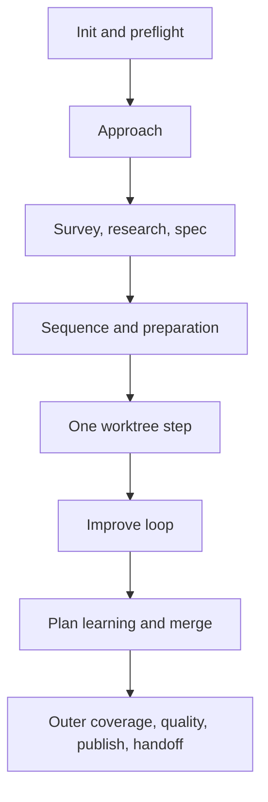

# ShipLoop 0.9

ShipLoop is a Markdown-authoritative session harness for shipping a bounded
piece of work through a complete SDLC loop. It turns a long-lived request into
durable, small actions so a host with a short token window can resume from
evidence rather than chat memory.

It does not implement product changes by itself, decide whether tests are
meaningful, or prove a human-facing or remote outcome. It makes those duties
explicit, persists the supplied evidence, and refuses unsafe transitions.

## What changed in 0.9

- Markdown—not a JSON sidecar—is authoritative for state, DAG, receipts,
  results, check evidence, history, and the improvement journal.
- The CLI returns one action ID and requires that ID plus a structured Markdown
  result to advance. A flagless or inferred `complete` no longer exists.
- SDLC work is explicit: approach, survey, research, checkable spec, one
  dependency sequence, optional prep, step implementation, inner Improve,
  final verification, broader-plan learning, and outer closure.
- Each Improve cycle reads Git history, plans/applies fixes, lints, runs
  required tests, and records a verbose primary commit with learning evidence.
- Two consecutive trivial-only iterations are a convergence threshold, not a
  shortcut around fresh final checks or a max-cycle success escape.
- The generic ShipLoop journal records proposed harness improvements but never
  changes the installed harness on its own.

## Operating model



The script owns the durable state and issues one compact packet. The packet
contains an `Action:` ID, the stage, the active worktree when applicable,
minimal file pointers, and the next command. The host reads only relevant
durable files, does the stated activity, writes a result record, and invokes
the returned command.

The canonical details are in [the action protocol](references/action-protocol.md).

## Start a run

Choose a repository and a **fresh** run directory. Starting from the
repository is clearest:

```sh
REPO=/absolute/path/to/repository
RUN_DIR="$REPO/.shiploop"
SKILL_ROOT=/absolute/path/to/shiploop

cd "$REPO"
python3 "$SKILL_ROOT/scripts/shiploop" init \
  --repo "$REPO" --run-dir "$RUN_DIR" --prompt "Implement …"
```

The first packet asks for `preflight`. Inspect the Git baseline, preserve
unrelated dirty files, identify available lint/tests and environment prep, and
complete its action with a Markdown result:

```markdown
# Preflight result

```shiploop-state
{
  "summary": "Committed baseline selected; unrelated dirty notes are excluded.",
  "baseline": "committed-head",
  "readiness": "The repository test command and runtime are available.",
  "prep_findings": "No environment preparation is needed before planning."
}
```
```

Then invoke the packet's exact command:

```sh
python3 "$SKILL_ROOT/scripts/shiploop" complete \
  --run-dir "$RUN_DIR" --action "$ACTION" --result /absolute/preflight-result.md
```

The result parser requires exactly one `shiploop-state` fence. The JSON is
structured content within the Markdown source of truth; it is not permission
to create `state.json` or another writable JSON copy.

## Stages and placement

| Phase | Stages | Durable outcome |
|---|---|---|
| Intake | `preflight`, `approach` | Baseline and initial delivery approach before narrowing the spec. |
| Validate spec | `survey`, `research`, `spec` | Environment/writer contract, sourced assumptions, checkable spec, lifecycle placement. |
| Plan | `sequence`, optional `prepare`, `schedule` | Native bounded dependency review, matching human plan, compatible DAG, and any authorized outer-before prep. |
| Per step | `implement`, repeated `review → improve-plan → improve-apply → verify → commit`, then `final-verify → post-inner → merge` | Merged step with fresh evidence, Git learning, and a broader-plan decision. |
| Outer loop | `coverage`, `quality`, optional `publish`, `handoff` | Review coverage, whole-product checks, authorized delivery evidence, limitations, and ShipLoop proposals. |

The spec's lifecycle record answers placement before coding:

- `preparation: none | dag | outer-before`
- `publish: none | dag | outer-loop`
- `quality: true | false`
- `acceptance: [...]`

For example, deployment configuration needed before all feature work is
`outer-before`; a release after all steps is `outer-loop`; an intermediate
fixture or migration can be a normal DAG step. Do not create hidden prep work
or publish merely because a local test passes.

## Survey and planning discipline

The survey preserves facts later steps need without rescanning the world:

- Inventory the repository, relevant references, tools/MCP, handles,
  initiation state, UI surfaces, and risks. Never record secrets.
- If a destination writer is involved, choose one writer per destination
  artifact; record conflicting writers as `dont_use`, not fallback choices.
  A failed exclusive writer is a blocker, not a license to switch silently.
- Research writer/library/runtime conventions, reserved versus product paths,
  syntax lint and live destination identity oracles, routing, and safe probe
  recipes. Reuse local/destination patterns before adding a stack.
- When a user-facing surface exists, make an early design-producing DAG step
  feed the implementation step. Design includes interaction behavior, not just
  a visual asset.
- Use ShipLoop's bounded native method: make a short forward draft, audit every
  prerequisite backwards, add missing producers or leave facts unresolved, then
  check exact producer links and cycles. The `sequence` action imports a
  compatible Markdown DAG into `backchain/plan.md` only after validation.
  `plan.md` is the human sequence and contains Review Coverage. An external
  planner is used only when the user explicitly asks for one.

The sequence result includes a nonempty `dependency_review` summary and
exactly one of inline `dag` or an absolute Markdown `dag_file` containing
one structured fence. A raw JSON draft is refused; the draft has no authority
until the script validates and imports it.

See [survey.md](references/survey.md),
[validate-spec.md](references/activities/validate-spec.md), and
[plan.md](references/activities/plan.md). The structured `## machine` fence
inside `environment.md` is an intentional part of authoritative Markdown.

## Per-step evidence

ShipLoop schedules one ready step at a time and creates an isolated worktree
and branch. Work in that worktree, not the session checkout. The harness makes
a local no-ff merge only after branch, final-check evidence, convergence
receipt, and session-baseline gates pass. It never force-removes work or
includes unrelated tracked dirt in a merge.

For each implementation action:

1. Implement the declared `produces` and add/expand tests that validate them.
   Tests assert behavior or contracts, not merely file existence.
2. Run lint after every production edit. Use destination-writer lint or
   validation for destination syntax when one exists, then other applicable
   repository/generic linters.
3. Create the explicit manifest and run `verify`. It executes argv lists,
   saves logs, fingerprints the tree before/after, and refuses changed or
   failed evidence.
4. Complete `implement` only after current evidence exists. The host's
   `test_review` explains what was tested and why.

A manifest has a concrete lint check and at least one test check. Every exact
`produces` string is named by a test's `acceptance` list:

```markdown
```shiploop-state
{
  "checks": [
    {
      "id": "lint",
      "kind": "lint",
      "argv": ["npm", "run", "lint"],
      "acceptance": []
    },
    {
      "id": "unit",
      "kind": "test",
      "argv": ["npm", "test", "--", "widget"],
      "acceptance": ["src/widget.ts", "widget behavior"]
    }
  ]
}
```
```

If a later iteration adds or changes coverage, use `verify --reason` to
persist why. The command is not a shell; `argv` remains an argument list.
Failed attempts are retained under `check-attempts/`; they are not erased to
make the final passing check look like the first attempt.

## Improve loop

Each iteration is a complete loop, not an informal “looks good” pass:

1. At `review`, call `history` and inspect the full bodies for the latest
   seven commits or all available commits. The normal display is compact;
   request one full body at a time with `--limit 1 --skip N --full`.
2. Review code, tests, regressions, acceptance mapping, and previous learning.
   Record findings as `material` or `trivial`; missing relevant tests are
   material.
3. At `improve-plan`, explain fixes, test work, and prevention. At
   `improve-apply`, make the changes and honestly mark material work.
4. At `verify`, run fresh lint and required tests. Fix failures and repeat
   rather than completing on stale evidence.
5. At `commit`, make the primary current-HEAD worktree commit. Its
   `Review:`, `Changes:`, `Validation:`, and `Key learnings:` sections
   must include the review and apply learning text verbatim and end with the
   exact `ShipLoop-Iteration:` trailer.

Material work resets convergence. Only two consecutive fully recorded
trivial-only iterations advance to `final-verify`; no numeric cap lets a
step escape. The final tree needs a separate fresh verification. If a defect
is found after a commit, final verification, post-inner review, or merge
intent, use `repair`: it records why, resets the streak, and returns to
review without erasing work. If the session checkout moves, integrate its
current HEAD into the step worktree, then repair and complete two new
converged iterations rather than merging against a stale baseline.

## Broader learning and the journal

After each converged step, `post-inner` asks whether broader steps,
dependencies, preparation, or test strategy should change. The decision is
durable even when it is `no-change`. A `revise` result supplies a complete
candidate plan/DAG; ShipLoop only permits pending steps to change and rejects
any goal, initial-state, completed-step, or running-step rewrite.

Separately, record generic ShipLoop ideas in `shiploop-improvements.md`.
Each proposal has title, evidence, impact, proposal, and test idea. The script
deduplicates proposals and preserves action/step provenance. It does **not**
edit ShipLoop automatically. The final handoff surfaces the journal and a
prioritized proposal list for a future, explicitly authorized maintenance run.

## Outer loop and delivery evidence

When all DAG steps merge, ShipLoop performs the remaining lifecycle work:

1. `coverage`: run the bound Review Coverage activity and obtain its actual,
   tracked, clean ledger—or use a pre-existing explicit plan waiver.
2. `quality`: use fresh whole-product `verify`, then explain acceptance
   and test review. Cross-step integration belongs here.
3. `publish`: only if lifecycle says `outer-loop` and the user authorized
   it. Check existing delivery first; record artifact, entrypoint verification,
   and evidence. A local green suite cannot prove remote publication.
4. `handoff`: record checked acceptance, limitations, delivery facts, and
   the journal's prioritized proposals. Use an explicit `[]` journal after a
   no-new-proposals review.

The host owns semantic review, test adequacy, external side effects, and
publication verification. ShipLoop validates freshness and consistency, not an
unobserved claim's truth.

## Pause, recovery, and migration

Use `pause --reason` for a user decision, unavailable external prerequisite,
or other recoverable block. It preserves the action and never reports success.
Use `resume` after resolution. Use `halt --reason` for a terminal stop; it
writes an unfinished handoff rather than pretending the run completed.

The state store uses a write-ahead Markdown transaction. A crash after a
partial multi-file update is rolled forward by the next command while the run
lock is held. Inspect records; do not delete `transaction.md` or hand-edit
state to bypass a gate.

For a pre-0.9 JSON run, run `migrate --run-dir …` exactly once. It archives
only known legacy ShipLoop files—state.json, spec.json, plan.json,
backchain/plan.json, steps/*.json, and history.jsonl—under legacy-backup/,
writes migration.md, preserves code/branches/worktrees, and restarts planning
checkpoints. A run.md marker prevents a missing Markdown authority from being
replaced by forged legacy JSON; unrelated repository JSON is never archived.

## Command reference

See [action-protocol.md](references/action-protocol.md) for per-stage result
fields. The command surface is:

```sh
shiploop init     --repo REPO [--run-dir RUN] --prompt TEXT
shiploop next     --run-dir RUN
shiploop status   --run-dir RUN
shiploop context  --run-dir RUN --section iteration --offset 0 --limit 4000 [--digest SHA256]
shiploop complete --run-dir RUN --action ACTION --result RESULT.md
shiploop verify   --run-dir RUN --action ACTION --manifest CHECKS.md [--reason TEXT]
shiploop history  --run-dir RUN --action ACTION --limit 1 --skip N [--full]
shiploop journal  --run-dir RUN --action ACTION --result PROPOSALS.md
shiploop repair   --run-dir RUN --action ACTION --reason TEXT
shiploop replan   --run-dir RUN --action ACTION --result CORRECTIVE_PLAN.md
shiploop pause    --run-dir RUN --reason TEXT
shiploop resume   --run-dir RUN
shiploop halt     --run-dir RUN --reason TEXT
shiploop migrate  --run-dir RUN
```

These commands intentionally replace old inferred-completion flows. If a
packet, this guide, and a historical run disagree, the current packet and
action protocol govern; capture the mismatch as a proposal rather than
improvising a state transition.
