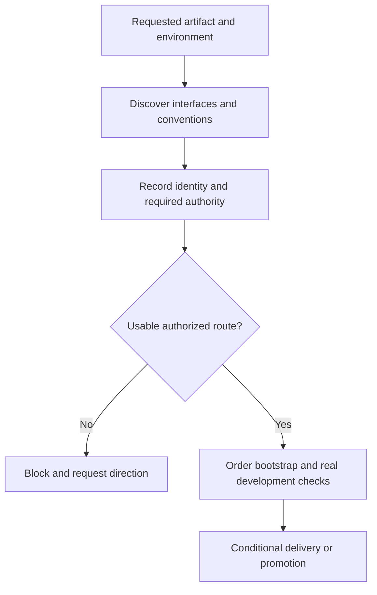
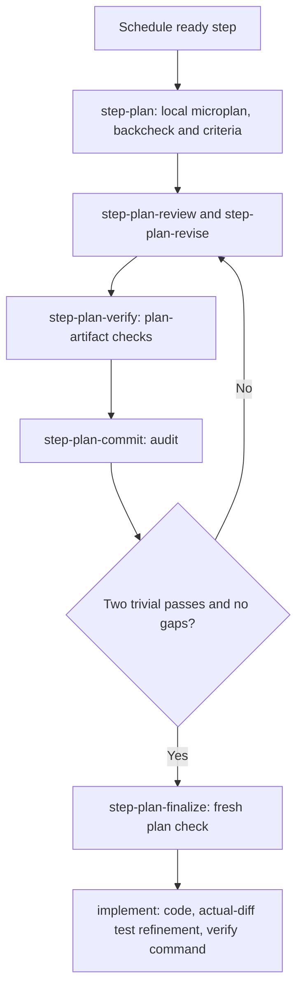
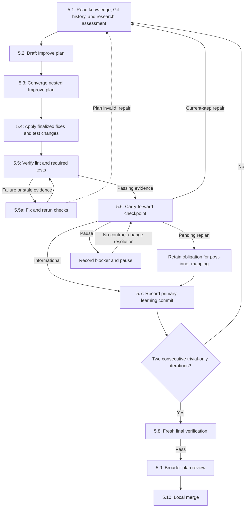
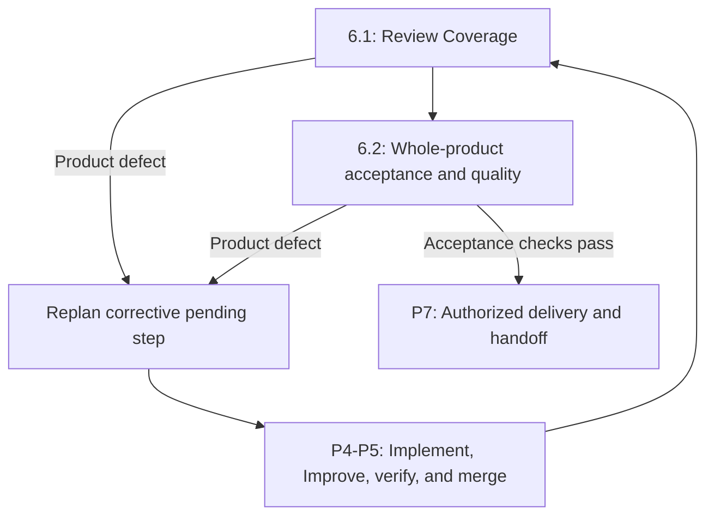
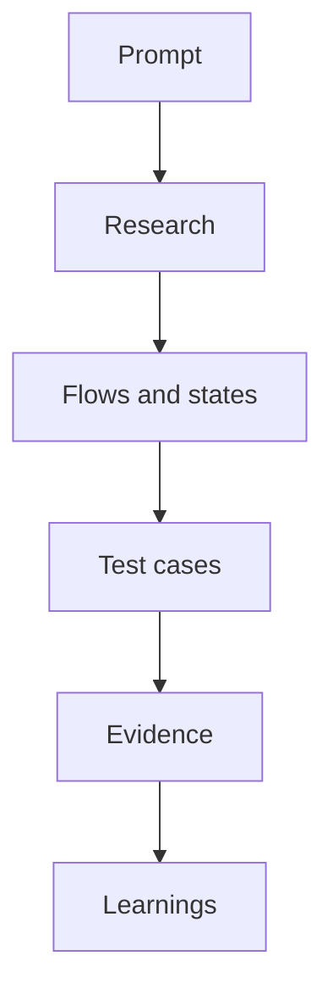
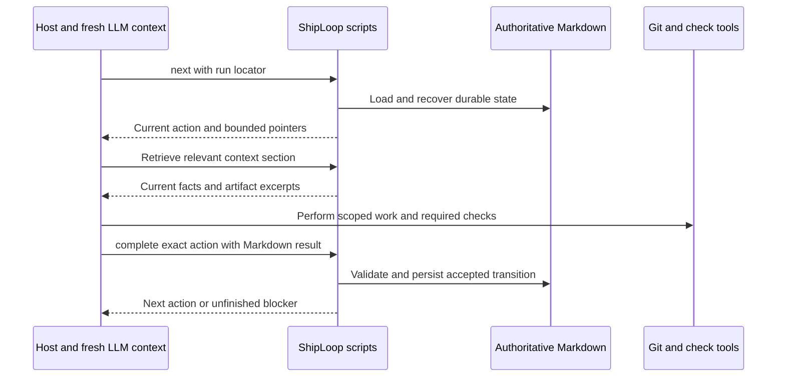
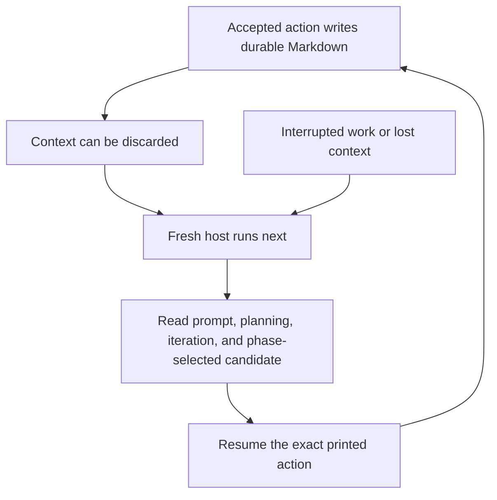
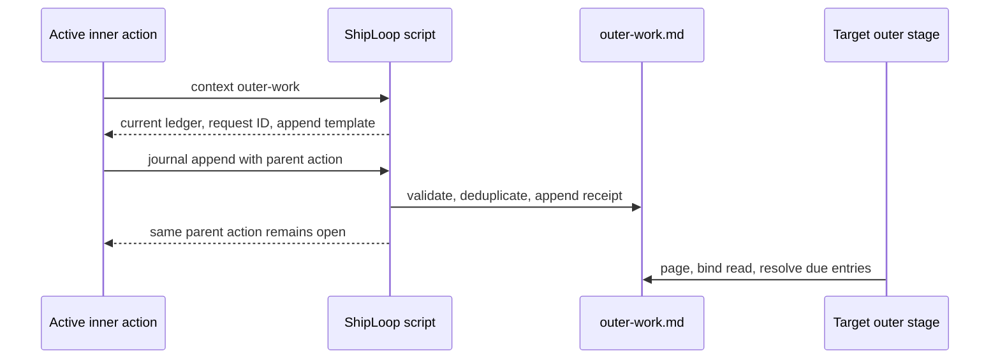
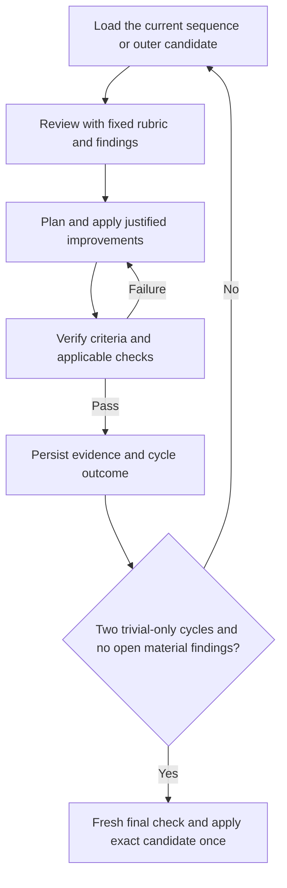

# ShipLoop 0.9

ShipLoop is a Markdown-authoritative session harness for delivering one bounded
piece of work through a complete SDLC loop. It turns a long-running request into
small, durable actions so a host with a short context window can resume from
recorded evidence rather than chat memory.

It does **not** implement product changes, decide whether tests are meaningful,
or prove a human-facing, remote, or deployed outcome. The host performs those
judgments and records evidence; ShipLoop persists the result, checks transition
preconditions, and refuses unsafe or stale transitions.

## Table of contents

- [What ShipLoop is and is not](#what-shiploop-is-and-is-not)
- [Start or resume a run](#start-or-resume-a-run)
- [Seven explanatory phases and current stored states](#seven-explanatory-phases-and-current-stored-states)
- [Requirements modeling and traceability](#requirements-modeling-and-traceability)
- [Execution-plan, per-step evidence, tests, and documentation](#execution-plan-per-step-evidence-tests-and-documentation)
- [Ownership, context, and recovery](#ownership-context-and-recovery)
- [Outer-work journal](#outer-work-journal)
- [Current limitations and proposed safeguards](#current-limitations-and-proposed-safeguards)
- [Command reference](#command-reference)
- [Related references](#related-references)

## What ShipLoop is and is not

The full operator loop is intentionally broader than a single implementation
task. P1–P7 below are explanatory groups for people; they are **not** additional
CLI phases, JSON fields, or DAG nodes.

```mermaid
flowchart TD
    P1["P1: Frame work and establish baseline"] --> P2["P2: Survey and converge research and behavior"]
    P2 -->|Research evidence and behavior baselines accepted| P3["P3: Converge spec, sequence, and prepare"]
    P3 --> P4["P4: Select, converge a plan, and implement one ready step"]
    P4 -->|Step checked| P5["P5: Improve, learn, and merge"]
    P5 -->|Return to scheduler| P4
    P4 -->|DAG drained| P6["P6: Review the whole product"]
    P6 -->|Corrective step needed| P4
    P6 -->|Acceptance evidence complete| P7["P7: Deliver if authorized and hand off"]
```



The diagram is an operator map:

- ShipLoop's **stored phase and stage** choose one current action and protect
  its transition.
- The plan **DAG** orders work products and prerequisites; it does not describe
  runtime behavior in the product.
- A product **state or sequence diagram** describes what the product does for a
  user, client, service, or data object. It is neither a ShipLoop stage nor a
  ShipLoop DAG step.

For example, a product transition such as `Queued → Running → Timed out` can
be a requirement. A DAG may contain a step that implements it and another that
tests it. The harness will still move through stages such as `implement`,
`review`, and `verify` while doing that work. Do not turn product transitions
into invented harness stages or mistake a dependency edge for a product state
transition.

### Current controls, host duties, and proposals

| Status | Meaning |
|---|---|
| **Current control** | The script and authoritative Markdown currently store state, issue one action ID, validate declared result/evidence shape, gate research/behavior/specification candidates, and converge each initial or Improve execution plan with durable finding ledgers, fresh planning checks, and audit commits. |
| **New-run control** | New runs bind a seven-message history policy, compact source-linked system context, bounded artifact diagnostics, an early-observation callback, an outer-work obligation journal, and a final handoff objective. Missing version markers retain legacy behavior; explicit unsupported markers fail closed. |
| **Required host duty** | The host must make scoped edits, select meaningful tests, interpret evidence, review semantics, preserve unrelated work, and verify external effects. The script cannot mechanically prove these judgments. |
| **Proposed safeguard** | A documented improvement idea that is not a current stage, result field, or enforced gate. It must not be described as implemented. |
| **Known limitation** | A current state-machine or recovery gap. Follow the safe operating discipline and report the limitation; do not claim that the harness already closes it. |

The current packet and [action protocol](references/action-protocol.md) govern
when they conflict with an older guide. Capture a documentation mismatch in the
generic ShipLoop journal rather than improvising a transition.

Inner-loop planning, implementation, review and verification repair select the short
[Implementation constitution](references/testing-and-documentation.md#implementation-constitution):
KISS/YAGNI, justified abstraction, input/error boundaries, concise useful comments
and local style conventions. These are host judgment defaults, not a new phase,
score, result schema or permission to skip tests. The entry skill stays a thin
router; the current packet supplies the guidance again after context loss.

## Start or resume a run

Choose a repository and a **fresh, dedicated** run directory. Starting from the
repository makes paths and Git evidence easier to interpret:

```sh
REPO=/absolute/path/to/repository
RUN_DIR="$REPO/.shiploop"
SKILL_ROOT=/absolute/path/to/shiploop

cd "$REPO"
python3 "$SKILL_ROOT/scripts/shiploop" init \
  --repo "$REPO" --run-dir "$RUN_DIR" --prompt "Implement …"
```

The first packet requests `preflight`. Inspect the committed Git baseline,
preserve unrelated dirt, identify the available runtime and checks, and assess
non-secret preparation needs. Put the requested result in the packet's inbox
path, with exactly one `shiploop-state` fence:

````markdown
# Preflight result

```shiploop-state
{
  "summary": "Committed baseline selected; unrelated dirty notes are excluded.",
  "baseline": "committed-head",
  "readiness": "The repository test command and runtime are available.",
  "prep_findings": "No environment preparation is needed before planning."
}
```
````

Then use the packet's exact command and action ID:

```sh
python3 "$SKILL_ROOT/scripts/shiploop" done \
  --run-dir "$RUN_DIR" --action "$ACTION" --result /absolute/preflight-result.md
```

The JSON is structured content **inside** authoritative Markdown, not
permission to create a writable `state.json` or another sidecar. The action ID
is single-use: a stale action or a changed replay is refused. Use `next` to
resume the durable action after a cold context, not a fresh `init`.

Invoke the skill only once. A successful `done` reply acknowledges the accepted
action and includes the next action packet; follow that reply directly. The
calling host does not select stages, maintain counters, or invoke the skill
again. After context loss, bootstrap with the package/run locators from the
task handoff and call `next`; all decisions and progress come from Markdown.
`complete` remains a compatible alias for `done`.

Only an evidence-complete terminal packet says **It's all complete.**, links
the generated `report.html`, and offers no further completion callback. The
report presents the outcome, achieved outputs, check results, activity sequence,
learnings and limitations; it is a derived view, never authoritative state.

## Seven explanatory phases and current stored states

The stored `phase` and `stage` pair is assigned by the script with a new action
ID. Numbered explanatory phases, DAG step IDs, and Improve iteration IDs are
different identifiers.

| Explanatory phase | Exact current stored phase | Exact current stage or stages | Outcome before the next explanatory phase |
|---|---|---|---|
| **P1 — Frame work and establish a baseline** | `intake` | `preflight`, `approach` | A selected committed baseline and an initial delivery approach. |
| **P2 — Survey and converge research and behavior** | `validate-spec` | `survey`, `research`, `research-review`, `research-plan`, `research-apply`, `research-verify`, `research-commit`, `research-finalize`, `behavior`, `behavior-review`, `behavior-plan`, `behavior-apply`, `behavior-verify`, `behavior-commit`, `behavior-finalize` | An as-of research evidence baseline and a frozen behavior model, with material ambiguity resolved or explicitly paused. |
| **P3 — Converge specification, sequence dependencies, and prepare** | `validate-spec`, then `plan` | `spec`, `spec-review`, `spec-plan`, `spec-apply`, `spec-verify`, `spec-commit`, `spec-finalize`, then `sequence` and conditional `prepare` | A frozen specification/lifecycle, validated dependency plan, and only authorized outer-before preparation. |
| **P4 — Select, plan, and implement one ready step** | `implement` | script-driven `schedule`, then `step-plan`, `step-plan-review`, `step-plan-revise`, `step-plan-verify`, `step-plan-commit`, `step-plan-finalize`, and `implement` | One active branch/worktree, a freshly finalized execution plan, step output, and fresh check evidence. |
| **P5 — Improve repeatedly, learn, and merge** | `implement` | `review`, `improve-plan`, then the same nested `step-plan-review`/`step-plan-revise`/`step-plan-verify`/`step-plan-commit`/`step-plan-finalize` stages, `improve-apply`, `verify`, `carry-forward`, `commit`, `final-verify`, `post-inner`, `merge` | A converged, locally merged step, current knowledge checkpoint, and broader-plan decision. |
| **P6 — Review the whole product** | `residual` | `coverage`, `quality` | Bound coverage and whole-product acceptance/integration evidence, or a corrective replan. |
| **P7 — Deliver if authorized and hand off** | `residual`, then `done` | conditional `publish`, `handoff`, then `done` | Actual delivery facts when applicable, limitations, handoff, and the terminal `done` state. |

`halted` / `halted` is an unfinished terminal exit outside P1–P7. `pause` is a
flag over the pending action, not a successful phase or stage. `schedule` is
script-driven: the host does not author a `schedule` result; the scheduler
selects a dependency-ready step or routes a drained plan to P6.

Approach, survey, sequence, authorized preparation, post-inner, coverage, and
quality are also substantive objectives. Each candidate is refined through
`objective-review → objective-plan → objective-apply → objective-verify →
objective-commit → objective-finalize` before the exact certified candidate is
applied once to its original activity. The generic loop is therefore part of
P1/P3/P5/P6, not an optional workflow beside the diagram.

### P1 — Frame work and establish a baseline

`init` captures the original request in a dedicated run directory. `preflight`
records the committed baseline, user dirt to preserve, available checks, runtime,
and preparation candidates without installing tools, changing shared
environments, or publishing. `approach` then creates the initial high-level
scope, risks, milestones, preparation candidates, and acceptance strategy.

The approach comes before the detailed specification. It is an initial delivery
direction, not an executable plan or blanket authority for later external work.

### P2 — Survey and converge research and behavior

`survey` records facts that later actions need without repeatedly rescanning the
repository: relevant references, permitted tools, writer routes, layout,
reserved paths, UI surfaces, test environments, and documentation conventions.
Never record secrets.

New runs also make the system map durable before implementation. The paired
research evidence names observed code, state, system, and environment-role
facets; applicable roles and surveyed interfaces; and the selected interaction
contracts that connect them. Investigate only as deeply as the decision needs:
the exposed tool/CLI/API surface, its real invocation and error contract, then
the downstream state, retry, consistency, permission, and environment effects.
For a simple local edit, record why a deeper boundary is not applicable. For a
remote or client/service boundary, preserve compact question/source/contract
links and explicit uncertainty instead of copying vendor schemas or assuming a
provider-specific stack. See [platform discovery](references/platform-discovery.md)
and [research convergence](references/research-loop.md) for the packaged guidance.

If a client will call a service, freeze the actual invocation contract before
authoring communication: the operations the service exposes and the
client/HTML conventions that call them. Test the real client path, not only a
convenient direct call to an internal helper. An exclusive destination writer
that fails is a blocker, not a license to silently choose another writer.

`research` submits a report `body` and typed `research_state`; the script imports
the paired `research.md` and `research-evidence.md` candidates. Each question has
a stable source-backed status and a revalidation policy. The mandatory research
loop is:

```text
research → research-review → research-plan → research-apply → research-verify
→ research-commit → (another research-review or research-finalize)
```

Research finalizes only after two fully recorded trivial-only passes, no open
findings or open/blocked questions, and a fresh candidate-bound check with the
exact acceptance `research evidence`. `research-finalize` records an as-of
certificate for the accepted paired candidates; it does not assert that a remote
source, credential, or deployment will remain current. Use the detailed
[draft schema](references/research-loop.md#draft),
[review rubric](references/research-loop.md#review), and
[evidence-and-freshness boundary](references/research-loop.md#evidence-and-freshness)
rather than inventing a parallel report format.

Research uses in-scope evidence and safe read-only probes. It does not require a
particular provider or a new tool, and it does not authorize installation,
configuration changes, destructive experiments, or publication. After
`research-finalize`, the mandatory behavior loop begins:

```text
behavior → behavior-review → behavior-plan → behavior-apply → behavior-verify
→ behavior-commit → (another behavior-review or behavior-finalize)
```

`behavior` drafts the requirement/flow/state/transition model from the durable
prompt and accepted research baseline; it is not frozen merely because a first
candidate exists.
At each loop pass, `behavior-review` reads current Git history and the bounded
candidate/ledger context, `behavior-plan` addresses every open finding,
`behavior-apply` imports the complete replacement candidate, `behavior-verify`
runs a planning-artifact lint/test manifest, and `behavior-commit` creates a
distinct verbose audit-only learning commit. The commit must preserve the
product tree, have the iteration baseline as its direct parent, and contain
`Review:`, `Changes:`, `Validation:`, `Key learnings:`, and the exact
`ShipLoop-Iteration:` trailer.

Each research, behavior, and specification planning-iteration packet makes its
terminal contract explicit:

- **Objective:** converge the current research, behavior, or specification
  candidate, not merely produce another draft.
- **Until:** two consecutive fully completed trivial-only passes, no open
  findings, and a fresh final check of the exact candidate.
- **Continue while:** an open finding, material change, repair, failed/stale
  check, or candidate/ledger/baseline drift remains.
- **Evidence required:** the durable review rubric, finding ledger, plan and
  resolutions, candidate- and ledger-bound planning checks, and audit commit.

Material findings, material application, or a repair reset the streak; a
trivial pass still needs a real review, checks, and commit. `behavior-finalize`
runs fresh checks without accepting a replacement candidate, then freezes the
checked behavior model. A material unresolved policy blocks finalization: pause
or seek user direction rather than guessing it. The three loops are bounded
operational convergence rules, not proof of semantic exhaustiveness.

The upstream packet contract uses the same objective/until/continue vocabulary
as `until-loop`. ShipLoop incorporates the standalone 0.1.3
repeat/verify/continue decision as the pure internal
`scripts/shiploop_until.py` policy used by specialized planning, per-step
Improve planning, and universal substantive-objective loops; it does not run or
modify the external skill or its CLI. ShipLoop remains the only runtime, lock,
transaction, and Markdown state authority—there is no JSON sidecar or second
loop session. Research/behavior/spec mechanics remain in
`scripts/shiploop_planning.py`; generic base activities use the objective-loop
receipt. See
[Planning convergence loops](references/planning-loops.md#until-loop-incorporation-boundary),
[Execution-plan convergence](references/execution-planning.md), and the
[universal substantive-objective loop](references/objective-loops.md).

### P3 — Converge specification, sequence dependencies, and prepare

After `behavior-finalize`, `spec` creates `spec-draft.md` and
`lifecycle-draft.md`. They are candidates, not the frozen `spec.md` and
`lifecycle.md` contract. The mandatory spec loop is:

```text
spec → spec-review → spec-plan → spec-apply → spec-verify → spec-commit
→ (another spec-review or spec-finalize) → sequence
```

It uses the same two-trivial-pass, no-open-findings, fresh planning-check, and
verbose audit-only commit gate as the behavior loop. Its rubric additionally
tests clarity, consistency, and feasibility. `spec-finalize` accepts no new
body or lifecycle candidate: it verifies the exact final draft and last audited
history, then atomically promotes the checked `spec-draft.md` and
`lifecycle-draft.md` to `spec.md` and `lifecycle.md`. There is no direct
draft-to-`sequence` shortcut.

The planning loops enforce their recorded candidate gates, but semantic breadth
review remains a current host duty: perform it on every research/behavior/spec
review, at `sequence`, on every affected P5 Improve cycle, and again at P6
outer quality. `sequence`, post-inner, coverage, and quality now use the same
script-enforced generic objective convergence stage; the distinct P4/P5
execution-plan loop remains the gate for source edits.

The frozen lifecycle record answers placement before coding:

- `preparation: none | dag | outer-before`
- `publish: none | dag | outer-loop`
- `quality: true | false`
- `acceptance: [...]`

New runs also require an explicit, versioned `risk_policy`: security testing,
fuzzing, and ongoing dependency maintenance each receive a reasoned decision.
Selected test IDs must resolve to actual step contracts. Maintenance is
run-wide: implementation in this DAG precedes every DAG publication;
`operate-later` records a future owner/cadence/validation/rollback policy without
creating an updater or scheduler. See the
[risk-policy schema and test guidance](references/testing-and-documentation.md#security-fuzzing-and-ongoing-maintenance).

### Platform discovery without platform-specific assumptions



Survey requires `machine.platform_discovery`, including a compact explicit
local-only case. A hosted artifact instead records the selected interfaces and
versions, safe identity probe, authority status, exclusive writer, bootstrap,
development validation and promotion decisions. Sequence binds the required
producers to the existing DAG; it does not create another scheduler. The
script checks declarations and ordering, while the host must establish current
access and permission before external use.

New runs also require action-bound `platform_revalidation` results at selected
external preparation, implementation/improvement and publication boundaries.
The packet supplies the exact platform/trigger/action/environment binding.
Large sets are available through digest-bound `platform-revalidation` context
pages; bounded result samples never waive the complete required evidence.
Record the safe probe **before** the authorized operation; failed probes or
changed roles require a pause, not a successful callback. This is recorded
host testimony, not independently verified live access. Earlier runs without
the new marker retain their callback compatibility. The preparation objective
reviews its original operation evidence without rerunning external effects.

For example, a request for a hosted developer app leads to discovery of the
available CLI/MCP and documented syntax, then to an identity/authority record.
Missing write authority leaves that platform applicable but blocked; it does
not become a fictional local-only task. With an authorized route, bootstrap
precedes dependent validation, and promotion is separately planned. No
platform name, tool installation, development account, or production deployment
is assumed. See the [typed platform guide](references/platform-discovery.md).

At `sequence`, make a short forward draft, audit every prerequisite backward,
add missing producers or leave facts unresolved, then validate the acyclic DAG.
The human `plan.md` and imported `backchain/plan.md` must agree. Include Review
Coverage and map expected cases, checks, documentation, preparation, deployment,
and readiness to concrete outputs.

`prepare` appears only for authorized `outer-before` preparation. Other
preparation belongs in explicit dependency-ordered DAG steps, or it is `none`.
Preflight's readiness assessment is not permission to make unapproved
environment changes.

Before the first step is allocated, the finalized spec's Git baseline and
product-tree fingerprint must still match. Outer-before preparation may ready
the environment; changes to product files belong in explicit DAG steps. Later
authorized execution does not have to keep the historical planning HEAD current.

For acceptance that depends on a real deployment, plan authorized deployment or
readiness and dependent checks **before** outer `quality`. An `outer-loop`
publication can add a final delivery smoke check, but it cannot retroactively
satisfy deployment-dependent acceptance. A `dag` publication is a normal,
ordered implementation step; it does not create the outer `publish` stage.

### P4 — Select, plan, and implement one ready step

ShipLoop schedules one ready DAG step at a time and allocates its isolated
worktree and branch. Work there, not in the session checkout. Scheduling opens
`step-plan`; it does not authorize a source edit. The initial execution-plan
loop is:



`step-plan-review` reads bounded `step-context`, `step-plan`, and current
`iteration` state, then the run's policy-owned current Git history. In new
runs, `step-context` also projects only the selected step's applicable
system-context roles, interfaces, interaction contracts, source/question links,
blocking IDs, and research-evidence/context digests. It inspects the actual worktree's
relevant code, interfaces, call sites, tests, configuration, documentation,
and diff; the frozen environment plus current non-secret observations; and
direct suppliers and consumers. Its full rubric asks about scope, current
implementation, environment, dependencies, flows, edge conditions,
second-order effects, implicit requirements, test strategy, and documentation.
The review persists compact evidence references instead of relying on the LLM's
memory or dumping raw source into the run. If audit-only plan commits fill the
normal history window, it also uses a scoped path/symbol investigation to
inspect the relevant older implementation or decision commit.

Each pass follows `step-plan-review → step-plan-revise → step-plan-verify →
step-plan-commit`. A material finding/revision resets the streak; the
incorporated continuation policy permits fresh finalization only after two
unique checked/audited trivial passes, all trivial fixes applied, and no open
findings. `step-plan-finalize` releases only the exact freshly checked plan to
`implement`. The audit commits preserve the product tree and do not count as
Improve iterations or replace the later primary step commit.

Each initial and Improve plan includes a **local execution microplan**: ordered
local work/output rows, prerequisites with evidence sources, and planned
case/check mappings. The agent works backward from each required output and its
verification needs, resolves suppliers or records material gaps, then checks the
forward execution order. The global backchain still owns dependencies between
delivery steps; this local check catches assumptions exposed by the actual code,
fixtures and environment. One row or a justified no-change plan is enough when
appropriate; no second scheduler, standalone skill call or progress cursor is
introduced. See [Local microplan and backchain](references/execution-planning.md#local-microplan-and-backchain).

For example, a plan to validate a matching record cannot treat “the data model
exists” as proof that its test fixture exists. It must cite the fixture or order
an authorized, in-scope fixture-producing row before the test. If a new shared
environment or permission is needed to proceed, the step stays blocked for
broader direction. These dependency judgments are host-reviewed Markdown;
the script binds and gates the plan but does not prove its semantic completeness.

Before code, the planning result's existing `body`/`plan` holds a compact test
criteria matrix. Each stable case ID maps its contract `T-` ID and exact
`produces` string to preconditions/input, expected output/state/side effect, planned test
path/selector, check ID, environment/fixture, and separate decisions for unit,
integration, end-to-end, mock/fake, browser, service, and API coverage. Each
decision is selected, not applicable with a reason, or required but blocked
with a cause. This is durable Markdown planning evidence, not a new schema,
test catalog, or proof that a future test passed.

On a cold entry to `implement`, `improve-apply`, or `review`, start with `next`,
then page `context --section step-plan` for the accepted plan criteria and
`context --section step-context` for the active-step context. The latter can
expose the digest-bound read-only `implementation_test_record`: the accepted
action plus `summary` and `test_review` from
`results/{implementation_check_action}.md`. It is a historical host-reported
note, not current proof; inspect the actual tree and rerun current checks before
reusing its coverage conclusion.

After finalization, implement only the declared `produces`: write the code,
then inspect the actual diff, dependencies, and code learnings before authoring
or refining executable tests. A TDD or reused test can remain only with evidence
that it covers the planned criterion; do not manufacture a no-op test edit.
Run lint and every selected required test, fix justified code or test defects,
and rerun until the current manifest passes on unchanged files. The script
retains command logs, before/after fingerprints, and failed attempts; it rejects
non-zero, timed-out, stale, or changed-tree evidence. A required unavailable,
failed, blocked, or unrun test keeps the step unfinished.

When a test needs correction, never rewrite acceptance to fit a current bug. In
initial `implement`, record the reason, before/after oracle, independent
requirement or contract source, retained/added coverage, actual-versus-expected
outcomes, and adequacy limits in `test_review`. In Improve work, record
application additions/corrections in `test_changes`, discoveries in `learnings`,
and later adequacy review in `test_review`; `summary` records checked evidence.
The existing results are imported into Markdown for a fresh context. Passing
plan or local tests do not decide semantic adequacy, and a mock/fake cannot prove
a required real boundary. A passing initial implementation starts P5; it is not
permission to merge.

**Illustrative trace.** Before code, case `TC-14` maps contract `T-14` and its
exact `produces` string to a blank-input fixture and reject/unchanged-state
outcome. During `implement`, the actual diff shows whitespace takes the same
new branch. The test refinement retains `TC-14`/`T-14`'s oracle and adds a
whitespace stimulus/assertion at its planned test path; initial `test_review`
records the added coverage and limitation. The code learning adds a test
input—it does not change accepted behavior.

### P5 — Improve repeatedly, learn, and merge

One Improve iteration is `review` through `carry-forward` and `commit`. Each
iteration has its own recorded history review, findings, a separately converged
post-review plan, application, fresh checks, current knowledge checkpoint, and
primary learning commit. Nested plan passes are evidence for the next edit; they
do not count as Improve iterations.



Before completing `review`, fully page the bounded `knowledge` selection and
run `history`; inspect the full bodies for the run policy's latest commits (or
all available), one body at a time when needed. New runs require seven and bind
that policy into every pass; a run without the marker remains at the legacy ten.
If audit-only plan commits dominate
that window, also inspect the relevant older implementation or decision commit
through a scoped path/symbol investigation. The review result binds the
knowledge revision, digest, and scope it read. It also records the structured
`research_assessment` disposition (`not-needed`, `resolved`, `required`, or
`blocked`) with its summary, safe evidence references, and questions. A
non-`not-needed` assessment, including `resolved`, is material and resets the
streak. `required` or `blocked` cannot finish an Improve cycle; a prior required
assessment needs a resolved assessment in `improve-apply` that retains its
required/blocked question strings. `resolved` records investigation completed in
this pass; a later unchanged pass uses `not-needed` rather than repeating it.
Review code, tests, regressions, expected-versus-observed
cases, selected surfaces, changed function contracts, product README accuracy,
and prior learnings. Missing relevant tests or materially misleading
documentation are material findings. See
[later research discoveries](references/research-loop.md#later-discoveries) for
the route rather than silently rewriting a planning baseline.

At `improve-plan`, draft a plan that addresses every finding with fixes, test
work, documentation work or an explicit no-change reason, and prevention. It
first reads the `enclosing_review` block within the `step-context` section,
which projects the enclosing product review with stable `PARENT-…` finding
IDs. The draft must explicitly retain every printed parent ID. That is a
coverage proof for the plan—not a
claim that a product finding is fixed before application. It then enters the
nested plan loop:

```text
improve-plan → step-plan-review → step-plan-revise → step-plan-verify
→ step-plan-commit → (another review or step-plan-finalize) → improve-apply
```

Every nested review repeats the ten-dimensional execution-plan rubric against
the current worktree and current environment/dependency evidence. It records
stable findings, compact `context_evidence`, current knowledge binding, and
history before revision. It runs a plan-artifact lint/test manifest with exact
acceptance `step plan`, then makes a verbose audit-only commit. Only two
consecutive trivial-only nested passes, no open findings, and a fresh final
check release `improve-apply`. The later primary Improve commit remains
mandatory. On this route, ShipLoop carries deduplicated nested review/revise
learnings into the enclosing iteration so that commit preserves both the plan
investigation and the actual code/test learnings.

At `improve-apply`, make the finalized changes without weakening expectations
just to obtain green. At `verify`, run fresh lint and required tests. A passing
local result is evidence only for that local run; it does not prove a remote,
deployed, or external effect.

For an ordinary failed or stale check, make the already-authorized correction,
then rerun lint and the required tests. If that result invalidates the finalized
plan rather than merely needing a check retry, use `repair` and return to
`review`; do not jump back into an older nested plan pass.

Before `commit`, `carry-forward` is mandatory. It records either explicit
`discoveries: []` or bounded non-secret discoveries in the current knowledge
ledger, without changing the approved environment, behavior, specification,
lifecycle, or DAG. `informational` observations can continue; a
`current-step-repair` returns to review, `pending-replan` retains a durable
obligation for mandatory post-inner mapping, and `pause` records a blocker that
`resume` cannot bypass. Only a later `no-contract-change` result resolution can
clear a false alarm or clarification. A current-step repair must scope exactly
the active step; future/completed/frozen impacts use pending replan or pause.
For a `research`-domain pending obligation, post-inner must schedule an explicit
`activity: research` producer before every affected consumer; mapping means
scheduled work, not a solved research question.
The checkpoint's nonempty `learnings` string is copied verbatim into the primary
commit. See
[Carry-forward checkpoint](references/carry-forward.md) for the exact schema
and impact routes.

Before successful verification, an active inner action can record a concrete
non-secret operational fact through `context --section observation`. The script
issues a separate `OBS-…` action, expected knowledge revision, result template,
and exact `done` callback. Page `knowledge` first, submit at least one
existing-schema **compatible** discovery, and let the script atomically preserve
the current ledger, history, and observation receipt while it reprints the
unchanged parent action. This receipt explicitly says `not-run`: it cannot
resolve a blocker, prove a test or remote condition, or grant permission. A
pause/permission/contract blocker, or a context/proof change at a stage without
a compatible repair route, is rejected before any state change; use ordinary
`pause` plus direction, the owning carry-forward route, or `outer-work` for a
later deployment dependency. At a supported bound objective/planning/execution
stage, an accepted material observation pauses for the printed repair/replan route;
`resume` alone never reuses the earlier convergence.

An active inner action can also record a distinct **outer-work** need as soon
as it is discovered—before a successful check, checkpoint, or parent
completion. First page `context --section outer-work`; it gives the current
ledger, a script-issued request ID, and the exact append template. Read current
entries before choosing a stable dedupe key. Submit the result with the packet's
exact `journal --target outer --operation append` call. The journal callback
persists the obligation and returns the same parent action, which remains
unfinished. It can never make a failed verification look successful, authorize
a deployment, or replace the normal carry-forward/replan/pause route for a
current product requirement. [Outer-work journal](references/outer-work.md)
defines the target stages, deduplication, resolution, and read binding.

At `commit`, create the distinct primary commit on the step branch with
`Review:`, `Changes:`, `Validation:`, `Key learnings:`, and the exact
`ShipLoop-Iteration:` trailer. Its body must include the ordinary review,
deduplicated nested Improve-plan review/revise, application, and carry-forward
learnings verbatim. An honest audit-only empty commit is allowed when it
contains concrete evidence.

Two consecutive fully recorded trivial-only iterations are necessary, not
sufficient. Material findings, material application, or late edits while
obtaining green reset the streak. `final-verify` is a separate fresh gate.
`post-inner` records whether only pending plan steps need revision, reviews the
generic ShipLoop proposal journal, and, when obligations exist, provides
`pending_obligation_map` entries with nonempty changed or newly added pending
step IDs. Those entries schedule future work; they do not prove it fixed or
verified. `merge` is local only: it is not a push, publication, or proof of
remote delivery.

**Current repair boundary.** Before a merge intent has started, a real defect
found after an iteration, final verification, or post-inner review can use
`repair` to record the reason, reset convergence, and return to `review`. Once
the merge intent is recorded, current `repair` rejects the request. Inspect Git
and reconcile or retry the merge as appropriate; do not promise that
repair-after-merge-intent works. This is one of the known limitations below.

### P6 — Review the whole product

P6 evaluates the integrated product, not merely the last step's checks. Defects
must return through a corrective pending DAG step and the ordinary P4–P5 loop.



At `coverage`, complete the plan-bound Review Coverage activity and retain its
actual tracked clean ledger, or the pre-existing explicit plan waiver. At
`quality`, run fresh whole-product lint and acceptance/integration tests mapped
to every exact `lifecycle.acceptance` string. When `quality: false`, the extra
semantic-review field is omitted; acceptance and integration checks remain
required.

Reassess browser, service, and API views for the whole product. Required failed,
blocked, or unrun checks remain unfinished. The required practice is to use
`replan` at `coverage` or `quality` to add a corrective pending step, not to
patch the outer checkout around P5. Current enforcement has a known gap, so the
host must uphold this discipline.

If `outer-work.md` exists, `quality` pages the current journal and binds that
read to its action before it can close. It must resolve every planned row due
at quality; later-stage rows remain visible but do not incorrectly block it.
Resolving a row records evidence and reason at its named stage—it is not an
automatic test result, user approval, or remote operation.

### P7 — Deliver if authorized and hand off

When `publish: outer-loop`, `publish` occurs after `quality` only with user
authorization. Inspect the existing delivery before retrying an uncertain
external operation. Record the artifact, actual entrypoint verification, tested
environment, and evidence; a local green suite cannot prove publication.

`publish` and the final handoff follow the same outer-work rule: page the
current ledger, bind the read, and resolve all rows due through their own stage.
Rows due at a later stage cannot be resolved early, and no journal entry grants
the authority needed for publication. For versioned new runs, `handoff` is a
substantive objective with normal review/improvement/finalization convergence;
its context binds the applicable preparation, coverage, delivery, and
outer-work evidence before it can produce the derived terminal report.

When `publish: dag`, publication is an explicitly ordered P4–P5 step. When
`publish: none`, ShipLoop proceeds from `quality` to `handoff` and does not
authorize delivery. Lifecycle validation rejects a DAG publication step when
publication is absent or belongs to the outer loop; the lifecycle does not
itself grant permission for any external effect.

At `handoff`, record checked acceptance, actual delivery facts, limitations,
unresolved concerns, and the prioritized generic ShipLoop proposal list. Use an
explicit `[]` journal after a no-new-proposals review. A handoff is an honest
report of evidence and uncertainty, not an inference from a green local suite.

## Requirements modeling and traceability

Use the [Discovery and research](references/behavioral-requirements.md#discovery-and-research),
[Behavior model](references/behavioral-requirements.md#behavior-model), and
[Traceability and review](references/behavioral-requirements.md#traceability-and-review)
sections together:



1. During P2, assign stable `R-` IDs to atomic requested behavior and research
   deeply where it is uncertain or consequential. Trace an outcome forward from
   its trigger through callers, public boundaries, state writes, and external
   effects, then backward through its prerequisites. Read relevant
   implementation, tests, documentation, history, and primary platform
   contracts; distinguish observed facts, inferences, proposals, and unknowns.
2. `behavior` drafts the model. Use `F-` IDs for required flows and `T-` IDs
   for applicable state transitions. Cover required in-scope valid **and**
   invalid events, guards, permissions, state ownership, invariants, outputs,
   errors, and effects. Assess retry/idempotency, cancellation, timeout,
   partial failure, compensation, concurrency, stale callbacks, and recovery
   when the product makes them relevant; record a justified exclusion rather
   than filling a generic checklist.
3. The behavior loop reviews that candidate against its rubric until it has two
   complete trivial-only passes, no open findings, fresh planning evidence, and
   its final audit history. A material unresolved policy blocks
   `behavior-finalize` and therefore `spec`; do not invent a rule for a
   cancellation/completion race, ownership conflict, permission, or recovery
   boundary merely to mark `checkable: true`.
4. During P3, the spec loop maps the frozen `R-/F-/T-` model to acceptance
   criteria, case IDs, DAG outputs, environments, and checks before sequence.
   During P4–P7, retain the link from requirement to expected outcome, selected
   test, observation, evidence, and any remaining limitation.

Product diagrams belong to the behavior model. A product sequence diagram says
which actor sends which request and what the product observes. A product state
diagram says which product states and transitions are valid. By contrast,
ShipLoop's `phase/stage` cursor controls the delivery harness, while the DAG
orders implementation work. They may reference each other, but none substitutes
for another.

A compact generic trace is enough when the executable test already shows the
detail:

| Trace item | Example |
|---|---|
| Requirement and model | `R-07: an invalid update from an active record is rejected and the record remains unchanged.` `F-07` is the exposed update flow; `T-07` records the guarded rejection, unchanged-state invariant, and caller-visible error. |
| Case design | `TC-07: given an active record, submit an invalid update through the real exposed boundary; expect the defined validation error and unchanged stored state.` |
| Planning gate | The behavior/spec planning loop checks that the modeled `T-07` and `TC-07` links remain complete; that is planning-artifact evidence, not a claim the future product test passed. |
| Planned work | The implementation step produces the `T-07` validation contract and `TC-07`; the sequence places any service readiness before the selected test. |
| Observation | The later `verify` result links `R-07/F-07/T-07` and `TC-07`, runner/environment, checked revision, actual status, and retained evidence. Until then it is `not-run`, not passed. |

This is a modeling and traceability example, not a new universal schema. Keep
case intent compact, use the existing result fields, and leave detailed
assertions in the executable test where they belong.

## Execution-plan, per-step evidence, tests, and documentation

The execution-plan loop turns a ready DAG step or Improve finding into an
ordered, checkable edit/test/documentation plan before product source changes.
It records target symbols/interfaces, prerequisites, a pre-code case-to-contract
criteria matrix for every exact `produces`, expected outcomes, test paths/check IDs,
environment/fixtures, separately selected unit/integration/end-to-end and
mock/fake strategies, browser/service/API decisions, documentation decisions,
risk controls, and revalidation triggers. Its `planning-verify` evidence
validates that plan artifact with exact acceptance `step plan`; it never
substitutes for later source lint/tests, a real-boundary observation, or a live
deployment observation.

For universal objective candidates, any exact persisted-byte rewrite—including
whitespace-only editing—is conservatively material. Only retaining the exact
candidate can count as a trivial Apply. This can create extra passes because
ShipLoop has no semantic-equivalence oracle; it is a deliberate quality guard,
not a claim that every byte edit changes product behavior. Specialized
research/behavior/spec loops continue to use their own rubric-based materiality
rules.

### Authoring a valid per-step Ready/Done contract

New runs require `contract_version: 1`; legacy work receives no retrospective
Ready/Done proof. In this version, every DAG step must author a
`contract` object with exactly `objective`, `ready`, `done`, `tests`, and
`documentation`. Its `objective` exactly equals the step `statement`; stable
IDs use `R-`, `D-`, `T-`, and `DOC-`; and every exact `produces` value appears
in both `done[].produces` and `tests[].produces`. Ready rows contain
`id`, `condition`, and `evidence_method`; done rows also declare `produces` and
`completion: "integrated"|"deployed"`; test rows declare `produces`, an exact
`expected_outcome`, `surface`, and `evidence_method`; documentation rows contain
`id`, `condition`, and `evidence_method` (an unchanged claim must say why).

This authored contract is not the later evidence payload. Before source edits,
public `ready_evidence` has only `ready` rows. After verification, public
`done_evidence` has only `done`, `tests`, and `documentation` rows. The script
keeps selected head, environment, artifact, contract, and check identities in
its private durable envelope. See the complete
[authoring example](references/activities/plan.md#versioned-per-step-contract)
and [evidence boundary](references/action-protocol.md#per-step-ready-and-done-contract).

The host selects tests by the changed behavior, surface, and risk. Browser,
service, and API checks overlap; they are not a mandatory three-level ladder.
Record each as selected, not applicable with a reason, or required but blocked.
A health check proves readiness, not necessarily the behavior or side effect at
risk.

Every implementation and Improve verification has a concrete lint check and at
least one test check. Each exact `produces` string belongs in a test check's
`acceptance` list:

````markdown
```shiploop-state
{
  "checks": [
    {
      "id": "lint",
      "kind": "lint",
      "argv": ["npm", "run", "lint"],
      "acceptance": []
    },
    {
      "id": "unit",
      "kind": "test",
      "argv": ["npm", "test", "--", "widget"],
      "acceptance": ["src/widget.ts", "widget behavior"]
    }
  ]
}
```
````

`argv` is an argument list, never shell prose. If a later iteration changes
coverage, use `verify --reason` to record why. Failed attempts remain in
`check-attempts/`; do not erase them to make a final pass appear first-try.

Use the existing result `body`, `plan`, `test_review`, `test_changes`,
`learnings`, and `summary` fields to link cases, documentation decisions, and
evidence. Planning uses `body`/`plan`; initial `implement` uses `test_review`;
Improve application uses `test_changes`/`learnings`; later review/quality uses
`test_review`; verification uses `summary`. Do not create a parallel
case-result sidecar. Expected outcomes and actual observations are separate: a
required unavailable check is blocked, not `N/A` or passed by prose.

Testing and documentation are duties inside the current stages, not a late
separate phase:

| Workflow point | Test responsibility | Documentation responsibility |
|---|---|---|
| P2 survey/research/behavior loops | Identify relevant environments and observable expected outcomes; verify research question/source integrity and review the model's case mapping on every behavior pass. | Inspect conventions and identify product or interface guidance that will need change. |
| P3 spec loop/sequence | Confirm acceptance/case mapping during spec convergence, then map stable cases and checks to exact outputs; order fixtures, readiness, and deployment dependencies. | Plan concise function/interface contracts, case guidance, and relevant README changes. |
| P4 execution plan and implementation | Before source edits, record the case-to-contract matrix, scope/mock/fake/surface decisions, and test paths/check IDs; after finalization, implement code, inspect the actual diff, then author/refine executable success, invalid, boundary, and regression coverage when relevant. | Before source edits, name the affected non-obvious contracts, README instructions, examples, and links; update them in the worktree before source checks, or explain why unchanged. |
| P5 Improve | Converge the post-review plan, compare expected and observed outcomes, reassess test adequacy and real-boundary gaps, then rerun current checks after every justified fix. | Converge documentation work with the Improve plan; review README and contracts each iteration, update them or record a no-change reason. |
| P6–P7 outer closure | Check whole-product behavior in the relevant actual environment. | Hand off usage, interface references, tested outcomes, and operational limitations. |

The [testing and documentation contract](references/testing-and-documentation.md)
defines the compact case record, surface decisions, product README review,
iteration duties, and deployment/handoff rules. Read only the section named by
the packet. Product documentation belongs in the product worktree and Git, not
in ShipLoop session state.

## Ownership, context, and recovery

The script, Markdown files, Git, check tools, and host have different jobs:



| Authority | Owns | Does not prove |
|---|---|---|
| Scripts and Markdown | Current phase/stage, action identity, planning candidates and finding ledgers, accepted results, current knowledge overlay, plan, receipts, evidence references, and generic journal. | Conversation recollection or semantic correctness. |
| Git | Product history, step branches, local merge ancestry, and per-iteration learning commits. | Remote publication or external acceptance. |
| Check tools and retained logs | Command execution and observable pass/fail evidence in a specific environment. | Complete test adequacy or every possible defect. |
| Host | Scoped changes, semantic review, test adequacy, evidence interpretation, and external verification. | A deterministic correctness oracle. |

One context only needs to survive until its required facts are durable. The next
context should assume that prior conversation is gone:



Current behavior: `next` reconstructs the action from Markdown, and `context`
retrieves bounded `prompt`, `step`, `iteration`, `knowledge`, `behavior`,
`spec-draft`, `lifecycle-draft`, `planning`, `spec`, `environment`, `plan`,
`lifecycle`, `journal`, `approach`, `research`, `research-evidence`,
`objective`, `step-context`, `step-plan`, `platform-revalidation`, `preflight`,
`preparation`, `coverage`, `quality`, `delivery`, `handoff`, `outer-work`,
`artifacts`, `audit`, `check-log`, `migration`, `system-context`, or
`observation` sections.
The limit is characters, not a
guarantee of model tokens. A research cold context reads its report and evidence
candidates, planning receipt, and current iteration rather than every historical
pass. An execution-plan cold context reads the selected step's compact
implementation/environment/dependency evidence plus its selected system-context
projection, current candidate/ledger, and current nested pass—not archived plan
passes or an assumed prior conversation.
`context environment` keeps the
frozen baseline visible and labels the current knowledge overlay as
authoritative state for host-reported observations but not authority to change
that baseline. After a cold start during execution, read the scoped
`knowledge` selection before the current `iteration`; it includes active-step
and `all` entries plus every open or scheduled obligation and open blocker,
rather than every historical checkpoint. Do not load every old pass: Markdown
receipts link completed iterations while the packet gives the current bounded
slice. If interrupted halfway through an iteration, inspect uncommitted work and
resume the persisted action; the interruption earns no clean iteration and
invents no commit.

## Outer-work journal



This is a side callback, not a second workflow. Any active inner action can
append a new non-secret dependency when it discovers work that belongs at
`quality`, `publish`, or `handoff`. It first reads the bounded ledger so that it
can reuse a stable `dedupe_key`; the script supplies the request ID and current
revision. The callback records provenance (`parent_action`, active step when
there is one, and parent stage), writes only authoritative Markdown, and returns
the original parent action unchanged.

At the target outer stage, the host must page the complete current journal,
provide the action-bound read receipt, and resolve every due planned entry with
evidence and reason. A quality entry blocks quality and later stages; a publish
entry blocks publish and handoff; a handoff entry blocks handoff. Entries have
only `planned` and `resolved` states—there is no waived or implicit-deployment
shortcut. The journal never grants credentials, changes a remote system, or
authorizes a deployment. See [outer-work reference](references/outer-work.md)
for its bounded record contract.

Each multi-file state update uses a write-ahead `transaction.md` and the next
locked command rolls it forward. Do not delete it or edit state by hand to
bypass a gate. Use `pause` for a recoverable user/external blocker, `resume`
after resolution, and `halt` for a terminal unfinished exit. A carry-forward
blocker remains active after `resume`: only a later checkpoint with a
`no-contract-change` resolution can clear a false alarm or clarification, and
no resolution can rewrite an approved contract. Before any step receipt or active
work exists, `revisit --to survey|research|behavior|spec` archives superseded
planning inputs instead of erasing evidence: `research` preserves the surveyed
environment while archiving the research pair, behavior/spec/sequence downstream
artifacts, and their planning receipts/certificates/bindings; `behavior` and
`spec` retain their accepted research proof; `survey` archives all planning,
including the environment contract. Each target then issues a new action rather
than reusing an archived clean pass.

For a legacy run with `state.json` but no `state.md`, use `migrate` explicitly.
It archives only known legacy ShipLoop files, preserves code/branches/worktrees,
marks the planning protocol while restarting at preflight, and therefore reaches
the new planning checkpoints normally. It is not a way to resurrect deleted
Markdown authority or initialize a normal new run.

### Earlier Markdown runs and planning-protocol upgrade

New runs carry `planning_protocol_version: 2`. A pre-v2 Markdown run (including
a missing marker) is deliberately fail-closed: `next`, `status`, and bounded
`context` are diagnostic, while `pause`, `resume`, and `halt` remain lifecycle
controls. Other workflow mutation is blocked until the packet's exact command:

```sh
shiploop planning-upgrade --run-dir RUN --action CURRENT_ACTION
```

The upgrade requires that exact action, no `steps/*.md` receipt, and no active
step. Otherwise it refuses all old executed runs and requires a fresh run; it
preserves the existing work rather than deleting, replaying, or certifying
execution. With no step receipt, it archives `research.md`,
`research-evidence.md`, every planning artifact, and downstream contracts under
`planning-history/<action>/upgrade`, clears research/behavior/spec/lifecycle/plan
hashes, increments the planning epoch, and records the v2 marker. The archive is
evidence of earlier planning, **not** proof that its research, behavior, or
specification converged.

An old cursor can remain at `preflight`, `approach`, `survey`, or `research` when
that earlier gate is still present; a preserved research cursor gets fresh
candidates because its old pair was archived. Any later cursor restarts at
`research` when `environment.md` exists, or `survey` when it does not. It
preserves product code, branches, and worktrees in every case; no upgrade can be
used to skip the mandatory research, behavior, or specification loops.

### Existing runs and the execution-plan marker

New runs also carry `step_planning_protocol_version: 1`. A v3 run missing that
marker does not gain a retrospective certificate for prior direct implementation
or an already-written Improve draft. At the safe `schedule`, `implement`, or
`improve-plan` boundary, ShipLoop records the marker and sends the next product
edit through the appropriate nested plan loop. If the active action is later in
execution, use the existing `repair` route to record the interrupted work and
restart review; do not edit Markdown state to pretend the plan gate ran.
Read-only `status`, `context`, and `plan-status` inspection remain available.

## Current limitations and proposed safeguards

### Remaining recovery boundaries

The diagrams do not imply that missing intent or ambiguous external state can
be reconstructed. These boundaries remain explicit:

| Gap | Affected boundary | Operator consequence |
|---|---|---|
| Legacy state never retained a usable prompt. | Cold-start recovery after migration | Migration records unrecoverable intent and pauses. Inspect diagnostics and obtain direction or start a new scoped run; never fabricate the prompt. |

The final-verify convergence binding now rejects post-convergence product edits,
and outer closure now requires a clean checkout descending from every integrated
step receipt (apart from a certified Review Coverage ledger). Lifecycle
validation also rejects a marked DAG step when its activity is `none`, or is
placed outside the DAG (`preparation: outer-before`, `publish: outer-loop`).
These safeguards do not add a semantic correctness
oracle; the remaining limits above still require careful host judgment.

Full Git messages now have bounded fragment retrieval:
`history --limit 1 --skip N --full --max-chars 4000`. Follow each emitted
continuation exactly until the complete body is covered. Pages are bound to
the action, HEAD and message identity; partial or stale pages cannot count as
review proof. The cap is Unicode characters in the message fragment, not total
response bytes. Legacy `--full` without the bound remains unbounded. See the
[history protocol](references/action-protocol.md#git-history-and-improve-commits).

Git message lines are JSON-quoted as untrusted evidence, including the legacy
full display. Quoting never changes the archived message or its coverage digest.
Only an unquoted script-owned continuation is a command. Environment packet
projections also bound individual fields and total output, with explicit
truncation indicators and paged full-context pointers; they are navigation, not
complete operational arguments. Context offsets count Unicode characters, not
bytes. Recognized credential patterns are rejected/redacted, but this is not a
complete secret-detection guarantee.

Aborted merge intent now has an explicit `merge-recover` route. First reconcile
Git yourself; ShipLoop never aborts a merge automatically. With the exact current
merge action, it refuses an in-progress or already-landed merge, unrelated branch,
or dirty product checkout. If the active worktree changed after merge intent,
first preserve or reconcile and commit the scoped intended work to clean it,
invoke `merge-recover`, and only afterward run the restarted full Improve review
and checks rather than `verify` before recovery. A safe recovery retains
branch/worktree and an immutable recovery checkpoint, clears the abandoned intent,
resets convergence, and restarts review. A manually reconciled descendant of the
old target must pass the full review/final verification cycle again; the actual
merge remains bound to its exact verified target. Ordinary `repair` cannot bypass
merge intent.

Legacy migration now recovers a nonempty `state.prompt` byte-for-byte into
`prompt.md` in the same Markdown transaction and records its source and digest.
Missing, blank or non-string prompt data cannot become successful cold-start
evidence: the migrated run stays paused, offers diagnostics, and rejects
advancement. Backups, product files, branches and historical receipts are retained.

### Carry-forward is current; unrestricted rebasing is deferred

The `verify → carry-forward → commit` checkpoint and bounded current knowledge
overlay are current behavior. They preserve non-secret operational learning,
pending obligations, and safe pause resolution while leaving the approved
baseline unchanged. Unrestricted environment or requirements rebasing,
generalized credential detail, and arbitrary-stage observation remain deferred;
an incompatible discovery pauses for direction and a real contract change needs
a new explicitly scoped run.

### Current sequence and outer objective convergence

The mandatory research, behavior, specification, execution-plan, and generic
objective loops are current. `sequence`, authorized preparation, post-inner,
coverage, quality, and (for new runs) handoff retain a Markdown candidate,
stable findings, bound context, candidate-bound checks, full-body Git-history
evidence, audit-only learning commits, and a certificate after two trivial
verified passes and a fresh final check. Handoff additionally binds outer
evidence and the current outer-work ledger; a journal change reopens the
affected objective rather than silently inheriting convergence.



Objective certificates bind the candidate, ledger, context, final check and
audit history, so a changed artifact cannot inherit a clean result. A material
finding or candidate rewrite resets the trivial streak; no cycle limit or LLM
completion claim is success. New product work found by coverage or quality is
corrective pending DAG work through `replan`, not an outer-checkout patch.

This convergence discipline still does not prove semantic correctness, test
adequacy, live external state, or user acceptance. The host must evaluate those
questions and record honest limitations; the generic ShipLoop journal remains
proposal-only and does not modify the harness.

## Command reference

The compact stdout packet is authoritative for the current action. The command
surface is:

```sh
shiploop init     --repo REPO [--run-dir RUN] --prompt TEXT
shiploop next     --run-dir RUN
shiploop status   --run-dir RUN
shiploop report   --run-dir RUN
shiploop plan-status --run-dir RUN --loop STEP_PLAN_LOOP
shiploop context  --run-dir RUN --section SECTION --offset 0 --limit 4000 [--digest SHA256]
shiploop complete --run-dir RUN --action ACTION --result RESULT.md
shiploop verify   --run-dir RUN --action ACTION --manifest CHECKS.md [--reason TEXT]
shiploop planning-verify  --run-dir RUN --action ACTION --manifest CHECKS.md [--reason TEXT] [--timeout N]
shiploop planning-upgrade --run-dir RUN --action ACTION
shiploop history  --run-dir RUN --action ACTION --limit 1 --skip N [--full]
shiploop history  --run-dir RUN --action ACTION --limit 1 --skip N --full --max-chars 4000
shiploop journal  --run-dir RUN --action ACTION --result PROPOSALS.md
shiploop journal  --run-dir RUN --target outer --operation append --action PARENT_ACTION --result REQUEST_RESULT.md
shiploop journal  --run-dir RUN --target outer --operation resolve --action OUTER_ACTION --result REQUEST_RESULT.md
shiploop repair   --run-dir RUN --action ACTION --reason TEXT
shiploop merge-recover --run-dir RUN --action ACTION --reason TEXT
shiploop replan   --run-dir RUN --action ACTION --result CORRECTIVE_PLAN.md
shiploop revisit  --run-dir RUN --action ACTION --to survey|research|behavior|spec --reason TEXT
shiploop pause    --run-dir RUN --reason TEXT
shiploop resume   --run-dir RUN
shiploop halt     --run-dir RUN --reason TEXT
shiploop migrate  --run-dir RUN
```

Use absolute paths for `--result` and `--manifest` when the working directory is
ambiguous. `verify`, `planning-verify`, `history`, `journal`, `repair`,
`replan`, `revisit`, and `planning-upgrade` require the exact printed action
when that command is valid for the current stage. Do not use old
inferred-completion commands, bare `complete`, or a hand-constructed stage
transition. `plan-status` is read-only: it can confirm only an exact finalized
execution-plan handoff before its target product action begins; it does not
advance work or bless drift.

The first `journal` form is the generic ShipLoop improvement-proposal journal.
The `--target outer` forms are packet-issued side callbacks: their result file
uses the exact append or resolve template returned by `context --section
outer-work`. `PARENT_ACTION` stays open after append; `OUTER_ACTION` is the
current matching `quality`, `publish`, or `handoff` action for a resolution.
Never substitute a hand-written request ID, revision, target stage, result path,
or completion command. An exact replay is safe; a changed replay is rejected.

`report` regenerates the derived [terminal report](references/report.md) for an
already terminal run. It refreshes integrity metadata, increments the run
revision and appends a `report-regenerated` audit event in Markdown. It does not
change the terminal outcome, action, product worktree or accepted check results.
The new audit event changes report inputs; CLI regeneration need not yield the
same bytes, even though pure rendering of identical inputs is deterministic.

## Related references

- [Action protocol](references/action-protocol.md): action IDs, result fields,
  command semantics, evidence, convergence, corrective replan, and migration.
- [Survey guide](references/survey.md) and
  [validate-spec activity](references/activities/validate-spec.md): environment,
  writer, routing, UI, and client–service constraints.
- [Planning activity](references/activities/plan.md): one validated DAG,
  prerequisite audit, lifecycle placement, and Review Coverage.
- [Planning convergence loops](references/planning-loops.md): mandatory
  research/behavior/spec candidate loops, rubric/finding evidence, planning
  checks, audit-only commits, finalization, and upgrade behavior.
- [Execution-plan convergence](references/execution-planning.md): current
  nested planning gate before initial source edits and Improve applications,
  its ten-dimensional review, cold-context packets, audit passes, and
  incorporated until-loop policy.
- [Universal substantive-objective loop](references/objective-loops.md): the
  policy-owned history, two-trivial-pass refinement applied to substantive
  outer stages, including versioned handoff.
- [Outer-work journal](references/outer-work.md): side callbacks from inner
  work, deduplication, stage-bound resolution, and no-authority boundary.
- [Research loop](references/research-loop.md#draft): typed research candidate
  schema; see its [review](references/research-loop.md#review),
  [freshness](references/research-loop.md#evidence-and-freshness), and
  [later-discovery](references/research-loop.md#later-discoveries) contracts.
- [Implementation activity](references/activities/implement.md): worktree,
  lint, tests, evidence, and commit discipline.
- [Carry-forward checkpoint](references/carry-forward.md): current knowledge
  ledger, bounded cold-start retrieval, impact routes, and safe observations.
- [Testing and documentation contract](references/testing-and-documentation.md):
  case records, surface selection, compact contracts, README review, and
  deployment evidence.
- [Behavioral requirements contract](references/behavioral-requirements.md):
  evidence-led discovery, product flows and states, `R-/F-/T-` traceability,
  breadth review, and model-to-case links.
- [State-file guide](references/state-files.md): durable run files and recovery
  inspection.
- [Offline terminal report](references/report.md): generated `report.html`, its
  integrity binding, evidence boundary, and regeneration behavior.
- [Host matrix](references/host-matrix.md): host-specific invocation
  constraints; it is a reference, not mutable run state.

If this guide, a historical run, and the current packet differ, follow the
packet and [action protocol](references/action-protocol.md), preserve the
evidence, and record the documentation issue as a generic ShipLoop proposal.
