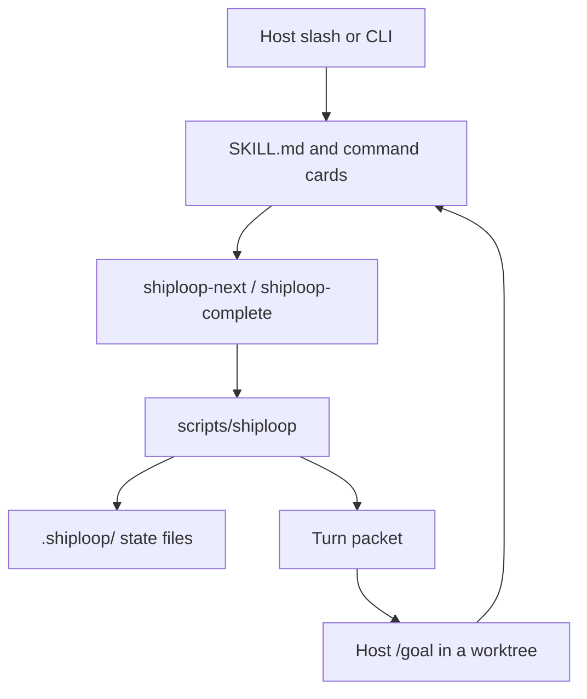

# ShipLoop

**Ship the project.** One session harness: survey the bound repo and tools,
researches applicable practices into `environment.md`, freeze a checkable spec,
sequence-plan once, then walk ready steps until the work is landed and a
walk-back HTML recap exists.

This is **not** DevLoop. `/devloop` still means skill `devloop`. ShipLoop never
invokes it, never captures `devloop-run`, never auto-merges, and never claims
engine `COMPLETE`.

Package leaf: `skills/shiploop`. Invoke: `/shiploop`. Version: **0.7.0**.

Canonical companions (do not duplicate their contracts here):

- [SKILL.md](SKILL.md) — host procedure
- [references/state-files.md](references/state-files.md) — SoT table and hashes
- [references/survey.md](references/survey.md) — survey + practices prefix
- [references/turn-packet.md](references/turn-packet.md) — packet headings
- [references/transitions.json](references/transitions.json) — legal phase edges
- skill-craft [docs/LOOP-ENGINEERING.md](../../docs/LOOP-ENGINEERING.md) — ShipLoop track

---

## How the pieces interact

```text
User / host
    │
    ├─ /shiploop            → commands/shiploop.md
    │                           exec scripts/shiploop init? then next
    ├─ /shiploop next       → commands/shiploop-next.md
    │                           exec scripts/shiploop-next
    │                           → execv scripts/shiploop next
    ├─ /shiploop complete   → commands/shiploop-complete.md
    │                           host commit+merge if this was a /goal
    │                           exec scripts/shiploop-complete
    │                           → execv scripts/shiploop complete
    └─ inject-step          → commands/shiploop-inject.md
                                exec scripts/shiploop inject-step
```

| Layer | Lives in | Role |
|-------|----------|------|
| **Skill card** | `SKILL.md` | When to use, three-branch init, never `/devloop` |
| **Slash / command cards** | `commands/shiploop.md`, `shiploop-next.md`, `shiploop-complete.md`, `shiploop-inject.md` | Thin host verbs. They do not implement the SM. |
| **Leaf wrappers** | `scripts/shiploop-next`, `scripts/shiploop-complete` | Refuse the wrong subcommand, then `execv` the harness |
| **Harness (stateless printer)** | `scripts/shiploop` | The only SM. Reads `.shiploop/`, checks hashes, claims steps, prints the packet. Does **not** invent implement `/goal` text. |
| **Activity prompts** | `references/activities/<phase>.md` | Exact Next-prompt body for every phase except in-flight implement (that prints each step’s stored `prompt`) |
| **Survey / packet / ledger contracts** | `references/survey.md`, `turn-packet.md`, `ledger-contract.md`, `state-files.md` | What the host must write; what the script shape-checks |
| **Sibling skills** | `dep_roots.backchain`, `dep_roots.review-coverage` | Plan calls **backchain** once. Residual calls **review-coverage** Phase B. Missing backchain is a Missing line, not a vendored copy. |

The harness is **file-driven**. After `init`, every command walks from cwd to
`.shiploop/`, loads `state.json`, re-checks frozen hashes, then either mutates
one artifact and reprints the packet, or refuses (exit 2). It does not call
host MCP APIs. It does not write the product tree except by creating per-step
git worktrees under `<repo>/.worktrees/`.



---

## Exhaustive workflow

Phases (from `transitions.json`; there is **no** `survey` / `setup` / `inject`
phase):

`intake → validate-spec → plan → implement → residual → done`
(or `halted` from residual). Any working phase can dest `blocked`.

### 0. Start or resume (three-branch init)

| Situation | Command |
|-----------|---------|
| No `.shiploop/state.json` | `python3 "$CLI" init --prompt "…" --repo PATH` |
| **New ask** on an existing run | `init --force --prompt "…" --repo PATH` (refused if `--prompt` is empty — **before** any wipe) |
| Lost context, **same** ask | `/shiploop next` (no `--force`) |
| Phase is `blocked` | Read `ask_user` / `resume_to`, then `update --to <resume_to> --reason "…"` |

`--force` wipes **session** files (`environment.md`, `spec.md`, DAG, receipts,
`recap.html`, leftover json twins). It does **not** delete the product tree
(app sources, product `README.md`).

`--implementer host` is the only legal implementer. `--implementer devloop`
fails closed.

### 1. Intake

Host writes the original ask to `.shiploop/prompt.md` (non-empty). No
`done_sentence` yet. Closer: `/shiploop complete` → dest `validate-spec`
(`need: prompt`).

### 2. Validate-spec — survey, then practices, then spec

One phase, **three jobs in order**. Guide: `references/survey.md`. Activity:
`references/activities/validate-spec.md`.

1. **Survey** the bound `repo_root` and this session’s tools. Write **one**
   file, `.shiploop/environment.md`: prose brief, then a unique H2 titled
   exactly `machine` with one fenced JSON object. Keys: `kind`, `augment`,
   `references`, `tools`, `mcp`, `mcp_considered`, `handles`, `initiation`,
   `ui`, `ui_craft`. **IF EXISTS** read product `README.md`, ADRs, CI,
   `AGENTS.md`, leftover `.specify/memory/constitution.md` — cite, do not
   invent. Do **not** write the product README here.
2. **Research practices** from the ask + that inventory. Pull URLs, in-repo
   paths, official docs, skill references, MCP resource URIs. If an MCP
   server or its tools **document how to use them**, that text is a
   reference — inventory alone is not enough. Append into the **same**
   `environment.md` (`references[{path, why}]`). No second SoT file. No
   secrets. No research skills in `dep_roots`.
3. **Write spec** `.shiploop/spec.md`: labeled `done_sentence:` and
   `checkable: true|false` exactly once at line start, outside fences. The
   spec’s **final product duty** is a README create (absent) or revise
   (present) — as a late DAG step in **plan**, not a validate-spec write.

**Blocked hatch (no new edges):** if a handle/UI question must be asked first,
write `spec.md` with `checkable: false` and `ask_user:`, then dest `blocked`
(`need` stays `spec_uncheckable`). dest blocked does not require
`environment.md`. dest **plan** requires a checkable spec, `environment.md`
shape, and no handle still `list` or `ask`. `create` is dest-plan-legal.

### 3. Plan

Spec and environment are **frozen**. Host calls sibling **backchain** once
and persists the DAG at `.shiploop/backchain/plan.json`. Every seed step
must have:

- `statement` — short diagnosis label
- `prompt` — **exact** inner-loop paste body (newlines OK; no `/devloop`)
- `produces` / `inputs` / `origin: seed`

Each `prompt` must cite the practice `references` from `environment.md` that
that step must use. Include prep / intermediate deploy / cleanup when implied,
and a **README create/revise as a late successor**. Then write `plan.md` /
`plan.json` wrappers (`done_sentence` must equal the spec). The wrapper
`step_ids` is a copy, not SoT.

dest `plan` **writes** `environment_sha256` / `spec_sha256` when empty (first
bind) and **verifies** them when set. It always clears `plan_sha256` and
receipts (replan hatch).

### 4. Implement

`/shiploop next` (and complete after a step) **claims** newly ready ids
`running` and creates `shiploop/<run_id>/<id>` worktrees under
`<repo>/.worktrees/` (hidden via `.git/info/exclude`).

**Next prompt** always starts with `Use this prompt as much as possible.`
Then the harness prints each **running** step’s stored `prompt` **verbatim**.
It does not compose a `/goal` from `statement` / `produces` / suppliers /
worktree. Worktree and branch appear only in **Look here** / **Diagnosis**.
`cd` there, paste the printed prompt into host `/goal`, do not edit the
session checkout.

Inner loop (host, not a phase): green-first or TDD (failing test first),
prefer `/goal`, then a verbose pathspec commit that records a **learning**.
Never `git add -A`.

When the `/goal` is done: **you** commit on the worktree and merge the kept
branch into the session checkout (`git merge --no-ff`). Then
`/shiploop complete`. The next worktree forks `HEAD`. ShipLoop does not
auto-merge. Failure: `--clear`. Hard stop: `--blocked --reason`.

**inject-step** (phase implement only, including drained): add a discovered
intermediate without dest `plan` (that would wipe receipts). Requires
`--statement`, `--prompt`, `--produces`. Pre-image: DAG bytes must still
hash to `state.plan_sha256`. `--before` is `todo` or `ready` only; appends
`{need: produces, from: new id}`. Write order: DAG → receipts → wrapper →
state last. Then `/shiploop next`.

When every step is `done`, implement is **drained** (a diagnosis, not a
phase). Next complete dests `residual`.

### 5. Residual

Session closer only. Run review-coverage Phase B for the bound plan under
`/goal` (one `/review-converge` per turn). Ledger: repo-root
`REVIEW_CONVERGE.md`. Do not treat a foreign or unlanded ledger as success.

When the ledger is `complete` and landed (or the plan has a real residual
waiver), write `.shiploop/recap.html`, then dest `done`. When the ledger is
`stopped (...)`, dest `halted`.

### 6. Done (or halted)

`recap.html` is the walk-back for someone who left and came back: **intent,
accomplished, materially changed, outcome, verified**. dest `done` refuses
a missing, empty, non-HTML, or briefing-thin file. `--force` unlinks it.
The file is **not** hashed.

---

## The turn packet

Every `next`, `complete`, and slash reprint prints this order after the
banner `shiploop — session harness (not DevLoop)`:

| H2 | What it is |
|----|------------|
| **You are here** | Session phases + implement step statuses (`todo` / `ready` / `running` / `done`). Then Diagnosis. |
| **Reminder** | Ask one-liner + frozen `done_sentence`. No body dump. |
| **Look here** | First line `Reference only — not the next action.` Phase-scoped paths only. |
| **Next prompt** | First line `Use this prompt as much as possible.` Then the stored prompt or the activity file. |
| **When done invoke** | `invoke /shiploop complete` (plus `--clear` / `--blocked` when that is the hatch). |
| **Missing** | Same gaps `update` would refuse. |

Look-here matrix (absolute path + one-line why):

| Phase | Pointers |
|-------|----------|
| intake | `state.json`, `prompt.md` (create), activity |
| validate-spec | prompt, `environment.md` (create), `survey.md`, `spec.md` (create), `state.json` |
| plan | frozen spec + environment, `backchain/plan.json` (create), `plan.md` / `plan.json`, backchain SKILL |
| implement | frozen spec, DAG, running `steps/<id>.json` + worktree, activity; environment / `plan.md` if-needed |
| implement-drained | spec, DAG, `implement-drained.md` |
| residual | ledger, bound plan, spec, review-coverage SKILL, `recap.html` (create) |
| done | `recap.html`, spec |
| blocked | `state.json` (ask/reason/resume), activity |

---

## State files (how they maintain the run)

Everything below is under the **run dir** (default: walk from cwd to
`.shiploop/`). Never inside this package. Detail:
[references/state-files.md](references/state-files.md).

| File | Who writes | What it is SoT for |
|------|------------|--------------------|
| `state.json` | every harness command | phase, `run_id`, `repo_root`, hashes, `dep_roots`, blocked/resume, bound plan |
| `prompt.md` | `init` | original ask |
| `environment.md` | host during validate-spec | survey + practices (prose + `## machine` JSON). Hashed as the whole file. |
| `spec.md` | host during validate-spec | labeled `done_sentence` / `checkable` / optional `ask_user`. Hashed as the whole file. |
| `backchain/plan.json` | host during plan; `inject-step` mutates | canonical DAG (`statement`, `prompt`, `produces`, `inputs`, `origin`) |
| `plan.md` | host during plan | human sequence + labeled `done_sentence` (may lag the DAG after inject) |
| `plan.json` | host / inject | wrapper only (`done_sentence`, `backchain` path, `step_ids` copy) |
| `steps/<id>.json` | `start-step` / complete / inject stamp | receipt: `running` or `complete`, worktree, branch, `plan_sha256` |
| `history.jsonl` | every command | append-only event log |
| `recap.html` | host before dest done | walk-back briefing (not hashed) |

There is **no** `environment.json`, `spec.json`, or `implement.json`.

**Same sentence, four surfaces (not four SoTs):** labeled `done_sentence` in
`spec.md` ≡ labeled line in `plan.md` ≡ `plan.json.done_sentence` ≡
`backchain.goal`. Drift is refused.

**Hashes**

- `environment_sha256 = sha256(environment.md)`
- `spec_sha256 = sha256(spec.md)`
- `plan_sha256 = sha256(backchain/plan.json)` (wrapper unhashed)

After first bind, editing spec or environment requires `blocked → validate-spec`
(clears all three hashes and receipts). `inject-step` rebinds `plan_sha256`
only and stamps existing receipts so completed work stays done.

**Product `README.md`** is **not** session state. It lives in the bound repo.
Survey reads it; the last DAG step writes it. Never put machine keys, handles,
or secrets there. `--force` never deletes it.

---

## Session A vs Session B

| | Session A — greenfield | Session B — brownfield |
|---|---|---|
| `environment.md` | `kind: greenfield`, `augment: false` | `kind: brownfield`, `augment: true`; cites existing README and app paths |
| Product `README.md` | created as the **last** product DAG step | revised as the **last** product DAG step |
| `initiation` | often `needed` + a `create` handle | often `none` or `done` (inspect an existing container) |
| Everything else | same SM, hashes, worktrees, stored prompts | same |

Handles are tool-agnostic (list → inspect, or dest blocked). Google Apps
Script is an example, not a script branch.

---

## CLI (harness)

```sh
CLI="$SKILL_ROOT/scripts/shiploop"
python3 "$CLI" init --prompt "…" --repo PATH [--force] [--bound-plan PATH]
python3 "$CLI" next
python3 "$CLI" complete [--id ID] [--clear] [--blocked --reason TEXT] [--resume-to PHASE]
python3 "$CLI" update --to PHASE [--reason TEXT] [--resume-to PHASE]
python3 "$CLI" status
python3 "$CLI" start-step --id ID
python3 "$CLI" complete-step [--id ID]
python3 "$CLI" clear-step [--id ID]
python3 "$CLI" inject-step --statement "…" --prompt "…" --produces "…" \
  [--id Sn] [--need NEED --from ID] [--before ID ...]
```

Host verbs: `/shiploop`, `/shiploop next`, `/shiploop complete`. Those exec
the wrappers, which exec the harness. `complete-step` / `update --to` / `--id`
are overrides. `capture` always fails closed.

| Exit | Meaning |
|------|---------|
| 0 | Success |
| 2 | Blocked (illegal edge, missing artifact, hash drift, empty `--force`, missing prompt, …) |
| 64 | Usage |

---

## Not this product

| You want | Use |
|----------|-----|
| DEFINE → PROVE → BUILD engine | skill `devloop` / `/devloop` |
| Offline freeze / prove / stop | `evidence-gates` |
| Residual×2 engine alone | `review-coverage` / `review-converge` |
| Sequence DAG authoring | sibling `backchain` (called from plan) |

---

## Install

From the skill-craft repo root:

```sh
./install.sh --skill shiploop
./scripts/sync-plugin-views.sh shiploop
```

If a host still has old `steer`, `steer-next`, or `steer-complete-next` skill
dirs, uninstall those and install `shiploop`. Old `.steer/` run dirs are not
adopted — start a new run (or rename the directory to `.shiploop` yourself).

---

## Tests

```sh
bash test/shiploop.test.sh
node test/skill-frontmatter.test.js
bash scripts/sync-plugin-views.sh --check
```

(`--check` may still fail on unrelated dirty plugin views such as `devloop`.)
