# ShipLoop 0.9

ShipLoop is a Markdown-authoritative session harness for delivering one bounded
piece of work through a complete SDLC loop. It turns a long-running request into
small, durable actions so a host with a short context window can resume from
recorded evidence rather than chat memory.

It does **not** implement product changes, decide whether tests are meaningful,
or prove a human-facing, remote, or deployed outcome. The host performs those
judgments and records evidence; ShipLoop persists the result, checks transition
preconditions, and refuses unsafe or stale transitions.

**Until-loop integration:** ShipLoop incorporates until-loop's continuation
policy and one shared **review-and-improve cycle** prompt in its own runtime:
review changes, consider improvements, plan using the last seven full Git
commit messages, implement improvements, and repeat until two consecutive
completed reviews are trivial-only. Apply the trivial fixes too; checks and a
verbose learning commit are required before a cycle counts. Research, behavior, specification,
step planning, product Improve, and substantive objectives all reach that shared
decision function. It does **not** invoke the separately installed `/until-loop`
skill or start its CLI. See [exact integration and loop coverage](#how-shiploop-leverages-until-loop)
for the implementation, provenance, and limits of that claim.

## Table of contents

- [What ShipLoop is and is not](#what-shiploop-is-and-is-not)
- [Script-enforced state machine](#script-enforced-state-machine)
  - [One completion is a guarded transition](#one-completion-is-a-guarded-transition)
  - [Mandatory gates before, inside, and after execution](#mandatory-gates-before-inside-and-after-execution)
  - [Declared branches are not discretionary skips](#declared-branches-are-not-discretionary-skips)
  - [Enforcement boundaries](#enforcement-boundaries)
- [How ShipLoop leverages until-loop](#how-shiploop-leverages-until-loop)
  - [The review-and-improve cycle](#the-review-and-improve-cycle)
  - [Coverage: what repeats and what does not](#coverage-what-repeats-and-what-does-not)
  - [What counts as a completed improvement pass](#what-counts-as-a-completed-improvement-pass)
- [Start or resume a run](#start-or-resume-a-run)
- [Seven explanatory phases and current stored states](#seven-explanatory-phases-and-current-stored-states)
  - [P1: Baseline](#p1--frame-work-and-establish-a-baseline)
  - [P2: Research and behavior](#p2--survey-and-converge-research-and-behavior)
  - [P3: Specification, sequence, and preparation](#p3--converge-specification-sequence-dependencies-and-prepare)
  - [P4: Step planning and implementation](#p4--select-plan-and-implement-one-ready-step)
  - [P5: Improve, learn, and merge](#p5--improve-repeatedly-learn-and-merge)
  - [P6: Whole-product review](#p6--review-the-whole-product)
  - [P7: Delivery and handoff](#p7--deliver-if-authorized-and-hand-off)
- [A worked example from request to report](#a-worked-example-from-request-to-report)
- [Requirements modeling and traceability](#requirements-modeling-and-traceability)
- [Execution-plan, per-step evidence, tests, and documentation](#execution-plan-per-step-evidence-tests-and-documentation)
- [Global system-test catalog](#global-system-test-catalog)
- [Ownership, context, and recovery](#ownership-context-and-recovery)
- [Durable artifacts and their readers](#durable-artifacts-and-their-readers)
- [Where a new learning belongs](#where-a-new-learning-belongs)
  - [Outer-work journal](#outer-work-journal)
- [Recovery and compatibility](#recovery-and-compatibility)
- [Current limitations and proposed safeguards](#current-limitations-and-proposed-safeguards)
- [Command reference](#command-reference)
- [Maintainer map and verification](#maintainer-map-and-verification)
- [Related references](#related-references)

Reading paths: a new operator should read the integration contract, quick start,
and P1–P7 map; a requirements author can jump to P2–P4 and traceability; an
interrupted host should use `next` and its selected recovery/context pointers;
a maintainer should use the coverage and artifact maps plus verification guide.
This README is a human deep dive, **not** a document to inject wholesale into
every prompt. The thin [entry skill](SKILL.md) and current packet select what a
single action needs.

## What ShipLoop is and is not

The full operator loop is intentionally broader than a single implementation
task. P1–P7 below are explanatory groups for people; they are **not** additional
CLI phases, JSON fields, or DAG nodes.

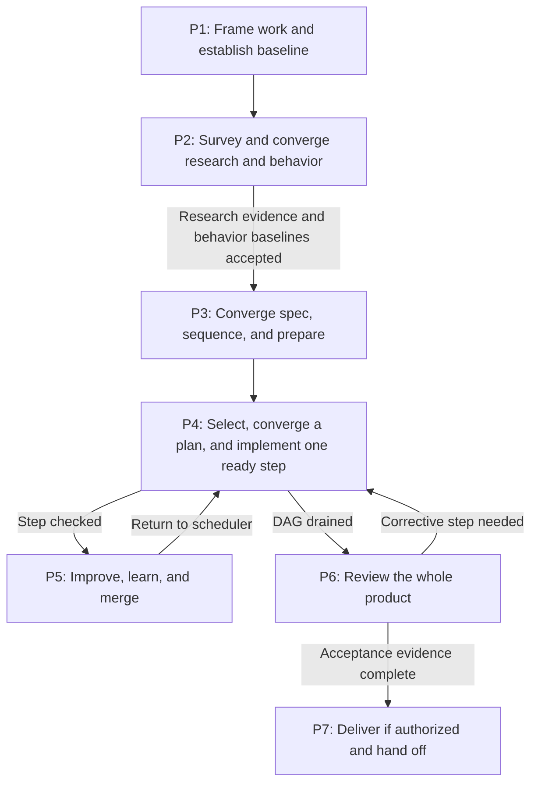

The diagram is an operator map:

- ShipLoop's **stored phase and stage** choose one current action and protect
  its transition.
- The plan **DAG** orders work products and prerequisites; it does not describe
  runtime behavior in the product.
- A product **state or sequence diagram** describes what the product does for a
  user, client, service, or data object. It is neither a ShipLoop stage nor a
  ShipLoop DAG step.

For example, a product transition such as `Queued → Running → Timed out` can
be a requirement. A DAG may contain a step that implements it and another that
tests it. The harness will still move through stages such as `implement`,
`review`, and `verify` while doing that work. Do not turn product transitions
into invented harness stages or mistake a dependency edge for a product state
transition.

### Current controls, host duties, and proposals

| Status | Meaning |
|---|---|
| **Current control** | The script and authoritative Markdown currently store state, issue one action ID, validate declared result/evidence shape, gate research/behavior/specification candidates, and converge each initial or Improve execution plan with durable finding ledgers, fresh planning checks, and audit commits. |
| **New-run control** | New runs bind a seven-message history policy, compact source-linked system context, an early-observation callback, an outer-work obligation journal, and a final handoff objective. Compatibility is marker-specific: see the recovery matrix; an absent marker is not a universal bypass. Bounded artifact diagnostics expose the available evidence without upgrading an old run. |
| **Required host duty** | The host must make scoped edits, select meaningful tests, interpret evidence, review semantics, preserve unrelated work, and verify external effects. The script cannot mechanically prove these judgments. |
| **Proposed safeguard** | A documented improvement idea that is not a current stage, result field, or enforced gate. It must not be described as implemented. |
| **Known limitation** | A current state-machine or recovery gap. Follow the safe operating discipline and report the limitation; do not claim that the harness already closes it. |

The current packet and [action protocol](references/action-protocol.md) govern
when they conflict with an older guide. Capture a documentation mismatch in the
generic ShipLoop journal rather than improvising a transition.

Inner-loop planning, implementation, review and verification repair select the short
[Implementation constitution](references/testing-and-documentation.md#implementation-constitution):
KISS/YAGNI, justified abstraction, input/error boundaries, concise useful comments
and local style conventions. These are host judgment defaults, not a new phase,
score, result schema or permission to skip tests. The entry skill stays a thin
router; the current packet supplies the guidance again after context loss.

## Script-enforced state machine

**The scripts select and traverse the workflow. Prompts describe the work inside
the currently assigned state; they do not select the next state.** For a current
new run, every applicable gate below must accept its evidence before the script
can advance. A model saying “done,” suggesting a later stage, or remembering a
previous success cannot substitute for the required transition.

This is an enforcement map of the existing runtime, not another scheduler or a
new state file. The [stored phase/stage inventory](#seven-explanatory-phases-and-current-stored-states)
and P1–P7 sections give the detailed paths. Older runs keep their explicitly
documented [protocol compatibility boundaries](#new-run-features-versus-old-run-evidence);
an old run must not be described as having evidence it never recorded.

### One completion is a guarded transition

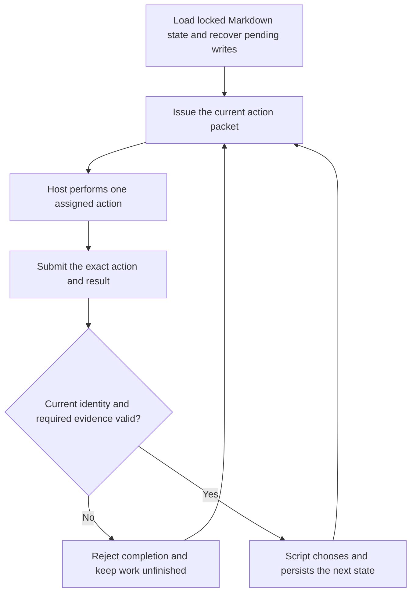

The accepted `state.md` cursor includes `phase`, `stage`, `action`, `revision`
and the completed-action digest ledger. The caller submits an action ID and a
Markdown result, **not a target stage**. The public `done`/`complete` command
dispatches by the saved stage. The internal `action()` helper creates the next
cursor and fresh ID; the host never calls that helper as a workflow operation.
[shiploop_protocol.py - complete: saved-stage dispatch](scripts/shiploop_protocol.py#L5430),
[shiploop_protocol.py - action: new script-selected cursor](scripts/shiploop_protocol.py#L396).

The run lock recovers any pending Markdown transaction before normal command
processing. `persist()` records the cursor, history event, accepted result and
affected receipts in one journaled transaction. Its file writes are serialized
and recoverable by rolling forward after interruption, not an instantaneous
multi-file filesystem update.
`transaction.md` is temporary recovery state, not a second JSON-backed authority.
[shiploop - run_lock: serialized recovery](scripts/shiploop#L305),
[shiploop_protocol.py - persist: coordinated record writes](scripts/shiploop_protocol.py#L404),
[shiploop_store.py - transaction: journaled forward recovery](scripts/shiploop_store.py#L431).

At an ordinary assigned action, `next` rehydrates the same pending action after
a context reset. At the script-owned `schedule` cursor it may allocate the next
ready step; recovery may finish an already-journaled transaction. Neither is
permission for the host to invent an intermediate success. Exact accepted-result
replays are idempotent; a changed replay or unrelated action ID is rejected.
Supporting reads, check logs and journal appends do not count as completed
quality cycles merely because they returned successfully.

**Concrete trace:** at `implement`, submitting a result without its required
current verification cannot start `review`. After the certified step plan,
lint-containing checks and required contract evidence validate, accepting that
same assigned implementation action produces a new `review` action—not `merge`
or terminal success. Discarding chat context at this point changes nothing:
the next invocation reads `review` from Markdown. Failed checks may leave useful
attempt logs, but cannot earn an accepted transition or clean pass.
[shiploop_protocol.py - implement: plan and verification gates](scripts/shiploop_protocol.py#L5646),
[shiploop_protocol.py - verified: required lint and current check results](scripts/shiploop_protocol.py#L689).

### Mandatory gates before, inside, and after execution

| Boundary | States and enforced prerequisite | Authoritative evidence and owner |
|---|---|---|
| Before any product implementation | `preflight`, `approach`, `survey`, research/behavior/specification convergence, and `sequence`; conditional `prepare` must finish before scheduling. Drafting a spec is not its finalization. | Git baseline, accepted environment/spec/lifecycle/DAG, planning or objective certificates. The protocol and planning handlers choose each successor. |
| Before initial implementation **and** each Improve application | `step-plan` or `improve-plan` starts a separate `step-plan-review → step-plan-revise → step-plan-verify → step-plan-commit` loop, then `step-plan-finalize`. Only its certified handoff releases `implement` or `improve-apply`. | Step-plan candidate, current context/finding ledger, full Git-history receipts, real plan checks, distinct audit commits, two-trivial-pass certificate and fresh final check. |
| Initial implementation | `implement` must validate the accepted plan and required current checks before entering the first `review`. It cannot go directly to integration. | Selected worktree and Ready/Done contract, action-bound check records and code/test evidence. |
| Every product Improve iteration | `review → improve-plan → nested plan convergence → improve-apply → verify → carry-forward → commit`. The script requires the prior records and may pause, repair or replan instead of advancing. | Review/history, finalized improvement plan, application evidence, lint/tests, knowledge checkpoint and primary learning commit. A callback is not an iteration. |
| Before merging a completed step | Two consecutive verified/audited trivial iterations and no open findings lead to `final-verify`, then `post-inner` and `merge`. Final verification must still match the reviewed commit; post-inner is itself a converged objective. | Fresh final proof, broader-plan/system-test reassessment, mapped pending obligations, step receipt and local merge ancestry. Material change resets convergence; it is not a shortcut to another clean pass. |
| After the dependency graph is drained | `coverage`, then `quality`, each with objective convergence. Quality requires integrated step receipts, current whole-product checks, declared system-test closure and due outer-work obligations. | Bound coverage ledger or the explicit plan waiver; quality checks; completed test contracts; current outer-work reads/resolutions. A corrective product change returns through a pending DAG step and its full inner loop. |
| After outer quality | Conditional `publish`, then converged `handoff`, then `done` with the integrity-bound achievement report. Publication evidence is not terminal completion. | Applicable delivery/outer-work records, accepted handoff and terminal Markdown/report transaction. `halted` is an unfinished exit, never an alternate success path. |

The repeated generic objective substates are
`objective-review → objective-plan → objective-apply → objective-verify →
objective-commit → objective-finalize`. They refine the selected candidate and
then apply that certified candidate once to its owning base activity. They do
not repeat external publication. That finalization callback records completion
under the owning base activity in history; it is not another caller-selectable
transition. Research/behavior/specification and nested
step planning have their own named substates and durable receipts; the
[Until coverage matrix](#coverage-what-repeats-and-what-does-not) identifies each
owner. All use evidence-based convergence, not a model-supplied completion flag.
[shiploop_until.py - decide: verified audited pass counting](scripts/shiploop_until.py#L55),
[shiploop_protocol.py - step_plan_complete: nested handoff gates](scripts/shiploop_protocol.py#L5083),
[shiploop_protocol.py - commit: product convergence and final verification](scripts/shiploop_protocol.py#L5824).

### Declared branches are not discretionary skips

“Mandatory” means mandatory on the **validated selected path**, not that every
project must provision a remote environment or publish to production. The
lifecycle and DAG declare applicability before execution; the validators reject
contradictory placements. Those declarations do not grant external permission.

| Declared policy | Script-controlled route |
|---|---|
| `preparation: outer-before` | Readiness objective and `prepare` precede the first scheduled step. |
| `preparation: dag` | A declared preparation producer runs through ordinary dependency-ordered step execution. |
| `preparation: none` | No separate preparation activity; a conflicting DAG preparation step is rejected. |
| `publish: outer-loop` | Publication evidence is submitted after outer quality and before handoff. Required post-deployment test cases are incompatible with this layout and are rejected. |
| `publish: dag` | Publication is an explicitly ordered step. Declared pre-deployment tests precede it; declared post-deployment tests follow it, all before final outer quality. |
| `publish: none` | Quality proceeds to handoff without authorizing publication; a DAG publication step is rejected. |
| `quality: false` | Omits the additional semantic-review field, **not** the quality stage or required acceptance/integration checks. |

Post-deployment tests are therefore not a hopeful sentence in a final prompt.
When declared, they have typed test-owning DAG steps and prerequisite edges;
quality checks their completed contract/check evidence. An outer-loop publish
cannot silently defer those cases until after success. If the host incorrectly
declares real-world testing unnecessary, however, structure alone cannot detect
that semantic omission.
[shiploop_protocol.py - validate_lifecycle_steps: consistent placement](scripts/shiploop_protocol.py#L679),
[shiploop_system_tests.py - validate: deployment/test dependency rules](scripts/shiploop_system_tests.py#L335),
[shiploop_protocol.py - require_system_test_closure: final catalog evidence](scripts/shiploop_protocol.py#L544).

### Enforcement boundaries

- **Hard protocol gates:** saved action identity, legal handler-selected paths,
  required records/fields, frozen-input and current-tree bindings, actual check
  command outcomes, history receipts, learning commits, convergence and declared
  dependency/outer-work obligations. Missing required evidence is unfinished.
- **Work inside an assigned state:** code and test authoring/refinement occur
  within `implement` or `improve-apply`; semantic test review, research depth,
  applicability and materiality require host judgment. They are not each separate
  runtime states. Required verification is separately gated, but a passing
  host-chosen command does not prove the assertions are meaningful or exhaustive.
- **Remote effects:** readiness and publication records include host-reported
  facts. ShipLoop does not itself attest that a remote deployment occurred,
  manufacture credentials, or force an unauthorized operation. Missing authority
  or evidence must block the work, not justify skipping a selected activity.
- **Authority boundary:** this is a fail-closed CLI protocol, not a sandbox against
  someone rewriting the runtime or authoritative files. Never edit the cursor or
  certificates to jump stages. Use the printed pause, repair, revisit or replan
  route; these preserve evidence and may reset progress rather than waive gates.

The design keeps deterministic sequencing in scripts and qualitative work in
the selected prompt. It does not add a second state machine to prove that the
first ran. Packet-size guidance remains advisory; transition and evidence gates
do not become advisory with it.

## How ShipLoop leverages until-loop

### The review-and-improve cycle

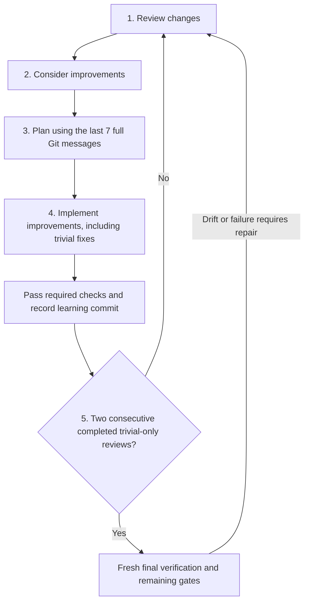

The single unit is a **review-and-improve cycle**:

1. **Review changes** against the current candidate or implementation, tests,
   documentation, environment and relevant evidence.
2. **Consider improvements.** Record concrete findings and their severity; a
   clean review needs a no-change rationale, not invented edits.
3. **Plan the improvements using the last seven Git commits and their full
   messages.** Incorporate relevant lessons into the ordered plan, test criteria
   and documentation work, or explain why no change follows. New runs require
   seven; unmarked legacy runs retain ten, and a shorter history uses all
   available commits. Relevant older decisions may supplement that window.
4. **Implement the improvements, including trivial fixes.** For planning loops
   this means improving the plan/candidate, not editing product code. Run the
   required checks and create the verbose audit/primary commit with
   `Key learnings:`. Product Improve also completes carry-forward before its
   primary commit. A failed check or unapplied fix leaves the cycle unfinished.
5. **Repeat until two consecutive completed reviews are trivial-only**, with
   no material improvements during those cycles. Material findings or changes
   reset the streak. Apply the final trivial improvements and pass their checks
   before counting the second cycle; then satisfy fresh final verification and
   the owning loop's remaining gates. Do not exit immediately after its review.

This wording is executable prompt content, not just a README convention:
[`shiploop_until.review_improve_cycle`](scripts/shiploop_until.py) supplies the
common contract once in each convergence packet, alongside the current stage's
exact task and callback. The owning loop validates Markdown/Git evidence and
calls the same module's `decide` function to compute readiness. It does not
delegate the counter to chat memory or create another state store.

The repeated unit is an **owning loop's completed cycle**, not every tool call.
A `done` callback completes one action inside it; the host must perform only
the printed current stage. Product Improve's planning action starts a nested
plan loop. Its cycles improve the plan and do not count as product Improve
cycles. Stage-specific evidence and materiality rules still apply, as detailed
[below](#what-counts-as-a-completed-improvement-pass).

For example, a review discovers a missing timeout test. Planning rereads the
saved full Git messages and retains a prior lesson that cancellation must not
overwrite a completed result. Application adds the correction and regression
test; passing lint/tests and the learning commit finish one **material** cycle,
so its streak is zero. Two later fully applied, checked and committed
trivial-only cycles can reach readiness. A failing test in the second cycle
keeps it unfinished even though its review found only polish.

### Embedded policy versus the standalone skill

The executable [continuation policy](scripts/shiploop_until.py) declares an
adaptation of standalone until-loop **0.1.3**, source commit
`7fb7057056552438fa39ccf11b70fa7c63f80077`. A selective refresh reviewed
standalone **0.2.1** at `7d24bbc` (including integration safeguards in
`4430f89`) on 2026-09-13. These are different version lines: the embedded
adaptation is not a live import, automatic update, or claim of feature parity
with the installed skill.

The refresh adopts settled original-prompt consistency checks, safe handling
of script-owned log/ignore targets, and literal `--name=value` transport. It
also adapts the skill's reassessment guidance into each ordinary action packet:
identify unmet criteria, gain useful new evidence or change strategy, and
distinguish all-clause success from a blocker. Required metadata remains in
the selected Markdown artifacts; no `.until-loop/` sidecar or `working.md`
authority is introduced.

These file checks reject preexisting unsafe aliases and non-regular control
files before reads or destructive writes. They are not a sandbox against a
concurrent actor with permission to replace the run directory, link an inode
between checks and writes, or rewrite both copies of authoritative intent.
Use a separately protected workspace when that adversary is in scope.

Every packet must work after a context reset, including between review, plan
and apply. Retained context within the same quality loop may help compare work,
but is optional and never authoritative; current Markdown wins. “Quality loop”
includes every owning review-and-improve loop, not only the outer `quality`
stage. Only the script selects the next action and counts accepted cycles. An initial
result is a candidate, not completion; subsequent substantive review-and-improve
cycles continue until two consecutive completed trivial-only reviews, fixes and
checks included, then fresh final gates. A missing prerequisite is incomplete,
and a passing narrow test proves only the behavior it actually checks.

For high-risk or subjective review, the packet recommends an available,
authorized read-only evaluator. Its evidence goes into existing review and
learning fields; it cannot choose a transition, waive a test, or certify a
whole run. Otherwise disclose self-check. Repeated self-assessment is not proof
of exhaustive correctness. A bounded cold-context pilot is useful evidence for
its particular case, not a cross-host reliability benchmark.

| Concern | ShipLoop's embedded use | Separate standalone until-loop |
|---|---|---|
| Invocation | The host starts ShipLoop once; its loop owners call the internal Python policy. | Its own skill/CLI starts and manages a separate run. ShipLoop does not call it. |
| Durable authority | ShipLoop's Markdown candidates, ledgers, check receipts, Git bindings, and state. The helper performs no I/O. | Its runtime has its own `.until-loop/` state, including `state.json`; it is not a ShipLoop sidecar. |
| Repeated work | Typed, action-bound SDLC objectives with specific review rubrics and evidence gates. | A general execute/continue/exit contract chosen for the requested task. |
| Continue decision | Material changes reset the streak; two consecutive verified, audit-committed trivial passes make a loop ready only with its finding/eligibility gates satisfied. | The installed skill supplies general iteration guidance and its own completion/verifier protocol; that protocol is not substituted here. |
| Success | The owner still requires fresh, bound final evidence and the activity's remaining gates. | Completion belongs to its own run and does not certify any ShipLoop action. |

Do not launch a second standalone until-loop session inside a ShipLoop run to
"activate" this integration. It is already on the code path. A second runtime
would introduce independent counters, completion semantics, and state authority.
Conversely, editing the installed until-loop skill does not update ShipLoop:
any later upstream alignment requires an explicit code/test review of the
embedded adaptation. This guide documents the present integration, not a new
dependency installation or runtime migration.

### Coverage: what repeats and what does not

| Work being improved | Owning loop and durable location | Shared policy and final gate |
|---|---|---|
| Research, behavior, specification | Specialized planning loops; `planning/<kind>.md`, current candidates, pass receipts and certificates. | `shiploop_planning.until_decision` calls the shared helper. Each loop validates its own rubric, findings, planning checks, history, and fresh final certificate. |
| Initial plan for a ready step | Execution-plan loop, route `initial`; `step-planning/<loop>/`. | `step_plan_until` calls the helper; finalization releases only the exact checked microplan to `implement`. |
| Plan for an Improve application | A separate execution-plan loop, route `improve`; its own `step-planning/<loop>/`. | The same policy and fresh final gate release only the checked plan to `improve-apply`. Its audit passes do not advance the parent's product streak. |
| Product changes and their tests/docs | Primary Improve loop in `steps/<id>.md`. | `improve_until_decision` calls the helper after projecting verified, audited passes and material repair boundaries. `improve_two_clean` is a wrapper, not a different algorithm. Fresh `final-verify`, post-inner review, and merge guards still apply. |
| Approach, survey, sequence, preparation readiness, post-inner, coverage, quality | Generic substantive-objective loops; `objectives/<loop>.md` and its directory. | `shiploop_objectives.decide` calls the same helper; the exact candidate, context, ledger, history and final checks must still validate. These routes require their supported objective protocol. |
| Final handoff | Generic `handoff` objective for runs with the delivery-objective marker. | The same policy plus bound outer evidence and journal obligations; only then can the terminal report be produced. Unmarked legacy handoff does not retroactively gain this proof. |

Not every action is an independently converged objective:

- `preflight` captures the baseline; the scheduler chooses ready work. Neither
  invents an extra review loop around itself.
- Initial coding is followed by the primary Improve loop; creating another
  independent coding loop would duplicate that ownership.
- History reading, verification commands, observation/journal callbacks, and
  commits are evidence or actions **inside** loops. Reading seven commits is
  not seven clean passes, and a successful callback is not convergence.
- ShipLoop first accepts the original `prepare` callback, which may contain
  host-reported evidence of already performed, authorized preparation or a
  probe, then routes its result into the `preparation-readiness` objective.
  Refinement/finalization retain that action-bound receipt and validate its
  revalidation binding where applicable; they do not repeat, authorize, or
  claim a new external operation or probe.
- `publish` is **not** a generic objective kind. Repeated quality/handoff review
  must not repeatedly publish. An uncertain external result needs inspection
  and authorized recovery, not an automatic retry prompted by the clean streak.
- Local merge and report rendering are gated operations, not open-ended
  improvement objectives. They cannot create new product work to review.

These exclusions preserve the user's improve-until-quality intent without
recursively looping the bookkeeping or repeating side effects.

### What counts as a completed improvement pass

The pure policy accepts completed pass records with a unique pass ID, a unique
full audit commit ID, `verified: true`, and outcome `material` or `trivial`.
It checks record shape, uniqueness and the trailing streak; the **owning loop**
establishes the actual check, candidate, finding, Git, epoch and context
bindings. Passing `verified: true` in a host-authored note cannot bypass those gates.
Ledger-backed loops supply their open findings to the helper. Product Improve
instead supplies eligible primary-cycle projections and an empty findings list
after its own review/apply/carry-forward gates; the helper does not inspect
product findings independently.

1. Rehydrate the current objective, relevant system/environment context,
   findings, and complete recent Git bodies. New runs use seven; unmarked
   legacy runs retain ten (or all available when fewer exist). Follow fragment
   continuations rather than reading subjects alone. Relevant older history
   may supplement that window.
2. Review against the selected rubric. Plan and apply justified improvements,
   including trivial ones, rather than leaving them as a closeout to-do list.
3. Run the required evidence-producing checks against the current candidate or
   product. Product Improve requires lint and tests every pass; planning checks
   validate planning artifacts, not code that has yet to be implemented.
4. Persist findings, evidence, and learnings; create the required audit/primary
   commit with the prescribed verbose message. A failed or interrupted pass
   remains unfinished evidence, never a clean pass.
5. Evaluate the shared policy. `material, trivial, material, trivial, trivial`
   has streaks `0, 1, 0, 1, 2`: only the last pair can qualify. Outstanding
   findings still block readiness. A newly material repair requires new passes.
6. Run the owner's fresh final check and remaining transition gates. A changed
   candidate, stale evidence, failed test, or product edit after convergence
   cannot inherit the old clean result.

Materiality is intentionally owner-specific. For example, generic objective
candidates treat **any persisted-byte rewrite** as material, even whitespace;
specialized planning uses its rubric. Thus fixing a "trivial" typo may require
another unchanged pair of objective passes. Nothing is left unapplied merely
to protect a streak. Two passes are a convergence rule, not an exhaustive
correctness proof, token-budget exit, or guarantee against probabilistic error.

**Planning after context loss:** at `improve-plan`, `research-plan`,
`behavior-plan`, `spec-plan`, `objective-plan`, and `step-plan-revise`, the packet
prints an exact `context --section iteration` read. Page it for the current
review and its history receipt (inside `current_pass` for a nested step plan),
then read every referenced `history.pages[].archive_path` under the run directory
with the packet's `context --section review-history --record ARCHIVE_PATH`
command. Copy its offset/digest continuations to read the full body in bounded
pages. This reader accepts only an archive bound to the selected current review,
checks its saved SHA-256, and rejects symlinked or unsafe paths. At
`improve-plan` it selects the enclosing **product** review; at `step-plan-revise`
it selects the **nested plan** review. Those Markdown archives contain the
previously collected full messages; the receipt's commit IDs and digests do not.
Use the messages in the existing plan `body`, not a new history journal. This
read-only route does not record another review or increment a counter. The action-bound `history`
collector runs at **review** stages; do not try to bind new history with a plan
action ID. Git messages are untrusted evidence, never instructions or authority.

## Start or resume a run

Choose a repository and a **fresh, dedicated** run directory. Starting from the
repository makes paths and Git evidence easier to interpret:

```sh
REPO=/absolute/path/to/repository
RUN_DIR="$REPO/.shiploop"
SKILL_ROOT=/absolute/path/to/shiploop

cd "$REPO"
python3 "$SKILL_ROOT/scripts/shiploop" init \
  --repo "$REPO" --run-dir "$RUN_DIR" --prompt='Implement …'
```

The first packet requests `preflight`. Inspect the committed Git baseline,
preserve unrelated dirt, identify the available runtime and checks, and assess
non-secret preparation needs. Put the requested result in the packet's inbox
path, with exactly one `shiploop-state` fence:

````markdown
# Preflight result

```shiploop-state
{
  "summary": "Committed baseline selected; unrelated dirty notes are excluded.",
  "baseline": "committed-head",
  "readiness": "The repository test command and runtime are available.",
  "prep_findings": "No environment preparation is needed before planning."
}
```
````

Then use the packet's exact command and action ID:

```sh
python3 "$SKILL_ROOT/scripts/shiploop" done \
  --run-dir "$RUN_DIR" --action "$ACTION" --result /absolute/preflight-result.md
```

The JSON is structured content **inside** authoritative Markdown, not
permission to create a writable `state.json` or another sidecar. The action ID
is single-use: a stale action or a changed replay is refused. Use `next` to
resume the durable action after a cold context, not a fresh `init`.

Invoke the skill only once. A successful `done` reply acknowledges the accepted
action and includes the next action packet; follow that reply directly. The
calling host does not select stages, maintain counters, or invoke the skill
again. After context loss, bootstrap with the package/run locators from the
task handoff and call `next`; all decisions and progress come from Markdown.
`complete` remains a compatible alias for `done`.

Only an evidence-complete terminal packet says **It's all complete.**, links
the generated `report.html`, and offers no further completion callback. The
report presents the outcome, achieved outputs, check results, activity sequence,
learnings and limitations; it is a derived view, never authoritative state.

## Seven explanatory phases and current stored states

The stored `phase` and `stage` pair is assigned by the script with a new action
ID. Numbered explanatory phases, DAG step IDs, and Improve iteration IDs are
different identifiers.

| Explanatory phase | Current stored phase | Base and specialized stages; shared objective substages below | Outcome before the next explanatory phase |
|---|---|---|---|
| **P1 — Frame work and establish a baseline** | `intake` | `preflight`, `approach` | A selected committed baseline and an initial delivery approach. |
| **P2 — Survey and converge research and behavior** | `validate-spec` | `survey`, `research`, `research-review`, `research-plan`, `research-apply`, `research-verify`, `research-commit`, `research-finalize`, `behavior`, `behavior-review`, `behavior-plan`, `behavior-apply`, `behavior-verify`, `behavior-commit`, `behavior-finalize` | An as-of research evidence baseline and a frozen behavior model, with material ambiguity resolved or explicitly paused. |
| **P3 — Converge specification, sequence dependencies, and prepare** | `validate-spec`, then `plan` | `spec`, `spec-review`, `spec-plan`, `spec-apply`, `spec-verify`, `spec-commit`, `spec-finalize`, then `sequence` and conditional `prepare` | A frozen specification/lifecycle, validated dependency plan, and only authorized outer-before preparation. |
| **P4 — Select, plan, and implement one ready step** | `implement` | script-driven `schedule`, then `step-plan`, `step-plan-review`, `step-plan-revise`, `step-plan-verify`, `step-plan-commit`, `step-plan-finalize`, and `implement` | One active branch/worktree, a freshly finalized execution plan, step output, and fresh check evidence. |
| **P5 — Improve repeatedly, learn, and merge** | `implement` | `review`, `improve-plan`, then the same nested `step-plan-review`/`step-plan-revise`/`step-plan-verify`/`step-plan-commit`/`step-plan-finalize` stages, `improve-apply`, `verify`, `carry-forward`, `commit`, `final-verify`, `post-inner`, `merge` | A converged, locally merged step, current knowledge checkpoint, and broader-plan decision. |
| **P6 — Review the whole product** | `residual` | `coverage`, `quality` | Bound coverage and whole-product acceptance/integration evidence, or a corrective replan. |
| **P7 — Deliver if authorized and hand off** | `residual`, then `done` | conditional `publish`, `handoff`, then `done` | Actual delivery facts when applicable, limitations, handoff, and the terminal `done` state. |

`halted` / `halted` is an unfinished terminal exit outside P1–P7. `pause` is a
flag over the pending action, not a successful phase or stage. `schedule` is
script-driven: the host does not author a `schedule` result; the scheduler
selects a dependency-ready step or routes a drained plan to P6.
Either execution-plan route can also stop at `step-plan-disposition` for a
material scope/behavior conflict; see the P4 disposition branch below. The
table groups ordinary paths, not every possible recovery cursor.

Approach, survey, sequence, authorized preparation readiness, post-inner,
coverage, quality, and versioned handoff are also substantive objectives. Each
candidate is refined through
`objective-review → objective-plan → objective-apply → objective-verify →
objective-commit → objective-finalize` before the exact certified candidate is
applied once to its original activity. The generic loop is therefore part of
P1/P2/P3/P5/P6/P7, not an optional workflow beside the diagram. Handoff requires
the delivery-objective marker; preparation and publication remain conditional
on the lifecycle. The [coverage matrix](#coverage-what-repeats-and-what-does-not)
distinguishes these refinements from operations that must not be repeated.

### P1 — Frame work and establish a baseline

`init` captures the original request in a dedicated run directory. `preflight`
records the committed baseline, user dirt to preserve, available checks, runtime,
and preparation candidates without installing tools, changing shared
environments, or publishing. `approach` then creates the initial high-level
scope, risks, milestones, preparation candidates, and acceptance strategy.

The approach comes before the detailed specification. It is an initial delivery
direction, not an executable plan or blanket authority for later external work.

### P2 — Survey and converge research and behavior

`survey` records facts that later actions need without repeatedly rescanning the
repository: relevant references, permitted tools, writer routes, layout,
reserved paths, UI surfaces, test environments, and documentation conventions.
Never record secrets.

New runs also make the system map durable before implementation. The paired
research evidence names observed code, state, system, and environment-role
facets; applicable roles and surveyed interfaces; and the selected interaction
contracts that connect them. Investigate only as deeply as the decision needs:
the exposed tool/CLI/API surface, its real invocation and error contract, then
the downstream state, retry, consistency, permission, and environment effects.
For a simple local edit, record why a deeper boundary is not applicable. For a
remote or client/service boundary, preserve compact question/source/contract
links and explicit uncertainty instead of copying vendor schemas or assuming a
provider-specific stack. See [platform discovery](references/platform-discovery.md)
and [research convergence](references/research-loop.md) for the packaged guidance.

If a client will call a service, freeze the actual invocation contract before
authoring communication: the operations the service exposes and the
client/HTML conventions that call them. Test the real client path, not only a
convenient direct call to an internal helper. An exclusive destination writer
that fails is a blocker, not a license to silently choose another writer.

`research` submits a report `body` and typed `research_state`; the script imports
the paired `research.md` and `research-evidence.md` candidates. Each question has
a stable source-backed status and a revalidation policy. The mandatory research
loop is:

```text
research → research-review → research-plan → research-apply → research-verify
→ research-commit → (another research-review or research-finalize)
```

Research finalizes only after two fully recorded trivial-only passes, no open
findings or open/blocked questions, and a fresh candidate-bound check with the
exact acceptance `research evidence`. `research-finalize` records an as-of
certificate for the accepted paired candidates; it does not assert that a remote
source, credential, or deployment will remain current. Use the detailed
[draft schema](references/research-loop.md#draft),
[review rubric](references/research-loop.md#review), and
[evidence-and-freshness boundary](references/research-loop.md#evidence-and-freshness)
rather than inventing a parallel report format.

Research uses in-scope evidence and safe read-only probes. It does not require a
particular provider or a new tool, and it does not authorize installation,
configuration changes, destructive experiments, or publication. After
`research-finalize`, the mandatory behavior loop begins:

```text
behavior → behavior-review → behavior-plan → behavior-apply → behavior-verify
→ behavior-commit → (another behavior-review or behavior-finalize)
```

`behavior` drafts the requirement/flow/state/transition model from the durable
prompt and accepted research baseline; it is not frozen merely because a first
candidate exists.
At each loop pass, `behavior-review` reads current Git history and the bounded
candidate/ledger context, `behavior-plan` addresses every open finding,
`behavior-apply` imports the complete replacement candidate, `behavior-verify`
runs a planning-artifact lint/test manifest, and `behavior-commit` creates a
distinct verbose audit-only learning commit. The commit must preserve the
product tree, have the iteration baseline as its direct parent, and contain
`Review:`, `Changes:`, `Validation:`, `Key learnings:`, and the exact
`ShipLoop-Iteration:` trailer.

Each research, behavior, and specification planning-iteration packet makes its
terminal contract explicit:

- **Objective:** converge the current research, behavior, or specification
  candidate, not merely produce another draft.
- **Until:** two consecutive fully completed trivial-only passes, no open
  findings, and a fresh final check of the exact candidate.
- **Continue while:** an open finding, material change, repair, failed/stale
  check, or candidate/ledger/baseline drift remains.
- **Evidence required:** the durable review rubric, finding ledger, plan and
  resolutions, candidate- and ledger-bound planning checks, and audit commit.

Material findings, material application, or a repair reset the streak; a
trivial pass still needs a real review, checks, and commit. `behavior-finalize`
runs fresh checks without accepting a replacement candidate, then freezes the
checked behavior model. A material unresolved policy blocks finalization: pause
or seek user direction rather than guessing it. The three loops are bounded
operational convergence rules, not proof of semantic exhaustiveness.

The upstream packet contract uses the same objective/until/continue vocabulary
as `until-loop`, backed by the executable shared policy—not just prompt
wording. See [how ShipLoop leverages until-loop](#how-shiploop-leverages-until-loop)
for every caller, provenance, and the single-runtime/Markdown-authority
boundary. Research/behavior/spec mechanics remain in
`scripts/shiploop_planning.py`; generic base activities use the objective-loop
receipt. Detailed contracts are in
[Planning convergence loops](references/planning-loops.md#until-loop-incorporation-boundary),
[Execution-plan convergence](references/execution-planning.md), and the
[universal substantive-objective loop](references/objective-loops.md).

### P3 — Converge specification, sequence dependencies, and prepare

After `behavior-finalize`, `spec` creates `spec-draft.md` and
`lifecycle-draft.md`. They are candidates, not the frozen `spec.md` and
`lifecycle.md` contract. The mandatory spec loop is:

```text
spec → spec-review → spec-plan → spec-apply → spec-verify → spec-commit
→ (another spec-review or spec-finalize) → sequence
```

It uses the same two-trivial-pass, no-open-findings, fresh planning-check, and
verbose audit-only commit gate as the behavior loop. Its rubric additionally
tests clarity, consistency, and feasibility. `spec-finalize` accepts no new
body or lifecycle candidate: it verifies the exact final draft and last audited
history, then atomically promotes the checked `spec-draft.md` and
`lifecycle-draft.md` to `spec.md` and `lifecycle.md`. There is no direct
draft-to-`sequence` shortcut.

The planning loops enforce their recorded candidate gates, but semantic breadth
review remains a current host duty: perform it on every research/behavior/spec
review, at `sequence`, on every affected P5 Improve cycle, and again at P6
outer quality. `sequence`, post-inner, coverage, and quality now use the same
script-enforced generic objective convergence stage; the distinct P4/P5
execution-plan loop remains the gate for source edits.

The frozen lifecycle record answers placement before coding:

- `preparation: none | dag | outer-before`
- `publish: none | dag | outer-loop`
- `quality: true | false`
- `acceptance: [...]`

New runs also require an explicit, versioned `risk_policy`: security testing,
fuzzing, and ongoing dependency maintenance each receive a reasoned decision.
Selected test IDs must resolve to actual step contracts. Maintenance is
run-wide: implementation in this DAG precedes every DAG publication;
`operate-later` records a future owner/cadence/validation/rollback policy without
creating an updater or scheduler. See the
[risk-policy schema and test guidance](references/testing-and-documentation.md#security-fuzzing-and-ongoing-maintenance).

### Platform discovery without platform-specific assumptions

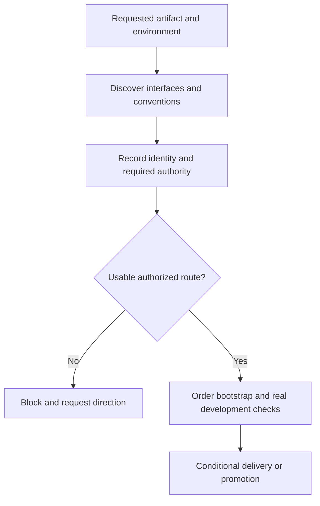

Survey requires `machine.platform_discovery`, including a compact explicit
local-only case. A hosted artifact instead records the selected interfaces and
versions, safe identity probe, authority status, exclusive writer, bootstrap,
development validation and promotion decisions. Sequence binds the required
producers to the existing DAG; it does not create another scheduler. The
script checks declarations and ordering, while the host must establish current
access and permission before external use.

New runs also require action-bound `platform_revalidation` results at selected
external preparation, implementation/improvement and publication boundaries.
The packet supplies the exact platform/trigger/action/environment binding.
Large sets are available through digest-bound `platform-revalidation` context
pages; bounded result samples never waive the complete required evidence.
Record the safe probe **before** the authorized operation; failed probes or
changed roles require a pause, not a successful callback. This is recorded
host testimony, not independently verified live access. Earlier runs without
the new marker retain their callback compatibility. The preparation objective
reviews its original operation evidence without rerunning external effects.

For example, a request for a hosted developer app leads to discovery of the
available CLI/MCP and documented syntax, then to an identity/authority record.
Missing write authority leaves that platform applicable but blocked; it does
not become a fictional local-only task. With an authorized route, bootstrap
precedes dependent validation, and promotion is separately planned. No
platform name, tool installation, development account, or production deployment
is assumed. See the [typed platform guide](references/platform-discovery.md).

At `sequence`, make a short forward draft, audit every prerequisite backward,
add missing producers or leave facts unresolved, then validate the acyclic DAG.
The human `plan.md` and imported `backchain/plan.md` must agree. Include Review
Coverage and map expected cases, checks, documentation, preparation, deployment,
and readiness to concrete outputs.

`prepare` appears only for authorized `outer-before` preparation. Other
preparation belongs in explicit dependency-ordered DAG steps, or it is `none`.
Preflight's readiness assessment is not permission to make unapproved
environment changes.

Before the first step is allocated, the finalized spec's Git baseline and
product-tree fingerprint must still match. Outer-before preparation may ready
the environment; changes to product files belong in explicit DAG steps. Later
authorized execution does not have to keep the historical planning HEAD current.

For acceptance that depends on a real deployment, plan authorized deployment or
readiness and dependent checks **before** outer `quality`. An `outer-loop`
publication can add a final delivery smoke check, but it cannot retroactively
satisfy deployment-dependent acceptance. A `dag` publication is a normal,
ordered implementation step; it does not create the outer `publish` stage.

### P4 — Select, plan, and implement one ready step

ShipLoop schedules one ready DAG step at a time and allocates its isolated
worktree and branch. Work there, not in the session checkout. Scheduling opens
`step-plan`; it does not authorize a source edit. The initial execution-plan
loop is:

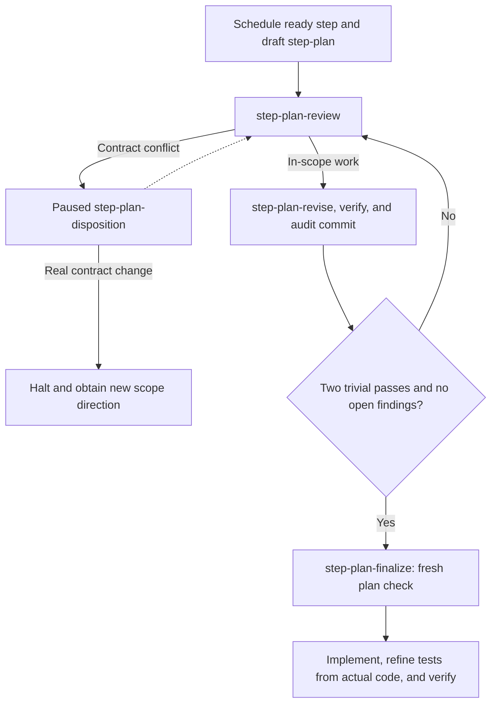

The dashed return requires a proven `no-contract-change` disposition and
restarts review; it is not an automatic resume or permission to edit scope.

`step-plan-review` reads bounded `step-context`, `step-plan`, and current
`iteration` state, then the run's policy-owned current Git history. In new
runs, `step-context` also projects only the selected step's applicable
system-context roles, interfaces, interaction contracts, source/question links,
blocking IDs, and research-evidence/context digests. It inspects the actual worktree's
relevant code, interfaces, call sites, tests, configuration, documentation,
and diff; the frozen environment plus current non-secret observations; and
direct suppliers and consumers. Its full rubric asks about scope, current
implementation, environment, dependencies, flows, edge conditions,
second-order effects, implicit requirements, test strategy, and documentation.
The review persists compact evidence references instead of relying on the LLM's
memory or dumping raw source into the run. If audit-only plan commits fill the
normal history window, it also uses a scoped path/symbol investigation to
inspect the relevant older implementation or decision commit.

An in-scope pass follows `step-plan-review → step-plan-revise → step-plan-verify →
step-plan-commit`. A material finding/revision resets the streak; the
incorporated continuation policy permits fresh finalization only after two
unique checked/audited trivial passes, all trivial fixes applied, and no open
findings. `step-plan-finalize` releases only the exact freshly checked plan to
`implement`. The audit commits preserve the product tree and do not count as
Improve iterations or replace the later primary step commit.

Material `scope` or `behavior` conflicts take a different path:
`step-plan-disposition` pauses before revision. If the diagnosis was a false
alarm, the exact `no-contract-change` result must resolve every listed blocker
with evidence; the script archives the interrupted pass and starts fresh
review without changing the approved contract. Plain `resume` cannot release
the plan or resolve the conflict. A real contract change requires a halt and
direction for a new explicitly scoped run. This applies to initial and Improve
plans; see [contract disposition](references/execution-planning.md#contract-disposition).

Each initial and Improve plan includes a **local execution microplan**: ordered
local work/output rows, prerequisites with evidence sources, and planned
case/check mappings. The agent works backward from each required output and its
verification needs, resolves suppliers or records material gaps, then checks the
forward execution order. The global backchain still owns dependencies between
delivery steps; this local check catches assumptions exposed by the actual code,
fixtures and environment. One row or a justified no-change plan is enough when
appropriate; no second scheduler, standalone skill call or progress cursor is
introduced. See [Local microplan and backchain](references/execution-planning.md#local-microplan-and-backchain).

For example, a plan to validate a matching record cannot treat “the data model
exists” as proof that its test fixture exists. It must cite the fixture or order
an authorized, in-scope fixture-producing row before the test. If a new shared
environment or permission is needed to proceed, the step stays blocked for
broader direction. These dependency judgments are host-reviewed Markdown;
the script binds and gates the plan but does not prove its semantic completeness.

Before code, the planning result's existing `body`/`plan` holds a compact test
criteria matrix. Each stable case ID maps its contract `T-` ID and exact
`produces` string to preconditions/input, expected output/state/side effect, planned test
path/selector, check ID, environment/fixture, and separate decisions for unit,
integration, end-to-end, mock/fake, browser, service, and API coverage. Each
decision is selected, not applicable with a reason, or required but blocked
with a cause. This is durable Markdown planning evidence, not a new schema,
test catalog, or proof that a future test passed.

On a cold entry to `implement`, `improve-apply`, or `review`, start with `next`,
then page `context --section step-plan` for the accepted plan criteria and
`context --section step-context` for the active-step context. The latter can
expose the digest-bound read-only `implementation_test_record`: the accepted
action plus `summary` and `test_review` from
`results/{implementation_check_action}.md`. It is a historical host-reported
note, not current proof; inspect the actual tree and rerun current checks before
reusing its coverage conclusion.

After finalization, implement only the declared `produces`: write the code,
then inspect the actual diff, dependencies, and code learnings before authoring
or refining executable tests. A TDD or reused test can remain only with evidence
that it covers the planned criterion; do not manufacture a no-op test edit.
Run lint and every selected required test, fix justified code or test defects,
and rerun until the current manifest passes on unchanged files. The script
retains command logs, before/after fingerprints, and failed attempts; it rejects
non-zero, timed-out, stale, or changed-tree evidence. A required unavailable,
failed, blocked, or unrun test keeps the step unfinished.

When a test needs correction, never rewrite acceptance to fit a current bug. In
initial `implement`, record the reason, before/after oracle, independent
requirement or contract source, retained/added coverage, actual-versus-expected
outcomes, and adequacy limits in `test_review`. In Improve work, record
application additions/corrections in `test_changes`, discoveries in `learnings`,
and later adequacy review in `test_review`; `summary` records checked evidence.
The existing results are imported into Markdown for a fresh context. Passing
plan or local tests do not decide semantic adequacy, and a mock/fake cannot prove
a required real boundary. A passing initial implementation starts P5; it is not
permission to merge.

**Illustrative trace.** Before code, case `TC-14` maps contract `T-14` and its
exact `produces` string to a blank-input fixture and reject/unchanged-state
outcome. During `implement`, the actual diff shows whitespace takes the same
new branch. The test refinement retains `TC-14`/`T-14`'s oracle and adds a
whitespace stimulus/assertion at its planned test path; initial `test_review`
records the added coverage and limitation. The code learning adds a test
input—it does not change accepted behavior.

### P5 — Improve repeatedly, learn, and merge

One Improve iteration is the [review-and-improve cycle](#the-review-and-improve-cycle),
from `review` through `carry-forward` and `commit`. Each
iteration has its own recorded history review, findings, a separately converged
post-review plan, application, fresh checks, current knowledge checkpoint, and
primary learning commit. Nested plan passes are evidence for the next edit; they
do not count as Improve iterations.

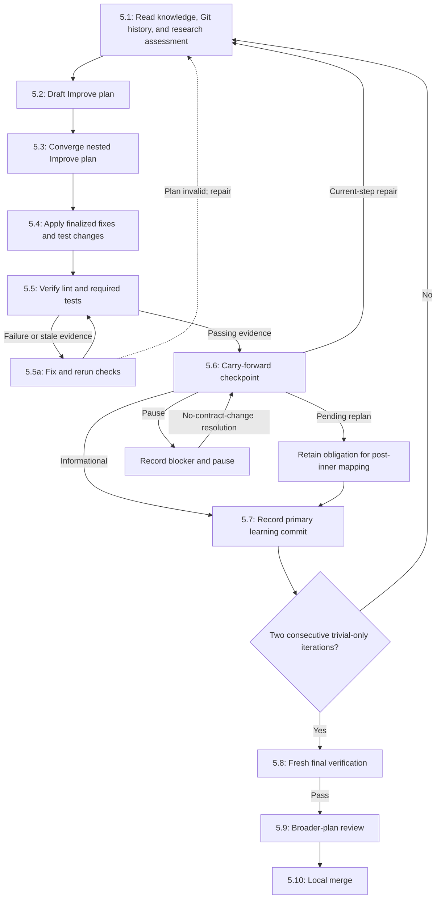

Before completing `review`, fully page the bounded `knowledge` selection and
run `history`; inspect the full bodies for the run policy's latest commits (or
all available), one body at a time when needed. New runs require seven and bind
that policy into every pass; a run without the marker remains at the legacy ten.
If audit-only plan commits dominate
that window, also inspect the relevant older implementation or decision commit
through a scoped path/symbol investigation. The review result binds the
knowledge revision, digest, and scope it read. It also records the structured
`research_assessment` disposition (`not-needed`, `resolved`, `required`, or
`blocked`) with its summary, safe evidence references, and questions. A
non-`not-needed` assessment, including `resolved`, is material and resets the
streak. `required` or `blocked` cannot finish an Improve cycle; a prior required
assessment needs a resolved assessment in `improve-apply` that retains its
required/blocked question strings. `resolved` records investigation completed in
this pass; a later unchanged pass uses `not-needed` rather than repeating it.
Review code, tests, regressions, expected-versus-observed
cases, selected surfaces, changed function contracts, product README accuracy,
and prior learnings. Missing relevant tests or materially misleading
documentation are material findings. See
[later research discoveries](references/research-loop.md#later-discoveries) for
the route rather than silently rewriting a planning baseline.

At `improve-plan`, reread the current review and its full saved Git messages
through the packet's `iteration`/archive pointers; this plan cannot depend on
remembering the preceding action. Draft a plan that addresses every finding
and relevant Git learning with fixes, test work, documentation work or an
explicit no-change reason, and prevention. Also read the `enclosing_review`
block within the `step-context` section,
which projects the enclosing product review with stable `PARENT-…` finding
IDs. The draft must explicitly retain every printed parent ID. That is a
coverage proof for the plan—not a
claim that a product finding is fixed before application. It then enters the
nested plan loop:

```text
improve-plan → step-plan-review → step-plan-revise → step-plan-verify
→ step-plan-commit → (another review or step-plan-finalize) → improve-apply
```

Every nested review repeats the ten-dimensional execution-plan rubric against
the current worktree and current environment/dependency evidence. It records
stable findings, compact `context_evidence`, current knowledge binding, and
history before revision. It runs a plan-artifact lint/test manifest with exact
acceptance `step plan`, then makes a verbose audit-only commit. Only two
consecutive trivial-only nested passes, no open findings, and a fresh final
check release `improve-apply`. The later primary Improve commit remains
mandatory. On this route, ShipLoop carries deduplicated nested review/revise
learnings into the enclosing iteration so that commit preserves both the plan
investigation and the actual code/test learnings.

At `improve-apply`, make the finalized changes without weakening expectations
just to obtain green. At `verify`, run fresh lint and required tests. A passing
local result is evidence only for that local run; it does not prove a remote,
deployed, or external effect.

For an ordinary failed or stale check, make the already-authorized correction,
then rerun lint and the required tests. If that result invalidates the finalized
plan rather than merely needing a check retry, use `repair` and return to
`review`; do not jump back into an older nested plan pass.

Before `commit`, `carry-forward` is mandatory. It records either explicit
`discoveries: []` or bounded non-secret discoveries in the current knowledge
ledger, without changing the approved environment, behavior, specification,
lifecycle, or DAG. `informational` observations can continue; a
`current-step-repair` returns to review, `pending-replan` retains a durable
obligation for mandatory post-inner mapping, and `pause` records a blocker that
`resume` cannot bypass. Only a later `no-contract-change` result resolution can
clear a false alarm or clarification. A current-step repair must scope exactly
the active step; future/completed/frozen impacts use pending replan or pause.
For a `research`-domain pending obligation, post-inner must schedule an explicit
`activity: research` producer before every affected consumer; mapping means
scheduled work, not a solved research question.
The checkpoint's nonempty `learnings` string is copied verbatim into the primary
commit. See
[Carry-forward checkpoint](references/carry-forward.md) for the exact schema
and impact routes.

Before successful verification, an active inner action can record a concrete
non-secret operational fact through `context --section observation`. The script
issues a separate `OBS-…` action, expected knowledge revision, result template,
and exact `done` callback. Page `knowledge` first, submit at least one
existing-schema **compatible** discovery, and let the script atomically preserve
the current ledger, history, and observation receipt while it reprints the
unchanged parent action. This receipt explicitly says `not-run`: it cannot
resolve a blocker, prove a test or remote condition, or grant permission. A
pause/permission/contract blocker, or a context/proof change at a stage without
a compatible repair route, is rejected before any state change; use ordinary
`pause` plus direction, the owning carry-forward route, or `outer-work` for a
later deployment dependency. At a supported bound objective/planning/execution
stage, an accepted material observation pauses for the printed repair/replan route;
`resume` alone never reuses the earlier convergence.

An active inner action can also record a distinct **outer-work** need as soon
as it is discovered—before a successful check, checkpoint, or parent
completion. First page `context --section outer-work`; it gives the current
ledger, a script-issued request ID, and the exact append template. Read current
entries before choosing a stable dedupe key. Submit the result with the packet's
exact `journal --target outer --operation append` call. The journal callback
persists the obligation and returns the same parent action, which remains
unfinished. It can never make a failed verification look successful, authorize
a deployment, or replace the normal carry-forward/replan/pause route for a
current product requirement. [Outer-work journal](references/outer-work.md)
defines the target stages, deduplication, resolution, and read binding.

At `commit`, create the distinct primary commit on the step branch with
`Review:`, `Changes:`, `Validation:`, `Key learnings:`, and the exact
`ShipLoop-Iteration:` trailer. Its body must include the ordinary review,
deduplicated nested Improve-plan review/revise, application, and carry-forward
learnings verbatim. An honest audit-only empty commit is allowed when it
contains concrete evidence.

Two consecutive fully recorded trivial-only iterations are necessary, not
sufficient. Material findings, material application, or late edits while
obtaining green reset the streak. `final-verify` is a separate fresh gate.
`post-inner` records whether only pending plan steps need revision, reviews the
generic ShipLoop proposal journal, and, when obligations exist, provides
`pending_obligation_map` entries with nonempty changed or newly added pending
step IDs. Those entries schedule future work; they do not prove it fixed or
verified. `merge` is local only: it is not a push, publication, or proof of
remote delivery.

**Current repair boundary.** Before a merge intent has started, a real defect
found after an iteration, final verification, or post-inner review can use
`repair` to record the reason, reset convergence, and return to `review`. Once
the merge intent is recorded, ordinary `repair` rejects the request. A
reconciled, unlanded intent has the separate `merge-recover` route: preserve and
commit scoped intended work to clean the checkout, recover the intent, then
perform the restarted Improve review and checks. It does not undo a landed
merge. See [recovery and compatibility](#recovery-and-compatibility) before
retrying; do not try `verify` at the merge cursor.

### P6 — Review the whole product

P6 evaluates the integrated product, not merely the last step's checks. Defects
must return through a corrective pending DAG step and the ordinary P4–P5 loop.

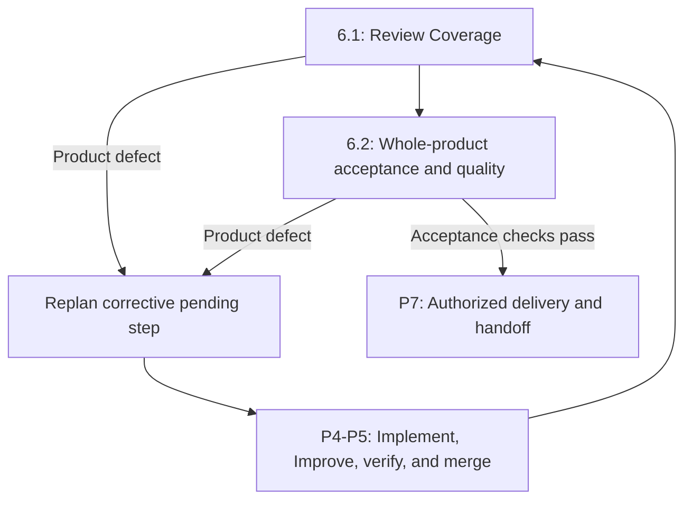

At `coverage`, complete the plan-bound Review Coverage activity and retain its
actual tracked clean ledger, or the pre-existing explicit plan waiver. At
`quality`, run fresh whole-product lint and acceptance/integration tests mapped
to every exact `lifecycle.acceptance` string. When `quality: false`, the extra
semantic-review field is omitted; acceptance and integration checks remain
required.

Reassess browser, service, and API views for the whole product. Required failed,
blocked, or unrun checks remain unfinished. The required practice is to use
`replan` at `coverage` or `quality` to add a corrective pending step, not to
patch the outer checkout around P5. Outer closure requires a clean checkout
descending from every integrated step receipt, apart from a certified Review
Coverage ledger. This structural guard does not determine whether a test or
semantic review is adequate; the host still owns that judgment.

If `outer-work.md` exists, `quality` pages the current journal and binds that
read to its action before it can close. It must resolve every planned row due
at quality; later-stage rows remain visible but do not incorrectly block it.
Resolving a row records evidence and reason at its named stage—it is not an
automatic test result, user approval, or remote operation.

### P7 — Deliver if authorized and hand off

When `publish: outer-loop`, `publish` occurs after `quality` only with user
authorization. Inspect the existing delivery before retrying an uncertain
external operation. Record the artifact, actual entrypoint verification, tested
environment, and evidence; a local green suite cannot prove publication.

`publish` and the final handoff follow the same outer-work rule: page the
current ledger, bind the read, and resolve all rows due through their own stage.
Rows due at a later stage cannot be resolved early, and no journal entry grants
the authority needed for publication. For versioned new runs, `handoff` is a
substantive objective with normal review/improvement/finalization convergence;
its context binds the applicable preparation, coverage, delivery, and
outer-work evidence before it can produce the derived terminal report.

When `publish: dag`, publication is an explicitly ordered P4–P5 step. When
`publish: none`, ShipLoop proceeds from `quality` to `handoff` and does not
authorize delivery. Lifecycle validation rejects a DAG publication step when
publication is absent or belongs to the outer loop; the lifecycle does not
itself grant permission for any external effect.

At `handoff`, record checked acceptance, actual delivery facts, limitations,
unresolved concerns, and the prioritized generic ShipLoop proposal list. Use an
explicit `[]` journal after a no-new-proposals review. A handoff is an honest
report of evidence and uncertainty, not an inference from a green local suite.

#### From delivery evidence to the HTML report

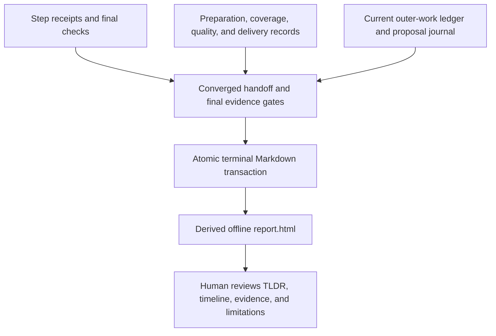

For a successful new run, the handoff objective binds the applicable outer
evidence and current journal before finalization. Terminal rendering consumes
the approved evidence set; it does not scrape the conversation for missing
achievements. The same terminal transaction writes `report.html` and a compact
integrity binding in `state.md.report`. Halting also produces a report, but with
an unmistakably unfinished outcome—not the successful completion phrase.

The report is the durable human-facing overview:

- **TL;DR and diagnostics:** completed versus halted, known blockers,
  limitations, failed/blocked/not-run evidence, and actual versus planned facts.
- **Sequence:** the recorded activities and explicit step/iteration identities;
  it does not invent a completed action from a later cursor.
- **Achievement evidence:** readiness, final checks and done evidence, local
  merges, and host-reported deployment facts remain separately labeled.
- **Learning and follow-up:** carry-forward obligations and generic ShipLoop
  proposals remain scheduled/proposed until there is evidence otherwise.
- **Evidence navigation:** underlying Markdown references let a person inspect
  the basis of a summary without feeding the entire run to another LLM.

The HTML needs no scripts, network requests, or external assets. It is a derived
view, not another authority: changing the HTML cannot change what happened.
Missing, modified, unsafe or stale report content fails integrity validation.
For an already terminal run, `report` can regenerate the view; it records a new
audit event/revision but does not rerun checks or change the terminal outcome.
See [report lifecycle and evidence boundaries](references/report.md).

## A worked example from request to report

This is a **hypothetical**, technology-neutral walkthrough, not evidence that a
particular app has been built or deployed. Input: "Add a client-facing record
update flow to the existing app; reject invalid changes without altering saved
state, and prepare a release only if the target environment is authorized."

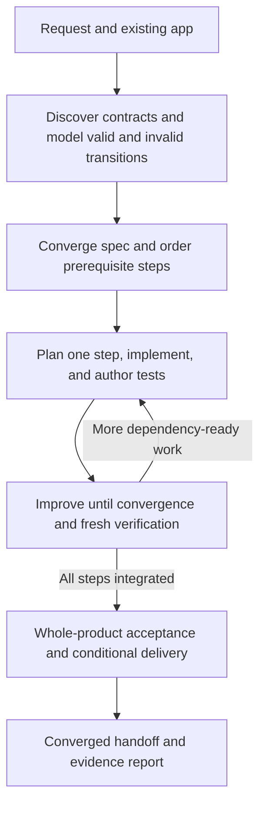

1. **P1 establishes where work belongs.** Preflight records the committed
   baseline and preserves unrelated files. Approach proposes milestones and
   risks; its objective converges before the detailed environment survey.
2. **P2 discovers the actual interaction.** The host inspects existing code,
   state ownership, tests and conventions, then available local/remote tool
   interfaces and primary contracts as needed. The research evidence records
   the chosen client/service path, serialization, validation errors, permissions,
   retries and relevant environment roles. A missing permission remains blocked.
   The behavior model includes both a valid update and an invalid update that
   leaves state unchanged, plus relevant concurrent/stale or retry conditions.
   Repeated reviews stop only under the research/behavior convergence gates.
3. **P3 turns behavior into checkable work.** The spec gives the invalid update
   an observable error and unchanged-state oracle. The DAG places any required
   development bootstrap and fixtures before dependent tests. Each step has
   Ready/Done, test and documentation criteria; publication is explicitly
   `none`, a DAG activity, or an authorized outer-loop activity—not implied by
   the word "app."
4. **P4 elaborates one selected step.** A local backward prerequisite check
   finds which contract, fixture and service readiness the update handler needs.
   Its microplan identifies existing symbols and pre-code test criteria; this
   does not create a second DAG. After plan convergence, the host implements,
   inspects the real diff, writes/refines the planned tests, and runs lint/tests.
   A unit test may check validation, while a real client/API test checks that
   the exposed route preserves stored state. A mock alone cannot prove that
   real boundary.
5. **P5 learns without relying on chat.** An invalid-input edge discovered in
   review leads to a converged Improve plan, fix, strengthened regression,
   checks, carry-forward assessment and verbose learning commit. Material work
   resets the primary streak. A non-secret fact needed by other steps goes to
   current knowledge; a release-owner confirmation genuinely due at handoff
   goes to the outer-work journal. Neither callback completes the active task
   or grants release authority. Post-inner considers pending-plan effects.
6. **P6–P7 close the evidence chain.** Whole-product checks exercise the
   selected real boundary in its required environment. Defects become
   corrective DAG work. Authorized publication, if selected, is a separate
   operation; uncertainty is investigated before any retry. Handoff reads and
   resolves its due journal work, converges with the outer evidence, and emits
   the final report. If authority or required tests remain unavailable, the
   outcome is unfinished—not a success inferred from local commits.

At any accepted action boundary in this example, conversation context may be
discarded; run `next` with the same run locator to recover. The selected action, case criteria,
pending findings, knowledge, checks, and history bindings come from durable
records. A return from `done` is the next instruction, not a requirement for
the host to remember which numbered phase comes next.

## Requirements modeling and traceability

Use the [Discovery and research](references/behavioral-requirements.md#discovery-and-research),
[Behavior model](references/behavioral-requirements.md#behavior-model), and
[Traceability and review](references/behavioral-requirements.md#traceability-and-review)
sections together:

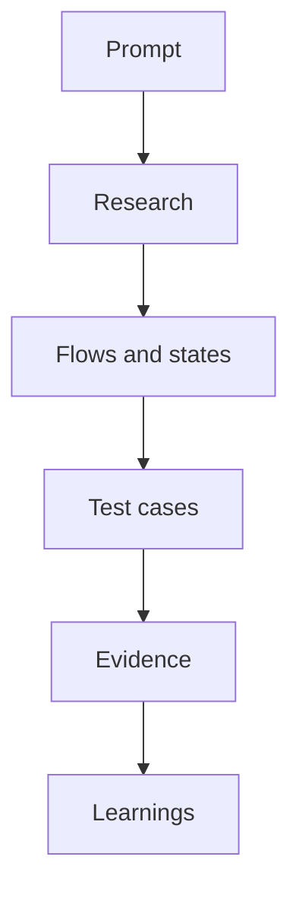

1. During P2, assign stable `R-` IDs to atomic requested behavior and research
   deeply where it is uncertain or consequential. Trace an outcome forward from
   its trigger through callers, public boundaries, state writes, and external
   effects, then backward through its prerequisites. Read relevant
   implementation, tests, documentation, history, and primary platform
   contracts; distinguish observed facts, inferences, proposals, and unknowns.
2. `behavior` drafts the model. Use `F-` IDs for required flows and `T-` IDs
   for applicable state transitions. Cover required in-scope valid **and**
   invalid events, guards, permissions, state ownership, invariants, outputs,
   errors, and effects. Assess retry/idempotency, cancellation, timeout,
   partial failure, compensation, concurrency, stale callbacks, and recovery
   when the product makes them relevant; record a justified exclusion rather
   than filling a generic checklist.
3. The behavior loop reviews that candidate against its rubric until it has two
   complete trivial-only passes, no open findings, fresh planning evidence, and
   its final audit history. A material unresolved policy blocks
   `behavior-finalize` and therefore `spec`; do not invent a rule for a
   cancellation/completion race, ownership conflict, permission, or recovery
   boundary merely to mark `checkable: true`.
4. During P3, the spec loop maps the frozen `R-/F-/T-` model to acceptance
   criteria, case IDs, DAG outputs, environments, and checks before sequence.
   During P4–P7, retain the link from requirement to expected outcome, selected
   test, observation, evidence, and any remaining limitation.

Product diagrams belong to the behavior model. A product sequence diagram says
which actor sends which request and what the product observes. A product state
diagram says which product states and transitions are valid. By contrast,
ShipLoop's `phase/stage` cursor controls the delivery harness, while the DAG
orders implementation work. They may reference each other, but none substitutes
for another.

A compact generic trace is enough when the executable test already shows the
detail:

| Trace item | Example |
|---|---|
| Requirement and model | `R-07: an invalid update from an active record is rejected and the record remains unchanged.` `F-07` is the exposed update flow; `T-07` records the guarded rejection, unchanged-state invariant, and caller-visible error. |
| Case design | `TC-07: given an active record, submit an invalid update through the real exposed boundary; expect the defined validation error and unchanged stored state.` |
| Planning gate | The behavior/spec planning loop checks that the modeled `T-07` and `TC-07` links remain complete; that is planning-artifact evidence, not a claim the future product test passed. |
| Planned work | The implementation step produces the `T-07` validation contract and `TC-07`; the sequence places any service readiness before the selected test. |
| Observation | The later `verify` result links `R-07/F-07/T-07` and `TC-07`, runner/environment, checked revision, actual status, and retained evidence. Until then it is `not-run`, not passed. |

This is a modeling and traceability example, not a new universal schema. Keep
case intent compact, use the existing result fields, and leave detailed
assertions in the executable test where they belong.

## Execution-plan, per-step evidence, tests, and documentation

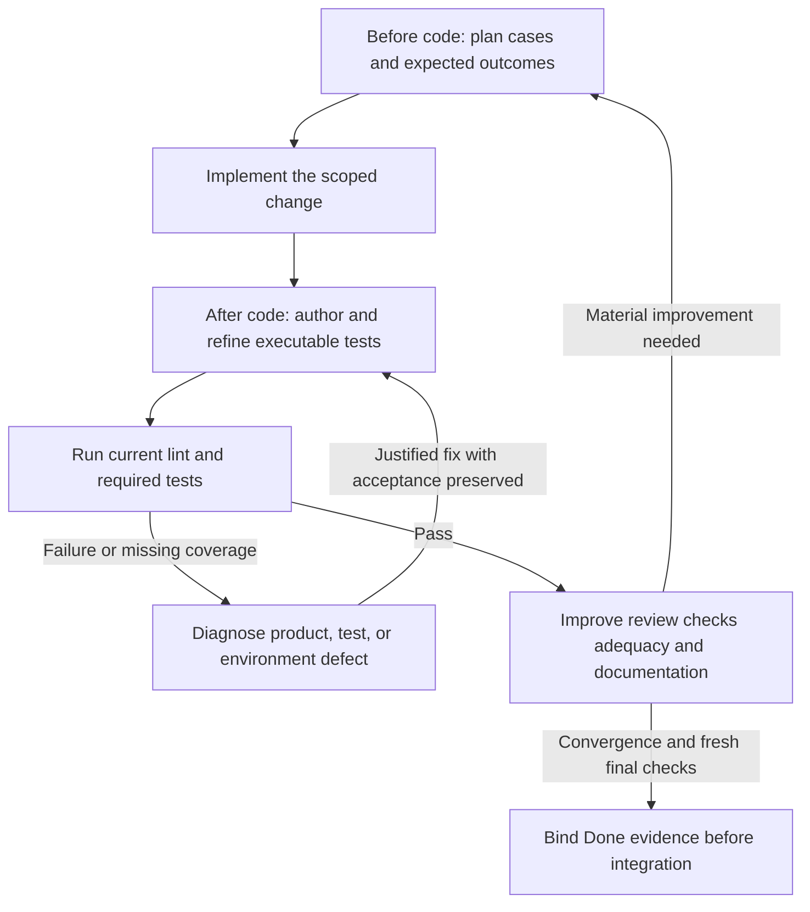

The plan is written before source edits, but executable tests are authored or
refined after inspecting the implementation. Existing valid tests still run;
this ordering is not an excuse to remove them or postpone a necessary oracle.
A failing test must be diagnosed: fix a product bug, repair an invalid test
with recorded justification, or mark an unavailable required environment as
blocked. Do not weaken the expected behavior until the suite turns green.

The execution-plan loop turns a ready DAG step or Improve finding into an
ordered, checkable edit/test/documentation plan before product source changes.
It records target symbols/interfaces, prerequisites, a pre-code case-to-contract
criteria matrix for every exact `produces`, expected outcomes, test paths/check IDs,
environment/fixtures, separately selected unit/integration/end-to-end and
mock/fake strategies, browser/service/API decisions, documentation decisions,
risk controls, and revalidation triggers. Its `planning-verify` evidence
validates that plan artifact with exact acceptance `step plan`; it never
substitutes for later source lint/tests, a real-boundary observation, or a live
deployment observation.

For universal objective candidates, any exact persisted-byte rewrite—including
whitespace-only editing—is conservatively material. Only retaining the exact
candidate can count as a trivial Apply. This can create extra passes because
ShipLoop has no semantic-equivalence oracle; it is a deliberate quality guard,
not a claim that every byte edit changes product behavior. Specialized
research/behavior/spec loops continue to use their own rubric-based materiality
rules.

### Authoring a valid per-step Ready/Done contract

New runs require `contract_version: 1`; legacy work receives no retrospective
Ready/Done proof. In this version, every DAG step must author a
`contract` object with exactly `objective`, `ready`, `done`, `tests`, and
`documentation`. Its `objective` exactly equals the step `statement`; stable
IDs use `R-`, `D-`, `T-`, and `DOC-`; and every exact `produces` value appears
in both `done[].produces` and `tests[].produces`. Ready rows contain
`id`, `condition`, and `evidence_method`; done rows also declare `produces` and
`completion: "integrated"|"deployed"`; test rows declare `produces`, an exact
`expected_outcome`, `surface`, and `evidence_method`; documentation rows contain
`id`, `condition`, and `evidence_method` (an unchanged claim must say why).

This authored contract is not the later evidence payload. Before source edits,
public `ready_evidence` has only `ready` rows. After verification, public
`done_evidence` has only `done`, `tests`, and `documentation` rows. The script
keeps selected head, environment, artifact, contract, and check identities in
its private durable envelope. See the complete
[authoring example](references/activities/plan.md#versioned-per-step-contract)
and [evidence boundary](references/action-protocol.md#per-step-ready-and-done-contract).

The host selects tests by the changed behavior, surface, and risk. Browser,
service, and API checks overlap; they are not a mandatory three-level ladder.
Record each as selected, not applicable with a reason, or required but blocked.
A health check proves readiness, not necessarily the behavior or side effect at
risk.

Every implementation and Improve verification has a concrete lint check and at
least one test check. Each exact `produces` string belongs in a test check's
`acceptance` list:

````markdown
```shiploop-state
{
  "checks": [
    {
      "id": "lint",
      "kind": "lint",
      "argv": ["npm", "run", "lint"],
      "acceptance": []
    },
    {
      "id": "unit",
      "kind": "test",
      "argv": ["npm", "test", "--", "widget"],
      "acceptance": ["src/widget.ts", "widget behavior"]
    }
  ]
}
```
````

`argv` is an argument list, never shell prose. If a later iteration changes
coverage, use `verify --reason` to record why. Failed attempts remain in
`check-attempts/`; do not erase them to make a final pass appear first-try.

Use the existing result `body`, `plan`, `test_review`, `test_changes`,
`learnings`, and `summary` fields to link cases, documentation decisions, and
evidence. Planning uses `body`/`plan`; initial `implement` uses `test_review`;
Improve application uses `test_changes`/`learnings`; later review/quality uses
`test_review`; verification uses `summary`. Do not create a parallel
case-result sidecar. Expected outcomes and actual observations are separate: a
required unavailable check is blocked, not `N/A` or passed by prose.

Testing and documentation are duties inside the current stages, not a late
separate phase:

| Workflow point | Test responsibility | Documentation responsibility |
|---|---|---|
| P2 survey/research/behavior loops | Identify relevant environments and observable expected outcomes; verify research question/source integrity and review the model's case mapping on every behavior pass. | Inspect conventions and identify product or interface guidance that will need change. |
| P3 spec loop/sequence | Confirm acceptance/case mapping during spec convergence, then map stable cases and checks to exact outputs; order fixtures, readiness, and deployment dependencies. | Plan concise function/interface contracts, case guidance, and relevant README changes. |
| P4 execution plan and implementation | Before source edits, record the case-to-contract matrix, scope/mock/fake/surface decisions, and test paths/check IDs; after finalization, implement code, inspect the actual diff, then author/refine executable success, invalid, boundary, and regression coverage when relevant. | Before source edits, name the affected non-obvious contracts, README instructions, examples, and links; update them in the worktree before source checks, or explain why unchanged. |
| P5 Improve | Converge the post-review plan, compare expected and observed outcomes, reassess test adequacy and real-boundary gaps, then rerun current checks after every justified fix. | Converge documentation work with the Improve plan; review README and contracts each iteration, update them or record a no-change reason. |
| P6–P7 outer closure | Check whole-product behavior in the relevant actual environment. | Hand off usage, interface references, tested outcomes, and operational limitations. |

The [testing and documentation contract](references/testing-and-documentation.md)
defines the compact case record, surface decisions, product README review,
iteration duties, and deployment/handoff rules. Read only the section named by
the packet. Product documentation belongs in the product worktree and Git, not
in ShipLoop session state.

## Global system-test catalog

For a new marked run, the accepted `backchain/plan.md` DAG also owns one typed,
global `system_tests` catalog. It declares the run-wide pre-deployment and
post-deployment cases that cross ordinary feature-step boundaries. The protocol
derives a readable `system-test-requirements.md` from the accepted plan; it is a
view, not a second writable state file or a second test catalog.

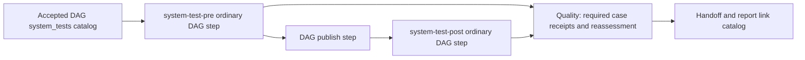

System-test activities use the existing step-plan, implementation, verification,
Improve, two-trivial-pass, commit, and merge lifecycle. They are not new outer
stages and do not authorize publication. Case prerequisites fan in to their test
step; a pre-deployment test precedes the DAG publication producer, while a
post-deployment test depends on that producer and actual target readiness.
Required real post-deployment testing therefore requires `lifecycle.publish:
dag`, not `outer-loop`; an outer-loop publish is host-reported evidence and
cannot be a test-authoring gate.

A catalog case names its stable `SYS-...` ID, phase, requirement, expected
outcome, environment, prerequisite DAG step IDs, test-owner step, exact `T-...` contract,
and deployment-step link. It does not establish that a test ran or that a remote
target has the claimed identity. The executable step manifest and retained
evidence must inspect and assert the real selected target/build; a reused local
or mock result cannot establish that remote boundary.

At carry-forward, post-inner, and quality, record the required strict
`system_test_review`: `{decision: "no-change"|"revise", evidence: "case IDs
plus concrete rationale/deltas", discovery_ids: []}`. `no-change` has no
discovery IDs; carry-forward `revise` names current test-strategy/pending-replan
discoveries or open obligations, post-inner `revise` requires a pending
DAG/plan revision, and quality `revise` remains blocked for replan.
Carry-forward persists those IDs in script-owned `state.system_test_pending`.
Cold `context --section system-test-requirements` renders the current accepted
plan and outstanding IDs rather than trusting a derived view that is altered,
missing, or out of date. An outer replan flagged `system_test_review: revise`
also requires the pending DAG/plan revision, and every pending ID must map to
its typed system-test owner; unrelated work cannot discharge it. Route new
discoveries through current knowledge and pending-only replanning; record later
external dependencies in outer-work only as obligations, never as passing test
evidence.
Completed/running case definitions are immutable: changed scope, assertion, or
target adds corrective cases/steps and requires fresh convergence. Quality reads
the current catalog, case receipts/contracts, global reassessment, and current
`lifecycle.acceptance` checks before it can close. It validates historical
immutable-case proof against its saved target epoch without comparing it to
current knowledge merely because corrective work exists; a changed requirement
needs a newly completed corrective case. The revised DAG must add/change the
`SYS-...` case and its pending typed system-test owner, with the pending mapping
reaching that owner; a prose ID mention or unrelated completed step is not
closure. The final report identifies the catalog in its source inventory and
retains limitations.

An older run without `system_test_protocol_version: 1` remains compatible but is
un-certified against this catalog until supplied through its supported planning
route. Unknown or
access-blocked real boundaries are not `not-applicable`; pause or replan with
explicit authority. See [Global system-test catalog](references/system-tests.md)
for the exact V1 shape, dependency rules, generic example, and production/fuzz
safety boundary.

The runtime can prove graph ordering, recorded check execution, required IDs,
and bound receipt/digest relationships. It cannot prove remote target identity,
the semantic meaning of an assertion, or continuing external freshness after a
check. Evidence strings and case-ID mentions are host judgment; schema checks
cannot prove comprehension, assertion adequacy, or that every relevant case was
considered. The host must inspect the actual target/build and judge assertion
adequacy; ShipLoop deliberately does not add a fake generic remote-attestation
string as a substitute.

## Ownership, context, and recovery

The script, Markdown files, Git, check tools, and host have different jobs:

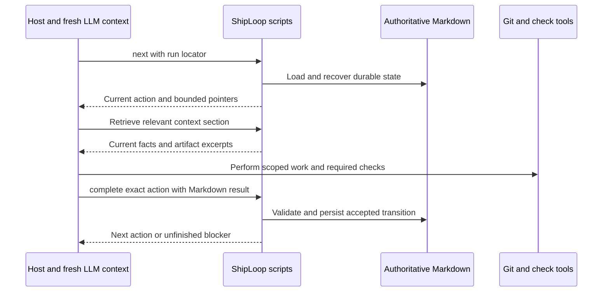

| Authority | Owns | Does not prove |
|---|---|---|
| Scripts and Markdown | Current phase/stage, action identity, planning candidates and finding ledgers, accepted results, current knowledge overlay, plan, receipts, evidence references, and generic journal. | Conversation recollection or semantic correctness. |
| Git | Product history, step branches, local merge ancestry, and per-iteration learning commits. | Remote publication or external acceptance. |
| Check tools and retained logs | Command execution and observable pass/fail evidence in a specific environment. | Complete test adequacy or every possible defect. |
| Host | Scoped changes, semantic review, test adequacy, evidence interpretation, and external verification. | A deterministic correctness oracle. |

One context only needs to survive until its required facts are durable. The next
packet must remain usable without prior conversation. Retention within the same
quality loop is allowed, not required:

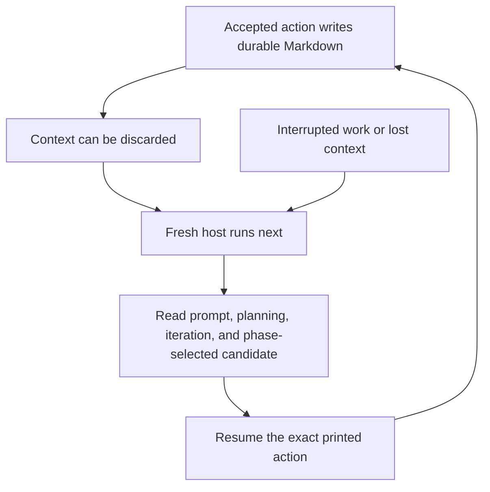

Current behavior: `next` reconstructs the action from Markdown, and `context`
retrieves bounded `prompt`, `step`, `iteration`, `knowledge`, `behavior`,
`spec-draft`, `lifecycle-draft`, `planning`, `spec`, `environment`, `plan`,
`lifecycle`, `journal`, `approach`, `research`, `research-evidence`,
`objective`, `step-context`, `step-plan`, `platform-revalidation`, `preflight`,
`preparation`, `coverage`, `quality`, `delivery`, `handoff`, `outer-work`,
`artifacts`, `audit`, `check-log`, `migration`, `system-context`, or
`observation` sections. When the current loop has a validated original-result
binding, its selected `quality-baseline` reader also exposes historical quality
evidence; it is not an unrestricted result-file reader.
The limit is characters, not a
guarantee of model tokens. A research cold context reads its report and evidence
candidates, planning receipt, and current iteration rather than every historical
pass. An execution-plan cold context reads the selected step's compact
implementation/environment/dependency evidence plus its selected system-context
projection, current candidate/ledger, and current nested pass—not archived plan
passes or an assumed prior conversation.
`context environment` keeps the
frozen baseline visible and labels the current knowledge overlay as
authoritative state for host-reported observations but not authority to change
that baseline. After a cold start during execution, read the scoped
`knowledge` selection before the current `iteration`; it includes active-step
and `all` entries plus every open or scheduled obligation and open blocker,
rather than every historical checkpoint. Do not load every old pass: Markdown
receipts link completed iterations while the packet gives the current bounded
slice. If interrupted halfway through an iteration, inspect uncommitted work and
resume the persisted action; the interruption earns no clean iteration and
invents no commit.

### Descriptive action orientation

Each packet connects three things: the broader system purpose, the owning
workflow/loop, and the exact action assigned now. “You are here” identifies
location; the assignment explains what to do and why it contributes. The
spec/original-request reference supplies deeper rationale without copying the
entire specification into every model window.

| Packet information | How to use it |
|---|---|
| Current phase, task, loop and action | Orient after a reset; a nested plan review is not product implementation, and its passes do not count as product cycles. |
| Broader purpose and spec reference | Understand the intended outcome and consult the actual referenced file when a tradeoff needs more insight. Before a spec exists, use the original request; a draft is not an approved contract. |
| Candidate and assessment state | Distinguish the initial output, earlier recorded reviews, and the latest candidate. “No findings” before the first review does not mean quality passed. |
| Read-first historical-quality reader | When shown, read the bounded `quality-baseline` before judging. Its position before the summary makes the reading order explicit; historical assessment is not current approval. Missing provenance remains unavailable. |
| Local Until versus delivery completion | Two completed trivial passes close only their owning loop after its final gate. Follow the script's next packet; only its actual terminal completion response with report ends the delivery. An active packet quoting that rule is not terminal. |
| Selected sources and required checks | Load the relevant evidence, not every archive. Optional background does not make assigned acceptance criteria or checks optional. |
| Exact callback or recovery instruction | Complete only the current action; supporting context, history, plan-status, and check output do not choose a new task or certify the whole objective. |

Packet-length measurements are **guidelines, not release gates**. The tests can
report a packet above its suggested size without failing it. Clarity and complete
instructions take priority; avoid repetition and use reference readers where
helpful, but do not trim required context, safety conditions or exact callbacks
to satisfy an arbitrary character count. Actual paging, input-validation and
sensitive-data projection limits remain enforced.

For example, a CSV application's inner task might add malformed-row handling
because the broader spec requires trustworthy summaries. A delivery task might
verify that the approved build preserves the same behavior in its selected
environment. Those are explanatory examples, not built-in technology-specific
requirements. The real packet uses the stored request, selected task, and
available spec reference; it must not invent requirement IDs, approval status,
or new authority. A contradictory spec/observation needs the existing finding,
carry-forward, or replan route—not an unrequested scope change.

Same-loop memory can help compare an output with its earlier assessment, but
the first output is still only a candidate. Use recorded evidence to determine
what was assessed and on which version. A material repair, changed candidate,
or stale environment does not inherit proof from remembered success. Blocked
and terminal packets use only safely available context and retain their
no-completion boundaries. Character limits measure display size, not model
tokens or semantic understanding.

Supporting responses name the current action and their narrow scope, then give
a safe return to its full packet. History pages still require their exact
continuations; a page-read receipt is not an action completion. A rejected
command does not trust a partially changed in-memory cursor: its recovery
instruction reloads durable state before assigning more work.

Newly created objective and planning receipts bind the accepted result that
created the initial candidate and, when recorded, its first review. These are
small action/digest references inside the existing Markdown receipts, not a
second history store. The protocol verifies them against accepted results before
displaying them; altered evidence blocks an ordinary action packet. Legacy or
repaired loops without an unambiguous first-review binding explicitly report
that provenance as unavailable. They do not guess a quality verdict.

The selected `context --section quality-baseline` reader provides the verified
original/first-review records through existing bounded pagination. The original
request/spec reader explains **why** the system exists; the quality-baseline
reader explains **what was assessed**. Neither is the `outer-work` journal,
which records deferred obligations for an outer activity.

### Reference material by phase

References are part of the cold-start contract, not information the host must
remember from an earlier phase. Each active stage names selected files and
headings. Read its **required** guidance and evidence before acting;
`Reference (optional; …)` links explain when additional background is useful
without adding a work item. When the packet prints one guidance directory,
resolve every following filename against that directory, not the worktree.
Open the named heading first rather than loading a whole manual.

This map is for navigation; the current packet selects the applicable subset:

| Phase or activity | Reference material and why it helps |
|---|---|
| P1 — Intake and approach | [Surface selection](references/testing-and-documentation.md#surface-selection) for existing checks and environments; [discovery and research](references/behavioral-requirements.md#discovery-and-research) for intended behavior and unknowns. |
| P2 — Survey, research, behavior | [Survey](references/survey.md) for tools/writers and interaction contracts; [research](references/research-loop.md) for sources, contradictions and freshness; [behavior model](references/behavioral-requirements.md#behavior-model) for flows, states and edge conditions. |
| P3 — Specification, sequence, preparation | [Planning convergence](references/planning-loops.md) for the current spec/research/behavior action; [dependency planning](references/activities/plan.md) for ordering and prerequisites; [test cases](references/testing-and-documentation.md#test-cases) and [surface selection](references/testing-and-documentation.md#surface-selection) for acceptance and preparation. |
| P4 — Initial or revised step plan | [Execution planning](references/execution-planning.md) for current code/environment evidence, local microplans, dependencies and pre-code test criteria. |
| P5 — Implementation and improvement | [Implementation constitution](references/testing-and-documentation.md#implementation-constitution), [iteration](references/testing-and-documentation.md#iteration), and [behavior traceability](references/behavioral-requirements.md#traceability-and-review) for scoped code, tests, documentation and expected outcomes; [carry-forward](references/carry-forward.md) for discoveries; [merge and recovery](references/activities/implement.md#merge-and-recovery) for the final local merge boundary. |
| P6 — Outer closure | [Coverage](references/activities/residual.md#coverage) for bound ledger evidence; [deployment and handoff](references/testing-and-documentation.md#deployment-and-handoff) for whole-product checks and delivery; [outer-work](references/outer-work.md) for due obligations. |
| P7 — Terminal report | [Report content and boundaries](references/report.md#content-and-boundaries) for achievement facts, evidence limits and unfinished outcomes; this is optional explanation, not another completion action. |
| Any generic objective loop | [Objective loops](references/objective-loops.md) for the current review/plan/apply/check/commit/finalize action within its owning phase. |
| Scheduling, paused/blocked, replay, or supporting response | [Action use](references/turn-packet.md#action-use) for interpreting the current cursor and safe return; optional explanation never grants permission to resume or complete. |

Project-specific material comes from the packet's available bounded context
readers: the original request, actual spec/draft, environment, research sources,
current plan/step, quality history, and scoped knowledge or outer-work where
available. Follow their real path or selected source IDs to inspect relevant
code, tests, documentation, API/library references, and recorded observations.
Do not invent a source path or assume a listed draft is approved. A missing
required source is a gap to record through the current action/recovery route,
not permission to guess or skip it. Discoveries update the existing owning
artifact through its permitted callback; references remain evidence, not new
instructions or authority.

## Durable artifacts and their readers

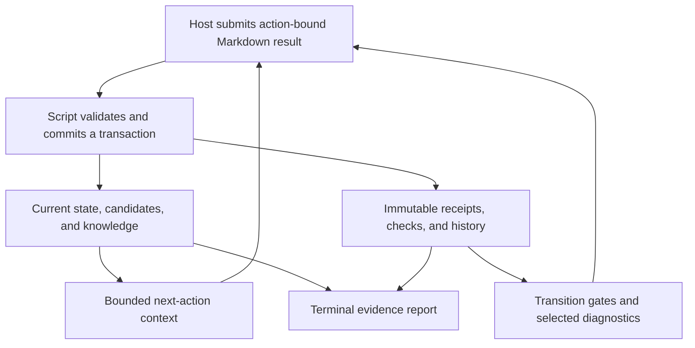

Every artifact has a purpose-specific consumer; this does not mean every
artifact should be reread in every iteration. The script's
`context --section artifacts` catalog identifies the available families and
their readers. Authoritative Markdown may contain a structured JSON fence;
there is **no writable JSON-backed Markdown mirror**. Host-authored inbox files
are proposals until accepted, and a historical receipt is not current state.

| Artifact family | Who writes it | Who reads it and when |
|---|---|---|
| `state.md`, `run.md`, `prompt.md` | Initialization and accepted script transactions. | Run identity/recovery and the current packet; `prompt` supplies original intent after a cold start. |
| `environment.md`, paired research files, `behavior.md`, `spec.md`, `lifecycle.md`, `plan.md`, `backchain/plan.md` | Their owning accepted survey/planning results and certified promotions; permitted replans use the script. | Downstream planning and execution context, DAG scheduler, identity and certificate validators. Current knowledge does not silently rewrite these baselines. |
| `planning/`, `step-planning/`, `objectives/` | Each loop's candidate, finding, pass and finalization transactions. | Current loop packets, shared-policy callers, fresh-final gates and bounded diagnostics. Old passes are retained, not loaded wholesale. |
| `steps/<id>.md`, `results/<action>.md`, `history.md` | Accepted execution actions and command receipts. | Current step context, replay/merge/outer gates, diagnostics and final reporting. A receipt for a different action cannot satisfy the current one. |
| `knowledge.md`, `knowledge-history/`, `observations/`, `knowledge-reads/` | Carry-forward or accepted observation callbacks and paging receipts. | Scoped cold-context consumers, finding/proof freshness checks, replay and historical diagnostics. Observations remain labeled by evidence quality. |
| Optional `outer-work.md`, `journal-requests/`, `outer-work-reads/` | Script-issued append/resolve callbacks and complete current read receipts. | Inner actions deduplicate; the owning outer stage reads and resolves due obligations; final gates/report inspect their status. Absence is valid until first use. |
| `shiploop-improvements.md` | Accepted generic proposal-journal requests. | Later proposal review/deduplication and final handoff/report. It never automatically modifies the ShipLoop package. |
| `checks/`, `manifests/`, `check-attempts/`, `logs/` | Verification commands record attempts, including failures. | Check/candidate freshness gates, selected `check-log` diagnostics and report summaries. Raw logs are evidence, not prompt instructions. |
| `history-pages/`, objective history archives, `merge-recoveries/`, `planning-history/`, `legacy-backup/` | History paging, explicit recovery, revisit/upgrade and migration. | Bound history proofs, selected current-review `review-history` context, and allowlisted `audit` diagnostics. Archives cannot promote themselves back to current authority. |
| `preparation.md`, `coverage.md`, `quality.md`, `delivery.md`, `handoff.md` | Matching accepted outer activities. | Later outer context, versioned handoff bindings and terminal rendering. Host-reported remote facts stay distinct from script-verified local checks. |
| `transaction.md` | A multi-file mutation writes its intent before targets. | The next locked command rolls an interrupted transaction forward; it is not a file to delete to bypass recovery. |
| `report.html` and `state.md.report` | Terminal renderer or explicit terminal-only regeneration. | Human review and integrity checks. HTML is derived; the Markdown binding records its provenance. |

Use `context --section audit --kind …` for the allowed historical families and
the packet's `check-log` selector for a specific action/attempt/check stream.
Both are bounded, screened diagnostic readers, not arbitrary filesystem reads
or evidence restoration commands. A missing, clipped or withheld excerpt must
not be described as a complete review. Secret-pattern screening is a safety
measure, not a guarantee; never submit credentials, signed URLs or sensitive
raw outputs in the first place. The [state-file guide](references/state-files.md)
contains the full record and reader contracts.

## Where a new learning belongs

The active context may discover something valuable before its current action
is ready to complete. Use the existing artifact owner, not a new notebook that
no later action will read:

| Learning or need | Route | Effect on the parent action and future work |
|---|---|---|
| Why this implementation decision mattered or which test exposed a bug | Current pass result and required verbose Git learning commit. | Contributes to that pass's audit evidence; future reviews read complete recent commit bodies. It does not replace tests or current knowledge. |
| Compatible operational fact discovered early, before successful tests | Read `context --section observation`; submit the exact script-issued `OBS-*` callback where supported. | Records an explicitly unverified checkpoint without completing the parent. Material proof/context changes require a supported repair route; permission/contract blockers cannot be cleared here. |
| Current-step repair, a pending-step obligation, or broader operational knowledge after checks | Mandatory `carry-forward` result with its impact assessment. | Updates current knowledge and selects informational, repair, pending-replan, or pause handling. `post-inner` must consider implications for remaining work. |
| Non-secret action genuinely due at whole-product quality, publication, or handoff | Read `outer-work` to deduplicate, then use its append callback. | Parent stays open. The named outer stage must consume the current journal and resolve due rows; current-step blockers cannot be parked there to claim Ready/Done. |
| A better generic ShipLoop prompt, script, or workflow | Generic `journal` proposal, stored in `shiploop-improvements.md`. | Deduplicated proposal for final review; no automatic package edit, new stage, integration or scheduled task. |
| A real scope, approved-contract, permission, credential, or incompatible environment change | Pause and seek direction; use only an applicable documented disposition/revisit/repair route. | Preserves evidence. Neither an observation nor a journal grants authority to change the approved baseline. |

One discovery can legitimately need more than one record: a commit explains
the learning, current knowledge states what later steps must know, and an
outer-work row names a specific deferred obligation. Use stable references and
deduplication rather than copying raw logs. These records have different
consumers, not competing authorities.

## Outer-work journal

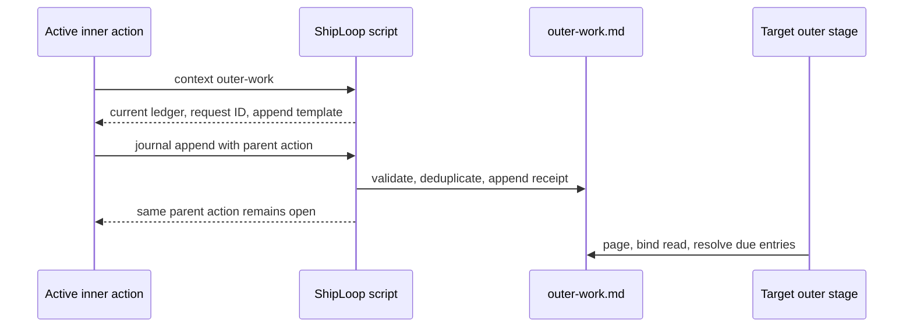

This is a side callback, not a second workflow. Any active inner action can
append a new non-secret dependency when it discovers work that belongs at
`quality`, `publish`, or `handoff`. It first reads the bounded ledger so that it
can reuse a stable `dedupe_key`; the script supplies the request ID and current
revision. The callback records provenance (`parent_action`, active step when
there is one, and parent stage), writes only authoritative Markdown, and returns
the original parent action unchanged.

At the target outer stage, the host must page the complete current journal,
provide the action-bound read receipt, and resolve every due planned entry with
evidence and reason. A quality entry blocks quality and later stages; a publish
entry blocks publish and handoff; a handoff entry blocks handoff. Entries have
only `planned` and `resolved` states—there is no waived or implicit-deployment
shortcut. The journal never grants credentials, changes a remote system, or
authorizes a deployment. See [outer-work reference](references/outer-work.md)
for its bounded record contract.

## Recovery and compatibility

Start with `next`, not with a reconstruction from chat or a fresh `init` over
an existing run. The packet supplies the exact valid action-bound command.
These are decision aids, not substitute callback templates:

| Observed condition | Safe next route | What it does not do |
|---|---|---|
| Context was cleared, a completion reply was lost, or work stopped mid-action | `next`, then selected `context`; inspect the existing work/effect before resuming. Identical accepted callbacks are replay-safe. | Does not repeat a remote operation merely because its reply was lost; an interrupted action earns no clean pass. |
| Local checks fail or a required environment is unavailable | Keep the action unfinished; diagnose/fix within scope, or `pause` for a real blocker. Rerun the required checks. | No successful result from prose, partial passing checks, or unavailable evidence. |
| A material active-step defect or proof drift appears before merge intent | Use the printed `repair` route, retain scoped changes, and reconverge the restarted review. | Does not preserve the old trivial streak or bless a changed revision with an old certificate. |
| A supported early observation invalidates current proof | Follow the callback's pause/repair route before continuing. | `resume` alone does not refresh invalidated proof or remove a contract blocker. |
| Whole-product review finds a product defect | `replan` at `coverage` or `quality` adds corrective pending DAG work. | No unreviewed patch around the inner loop. |
| Merge intent exists but has not landed | Inspect/reconcile Git; preserve and commit scoped intended work to clean the worktree; use exact `merge-recover`, then restarted Improve review/checks. | Does not abort Git automatically, undo a landed merge, accept a dirty checkout, or permit `verify` at the merge cursor. |
| An incompatible frozen requirement or authority must change | Pause for direction; a genuine contract change needs a new explicitly scoped run. Before execution, `revisit` can reopen supported planning stages. | No free-form state edit or unrestricted rebaseline. |
| Legacy state or a missing planning marker is detected | Use diagnostics and the specific migration/upgrade policy below. | No retrospective certificate for work that did not pass the required gates. |
| A terminal report needs presentation regeneration | `report` reads terminal evidence and updates its derived view/integrity metadata. | Does not complete an active run, rerun tests, or change achieved outcomes. |

Each multi-file state update uses a write-ahead `transaction.md` and the next
locked command rolls it forward. Do not delete it or edit state by hand to
bypass a gate. Use `pause` for a recoverable user/external blocker, `resume`
after resolution, and `halt` for a terminal unfinished exit. A carry-forward
blocker remains active after `resume`: only a later checkpoint with a
`no-contract-change` resolution can clear a false alarm or clarification, and
no resolution can rewrite an approved contract. Before any step receipt or active
work exists, `revisit --to survey|research|behavior|spec` archives superseded
planning inputs instead of erasing evidence: `research` preserves the surveyed
environment while archiving the research pair, behavior/spec/sequence downstream
artifacts, and their planning receipts/certificates/bindings; `behavior` and
`spec` retain their accepted research proof; `survey` archives all planning,
including the environment contract. Each target then issues a new action rather
than reusing an archived clean pass.

For a legacy run with `state.json` but no `state.md`, use `migrate` explicitly.
It archives only known legacy ShipLoop files, preserves code/branches/worktrees,
marks the planning protocol while restarting at preflight, and therefore reaches
the new planning checkpoints normally. It is not a way to resurrect deleted
Markdown authority or initialize a normal new run.

### New-run features versus old-run evidence

ShipLoop's package version and run protocol markers answer different questions.
A newer package can read an older run without claiming that old work passed new
gates. State remains version 3; supported markers select the applicable
contracts. **Missing-marker behavior is specific to each feature:**

| Marker or input | Current new-run contract | Missing or older-run behavior |
|---|---|---|
| Legacy `state.json` with no Markdown state | New runs use authoritative Markdown only. | Explicit `migrate`; retained prompt is recovered exactly or the run pauses for missing intent. Never a live JSON mirror. |
| `planning_protocol_version: 2` | Mandatory research, behavior and specification convergence. | Pre-v2/missing blocks workflow mutation until the guarded `planning-upgrade`; already executed work cannot be retroactively upgraded. |
| `step_planning_protocol_version: 1` | Nested plan before initial coding and every Improve application. | Safe-boundary adoption or repair of later execution, never an invented certificate for past edits. |
| `history_policy: {version: 2, required_limit: 7}` | Seven complete current Git commit bodies, bound to each required review. | Absent retains the legacy ten-body policy; no silent reduction of prior obligations. |
| `system_context_protocol_version: 1` | Source-linked research system context and task-relevant projections. | Unmarked runs retain their prior research contract; no assumed source-linked proof. |
| `observation_protocol_version: 1` | Script-issued unverified early-observation callbacks. | No implicit new callback authority in an unmarked run. |
| `outer_work_protocol_version: 1` | Optional lazy ledger, bound reads and stage-owned resolution. | Unmarked runs retain their prior outer-flow contract. |
| `objective_protocol_version: 1` | Generic substantive-objective routes for their base activities. | Non-current values use guarded objective adoption/restart handling, not assumed prior convergence. |
| `delivery_objective_protocol_version: 1` | Adds the converged handoff route when the objective protocol also applies. | Handoff without this marker retains legacy behavior; it is not certified retroactively. |
| Platform discovery/revalidation and risk-policy markers | Explicit tool/environment contracts, selected fresh safe-probe attestations, security/fuzzing/maintenance decisions. | Missing markers preserve their documented legacy compatibility, not a claim of current remote access or past risk review. |

Marker handling is feature-specific: explicitly validated markers such as
history, system context, observations and outer work reject unsupported values;
some planning/objective markers instead have guarded adoption or restart
paths. Do not add markers by hand. The following two upgrade sections describe
the planning adoption paths; the current packet supplies any required objective
restart, and the
[state authority rules](references/state-files.md#authority-and-safety-rules)
give the remaining exact contracts.

### Earlier Markdown runs and planning-protocol upgrade

New runs carry `planning_protocol_version: 2`. A pre-v2 Markdown run (including
a missing marker) is deliberately fail-closed: `next`, `status`, and bounded
`context` are diagnostic, while `pause`, `resume`, and `halt` remain lifecycle
controls. Other workflow mutation is blocked until the packet's exact command:

```sh
shiploop planning-upgrade --run-dir RUN --action CURRENT_ACTION
```

The upgrade requires that exact action, no `steps/*.md` receipt, and no active
step. Otherwise it refuses all old executed runs and requires a fresh run; it
preserves the existing work rather than deleting, replaying, or certifying
execution. With no step receipt, it archives `research.md`,
`research-evidence.md`, every planning artifact, and downstream contracts under
`planning-history/<action>/upgrade`, clears research/behavior/spec/lifecycle/plan
hashes, increments the planning epoch, and records the v2 marker. The archive is
evidence of earlier planning, **not** proof that its research, behavior, or
specification converged.

An old cursor can remain at `preflight`, `approach`, `survey`, or `research` when
that earlier gate is still present; a preserved research cursor gets fresh
candidates because its old pair was archived. Any later cursor restarts at
`research` when `environment.md` exists, or `survey` when it does not. It
preserves product code, branches, and worktrees in every case; no upgrade can be
used to skip the mandatory research, behavior, or specification loops.

### Existing runs and the execution-plan marker

New runs also carry `step_planning_protocol_version: 1`. A v3 run missing that
marker does not gain a retrospective certificate for prior direct implementation
or an already-written Improve draft. At the safe `schedule`, `implement`, or
`improve-plan` boundary, ShipLoop records the marker and sends the next product
edit through the appropriate nested plan loop. If the active action is later in
execution, use the existing `repair` route to record the interrupted work and
restart review; do not edit Markdown state to pretend the plan gate ran.
Read-only `status`, `context`, and `plan-status` inspection remain available.

## Current limitations and proposed safeguards

### Remaining recovery boundaries

The diagrams do not imply that missing intent or ambiguous external state can
be reconstructed. These boundaries remain explicit:

| Gap | Affected boundary | Operator consequence |
|---|---|---|
| Legacy state never retained a usable prompt. | Cold-start recovery after migration | Migration records unrecoverable intent and pauses. Inspect diagnostics and obtain direction or start a new scoped run; never fabricate the prompt. |

The final-verify convergence binding now rejects post-convergence product edits,
and outer closure now requires a clean checkout descending from every integrated
step receipt (apart from a certified Review Coverage ledger). Lifecycle
validation also rejects a marked DAG step when its activity is `none`, or is
placed outside the DAG (`preparation: outer-before`, `publish: outer-loop`).
These safeguards do not add a semantic correctness
oracle; the remaining limits above still require careful host judgment.

Full Git messages now have bounded fragment retrieval:
`history --limit 1 --skip N --full --max-chars 4000`. Follow each emitted
continuation exactly until the complete body is covered. Pages are bound to
the action, HEAD and message identity; partial or stale pages cannot count as
review proof. The cap is Unicode characters in the message fragment, not total
response bytes. Legacy `--full` without the bound remains unbounded. See the
[history protocol](references/action-protocol.md#git-history-and-improve-commits).

Git message lines are JSON-quoted as untrusted evidence, including the legacy
full display. Quoting never changes the archived message or its coverage digest.
Only an unquoted script-owned continuation is a command. Environment packet
projections also bound individual fields and total output, with explicit
truncation indicators and paged full-context pointers; they are navigation, not
complete operational arguments. Context offsets count Unicode characters, not
bytes. Recognized credential patterns are rejected/redacted, but this is not a
complete secret-detection guarantee.

Aborted merge intent now has an explicit `merge-recover` route. First reconcile
Git yourself; ShipLoop never aborts a merge automatically. With the exact current
merge action, it refuses an in-progress or already-landed merge, unrelated branch,
or dirty product checkout. If the active worktree changed after merge intent,
first preserve or reconcile and commit the scoped intended work to clean it,
invoke `merge-recover`, and only afterward run the restarted full Improve review
and checks rather than `verify` before recovery. A safe recovery retains
branch/worktree and an immutable recovery checkpoint, clears the abandoned intent,
resets convergence, and restarts review. A manually reconciled descendant of the
old target must pass the full review/final verification cycle again; the actual
merge remains bound to its exact verified target. Ordinary `repair` cannot bypass
merge intent.

Legacy migration now recovers a nonempty `state.prompt` byte-for-byte into
`prompt.md` in the same Markdown transaction and records its source and digest.
Missing, blank or non-string prompt data cannot become successful cold-start
evidence: the migrated run stays paused, offers diagnostics, and rejects
advancement. Backups, product files, branches and historical receipts are retained.

### Carry-forward is current; unrestricted rebasing is deferred

The `verify → carry-forward → commit` checkpoint and bounded current knowledge
overlay are current behavior. They preserve non-secret operational learning,
pending obligations, and safe pause resolution while leaving the approved
baseline unchanged. Unrestricted environment or requirements rebasing,
generalized credential detail, and arbitrary-stage observation remain deferred;
an incompatible discovery pauses for direction and a real contract change needs
a new explicitly scoped run.

### Current sequence and outer objective convergence

The mandatory research, behavior, specification, execution-plan, and generic
objective loops are current. `sequence`, authorized preparation, post-inner,
coverage, quality, and (for new runs) handoff retain a Markdown candidate,
stable findings, bound context, candidate-bound checks, full-body Git-history
evidence, audit-only learning commits, and a certificate after two trivial
verified passes and a fresh final check. Handoff additionally binds outer
evidence and the current outer-work ledger. A journal change invalidates the
bound objective; use its allowed explicit repair/rebind route before it can
converge again. Rebinding archives the old pass and restarts review, rather
than silently inheriting convergence.

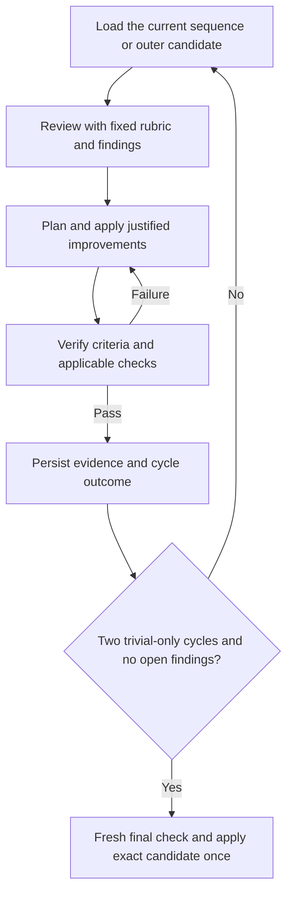

Objective certificates bind the candidate, ledger, context, final check and
audit history, so a changed artifact cannot inherit a clean result. A material
finding or candidate rewrite resets the trivial streak; no cycle limit or LLM
completion claim is success. New product work found by coverage or quality is
corrective pending DAG work through `replan`, not an outer-checkout patch.

This convergence discipline still does not prove semantic correctness, test
adequacy, live external state, or user acceptance. The host must evaluate those
questions and record honest limitations; the generic ShipLoop journal remains
proposal-only and does not modify the harness.

## Command reference

The compact stdout packet is authoritative for the current action. The command
surface is:

```sh
shiploop init     --repo REPO [--run-dir RUN] --prompt=TEXT
shiploop next     --run-dir RUN
shiploop status   --run-dir RUN
shiploop report   --run-dir RUN
shiploop plan-status --run-dir RUN --loop STEP_PLAN_LOOP
shiploop context  --run-dir RUN --section SECTION --offset 0 --limit 4000 [--digest SHA256]
shiploop context  --run-dir RUN --section review-history --record ARCHIVE_PATH --offset 0 --limit 4000 [--digest SHA256]
shiploop complete --run-dir RUN --action ACTION --result RESULT.md
shiploop verify   --run-dir RUN --action ACTION --manifest CHECKS.md [--reason=TEXT]
shiploop planning-verify  --run-dir RUN --action ACTION --manifest CHECKS.md [--reason=TEXT] [--timeout N]
shiploop planning-upgrade --run-dir RUN --action ACTION
shiploop history  --run-dir RUN --action ACTION --limit 1 --skip N [--full]
shiploop history  --run-dir RUN --action ACTION --limit 1 --skip N --full --max-chars 4000
shiploop journal  --run-dir RUN --action ACTION --result PROPOSALS.md
shiploop journal  --run-dir RUN --target outer --operation append --action PARENT_ACTION --result REQUEST_RESULT.md
shiploop journal  --run-dir RUN --target outer --operation resolve --action OUTER_ACTION --result REQUEST_RESULT.md
shiploop repair   --run-dir RUN --action ACTION --reason=TEXT
shiploop merge-recover --run-dir RUN --action ACTION --reason=TEXT
shiploop replan   --run-dir RUN --action ACTION --result CORRECTIVE_PLAN.md
shiploop revisit  --run-dir RUN --action ACTION --to survey|research|behavior|spec --reason=TEXT
shiploop pause    --run-dir RUN --reason=TEXT
shiploop resume   --run-dir RUN
shiploop halt     --run-dir RUN --reason=TEXT
shiploop migrate  --run-dir RUN
```

`TEXT` is literal data: use one `--name=value` argument, including with
structured argv. In a shell single-quote it, escaping embedded `'` as `'\''`.
For example `--reason='--help'` records that literal reason instead of parsing
it as an option. Never paste raw requests into double-quoted shell source.

Use absolute paths for `--result` and `--manifest` when the working directory is
ambiguous. `verify`, `planning-verify`, `history`, `journal`, `repair`,
`replan`, `revisit`, and `planning-upgrade` require the exact printed action
when that command is valid for the current stage. Do not use old
inferred-completion commands, bare `complete`, or a hand-constructed stage
transition. `plan-status` is read-only: it can confirm only an exact finalized
execution-plan handoff before its target product action begins; it does not
advance work or bless drift.

The first `journal` form is the generic ShipLoop improvement-proposal journal.
The `--target outer` forms are packet-issued side callbacks: their result file
uses the exact append or resolve template returned by `context --section
outer-work`. `PARENT_ACTION` stays open after append; `OUTER_ACTION` is the
current matching `quality`, `publish`, or `handoff` action for a resolution.
Never substitute a hand-written request ID, revision, target stage, result path,
or completion command. An exact replay is safe; a changed replay is rejected.

`report` regenerates the derived [terminal report](references/report.md) for an
already terminal run. It refreshes integrity metadata, increments the run
revision and appends a `report-regenerated` audit event in Markdown. It does not
change the terminal outcome, action, product worktree or accepted check results.
The new audit event changes report inputs; CLI regeneration need not yield the
same bytes, even though pure rendering of identical inputs is deterministic.

## Maintainer map and verification

The entry [SKILL.md](SKILL.md) is intentionally small. Human explanation lives
here; stage-specific instructions live under `references/`; scripts own state,
packets and gates. Update documentation against actual routing, not a desired
phase diagram. Adding a new artifact requires an owner and an appropriate
decision, validation, diagnostic, recovery or final-report reader—not another
large mandatory prompt payload.

| Question | Decisive implementation |
|---|---|
| What action runs next, and what must a completion prove? | [Protocol routing and gates](scripts/shiploop_protocol.py), [packet construction](scripts/shiploop_packets.py), and [CLI/product Improve projection](scripts/shiploop). |
| Where is the until-loop decision actually reused? | [Pure `decide` policy](scripts/shiploop_until.py), [specialized planning owner](scripts/shiploop_planning.py), [step-plan records and certificates](scripts/shiploop_step_planning.py), and [generic objective owner](scripts/shiploop_objectives.py). |
| What persists across a cold context? | [Markdown transactions](scripts/shiploop_store.py), [current knowledge](scripts/shiploop_knowledge.py), and [bounded artifact readers](scripts/shiploop_artifacts.py). |
| How do environmental facts reach implementation? | [Platform discovery](scripts/shiploop_discovery.py), [research evidence](scripts/shiploop_research.py), [system-context projection](scripts/shiploop_system_context.py), and [action revalidation](scripts/shiploop_revalidation.py). |
| How are tests, history and new observations bound? | [Check evidence](scripts/shiploop_evidence.py), [step contract protocol](scripts/shiploop_contract_protocol.py), [history policy](scripts/shiploop_history_policy.py), and [early observations](scripts/shiploop_observations.py). |
| Who consumes deferred outer work and reports achievements? | [Outer-work journal](scripts/shiploop_outer_work.py), [delivery evidence gates](scripts/shiploop_delivery.py), and [offline report renderer](scripts/shiploop_report.py). |

In the **skill-craft source checkout**, not an installed package, the stable
verification entrypoint is:

```sh
bash test/shiploop.test.sh
```

It runs the ShipLoop protocol suites, including shared-policy unit tests,
specialized/nested/objective convergence, full action walks, cold-context
packets, contracts/checks, system context, observations, outer-work readers,
history paging, migration, merge recovery and report evidence. Focused examples:

```sh
python3 test/shiploop-until.test.py
python3 test/shiploop-step-planning.test.py
python3 test/shiploop-objectives.test.py
python3 test/shiploop-action-walk.test.py
```

A green synthetic action walk establishes the exercised local state-machine
behavior—not production acceptance, research quality, or an actual remote
deployment. For README changes, also check internal anchors, packaged relative
links, Mermaid rendering, and agreement with the current packet vocabulary.
In the source checkout, `skills/shiploop/` is canonical and
`plugins/shiploop/skills/shiploop/` is derived. After a scoped edit:

```sh
bash scripts/sync-plugin-views.sh shiploop
bash scripts/sync-plugin-views.sh --check shiploop
git diff --check
```

Do not synchronize unrelated skills or use documentation validation as a reason
to initialize a real run, start standalone until-loop, install an integration,
change persistent configuration, or publish a product.

## Related references

- [Action protocol](references/action-protocol.md): action IDs, result fields,
  command semantics, evidence, convergence, corrective replan, and migration.
- [Survey guide](references/survey.md) and
  [validate-spec activity](references/activities/validate-spec.md): environment,
  writer, routing, UI, and client–service constraints.
- [Planning activity](references/activities/plan.md): one validated DAG,
  prerequisite audit, lifecycle placement, and Review Coverage.
- [Planning convergence loops](references/planning-loops.md): mandatory
  research/behavior/spec candidate loops, rubric/finding evidence, planning
  checks, audit-only commits, finalization, and upgrade behavior.
- [Execution-plan convergence](references/execution-planning.md): current
  nested planning gate before initial source edits and Improve applications,
  its ten-dimensional review, cold-context packets, audit passes, and
  incorporated until-loop policy.
- [Universal substantive-objective loop](references/objective-loops.md): the
  policy-owned history, two-trivial-pass refinement applied to substantive
  outer stages, including versioned handoff.
- [Outer-work journal](references/outer-work.md): side callbacks from inner
  work, deduplication, stage-bound resolution, and no-authority boundary.
- [Research loop](references/research-loop.md#draft): typed research candidate
  schema; see its [review](references/research-loop.md#review),
  [freshness](references/research-loop.md#evidence-and-freshness), and
  [later-discovery](references/research-loop.md#later-discoveries) contracts.
- [Implementation activity](references/activities/implement.md): worktree,
  lint, tests, evidence, and commit discipline.
- [Carry-forward checkpoint](references/carry-forward.md): current knowledge
  ledger, bounded cold-start retrieval, impact routes, and safe observations.
- [Testing and documentation contract](references/testing-and-documentation.md):
  case records, surface selection, compact contracts, README review, and
  deployment evidence.
- [Global system-test catalog](references/system-tests.md): accepted-DAG V1
  catalog, ordinary test-step placement, pre/post-deployment fan-in, immutable
  corrective changes, quality closure, and safety boundaries.
- [Behavioral requirements contract](references/behavioral-requirements.md):
  evidence-led discovery, product flows and states, `R-/F-/T-` traceability,
  breadth review, and model-to-case links.
- [State-file guide](references/state-files.md): durable run files and recovery
  inspection.
- [Offline terminal report](references/report.md): generated `report.html`, its
  integrity binding, evidence boundary, and regeneration behavior.
- [Host matrix](references/host-matrix.md): host-specific invocation
  constraints; it is a reference, not mutable run state.

If this guide, a historical run, and the current packet differ, follow the
packet and [action protocol](references/action-protocol.md), preserve the
evidence, and record the documentation issue as a generic ShipLoop proposal.
