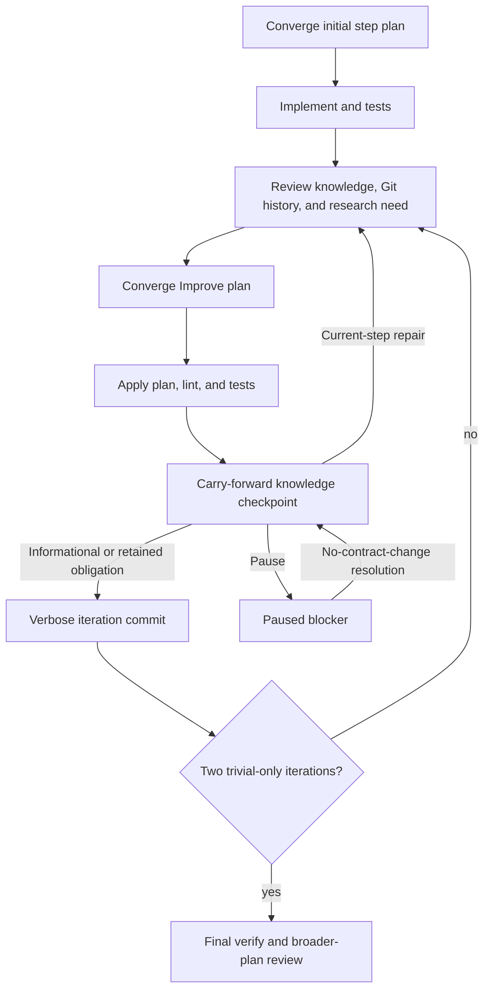

# Action protocol (ShipLoop 0.9)

ShipLoop is deliberately usable from a small context window.  The script owns
the durable facts in the run directory and prints one bounded next action.  A
host supplies judgment, edits, and evidence; it must not infer a transition
from chat memory or an earlier prompt.

## The action contract

`init`, `next`, `status`, and every successful mutating command print the
current action.  Its `Action:` value is a single-use capability.  Pass that
exact value to `complete`, `verify`, `planning-verify`, `history`, `journal`, or `repair` only
when the printed action calls for that command.  A stale action is refused.

Write a result as Markdown with exactly one `shiploop-state` JSON fence.  The
JSON inside the fence is structured state **inside authoritative Markdown**;
it is not a writable `.json` sidecar.

````markdown
# Result for the printed action

```shiploop-state
{
  "summary": "What was done, what evidence was examined, and the outcome."
}
```
````

The script rejects duplicate fences, duplicate JSON keys, empty required
fields, stale actions, and a different payload replayed for an already
completed action.  Repeating the *same* completed action with the identical
result is safe and prints the current next action instead of performing the
transition twice.

Use absolute paths for `--result` and `--manifest` when the current working
directory is ambiguous. Do not put secrets in a result, manifest, journal, or
log. The [carry-forward checkpoint](carry-forward.md) adds a strict
expected-role/safe-probe policy for current operational observations.

The printed commands choose host-authored inputs under the run's `inbox/`.
Use those paths: placing result drafts in the product working tree after a
check changes its fingerprint and correctly makes that evidence stale. Inbox
files are drafts; completion imports an immutable result snapshot into the
script-owned Markdown records.

## Commands

The 0.9 CLI intentionally replaces `update`, `start-step`, `complete-step`,
`clear-step`, `inject-step`, and flagless `complete`.

```sh
CLI="$SKILL_ROOT/scripts/shiploop"

python3 "$CLI" init --repo "$REPO" --run-dir "$RUN_DIR" --prompt "…"
python3 "$CLI" next --run-dir "$RUN_DIR"
python3 "$CLI" status --run-dir "$RUN_DIR"
python3 "$CLI" report --run-dir "$RUN_DIR"
python3 "$CLI" plan-status --run-dir "$RUN_DIR" --loop "$STEP_PLAN_LOOP"
python3 "$CLI" context --run-dir "$RUN_DIR" --section iteration --offset 0 --limit 4000
python3 "$CLI" done --run-dir "$RUN_DIR" --action "$ACTION" --result /absolute/result.md
python3 "$CLI" complete --run-dir "$RUN_DIR" --action "$ACTION" --result /absolute/result.md
python3 "$CLI" verify --run-dir "$RUN_DIR" --action "$ACTION" --manifest /absolute/checks.md [--reason "why the manifest changed"] [--timeout 60]
python3 "$CLI" planning-verify --run-dir "$RUN_DIR" --action "$ACTION" --manifest /absolute/planning-checks.md [--reason "why the manifest changed"] [--timeout 60]
python3 "$CLI" planning-upgrade --run-dir "$RUN_DIR" --action "$ACTION"
python3 "$CLI" history --run-dir "$RUN_DIR" --action "$ACTION" --limit 10 --skip 0 [--full]
python3 "$CLI" history --run-dir "$RUN_DIR" --action "$ACTION" --limit 1 --skip N --full --max-chars 4000
python3 "$CLI" journal --run-dir "$RUN_DIR" --action "$ACTION" --result /absolute/proposals.md
python3 "$CLI" repair --run-dir "$RUN_DIR" --action "$ACTION" --reason "specific defect found after verification"
python3 "$CLI" replan --run-dir "$RUN_DIR" --action "$ACTION" --result /absolute/corrective-plan.md
python3 "$CLI" revisit --run-dir "$RUN_DIR" --action "$ACTION" --to research --reason "correct research evidence before execution"
python3 "$CLI" pause --run-dir "$RUN_DIR" --reason "specific external or user blocker"
python3 "$CLI" resume --run-dir "$RUN_DIR"
python3 "$CLI" halt --run-dir "$RUN_DIR" --reason "terminal reason"
python3 "$CLI" migrate --run-dir "$RUN_DIR"
```

`pause` preserves the pending action and records a non-success state.
`resume` reprints that action after the blocker is resolved; it does not claim
completion. For a paused material `scope` or `behavior` execution-plan finding,
it only unblocks the exact `step-plan-disposition` action; it does not clear the
finding or advance to `step-plan-revise`. Then use that action's printed
`complete --action … --result …` command; `repair` cannot bypass its open
blocker. `halt` is terminal for the run and writes an unfinished handoff.
`repair` is for a real defect found after an iteration was otherwise recorded:
it records the reason, resets the trivial streak, and returns to Improve
review.  It never makes a failed check pass or deletes work.
Outer `replan` is available only at coverage or quality (including their active
objective loops): it adds a corrective
pending step through the same validated revision contract, never patches code
around the inner loop.

`report` is available only after `done` or `halted`. It regenerates derived
offline `report.html`, refreshes its integrity binding in `state.md`, increments
the revision and appends a `report-regenerated` history event. It does not supply
completion evidence, change product files, accepted checks, or the phase/stage
and action cursor. Pure rendering is deterministic for identical inputs; a CLI
regeneration adds audit input and therefore can change report bytes and digest.
See [offline terminal report](report.md).

For an active universal objective, `repair` has narrow routes. An approach or
survey objective may archive its current pass and rebind only before frozen
behavior/spec/plan or active step work exists. A post-inner objective repair
archives its pass, records a material interrupted iteration, clears stale final
and merge proof, and returns to the step's Improve review. Other objective
kinds must restore frozen inputs or use the approved planning/outer replan path.
`revisit` may abandon an active survey, sequence, or preparation-readiness
objective only before execution and then follows the ordinary planning archive
rules. `replan` may abandon an active coverage or quality objective only while
adding corrective pending DAG work; it schedules that work rather than treating
the objective as converged.

`plan-status` is a read-only diagnostic for a named execution-plan loop. It
succeeds only at its exact post-finalization handoff action when its certificate,
final planning check, frozen context, worktree, and target stage still match.
It does not advance a stage or make a plan reusable after source/environment
drift.

Use `--reason` with `verify` when replacing a manifest already recorded for
the current action.  Explain why the check set changed (for example, a newly
added acceptance test); use the same manifest when nothing changed.  This
keeps check changes visible rather than silently weakening validation.

`init --force` is intentionally not a destructive reset.  Start a fresh
`--run-dir` for a new session; prior journals, receipts, branches, and
worktrees remain available for inspection.  Run `migrate` only for a legacy
JSON run, described below.

Migration restores a nonempty legacy `state.prompt` exactly into `prompt.md`
and records source/digest metadata atomically with the Markdown state. If the
legacy field is missing, blank or non-string, the result is explicitly
`unrecoverable`: no prompt is invented, the migrated run remains paused, and
`next`, `resume` and advancing commands are refused. Inspect `status`,
`context --section prompt` and `migration.md`, then seek direction or start a
new scoped run. A conflicting existing prompt file is not overwritten.

A new run directory must be dedicated and empty, not the repository root.
Before any step receipt or active work exists,
`revisit --to survey|research|behavior|spec` can correct planning inputs. It
works while paused, archives superseded dependent Markdown under
`planning-history/`, and returns the new action. `--to research` preserves the
survey but archives the research pair, behavior/spec/sequence downstream
artifacts, and planning receipts/certificates/bindings; behavior/spec retain
their accepted research proof. `--to survey` archives all planning, including
the environment contract. Revisit never deletes product work, journal entries,
or prior evidence. After execution begins, use pending-only plan revisions;
changed product requirements need user direction.

Pre-v2 active Markdown runs (including version 1 or a missing marker) require
the printed, action-bound `planning-upgrade` command. With no step receipt or
active work, it archives the research pair, all planning artifacts and downstream
contracts, clears research/behavior/spec/lifecycle/plan bindings, and reissues fresh
planning; otherwise it refuses every old executed run. Read the
[compatibility contract](planning-loops.md#earlier-markdown-runs) before choosing
a fresh run. Do not manufacture a marker or certificate by hand.

Use `context` instead of requesting a giant packet. Its sections are `prompt`,
`step`, `iteration`, `knowledge`, `spec`, `environment`, `plan`, `lifecycle`,
`journal`, `approach`, `research`, `behavior`, `spec-draft`, `lifecycle-draft`,
`research-evidence`, `planning`, `step-context`, and `step-plan`.
`research` and `research-evidence` select the current paired report/evidence
candidate rather than every archived research pass. `step-context` selects the
bounded active-step prompt, current implementation/diff, environment/knowledge
bindings, and direct dependencies. On an Improve route it also projects the
enclosing product review as `enclosing_review`, with stable `PARENT-…` finding
IDs and a bound digest; `step-plan` selects the current nested plan candidate
and finding ledger. Read `prompt` first after a cold context loss,
then `planning`/`iteration` during an upstream planning loop,
`step-context`/`step-plan`/`iteration` during an execution-plan loop, or
`knowledge`, `step`, and `iteration` during ordinary execution. `knowledge`
returns scoped current entries plus every open/scheduled obligation and open
blocker; page it fully before every execution review. `context environment`
shows the frozen baseline plus a labeled current overlay, which is authoritative
state for host-reported observations but cannot change the baseline. The same
`iteration` selector is phase-aware and selects the current nested pass when
step planning is active; it does not load history. `--limit` is a character
bound (1 through 8000), not a token guarantee. Page with the printed offset and
digest; the digest refuses a page when state changed between requests.

## Check manifest and evidence

Every implementation and every Improve iteration must run a linter and the
required tests.  The host chooses meaningful commands for the actual
repository and declared output; the script verifies that they are explicit,
fresh, successful, and cover the step's declared `produces`.
Research/behavior/spec planning loops instead use `planning-verify` and the
packet's exact acceptance `research evidence`, `behavior model`, or
`specification`, not a nonexistent lifecycle or future product test. The
[planning check contract](planning-loops.md#checks-and-commits) adds
candidate/ledger identity and audit-baseline binding to ordinary check evidence.
Research checks validate the accepted candidate structure and safe local-probe
claims; they do not prove a remote source is live. Do not use execution `verify`
for planning stages. The nested execution-plan loop also uses
`planning-verify`, with exact acceptance `step plan`; it validates the plan
artifact before source edits, not the future implementation or a remote
environment. See [Execution-plan convergence](execution-planning.md).

````markdown
# Checks for S1

```shiploop-state
{
  "checks": [
    {
      "id": "lint-python",
      "kind": "lint",
      "argv": ["python3", "-m", "ruff", "check", "src"],
      "acceptance": []
    },
    {
      "id": "test-widget",
      "kind": "test",
      "argv": ["python3", "-m", "pytest", "tests/test_widget.py"],
      "acceptance": ["src/widget.py", "tests/test_widget.py"]
    }
  ]
}
```
````

`argv` is an argument list, never a shell string.  Each declared `produces`
value must occur in at least one `test.acceptance` list.  Use concrete lint
commands appropriate to code, configuration, documentation, or generated
artifacts; do not omit lint merely because the change looks small.  A test
check is always required.  Do not use a file-existence check as a substitute
for behavior or contract validation.

At outer `quality`, the required strings instead come from
`lifecycle.acceptance`, not the completed step's `produces`. Retrieve them
with `context --section lifecycle`; map whole-product tests to every exact
acceptance string and include a lint check in the outer manifest.

`verify` saves a manifest digest, before/after working-tree fingerprints,
per-check status, and paths to stdout/stderr logs under the run directory.  A
non-zero exit, timeout, missing log, changed tree during a check, stale
fingerprint, stale action, or changed manifest prevents completion.  Fix the
cause and run a fresh `verify`; a green claim in prose is not evidence.
Each attempt is retained under `check-attempts/`, including failed attempts.
Logs may retain exact command output; never place secrets in commands, output,
results, manifests, or journal entries. Treat logs and results as sensitive
evidence rather than perfectly redacted public reports. A successful local
command is not evidence of a remote publication, deployed effect, or external
system state.

## Test cases and product documentation

The packet links only the relevant section of the
[testing and documentation contract](testing-and-documentation.md). These are
host duties in the existing stages, not additional machine-validated result
fields. Scope includes expected-outcome cases, relevant browser/service/API
tests, concise changed function contracts, and product README review.

Planning records case expectations, environment/fixture prerequisites, and
test/documentation deliverables in existing `body` and `plan` values. Each
step prompt points to its relevant cases and exact outputs. Product files are
created/updated in the step worktree, not during survey. Use code-adjacent
contracts and test references rather than repeating implementation details.

At `step-plan` and `improve-plan`, put the planned cases, documentation work,
expected outcomes, and revalidation triggers in the plan `body`. At
`step-plan-review`, retain the context and test/documentation evidence required
by its rubric; at `step-plan-revise`, retain planned case/documentation deltas
and prevention. At `implement`, `review`, and `quality`, `test_review` records
case IDs and durable paths, expected-versus-observed outcomes, actual
environment/build, evidence, and documentation changes or an explicit no-change
reason. At `improve-apply` use `test_changes`/`learnings`; at `verify`, `commit`,
and `final-verify` use `summary` for compact references. These are conventions
for existing text fields, not a new JSON sidecar or mandatory custom parser.
Result snapshots preserve them across context loss.

Actual observations go into the packet's inbox result after checks; do not
change product files to record a run result and then reuse stale evidence.
Required unrun/blocked checks cannot become passed or not-applicable by prose.

## Per-step Ready and Done contract

New runs require a version-1 contract. Each DAG step carries one bounded
`contract` whose `objective` exactly
matches the step statement and whose `ready`, `done`, `tests`, and
`documentation` criteria cover every declared `produces` value. Dependency
readiness means only **ready to plan**. Ready to code requires the initial
step-plan finalization and its bound planning check.

The public evidence payload deliberately stays small. Before source edits,
`ready_evidence` is exactly `{ "ready": [...] }`; each row identifies a ready
criterion, condition, method, evidence source/reference, and observed result.
After implementation, `done_evidence` is exactly
`{ "done": [...], "tests": [...], "documentation": [...] }`. It records
criterion IDs and observed evidence, while the script binds the Git head,
environment, contract, artifact identity, and check action internally. Hosts
must not copy or forge those durable identities into the public receipt.

Done evidence is not merge evidence. Final verification demonstrates the
required outcome before merge; the later merge records local integration. A
deployment-only criterion remains host-reported evidence and never becomes a
local check merely because the branch merged.
Missing/stale documentation that materially misleads use or validation is a
material finding. Host judgment still determines test and documentation adequacy.

Whole-product acceptance that needs a deployed environment must have its
authorized deployment/readiness and dependent checks sequenced before outer
quality. Outer publication adds final delivery smoke evidence in the existing
`verification`/`evidence` fields; local tests are not remote verification.
Handoff links checked cases, function/API reference, and the product README,
and states limitations separately from the generic ShipLoop proposal journal.

## Behavioral requirements and traceability

Packets also select a section of the
[behavioral requirements contract](behavioral-requirements.md). Starting from the
durable incoming prompt, the host researches product sequence flows and required
state transitions, including invalid events and relevant failure/recovery paths.
The spec body preserves requirement/flow/transition IDs, invariants, guards,
effects, evidence, exclusions, and expected-outcome cases. Material ambiguous
behavior requires direction before freeze. A stateless input-output contract
can explain why a persistent-state model is inapplicable.

Sequence maps this model into exact outputs, tests and documentation work; every
Improve cycle reviews affected and adjacent paths, and post-inner/quality review
broader implications. Keep compact decisions, IDs and durable model/evidence
references in the current results. The
[planning-loop contract](planning-loops.md) adds explicit review/plan/apply/
verify/commit/finalize stages and structured finding/rubric fields before spec
freeze; it enforces progression and evidence, not semantic completeness.
Product diagrams describe product behavior; the ShipLoop DAG describes work
dependencies. Neither replaces the other, and passing commands alone cannot
prove the model complete. Never silently edit frozen acceptance after learning.

## Results by stage

Every `complete` result has a nonempty `summary`, plus the fields below.
Fields named `body` or `plan` are ordinary Markdown strings stored in their
own authoritative `.md` file.

| Printed stage | Additional required result fields and action |
|---|---|
| `preflight` | `baseline: "committed-head"`; describe Git head, dirt preserved, available runtime/checks, and prep findings. |
| `approach` | `body`; a concise initial delivery approach, risks, milestones, prep candidates, and acceptance strategy. |
| `survey` | `body`; complete `environment.md` prose plus `## machine` fenced JSON. |
| `research` | `body` and complete `research_state` with stable typed questions and sources. The script imports the paired research/evidence candidates. See [Research draft](research-loop.md#draft). Starts the research loop, not behavior. |
| `behavior` | `body`; prompt-linked requirements/flows/states/transitions, edge conditions, sources and case expectations. Starts the behavior loop, not spec. |
| `spec` | Draft `body` with exact `done_sentence:` and `checkable: true`; `lifecycle` with `acceptance`, `preparation`, `publish`, `quality`, and `reason`. Starts spec review; does not freeze or sequence. |
| `research-review`, `behavior-review`, `spec-review` | First run `history`; then `findings` with stable `id`, `severity`, `summary`; complete `coverage_review` rubric object; `test_review`; `learnings`. Old unresolved IDs remain open. Research uses the detailed [research review rubric](research-loop.md#review). |
| `research-plan`, `behavior-plan`, `spec-plan` | Markdown `body` and `addresses` listing every open finding ID. |
| `research-apply` | Complete replacement `body` and complete typed `research_state`; `material` boolean, `resolutions: [{id,evidence}]`, `test_changes`, `learnings`. Question/source IDs cannot disappear; resolved questions name known source IDs, not-applicable questions give an N/A rationale and may retain source IDs, and open/blocked questions prevent finalization. |
| `behavior-apply`, `spec-apply` | Complete replacement `body`; spec also includes `lifecycle`; `material` boolean, `resolutions: [{id,evidence}]`, `test_changes`, `learnings`. Omitted resolutions stay open. |
| `research-verify`, `behavior-verify`, `spec-verify` | First run artifact-bound `planning-verify` for the action, then complete with `summary`. The research acceptance is exactly `research evidence`. |
| `research-commit`, `behavior-commit`, `spec-commit` | `commit`: full SHA of the audit-only direct-child HEAD; four required sections/trailer and verbatim learnings. Only a fully checked and recorded pass counts. |
| `research-finalize` | Two consecutive trivial-only passes, no open findings/questions, and a fresh `planning-verify` required. `summary` only: no replacement `body` or `research_state`. It writes the as-of research certificate; see [evidence and freshness](research-loop.md#evidence-and-freshness). |
| `behavior-finalize`, `spec-finalize` | Two consecutive trivial-only passes, no open findings and a fresh `planning-verify` required. `summary` only for candidate content: no replacement `body`/`lifecycle`. Freeze behavior or promote spec/lifecycle, respectively. |
| `sequence` | `plan` with matching `done_sentence:` and Review Coverage; nonempty string `dependency_review`; exactly one compatible `dag` object or absolute `dag_file` Markdown draft containing one `shiploop-state` object fence. |
| `prepare` | `evidence`; only authorized outer-before preparation and its probes. |
| `step-plan` | Initial Markdown `body` for the active ready step only. It starts a bound initial execution-plan loop and does not edit product source. |
| `step-plan-review` | First fully page `context --section knowledge`, retrieve bounded `step-context`, `step-plan`, and current `iteration`, and run `history`. Submit matching `knowledge_read: {revision,digest,scope}`, stable `findings: [{id,severity,category,summary}]`, complete ten-key `coverage_review`, four-key `context_evidence: {step,implementation,environment,dependencies}` (each a concrete string or nonempty string list), `test_review`, and `learnings`. Use material `scope` or `behavior` only for a new or contradictory frozen-contract requirement. An ordinary gap implementing approved behavior is `implementation`, `flow`, or `edge-condition`. Material `scope`/`behavior` pauses at `step-plan-disposition`, not `step-plan-revise`. |
| `step-plan-disposition` | First obtain an explicit contract decision, then `resume` only to expose this still-current action. For a demonstrated false-positive classification, submit exactly `summary`, `disposition: "no-contract-change"`, and `resolutions: [{id,evidence}]` covering every and only material `scope`/`behavior` blocker. It cannot contain a candidate/body change or resolve ordinary findings. ShipLoop preserves the disposition evidence, archives the pass, rebinds a new epoch, and starts fresh `step-plan-review`. For an actual contract change, halt; there is no scope-changing candidate or rebaseline action here. |
| `step-plan-revise` | Complete replacement plan `body`; boolean `material`; `addresses` for every open finding ID; concrete `resolutions: [{id,evidence}]`; `test_changes`; and `learnings`. Revision changes the plan candidate only, not product source. It is never reached with an open material `scope`/`behavior` blocker. |
| `step-plan-verify` | First run artifact-bound `planning-verify` with exact acceptance `step plan`, then complete with `summary`. The candidate, ledger, context binding, and worktree must remain unchanged during checks. |
| `step-plan-commit` | `commit`: full SHA of the audit-only direct-child worktree HEAD. It must preserve the committed product tree, contain the four required sections/trailer, and include review/revise learnings verbatim. |
| `step-plan-finalize` | Two consecutive verified/audited trivial passes, no open findings, and a fresh `planning-verify` are required. `summary` only: no replacement candidate, findings, addresses, resolutions, or material classification. It writes a certificate and releases only `implement` or `improve-apply`. For the Improve route, the script also carries deduplicated nested review/revise learnings into the enclosing iteration. |
| `implement` | Reached only after the initial `step-plan-finalize`. First run `verify` for this action, then `test_review` explaining the test mapping and any additions. |
| `review` | Before completing the review, fully page `context --section knowledge` and run `history`; provide matching `knowledge_read: {revision,digest,scope}`, `findings` (`severity` `material` or `trivial`, `summary`), `test_review`, `learnings`, and `research_assessment: {status,summary,evidence:[safe nonempty references],questions:[nonempty strings]}`. Status is `not-needed`, `resolved`, `required`, or `blocked`; a non-`not-needed` assessment lists its required questions and is material. `resolved` records this pass's completed investigation; a later unchanged pass uses `not-needed`. See [later discoveries](research-loop.md#later-discoveries). |
| `improve-plan` | Read the `enclosing_review` block within the `step-context` section, then submit Markdown `body`; fixes, test work, documentation work, expected outcomes, and prevention for every parent finding. The body must explicitly retain every printed `PARENT-…` ID. Those IDs prove plan coverage, not that a product finding is fixed before application. It starts an Improve-routed execution-plan loop, then issues `step-plan-review`; it does not yet authorize application. |
| `improve-apply` | Reached only after the Improve-routed `step-plan-finalize`; submit `material` boolean, `test_changes`, and `learnings`; do not weaken tests to get green. A previously `required` research assessment needs a resolved assessment here before convergence continues, retaining every prior required/blocked question string. |
| `verify` | First run `verify` for this action, then complete with `summary`. |
| `carry-forward` | Follows successful `verify` and precedes `commit`. Submit `knowledge_revision` (expected prior integer), nonempty string `learnings`, and explicit `discoveries` (possibly `[]`); each discovery has `id`, `domain`, `observation`, safe-reference `evidence`, `scope`, `disposition`, `rationale`, and `revalidate`. A `current-step-repair` scope is exactly the active step; future/completed/frozen impacts use pending-replan or pause. A `research` pending obligation needs a future `activity: research` producer before affected consumers. Optional `resolutions` only resolve a retained pause blocker with `decision: "no-contract-change"`. No stage/action/iteration input is accepted. |
| `commit` | `commit`; full SHA of the actual current worktree HEAD after the primary iteration commit. Its body must include review, nested Improve-plan review/revise, application, and carry-forward learnings verbatim. |
| `final-verify` | First run a fresh `verify` for the final tree, then complete with `summary`. |
| `post-inner` | `plan_decision` (`no-change` or `revise`), `plan_reason`, and `journal`; when open pending-replan obligations exist, required `pending_obligation_map: [{id,steps:[pending step IDs]}]`. Each nonempty `steps` list must cover the obligation scope with newly added or actually changed pending DAG steps. `revise` also requires a complete `dag` and `plan`, and can change only compatible pending work. |
| `merge` | `summary`; local merge only. |
| `coverage` | `summary`; complete the bound Review Coverage activity and its actual tracked ledger. |
| `quality` | First run whole-product `verify`, then `test_review`; also provide `quality_review` when lifecycle `quality` is true. Quality false still requires acceptance/integration checks. |
| `publish` | `artifact`, `verification`, and `evidence`; only for named, authorized publication. |
| `handoff` | `journal` (use `[]` after an explicit no-new-proposals review), limitations, checked acceptance, and a prioritized proposal summary. |

For a DAG step tagged `activity: research`, the ordinary execution `review`
also requires the complete nine-key `research_review` rubric object from
[Research review](research-loop.md#review). It supplements, rather than
replaces, the ordinary findings, test review, research assessment, lint/tests,
carry-forward, two-pass convergence, final verification, and merge gates. Its
`produces` must name the report or decision artifact that affected consumers use.

## Git history and Improve commits

### Abandoned merge intent

`merge-recover --run-dir RUN --action ACTION --reason TEXT` is the explicit
recovery after an unsuccessful merge has been reconciled outside ShipLoop.
It never runs Git abort, reset, or merge. The current action must still be
`merge`; the step branch must retain the target in its ancestry, not already be
integrated, no `MERGE_HEAD` may remain, and both product checkouts must be clean.
The script records `merge-recoveries/<action>.md`, retains branch/worktree and
audit evidence, clears the abandoned intent, and restarts review with material
recovery recorded. A manually reconciled descendant is not certified by the
old checks; restarting review requires fresh convergence and final verification.
In-progress, landed or ambiguous merges must be reconciled
or retried, not declared unmerged. Ordinary `repair` remains unavailable once
merge intent exists.

### Full-message review

At each execution `review`, fully page the current `knowledge` selection and
run `history` before writing findings; record its matching `knowledge_read`
object. Upstream `research-review`/`behavior-review`/`spec-review` actions need
only their planning context. Every `step-plan-review` also retrieves its bounded
`step-context`, `step-plan`, and current nested `iteration` before recording
the matching implementation/environment/dependency evidence. `history` first
emits an index; that index is not review proof. Read and retain the complete
bodies of the latest ten commits (or all available) for the active step
worktree HEAD, or the bound repository HEAD during planning. Page one body at a
time with `--limit 1 --skip N --full --max-chars 4000` when context is small.
The bound is 1–4000 Unicode characters per message fragment, not UTF-8 bytes or
the total JSON envelope size. Copy each emitted continuation exactly: it carries
the action, repository HEAD, message identity digest, commit index, and next
offset. Continue until that body is complete, then retrieve the next index.
Only contiguous complete-body coverage becomes history-review proof; an index,
partial page, skipped range, stale action, or changed HEAD cannot satisfy it.
The older `--full` without `--max-chars` remains available and is unbounded.
Audit-only planning
commits can occupy those pages; when they do, also inspect the relevant older
implementation or decision commit through a scoped path/symbol investigation.
Do not mistake ten audit messages for the complete history of code being
changed. The review result is refused until the durable current full-body
receipt is recorded for the current head.

Each execution Improve iteration ends in a distinct primary commit on the step branch,
not the repository's `main` branch.  It must be the actual current HEAD,
descend from the prior iteration head, and have a complete, evidence-based
body:

```text
<concise subject>

Review:
<findings reviewed, including no material findings when applicable>

Changes:
<specific changes, or an honest audit-only explanation>

Validation:
<the exact lint/tests and relevant evidence>

Key learnings:
<the durable learning and prevention idea>

ShipLoop-Iteration: <printed iteration id>
```

An allow-empty commit is valid for an audit-only iteration, but it still must
contain concrete review, validation, and learning evidence. It is not a way to
invent work or claim semantic correctness. The exact `learnings` text recorded
at review, nested Improve-plan review/revise, improve-apply, and carry-forward
must occur verbatim in the primary commit body.

Upstream planning loops use the same section/trailer requirements but audit-only
commits in the bound repository, not a nonexistent step branch. Their parent
must equal the recorded iteration baseline and their tree must be unchanged.
The execution-plan loop uses the same audit-only discipline in the active step
worktree for every nested pass. Preserve unrelated staged files using
`git commit --allow-empty --only`; do not stage run state or product changes.
Nested commits are separate from, and never count as, the primary Improve
iteration commit on the step branch. See
[Execution-plan convergence](execution-planning.md#revise-and-verify).

## Convergence and plan learning

Before the per-step loop, [research, behavior, and spec planning loops](planning-loops.md#loop-contract)
separately require review, planned/applied corrections, lint/tests, learning
commits and two consecutive trivial-only passes. A persistent finding ledger
prevents omission from counting as resolution. After convergence, fresh
finalization checks accept only the exact audited candidate. Research evidence is
an as-of baseline, not a live-freshness guarantee. New material research before
execution returns through `revisit --to research`, and new material behavior
during spec improvement returns through `revisit --to behavior`; neither is a
silent change to a frozen model.

Then every selected step performs its own execution-plan convergence before
initial implementation, and every Improve review performs it again before its
application. This nested loop is an implemented `implement`-phase gate; it is
not a new DAG step. Sequence and the substantive outer activities use their
separate implemented generic objective convergence gate; see
[universal substantive-objective loop](objective-loops.md).

The per-step loop is:



Two consecutive iterations can be classified trivial only after their review,
the independently converged Improve plan, application, fresh lint, required
tests, carry-forward checkpoints, and primary commits are recorded. Nested plan
passes do not count as Improve iterations.
There is no maximum-cycle success escape hatch. A material finding or
application resets the streak. Late edits made while getting verification green
are conservatively material and reset the streak. The final verification is a
separate fresh gate; it includes all applied trivial changes.

At `post-inner`, explicitly decide whether broader steps, dependencies,
preparation, test strategy, or recorded carry-forward obligations should
change. A revision can only alter pending steps, must retain the same goal and
initial state, and is validated before it becomes authoritative. When open
pending-replan obligations exist, its `pending_obligation_map` is mandatory:
the revision runs first, and each ordinary mapping must cover the affected scope
with newly added or actually changed pending DAG work. For a `research`-domain
obligation, its unchanged `{id,steps}` entry names only newly added or changed
pending `activity: research` producer IDs; the runtime derives affected consumers
from the obligation scope and requires a transitive producer dependency. A
mapping schedules future work; it does not mark it fixed or verified. Completed
and running work remains intact. Outer `replan` cannot resolve an obligation.
See [Carry-forward impact routes](carry-forward.md#impact-routes-and-unresolved-obligations).

At outer `coverage` or `quality`, a discovered defect uses
`replan --action … --result …`, not an outer-loop code patch. Its result has
`summary`, `plan_decision: "revise"`, `plan_reason`, `plan`, and a
complete `dag` (plus optional journal). It must introduce a corrective
pending step while preserving all completed work. That step runs the ordinary
implement, Improve, final-verify, post-inner, and merge sequence.

## Generic ShipLoop improvement journal

At any action, `journal` accepts a Markdown record whose fence contains an
array (an empty array is an explicit no-proposal decision):

````markdown
```shiploop-state
[
  {
    "title": "Expose check-manifest drift in the packet",
    "evidence": "Two iterations required a new test but the old packet did not say why.",
    "impact": "Reviewers could mistake changed coverage for unchanged evidence.",
    "proposal": "Show the manifest digest and required reason when it changes.",
    "test_idea": "CLI test changes a manifest and asserts the reason is persisted."
  }
]
```
````

The script deduplicates proposals by title and proposal, records their action
and step provenance, and writes them to `shiploop-improvements.md`.  They are
proposals for the generic skill and scripts—not permission for this run to
self-modify ShipLoop.  The final handoff must surface the journal and a
prioritized proposal list.

## Legacy migration and recovery

Markdown is authoritative. A run with `state.json` but no `state.md` is
refused until `migrate` is explicitly run. Migration copies legacy JSON into
`legacy-backup/`, but only for known legacy ShipLoop paths: `state.json`,
`spec.json`, `plan.json`, `backchain/plan.json`, `steps/*.json`, and
`history.jsonl`. It writes Markdown records, `run.md`, and a
`migration.md` marker; keeps branches/worktrees/code; and restarts planning
checkpoints so old evidence cannot satisfy the new gates. It refuses to
overwrite an existing legacy backup and never archives unrelated repository
JSON. Once a Markdown authority or run marker existed, deleting state.md does
not allow JSON resurrection.

Each multi-file state change is journaled in `transaction.md` and recovered
under the run lock before the next command.  Do not manually edit, delete, or
replace state records to repair a run.  Use `pause`, `repair`, or `halt` with
a specific reason; inspect the durable files before deciding what to do next.
