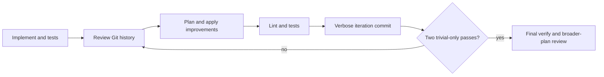

# Action protocol (ShipLoop 0.9)

ShipLoop is deliberately usable from a small context window.  The script owns
the durable facts in the run directory and prints one bounded next action.  A
host supplies judgment, edits, and evidence; it must not infer a transition
from chat memory or an earlier prompt.

## The action contract

`init`, `next`, `status`, and every successful mutating command print the
current action.  Its `Action:` value is a single-use capability.  Pass that
exact value to `complete`, `verify`, `history`, `journal`, or `repair` only
when the printed action calls for that command.  A stale action is refused.

Write a result as Markdown with exactly one `shiploop-state` JSON fence.  The
JSON inside the fence is structured state **inside authoritative Markdown**;
it is not a writable `.json` sidecar.

````markdown
# Result for the printed action

```shiploop-state
{
  "summary": "What was done, what evidence was examined, and the outcome."
}
```
````

The script rejects duplicate fences, duplicate JSON keys, empty required
fields, stale actions, and a different payload replayed for an already
completed action.  Repeating the *same* completed action with the identical
result is safe and prints the current next action instead of performing the
transition twice.

Use absolute paths for `--result` and `--manifest` when the current working
directory is ambiguous.  Do not put secrets in a result, manifest, journal,
or log.

The printed commands choose host-authored inputs under the run's `inbox/`.
Use those paths: placing result drafts in the product working tree after a
check changes its fingerprint and correctly makes that evidence stale. Inbox
files are drafts; completion imports an immutable result snapshot into the
script-owned Markdown records.

## Commands

The 0.9 CLI intentionally replaces `update`, `start-step`, `complete-step`,
`clear-step`, `inject-step`, and flagless `complete`.

```sh
CLI="$SKILL_ROOT/scripts/shiploop"

python3 "$CLI" init --repo "$REPO" --run-dir "$RUN_DIR" --prompt "…"
python3 "$CLI" next --run-dir "$RUN_DIR"
python3 "$CLI" status --run-dir "$RUN_DIR"
python3 "$CLI" context --run-dir "$RUN_DIR" --section iteration --offset 0 --limit 4000
python3 "$CLI" complete --run-dir "$RUN_DIR" --action "$ACTION" --result /absolute/result.md
python3 "$CLI" verify --run-dir "$RUN_DIR" --action "$ACTION" --manifest /absolute/checks.md [--reason "why the manifest changed"] [--timeout 60]
python3 "$CLI" history --run-dir "$RUN_DIR" --action "$ACTION" --limit 7 --skip 0 [--full]
python3 "$CLI" journal --run-dir "$RUN_DIR" --action "$ACTION" --result /absolute/proposals.md
python3 "$CLI" repair --run-dir "$RUN_DIR" --action "$ACTION" --reason "specific defect found after verification"
python3 "$CLI" replan --run-dir "$RUN_DIR" --action "$ACTION" --result /absolute/corrective-plan.md
python3 "$CLI" revisit --run-dir "$RUN_DIR" --action "$ACTION" --to survey --reason "correct planning evidence before execution"
python3 "$CLI" pause --run-dir "$RUN_DIR" --reason "specific external or user blocker"
python3 "$CLI" resume --run-dir "$RUN_DIR"
python3 "$CLI" halt --run-dir "$RUN_DIR" --reason "terminal reason"
python3 "$CLI" migrate --run-dir "$RUN_DIR"
```

`pause` preserves the pending action and records a non-success state.
`resume` reprints that action after the blocker is resolved; it does not claim
completion.  `halt` is terminal for the run and writes an unfinished handoff.
`repair` is for a real defect found after an iteration was otherwise recorded:
it records the reason, resets the trivial streak, and returns to Improve
review.  It never makes a failed check pass or deletes work.
Outer `replan` is available only at coverage or quality: it adds a corrective
pending step through the same validated revision contract, never patches code
around the inner loop.

Use `--reason` with `verify` when replacing a manifest already recorded for
the current action.  Explain why the check set changed (for example, a newly
added acceptance test); use the same manifest when nothing changed.  This
keeps check changes visible rather than silently weakening validation.

`init --force` is intentionally not a destructive reset.  Start a fresh
`--run-dir` for a new session; prior journals, receipts, branches, and
worktrees remain available for inspection.  Run `migrate` only for a legacy
JSON run, described below.

A new run directory must be dedicated and empty, not the repository root.
Before any step receipt exists, `revisit --to survey|spec` can correct planning
inputs. It works while paused, archives superseded dependent Markdown under
`planning-history/`, and returns the new action. It never deletes product
work, journal entries, or prior evidence. After execution begins, use
pending-only plan revisions; changed product requirements need user direction.

Use `context` instead of requesting a giant packet. Its sections are
`prompt`, `step`, `iteration`, `spec`, `environment`, `plan`,
`lifecycle`, `journal`, `approach`, and `research`. Read `prompt`
first after a cold context loss, then the active `step` or `iteration`.
`--limit` is a character bound
(1 through 8000), not a token guarantee. Page with the printed offset and
digest; the digest refuses a page when state changed between requests.

## Check manifest and evidence

Every implementation and every Improve iteration must run a linter and the
required tests.  The host chooses meaningful commands for the actual
repository and declared output; the script verifies that they are explicit,
fresh, successful, and cover the step's declared `produces`.

````markdown
# Checks for S1

```shiploop-state
{
  "checks": [
    {
      "id": "lint-python",
      "kind": "lint",
      "argv": ["python3", "-m", "ruff", "check", "src"],
      "acceptance": []
    },
    {
      "id": "test-widget",
      "kind": "test",
      "argv": ["python3", "-m", "pytest", "tests/test_widget.py"],
      "acceptance": ["src/widget.py", "tests/test_widget.py"]
    }
  ]
}
```
````

`argv` is an argument list, never a shell string.  Each declared `produces`
value must occur in at least one `test.acceptance` list.  Use concrete lint
commands appropriate to code, configuration, documentation, or generated
artifacts; do not omit lint merely because the change looks small.  A test
check is always required.  Do not use a file-existence check as a substitute
for behavior or contract validation.

At outer `quality`, the required strings instead come from
`lifecycle.acceptance`, not the completed step's `produces`. Retrieve them
with `context --section lifecycle`; map whole-product tests to every exact
acceptance string and include a lint check in the outer manifest.

`verify` saves a manifest digest, before/after working-tree fingerprints,
per-check status, and paths to stdout/stderr logs under the run directory.  A
non-zero exit, timeout, missing log, changed tree during a check, stale
fingerprint, stale action, or changed manifest prevents completion.  Fix the
cause and run a fresh `verify`; a green claim in prose is not evidence.
Each attempt is retained under `check-attempts/`, including failed attempts.
Logs may retain exact command output; never place secrets in commands, output,
results, manifests, or journal entries. Treat logs and results as sensitive
evidence rather than perfectly redacted public reports.

## Results by stage

Every `complete` result has a nonempty `summary`, plus the fields below.
Fields named `body` or `plan` are ordinary Markdown strings stored in their
own authoritative `.md` file.

| Printed stage | Additional required result fields and action |
|---|---|
| `preflight` | `baseline: "committed-head"`; describe Git head, dirt preserved, available runtime/checks, and prep findings. |
| `approach` | `body`; a concise initial delivery approach, risks, milestones, prep candidates, and acceptance strategy. |
| `survey` | `body`; complete `environment.md` prose plus `## machine` fenced JSON. |
| `research` | `body`; sources, resolved uncertainty, assumptions, or why research was not applicable. |
| `spec` | `body` with exact `done_sentence:` and `checkable: true`; `lifecycle` with `acceptance`, `preparation`, `publish`, `quality`, and `reason`. |
| `sequence` | `plan` with matching `done_sentence:` and Review Coverage; nonempty string `dependency_review`; exactly one compatible `dag` object or absolute `dag_file` Markdown draft containing one `shiploop-state` object fence. |
| `prepare` | `evidence`; only authorized outer-before preparation and its probes. |
| `implement` | First run `verify` for this action, then `test_review` explaining the test mapping and any additions. |
| `review` | First run `history`; then `findings` (`severity` `material` or `trivial`, `summary`), `test_review`, and `learnings`. Empty findings are allowed; missing required tests are material. |
| `improve-plan` | `body`; fixes, test work, and prevention for every finding. |
| `improve-apply` | `material` boolean, `test_changes`, and `learnings`; do not weaken tests to get green. |
| `verify` | First run `verify` for this action, then complete with `summary`. |
| `commit` | `commit`; full SHA of the actual current worktree HEAD after the primary iteration commit. |
| `final-verify` | First run a fresh `verify` for the final tree, then complete with `summary`. |
| `post-inner` | `plan_decision` (`no-change` or `revise`), `plan_reason`, and `journal`; `revise` also requires a complete `dag` and `plan`. |
| `merge` | `summary`; local merge only. |
| `coverage` | `summary`; complete the bound Review Coverage activity and its actual tracked ledger. |
| `quality` | First run whole-product `verify`, then `test_review`; also provide `quality_review` when lifecycle `quality` is true. Quality false still requires acceptance/integration checks. |
| `publish` | `artifact`, `verification`, and `evidence`; only for named, authorized publication. |
| `handoff` | `journal` (use `[]` after an explicit no-new-proposals review), limitations, checked acceptance, and a prioritized proposal summary. |

## Git history and Improve commits

At each `review` action, run `history` before writing findings. It stores a
page under `history-pages/`; default stdout is a compact SHA/subject list.
Read the latest seven commits (or all available) for the current worktree
HEAD. Use `--limit 1 --skip N --full` to retrieve one complete body at a time
when a small context needs detail. The review result is refused until the full
required history set was recorded for the current head.

Each Improve iteration ends in a distinct primary commit on the step branch,
not the repository's `main` branch.  It must be the actual current HEAD,
descend from the prior iteration head, and have a complete, evidence-based
body:

```text
<concise subject>

Review:
<findings reviewed, including no material findings when applicable>

Changes:
<specific changes, or an honest audit-only explanation>

Validation:
<the exact lint/tests and relevant evidence>

Key learnings:
<the durable learning and prevention idea>

ShipLoop-Iteration: <printed iteration id>
```

An allow-empty commit is valid for an audit-only iteration, but it still must
contain concrete review, validation, and learning evidence. It is not a way
to invent work or claim semantic correctness. The exact `learnings` text
recorded at review and improve-apply must occur verbatim in the commit body.

## Convergence and plan learning

The per-step loop is:



Two consecutive iterations can be classified trivial only after their review,
application, fresh lint, required tests, and primary commits are recorded.
There is no maximum-cycle success escape hatch. A material finding or
application resets the streak. Late edits made while getting verification green
are conservatively material and reset the streak. The final verification is a
separate fresh gate; it includes all applied trivial changes.

At `post-inner`, explicitly decide whether broader steps, dependencies,
preparation, or test strategy should change.  A revision can only alter
pending steps, must retain the same goal and initial state, and is validated
before it becomes authoritative.  Completed and running work remains intact.

At outer `coverage` or `quality`, a discovered defect uses
`replan --action … --result …`, not an outer-loop code patch. Its result has
`summary`, `plan_decision: "revise"`, `plan_reason`, `plan`, and a
complete `dag` (plus optional journal). It must introduce a corrective
pending step while preserving all completed work. That step runs the ordinary
implement, Improve, final-verify, post-inner, and merge sequence.

## Generic ShipLoop improvement journal

At any action, `journal` accepts a Markdown record whose fence contains an
array (an empty array is an explicit no-proposal decision):

````markdown
```shiploop-state
[
  {
    "title": "Expose check-manifest drift in the packet",
    "evidence": "Two iterations required a new test but the old packet did not say why.",
    "impact": "Reviewers could mistake changed coverage for unchanged evidence.",
    "proposal": "Show the manifest digest and required reason when it changes.",
    "test_idea": "CLI test changes a manifest and asserts the reason is persisted."
  }
]
```
````

The script deduplicates proposals by title and proposal, records their action
and step provenance, and writes them to `shiploop-improvements.md`.  They are
proposals for the generic skill and scripts—not permission for this run to
self-modify ShipLoop.  The final handoff must surface the journal and a
prioritized proposal list.

## Legacy migration and recovery

Markdown is authoritative. A run with `state.json` but no `state.md` is
refused until `migrate` is explicitly run. Migration copies legacy JSON into
`legacy-backup/`, but only for known legacy ShipLoop paths: `state.json`,
`spec.json`, `plan.json`, `backchain/plan.json`, `steps/*.json`, and
`history.jsonl`. It writes Markdown records, `run.md`, and a
`migration.md` marker; keeps branches/worktrees/code; and restarts planning
checkpoints so old evidence cannot satisfy the new gates. It refuses to
overwrite an existing legacy backup and never archives unrelated repository
JSON. Once a Markdown authority or run marker existed, deleting state.md does
not allow JSON resurrection.

Each multi-file state change is journaled in `transaction.md` and recovered
under the run lock before the next command.  Do not manually edit, delete, or
replace state records to repair a run.  Use `pause`, `repair`, or `halt` with
a specific reason; inspect the durable files before deciding what to do next.
