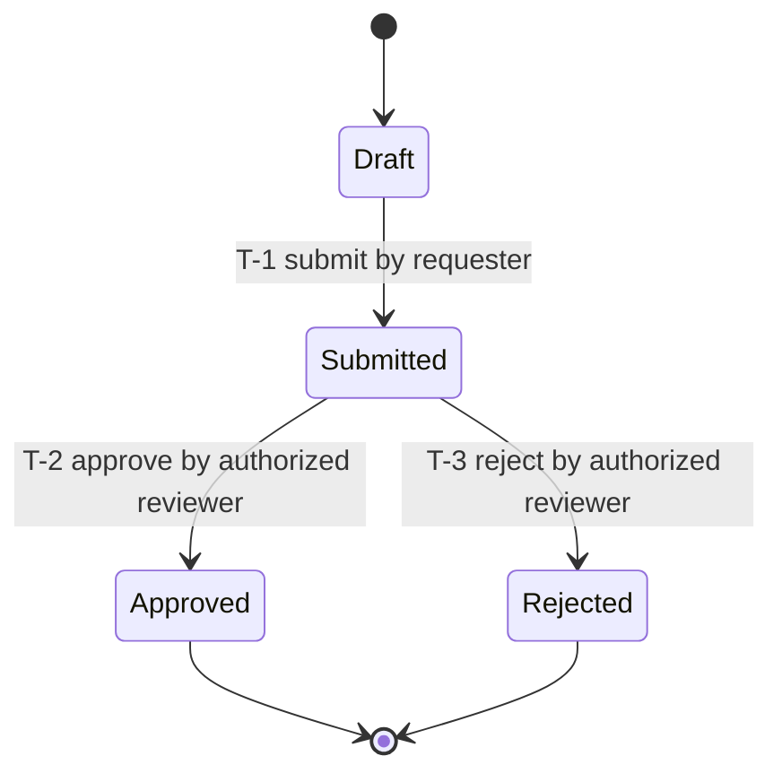
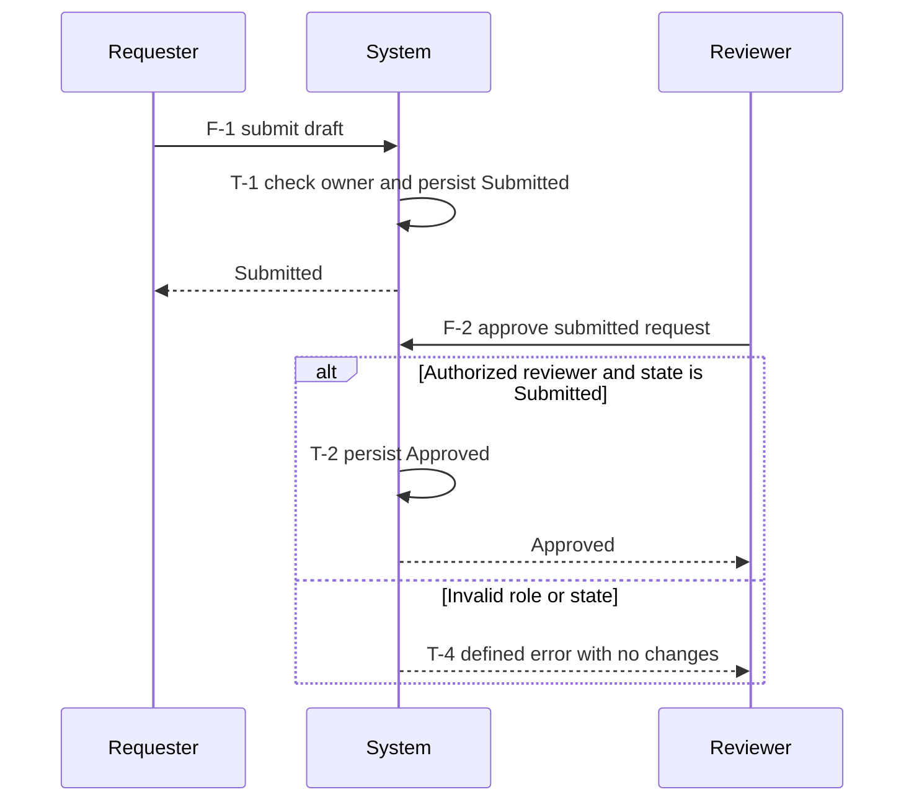

# Behavioral requirements contract

These are stack-neutral semantic modeling duties. The companion
[planning loops](planning-loops.md) now enforce repeated behavior/spec review,
evidence and finalization; they do not automatically prove semantic completeness.
Read the packet-selected
section, then only the linked model/source sections needed for this action.
Model the **requested product's behavior**, not ShipLoop's workflow or task DAG.

## Discovery and research

Start from the incoming request in `context --section prompt`, not recalled chat.
Split it into atomic requirements with stable `R-` IDs and exact source pointers.
Record actors/roles, entities, system and external boundaries, ownership, initial
conditions, intended outcomes, non-goals, and unknowns. Distinguish user-required
behavior, observed existing behavior, evidence-derived constraints, proposals,
and unresolved decisions. Existing code is evidence, not authority to override a
requested change. Do not translate vague language into invented business policy.

At `approach`, identify modeling scope and high-risk questions. At `survey`,
inventory the existing flows, state owners, persistence/communication boundaries,
entrypoints, tests, and documentation in the environment body's prose. Preserve
the required environment machine record unchanged in shape. At `research`,
investigate the uncertainties and retain findings in the research result body.
Survey/research do not authorize product edits or deployment.
The [research convergence loop](research-loop.md) retains stable questions and
source evidence, repeats investigation to two checked trivial-only passes, and
must finalize before behavior drafting. Revisit research explicitly when a new
source or environmental discovery changes the assumptions before execution;
reconverge its dependent behavior/spec work instead of reusing stale proof.

Research deeply where behavior is uncertain or consequential:

1. Trace each requested outcome forward from its trigger through relevant
   callers, public boundaries, services/jobs, state writes, and external effects;
   trace backwards from the observable outcome to its prerequisites. Read the
   actual implementation, tests, docs, and relevant Git history when they exist.
2. For each high-risk transition, investigate success **and** failure/recovery:
   who owns the state; when a change becomes durable; what is atomic; what an
   acknowledgment proves; and what can happen if interruption occurs between
   operations. Research ordering, retries, duplicate events, permissions, and
   concurrency where the requested system makes them relevant.
3. Verify uncertain external behavior against primary documentation for the
   actual platform/version and exposed contract. For a client–service flow,
   resolve both invocation sides before authoring calls; an internal function
   signature does not prove the public operation exists. Use safe, authorized,
   non-destructive probes where documentation and implementation disagree.
4. Record compact evidence entries: source/path and symbol or section, version
   or revision where relevant, the `R-/F-/T-` rule supported or contradicted,
   what was observed versus inferred, and any remaining assumption/question.
   Research external references only when relevant; do not manufacture sources
   or require internet research for behavior fully established locally.
5. Resolve contradictions explicitly. A materially ambiguous rule—such as who
   wins a cancellation/completion race—needs user direction if neither the
   request nor established contract determines it. Pause before freezing a spec
   that depends on it; do not mark a guessed policy as validated.

Completion means the in-scope behavior can be specified and checked, with sources
for consequential rules and explicit exclusions. It does not mean reading every
file or exploring infinite paths. A simple/stateless transformation still needs
an input-to-output flow and error contract; record why a lifecycle state model
is unnecessary. Do not invent queues, services, or states to fill a template.

## Behavior model

At `behavior`, retrieve the incoming prompt, approach, environment and research
in bounded sections. Store the proposed product behavior in the result `body`:
a requirement index, sequence flows, state inventory, transition ledger, and
case mapping. Use compact Markdown tables and Mermaid diagrams where they make
ordering or state changes clearer. Use consistent IDs and terminology across
diagrams, tables, tests, and implementation; a pretty diagram alone is not a spec.
Apply [Discovery and research](#discovery-and-research) to unresolved rules before
freezing them. Refine this model through the behavior loop. At `spec`, integrate
the converged model with `done_sentence`, `checkable`, and lifecycle decisions
in a draft, then run spec improvement. R/F/T model records remain Markdown prose;
the separate loop's structured finding/rubric fields are specified in
[Planning loops](planning-loops.md), not an invented model schema.

### Sequence flows

Give every distinct required user/system journey an `F-` ID linked to its `R-`
requirements. Document actors/components, trigger and preconditions, ordered
messages/actions, sync versus async boundaries, input/output semantics, state
changes, and final observable outcome. Include relevant alternative branches,
guards, failure responses, timeout, cancellation, cleanup, compensation, and
recovery paths. Cross-reference transition IDs at state-changing messages.
Split large flows by meaningful boundary and link them; do not hide alternatives
in an unlabeled “error” branch. Record environment and real versus simulated
dependencies in the associated cases. Reuse the actual invocation contract.

### States and transitions

Inventory each relevant stateful entity separately. For each state give its
meaning, invariant, owner, durable versus transient status, and initial/terminal
role. Name hierarchy, concurrent dimensions, and cross-entity invariants when
needed; avoid an unnecessary Cartesian product of all possible system states.

Use a transition ledger as the detailed complement to each state diagram:

| Field | Required content for an applicable transition |
| --- | --- |
| Identity and origin | Stable `T-` ID; `R-` requirement and `F-` flow IDs; source or explicit decision. |
| Before | Entity/state owner, source state or explicit state set, relevant data invariant. |
| Trigger and guard | Event and actor; permission, data/time preconditions; mutually exclusive guard or explicit selection priority. |
| Operation | Ordered actions, persistence boundary, side effects, entry/exit behavior where applicable. |
| After and observation | Destination or unchanged state; invariant; caller-visible output/error and relevant time bound. |
| Failure and recovery | Failure point, retained/partial effects, retry/idempotency, timeout, compensation or operator action as applicable. |
| Validation | Stable case IDs, expected state/output/effect, selected test surface; later link actual evidence separately. |

Model required valid transitions **and** behavior for invalid/forbidden events.
For each relevant state/event class, record transition, guarded rejection,
documented ignore/no-op, or unresolved rule. A rejection/ignore must specify
whether data or external effects remain unchanged. Do not assume a self-loop
means no-op: exit/re-entry or repeated side effects may matter. Distinguish
termination from a state that still accepts retry, read, or cleanup events.

Audit these event families for relevance, documenting exclusions with reasons:

- normal entry/progression/completion; invalid input and unauthorized actors;
- boundary/empty values; duplicate/repeated requests and idempotent replay;
- timeout, bounded retries/exhaustion, cancellation, and resumption/restart;
- partial persistence or external-effect failure, cleanup/compensation, recovery;
- concurrent actors, stale/out-of-order callbacks, conflicting updates;
- relevant lifecycle initialization, shutdown, deletion, migration or expiry.

Enumerate all **required in-scope** transitions; partition equivalent states,
events, and guard boundaries explicitly. List omissions/unknowns rather than
claiming all possible paths are proven. Cover interactions between partitions
where they carry risk. For a stateless component, document the applicability
decision and equivalent valid/invalid input-output cases instead of a fake
persistent lifecycle.

On every planning review, perform [Traceability and review](#traceability-and-review).
Material unresolved requirements block freeze; `checkable: true` is not evidence
that a semantic completeness review occurred.

## Traceability and review

Retrieve only the current requirement/flow/transition slice and adjacent affected
paths from the durable behavior model, spec/draft, research, plan and current
step. Never assume the
previous prompt's mental model survives. Use `context --section spec|research|plan`
with one valid section value at a time and bounded pages. During planning use
`behavior`, `spec-draft`, `lifecycle-draft`, `planning` and `iteration` as
available. During execution use the active `step`, `iteration`, and current
`knowledge`. A frozen model records the approved baseline; current observations
are retrieved separately and must not silently redefine its acceptance.

Use this breadth audit on every behavior/spec review and at sequence, then every affected Improve
cycle; at outer quality, reconcile the whole in-scope model:

1. **Prompt to outcome:** every `R-` requirement has a flow/outcome, relevant
   transitions, and acceptance cases, or a justified non-behavioral applicability
   note. Every modeled feature traces back to scope, not an invented expansion.
2. **Structural coverage:** every modeled state is reachable or explicitly
   justified; every nonterminal has a defined way forward/recovery; guards cover
   relevant boundaries and conflicts; transitions preserve stated invariants.
   Identify dead ends, missing actors/events, and inconsistent names.
3. **Negative and temporal coverage:** inspect forbidden/no-op events and each
   applicable failure/recovery family from the behavior model. Review important
   multi-transition sequences and cross-entity races, not only isolated edges.
   State coverage alone is not transition coverage; transition coverage alone
   does not establish every meaningful sequence or concurrency interleaving.
4. **Tests and evidence:** map required `R-/F-/T-` IDs to stable case IDs with
   preconditions/events and explicit expected state, output, errors and effects.
   Map cases to exact step `produces` and lifecycle acceptance strings as needed;
   IDs supplement those strings, never replace the check manifest contract.
   Select browser/service/API surfaces by risk and actual environment. Keep
   expected outcomes separate from observed status/revision/evidence; required
   failed, blocked, or unrun cases remain unfinished.
5. **Documentation consistency:** reconcile diagrams, ledger, concise function
   contracts, README usage/recovery guidance and tests. A missing transition or
   misleading behavior contract is material even when fixing it is a tiny edit.
   Record changed IDs and implications, or a specific no-change rationale.

Carry this model through the existing stages:

| Stage | Durable action |
| --- | --- |
| `behavior` and its loop | Draft the model, repeatedly discover edges, preserve stable findings, resolve them and converge before spec authoring. |
| `spec` and its loop | Integrate the converged model, challenge clarity/consistency/feasibility, and converge before freezing the spec or sequencing work. |
| `sequence` | Map the behavior/test/documentation outputs and dependencies into pending steps. Put contract, environment and deployment prerequisites before their consumers. Keep product behavior order distinct from the work DAG. |
| `implement` | Implement the active slice, cases, and enduring product diagrams/ledger where needed; compare with the frozen spec, not an improvised model. |
| `review` / `improve-plan` / `improve-apply` | Read Git history first at review. Audit affected and adjacent paths, plan fixes, then update code/tests/docs before verification. Preserve learnings and model deltas in the existing result fields. |
| `verify` / `final-verify` | Run lint and all required checks, compare expected transitions/effects with observations. Do not silently adjust expectations to match failures. |
| `carry-forward` | After an execution iteration's checks, distill new observations with source, scope, revalidation guidance and impact. Current-step corrections restart review; broader obligations remain visible for post-inner; incompatible contracts pause. |
| `post-inner` | Ask whether discovered behavior changes broader pending steps, prerequisites, cases, or documentation. Revise only pending work within the frozen spec; record no-change rationale otherwise. |
| `quality` | Reconcile end-to-end flows and state interactions across merged steps with whole-product evidence; corrective work returns through pending DAG steps and full inner loops. |
| `handoff` | Link the behavior model and case evidence, naming scope/exclusions and unresolved limitations honestly. Generic harness proposals stay in the separate ShipLoop journal. |

If learning contradicts frozen scope/acceptance, stop and seek direction, not a
silent spec edit. Before any step exists, use the supported `revisit` correction
path; pending-only replanning cannot change frozen acceptance. Never invent a
rewind command or directly modify authority files to bypass the protocol.
During execution, preserve the observation in the
[project knowledge checkpoint](carry-forward.md), including what it contradicts
and which consumers are affected. The separate living ledger preserves learning
without falsely certifying a replacement spec or hiding a changed assumption.
Use the [execution research assessment](research-loop.md#later-discoveries) for
new unanswered questions: investigate current-scope gaps inside Improve, or
create a research prerequisite before affected pending consumers. Material
environmental/behavior uncertainty cannot be classified as non-semantic polish.

Persist compact source/decision summaries and IDs in existing `body`, `plan`,
`test_review`, `test_changes`, `learnings`, or `summary` as appropriate. Before
implementation, the spec/plan holds the proposed model. Plan enduring product
model docs as worktree artifacts; link their current sections/revisions after
creation. Keep essential rules and unresolved decisions inline in authoritative
Markdown so deleting a draft or clearing context loses no decision. Large
diagrams and evidence can be linked/paged; an ephemeral draft-only link is not
durable state. Do not dump all histories or the human-oriented ShipLoop README
into every action packet. Scripts preserve imported records and enforce the
loop, ledger, rubric presence, check/commit evidence and promotion gates; they do
not determine transition coverage or meaning automatically.

## Worked example

This deliberately small **hypothetical** input fixes its policy explicitly:
“A requester may submit their own draft once. An authorized reviewer may approve or
reject a submitted request. Approval/rejection is terminal. Invalid or repeated
commands return an error without changes.” Persistence failure and concurrent
review policy are still questions to resolve before a production spec freezes.

`R-1` covers submission; `R-2` covers reviewer decisions; `R-3` covers rejected
commands. `F-1` is submission and `F-2` is a reviewer decision.

The sequence shows one slice, not all of `F-2`: rejection uses `T-3`. The ledger
must also describe `T-4` invalid-event classes that a state diagram can omit.
For example, `TC-4 / R-3 / T-4`: given Approved, when approve repeats, expect the
defined invalid-state error, state Approved, and no additional side effects.
Observed status is **not run** until evidence exists. A real spec must resolve
the exact error, persistence, and race questions before declaring checkability.

## Design basis

Adopt the modeling concepts, not a runtime or technology dependency. The
[W3C SCXML core constructs](https://www.w3.org/TR/scxml/#CoreConstructs) distinguish
states, events, guarded transitions and actions, including hierarchy and parallel
states. ShipLoop does not impose SCXML execution semantics on a product.
The [ISTQB Foundation syllabus, section 4.2.4](https://istqb.org/wp-content/uploads/2024/11/ISTQB_CTFL_Syllabus_v4.0.1.pdf)
distinguishes state and transition coverage and describes invalid transitions;
this motivates a ledger alongside diagrams, not a claim of exhaustive testing.
Use [Mermaid state notation](https://mermaid.js.org/syntax/stateDiagram.html) and
[sequence notation](https://mermaid.js.org/syntax/sequenceDiagram.html) as optional
portable Markdown illustrations. Research depth follows behavior risk; full
formal modeling or enumerating every interleaving is not mandated.
