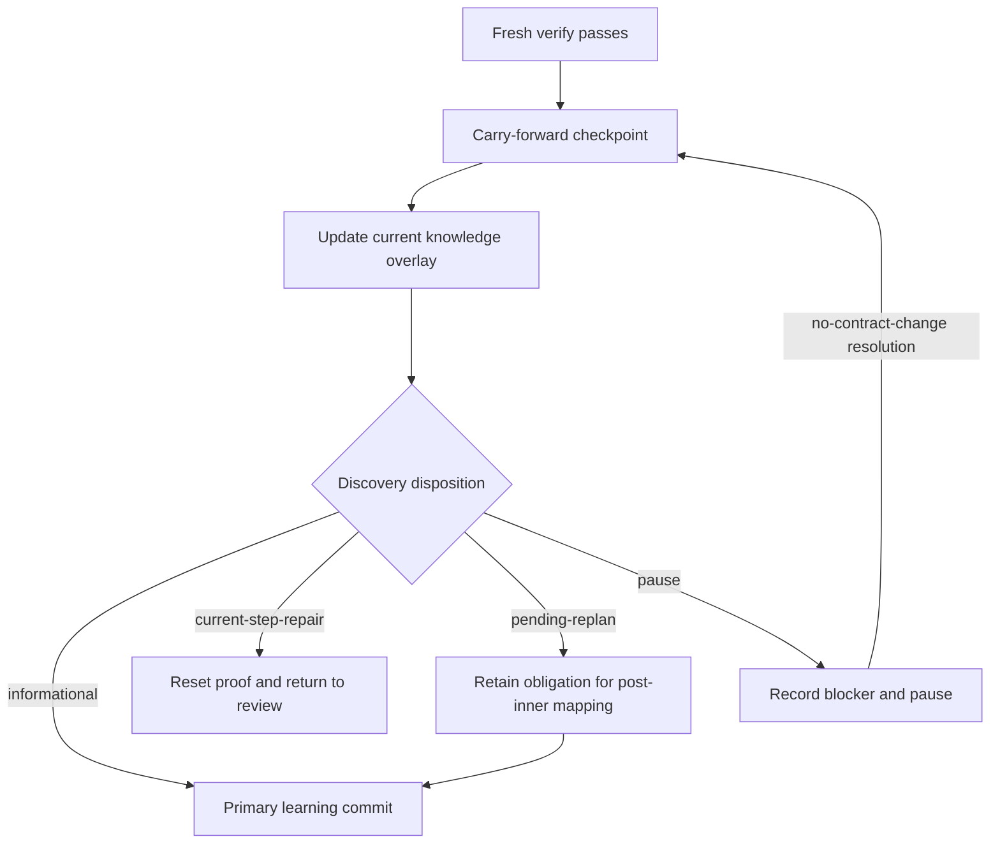

# Carry-forward checkpoint

`carry-forward` is the implemented execution checkpoint after a successful
`verify` and before the iteration's primary `commit`. It is not a new CLI
command: complete the printed action with the normal action/result protocol.
Every execution iteration submits this checkpoint, including an explicit
no-discovery result with `"discoveries": []`.



The normal successful path is `verify → carry-forward → commit`. A failed,
stale, changed-tree, or incomplete `verify` never reaches this checkpoint.
Neither local checks nor this checkpoint prove remote publication, a deployed
effect, or an external system's current state.

## Result contract

The script derives the stage, action ID, and iteration. Do **not** submit those
as result fields. The allowlisted result has all of these fields:

````markdown
```shiploop-state
{
  "summary": "Fresh checks passed; recorded one bounded operational observation.",
  "knowledge_revision": 4,
  "learnings": "Recheck the documented non-mutating readiness probe before the affected step.",
  "discoveries": [
    {
      "id": "CF-1",
      "domain": "credential-availability",
      "observation": "At <observed-at>, the expected release-operator role was observed through the documented non-mutating probe; recheck before use.",
      "evidence": "Safe reference to the retained probe result",
      "scope": ["S4"],
      "disposition": "pending-replan",
      "rationale": "The remaining step needs the role but the approved contract is unchanged.",
      "revalidate": "Run the documented non-mutating probe at the point of authorized use."
    }
  ]
}
```
````

- `summary` describes the checkpoint and `knowledge_revision` is the expected
  prior integer revision. A stale revision is rejected rather than overwriting
  a newer ledger.
- `learnings` is one nonempty string. The primary commit's `Key learnings:`
  section must copy it verbatim.
- `discoveries` is always present. Each item has `id`, `domain`,
  `observation`, nonempty safe-reference `evidence`, `scope`, `disposition`,
  `rationale`, and `revalidate`.
- `domain` is exactly one of `environment`, `credential-availability`,
  `invocation-contract`, `system-value`, `test-strategy`, `documentation`, or
  `research`.
  `disposition` is exactly one of `informational`, `current-step-repair`,
  `pending-replan`, or `pause`.
- `scope` lists relevant step IDs or exactly `["all"]`; `"all"` cannot be
  combined with a step ID. For `pending-replan`, name the affected pending step
  IDs whenever they are known; use `["all"]` only when the observation truly
  applies to all remaining work.
- A `current-step-repair` discovery must use exactly the active step's ID as
  its scope. It cannot use `["all"]` or name future/completed work; record a
  separate `pending-replan` discovery for compatible future work, or `pause`
  for an incompatible completed or frozen assumption.

For a false alarm or clarification inside the already approved contract, a later
carry-forward result may add an optional `resolutions` array to close a retained
pause blocker:

````markdown
```shiploop-state
{
  "resolutions": [
    {
      "id": "CF-1",
      "decision": "no-contract-change",
      "evidence": "Safe reference to the clarifying evidence",
      "reason": "The prior concern was a false alarm; the approved contract remains valid."
    }
  ]
}
```
````

`resolutions` cannot approve a changed requirement, permission, invocation
contract, or completed-work assumption. Those cases stay paused for direction
and, if authorized, begin a new explicitly scoped run.

## Current overlay, historical baseline, and cold starts

`knowledge.md` is the script-owned current, non-secret knowledge ledger. Its
structured record contains `version: 1`, `revision`, `entries`, `obligations`,
`blockers`, `learnings`, and `last_checkpoint`. Each accepted checkpoint also
creates immutable `knowledge-history/<carry-forward-action-id>.md`; `state.md`
binds the current ledger through `carry_forward_protocol_version: 1`,
`knowledge_revision`, `knowledge_sha256`, and `knowledge_action_id`.

The ledger is an overlay, not a replacement planning contract:

| Record | Meaning | May carry-forward rewrite it? |
|---|---|---|
| `environment.md`, frozen behavior/spec/lifecycle, and the accepted DAG | Approved historical baseline and acceptance authority. | No. |
| `knowledge.md` | Current, revision-bound operational observations, obligations, blockers, and learnings. | Only through the script after the printed checkpoint. |
| `knowledge-history/` | Immutable past checkpoint evidence. | No. |

`context --section environment` shows the unchanged frozen baseline plus a
clearly labeled current overlay. That overlay is authoritative for its recorded
host-reported observations and obligations, but is not authority to change the
baseline. `context --section knowledge` returns active-step and `"all"`-scoped current
entries plus every open or scheduled obligation and open blocker as a paged JSON
record. It does not load all checkpoints. Every new execution `review` must page
that selection fully and submit a matching `knowledge_read` object (`revision`,
`digest`, `scope`); the script retains the read in
`knowledge-reads/<review-action-id>.md`. Read the bounded knowledge selection
again for the next iteration or newly allocated step rather than relying on
conversation memory.

## Impact routes and unresolved obligations

| Disposition | Required effect before the next commit or step |
|---|---|
| `informational` | Record the current entry and continue to the primary commit. |
| `current-step-repair` | With scope exactly `[active-step-id]`, abandon the prior proof, reset convergence, and return to `review`; do not commit from the superseded verification. |
| `pending-replan` | Record the affected scope and retain a durable obligation. After convergence, post-inner must map it to explicit compatible pending work. For `research`, the map names only pending `activity: research` producer IDs; the runtime derives consumers from the obligation scope and requires every affected consumer to transitively depend on a mapped producer. A later checkpoint or unrelated replan cannot silently clear it. |
| `pause` | Persist a durable blocker, rotate to a new carry-forward action, then pause. `resume` only reprints that work; it cannot commit or advance around the blocker. |

A later ordinary checkpoint may resolve a retained pause blocker only with
`resolutions[].decision: "no-contract-change"` and the required safe evidence.
It must not use a resume or a resolution as a shortcut around a real contract or
permission change.

### Mandatory post-inner mapping

When open `pending-replan` obligations exist, the post-inner result requires:

````markdown
```shiploop-state
{
  "pending_obligation_map": [
    {
      "id": "CF-1",
      "steps": ["S4"]
    }
  ]
}
```
````

The validated pending-only plan revision runs first. Each ordinary `steps` list
must be nonempty, name a newly added or actually changed pending DAG step, and
cover the obligation's affected pending scope. For a `research`-domain
obligation, the unchanged `{id,steps}` record contains only newly added or
changed pending `activity: research` producer IDs; affected consumers are
derived from the obligation scope and must transitively depend on at least one
mapped producer. The ledger records the outcome as `scheduled` with
`scheduled_steps`; it is not fixed, verified, or proof that a future remote
effect occurred. If no open pending-replan obligations exist, omit this field.
Outer `replan` is not an obligation-resolution route. See
[later research discoveries](research-loop.md#later-discoveries).

## Safe observations and the deferred boundary

Record operational facts as observations, not timeless guarantees. An
observation may state when it was observed, the expected account **role**, and
the documented non-mutating **probe** to revalidate it. It must never include a
credential value, secret ID, account address, signed URL, raw credential-bearing
output, or a claim that the role will remain available. `revalidate` names the
safe check required before authorized use.

The result allowlist and secret screening are defense in depth, not a guarantee
that every sensitive representation is detected. Keep secrets out at the source
instead of relying on a later rejection or storage permission.

This implemented checkpoint preserves learning without rebasing authority. It
does not provide unrestricted environment or requirements rebasing, generalized
credential detail, or arbitrary-stage observations. Frozen contracts remain
unchanged; an incompatible discovery pauses for direction and any real contract
change needs a new scoped run.
