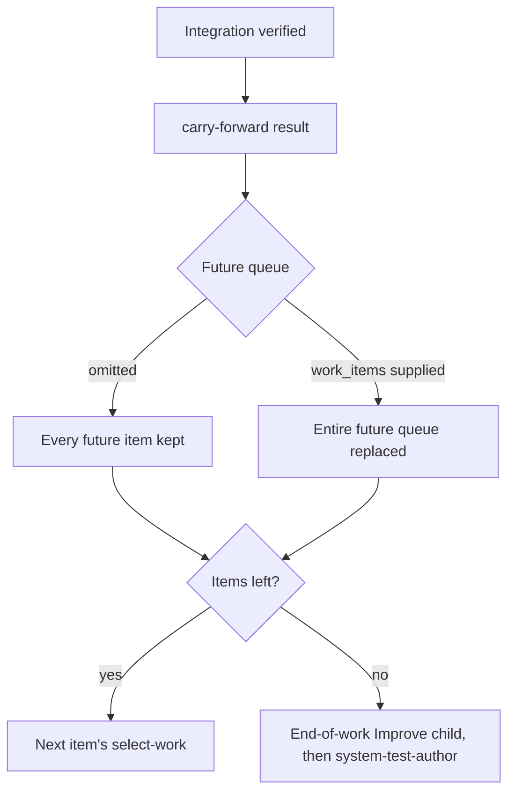

# Carry-forward checkpoint

`carry-forward` is the last INNER stage of each work item, after
`integration-verify`. It records what the item learned and revises the future
work queue before the script selects the next item's `select-work`, or returns
ownership to `system-test-author` after the final item. It uses the normal
producer result and callback; there is no separate ledger or command.

Only the successful `carry-forward` that leaves no work item pending starts an
Improve child. That end-of-work review covers every executed item together
(code, tests, documentation and the queue) before the OUTER stages. If it adds
work items, the review moves to the new last item's carry-forward.

Local checks and this checkpoint do not prove remote publication, a deployed
effect, or an external system's current state.

## Record the item's learning

Record in the result `summary` and a linked run note, named in `evidence_refs`:

- reusable learning, newly discovered risks and unresolved dependencies;
- system-test obligations, release prerequisites and their owners;
- repeatable tests, fixture lifecycle decisions, harness/case locators and
  focused/smoke/full-suite commands, kept in repository test documentation
  rather than only in transient run notes;
- for selected local skills, the repo index/entrypoint, applicable inputs,
  validation evidence and revalidation trigger.

Keep completed evidence separate from future plans. Update appropriate project
knowledge (see
[retain learnings for the next invocation](project-knowledge.md#retain-learnings-for-the-next-invocation))
and preserve concrete revalidation conditions; do not silently expand scope or
turn tentative ideas into adopted policy.

## Map observations to the future queue

Every observation that affects work still to come must reach an owner in the
future queue:

- **Current item.** A defect found in the item just completed is corrective
  work: add a corrective item ahead of its consumers, or report `blocked` when
  it cannot wait. `repeat` only retries this carry-forward; it does not reopen
  an earlier stage.
- **Future items.** Revise the queue so each affected future item carries the
  compact decision/convention locator, rationale and revalidation condition in
  its existing `context`, with supporting sources in `evidence_refs`. A needed
  research or preparation prerequisite becomes its own item that precedes every
  affected consumer. Scheduling it is not answering it.
- **Incompatible findings.** A changed requirement, permission, invocation
  contract or completed-work assumption is not a queue edit: report `blocked`
  or pause for direction.

Omitting `work_items` keeps every future item. Supplying it replaces the
**entire future queue** after the current item; it does not append. Read the
full `state.md` field `work_items`, including pending contexts the packet's
short queue summary omits. Include all still-required future work and exclude
current and completed items; an empty array removes all future work. Explain
removals, merges or approved supersession in the plan note. Independent required
work cannot disappear just because no other item consumes it. A completed
prerequisite invalidated by new evidence needs corrective work and revalidation
before its consumer; do not rewrite past completion evidence.

Outer stages use `replan` for corrective work items instead.

## Safe observations

Record operational facts as observations, not timeless guarantees. An
observation may state when it was observed, the expected account **role**, and
the documented non-mutating **probe** to revalidate it. It must never include a
credential value, secret ID, account address, signed URL, raw credential-bearing
output, or a claim that the role will remain available. Name the safe check
required before authorized use. Keep secrets out at the source instead of
relying on a later rejection.

The navigator validates the result envelope and the queue replacement; it does
not judge whether every observation reached the right owner. That remains the
host's judgment and the end-of-work Improve review's challenge.
