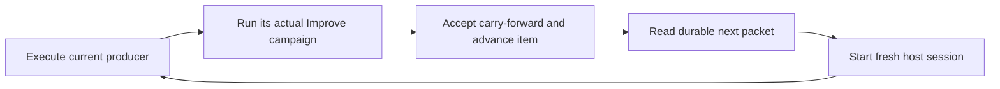

# Context reset



Ordinary ShipLoop invocations execute in the invoking conversation. The route
below is optional separate execution: use it only when the user explicitly
requests a supervised host session, or to recover an already supervised run.
Neither an environment setting nor a request for a durable loop authorizes
moving an ordinary invocation into another session. Initial experiments
established fresh-session behavior, not lower billing or subscription usage.
Resetting can lose prompt-cache reuse and requires rereading durable records.

## Invocation

For ordinary execution, initialize or recover the run and follow its current
packet in the invoking conversation. Do not call `drive`.

For explicitly requested separate execution, bind `CLI` from the selected loaded
skill. Initialize an isolated run with `workspace start`, or recover the existing
run, and pass its absolute run directory to the controller:

```sh
# Optional separate host process/session; HOST is codex, grok, or claude.
python3 "$CLI" drive --run-dir "$RUN_DIR" --host "$HOST"
# Keep that separate session across work-item boundaries:
python3 "$CLI" drive --run-dir "$RUN_DIR" --host "$HOST" --context-reset=off
```

`--host` is required. Honor the requested supported host and its existing
authentication; an unavailable host is an incomplete prerequisite. No silent host
substitution, installs, login changes or model overrides occur. Every `drive`
invocation uses a separate host session. `--context-reset=off` does not restore
the invoking conversation; it only disables later resets inside that controller.

The flag overrides `SHIPLOOP_CONTEXT_RESET`; allowed values are exactly `off` and
`inner-loop`. These settings apply only after separate execution has been chosen.
The first-controller default remains `inner-loop`. A saved policy, including
`off`, persists when both are absent; an explicit conflicting value is rejected.
The flag is a `drive` option, not an `init`, `next`, or `workspace start` option.
Plain script callbacks do not interpret slash commands from stdout.

An existing run without `context-host.md` keeps its invoking owner. Starting
`drive` for it requires an explicit request for separate execution and a stopped
prior owner. Existing supervised runs retain their saved host and policy; inspect
and settle their owner before recovery or transfer, as described below.
Compatibility protocols and unsupported hosts retain ordinary packet-following.

The controller requires Navigator protocol 3 and the same durable run. It keeps
its selected CLI locator and verifies that it belongs to the current package.
A copied installed skill package works without an author checkout. No fields are
added to Navigator `state.md`.

## Boundary and continuation

An inner iteration means one work item, from `select-work` through `carry-forward`, including each standalone Improve checkpoint. A producer callback only parks its Improve child; that does not clear context. After the carry-forward child's real result is accepted, the item advances and the controller schedules a fresh host session for the next owner. Repeats, pauses, blocks, stale callbacks and unfinished children never trigger a successful-item reset.

For example, W1's producer returns `done`; W1 Improve still runs in the same session. Its accepted completion advances to W2. The controller reads `next` for the same run, starts fresh context, and supplies that packet plus repository/run/CLI locators. It does not copy the previous conversation into the new prompt. Current requirements, constraints, decisions and evidence must be reachable from the packet's Markdown records. Normal host/system instructions remain; old disk history is not deleted.

| Host | Automatic fresh context | Retained context | Permissions |
| --- | --- | --- | --- |
| Codex | App-server `thread/start` then `turn/start` | Same task, or `thread/resume` after restart | Workspace shell sandbox includes repository and run only, implicit temp roots excluded; network off unless `--allow-network` is selected. Host interaction requests stop. |
| Grok | Isolated native ACP process and new session | Native session load/resume | Existing configured host permissions; no approval bypass or claimed additional sandbox. |
| Claude | Fresh persistent CLI session | Print-mode CLI resume | Existing configured host permissions; no approval bypass or claimed additional sandbox. |

`--allow-network` is only a Codex shell-sandbox option and must be repeated on resume. It does not create or change account authority. Grok and Claude do not expose the same per-session sandbox contract through these adapters; explicit unsupported sandbox requests fail rather than silently weakening them. Installed host MCP/tools and native permission policies may differ.

Grok's configured cross-session memory can reintroduce facts after a new ACP
session. The supervised Grok child therefore uses process-scoped
`GROK_MEMORY=0` and the native `--no-leader` mode. This does not edit global
configuration or delete saved memory. Retained context still comes from the
explicit session being resumed; current product authority comes from Markdown.

Each model turn owns only its current producer or standalone Improve campaign and must stop after its exact callback. The controller supplies the next owner. Host subprocesses receive `SHIPLOOP_CONTEXT_HOST_WORKER=1`; the skill and CLI reject recursively starting another controller.

## Recovery

`context-host.md` belongs to the controller; `state.md` remains graph authority. An exclusive local lock prevents two controllers from owning the same run. The receipt binds the host, run, repository, selected CLI, policy and permission settings. A digest detects outside changes before another owner launches. Do not execute the same run from another shell/assistant while the controller owns it.

The controller saves a running claim and host identity before sending an owner prompt. A crash, failed turn, missing callback, permission/input request, or unexpected state leaves the owner uncertain and stops automatic replay. Inspect the saved task/session and durable run, settle any effects, and verify that prior execution is stopped before manually reconciling its receipt. There is no automatic uncertain-owner repair command. A crash during idle session creation may leave an unrecorded idle session; no owner prompt is sent until its identity is saved.

`--max-turns=N` bounds one invocation; it is not a completion criterion. The default guard is 1000. On an ordinary turn-limit stop, rerun the same `drive` command to resume the saved host, or create the saved pending fresh session. Exit 0 means Navigator `done`; exit 2 means a turn limit or a paused/blocked/halted run; exit 1 means an error. Terminal runs print the current packet, including the
HTML achievement-report locator when done. Report the state truthfully. A paused/blocked result needs its stated recovery, not repeated blind launch.

Keep requirements and late user corrections durable before handoff. The controller does not relay new chat messages or transplant browser state, live tools, credentials, or asynchronous external operations. Owners must settle their delegated/background work before returning; the controller does not independently inventory it. Preserve identities and reconciliation instructions for effects that cannot yet be confirmed.

## Measurement limits

Telemetry is host-specific. Missing usage is unknown, not zero. Codex distinguishes last model call, thread total, and turn delta; resumed cumulative baselines may be unknown. Grok/Claude retain their native telemetry and describe its scope rather than assuming equivalent units. Cached input is not an additional count to add to total input. Compare whole-task paired runs, including rehydration and cache differences, before claiming savings. This option creates fresh context; it does not perform `/compact` or claim frequent compaction is cheaper.
