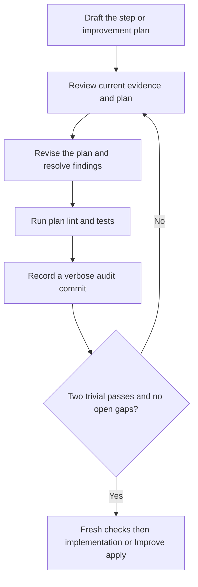

# Execution-plan convergence

## Loop contract

Plan before the first implementation and before every Improve application. A
step is not ready to code merely because its dependency DAG node is ready, and
an improvement plan is not ready merely because one LLM pass produced it.

`step-plan` drafts the initial implementation plan. `improve-plan` drafts the
plan for one existing Improve iteration. Each uses `step-plan-review`,
`step-plan-revise`, `step-plan-verify`, `step-plan-commit`, and
`step-plan-finalize`; these are stored stages in
phase `implement`, not new dependency DAG steps. Research, behavior and spec
retain their own upstream loops. Initial `sequence` is still an audited import,
not a newly enforced two-pass loop.

The incorporated until-loop policy computes **readiness**, not success, from
unique completed, verified and audited passes in the current repair epoch.
Material findings or revisions reset the trivial streak. Any exact candidate
byte change, including whitespace-only changes, is conservatively material.
Only retaining the exact persisted candidate can be a trivial Apply. This may
require extra passes because ShipLoop has no semantic-equivalence oracle; it is
a safety rule, not a claim that every byte change changes product meaning. Two
consecutive trivial-only passes, with all trivial fixes applied and no open findings, permit
fresh final checks. A failed, blocked, timed-out or stale check cannot advance.
Neither an LLM `done` claim nor a cycle budget is an alternate success route.
Finalization releases only the exact checked plan for its designated next action.

## Contract disposition

A material `scope` or `behavior` finding routes to paused
`step-plan-disposition`. A plain `resume` only unlocks that action; it does not
resolve the finding or release the plan. If inspection demonstrates that the
finding was a false-positive contract-change diagnosis, complete the action with
exactly `summary`, `disposition: "no-contract-change"`, and
`resolutions: [{id, evidence}]` for every and only the listed contract blockers.
Explain concretely why the existing approved contract already permits the
required behavior. Do not change the candidate, product, DAG, or frozen contract
in this action.

The script records the disposition, archives the interrupted pass, resets
convergence in a new repair epoch, and returns to `step-plan-review`. Repair
cannot evade unresolved contract blockers; it returns to disposition. If the
contract really must change, halt this run and obtain the needed direction for
an explicitly replanned/new run. This gate does not implement in-place approval
of changed requirements, credentials, writers, or shared configuration.

## Cold-start evidence

At every pass assume the preceding LLM context is gone. Use `next`, then page
the current `step-context`, `step-plan`, `iteration`, and `knowledge` sections
as selected by the packet. Use the current step's prompt/produces, accepted
spec/behavior slice, frozen environment plus current knowledge overlay, and
direct suppliers/consumers. Follow references only as needed to inspect
transitive impacts. Do not load every archived pass or the whole repository.

For an Improve plan, the `step-context` section also carries `enclosing_review`
with the product findings, test review, learnings and research assessment.
Retain every printed `PARENT-…` finding ID in the candidate and explain the planned
response, expected outcome and check. Refine those planned responses throughout
the nested loop; do not confuse closing a **plan** gap with proving the product
finding fixed. Product application and verification have not happened yet.

Run current action-bound Git history and read the latest ten full bodies (or
all available) in pages. Audit-only planning commits can occupy those pages;
also retrieve relevant older implementation/decision commits using a scoped
path or symbol investigation when needed. Do not mistake ten recent audit
messages for the complete history of the code being changed.
Inspect the actual worktree: relevant functions,
interfaces, call sites, tests, configuration and diff. An initial step may have
no implementation yet; distinguish existing foundations from intended new work.
Do not claim to have inspected future files. Prior commits explain decisions;
they are not proof that current code or environment still matches them.

Record compact evidence references and conclusions, not raw source dumps:
`path:symbol`, test selector, stable requirement/case ID, non-secret probe record
or source/version/observation time. Distinguish observed, inferred, planned and
unknown. The script binds local artifacts; it cannot hash the live external
world. Recheck relevant remote readiness safely when needed, and pause if a
required observation or authority is unavailable. Never include secrets or
credential-bearing output.

Current implementation, context bindings, candidate and finding ledger cannot
change unnoticed between review and handoff. A changed assumption needs a new
review, not a retained clean streak. An environment observation does not grant
permission to change an approved writer, credential, shared setting or requirement.

## Review rubric

Every `step-plan-review` supplies a complete `coverage_review` object. Each value
must explain evidence, a concrete decision, or a justified inapplicability—not
just “reviewed.” The result also retains `context_evidence` for the actual
step, implementation, environment and dependency inspection.

| Key | Question to answer on every pass |
|---|---|
| `step_scope` | What exact stored prompt, outputs and acceptance does this plan implement? Which changes are explicitly out of scope? |
| `current_implementation` | What does the real code/configuration/diff do now, where will the change land, and which call sites or tests contradict the proposed approach? |
| `environment` | Are runtime, permitted writer, invocation conventions, deployment target, test fixtures and non-secret access assumptions valid now? Which observation needs revalidation? |
| `dependencies` | Does each input have a real producer or established fact? Walk both upstream prerequisites and downstream consumers; identify ordering, compatibility and shared-resource constraints. |
| `flows` | Trace a concrete input through state, guards, calls and observable output. Do the normal, alternate and recovery flows agree with the approved requirement/transition model? |
| `edge_conditions` | Examine relevant invalid/empty/boundary/stale/duplicate input, timeout, cancellation, partial failure, retries, concurrency and recovery. Which cases are missing? |
| `second_order_effects` | What changes indirectly for consumers, persisted data, caches, permissions, resource use, deployment/rollback, observability or documentation? Which cross-step effects need a broader plan change? |
| `implicit_requirements` | What prerequisite or behavioral assumption is necessary but unstated? Identify its source and confidence. Do not silently convert an assumption into user-approved scope. |
| `test_strategy` | Map each output/transition to stable cases, inputs, expected state/output/side effects and meaningful checks. Select browser/service/API coverage by surface and risk; order readiness before checks. Inspect the checks' own side effects and fixture isolation, including generated files and shared mutable state. |
| `documentation` | Which concise function/interface contracts, expected-outcome test records, README instructions, runnable examples and links must change—or why are they unchanged? |

Actively try to disprove the plan: reverse-trace one outcome to its prerequisites,
walk a failure/recovery trace, inspect an adjacent consumer, and challenge an
implicit assumption with evidence. Rotate the emphasis between passes while
retaining the full rubric. Rephrasing the same approval is not a new inspection.

Use stable finding IDs. All known unresolved findings remain in the ledger;
omission cannot close them or downgrade material severity. A missing required
test, transition, prerequisite or significant downstream effect is material,
regardless of textual diff size. Trivial means non-semantic polish. A genuinely
clean review may return no findings but still needs evidence, checks and audit.

Reserve material `scope` and `behavior` findings for a conflict with, or a needed
change to, the approved contract. A missing plan step for already-approved
behavior is normally an `implementation`, `flow`, or `edge-condition` finding.
Do not erase a contract conflict by renaming its category or finding ID. Keep
its original evidence until the explicit recovery path has recorded a disposition;
plain resume is not permission to change the contract.

## Revise and verify

Revise the **plan**, not product source. Explain how every open finding will be
addressed, then import the complete corrected candidate with resolution evidence.
Keep a concrete ordered edit/test/documentation sequence, target symbols, expected
outcomes, prerequisites, risk controls and revalidation triggers. An empty finding
set needs an explicit no-fix decision; do not invent work to fill the loop.

Required investigation must establish the facts needed to choose an executable
plan. If an unknown is intentionally a future research producer, consumers must
depend on its checked output. A plan to “figure out permissions later” is not
resolution of an execution-blocking authority gap. Pause for incompatible scope,
acceptance, writer or permission changes. Compatible broader work is recorded for
the existing carry-forward/post-inner pending-only revision path.

Run the printed `planning-verify` command with a Markdown manifest containing a
concrete lint check and tests mapped to exact acceptance **`step plan`**. Checks
should exercise real plan properties: complete output/case mappings, ordered
prerequisites, known interface names, expected-state records, example/diagram
syntax or consistency rules that the chosen representation can express. A file
existence check or an always-green command is not semantic validation.

Keep plan check helpers under the run inbox or otherwise outside product source;
creating them inside the worktree would change the plan's implementation baseline.
This gate validates the plan artifact—not the future implementation, nor a remote
environment. Product lint/tests remain mandatory after the later source edits.
Verify that the chosen tool invocation really preserves the bound worktree;
apparently read-only syntax/test commands can create caches or generated files.
Prefer non-mutating checks or explicitly isolated outputs instead of assuming a
flag suppresses all writes. Test fixtures must not leak state between cases.
Where two components could drift together, consider an independent assertion of
their approved interface contract: a passing integration path can still agree
on the wrong request shape or observable behavior. Select such checks by risk;
do not replace real integration coverage with mocks.

Every completed plan pass has its own verbose audit-only direct-child commit,
with `Review:`, `Changes:`, `Validation:`, `Key learnings:` and the exact printed
iteration trailer. Preserve staged and uncommitted product changes using
`git commit --allow-empty --only`; never stage the run records. Include recorded
review/revision learnings verbatim and reference the candidate/check evidence.
The enclosing Improve iteration still needs its **separate primary commit** after
product application, lint/tests and carry-forward. Plan audits do not count as
trivial implementation iterations. Finalization carries the nested review/revise
learnings into the enclosing iteration's `plan_learnings`; include each verbatim
in that primary commit as well as the ordinary review/apply/carry-forward learnings.

### Example trace

Hypothetical input: “Add cancellation without changing completed jobs.” The
first plan pass inspects the actual handler and finds that its proposed write
could overwrite a completed result. It records material finding `F-CANCEL-01`,
the existing terminal-state guard, the affected notification consumer and an
expected-outcome case: cancelling an already completed job leaves its state and
notifications unchanged. The revised plan orders the guard and regression case
before the call-site update. Plan checks and an audit commit record that pass;
the material finding resets the streak even though the fix is one line of prose.

A fresh context then reviews the corrected candidate and current evidence. Two
subsequent genuinely trivial-only checked/audited passes, followed by fresh final
checks, release the implementation plan. A source or environment-record change
in between invalidates that path and needs repair/review. The planning test does
not claim that cancellation works yet: implementation and its product tests are
still the next activity.

## Phase-specific emphasis

The same risk questions recur without making every phase recursively contain
another planning loop. Read only the packet-selected section for the current action.

| Phase activity | Required emphasis |
|---|---|
| Research/behavior/spec review and planning | Current evidence, environmental applicability, requirement/transition breadth, dependencies and implicit assumptions; resolve contradictions before accepting the candidate. |
| Dependency sequence | Forward draft plus backward prerequisite audit, consumer effects, case/README work and preparation placement; no invented producers or new two-pass guarantee. |
| Step plan / Improve plan | All ten rubric dimensions, actual code/diff/environment evidence, repeated plan refinement and checks before product edits. |
| Implementation / Improve apply | Follow the accepted scoped plan, preserve writer constraints, implement cases and concise docs, and route new material facts back through review/repair. |
| Product review / verify | Compare actual versus expected behavior, reassess adjacent consumers and test surfaces, and rerun lint/tests after edits. |
| Carry-forward / post-inner / outer quality | Persist cross-step observations, review downstream and second-order impacts, revise compatible pending work, and journal generic ShipLoop improvements separately. |

## Until-loop incorporation and limits

The user explicitly selected incorporation rather than a separate dispatcher.
`scripts/shiploop_until.py` adapts the standalone **until-loop 0.1.3**
repeat/verify/continue decision into a pure internal policy. The inspected local
source was `scripts/until-loop` at commit
`7fb7057056552438fa39ccf11b70fa7c63f80077`, declaring MIT in its skill card. No
remote or separate LICENSE file was present. This provenance identifies the
design source; it is not a runtime dependency or a multi-host execution claim.

Intentional changes from the standalone script:

- No `.until-loop/state.json`, independent lock, Git-exclude mutation or second
  CLI. ShipLoop's existing Markdown transaction remains the only state owner.
- The stop predicate is derived from unique checked/audited pass receipts,
  not a host's `--done` claim; finalization additionally requires fresh evidence.
- Replayed action results are idempotent, and cold continuation uses ShipLoop
  `next`, not a new standalone run.
- Cycle/budget exhaustion is unfinished; it cannot stand in for quality.

This is an incorporated adaptation, **not** execution of the unmodified external
until-loop skill. The installed standalone skill is left unchanged. Upstream
research/behavior/spec continue using their established planning module; only
execution-plan readiness currently calls this incorporated policy.

Repeated review improves the opportunity to find gaps, not a proof of
exhaustiveness. The [planning self-critique study](https://arxiv.org/abs/2310.08118)
reports failures of unaided self-verification in evaluated planning tasks; that
motivates current-code inspection, meaningful checks and retained counterevidence.
The two-trivial threshold is the user's operational choice. The host remains
responsible for evidence quality, test adequacy and truthful classifications.
