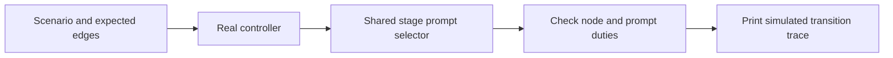

# Navigator graph dry runs

The default graph driver exercises the actual navigator (protocol 3 unless
`--protocol-version 2|4` is passed) and its full returned packets. Synthetic declarations stand in for project work; the driver
runs no LLM, Git operation, implementation, test command, or delivery action.

Bind `CLI` from the selected loaded ShipLoop card before running these commands:
`SKILL_ROOT` is the absolute directory containing that card's `SKILL.md`, and
`CLI="$SKILL_ROOT/scripts/shiploop"`. Do not derive it from the caller cwd or a
checkout-relative `skills/shiploop` path. The parent card explains how to obtain
the selected host path; use the resulting absolute `CLI` quoted in each call.

```sh
python3 "$CLI" graph-dry-run
python3 "$CLI" graph-dry-run --list
python3 "$CLI" graph-dry-run --scenario two-work-items --format markdown
python3 "$CLI" graph-dry-run --scenario blocked-resume --format json
```

`--list` prints the scenarios available for the selected protocol. Protocols 3
and 4 cover delivery, two work items, blocked/resume, a repeat returned through
Improve, pause/resume and halt; each producer is followed by a synthetic Improve
completion. Protocol 2 additionally covers conditional skill validation and new
corrective work, which have no v3/v4 equivalent (v3 always instantiates
`skill-validate`). Naming a scenario the selected protocol lacks is an input
error (exit 2) that lists the available names. Expectations are authored independently of the routing tables.
Each trace contains the effective packet before its synthetic declaration and
the resulting stage, status, owner, and completed-instance IDs. The packet
contains the current action's callback. No entire prompt snapshot is a pass
condition.

The two-work-item trace must distinguish W1 from W2: W1 owns its
`carry-forward` callback, then the returned packet is owned by W2 at
`step-plan`. The synthetic carry-forward result records W1 as done and causes
W2's execution record to be created in the same simulated transition. In a
persisted run, `next` reports W2's pending effective action; it does not advance W2 or expose
an actionable root `inner-loop` container. Future work items have no execution
record until entered.

The repeated-Improve scenario replaces only the active item's action. It does
not simulate, count, or render the campaign's internal review cycles: Improve
remains one call-and-return graph action under the normal owner binding.

Custom JSON uses `steps`, each with an effective `at`, `expect`, optional
`status` (default `active`), and either a generic `result` or
`command: pause|resume|halt`. Protocols 3 and 4 pair each producer
(`command: produce`, optional `result`) with `command: finish-improve` carrying a
synthetic `receipt` and optional `final_result`. The last completion expects
stage/status `done`. Run it with `--script PATH`. Example prefixes:
`navigator-v3-dry-run-example.json` (default protocol) and
`navigator-dry-run-example.json` (requires `--protocol-version 2`).

Exit 0 means expectations matched, including an intentionally halted or partial
scenario. Exit 1 means an expectation failed; exit 2 means the input could not
be read or named a scenario unavailable for the selected protocol. Simulation success never establishes project completion. See the
[navigator guide](navigator.md) for actual execution and Improve ownership.

## Compatibility harnesses

The remainder describes the previous managed-controller driver and its real
outer fixture. These remain useful for existing managed runs. They do not
exercise the default navigator and their evidence gates do not apply to it.
`init --execution-mode=navigator-v1` is a separate fixture compatibility route:
it preserves recorded protocol-1 cursor behavior rather than migrating a run
into protocol 2's `inner_loops` records.

# Dry-run graph activities

Use the fast driver to inspect the actual managed controller's routes and the
stage instructions selected by live packets. Synthetic results stand in for
research, implementation, tests, commits and Improve assessments. The driver
does not execute those duties, invoke an LLM, discover a project run, acquire
its lock, write state, or issue a completion to a real run.



Use the already-bound installed-package `CLI`; these compatibility graph probes
also work from an unrelated cwd:

```sh
python3 "$CLI" managed-graph-dry-run
python3 "$CLI" managed-graph-dry-run --list
python3 "$CLI" managed-graph-dry-run --scenario product-skill --format markdown
python3 "$CLI" managed-graph-dry-run --scenario product-pause-resume --format json
```

The default runs every built-in scenario. Exit 0 means the simulated path
matched its expectations; exit 1 means a route or prompt assertion failed;
exit 2 means the input/CLI could not be read. A passing blocked or partial
scenario is a successful graph test, never a completed delivery. Output always
identifies the simulation and its resulting status.

The built-ins cover research, behavior, specification, objectives, local-plan
and product loops; selected/unused skills; material resets; blocked/resume;
pause/resume; product repair; step-plan scope dispositions and repair; and
unfinished prerequisite, replan and stop outcomes. The expected paths are
authored separately from the production routing table. A wrong edge fails
instead of being silently copied into the expected answer.

Prompt checks require a nonempty production instruction and selected duty
fragments, such as local test authoring and expected outcomes. They do not
compare the entire prompt byte-for-byte. Wording, formatting and whitespace
can change while the required duties remain. These checks locate missing or
misrouted instructions; evaluating the instruction's full meaning remains an
LLM or human review task.

## Supply a scripted activity

The included `graph-dry-run-example.json` walks a short product planning prefix:

```sh
python3 "$CLI" managed-graph-dry-run \
  --script "$SKILL_ROOT/references/graph-dry-run-example.json" --format json
```

Each step names the expected current phase (`at`), synthetic event (`event`),
expected next phase (`expect`), and optional `prompt_contains` duty fragments.
Use `status` for an expected non-active status, `paused: true` for a pause,
or `error` for an expected rejection. `outcome: material|trivial` supplies a
synthetic completed review at a commit phase. `flags` exercise the controller's
documented conditional choices. `resume`, `repair`, `blocked`,
`needs-prerequisite`, `needs-replan` and `stopped` exercise actual controller
operations. No input field is executed as code or a shell command.

For example, a `test-author` → blocked → resume sequence must return to
`test-author`, and an attempted completion while blocked must be rejected.
Removing the test-author node or returning the implementation prompt there
should break the graph test without requiring anyone to implement a feature.

## Full outer workflow with a small temporary fixture

The 36-node SDLC catalog describes responsibilities. It is not the incumbent
outer scheduler's executable routing table. The fast driver therefore does
**not** claim to prove outer-DAG traversal, full cold-start packet rendering,
evidence gates, or deployed behavior.

For those local outer transitions, use the existing real CLI fixture walk.
It creates two tiny work items in temporary Git repositories, runs their small
fixture checks, and exercises outer quality and handoff. It performs no work
in a user's project and does not deploy. Opt-in tracing captures the exact
returned packets and errors plus before/after parent and child cursors:

```sh
# Choose a new trace filename; an existing file is not overwritten.
SHIPLOOP_GRAPH_TRACE=/tmp/shiploop-outer-graph.jsonl \
  python3 -B test/shiploop-managed-walk.test.py -v
```

This second command requires a repository checkout and takes a few minutes.
It checks actual existing transitions, including rejected callbacks, recovery,
both work items, outer quality and terminal handoff. A trace is diagnostic
output, not authoritative run state or evidence that an unrelated project
passed. The fast driver prints stage instructions; this fixture trace records
the full CLI responses with their contextual packet material.

## Scope of this addition

These tools make graph and prompt changes cheap to inspect while the runtime
is simplified. They do not remove or bypass production evidence gates, create a
host installation, start a standalone Improve/Until runtime, or regenerate
packages. Test inputs that resemble receipts remain in memory and are never
exported as a child certificate or accepted completion record.
