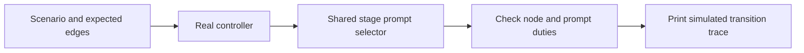

# Dry-run graph activities

Use the fast driver to inspect the actual managed controller's routes and the
stage instructions selected by live packets. Synthetic results stand in for
research, implementation, tests, commits and Improve assessments. The driver
does not execute those duties, invoke an LLM, discover a project run, acquire
its lock, write state, or issue a completion to a real run.



Locate the package's `scripts/shiploop` as `CLI`. From a repository checkout:

```sh
python3 skills/shiploop/scripts/shiploop graph-dry-run
python3 skills/shiploop/scripts/shiploop graph-dry-run --list
python3 skills/shiploop/scripts/shiploop graph-dry-run --scenario product-skill --format markdown
python3 skills/shiploop/scripts/shiploop graph-dry-run --scenario product-pause-resume --format json
```

The default runs every built-in scenario. Exit 0 means the simulated path
matched its expectations; exit 1 means a route or prompt assertion failed;
exit 2 means the input/CLI could not be read. A passing blocked or partial
scenario is a successful graph test, never a completed delivery. Output always
identifies the simulation and its resulting status.

The built-ins cover research, behavior, specification, objectives, local-plan
and product loops; selected/unused skills; material resets; blocked/resume;
pause/resume; product repair; step-plan scope dispositions and repair; and
unfinished prerequisite, replan and stop outcomes. The expected paths are
authored separately from the production routing table. A wrong edge fails
instead of being silently copied into the expected answer.

Prompt checks require a nonempty production instruction and selected duty
fragments, such as local test authoring and expected outcomes. They do not
compare the entire prompt byte-for-byte. Wording, formatting and whitespace
can change while the required duties remain. These checks locate missing or
misrouted instructions; evaluating the instruction's full meaning remains an
LLM or human review task.

## Supply a scripted activity

The included `graph-dry-run-example.json` walks a short product planning prefix:

```sh
python3 skills/shiploop/scripts/shiploop graph-dry-run \
  --script skills/shiploop/references/graph-dry-run-example.json --format json
```

Each step names the expected current phase (`at`), synthetic event (`event`),
expected next phase (`expect`), and optional `prompt_contains` duty fragments.
Use `status` for an expected non-active status, `paused: true` for a pause,
or `error` for an expected rejection. `outcome: material|trivial` supplies a
synthetic completed review at a commit phase. `flags` exercise the controller's
documented conditional choices. `resume`, `repair`, `blocked`,
`needs-prerequisite`, `needs-replan` and `stopped` exercise actual controller
operations. No input field is executed as code or a shell command.

For example, a `test-author` → blocked → resume sequence must return to
`test-author`, and an attempted completion while blocked must be rejected.
Removing the test-author node or returning the implementation prompt there
should break the graph test without requiring anyone to implement a feature.

## Full outer workflow with a small temporary fixture

The 36-node SDLC catalog describes responsibilities. It is not the incumbent
outer scheduler's executable routing table. The fast driver therefore does
**not** claim to prove outer-DAG traversal, full cold-start packet rendering,
evidence gates, or deployed behavior.

For those local outer transitions, use the existing real CLI fixture walk.
It creates two tiny work items in temporary Git repositories, runs their small
fixture checks, and exercises outer quality and handoff. It performs no work
in a user's project and does not deploy. Opt-in tracing captures the exact
returned packets and errors plus before/after parent and child cursors:

```sh
# Choose a new trace filename; an existing file is not overwritten.
SHIPLOOP_GRAPH_TRACE=/tmp/shiploop-outer-graph.jsonl \
  python3 -B test/shiploop-managed-walk.test.py -v
```

This second command requires a repository checkout and takes a few minutes.
It checks actual existing transitions, including rejected callbacks, recovery,
both work items, outer quality and terminal handoff. A trace is diagnostic
output, not authoritative run state or evidence that an unrelated project
passed. The fast driver prints stage instructions; this fixture trace records
the full CLI responses with their contextual packet material.

## Scope of this addition

These tools make graph and prompt changes cheap to inspect while the runtime
is simplified. They do not remove or bypass the current production evidence
gates. Test inputs that resemble receipts remain in memory and are never
exported as a child certificate or accepted completion record.
