# Navigator execution mode

Navigator is the default mode for new ShipLoop runs. It is a small directed
graph that returns one current prompt and records one state transition from a
concise host result. It keeps durable state and routing in the script while the
host decides how to inspect, plan, edit, test, review, and assess the work.



```mermaid
flowchart LR
  I[Intake] --> D[Discovery] --> R[Research] --> RI[Improve: research - repeats internally]
  RI --> S[Specification] --> SI[Improve: spec - repeats internally] --> TS[Test strategy]
  TS --> P[Plan] --> PI[Improve: plan - repeats internally] --> SP[Step plan]
  SP --> SPI[Improve: step plan - repeats internally] --> IM[Implement] --> TR[Test refine]
  TR --> TA[Test author] --> DOC[Document and reuse decision]
  DOC -->|skill required| SV[Skill validate] --> V[Verify]
  DOC -->|no skill required| V
  V --> PRI[Improve: product - repeats internally] --> IN[Integrate] --> CF[Carry forward]
  CF -->|next work item| SP
  CF -->|all work items complete| ST[System test] --> OI[Improve: whole product - repeats internally]
  OI --> RP[Release plan] --> REL[Release or honest N/A] --> RV[Release verify]
  RV --> H[Handoff] --> DONE[Done]
```

The graph describes order, not a substitute for engineering judgment. A prompt
does not dictate exact prose, a fixed check-manifest layout, a byte-for-byte
comparison, or a specific shell command. It does require the host to make the
stage’s substantive judgment and retain evidence that another host can find.

## Run it

Resolve the installed or checkout-local `scripts/shiploop` path as `CLI`, and
use absolute repository and run-directory paths.

```sh
python3 "$CLI" init --repo="$REPO" --run-dir="$RUN_DIR" --prompt='requested outcome'
python3 "$CLI" next --run-dir="$RUN_DIR"
python3 "$CLI" done --run-dir="$RUN_DIR" --action="$ACTION" --result="$RESULT"
```

`init` creates a new navigator-marked run and returns the `intake` cursor and
its prompt. `next` reprints the saved current action after a context reset.
`done` reads one result file containing a `shiploop-state` fenced JSON object,
for example:

````markdown
```shiploop-state
{"outcome":"done","summary":"Current repository facts and scope are recorded.","evidence_refs":["notes/A-INTAKE-001.md"]}
```
````

The semantic result contract is small:

| Field | Meaning |
| --- | --- |
| `outcome` | `done`, `repeat`, or `blocked`. `done` lets the graph choose the successor; a result never supplies one. |
| `summary` | Concise statement of the current action’s real result. |
| `evidence_refs` | Optional safe references to source, test, note, or external-operation evidence. |
| `work_items` | Optional ordered `{id,title,context?}` list at `plan` or `plan-improve` before execution for all approved work, or at `carry-forward` for future-only work. |
| `choices.skill_required` | Optional at `document` only. `true` selects `skill-validate`; omit it when no skill validation is required. |

`repeat` allocates another action at the same node, so the host can continue
with new information. `blocked` retains unfinished work; after the condition
is resolved, `resume` returns the same node. Neither is a successful advance.
At Improve nodes, normal review iterations continue internally. An explicit
`repeat` restarts the attempt; it never counts as a completed review or clean
pass. Each converged campaign submits one successful `done`.
Each new run begins with `W1`, titled from the original goal. A `plan` or
pre-execution `plan-improve` result can replace the pending plan with ordered
work items, while completed work-item records remain durable history; optional
`context` is host-written context, not script-inferred progress.

### Illustrative trace, not a recorded run

For a hypothetical request, “add an endpoint that returns the current account
balance,” `init` stores the request and sets the cursor to `intake`. The script
returns the `intake` prompt, which asks the host to establish scope, authority,
consumers, risks, and unknowns. The host might write a result whose outcome is
`done` and whose summary says that the target repository and unanswered account
authorization question were recorded. Only then does `done` move the cursor to
`discovery`; it does not accept a host-supplied `next_stage`. The prompt at
`discovery` then asks for current code, Git/worktree, instructions, consumers,
and local-skill facts. This is an example of the intended input → cursor →
prompt path, not evidence that any repository inspection occurred.

## Improve nodes own their full campaign

`research-improve`, `spec-improve`, `plan-improve`, `step-plan-improve`,
`product-improve`, and `outer-improve` each invoke the packaged reusable
[Improve review policy](improve-review-policy.md). Each is one graph action,
not a wrapper around another state machine.

The navigator’s binding is:

- Inspect the latest seven full Git commit messages in every cycle; inspect all
  available messages when fewer exist and state when no history exists.
- Keep a precise current candidate and adjacent-context scope. Materiality is
  semantic: a one-line bug can be material, while cosmetic work needs an impact
  assessment and is not automatically material.
- Write durable human-readable evidence under the run directory, such as
  `notes/<actionID>.md`, covering findings, classification, plan/no-change
  reason, checks, evidence, learnings, independent-review availability, and
  clean-review streak before and after. Candidate/source/baseline identity is a
  host-recorded descriptor, not a scripted hash gate.
- Commit authorized changes after their checks, without artificial empty
  commits. An explicit user no-commit direction overrides this default.
- Use a fresh independent reviewer when available; otherwise record that the
  pass was self-reviewed and its limitation.
- Execute review, history-informed planning, apply, checks, record, and assess
  cycles internally until the host judges two distinct consecutive
  trivial-only completed reviews with current checks and no open material
  finding. Then submit a single graph `done`. A blocker is incomplete.

The policy tells an owner that **splits** a review cycle into phases to execute
only its assigned phase and return to its owner. Navigator deliberately assigns
the complete cycle to one Improve node, so that split-phase restriction does
not divide this action. It does not launch standalone Improve or until-loop,
make child-phase cursors, inspect ambient loop state, or add a second
convergence wrapper.

Any plan, code, test, documentation, or skill change made during an Improve
campaign refreshes the checks it affects. The result is still a host judgment;
the script neither counts reviews nor classifies materiality, runs Git/tests,
reads artifacts, verifies policy hashes, or issues certificates.

## SDLC responsibilities

The prelude establishes repository facts, research, specification, independent
expected outcomes, local test strategy, and prerequisite-aware planning before
implementation. `plan` uses Backchain-style reverse reasoning from outcomes to
suppliers and verification. `step-plan` preserves those prerequisites and test
cases at the local work-item boundary.

The inner path makes post-code quality visible: implementation is followed by
test-case refinement from the code actually written, executable test authoring,
documentation and reuse assessment, optional skill validation, then real
linters/tests with justified fixes and rechecks. `integrate` performs only
authorized Git/worktree work; it does not assert a merge, push, or deployment
from intent. `carry-forward` reviews broad scope, dependencies, future
system-test requirements, and skill obligations without pretending future work
is complete.

`system-test` is for actual authorized integration, end-to-end, runtime, or
system-boundary checks, distinct from merely planning them. `outer-improve`
reviews the whole assembled product. `release-plan` establishes permission,
target, rollback, and checks; `release` may honestly be non-applicable;
`release-verify` examines the actual consumer/runtime boundary. `handoff`
reports source, test, integration, release, consumer status, and remaining
limits as facts.

| Owner | Duties |
| --- | --- |
| Script | Persist mode/cursor/action IDs, return the current prompt, validate the small result envelope, route `done`, retain `repeat`, and resume `blocked`. |
| Host agent | Inspect and interpret evidence; choose commands; plan and execute authorized work; write/refine tests; assess materiality, convergence, and applicability; record honest evidence. |
| User | Sets desired outcome, scope, permission, and overrides such as no commit or no release. |

## Implementation constitution

Keep scope ahead of abstraction: solve the approved problem before introducing
a framework, generalized scheduler, or speculative extension. Use meaningful
test oracles tied to observable outcomes and choose checks in proportion to the
change and its risk. Treat materiality semantically, preserve unrelated work,
and stop for user direction when permission, scope, external effects, or an
irreversible decision is not already authorized.

## Compatibility and limits

New runs persist `execution_mode: navigator` and
`navigator_protocol_version: 1`. Existing markerless managed or legacy states
retain the protocol their established records select, including a managed marker
such as `managed_improve_protocol_version`; they are not converted or
reinterpreted. New navigator markers alone select navigator dispatch. Do not
edit durable mode state to bypass that boundary.

Navigator prompts and graph-walk tests can show that the script returns the
expected stage and transitions only after accepted result envelopes. They cannot
prove source behavior, test adequacy, Git effects, external target identity,
consumer impact, authorization, or release success. Use the graph dry-run for
cheap routing and prompt inspection; it is simulation only and never delivery
evidence.
