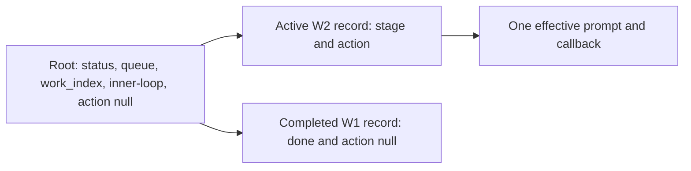

# Navigator execution mode

Navigator protocol 2 is the default for new ShipLoop runs. It is a small
directed graph that returns one effective prompt and records one state
transition from a concise host result. One shared INNER graph serves every work
item; `state.md` holds the per-item execution records. The script keeps durable
state and routing while the host decides how to inspect, plan, edit, test,
review, and assess the work.

```mermaid
flowchart LR
  I[Intake] --> D[Discovery plus Improve] --> R[Research] --> RI[Improve: research - one campaign]
  RI --> S[Specification] --> SI[Improve: spec - one campaign] --> TS[Test strategy plus Improve]
  TS --> P[Plan] --> PI[Improve: plan - one campaign] --> SP[Step plan]
  SP --> SPI[Improve: step plan - one campaign] --> IM[Implement] --> TR[Test refine]
  TR --> TA[Test author] --> DOC[Document and reuse decision]
  DOC -->|skill required| SV[Skill validate] --> V[Verify]
  DOC -->|no skill required| V
  V --> PRI[Improve: product - one campaign] --> IN[Integrate] --> CF[Carry forward]
  CF -->|next work item| SP
  CF -->|all work items complete| ST[System test] --> OI[Improve: whole product - one campaign]
  OI --> RP[Release plan plus Improve] --> REL[Release or honest N/A] --> RV[Release verify]
  RV --> H[Handoff] --> DONE[Done]
```



The graph describes order, not a substitute for engineering judgment. A prompt
does not dictate exact prose, a fixed check-manifest layout, a byte-for-byte
comparison, or a specific shell command. It does require the host to make the
stage’s substantive judgment and retain evidence that another host can find.

## Run it

Resolve the installed or checkout-local `scripts/shiploop` path as `CLI`, and
use absolute repository and run-directory paths.

Before any stage duty, choose exactly one entry route: `init` for a genuinely
new request, or `next` for its existing run. For an existing run, verify the
printed original goal and repository identity before acting. Do not replace a
missing or relocated run with a new one.

```sh
python3 "$CLI" init --repo="$REPO" --run-dir="$RUN_DIR" --prompt='requested outcome'
# Compatibility fixtures only; normal new runs use protocol 2 above.
python3 "$CLI" init --repo="$REPO" --run-dir="$RUN_DIR" --execution-mode=navigator-v1 --prompt='fixture outcome'
python3 "$CLI" next --run-dir="$RUN_DIR"
python3 "$CLI" done --run-dir="$RUN_DIR" --action="$ACTION" --result="$RESULT"
```

Default `init` creates a protocol-2 navigator-marked run and returns the
`intake` cursor and its prompt. `next` rereads the saved effective action after
a context reset; it does not select or persist a successor. `done` reads one
result file containing a `shiploop-state` fenced JSON object, for example:

````markdown
```shiploop-state
{"outcome":"done","summary":"Current repository facts and scope are recorded.","evidence_refs":["notes/A-INTAKE-001.md"]}
```
````

The packet's Current node and Action identify the assignment. Its Last accepted
transition is historical context and does not replace the current action.

## Recover one existing run

Every navigator packet includes absolute CLI, repository, and run-directory
locators. It also prints `Recovery command:` followed by an exact shell-quoted
`next` command. Copy those locators and that command to host-owned durable
handoff material before transferring work or discarding context. The handoff is
a locator only: do not copy the current node, action ID, result path, status,
or an expected successor as another source of graph state.

A fresh host starts with the recorded recovery command, reads the reprinted
packet and only its relevant references, then performs that one current action.
The owner of the run submits the action-bound callback and consumes the packet
it returns. A delegated worker may do bounded work under that packet, but does
not initialize a child run or advance its parent's graph.

After an interruption, run `next`, inspect durable evidence and actual effects,
and reconcile work that may already have happened before deciding what remains.
If the reprinted packet is paused or blocked, resolve its stated condition and
use its printed `resume` command once. A halted or done packet remains stopped.
If the CLI, repository, or run path is unavailable or relocated, recover the
same run and verify its task/repository identity first; otherwise leave the
delivery incomplete. Never use `init` as a replacement for missing state.

The script neither preserves this host handoff nor launches/resets a model or
host process. The host must retain an accessible locator and run directory.

The semantic result contract is small:

| Field | Meaning |
| --- | --- |
| `outcome` | `done`, `repeat`, or `blocked`. `done` lets the graph choose the successor; a result never supplies one. |
| `summary` | Concise statement of the current action’s real result. |
| `evidence_refs` | Optional safe references to source, test, note, or external-operation evidence. |
| `work_items` | Optional ordered `{id,title,context?}` list at `plan` or `plan-improve` before execution for all approved work, or at `carry-forward` for future-only work. |
| `choices.skill_required` | Optional at `document` only. `true` selects `skill-validate`; omit it when no skill validation is required. |
| `delivery_assessment` | Only for new v2 runs initialized with `--delivery-contract`: a full consumer-delivery contract/correction or bound observations, using the packet template. See [consumer delivery](consumer-delivery.md). |

`repeat` allocates another action at the same node, so the host can continue
with new information. `blocked` retains unfinished work; after the condition
is resolved, `resume` returns the same node. Neither is a successful advance.
At Improve nodes, normal review iterations continue internally. An explicit
`repeat` restarts the attempt; it never counts as a completed review or clean
pass. Each converged campaign submits one successful `done`.
Each new run begins with `W1`, titled from the original goal. A `plan` or
pre-execution `plan-improve` result can replace the pending plan with ordered
work items, while completed work-item records remain durable history; optional
`context` is host-written context, not script-inferred progress.

Results cannot set a successor, INNER stage, Improve phase, review count, or
another item's action. The one accepted action determines the next effective
cursor. A malformed duplicate owner or a stale/conflicting callback is rejected
without selecting another item.

## One shared INNER graph and per-item records

The flat SDLC path from `step-plan` through `carry-forward` is one shared INNER
graph, not a graph copy per work item. Root owns the run's global `status`,
`status_reason`, ordered queue, and `work_index`. While an item is active, root
is parked at `stage: inner-loop` with `action: null`; the active item's entry in
`inner_loops` exclusively owns the effective stage and action. Outside INNER
work, root exclusively owns both stage and action.



This compact state is illustrative rather than a complete persisted schema:

```json
{
  "navigator_protocol_version": 2,
  "execution_mode": "navigator",
  "status": "active",
  "stage": "inner-loop",
  "action": null,
  "work_index": 1,
  "work_items": [
    {"id": "W1", "title": "First approved change"},
    {"id": "W2", "title": "Second approved change"}
  ],
  "inner_loops": {
    "W1": {"stage": "done", "action": null},
    "W2": {
      "stage": "step-plan",
      "action": {"id": "W2-step-plan-1", "stage": "step-plan"}
    }
  }
}
```

No record exists for a future W3 until ShipLoop enters it. At an accepted W1
`carry-forward`, one locked transaction marks W1 `done`/`null`, advances the
selection, and creates W2 at `step-plan`; if W1 is final, it instead restores
root ownership at `system-test`. W1 remains retained after W2 becomes active.
Calling `next` after a context reset reprints W2's same effective action rather
than advancing it. An identical accepted W1 replay after W2 selection is
non-mutating; a conflicting or unknown old callback fails without changing W2.

`repeat` replaces only the active item's action while root remains active.
An accepted `blocked` result records the root blocker and a fresh pending action
for that item because its reported action is already accepted; no further
new completion is accepted until `resume`. An identical accepted replay remains
non-mutating. Pause/resume preserves the pending item action. Halt is terminal
at the root.

### Illustrative trace, not a recorded run

For a hypothetical request, “add an endpoint that returns the current account
balance,” `init` stores the request and sets the cursor to `intake`. The script
returns the `intake` prompt, which asks the host to establish scope, authority,
consumers, risks, and unknowns. The host might write a result whose outcome is
`done` and whose summary says that the target repository and unanswered account
authorization question were recorded. Only then does `done` move the cursor to
`discovery`; it does not accept a host-supplied `next_stage`. The prompt at
`discovery` then asks for current code, Git/worktree, instructions, consumers,
and local-skill facts. This is an example of the intended input → cursor →
prompt path, not evidence that any repository inspection occurred.

## Improve nodes own their full campaign

`discovery`, `test-strategy`, `release-plan`,
`research-improve`, `spec-improve`, `plan-improve`, `step-plan-improve`,
`product-improve`, and `outer-improve` each invoke the packaged reusable
[Improve review policy](improve-review-policy.md). Each is one call-and-return
graph action. The campaign's work occurs under its assigned action; it does not
become DAG nodes, `inner_loops` records, child callbacks, or ShipLoop review
counters.

Discovery, test strategy, and release planning first produce their initial
candidate, then run their full Improve campaign **inside the same action before
its one completion**. Research, specification, overall planning, and step
planning retain their immediate dedicated Improve successor; do not wrap their
draft actions again. Intake remains scope/authority framing. These are prompt
duties on existing nodes, not new stages or a saved-run migration.

Review the actual stage artifact: discovery facts and consequential unknowns,
test cases and independent expected outcomes, or release prerequisites and
recovery/verification plans. A plan check need not execute future product tests,
and release-plan review must not perform the release. A justified non-applicable
release is itself a reviewable conclusion. An empty/new repo has no seven-commit
history to invent: disclose the absence and use current evidence. Discovery
review shares the existing investigation allowance; exhausting it with required
work unfinished is incomplete, not two clean passes.

The navigator’s binding is:

- Inspect the latest seven full Git commit messages in every cycle; inspect all
  available messages when fewer exist and state when no history exists.
- Keep a precise current candidate and adjacent-context scope. Materiality is
  semantic: a one-line bug can be material, while cosmetic work needs an impact
  assessment and is not automatically material.
- Write durable human-readable evidence under the run directory, such as
  `notes/<actionID>.md`, covering findings, classification, plan/no-change
  reason, checks, evidence, learnings, independent-review availability, and
  clean-review streak before and after. Candidate/source/baseline identity is a
  host-recorded descriptor, not a scripted hash gate.
- Commit authorized changes after their checks, without artificial empty
  commits. An explicit user no-commit direction overrides this default.
- Use a fresh independent reviewer when available; otherwise record that the
  pass was self-reviewed and its limitation. Schedule available independent
  review against the final candidate before convergence and record its actual
  scope. Later material edits invalidate affected review evidence; reconsider
  that scope and obtain another independent look when available.
- Execute review, history-informed planning, apply, checks, record, and assess
  cycles internally until the host judges two distinct consecutive
  trivial-only completed reviews with current checks and no open material
  finding. Then submit a single graph `done`. A blocker is incomplete.
- When failures or findings recur, record a testable diagnosis, a small check
  that distinguishes plausible causes, its observation, and the next action.
  Revisit the hypothesis or plan when retries add no evidence.

The reusable policy tells an owner that **splits** a review campaign into phases
to execute only its assigned phase and return to its owner. Navigator deliberately
assigns the complete campaign to one Improve node, so that split-phase
restriction does not divide this action. It preserves the existing
whole-campaign owner binding: it does not launch standalone Improve or
until-loop, make child-phase cursors, inspect ambient loop state, or add a
second convergence wrapper.

Any plan, code, test, documentation, or skill change made during an Improve
campaign refreshes the checks it affects. The result is still a host judgment;
the script neither counts reviews nor classifies materiality, runs Git/tests,
reads artifacts, verifies policy hashes, or issues certificates.

## SDLC responsibilities

Discovery and research use the [shared recursive-discovery policy](research-loop.md#recursive-discovery-and-experiments)
with its [navigator record and checkpoint binding](research-loop.md#navigator-execution-mode-adapter).
Product and outer Improve use it for consequential new environment findings.
Keep the eight-area evidence, reuse decisions, access/setup observations, and
remaining shared allowance in durable notes referenced by the generic result;
do not introduce compatibility schemas or child-phase callbacks.

The prelude establishes repository facts, research, specification, independent
expected outcomes, local test strategy, and prerequisite-aware planning before
implementation. `plan` uses Backchain-style reverse reasoning from outcomes to
suppliers and verification. `step-plan` preserves those prerequisites and test
cases at the local work-item boundary.

The inner path makes post-code quality visible: implementation is followed by
test-case refinement from the code actually written, executable test authoring,
documentation and reuse assessment, optional skill validation, then real
linters/tests with justified fixes and rechecks. `integrate` performs only
authorized Git/worktree work; it does not assert a merge, push, or deployment
from intent. `carry-forward` reviews broad scope, dependencies, future
system-test requirements, and skill obligations without pretending future work
is complete.

Delivery planning names the intended consumer and distinguishes source updates,
versioned releases, promotion, and access changes by their actual effects and
authority. A local-only decision must match the user's scope; missing access
does not turn a required update into N/A. Improve challenges the original user
outcome rather than treating the generated spec as its own authority.

`system-test` is for actual authorized integration, end-to-end, runtime, or
system-boundary checks, distinct from merely planning them. `outer-improve`
reviews the whole assembled product. `release-plan` establishes permission,
target, rollback, and checks; `release` may honestly be non-applicable;
`release-verify` examines the actual consumer/runtime boundary. `handoff`
reports source, test, integration, release, consumer status, and remaining
limits as facts.

For an opt-in delivery-contract run, the existing ledger also carries typed
requirements and separate source/update/identity/behavior observations. The
script checks declared coverage at the relevant boundary, while the host
executes and judges checks. Pre-update checks can be refreshed during outer
Improve/release planning. A material post-plan candidate or target change that
needs replanning blocks for direction; `repeat` does not jump backward.
An unchanged candidate with a completed update and blocked browser check resumes
verification without automatically re-uploading. See the [full contract and
recovery examples](consumer-delivery.md). No new stages or Improve counters apply.

| Owner | Duties |
| --- | --- |
| Script | Persist mode/cursor/action IDs, return the current prompt, validate the small result envelope, route `done`, retain `repeat`, and resume `blocked`. |
| Host agent | Inspect and interpret evidence; choose commands; plan and execute authorized work; write/refine tests; assess materiality, convergence, and applicability; record honest evidence. |
| User | Sets desired outcome, scope, permission, and overrides such as no commit or no release. |

### Agentic responsibilities inside existing stages

These are host-executed prompt duties within the existing graph. They add no
nodes, result fields, scripted evidence validators, or required subagents.

#### Project implementation conventions

Discover practices early, select them in planning, and revalidate the relevant
subset for each work item. These are ordinary host judgments within the existing
stages; no conventions schema, extra graph node or new Improve campaign applies.

- **Discovery/research:** identify product purpose and behavior to preserve,
  supported runtime/dependency versions, canonical code/test examples, relevant
  MCP/API contracts and reusable skills. Cite current sources and versions where
  material. Distinguish binding requirements from observed practice and proposals.
  Requirements come from current user/repository instructions and verified
  contracts; historical code and tool descriptions are not automatic authority.
- **Specification:** preserve applicable binding constraints, such as runtime
  compatibility and public interfaces, while defining the requested behavior.
  A discovered default does not become a new requirement merely by being noted.
- **Overall plan:** select applicable conventions, their scope/rationale, useful
  examples and verification commands. Retain one concise section in an appropriate
  existing project document or durable plan note. Include its locator in plan
  `evidence_refs` and applicable work-item `context`; keep context to a short
  locator/decision summary, not a copied manual. Preserve locators on queue edits.
- **Inner planning and implementation:** read that subset and check changed
  assumptions. If a locator is absent or inaccessible, recover it from accepted
  discovery/plan records and canonical sources. Use targeted discovery for stale
  or conflicting facts; block only an unresolved prerequisite for dependent work.
  Record justified departures, rationale and checks. Pass the relevant decisions
  and references to delegated workers; do not copy unsafe or obsolete precedent.
- **Existing Improve, documentation and carry-forward:** challenge unjustified
  drift and stale conventions within the current campaign. Retain validated
  decisions and references for later items; keep proposals and task-specific
  exceptions distinct. Create a focused project document only when authorized
  reuse needs it and no existing home fits. Do not duplicate a general coding guide.

An MCP interface or skill often governs how the agent obtains evidence or does
work; it does not automatically prescribe product architecture, authorize an
external operation, or require adding a dependency. Select only relevant tools
and practices. A docs-only item should not invent runtime conventions.

For example, this repository's `skills/` source and generated `plugins/` layout
means a prompt change belongs in the canonical skill followed by package sync
and parity checks. A work-item context can point to the layout rule and selected
commands. If a dependency change makes an older code example invalid, investigate
the affected API, record a justified exception and update the relevant checks;
do not repeat all discovery or blindly preserve the old pattern.

#### Implementation quality indicator

The planning and code-quality packets carry the explicit indicator
`Implementation quality: error checking + token-efficient code documentation`.
It is prompt guidance for the current assignment, not a result field or a
scripted pass/fail gate. It appears at `plan`, `plan-improve`, `step-plan`,
`step-plan-improve`, `implement`, `test-refine`, `test-author`, `document`,
`verify`, `product-improve`, `integrate`, and `outer-improve`.

Planning names relevant failure boundaries, expected handling, negative checks,
diagnostic actions/fields and code-contract locations. Implementation handles
those failures, adds the selected diagnostics and writes concise contracts
alongside code, including these criteria in any delegated task prompt.
Testing exercises meaningful error paths and observable diagnostics;
documentation and review check the contracts against the actual candidate.
Improve assesses these criteria within its own complete campaign; no new Improve
phase or DAG transition is introduced.

Reuse the project's logger and debug controls for **opt-in debug diagnostics**
before and after selected major actions (for example, external calls, writes,
batches or retries). Use bounded, redacted summaries of relevant IDs, counts,
decisions, state changes and timings, with operation/request correlation when
useful. Avoid whole-state dumps and expensive collection while debug is off.

At meaningful failure detection, **snapshot safe relevant context before cleanup
or mutation**; retain stable values rather than references to mutable state.
Include the operation/phase and expected versus observed conditions. Essential
failure context remains available with debug off. Keep messages concise and
appropriate to their audience; internal structured details can carry more context,
with a correlation ID connecting a public message to internal diagnostics when
needed. Redact sensitive fields and emitted exception details. Preserve the
original error type, cause and traceback for propagation, while redacting emitted
causes and stacks; logging or serialization failures must
not mask the original error. Record at the owning handling boundary, avoid
duplicate stacks on rethrow, and distinguish expected control-flow exceptions
from incidents. This guidance does not prescribe a logging framework.

When diagnostics change, select meaningful checks for debug on/off behavior,
pre-cleanup context surviving recovery, redaction, original cause preservation,
and diagnostic failure behavior. Reuse adequate tests and avoid mandatory
instrumentation on every function. For example, a failed reservation might retain
`requested=5, available=3, phase=reserved` even after recovery changes the live
phase to `rolled_back`; verbose tracing can be off while that safe failure context
remains available. This is an illustrative contract, not an implemented logger.

Error checking is proportional to changed boundaries: preserve actionable errors
and needed cleanup/recovery, without swallowing failures or adding speculative
defensive layers. Token-efficient documentation helps a fresh LLM or human
understand purpose, preconditions, outputs/errors, material side effects,
invariants, and rationale. Prefer clear names and concise colocated contracts
over narration or duplicate explanations. Reuse adequate checks/docs, preserve
material caveats and required API/user docs, and explain genuine non-applicability
in ordinary notes. This follows the existing
[code documentation guidance](testing-and-documentation.md#documentation).

For example, a work item that parses configuration should plan its invalid-input
behavior and a negative case, implement that behavior, and document the accepted
input and error contract near the parser. Verification runs the case and reviews
the contract. A docs-only correction need not invent a runtime guard. These are
illustrative expectations; the navigator records the host's completion judgment
and cannot prove that the host performed the checks or wrote good documentation.

| Responsibility | Stage | Expected evidence or decision |
| --- | --- | --- |
| Challenge acceptance and tests | `step-plan-improve`, `test-refine`, `test-author` | Resolve ambiguous meaning with positive and nearby negative examples; derive expected results from the specification. For important regressions where practical, show an adequate check rejects the known-bad behavior and passes the candidate. |
| Own delegated work | `step-plan`, `implement`, `integrate` | If delegating, identify bounded task/file ownership, shared interfaces, inputs, outputs/checks and the integrating owner. The owner inspects actual contributions and checks their combined behavior before its one completion. |
| Diagnose persistent failure | `verify`, all Improve campaigns | Distinguish product, test and environment explanations with a small observable experiment. Record the conclusion and why the next action follows; a repeated attempt alone is not progress. |
| Select relevant operational checks | `step-plan`, `product-improve` | Identify changed authorization/data boundaries, dependencies, recovery or diagnostic needs. Choose proportional checks and retain genuinely missing prerequisites as incomplete. |
| Review the resulting candidate | Improve campaigns, `integrate` | Available independent review covers the final candidate. Material later edits invalidate affected evidence; integration rechecks shared interfaces and re-reviews changed scope. Whole-product obligations continue to outer Improve. |
| Place validated learnings | `document`, `skill-validate`, `carry-forward`, `outer-improve` | Retain a run-specific lesson, add a repo-local regression/example, or propose a shared change with evidence and a target. Validate shared changes on triggering, failure and other representative cases before adoption within existing authority. |

For example, suppose two worker contributions each pass their local tests, but
one emits milliseconds while its consumer interprets seconds. At `integrate`,
the owner checks the shared specification and runs the combined path. The
observed unit mismatch prompts a scoped repair, review and affected rechecks;
only then is an honest completion submitted. This hypothetical trace explains
the duty, not a claim that the script detects units or runs these tests.

Negative controls are proportional: an existing failing regression can be enough.
Keep deliberately broken variants in isolated experiments, and never change
the expected behavior merely to make a test pass. A missing required external
check remains incomplete even when an investigation allowance expires.

Prerequisites apply at the stage that needs them. A missing release-only staging
credential stays an open release condition, with its owner and earliest gating
stage recorded; it does not block otherwise-ready authorized local work.

## Implementation constitution

Keep scope ahead of abstraction: solve the approved problem before introducing
a framework, generalized scheduler, or speculative extension. Use meaningful
test oracles tied to observable outcomes and choose checks in proportion to the
change and its risk. Treat materiality semantically, preserve unrelated work,
and stop for user direction when permission, scope, external effects, or an
irreversible decision is not already authorized.

Make acceptance and test expectations independently challengeable. Keep the
owning agent accountable for delegated results. Let observed failures change
the investigation. Refresh affected test and review evidence after material
changes, including integration. Promote lessons only as far as their evidence
and the user's authority support; preserve unvalidated proposals as proposals.

Carry error checking and concise, accurate code documentation from planning
through implementation and review. Token efficiency means removing redundancy,
not omitting a material contract or safety caveat.

## Compatibility and limits

New runs persist `execution_mode: navigator` and
`navigator_protocol_version: 2`. The explicit `navigator-v1` fixture mode
persists version 1 and retains its strict root keys and cursor rules. Existing
v1, markerless managed, and legacy states retain the protocol their established
records select; they are not converted, migrated into `inner_loops`, or
reinterpreted. A managed marker such as `managed_improve_protocol_version`
continues to select its established route. Do not edit durable mode state to
bypass that boundary.

Navigator prompts and graph-walk tests can show that the script returns the
expected stage and transitions only after accepted result envelopes. They cannot
prove source behavior, test adequacy, Git effects, external target identity,
consumer impact, authorization, or release success. Use the graph dry-run for
cheap routing and prompt inspection; it is simulation only and never delivery
evidence.
