# Navigator execution mode

Navigator protocol 1 is the default mode for new ShipLoop runs. It is a small
directed graph that returns one current prompt and records one state transition
from a concise host result. It keeps durable state and routing in the script
while the host decides how to inspect, plan, edit, test, review, and assess the
work. A new-run-only `--review-receipts` selection creates navigator protocol 2
for an opt-in pilot; it changes only the Improve-node receipt boundary.

```mermaid
flowchart LR
  I[Intake] --> D[Discovery] --> R[Research] --> RI[Improve: research - repeats internally]
  RI --> S[Specification] --> SI[Improve: spec - repeats internally] --> TS[Test strategy]
  TS --> P[Plan] --> PI[Improve: plan - repeats internally] --> SP[Step plan]
  SP --> SPI[Improve: step plan - repeats internally] --> IM[Implement] --> TR[Test refine]
  TR --> TA[Test author] --> DOC[Document and reuse decision]
  DOC -->|skill required| SV[Skill validate] --> V[Verify]
  DOC -->|no skill required| V
  V --> PRI[Improve: product - repeats internally] --> IN[Integrate] --> CF[Carry forward]
  CF -->|next work item| SP
  CF -->|all work items complete| ST[System test] --> OI[Improve: whole product - repeats internally]
  OI --> RP[Release plan] --> REL[Release or honest N/A] --> RV[Release verify]
  RV --> H[Handoff] --> DONE[Done]
```



The graph describes order, not a substitute for engineering judgment. A prompt
does not dictate exact prose, a fixed check-manifest layout, a byte-for-byte
comparison, or a specific shell command. It does require the host to make the
stage’s substantive judgment and retain evidence that another host can find.

## Run it

Resolve the installed or checkout-local `scripts/shiploop` path as `CLI`, and
use absolute repository and run-directory paths.

Before any stage duty, choose exactly one entry route: `init` for a genuinely
new request, or `next` for its existing run. For an existing run, verify the
printed original goal and repository identity before acting. Do not replace a
missing or relocated run with a new one.

```sh
python3 "$CLI" init --repo="$REPO" --run-dir="$RUN_DIR" --prompt='requested outcome'
# Explicit protocol-2 pilot for a genuinely new run only:
python3 "$CLI" init --review-receipts --repo="$REPO" --run-dir="$RUN_DIR" --prompt='requested outcome'
python3 "$CLI" next --run-dir="$RUN_DIR"
python3 "$CLI" done --run-dir="$RUN_DIR" --action="$ACTION" --result="$RESULT"
```

Plain `init` creates the unchanged protocol-1 navigator run. Only the explicit
flag above creates protocol 2, and only at creation; `next` never converts a
saved navigator, managed, or legacy run. `next` rereads the saved current
action after a context reset; it does not select or persist a successor. `done`
reads one result file containing a `shiploop-state` fenced JSON object, for
example:

````markdown
```shiploop-state
{"outcome":"done","summary":"Current repository facts and scope are recorded.","evidence_refs":["notes/A-INTAKE-001.md"]}
```
````

The packet's Current node and Action identify the assignment. Its Last accepted
transition is historical context and does not replace the current action.

## Recover one existing run

Every navigator packet includes absolute CLI, repository, and run-directory
locators. It also prints `Recovery command:` followed by an exact shell-quoted
`next` command. Copy those locators and that command to host-owned durable
handoff material before transferring work or discarding context. The handoff is
a locator only: do not copy the current node, action ID, result path, status,
or an expected successor as another source of graph state.

A fresh host starts with the recorded recovery command, reads the reprinted
packet and only its relevant references, then performs that one current action.
The owner of the run submits the action-bound callback and consumes the packet
it returns. A delegated worker may do bounded work under that packet, but does
not initialize a child run or advance its parent's graph.

After an interruption, run `next`, inspect durable evidence and actual effects,
and reconcile work that may already have happened before deciding what remains.
If the reprinted packet is paused or blocked, resolve its stated condition and
use its printed `resume` command once. A halted or done packet remains stopped.
If the CLI, repository, or run path is unavailable or relocated, recover the
same run and verify its task/repository identity first; otherwise leave the
delivery incomplete. Never use `init` as a replacement for missing state.

The script neither preserves this host handoff nor launches/resets a model or
host process. The host must retain an accessible locator and run directory.

The semantic result contract is small:

| Field | Meaning |
| --- | --- |
| `outcome` | `done`, `repeat`, or `blocked`. `done` lets the graph choose the successor; a result never supplies one. |
| `summary` | Concise statement of the current action’s real result. |
| `evidence_refs` | Optional safe references to source, test, note, or external-operation evidence. |
| `work_items` | Optional ordered `{id,title,context?}` list at `plan` or `plan-improve` before execution for all approved work, or at `carry-forward` for future-only work. |
| `choices.skill_required` | Optional at `document` only. `true` selects `skill-validate`; omit it when no skill validation is required. |
| `review` | Required only for a protocol-2 `done` result at an Improve node. Its exact receipt shape and nonempty outer `evidence_refs` requirement are in [the review-receipt contract](improve-review-progress.md). |

`repeat` allocates another action at the same node, so the host can continue
with new information. `blocked` retains unfinished work; after the condition
is resolved, `resume` returns the same node. Neither is a successful advance.
At a protocol-1 Improve node, normal review iterations continue internally and
one successful `done` follows a host-judged converged campaign. At a
protocol-2 Improve node, each `done` is one complete iteration and is assessed
from its receipt; an explicit `repeat` or `blocked` never counts. The packet
prints the only legal callback in either protocol.
Each new run begins with `W1`, titled from the original goal. A `plan` or
pre-execution `plan-improve` result can replace the pending plan with ordered
work items, while completed work-item records remain durable history; optional
`context` is host-written context, not script-inferred progress.

### Illustrative trace, not a recorded run

For a hypothetical request, “add an endpoint that returns the current account
balance,” `init` stores the request and sets the cursor to `intake`. The script
returns the `intake` prompt, which asks the host to establish scope, authority,
consumers, risks, and unknowns. The host might write a result whose outcome is
`done` and whose summary says that the target repository and unanswered account
authorization question were recorded. Only then does `done` move the cursor to
`discovery`; it does not accept a host-supplied `next_stage`. The prompt at
`discovery` then asks for current code, Git/worktree, instructions, consumers,
and local-skill facts. This is an example of the intended input → cursor →
prompt path, not evidence that any repository inspection occurred.

## Improve nodes: preserved protocol 1 and review-receipt pilot

`research-improve`, `spec-improve`, `plan-improve`, `step-plan-improve`,
`product-improve`, and `outer-improve` each invoke the packaged reusable
[Improve review policy](improve-review-policy.md). Neither navigator protocol
starts standalone Improve or Until Loop, creates a child phase cursor, or
adds a second state store.

### Protocol 1: one host-judged whole campaign

Navigator protocol 1 is the default and preserves the existing whole-campaign
binding. One Improve graph action remains one host-owned campaign, not a
wrapper around another state machine. The host completes its internal cycles,
then submits one `done` only when it judges the campaign converged.

Its binding is:

- Inspect the latest seven full Git commit messages in every cycle; inspect all
  available messages when fewer exist and state when no history exists.
- Keep a precise current candidate and adjacent-context scope. Materiality is
  semantic: a one-line bug can be material, while cosmetic work needs an impact
  assessment and is not automatically material.
- Write durable human-readable evidence under the run directory, such as
  `notes/<actionID>.md`, covering findings, classification, plan/no-change
  reason, checks, evidence, learnings, independent-review availability, and
  clean-review streak before and after. Candidate/source/baseline identity is a
  host-recorded descriptor, not a scripted hash gate.
- Commit authorized changes after their checks, without artificial empty
  commits. An explicit user no-commit direction overrides this default.
- Use a fresh independent reviewer when available; otherwise record that the
  pass was self-reviewed and its limitation. Schedule available independent
  review against the final candidate before convergence and record its actual
  scope. Later material edits invalidate affected review evidence; reconsider
  that scope and obtain another independent look when available.
- Execute review, history-informed planning, apply, checks, record, and assess
  cycles internally until the host judges two distinct consecutive
  trivial-only completed reviews with current checks and no open material
  finding. Then submit a single graph `done`. A blocker is incomplete.
- When failures or findings recur, record a testable diagnosis, a small check
  that distinguishes plausible causes, its observation, and the next action.
  Revisit the hypothesis or plan when retries add no evidence.

The policy tells an owner that **splits** a review cycle into phases to execute
only its assigned phase and return to its owner. Protocol 1 deliberately
assigns the complete cycle to one Improve node, so that split-phase restriction
does not divide this action. Any plan, code, test, documentation, or skill
change made during the campaign refreshes the checks it affects. The result is
still a host judgment; protocol 1 does not count reviews or classify edits by
their bytes.

## Review-receipt pilot

### One complete iteration per action

`init --review-receipts` creates navigator protocol 2 for a genuinely new run.
It is not a default, migration, or change to any existing navigator, managed,
or legacy record. At a protocol-2 Improve node, the assignment is exactly one
complete **review → plan → apply → check → record → assess** iteration. The
host must complete all six duties before returning the current packet's `done`
result; it does not submit subphase callbacks.

The packet prints an exact **result-only** completion command. Its generated
result path retains the script-issued action identity internally, so the host
does not recreate an action ID, choose a successor, or hand-construct a
different callback. A `done` result must include a nonempty outer
`evidence_refs` list and this `review` object:

````markdown
```shiploop-state
{
  "outcome": "done",
  "summary": "Reviewed the current candidate; no worthwhile change remained.",
  "evidence_refs": ["notes/nav-example.md"],
  "review": {
    "candidate_before": "host descriptor for the candidate and scope before review",
    "candidate_after": "host descriptor for the candidate and scope after review",
    "classification": "none",
    "checks": "passed",
    "improvements_complete": true,
    "open_findings": []
  }
}
```
````

`candidate_before` and `candidate_after` are nonempty host descriptors;
`classification` is `material`, `trivial`, `none`, or `uncertain`; `checks` is
`passed`, `failed`, `stale`, or `incomplete`; and `open_findings` is a list of
nonempty finding strings. The exact canonical schema, continuity rule, compact
trace, reset conditions, no-change handling, and single-counter boundary are in
[the Improve review-progress reference](improve-review-progress.md).

ShipLoop persists only its existing `state.md` and `results/` Markdown ledger.
It passes contiguous accepted receipts to the package-local copy of Improve's
pure `review_progress.py`, which is the sole owner of streak derivation. The
helper returns whether two eligible contiguous receipts are ready; ShipLoop
then either emits another Improve action or advances the SDLC. It does not add
a second persistent counter, launch standalone Improve/Until Loop, or
machine-prove semantic host assertions. Candidate descriptors, classifications,
check claims, completeness, findings, and evidence references remain host
claims requiring honest supporting evidence.

The pilot does not modify the managed controller's binding, audit-SHA, or
terminal-certificate semantics. It does not reinterpret managed or legacy
receipts.

## SDLC responsibilities

Discovery and research use the [shared recursive-discovery policy](research-loop.md#recursive-discovery-and-experiments)
with its [navigator record and checkpoint binding](research-loop.md#navigator-execution-mode-adapter).
Product and outer Improve use it for consequential new environment findings.
Keep the eight-area evidence, reuse decisions, access/setup observations, and
remaining shared allowance in durable notes referenced by the generic result;
do not introduce compatibility schemas or child-phase callbacks.

The prelude establishes repository facts, research, specification, independent
expected outcomes, local test strategy, and prerequisite-aware planning before
implementation. `plan` uses Backchain-style reverse reasoning from outcomes to
suppliers and verification. `step-plan` preserves those prerequisites and test
cases at the local work-item boundary.

The inner path makes post-code quality visible: implementation is followed by
test-case refinement from the code actually written, executable test authoring,
documentation and reuse assessment, optional skill validation, then real
linters/tests with justified fixes and rechecks. `integrate` performs only
authorized Git/worktree work; it does not assert a merge, push, or deployment
from intent. `carry-forward` reviews broad scope, dependencies, future
system-test requirements, and skill obligations without pretending future work
is complete.

`system-test` is for actual authorized integration, end-to-end, runtime, or
system-boundary checks, distinct from merely planning them. `outer-improve`
reviews the whole assembled product. `release-plan` establishes permission,
target, rollback, and checks; `release` may honestly be non-applicable;
`release-verify` examines the actual consumer/runtime boundary. `handoff`
reports source, test, integration, release, consumer status, and remaining
limits as facts.

| Owner | Duties |
| --- | --- |
| Script | Persist mode/cursor/action IDs, return the current prompt, validate the small result envelope, route `done`, retain `repeat`, and resume `blocked`. |
| Host agent | Inspect and interpret evidence; choose commands; plan and execute authorized work; write/refine tests; assess materiality, convergence, and applicability; record honest evidence. |
| User | Sets desired outcome, scope, permission, and overrides such as no commit or no release. |

### Agentic responsibilities inside existing stages

These are host-executed prompt duties within the existing graph. They add no
nodes, result fields, scripted evidence validators, or required subagents.

| Responsibility | Stage | Expected evidence or decision |
| --- | --- | --- |
| Challenge acceptance and tests | `step-plan-improve`, `test-refine`, `test-author` | Resolve ambiguous meaning with positive and nearby negative examples; derive expected results from the specification. For important regressions where practical, show an adequate check rejects the known-bad behavior and passes the candidate. |
| Own delegated work | `step-plan`, `implement`, `integrate` | If delegating, identify bounded task/file ownership, shared interfaces, inputs, outputs/checks and the integrating owner. The owner inspects actual contributions and checks their combined behavior before its one completion. |
| Diagnose persistent failure | `verify`, all Improve campaigns | Distinguish product, test and environment explanations with a small observable experiment. Record the conclusion and why the next action follows; a repeated attempt alone is not progress. |
| Select relevant operational checks | `step-plan`, `product-improve` | Identify changed authorization/data boundaries, dependencies, recovery or diagnostic needs. Choose proportional checks and retain genuinely missing prerequisites as incomplete. |
| Review the resulting candidate | Improve campaigns, `integrate` | Available independent review covers the final candidate. Material later edits invalidate affected evidence; integration rechecks shared interfaces and re-reviews changed scope. Whole-product obligations continue to outer Improve. |
| Place validated learnings | `document`, `skill-validate`, `carry-forward`, `outer-improve` | Retain a run-specific lesson, add a repo-local regression/example, or propose a shared change with evidence and a target. Validate shared changes on triggering, failure and other representative cases before adoption within existing authority. |

For example, suppose two worker contributions each pass their local tests, but
one emits milliseconds while its consumer interprets seconds. At `integrate`,
the owner checks the shared specification and runs the combined path. The
observed unit mismatch prompts a scoped repair, review and affected rechecks;
only then is an honest completion submitted. This hypothetical trace explains
the duty, not a claim that the script detects units or runs these tests.

Negative controls are proportional: an existing failing regression can be enough.
Keep deliberately broken variants in isolated experiments, and never change
the expected behavior merely to make a test pass. A missing required external
check remains incomplete even when an investigation allowance expires.

Prerequisites apply at the stage that needs them. A missing release-only staging
credential stays an open release condition, with its owner and earliest gating
stage recorded; it does not block otherwise-ready authorized local work.

## Implementation constitution

Keep scope ahead of abstraction: solve the approved problem before introducing
a framework, generalized scheduler, or speculative extension. Use meaningful
test oracles tied to observable outcomes and choose checks in proportion to the
change and its risk. Treat materiality semantically, preserve unrelated work,
and stop for user direction when permission, scope, external effects, or an
irreversible decision is not already authorized.

Make acceptance and test expectations independently challengeable. Keep the
owning agent accountable for delegated results. Let observed failures change
the investigation. Refresh affected test and review evidence after material
changes, including integration. Promote lessons only as far as their evidence
and the user's authority support; preserve unvalidated proposals as proposals.

## Compatibility and limits

New default navigator runs persist `execution_mode: navigator` and
`navigator_protocol_version: 1`; the explicit new-run review-receipts pilot
persists `navigator_protocol_version: 2`. Existing markerless managed or legacy
states retain the protocol their established records select, including a managed
marker such as `managed_improve_protocol_version`; they are not converted or
reinterpreted. New navigator markers alone select navigator dispatch. Do not
edit durable mode state to bypass that boundary.

Navigator prompts and graph-walk tests can show that the script returns the
expected stage and transitions only after accepted result envelopes. They cannot
prove source behavior, test adequacy, Git effects, external target identity,
consumer impact, authorization, or release success. Use the graph dry-run for
cheap routing and prompt inspection; it is simulation only and never delivery
evidence.
