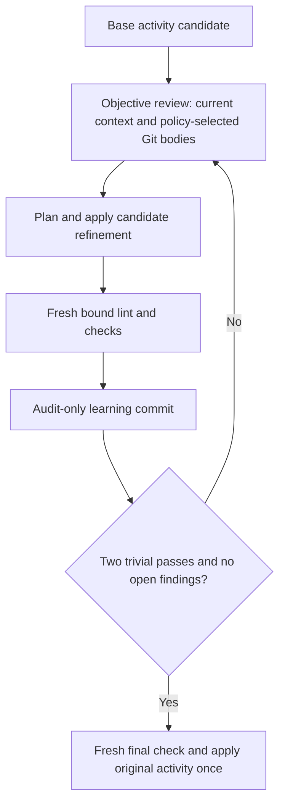

# Universal substantive-objective loop

ShipLoop applies this Markdown-backed loop to substantive approach, survey,
sequence, preparation-readiness, post-inner, coverage, quality, and versioned
handoff activities. Handoff requires both the objective and delivery-objective
protocol markers; an unmarked legacy handoff gains no retrospective certificate.
It complements, rather than replaces, the specialized research/behavior/spec
and per-step execution-plan loops.

The base activity first records a complete candidate; the script then routes to
`objective-review`, `objective-plan`, `objective-apply`, `objective-verify`,
`objective-commit`, and `objective-finalize`. Every review reads the current
policy-selected full commit bodies (seven for new runs, ten for unmarked legacy
runs, or all available), its bound current context, and the candidate. It records
a ten-part assessment: current context, implementation, environment,
dependencies, flows, edge conditions, second-order effects, implicit
requirements, test strategy, and documentation.

Two audited trivial passes with no open findings mean only that the candidate is
ready for a separate fresh final check. Any exact candidate byte change,
including whitespace-only changes, is conservatively material; only retaining
the exact persisted candidate can be trivial. This can require extra passes
because ShipLoop has no semantic-equivalence oracle. The loop never bypasses a
failing or blocked check, creates a max-cycle success route, or proves a remote
result. The finalizer applies the exact certified candidate once to its original
base activity.

The receipt, candidate, pass archive, full-body Git history, and certificate
live under `objectives/` in the run directory. A cold host pages only the
printed `objective` and `iteration` context sections; it does not reload older
passes or rely on a remembered answer.

Retained context within this same review-and-improve loop may help compare
work; every action must still be recoverable after a reset. The original output
is a candidate, not a quality verdict. Use the selected origin/assessment
evidence to distinguish earlier reviews from the current candidate. A repaired
epoch does not inherit current proof from remembered assessments.
The broader-purpose/spec reference explains why this objective matters to the
system; it is optional background unless selected as required evidence. It
does not authorize additional product changes or remote effects.

## Loop contract

The base stage writes one complete candidate before ShipLoop opens an objective
loop. The loop binds that candidate, its current context, Git baseline, and
ledger into Markdown. It then requires review, plan, apply, fresh verification,
an audit commit, and a fresh final verification. Two consecutive verified,
audited trivial passes with no open findings are a readiness condition, not a
success claim.

## Review rubric

Before `objective-review`, read the current candidate and bounded context plus
the full bodies of every current policy-required Git-history row. Assess current
context, implementation, environment, dependencies, flows, edge conditions,
second-order effects, implicit requirements, test strategy, and documentation.
Record stable finding IDs, concrete evidence or an applicability reason for
each assessment, expected-versus-observed test evidence, and a durable
learning. Older history may supplement the required current window but cannot
replace it. Follow bounded fragment continuations until each body is complete.

## Plan and apply

`objective-plan` addresses every and only open finding. `objective-apply`
submits a complete replacement result object, resolutions for every addressed
finding, test-impact evidence, and a learning. The host must first read the
persisted candidate: any byte change, including summary or whitespace, is
material. Only the exact persisted candidate may be retained for a trivial
pass. Objective work does not edit product files or perform external effects.

## Checks and commits

Run a fresh candidate-bound lint and test manifest at verification. Manifest
commands must use the current environment and directly read immutable selected
files; they must not invoke ShipLoop against the same run, which would wait on
the active run lock. An audit commit is a same-tree direct child of the bound
baseline and preserves unrelated index/worktree state. Its body includes
concrete `Review:`, `Changes:`, `Validation:`, and `Key learnings:` sections,
every recorded review/plan/apply learning verbatim, and the exact final
`ShipLoop-Iteration:` trailer for the current pass.

## Finalization and recovery

`objective-finalize` runs a fresh check against the ready, unchanged candidate
and applies that exact candidate once to its original base stage. It never
replaces a candidate, finding, plan, resolution, material flag, or DAG.

For ordinary context changes, `repair` may rebind an approach or survey objective
before frozen planning or active step work; it archives the interrupted pass
and starts a fresh objective review. A post-inner objective repair archives its pass, records a
material interrupted step iteration, clears stale final/merge proof, and returns
to Improve review. Other objective kinds cannot silently rebind changed frozen
context.

There is one narrow journal exception for any active substantive objective:
with the outer-work protocol enabled, if the only changed context binding is
the script-owned, state-bound outer-work journal, explicit `repair` can rebind
that journal, archive the interrupted pass, reset convergence, and issue fresh
`objective-review`. Candidate, findings, Git, and product inputs stay frozen.
The journal callback does not perform this restart automatically, and this
exception cannot bless other context drift.

Before execution, `revisit` may abandon an active survey, sequence, or
preparation-readiness objective while applying the normal planning archive
rules. During an active coverage or quality objective, `replan` is permitted
only for a corrective pending DAG step; it abandons the objective receipt and
schedules ordinary inner-loop work. Neither recovery path converts a defect,
drift, or incomplete candidate into success.
