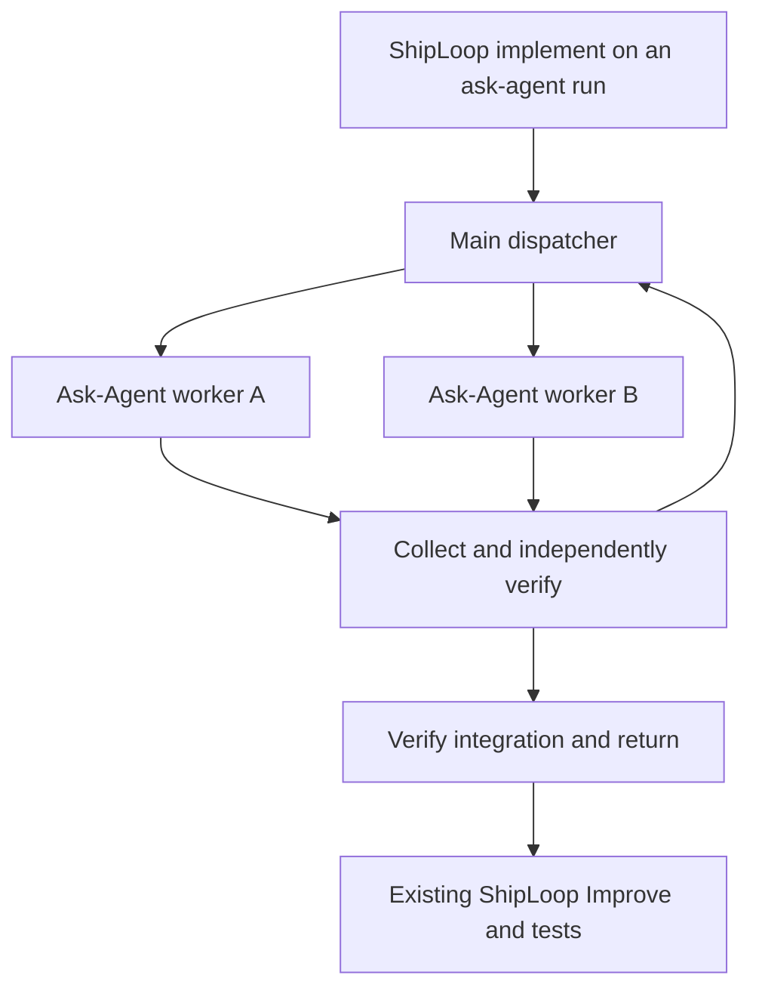

# Parallel implementation chains

Chains apply only to a run whose delegation is `ask-agent`: an opt-in new run,
a run switched with `python3 "$CLI" delegation --run-dir "$RUN_DIR" --set ask-agent`,
or a saved run without the setting. Under `delegation: inline`, the default for
new v3/v4 runs, `implement` executes the reviewed steps directly, one at a time
in dependency order, in the execution checkout, and `chain bind` refuses a fresh
binding before any side effect. Replaying an existing binding keeps its recorded
mode. See the [navigator delegation setting](navigator.md#run-it).

For a reviewed dependency graph with dependency-independent implementation work
**inside the current navigator-v3/v4 `implement` action**, use this parallel route
by default when selected compatible native capacity is available. The binding
remains explicit, action-scoped, and recoverable. ShipLoop retains one parent
action and its normal Improve/test sequence; the work-item queue remains
ordered. Existing runs are unchanged unless their current implementation action
is explicitly bound. Serial mode remains an explicit user or host-limit choice,
and a concrete compatibility, readiness, or resource blocker retains the
ordinary parent route.
New chains use only the managed per-step lifecycle. Fresh `final-return` and
Ask-Agent 0.4 bindings are rejected before state or workspace creation. Existing
pre-v6 bindings remain diagnostic evidence; preserve their workspaces and do not
resume the retired execution flow or switch a bound run in place. Ordinary
unbound navigator records retain their existing format.



## Bind the selected packages and reviewed graph

Use the exact selected Plan Dispatcher and Ask-Agent skill cards for every new
binding, including serial mode. Ask-Agent must be at least 0.6.0 and its selected
helper must expose `capabilities --skill-card ABSOLUTE_SKILL_CARD` and `identity`.
The capability response must declare the supported managed-workspace schema and
required preparation, inspection, commit-delivery and fingerprint-bound-close
capabilities. Markdown wording and a higher version number alone do not establish
compatibility. Compatible later versions use this same negotiated flow.

Binding schema v6 records this capability proof and the managed lifecycle for
both modes. Its schema number is independent of Ask-Agent's package version.
The binding freezes the workspace helper, execution references, selected card,
logical/resolved paths, version and hashes. Both modes use the helper's native
identity proof; missing capabilities or identity fail closed without a legacy
fallback. ShipLoop does not install the selected packages, search host skill
directories or silently choose a substitute. Plan Dispatcher requires Node.js;
ShipLoop uses its public helper for state operations, never a model subprocess
launcher. The parent launches native workers in parallel mode or executes the
bounded assignment in its main context in serial mode.

The graph is Plan Dispatcher's execution graph with direct `deps` and each
step's `contract.task`, `contract.ready` and `contract.done`. A reviewed Backchain
plan should use the selected Plan Orchestrator checkout's
`scripts/export-execution-graph.js`; a compatible legacy checkout can retain
`harness/dispatcher-plan.js`. Review the graph against the **current
implementation action's scope** before binding; do not submit the whole project's
SDLC as one implementation graph. Keep missing prerequisites explicit rather
than treating syntactic validation as a semantic readiness check.

### Planning-artifact handoff

For a new context-capable binding, inspect the read-only inventory first:

```sh
python3 "$CLI" chain planning-inputs --run-dir "$RUN_DIR" --action "$ACTION" --graph "$EXECUTION_GRAPH"
```

It lists accepted planning records, generated planning files, explicit local
references, URL-only references, and entries requiring a caller-supplied
resolution. Resolve only through its printed resolution input, then pass that
file to `chain bind --planning-resolutions ...`. The bridge writes one immutable
`chains/<action>/planning-artifacts.json` and deterministic `planning-brief.md`.
The brief provides key reference statements, decisions, constraints, acceptance
context, and relevant locators from the planning pass. It is supporting material,
not the original user prompt or a second task directive. The selected dispatch
step's `contract.task`, `contract.ready`, and `contract.done` are the sole worker
assignment.

The manifest records the raw reviewed graph identity and registered planning
artifacts as absolute local references plus SHA-256, role, producer,
classification, and `required_for` steps. It may register an external local
project file only when an accepted result or bound plan explicitly names it.
URLs are catalog references, not worker-readable material or proof of fetch.
An input expected to change during execution needs an explicit stable planning
snapshot. Never bind a whole mutable `state.md`, live dispatcher state, or a
directory hash as planning context.

For a new context-capable binding, `chain bind` first requires the selected
dispatcher to advertise `planning_context: "shiploop-planning-artifacts/v1"`
and `graph_validation: "execution-graph/v1"`. It asks that same selected helper
to validate the normalized graph through its run-free `validate-graph` command
before collecting planning artifacts or writing a manifest, binding, or
child-init intent. A rejected, unavailable, or malformed validation response
leaves the parent state and chain namespace unchanged, so a corrected graph can
be bound later. Existing bindings retain their frozen recovery contract and do
not gain this requirement during replay.

After that preflight, the bridge passes the same `{path,sha256,source}` reference
beside the unchanged graph to Plan Orchestrator `init`; the dispatcher retains it
in its authoritative run state and projects it into fresh and cold recovery
packets. The reference grants no claim, launch, successor, integration, or
completion authority.

### Required review after step creation

Create the chain's steps and dependency graph during `step-plan`, then include
the graph's exact path and content digest in its existing plan notes and
`evidence_refs`. The selected actual Improve skill must review those created
steps and the graph through its full improvement loop before `chain bind`, in
both parallel and serial mode. Use the existing planning handoff and its two
consecutive qualifying reviews; retain the terminal receipt and reviewed graph
identity in ordinary evidence. Backchain's dependency audit informs this review.

If the graph is first created or materially changed after that planning review,
keep it a draft and complete the selected actual Improve loop on the revised
plan before binding or dispatching it. Preserve the current parent action,
planning-only scope and the parent's commit/execution limits. Use an already
active Improve owner when it covers that candidate; otherwise invoke the selected
skill with those explicit bounds. Do not nest another review inside an active
Improve child. Reuse a completed review only for the unchanged graph it covered.
If review is blocked, stopped or unavailable, leave execution pending. For an
already bound graph, use its existing recovery/replanning boundary; never edit
the frozen binding in place.

The host verifies this review evidence; `bind` validates and freezes the graph.
Planning review checks dependencies, ready/done criteria, parallel paths, joins,
shared resources and verification ownership. It does not run the planned tasks.
Every planning producer and its Improve completion must retain each generated
planning file in ordinary `evidence_refs`. If an Improve `final_result` refines
the producer outcome, preserve earlier registered references and add the new
ones; the consolidated reference material cannot displace the source material it
uses.

The run directory and worker container must be external to all Git checkouts.
Use a clean, explicit initiating branch. In whole-run workspace mode the target
is ShipLoop's execution checkout, not its original source checkout.

```sh
python3 "$CLI" chain bind --run-dir "$RUN_DIR" --action "$ACTION" \
  --graph "$EXECUTION_GRAPH" \
  --dispatcher-skill "$DISPATCHER_SKILL" --ask-agent-skill "$ASK_AGENT_SKILL" \
  --worktree-parent "$EXTERNAL_PARENT/.work-trees/project" --capacity 2
python3 "$CLI" chain next --run-dir "$RUN_DIR" --action "$ACTION"
```

All variables above stand for actual absolute paths or the current printed
action ID. Bind `CLI` from this selected ShipLoop card as usual. Worker capacity
must not exceed native host availability. Each mutation uses a JSON file:

```sh
python3 "$CLI" chain claim --run-dir "$RUN_DIR" --action "$ACTION" --input "$REQUEST"
```

## Main-dispatcher operations

### Worker engineering guidance

For parallel execution, pass the complete returned worker packet inline to
Ask-Agent, including its `instructions`. For serial execution, use that complete
packet in the main context. Forwarding only `task` drops the engineering guidance. The
bridge adds package-local locators for the [coding decision guide](coding-guidance.md#select-guidance),
[repeatable test suites](repeatable-test-suites.md#select-or-revalidate-the-harness),
and [implementation constitution](testing-and-documentation.md#implementation-constitution)
to parallel, serial, and recovered worker packets. Read only applicable practice
and platform cards within the assigned contract. Return material discoveries, decision
rationale, actual checks and their limits, and unresolved uncertainty in the existing
manifest summary; use declared files for supporting detail. Identify the next
action/owner, and explicitly say when there are no new findings. Apply relevant
planning facts within the task; report a conflicting premise and its evidence
before affected work without changing the graph.

These are current-package references, not hash-frozen planning artifacts. The
worker must be able to read them from its own execution environment; a missing
required reference blocks work. They neither change the graph's task/ready/done
contract nor grant parent callbacks, scheduling, deployment, or a nested ShipLoop
or Improve cycle. The parent retains the existing post-chain Improve and test
stages. Packet delivery proves reference availability, not model adherence.

### Script-owned navigation

Every successful per-step flow operation returns `navigation` computed from the
selected dispatcher and bridge history. This is the skill's navigation authority;
the skill performs the requested work and reports facts, rather than traversing
dependencies or choosing its own next phase. `history` and `pending` remain
read-only inspection views, not execution instructions.

- `actions` names the permitted semantic actions and their existing script
  `operation` callbacks. For example, `action: launch` means call the native host,
  then report the actual handle through `operation: launched`; it is not a
  nonexistent `chain launch` command. `action: verify` means perform the requested
  independent checks before submitting evidence through `operation: done`.
- `next_argv` is the exact continuation to run after handling an action or when
  resuming. Pass its argument array without shell interpolation. Inside a bound
  chain it returns to the ShipLoop bridge, never directly to the selected Node
  helper. After recorded finish it returns to ShipLoop's parent navigation.
- `complete` is true only after the durable chain finish receipt exists. All
  steps being accepted can still require cleanup and final verification. The
  older top-level `complete` retains its graph-acceptance meaning.

Follow only current action identities. Every returned action with an `attempt`
also carries its authoritative `step`, derived from the selected dispatcher
state and checked against this binding's frozen graph. Correlate an out-of-order
native return or `done` result by the `(step, attempt)` pair. `step` is never
caller-supplied callback authority: submit the exact attempt and required
evidence, and let the bridge reject stale or mismatched state.

A claim action lists script-computed dependency-ready candidates and the bound
capacity available for claims. The
parent supplies actual readiness and host/resource availability, then claims and
starts every safe listed candidate up to that bound; it cannot add an unlisted
step or leave a safe native slot idle. Defer only a candidate with a concrete
recorded capacity, resource, readiness, or recovery blocker. Only the immediate
fresh start grant authorizes launch or first serial execution. Recovered packets
never grant a second launch. After every callback, use the newly returned
frontier rather than inferring successors from a remembered plan.

When binding parallel mode, set `--capacity` from the observed user or host
native-slot limit for this run. The CLI default of `2` is a fallback, not proof
that a larger safe capacity is unavailable. An independent branch can become
ready after an initial serial prefix; select the reviewed parallel chain for that
future capacity rather than requiring two initial roots.

Do available dispatch or verification work before waiting for a running worker.
Claim/start safe capacity before a potentially waiting reconciliation, preparation,
verification, or collection action; process a result that is already available
promptly, but do not let an unresolved observation idle an independent ready
worker.
When only collection remains, await any native completion or host notification;
the list order is not a required completion order. A paused parent suppresses
new claims and starts. A changed dispatcher owner blocks this binding's
callbacks until its ownership conflict is resolved.

Navigation is a derived response, not another state file. A cleanup failure
keeps an accepted step accepted and permits safe dependents to continue, but
prevents chain finish. Unknown native outcomes require reconciliation; elapsed
time and an empty ready list never authorize acceptance or completion.

| Operation | Request / meaning |
| --- | --- |
| `claim` | `{"steps":["A","B"]}` selects an eligible subset within capacity. |
| `start` | `attempt`, current `base_commit`, relative `write_scope`, canonical `resources`, and `ready_evidence:{path,sha256}`. Both modes prepare through the selected managed Ask-Agent helper and return its receipt with a native launch or main-context execute packet. Do not supply `workspace`; caller-prepared adoption is unsupported. |
| `launched` | `attempt`, actual native `handle`; record only after the host confirms launch. |
| `packet` | `attempt`; recover the existing packet, never a new launch grant. |
| `observe` | `attempt`, optional source `occurred_at`; append receipt observation after native collection. It does not accept the task. |
| `import-handoff` | `attempt`, `confirmed_stopped:true`, `handoff:{path,sha256}`; parent archives worker-local results and publishes the existing dispatcher report. |
| `prepare` | `attempt`, `confirmed_stopped:true`; inspect original contribution, reconcile current target into the stopped worker checkout, and return the exact combined candidate for independent checks. |
| `settle` | `attempt`, `confirmed_stopped:true`, candidate-bound `integration` and `verification:{receipt_sha256,passed,reason,evidence:{path,sha256}}`; verify, merge into the invoking checkout, accept and return the ready frontier. Managed cleanup is deferred in both execution modes. |
| `cleanup` | `attempt`, `confirmed_stopped:true`; close or retry accepted-worker removal after refilling safe capacity. Superseded managed attempts remain blocked and have no supported cleanup callback. Cleanup never executes the task again. |
| `done` | An alias for `settle` with the identical evidence contract; it invokes the same transition once. Rejected verification leaves the step not done. |
| `retry` | `attempt`, `confirmed_stopped:true`, `reason`; preserve failed evidence/worktree, then claim a fresh attempt. |
| `next` / `recover` | Inspect durable child state, bridge events and unresolved operations. No automatic relaunch. |
| `history` | No input file. Read the timestamped bridge audit in append sequence, including past indexed actions; no recovery or child invocation. |
| `pending` | No input file. List every unaccepted step with current status and unmet direct dependencies, plus capacity; no claim, launch or acceptance. |
| `finish` | Current integrated target `commit`, `confirmed_stopped:true`, and independent `verification:{path,sha256}`; require all contributions accepted, final combined verification and completed cleanup. Per-step mode has already merged each result; this is a final audit. |

Successful `done` evidence is a JSON object with `passed:true`, actual checks,
and `integration` containing the exact `source_commit`, `expected_target`,
`candidate_commit`, and `workspace` returned by `prepare`. These identify the
worker contribution W, current target T, and checked combination I. Copying only
the worker's checks cannot establish that the combined candidate works. If T
advances before `done`, run `prepare` and independent checks again for the new I.

The `finish` evidence is a JSON object with `passed:true`, `commit` equal to the
requested exact candidate, and the checks actually performed. The dispatcher
must establish that those checks passed; a matching hash alone does not do so.

Only a **fresh `start` response with `action: launch`** permits native launch.
Use the selected Ask Agent launch contract with the complete returned packet
unchanged, selected Git integration contract, ownership and return target.
Preserve available host capabilities within existing task authorization. Carry
applicable approvals, declines, pending and revoked decisions with their scope,
conditions and actual source through the existing authority contract, separately
from advisory learnings; pending decisions grant no authority.
Add a compact **Current learnings** block
with relevant parent discoveries, decisions and rationale, constraints, and open
questions; distinguish facts from hypotheses, or explicitly state none. Keep
essential facts inline and references for supporting detail. Use a fresh background
context with no inherited conversation where supported. Retain the effective
assignment in the existing parent record or retained handoff, durably outside the
worker workspace, alongside the attempt and actual handle,
and continue independent parent work. Recovery packets preserve the frozen task;
they neither reconstruct unrecorded conversational learnings nor authorize relaunch.
Follow the selected Ask-Agent waiting and result-collection guidance. A timeout,
file appearance or elapsed lease does not establish completion.

If host collection reports `TaskNotFound` or another unavailable handle, append
its timestamp/error with the original task, attempt, handle, and workspace receipt to
the existing parent-pending record and say `native status unavailable; cannot
attest stopped`. Preserve that attempt, its reservation and workspace. Do not
infer completion from files, relaunch, retry, import or clean it until its
original native identity, completion and stoppage are established. Continue
other safe ready work within remaining capacity.

In either managed execution mode, `start` calls the frozen Ask Agent workspace helper
to prepare and inspect one worktree in a dedicated attempt store. It persists
the preparation intent before that call and the receipt before granting native launch or main-context execution.
The launch packet contains the exact workspace, receipt, package identity, and
`check-context` command the native worker must execute before work. Filesystem
preparation is not native launch or completion evidence. In parallel mode the parent uses
the host's native delegation facility to run the worker asynchronously. In serial
mode the same receipt and context checks apply to its main-context assignment.
This is Ask-Agent preparation performed by its coordinating parent. Continue
with that exact receipt and package identity when launching; do not invoke a
second `prepare --source` flow or allocate another native worktree after `start`.
The frozen context workspace, receipt worktree and worker's observed Git root
must be the same workspace.

Both modes verify helper-owned sibling topology, exclusive ownership and the
invoking branch's latest recorded integrated HEAD. This chain requires a clean
target; generic Ask Agent independently supports staged, unstaged and untracked
caller snapshots. The chain does not silently stash or discard those changes.

If interrupted after managed helper preparation, replay reconciles exactly one
receipt in that attempt's frozen store and rechecks its prepared baseline.
An empty store can retry preparation; partial or multiple attempts require
explicit recovery and preserve existing workspaces. A changed source, store,
receipt, helper or prepared baseline blocks launch.
New parallel and serial allocations also bind the filesystem identities of the
workspace root and private Git directory. A cleanup request must preserve a
replacement worktree even if Git reuses its path, branch and commit. Older
per-step allocation records without this binding cannot authorize destructive
cleanup; retain those worktrees for explicit reconciliation. Do not manufacture
an ownership binding from the directory found during cleanup. This cooperative
identity check is not a security boundary against hostile filesystem changes.

Put objective, relevant inputs, ready/done criteria, ownership and output contract
directly in the native launch prompt. A saved packet is durable parent evidence,
not a prompt-file transport. Follow all selected Ask-Agent context, tool/model,
status and collection rules. Workers use their assigned workspace/scope, commit
code there, leave result/scratch files inside it, and return normally through the
native host. They never publish outside the checkout, call parent completion,
modify its ledger or claim successors.

The local handoff is `.shiploop-handoff/<attempt>/handoff.json` inside the worker
checkout. Use schema `shiploop-chain-handoff/v1` with `run_id`, `step`, `attempt`,
`base_commit`, actual `status`, exact `commit` (null for failed/blocked work),
`summary` and `files:[{path,sha256}]`. File paths are relative to the handoff
directory; declare every result/scratch file there. Keep code deliverables
committed outside that directory. Parent import preserves exact bytes and evidence references
in an external immutable archive, authors the dispatcher artifact/envelope, and
removes only preserved, unchanged, declared local temporary files. A link, path
escape, unknown file, wrong identity or digest blocks import without discarding
results. Only the parent invokes the dispatcher's external report API.
For a successful managed return, import first freezes the helper's `commits` delivery
inspection for the complete ordered base-to-worker range. It must end at the
handoff's exact worker commit. The parent then archives and removes the handoff
files before Git integration needs a clean workspace. Failed or blocked reports
are still imported with a null commit; they cannot be prepared or integrated.

The main dispatcher collects the worker and its delegates, checks its evidence,
then imports, prepares and independently checks the combined candidate.
A successful `done` merges into the invoking branch before settling the report,
then returns the newly ready frontier. For managed parallel and serial workers, cleanup
is deferred to the existing `cleanup` callback: fill safe launch capacity first,
then close accepted worktrees while workers run. `confirmed_stopped` is a caller attestation, not a
native cancellation or liveness detector. Accepted supplier commits and evidence
unlock direct dependents. Refresh readiness immediately after settlement;
independent work need not wait for an entire dependency wave. Resource keys are
cooperative reservations inside this run. MCP and CLI calls to the same writable
backend need the same key; worktrees do not isolate remote databases or accounts.

## Done means accepted

The selected dispatcher's `plan-dispatcher-state.json` is the one authoritative
runtime state file for every graph step, inside the binding's `dispatcher_run`:
`status: accepted` means done. Pending, claimed, executing, reported, rejected
and blocked steps are all **not done**. There is no second stored completion
boolean to synchronize. `completion.done` and `completion.not_done` in bridge
snapshots are derived lists; `completion` describes graph acceptance.
Existing runs with only the legacy `state.json` continue in that same file;
never copy or mirror it. If both names exist, stop and resolve the ambiguity
before proceeding. The run directory is outside the project checkout. This is
generated orchestration state, retained across interruptions and finish for
recovery and inspection until the run is explicitly disposed of. Immutable
bindings, result receipts and the append-only bridge ledger are configuration
and evidence, not independently editable copies of current step status.
The chain also exposes outstanding integration and cleanup work: accepted code
stays accepted if worktree removal fails. Such a failure cannot trigger task
reexecution and prevents final `finish` until cleanup is resolved.

Use `done` or `settle`, with the same exact attempt and verification receipt, to
record acceptance. An identical repeated completion is inert even after another
step progresses. A conflicting verification is an error; an obsolete attempt
cannot complete its replacement. A worker saying "done," a progress notice, or
a report file alone cannot accept the step or unlock a dependent.
An obsolete attempt cannot import new results, prepare a candidate or integrate
code after retry. Identical replay of the current accepted attempt remains inert.
An early completion cannot integrate until its native launch handle or serial
execution identity is recorded. A dispatcher takeover invalidates the old
binding's authority to mutate the chain, including start, import, prepare,
cleanup and finish. Refuse the old owner before creating or removing a worktree.

## Serial execution in the main context

During the implementation producer, the bound mode and recorded executor take
precedence over the navigator's generic producer context boundary, which for an
ask-agent run prefers a native fresh worker. This precedence
ends at producer completion: Improve follows its own selected context and ownership
policy even when the historical chain binding remains. Parallel chains retain their capacity and have no serial
reset wrapper. Serial chains do not spawn a fresh worker. If fresh context is
required, use only a real callable host reset with a recovery route, or the
[pause and operator handoff](navigator.md#packet-only-context-boundary).
Preserve the parent Recovery command and printed Chain recovery command; settle
or stop step-owned activity before clearing. Recover the same binding and
attempt, then follow its returned resume/reconcile action. Do not rebind, change
mode/executor or rerun `start` to obtain another execution grant. Printed `/clear`
text does not perform the host operation.

Bind a new chain with `--mode serial`; omit `--capacity` or set it to `1`.
Without `--mode`, a fresh binding uses `parallel`, which retains native
Ask-Agent execution, and a replay of an existing binding resolves to its
recorded mode. The mode is frozen for that chain; do not switch an existing
active chain in place.
Serial mode requires a selected Plan Dispatcher package with atomic
main-context `start.executor` support as well as the planning-context and graph
capabilities above. An older package
cannot silently emulate it with a fake native handle: it rejects `start` before
any execute grant. For each new serial attempt, the bridge prepares a sibling
Git worktree and records the main-context executor without a native handle.
Recovery reuses that attempt's workspace. The binding and
allocated workspace can remain for inspection; do not treat a successful bind as
serial capability qualification or edit the frozen package in place. Serial
mode launches no agents, but it still depends on both selected packages: `start`
calls the frozen Ask-Agent workspace helper to prepare and inspect each step
worktree, cleanup uses that helper's `close`, Ask-Agent supplies the shared Git
contribution reference, and Plan Dispatcher still owns claims and readiness.

```sh
python3 "$CLI" chain bind --run-dir "$RUN_DIR" --action "$ACTION" \
  --graph "$EXECUTION_GRAPH" --mode serial \
  --dispatcher-skill "$DISPATCHER_SKILL" --ask-agent-skill "$ASK_AGENT_SKILL" \
  --worktree-parent "$EXTERNAL_PARENT/.work-trees/project"
python3 "$CLI" chain next --run-dir "$RUN_DIR" --action "$ACTION"
```

The same main conversation follows the current `navigation.actions` and exact
`next_argv`, including claim, execute/resume, import, prepare, verify, cleanup,
and finish when offered. The raw `ready` list describes graph eligibility; it
is not a second scheduling authority. A fresh serial start records the
main-context executor and grants `execute` once. Recovery continues the recorded
attempt and workspace without a native launch or a second execution grant.

During the bounded task phase, use explicit command working directories in the
returned sibling worktree and obey the packet's readiness, scope, and resource
constraints. Write its self-contained handoff before returning to the parent
phase. `confirmed_stopped` means all step-owned commands have finished; the main
conversation remains active. The parent reads the imported summary and archived
evidence, retains relevant findings for recovery and later assignments, and
performs the returned verification action against the exact prepared candidate.
This is a distinct checking phase in the same context, not evidence of a separate
reviewer agent.

`done` integrates and accepts the verified contribution; worktree removal is a
separate returned `cleanup` action. Perform integration and cleanup from the
invoking checkout or an external directory. Follow the script's priority for
eligible work and cleanup, then its `finish` action after combined verification
and required cleanup. Only `navigation.complete` ends the chain; graph acceptance
or an empty `ready` list does not. Continue ShipLoop's enclosing callback and
subsequent stages. Preserve unresolved work and follow its returned recovery
action; do not busy-loop on an unchanged blocker.

Serial steps still use separate sibling worktrees. They are never created inside
the initiating worktree, and a dependency's accepted commit must be present in
the next step's starting revision.
No background dispatcher or model CLI runs this loop: the current main context
follows the returned actions. The mode applies to this bound implementation
chain, not to unrelated later skills' internal behavior.

## Observable status in the main conversation

Keep one compact pending record with step/attempt, actual execution identity,
assignment, dispatcher status, last observed work update and next action/owner.
Render combined notices on starts, meaningful observed changes, blockers, returns
and acceptance. Distinguish "worker returned; verification pending" from "done."
After recovery, derive done/not-done from dispatcher state and reconcile the
executor before claiming current liveness.

In parallel mode follow the selected Ask-Agent native status capability: worker
milestones only where a native parent-message route is exposed, and native timed
collection where available. If only completion notifications are available,
disclose the lack of periodic intermediate updates. Never infer semantic progress
from elapsed time, file appearance or a child UI pane. Native delivery may wait
for the parent to finish its current tool call. In serial mode the parent reports
its own observed work and checking results directly.

Progress annotations are advisory and must not mutate graph state. Reuse native
facilities and the existing pending/handoff record; do not add a watcher, timer,
message bus, heartbeat ledger or a second completion authority.

## Join and return

For new per-step chains, every worker starts from the current integrated target.
Independent workers may share an earlier base. After collection, `prepare`
merges the latest target into the stopped worker checkout; conflicts remain
there for bounded repair. The resulting candidate must contain both the original
worker commit and current target. Run affected combined checks against that
exact candidate, then `done` performs a guarded fast-forward into the invoking
checkout. If the target moved, reprepare and reverify. Clean textual merging is
not evidence that the combined behavior works.

Example: A/B start at H0. A is integrated and accepted; C starts from
that updated branch while B runs, then A's worktree is closed. B later reconciles against the advanced target,
so both changes survive. J waits for B and C acceptance and starts from their
combined result. Keep an explicit join for meaningful cross-component tests or
integration code, not merely to gather Git branches. `finish` verifies the final
result and confirms every owned worker worktree was removed.

Ask-Agent leaves returned workspaces intact. The parent archives required
results and confirms all worktree users/delegates stopped. For accepted managed
workers, the bridge obtains a new post-integration inspection and
fingerprint-bound acceptance, then invokes the owning helper's `close` command.
Before and after that inspection and before close, it proves the bound worker
still has the exact accepted candidate as HEAD, a clean index and working tree,
and no untracked or ignored extras. A late commit or file remains retained;
cleanup cannot attest that newly observed work was integrated. These checks also
apply when recovering a recorded inspection or close intent. Once removal has
already succeeded, the helper reconciles its durable close receipt.
This inspection deliberately omits commit delivery: the worker now contains the
combined integration commit, which can be a merge. The original worker delivery
evidence remains immutable. A durable close intent allows retry after removal
without creating a replacement workspace. A retained close stays cleanup-pending
and never undoes accepted code. Unknown edits/files, active Git
operations or remaining consumers block removal. The managed helper owns removal
only after these acceptance checks; the bridge does not bypass it. Retain branches as recovery references; deleting
them is a separate decision. Accepted-but-unremoved attempts appear as cleanup
work; `cleanup` retries removal without rerunning the step. Failed attempts stay
visible and preserve their workspace during `retry`. The managed adapter retains
superseded helper-owned workspaces because it has no accepted non-integrated close
disposition. This adapter cannot finish that chain even after the replacement
succeeds: it reports an attempt-bound blocker, not another cleanup callback, and
provides no completion-capable recovery route for that superseded workspace.
Preserve its receipt, results and worktree; do not bypass the receipt owner with
direct Git removal or claim final cleanup is complete. Ready replacement and
independent work remain visible before this finalization blocker.

All pre-v6 bindings, including earlier managed 0.6 bindings, are retained only for diagnostic
inspection. Their old execution callbacks cannot allocate, launch, integrate or
remove work under the new flow. Do not convert their binding or invent receipt
ownership for an existing directory. Preserve their evidence/workspaces and
prepare a newly reviewed managed chain when continuing the work.

Only after the chain finishes may the parent submit its normal current producer
result. ShipLoop then invokes its existing actual Improve checkpoint and later
tests. Improve may refine the returned candidate; completing the chain neither
replaces those stages nor authorizes publication or deployment.
Halting the parent is also refused while its bound chain is unfinished. Pause
is reversible and preserves the current action; collect/reconcile active workers
through the chain commands before resuming. Pause does not terminate workers.
New claims and starts wait for the parent to resume.

Cooperative chain returns share a target lock across target revalidation,
fast-forward and the final identity check. Returns refuse a busy or changed
target; retry only after inspecting the current target. The persistent lock lives
in the target's private Git directory. The merge child retains the lock if its
parent exits, until the child itself exits. This is an advisory lock for these helpers, not
a Git compare-and-swap or protection against manual Git commands that ignore it.
Keep manual target mutations outside the guarded return window.

## Append-only history and recovery

```sh
python3 "$CLI" chain history --run-dir "$RUN_DIR" --action "$ACTION"
python3 "$CLI" chain pending --run-dir "$RUN_DIR" --action "$ACTION"
```

Both views return JSON and accept an action ID still indexed in the run, even
after the navigator has advanced. They acquire the existing run lock for reading
and do not create files, append events, repair interruptions or dispatch work.
An unfinished parent transaction or interrupted event publication must first be
recovered explicitly through `chain recover` for the current action. An absent
or unsafe run lock, invalid binding or corrupt ledger makes the query fail.

`history` returns `sequence` (the event count) and `events` in append order. Each
row contains `event`, its `sha256`, and a diagnostic file `path`; the event keeps
its `seq`, `event_id`, `kind`, `recorded_at`, optional `occurred_at`, and `data`.
It reads the indexed binding and audit without invoking the selected dispatcher,
so it remains usable after child evidence or selected skill files move or change.
It does not return a live completion judgment, reconstruct child state, or prove
that a recorded intent succeeded. Full history is an explicit diagnostic view;
do not insert it into every execution packet.

`pending` derives one current snapshot from the selected dispatcher's validated
`next` response. It returns `revision`, `ready` IDs, `completion`, `complete`,
`parent_status`, `capacity:{limit,reserved,available}`, and `pending` entries in
graph order. Each entry has `id`, `task`, `deps`, `status`, `waiting_for`, `attempt`
and `recovery` (the latter two are null without an attempt). Accepted steps are
excluded. Status is `ready` or `waiting` for unclaimed work, or the observed
attempt status: `claimed`, `launching`, `running`, `receipt` or `rejected`.
`waiting_for` lists only direct suppliers that are not accepted, including
suppliers blocked by an earlier failure. Receipt and rejected states remain
pending until verification accepts the result or an explicit retry resets it.
Reserved capacity includes rejected attempts awaiting that retry.

For `A -> C`, with independent B, initially A/B are ready and C waits for A.
While A runs or has only reported, it remains pending and C still waits. After
A is accepted, A disappears and C becomes ready. Ready means dependency-ready;
parent pause, capacity, resources and definition-of-ready evidence still apply.
An empty list means all child steps are accepted, not that `chain finish` or the
parent's Improve/tests have completed. Unlike history, pending requires the
selected graph/package and live child evidence to remain valid.

`state.md` retains the binding's action locator/digest. The binding freezes the
graph, selected package bytes and target identity. Plan Dispatcher's child state
remains authoritative for claims and readiness. `chains/<action>/events/` holds
immutable Markdown event files with sequence, UTC `recorded_at` and optional
source `occurred_at`. Corrections and reconciliation append new records. Never
re-sort published entries by timestamp. Derived views do not replace either
parent or child authority.

Bridge intents precede mutations. If interrupted, use `chain recover`, inspect
the recorded child/native/Git state and follow the returned recovery boundary.
A lost launch response remains uncertain even if a handle was never saved. Do
not replay the event log as native execution or steal a lock based on age.
A Git commit or clean receipt import alone cannot establish task completion.

Missing/drifted binding, selected package, graph, evidence or target identity
blocks progress. Preserve incomplete initialization, unresolved attempts and
their worktrees. Successful managed acceptance schedules owned cleanup; failures retain the
workspace and a recovery action. No force reset, stash, push or background
service is provided. The local process-crash contract does not establish
power-loss/NFS durability, hostile-process isolation or cross-session native
handle recovery. Tests using synthetic native handles prove orchestration
mechanics only; live host evidence is a separate qualification.
