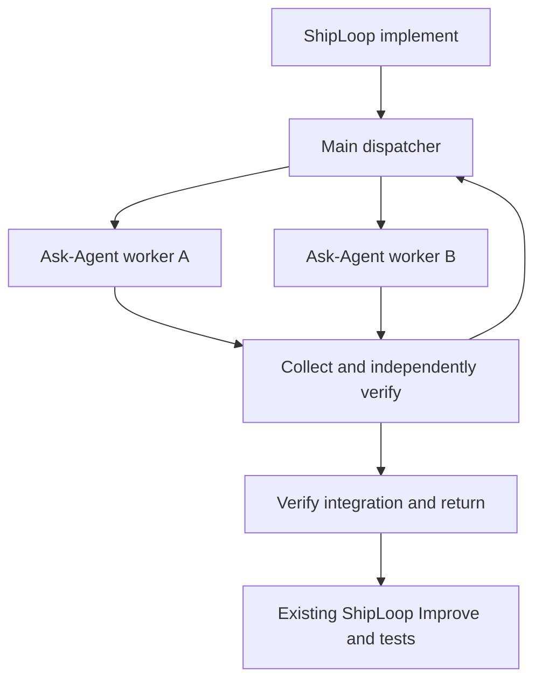

# Parallel implementation chains

Use this optional route in parallel or serial mode for a reviewed dependency graph **inside the current
navigator-v3 `implement` action**. ShipLoop retains one parent action and its
normal Improve/test sequence. The work-item queue remains ordered. Existing runs
are unchanged unless their current implementation action is explicitly bound.
New chains use the per-step lifecycle in ShipLoop 0.18.0. Existing v1/v2 chain
bindings retain their final-return behavior; `--lifecycle final-return` explicitly
selects that legacy contract. Never switch a bound run in place. Ordinary
unbound navigator records retain their existing format.



## Bind the selected packages and reviewed graph

Use the exact selected Plan Dispatcher and Ask-Agent 0.4 skill cards. ShipLoop does
not install them, search host skill directories or silently choose a substitute.
Plan Dispatcher requires Node.js; ShipLoop uses its public helper for state
operations, never a model subprocess launcher. The parent invokes Ask-Agent
through the host's available native delegation tools.

The graph is Plan Dispatcher's execution graph with direct `deps` and each
step's `contract.task`, `contract.ready` and `contract.done`. A reviewed Backchain
plan can be converted with its checkout utility `harness/dispatcher-plan.js`.
Review the graph against the **current implementation action's scope** before
binding; do not submit the whole project's SDLC as one implementation graph.
Keep missing prerequisites explicit rather than treating syntactic validation
as a semantic readiness check.

### Planning-artifact handoff

For a new context-capable binding, inspect the read-only inventory first:

```sh
python3 "$CLI" chain planning-inputs --run-dir "$RUN_DIR" --action "$ACTION" --graph "$EXECUTION_GRAPH"
```

It lists accepted planning records, generated planning files, explicit local
references, URL-only references, and entries requiring a caller-supplied
resolution. Resolve only through its printed resolution input, then pass that
file to `chain bind --planning-resolutions ...`. The bridge writes one immutable
`chains/<action>/planning-artifacts.json` and deterministic `planning-brief.md`.
The brief provides key reference statements, decisions, constraints, acceptance
context, and relevant locators from the planning pass. It is supporting material,
not the original user prompt or a second task directive. The selected dispatch
step's `contract.task`, `contract.ready`, and `contract.done` are the sole worker
assignment.

The manifest records the raw reviewed graph identity and registered planning
artifacts as absolute local references plus SHA-256, role, producer,
classification, and `required_for` steps. It may register an external local
project file only when an accepted result or bound plan explicitly names it.
URLs are catalog references, not worker-readable material or proof of fetch.
An input expected to change during execution needs an explicit stable planning
snapshot. Never bind a whole mutable `state.md`, live dispatcher state, or a
directory hash as planning context.

For a new context-capable binding, `chain bind` first requires the selected
dispatcher to advertise both `planning_context` and
`graph_validation: "execution-graph/v1"`. It asks that same selected helper to
validate the normalized graph through its run-free `validate-graph` command
before collecting planning artifacts or writing a manifest, binding, or
child-init intent. A rejected, unavailable, or malformed validation response
leaves the parent state and chain namespace unchanged, so a corrected graph can
be bound later. Existing bindings retain their frozen recovery contract and do
not gain this requirement during replay.

After that preflight, the bridge passes the same `{path,sha256,source}` reference
beside the unchanged graph to Plan Orchestrator `init`; the dispatcher retains it
in its authoritative run state and projects it into fresh and cold recovery
packets. The reference grants no claim, launch, successor, integration, or
completion authority.

### Required review after step creation

Create the chain's steps and dependency graph during `step-plan`, then include
the graph's exact path and content digest in its existing plan notes and
`evidence_refs`. The selected actual Improve skill must review those created
steps and the graph through its full improvement loop before `chain bind`, in
both parallel and serial mode. Use the existing planning handoff and its two
consecutive qualifying reviews; retain the terminal receipt and reviewed graph
identity in ordinary evidence. Backchain's dependency audit informs this review.

If the graph is first created or materially changed after that planning review,
keep it a draft and complete the selected actual Improve loop on the revised
plan before binding or dispatching it. Preserve the current parent action,
planning-only scope and the parent's commit/execution limits. Use an already
active Improve owner when it covers that candidate; otherwise invoke the selected
skill with those explicit bounds. Do not nest another review inside an active
Improve child. Reuse a completed review only for the unchanged graph it covered.
If review is blocked, stopped or unavailable, leave execution pending. For an
already bound graph, use its existing recovery/replanning boundary; never edit
the frozen binding in place.

The host verifies this review evidence; `bind` validates and freezes the graph.
Planning review checks dependencies, ready/done criteria, parallel paths, joins,
shared resources and verification ownership. It does not run the planned tasks.
Every planning producer and its Improve completion must retain each generated
planning file in ordinary `evidence_refs`. If an Improve `final_result` refines
the producer outcome, preserve earlier registered references and add the new
ones; the consolidated reference material cannot displace the source material it
uses.

The run directory and worker container must be external to all Git checkouts.
Use a clean, explicit initiating branch. In whole-run workspace mode the target
is ShipLoop's execution checkout, not its original source checkout.

```sh
python3 "$CLI" chain bind --run-dir "$RUN_DIR" --action "$ACTION" \
  --graph "$EXECUTION_GRAPH" \
  --dispatcher-skill "$DISPATCHER_SKILL" --ask-agent-skill "$ASK_AGENT_SKILL" \
  --worktree-parent "$EXTERNAL_PARENT/.work-trees/project" --capacity 2
python3 "$CLI" chain next --run-dir "$RUN_DIR" --action "$ACTION"
```

All variables above stand for actual absolute paths or the current printed
action ID. Bind `CLI` from this selected ShipLoop card as usual. Worker capacity
must not exceed native host availability. Each mutation uses a JSON file:

```sh
python3 "$CLI" chain claim --run-dir "$RUN_DIR" --action "$ACTION" --input "$REQUEST"
```

## Main-dispatcher operations

### Script-owned navigation

Every successful per-step flow operation returns `navigation` computed from the
selected dispatcher and bridge history. This is the skill's navigation authority;
the skill performs the requested work and reports facts, rather than traversing
dependencies or choosing its own next phase. `history` and `pending` remain
read-only inspection views, not execution instructions.

- `actions` names the permitted semantic actions and their existing script
  `operation` callbacks. For example, `action: launch` means call the native host,
  then report the actual handle through `operation: launched`; it is not a
  nonexistent `chain launch` command. `action: verify` means perform the requested
  independent checks before submitting evidence through `operation: done`.
- `next_argv` is the exact continuation to run after handling an action or when
  resuming. Pass its argument array without shell interpolation. Inside a bound
  chain it returns to the ShipLoop bridge, never directly to the selected Node
  helper. After recorded finish it returns to ShipLoop's parent navigation.
- `complete` is true only after the durable chain finish receipt exists. All
  steps being accepted can still require cleanup and final verification. The
  older top-level `complete` retains its graph-acceptance meaning.

Follow only current action identities. A claim action lists script-computed
dependency-ready candidates and the bound capacity available for claims. The
parent supplies actual readiness and host/resource availability and may defer a
candidate; it cannot add an unlisted step. Only the immediate fresh start grant
authorizes launch or first serial execution. Recovered packets never grant a
second launch. After accepted completion, use the newly returned frontier rather
than inferring successors from a remembered plan.

Do available dispatch or verification work before waiting for a running worker.
When only collection remains, await any native completion or host notification;
the list order is not a required completion order. A paused parent suppresses
new claims and starts. A changed dispatcher owner blocks this binding's
callbacks until its ownership conflict is resolved.

Navigation is a derived response, not another state file. A cleanup failure
keeps an accepted step accepted and permits safe dependents to continue, but
prevents chain finish. Unknown native outcomes require reconciliation; elapsed
time and an empty ready list never authorize acceptance or completion.

| Operation | Request / meaning |
| --- | --- |
| `claim` | `{"steps":["A","B"]}` selects an eligible subset within capacity. |
| `start` | `attempt`, current `base_commit`, relative `write_scope`, canonical `resources`, and `ready_evidence:{path,sha256}`. In parallel mode, without `workspace`, returns `prepare-workspace` without creating anything. Ask-Agent creates its worktree; resubmit with its absolute `workspace` for verified adoption and a launch packet. Serial mode allocates its own sibling workspace. |
| `launched` | `attempt`, actual native `handle`; record only after the host confirms launch. |
| `packet` | `attempt`; recover the existing packet, never a new launch grant. |
| `observe` | `attempt`, optional source `occurred_at`; append receipt observation after native collection. It does not accept the task. |
| `import-handoff` | `attempt`, `confirmed_stopped:true`, `handoff:{path,sha256}`; parent archives worker-local results and publishes the existing dispatcher report. |
| `prepare` | `attempt`, `confirmed_stopped:true`; inspect original contribution, reconcile current target into the stopped worker checkout, and return the exact combined candidate for independent checks. |
| `settle` | `attempt`, `confirmed_stopped:true`, candidate-bound `integration` and `verification:{receipt_sha256,passed,reason,evidence:{path,sha256}}`; verify, merge into the invoking checkout, accept, then remove the worker worktree. |
| `cleanup` | `attempt`, `confirmed_stopped:true`; retry accepted-worker removal only. For a retired failed attempt add `disposition:"superseded"` and nonempty `reason`; its replacement must already be accepted and integrated. Neither form executes the task again. |
| `done` | An alias for `settle` with the identical evidence contract; it invokes the same transition once. Rejected verification leaves the step not done. |
| `retry` | `attempt`, `confirmed_stopped:true`, `reason`; preserve failed evidence/worktree, then claim a fresh attempt. |
| `next` / `recover` | Inspect durable child state, bridge events and unresolved operations. No automatic relaunch. |
| `history` | No input file. Read the timestamped bridge audit in append sequence, including past indexed actions; no recovery or child invocation. |
| `pending` | No input file. List every unaccepted step with current status and unmet direct dependencies, plus capacity; no claim, launch or acceptance. |
| `finish` | Current integrated target `commit`, `confirmed_stopped:true`, and independent `verification:{path,sha256}`; require all contributions accepted, final combined verification and completed cleanup. Per-step mode has already merged each result; this is a final audit. |

Successful `done` evidence is a JSON object with `passed:true`, actual checks,
and `integration` containing the exact `source_commit`, `expected_target`,
`candidate_commit`, and `workspace` returned by `prepare`. These identify the
worker contribution W, current target T, and checked combination I. Copying only
the worker's checks cannot establish that the combined candidate works. If T
advances before `done`, run `prepare` and independent checks again for the new I.

The `finish` evidence is a JSON object with `passed:true`, `commit` equal to the
requested exact candidate, and the checks actually performed. The dispatcher
must establish that those checks passed; a matching hash alone does not do so.

Only a **fresh `start` response with `action: launch`** permits native launch.
Give Ask-Agent the complete packet, selected Git integration contract, ownership
and return target. Use a fresh background context with no inherited conversation
where supported, retain the actual handle, and continue independent parent work.
Follow the selected Ask-Agent waiting and result-collection guidance. A timeout,
file appearance or elapsed lease does not establish completion.

Ask-Agent owns creation of the worker branch/worktree. The bridge registers the
actual workspace and exact starting revision, verifies sibling topology and
exclusive ownership, and never creates a second parallel checkout. The starting
revision is the invoking branch's latest recorded integrated HEAD. First-version
chain execution requires a clean target; it does not silently stash or discard
changes to emulate generic Ask-Agent's broader dirty-snapshot capability.
New parallel and serial allocations also bind the filesystem identities of the
workspace root and private Git directory. A cleanup request must preserve a
replacement worktree even if Git reuses its path, branch and commit. Older
per-step allocation records without this binding cannot authorize destructive
cleanup; retain those worktrees for explicit reconciliation. Do not manufacture
an ownership binding from the directory found during cleanup. This cooperative
identity check is not a security boundary against hostile filesystem changes.

Put objective, relevant inputs, ready/done criteria, ownership and output contract
directly in the native launch prompt. A saved packet is durable parent evidence,
not a prompt-file transport. Follow all selected Ask-Agent context, tool/model,
status and collection rules. Workers use their assigned workspace/scope, commit
code there, leave result/scratch files inside it, and return normally through the
native host. They never publish outside the checkout, call parent completion,
modify its ledger or claim successors.

The local handoff is `.shiploop-handoff/<attempt>/handoff.json` inside the worker
checkout. Use schema `shiploop-chain-handoff/v1` with `run_id`, `step`, `attempt`,
`base_commit`, actual `status`, exact `commit` (null for failed/blocked work),
`summary` and `files:[{path,sha256}]`. File paths are relative to the handoff
directory; declare every result/scratch file there. Keep code deliverables
committed outside that directory. Parent import preserves exact bytes and evidence references
in an external immutable archive, authors the dispatcher artifact/envelope, and
removes only preserved, unchanged, declared local temporary files. A link, path
escape, unknown file, wrong identity or digest blocks import without discarding
results. Only the parent invokes the dispatcher's external report API.

The main dispatcher collects the worker and its delegates, checks its evidence,
then imports, prepares and independently checks the combined candidate.
A successful `done` merges into the invoking branch before settling the report,
then removes the registered worker worktree after its consumers have stopped. `confirmed_stopped` is a caller attestation, not a
native cancellation or liveness detector. Accepted supplier commits and evidence
unlock direct dependents. Refresh readiness immediately after settlement;
independent work need not wait for an entire dependency wave. Resource keys are
cooperative reservations inside this run. MCP and CLI calls to the same writable
backend need the same key; worktrees do not isolate remote databases or accounts.

## Done means accepted

The selected dispatcher's `plan-dispatcher-state.json` is the one authoritative
runtime state file for every graph step, inside the binding's `dispatcher_run`:
`status: accepted` means done. Pending, claimed, executing, reported, rejected
and blocked steps are all **not done**. There is no second stored completion
boolean to synchronize. `completion.done` and `completion.not_done` in bridge
snapshots are derived lists; `completion` describes graph acceptance.
Existing runs with only the legacy `state.json` continue in that same file;
never copy or mirror it. If both names exist, stop and resolve the ambiguity
before proceeding. The run directory is outside the project checkout. This is
generated orchestration state, retained across interruptions and finish for
recovery and inspection until the run is explicitly disposed of. Immutable
bindings, result receipts and the append-only bridge ledger are configuration
and evidence, not independently editable copies of current step status.
The chain also exposes outstanding integration and cleanup work: accepted code
stays accepted if worktree removal fails. Such a failure cannot trigger task
reexecution and prevents final `finish` until cleanup is resolved.

Use `done` or `settle`, with the same exact attempt and verification receipt, to
record acceptance. An identical repeated completion is inert even after another
step progresses. A conflicting verification is an error; an obsolete attempt
cannot complete its replacement. A worker saying "done," a progress notice, or
a report file alone cannot accept the step or unlock a dependent.
An obsolete attempt cannot import new results, prepare a candidate or integrate
code after retry. Identical replay of the current accepted attempt remains inert.
An early completion cannot integrate until its native launch handle or serial
execution identity is recorded. A dispatcher takeover invalidates the old
binding's authority to mutate the chain, including start, import, prepare,
cleanup and finish. Refuse the old owner before creating or removing a worktree.

## Serial execution in the main context

Bind a new chain with `--mode serial`; omit `--capacity` or set it to `1`.
`--mode parallel` is the default and retains native Ask-Agent execution. The
mode is frozen for that chain; do not switch an existing active chain in place.
Serial mode requires a selected Plan Dispatcher package with atomic
main-context `start.executor` support (the 0.1.1 candidate). An older package
cannot silently emulate it with a fake native handle: it rejects `start` before
any execute grant. The binding and allocated workspace can remain for inspection;
do not treat a successful bind as serial capability qualification or edit the
frozen package in place. The selected Ask-Agent package still supplies the shared
Git contribution reference, but serial chain execution does not invoke Ask-Agent.

```sh
python3 "$CLI" chain bind --run-dir "$RUN_DIR" --action "$ACTION" \
  --graph "$EXECUTION_GRAPH" --mode serial \
  --dispatcher-skill "$DISPATCHER_SKILL" --ask-agent-skill "$ASK_AGENT_SKILL" \
  --worktree-parent "$EXTERNAL_PARENT/.work-trees/project"
python3 "$CLI" chain next --run-dir "$RUN_DIR" --action "$ACTION"
```

The same main context performs this loop:

1. Read `next`. Choose one readiness- and resource-eligible step from `ready`;
   roots become eligible first. A dependent waits until every direct supplier is
   accepted. Graph order is a stable tie-breaker, not an extra dependency.
2. Claim that step and call `start` with its exact inputs. A fresh serial start
   atomically records the main-context executor and returns `action: execute`,
   not a native launch grant. No separate launch confirmation is needed.
   Replayed starts return reconciliation, never a second execution grant.
   Serial creation records its intended workspace before Git creates it. If
   interrupted before adoption, resume only that recorded clean baseline and
   matching start inputs; preserve an ambiguous allocation rather than creating
   another worker or silently abandoning it.
3. Execute in the returned sibling worktree using explicit working directories.
   Do not spawn agents or move work into the initiating checkout. Keep readiness,
   scope, supplier ancestry and resource constraints. Update the main conversation
   from the work actually performed.
4. Write the worker-local handoff, then use parent `import-handoff` and `prepare`.
   Perform a separate verification phase against the definition of done and
   record actual checks. This is evidence verification by the main context;
   it does not claim an independent reviewer agent. Confirm all step-owned
   commands have stopped, then call `done`/`settle` with the bound integration and verification.
   It merges, accepts and removes the step worktree in that order.
   `confirmed_stopped` refers to that step's activity, not the main conversation.
   Invoke parent integration/cleanup commands from the invoking checkout or an
   external directory, not from a worker directory that will be removed.
5. Re-read `next` and continue immediately with remaining eligible work. Do not
   end successfully after one step or merely because `ready` is empty. An active
   attempt requires continuation/reconciliation; a blocker requires resolution
   or an explicit incomplete handoff. Do not busy-loop on an unchanged blocker.
6. After every required step is accepted, verify the combined candidate and call
   `finish` to audit the current invoking checkout and completed cleanup. Continue ShipLoop's
   normal completion callback and subsequent Improve/test stages.

Serial steps still use separate sibling worktrees. They are never created inside
the initiating worktree, and a dependency's accepted commit must be present in
the next step's starting revision.
No background dispatcher or model CLI runs this loop: the current main context
follows the returned actions. The mode applies to this bound implementation
chain, not to unrelated later skills' internal behavior.

## Observable status in the main conversation

Keep one compact pending record with step/attempt, actual execution identity,
assignment, dispatcher status, last observed work update and next action/owner.
Render combined notices on starts, meaningful observed changes, blockers, returns
and acceptance. Distinguish "worker returned; verification pending" from "done."
After recovery, derive done/not-done from dispatcher state and reconcile the
executor before claiming current liveness.

In parallel mode follow the selected Ask-Agent native status capability: worker
milestones only where a native parent-message route is exposed, and native timed
collection where available. If only completion notifications are available,
disclose the lack of periodic intermediate updates. Never infer semantic progress
from elapsed time, file appearance or a child UI pane. Native delivery may wait
for the parent to finish its current tool call. In serial mode the parent reports
its own observed work and checking results directly.

Progress annotations are advisory and must not mutate graph state. Reuse native
facilities and the existing pending/handoff record; do not add a watcher, timer,
message bus, heartbeat ledger or a second completion authority.

## Join and return

For new per-step chains, every worker starts from the current integrated target.
Independent workers may share an earlier base. After collection, `prepare`
merges the latest target into the stopped worker checkout; conflicts remain
there for bounded repair. The resulting candidate must contain both the original
worker commit and current target. Run affected combined checks against that
exact candidate, then `done` performs a guarded fast-forward into the invoking
checkout. If the target moved, reprepare and reverify. Clean textual merging is
not evidence that the combined behavior works.

Example: A/B start at H0. A is integrated, accepted and removed; C starts from
that updated branch while B runs. B later reconciles against the advanced target,
so both changes survive. J waits for B and C acceptance and starts from their
combined result. Keep an explicit join for meaningful cross-component tests or
integration code, not merely to gather Git branches. `finish` verifies the final
result and confirms every owned worker worktree was removed.

Ask-Agent leaves returned workspaces intact. The parent archives required
results, confirms all worktree users/delegates stopped, and removes the exact
registered worker with `git worktree remove`. Unknown edits/files, active Git
operations or remaining consumers block removal. There is no automatic force,
reset or recursive deletion. Retain branches as recovery references; deleting
them is a separate decision. Accepted-but-unremoved attempts appear as cleanup
work; `cleanup` retries removal without rerunning the step. Failed attempts stay
visible and preserve their workspace during `retry`. After a replacement is
accepted and integrated, explicit `cleanup` with `disposition:"superseded"` and
a reason retires the old clean worktree. It requires the old handoff archive,
preserves the old branch commit, and never merges rejected code. Dirty or
unpreserved failed work remains a blocker. Archive bytes are revalidated before
use and final audit, including after the source workspace has been removed.

Existing v1/v2 bindings use the legacy frozen-target lifecycle: contributions
are accepted without intermediate target updates; an explicit integration node
can gather exact supplier commits, and `finish` returns the combined candidate
once. Retained old evidence does not qualify the new per-step lifecycle.

Only after the chain finishes may the parent submit its normal current producer
result. ShipLoop then invokes its existing actual Improve checkpoint and later
tests. Improve may refine the returned candidate; completing the chain neither
replaces those stages nor authorizes publication or deployment.
Halting the parent is also refused while its bound chain is unfinished. Pause
is reversible and preserves the current action; collect/reconcile active workers
through the chain commands before resuming. Pause does not terminate workers.
New claims and starts wait for the parent to resume.

Cooperative chain returns share a target lock across target revalidation,
fast-forward and the final identity check. Returns refuse a busy or changed
target; retry only after inspecting the current target. The persistent lock lives
in the target's private Git directory. The merge child retains the lock if its
parent exits, until the child itself exits. This is an advisory lock for these helpers, not
a Git compare-and-swap or protection against manual Git commands that ignore it.
Keep manual target mutations outside the guarded return window.

## Append-only history and recovery

```sh
python3 "$CLI" chain history --run-dir "$RUN_DIR" --action "$ACTION"
python3 "$CLI" chain pending --run-dir "$RUN_DIR" --action "$ACTION"
```

Both views return JSON and accept an action ID still indexed in the run, even
after the navigator has advanced. They acquire the existing run lock for reading
and do not create files, append events, repair interruptions or dispatch work.
An unfinished parent transaction or interrupted event publication must first be
recovered explicitly through `chain recover` for the current action. An absent
or unsafe run lock, invalid binding or corrupt ledger makes the query fail.

`history` returns `sequence` (the event count) and `events` in append order. Each
row contains `event`, its `sha256`, and a diagnostic file `path`; the event keeps
its `seq`, `event_id`, `kind`, `recorded_at`, optional `occurred_at`, and `data`.
It reads the indexed binding and audit without invoking the selected dispatcher,
so it remains usable after child evidence or selected skill files move or change.
It does not return a live completion judgment, reconstruct child state, or prove
that a recorded intent succeeded. Full history is an explicit diagnostic view;
do not insert it into every execution packet.

`pending` derives one current snapshot from the selected dispatcher's validated
`next` response. It returns `revision`, `ready` IDs, `completion`, `complete`,
`parent_status`, `capacity:{limit,reserved,available}`, and `pending` entries in
graph order. Each entry has `id`, `task`, `deps`, `status`, `waiting_for`, `attempt`
and `recovery` (the latter two are null without an attempt). Accepted steps are
excluded. Status is `ready` or `waiting` for unclaimed work, or the observed
attempt status: `claimed`, `launching`, `running`, `receipt` or `rejected`.
`waiting_for` lists only direct suppliers that are not accepted, including
suppliers blocked by an earlier failure. Receipt and rejected states remain
pending until verification accepts the result or an explicit retry resets it.
Reserved capacity includes rejected attempts awaiting that retry.

For `A -> C`, with independent B, initially A/B are ready and C waits for A.
While A runs or has only reported, it remains pending and C still waits. After
A is accepted, A disappears and C becomes ready. Ready means dependency-ready;
parent pause, capacity, resources and definition-of-ready evidence still apply.
An empty list means all child steps are accepted, not that `chain finish` or the
parent's Improve/tests have completed. Unlike history, pending requires the
selected graph/package and live child evidence to remain valid.

`state.md` retains the binding's action locator/digest. The binding freezes the
graph, selected package bytes and target identity. Plan Dispatcher's child state
remains authoritative for claims and readiness. `chains/<action>/events/` holds
immutable Markdown event files with sequence, UTC `recorded_at` and optional
source `occurred_at`. Corrections and reconciliation append new records. Never
re-sort published entries by timestamp. Derived views do not replace either
parent or child authority.

Bridge intents precede mutations. If interrupted, use `chain recover`, inspect
the recorded child/native/Git state and follow the returned recovery boundary.
A lost launch response remains uncertain even if a handle was never saved. Do
not replay the event log as native execution or steal a lock based on age.
A Git commit or clean receipt import alone cannot establish task completion.

Missing/drifted binding, selected package, graph, evidence or target identity
blocks progress. Preserve incomplete initialization, unresolved attempts and
their worktrees. Successful per-step acceptance attempts owned cleanup; failures retain the
workspace and a recovery action. No force reset, stash, push or background
service is provided. The local process-crash contract does not establish
power-loss/NFS durability, hostile-process isolation or cross-session native
handle recovery. Tests using synthetic native handles prove orchestration
mechanics only; live host evidence is a separate qualification.
