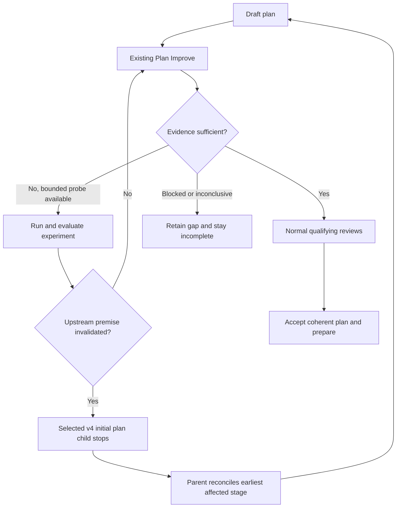

# Experiments during planning

Navigator v4 is an explicit new-run pilot. Select `--protocol-version 4` on
`workspace start`, or `--navigator-version 4` on `init`. Existing runs keep their
saved protocol; the default remains v3. Follow the current packet rather than
retrofitting this guide onto an active older run.

Lifecycle and owner rules remain in the
[navigator execution mode adapter](research-loop.md#navigator-execution-mode-adapter).
This planning-specific duty applies only to v4's initial bound Plan Improve
child using the selected ephemeral runtime, after its one valid producer
submission has parked the parent. Plan Improve screens the
provisional plan for consequential uncertainty and may conduct a worthwhile
experiment only when it could materially change a plan/consumer decision or
establish whether that consumer may proceed. Early research still answers
questions visible before a plan exists. No additional experiment phase, nested
loop, or dispatcher is introduced.

A finding can change the plan, confirm it, or leave a material question open.
Only the first two can support readiness. A valid confirmation is exported by
adding its decision-note evidence locator to the existing
`final_result.evidence_refs`, even when it leaves the plan unchanged, and the
parent alone verifies and imports it with `improve-complete`. An experiment's
mere completion cannot establish readiness.

## One review cycle

Read the current plan, current planning sources, and prior observations. Ask:
**Which feasible experiment could materially change a plan/consumer decision or
establish whether its consumer may proceed?** A task can need zero experiments.
Reuse sufficient current evidence rather than repeat it to satisfy a quota.
Baseline checks and required acceptance checks remain due regardless.

Before an experiment, append a dated record to the packet's investigation
notebook. Name the decision and assumption, plausible alternatives, affected
consumer, representative source/configuration/target identity, discriminator and
outcome-to-decision mapping. Specify allowed effects, time/action bound, and
cleanup owner before running it. Use the smallest adequate fixture and record
why it exercises the intended boundary. For noisy results, predeclare controls
and repetitions.

At an accepted confirmation, retain that decision note/evidence locator in the
existing `final_result.evidence_refs`; do not add an experiment result field.
Normal review/check references document review mechanics, but do not substitute
for accepted producer evidence in `final_result`.

Run the authorized probe, retain its exact command and output behind evidence
locators, and evaluate the apparatus as well as the outcome. A failed harness,
wrong target, timeout, missing access, or inconclusive result leaves the
assumption unresolved. A valid negative result may disprove it; a valid
confirmation may justify proceeding with no plan diff, but its evidence and
evaluation still belong in `final_result.evidence_refs` for the parent's verified
import. Revise the candidate and its checks, then reassess the remaining frontier
before launching another probe.

This entire cycle belongs to one actual Until callback. Material findings or
repairs reset its normal convergence streak. Do not launch another Until or
Backchain convergence loop, invent a separate experiment counter, or compress
multiple reviews into one callback. The existing two qualifying trivial reviews
remain necessary, together with coherent current planning artifacts and no
worthwhile unresolved experiment due now. Required architecture choices cannot
be relabeled deferred merely to accept a graph.

## Scope, accounting, and recovery

The parent names and explicitly freezes the candidate plan, investigation
notebook, evidence paths, and scratch-fixture scope in the existing Improve
contract. Use the printed child workspace. The normal planning scratch directory
is `<child workspace>/.shiploop-improve/.experiments/<run-id>/<action-id>`.
Experimental code stays in that frozen scope; the path is an isolation boundary,
not authority. It grants no product integration, production/baseline mutation,
or runtime-control edits. Preserve sanitized observations before cleanup. The
child may revise the candidate plan; it may not promote prototypes, repair the
baseline, acquire persistent infrastructure, or broaden authority merely to
finish planning.

A newly printed scratch path does not widen an existing child's frozen scope.
If the user later explicitly changes authority, follow the later-decision route
for the run's delegation in [Improve context ownership](improve-context.md).
Under `delegation: inline`, the decision applies from the next review iteration
and is recorded in the review notes and handoff. Under `delegation: ask-agent`,
the parent forwards it through the native channel and the receipt/effect is
recorded in the existing handoff. Either way, continue the same runtime.
Do not rewrite launch context or replace a child merely to change its scope.

Use [research's shared evidence and allowance guidance](research-loop.md#budget-stopping-and-convergence):
by default at most 15 active minutes, 64 observable host actions, two capability
candidates and three experiments, reserving two minutes/eight actions for
reconciliation and cleanup. The same investigation keeps its original allowance
through child iterations, action changes, reconciliation and context resets.
Record consumption, remaining allowance, limitations and pending cleanup in the
stable notebook printed by the packet. A new action ID grants no new allowance.
This is host-accounted guidance, not a protocol-enforced budget or watchdog:
ShipLoop cannot observe every native tool invocation. If accounting is uncertain,
use a conservative available bound and retain that limitation. Exhaustion is an
incomplete outcome, never a trivial review.

Keep large logs and the full generated review prompt behind locators. Use compact
Until continuity context with explicit resource references; copying the entire
parent packet into the child contract can exceed its bounded state limit. A fresh context reads the original request,
current source/action identities, candidate, dated observations, remaining
allowance, pending cleanup and next useful uncertainty from the notebook and
packet. The rolling Until handoff is continuity context, not the experiment audit
history. User-approved scope changes remain user decisions.

## When a finding changes an earlier premise

A plan-local finding stays in the current Improve child. If the finding
invalidates discovery, research, specification or test strategy, identify the
**earliest** affected stage. Retain the premise and evidence in the reconciliation
summary and local evidence files; do not edit accepted upstream results in place.
A paused parent retains its bound child. An unfinished or runtime-`stopped` child
packet is not proof that the actual child owner has stopped. Under
`delegation: ask-agent`, the parent must collect or confirm the delegated worker;
under `delegation: inline`, the parent is the owner and confirms that the runtime
returned the packet and no candidate write is in progress. Only then can it
accept, reconcile, or replace work.

The return path is available only for v4's initial `plan` Improve child before
any preparation, work-item execution, chain binding or workspace return, when
that child selected the bundled ephemeral Until runtime. V3 children and
other v4 children remain on their recorded incomplete route
rather than receive a fabricated stopped-child settlement.

1. Finish the current bounded work and preserve observations/cleanup status.
   Report the unresolved or non-trivial review, unsatisfied or unknown exit, and
   cancelled continuation through the child's actual callback. Save its complete
   raw `stopped` packet at the exact parent-issued receipt location.
2. The parent confirms the owner has stopped: under `delegation: ask-agent` it
   collects the actual worker's return or confirms cancellation; under
   `delegation: inline` it confirms the runtime returned that stopped packet in
   this conversation and no candidate write is in progress. An uncertain/live
   owner, missing terminal packet or usable child callback prevents settlement.
   The packet importer checks structural declarations and local file identities;
   it does not independently authenticate that the owner stopped.
3. Write the packet-issued reconciliation receipt with exactly `summary`,
   `target`, and nonempty `evidence_refs`. Target is `discovery`, `research`,
   `spec`, or `test-strategy`. Evidence references must be absolute regular,
   single-link, non-symlink files inside the child workspace. Use the printed
   `improve-reconcile` callback, never `improve-complete` for this stopped child.
4. ShipLoop archives the raw terminal packet, receipt and evidence, records a
   non-success `reconcile` result and timestamped event, then issues a fresh
   action at the target in one recoverable Markdown transaction. Event/history
   order determines causality; the local UTC timestamp is informational.
5. Rerun the fixed suffix through plan, with the normal Improve owner at each
   stage. Reuse still-applicable evidence explicitly. The returned plan action's
   current source/action view is authoritative for currentness only; reports
   remain evidence, not user authority. Fully revalidate the current work-item
   queue before preparation or supplying required dispatcher context. Exact
   callback replay has no second effect; conflicting/stale callbacks are rejected.

If the parent call was interrupted, recover using the same run's `next` packet.
Do not recreate the child or repeat its experiments merely because the parent
response was lost. Missing or changed archived evidence blocks recovery rather
than silently restoring stale authority.

After preparation begins, this pilot does not replace an active graph. Block
architecture-dependent consumers and use an already-supported corrective route,
or retain an explicit incomplete handoff. If a feasibility question requires
substantial product implementation, keep its dependent architecture unresolved
and scope the feasibility work separately. A generic producer checkpoint remains
valid and can retain evidence, but a generic “experiment completed” edge alone
cannot certify that the tested condition holds.
