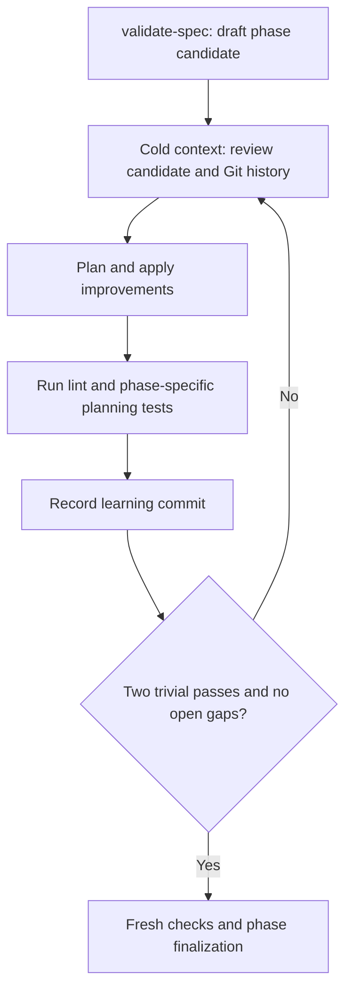

# Planning convergence loops

ShipLoop runs three upstream planning loops before dependency sequencing:
research, behavioral discovery, then specification improvement. All use durable
Markdown, fresh actions, evidence and learning commits under the same ShipLoop
lock and transaction boundary. Read only the section selected by the current
packet. The separate, nested per-step plan loop runs in `implement` before
source edits and before an Improve application; read
[Execution-plan convergence](execution-planning.md) for that contract.
Detailed research is in [Research loop](research-loop.md#draft); detailed
product modeling is in [Behavioral requirements](behavioral-requirements.md).

## Loop contract

`research` drafts paired report and evidence candidates from the prompt and
survey. `behavior` drafts the requirement/flow/state/transition model from the
accepted research baseline. `spec` drafts the specification from the converged
behavior model. Neither initial candidate is accepted as finished. Each uses
these stage suffixes: `-review`, `-plan`, `-apply`, `-verify`, `-commit`, then
either another review or `-finalize`. All remain in the `validate-spec` phase.
Research cold contexts retrieve the current report/evidence pair, planning
receipt, and iteration rather than every archived pass. After research
finalization, draft behavior; after behavior finalization, draft the spec; after
spec finalization, proceed to `sequence`.

Each planning-iteration packet states an **Objective**, **Until**, **Continue while**, and
**Evidence required** contract. The script calculates convergence from recorded
passes, not a host `done` claim:

- two consecutive fully recorded passes contain only trivial/no findings and
  trivial/no application changes;
- every known finding is resolved, including applied trivial fixes;
- each pass examined every required rubric dimension and retained its findings,
  plan, changes, checks and distinct primary learning commit;
- final checks are fresh for the unchanged candidate and matching audit history.

A material finding, material application or repair resets the streak. Material
means changing required behavior, a transition/guard/invariant, an edge-case
outcome, acceptance/test adequacy, feasibility, or meaning—not the size of the
text diff. A newly found missing transition is material even if one sentence
fixes it. Trivial means non-semantic polish; no changes is a valid trivial pass
only after an actual new review. Identical completion replay never counts twice.

For research, a changed question, conclusion, status, or scope is material
regardless of a host-supplied flag. A source-version or observation-only refresh
can be trivial only when it changes no conclusion, status, scope, or required
revalidation. Open or blocked research questions cannot finalise. See
[research evidence and freshness](research-loop.md#evidence-and-freshness).

“Exhaustive” means systematically examining the bounded in-scope model until
this convergence rule is met. It is not proof that every possible interleaving
or undiscovered defect has been eliminated. A runtime, budget or permission
blocker pauses unfinished work; it does not convert an incomplete loop to success.

## Review

Run the printed `history` command and read the required current Git bodies.
Retrieve `planning`, `iteration`, the current candidate and relevant prompt/
research slices with bounded `context` calls. Do not load every old iteration.
Use the finding ledger to retain known gaps and recognize recurring ones; do not
omit an unresolved item simply because the current pass found nothing new.

Review every dimension below with evidence, concrete source/model IDs or an
explicitly justified inapplicability. `coverage_review` is an object containing
each required key with a nonempty explanation. A generic “reviewed, fine” is not
an adequate semantic review even though prose quality is host judgment.

Research passes use the same `coverage_review` field with the complete
[research review rubric](research-loop.md#review): question/source integrity,
applicability, contrary evidence, safe probe limits, invocation conditions,
test/deploy feasibility, and unresolved material gaps. It records a bounded
investigation, not semantic exhaustiveness or perpetual source freshness.

| Required key | Ask on every behavior and spec pass |
| --- | --- |
| `requirements` | Does each incoming requirement have an observable outcome? Is anything invented, dropped, or contradictory? |
| `states` | Are ownership, invariants, initial/terminal states, reachability and meaningful concurrent dimensions defined? |
| `transitions` | For each relevant state/event class, are triggers, guards, actions, destination/unchanged state and observations defined? |
| `edge_conditions` | Which invalid/repeated/stale events, boundaries, permissions, timeouts, cancellation, partial failures and recovery paths are missing? |
| `sequences` | Do end-to-end flows and alternative branches agree with the ledger, including important multi-transition races and failures? |
| `test_mapping` | Does each required behavior map to cases with explicit expected states, outputs and side effects at relevant test surfaces/environments? |
| `ambiguities` | Which rules are unsupported or require user direction? Are exclusions justified rather than hidden gaps? |

Spec passes also require:

| Required key | Additional spec question |
| --- | --- |
| `clarity` | Could a fresh implementer/tester interpret any acceptance rule in materially different ways? |
| `consistency` | Do terms, diagrams, transitions, constraints, expected outcomes and lifecycle decisions agree with each other and the behavior baseline? |
| `feasibility` | Can the specified behavior be implemented and checked with the authorized environment, interfaces and prerequisites? |

Make each pass a real attempt to disprove adequacy. Walk a concrete event trace,
inspect adjacent state/event combinations, reverse-trace an outcome to its
prerequisites, and challenge assumptions using actual sources. Rotate focus
across risky perspectives while still recording every dimension; repeated
wording alone is not a fresh inspection. Record what was newly examined in
`test_review` and `learnings`. New material policy ambiguity must become a
finding and, when a user decision is needed, a pause—not a guessed answer.

If a pass reveals a generic improvement to ShipLoop itself, record it through
`journal` or the result's optional `journal` field. Keep that proposal separate
from product findings and candidates; the final handoff presents the accumulated
`shiploop-improvements.md` proposals without applying them automatically.

Each `findings` entry contains stable `id`, `severity: material|trivial`, and
`summary`. The normalized ledger also retains resolution evidence and the
resolving iteration, so a cold reviewer need not search all history for closure.
Preserve identity across passes; reopen the same ID when a problem
recurs. The script retains old open findings and refuses silent severity
downgrades. A review may honestly return `[]`; it does not erase the ledger.

## Plan and apply

At `-plan`, supply a Markdown `body` and `addresses` containing every open finding
ID. Explain the intended corrections, supporting evidence, expected outcome,
case/test updates and prevention. An empty finding set needs an explicit no-fix
plan and `addresses: []`, not an invented task.

At `-apply`, supply the complete updated candidate `body`; research also supplies
its complete typed `research_state`, and spec also supplies its complete
`lifecycle`. Return `material`, `resolutions` (objects with `id` and supporting
`evidence`), `test_changes`, and `learnings`. Apply trivial fixes too. Unknown
or duplicate resolution IDs are refused; omitted resolutions leave their findings
open. Research question and source IDs are stable across passes; a resolved
question names known sources, a not-applicable question supplies its concrete
N/A rationale and may retain source support, and an open/blocked question cannot
be removed to manufacture a clean pass. Do not weaken expected behavior to close
a finding.

Only the script imports/replaces authoritative candidates. Author result drafts
in the packet's inbox; do not directly edit `research.md`,
`research-evidence.md`, `behavior.md`, `spec-draft.md`, `lifecycle-draft.md`,
receipts or hashes. Keep the essential model and decisions in the candidate, not
only in a temporary linked draft. Product source and its README are still
untouched at this stage; plan their later worktree deliverables.

Research is read-only evidence work. It neither authorizes a provider, tool
installation, configuration change, credential mutation, destructive probe, nor
publication. Record expected roles and documented non-mutating probes without
secrets; missing authority is a pause, not a research conclusion.

The spec loop improves the specification of an accepted behavior baseline. If
it discovers a missing or changed requirement/transition, use
`revisit --to behavior` with the reason before any step exists. If the evidence
or environmental conclusion itself needs reconsideration, use
`revisit --to research`, which preserves survey and invalidates research plus
dependent proofs. Re-converge the required upstream loop and then the spec; do
not quietly change a frozen baseline. Refining wording/tests within the agreed
behavior remains ordinary spec work.

## Checks and commits

Use the printed `planning-verify --action … --manifest …` command at each
`-verify` and `-finalize` action. Supply a Markdown check manifest with a concrete
lint entry and test entry covering exact acceptance **`research evidence`**,
**`behavior model`**, or **`specification`**, as named by the packet. Use explicit
argument arrays and available tools; no new testing framework or research
provider is required.

Keep planning-only check helpers and inputs in the run's inbox or outside the
bound product tree. Adding a helper to product source after a pass starts would
change the baseline that the planning evidence must preserve. Planned product
tests remain later implementation deliverables.

Checks must exercise actual candidate properties: for example research
question/source referential integrity, revalidation policy, safe local-probe
claims, state/transition reachability or invariants when represented in
machine-checkable form, complete expected-outcome records, syntax/diagram
validation, and contradictions detectable by the chosen representation. Select
meaningful checks for the artifact instead of a file-existence test or an always
successful command. Record manual scenario analysis as host-reported evidence,
not fabricated executable coverage. These are planning-artifact tests, not a
claim that a remote source is live or that future product/browser/service/API
tests already passed.

The script binds evidence to the current candidate and finding ledger, iteration,
action, manifest, Git baseline and product-tree fingerprint. Failed, missing,
timed-out, stale or changed-candidate evidence cannot advance the action.
Preserve failed attempts. Explain changed manifests with `--reason`. A new
candidate edit after application returns through repair/review and application;
do not reuse a clean streak merely by running old checks again.

At `-commit`, create a distinct **audit-only** commit in the bound repository.
Planning edits are in run Markdown, not product files. Use
`git commit --allow-empty --only` with a message file or safely quoted message;
do not stage the run directory or unrelated user changes. This preserves existing
staged product work. The commit must have the iteration's recorded Git baseline
as its parent and an unchanged tree, plus the exact `ShipLoop-Iteration` trailer.

Use the normal four sections: `Review:`, `Changes:`, `Validation:`, and
`Key learnings:`. Include the candidate/ledger digest, relevant finding IDs,
check evidence and verbatim review/apply learnings. Metadata-only commits still
document real investigation; they do not invent product work. Complete the action
with the full commit SHA. A Git commit alone never replaces authoritative Markdown
or proves the semantic model complete.

## Finalization and recovery

After two recorded trivial passes and no open findings, `-finalize` requires
fresh checks again on exactly the final candidate and last audited HEAD. Complete
with `summary`; no replacement candidate content is allowed at this boundary.
Research finalization accepts the checked `research.md` and
`research-evidence.md` pair, writes its certificate and script-recorded as-of
time, then issues `behavior`. That time records the accepted evidence baseline;
it is not proof that sources remain live or that a remote system was checked.
Behavior finalization freezes its model. Spec finalization atomically promotes
the checked draft and lifecycle to `spec.md` and `lifecycle.md`, then issues
`sequence`. There is no direct draft-to-sequence shortcut.

The retained certificates and their candidate/ledger, final-check and Git audit
bindings remain necessary evidence for downstream work. A missing or corrupted
certificate blocks advancement; a frozen-file hash alone does not replace it.
Historical planning proof does not require the same Git HEAD forever: later
accepted planning passes and authorized implementation create new commits.
At the research-to-behavior, behavior-to-spec, spec-to-sequence and first-step
allocation boundaries, the corresponding finalized planning baseline must still
match. Outer-before preparation may ready the authorized environment; product-tree
changes belong in explicit DAG steps, not an unreviewed new baseline before
allocation.

`repair` records the interrupted planning pass, invalidates its clean streak and
returns to a new review. Restore any out-of-band candidate drift to its imported
bytes first; repair is not permission to bless unreviewed manual state changes.
If a material user decision changes upstream assumptions, use the supported
`revisit --to survey|research|behavior|spec` path before any step receipt or
active work exists. `--to research` requires/preserves survey and archives the
research pair, behavior/spec/sequence downstream artifacts, all planning
receipts/certificates, and their bindings. `--to survey` archives all planning,
including environment; behavior/spec targets retain accepted research proof.
Revisit never resets product work underneath existing steps. Use `pause` for an
external/user blocker and `halt` for an unfinished terminal exit.

After context loss, `next` reconstructs the pending action. Read `prompt`,
`planning`, `iteration`, then the phase-selected paired `research` candidate,
`behavior`, or `spec-draft`/`lifecycle-draft` pages. Completed iteration records
remain linked in Markdown; the active packet does not accumulate their full
bodies. The current iteration can finish and be discarded from LLM context; its
successor uses persisted facts.

A planning freeze preserves an approved baseline, not a claim that discovery is
over. Once execution begins, its separate
[carry-forward checkpoint](carry-forward.md) records current project knowledge
and affected consumers without overwriting planning certificates. Compatible
corrections get review/tests or pending DAG work; incompatible requirements,
lifecycle or permission changes need direction. The planning loops retain their
own existing finding ledgers; `carry-forward` is an execution Improve stage.

### Earlier Markdown runs

New runs retain Markdown protocol version 3 and add
`planning_protocol_version: 2`. An active pre-v2 Markdown run, including version
1 or a missing marker, cannot silently use an old research report or spec as
convergence evidence. Its `next` packet prints the action-bound
`planning-upgrade` command; diagnostics, pause, resume and halt remain
available. `next` does not schedule work or create a worktree for such a run.

With no step receipt or active work, `planning-upgrade` archives
`research.md`, `research-evidence.md`, every planning artifact, and downstream
contract under `planning-history/<action>/upgrade/`, removes their active copies
atomically, clears research/behavior/spec/lifecycle/plan hashes/bindings, increments the
planning epoch, and creates fresh planning actions. It preserves the old cursor
only for preflight, approach, survey, or research; a preserved research cursor
gets new candidates because its old pair was archived. A later cursor restarts at
research when `environment.md` exists, or survey otherwise. The upgrade does not
certify old review claims or overwrite prompt, journal, or product work.

If any step receipt or active work already exists, upgrade is refused. Preserve
the old run, branches and worktrees; use a fresh run with an explicitly chosen
baseline and scope. Do not erase execution records or replay completed work to
manufacture a planning certificate. `migrate` remains the distinct route for
legacy JSON input.

## Until-loop incorporation boundary

ShipLoop incorporates the standalone `until-loop` 0.1.3 repeat/verify/continue
decision as the internal `scripts/shiploop_until.py` policy for the execution
plan loop. The installed standalone skill and its CLI are not executed or
modified. Its JSON-authoritative state, independent lock, non-idempotent
completion, optional verifier, and single repo-level loop are intentionally
excluded: ShipLoop keeps one Markdown authority, one action-bound command,
replay-safe results, candidate-bound checks, and fresh finalization evidence.

The upstream research/behavior/spec mechanics in this document remain in
`scripts/shiploop_planning.py` under ShipLoop's lock and transaction boundary.
The incorporated policy only decides whether verified, audited execution-plan
passes make a plan ready for its own fresh finalization gate; it never grants
success from a host `done` claim or a cycle budget. See
[Execution-plan incorporation and limits](execution-planning.md#until-loop-incorporation-and-limits)
for the exact provenance and differences. No slash invocation, external runtime,
model pin, host-specific path, or second state owner is required.

## Evidence basis and limits

Iterative feedback and revision have demonstrated benefits in specific task
evaluations ([Self-Refine](https://arxiv.org/abs/2303.17651)); unaided self-correction
also has documented failure modes ([self-correction study](https://arxiv.org/abs/2310.01798)).
Neither study establishes correctness for a ShipLoop run. The practical design
therefore requires traceable findings, real checks and revision-bound evidence
alongside repeated review. Host judgment still determines semantic adequacy.
