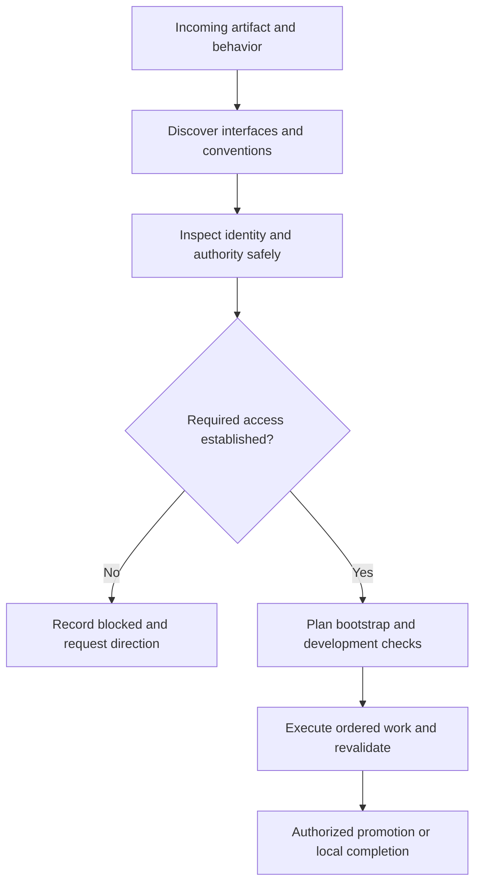

# Platform discovery and delivery readiness

Use this guide when the requested artifact lives in a hosted platform, remote
service, MCP-connected environment, or another destination outside the local
product tree. A local-only increment records that decision explicitly; it does
not invent a remote platform to fill a checklist. All records live in existing
Markdown state, not in a separate discovery database.

Record findings through the generic result and durable-note binding in the
[navigator discovery adapter](research-loop.md#navigator-execution-mode-adapter).
Apply the investigation and authority questions here; there is no typed
platform schema or separate discovery record.

## Discover before choosing a mechanism

Start with the requested artifact and actual environment, not a preferred stack.
Inspect available evidence such as MCP/resource inventories, repository
configuration, installed CLIs, platform SDKs, and primary documentation. These
are examples, not required interfaces or an exhaustive list. Record version and
source for the selected interface. Discovering an MCP name does not prove it is connected;
finding a CLI does not prove that the current account has permission. Do not
install a connector, change credentials, or create a remote target implicitly.
When the user's request or current task context authorizes bounded discovery
setup, a task-local temporary reader, SDK, skill, or test dependency may be
acquired for a named gap under the
[recursive-discovery rules](research-loop.md#recursive-discovery-and-experiments);
that is not a persistent integration, a credential grant, or a new writer.

An MCP server can be a gateway, not the whole system. Identify the system behind
it and the access actually needed for this task. If a relevant system has no
usable route, investigate whether a supported MCP server, existing API/CLI/SDK,
or authorized browser session could supply the missing observation or operation;
these are examples of possible routes, not an exhaustive list.
Compare coverage, publisher/provenance, authentication, data exposure, maintenance
and verification against existing tools. Registry presence is a lead, not trust
or access proof. Record adopt/pilot/defer/reject and why in discovery/research notes.
Recommend adding a connector only for a concrete gap. The existing discovery-setup
authorization governs a temporary reader; a persistent installation, credential
grant, or persistent configuration needs authorization covering that change, but
not a repeat request when it is already granted. A browser is not a bypass for a
blocked writer or missing permissions. Keep optional alternatives outside the
selected required inventory until explicitly selected.

Follow the relevant gateway's actors and contracts as described in
[recursive discovery](research-loop.md#recursive-discovery-and-experiments).
Local and remote boundaries need the same evidence discipline; discovering a
second gateway is not permission to invoke it or traverse unrelated accounts.

Use [remote capabilities and state](service-discovery.md#remote-capabilities-and-state)
to distinguish provisioning from runtime operations, metadata from record CRUD,
and observed state from requested changes. Reconcile prior/local/remote/requested
state before incremental changes; scoped authorized reads can resolve discovery
questions without implying permission to mutate the target.

Research the destination's language, metadata/schema, module boundaries,
registration or bootstrap, generated/reserved files, syntax validation,
applicable invocation or interaction contracts, deployment/package mechanics,
and real acceptance path. Keep the compact decision and source pointers in the
discovery note; expand uncertain facts at `research`. Required unknowns remain
unresolved rather than guessed.

For an affected remote execution boundary, inspect relevant code/configuration
and test assets through supported safe reads: server functions, served client
code or native test definitions may exist only in the target. Establish the
authoritative source and observation limits; absence from a local checkout or
tool catalog does not establish remote absence. Carry these findings into
[target-native test selection](repeatable-test-suites.md#select-target-native-tests)
using existing discovery notes, rather than creating a second inventory.

For each artifact, preserve a single writer from the discovered interfaces.
An unavailable required writer can be named in the inventory solely to bind a
blocked declaration; its name is not evidence that it is installed or usable.
Reader and validator tools can differ from that writer. A writer failure is not
permission to switch to a second mutation mechanism.

## Safe observations and authority

### Interface identity and roles

Discovery selects the platform, interfaces and single writer, and records them
in its note. Later stages reference that selection and add bounded role,
invocation, state, failure and source links; they do not create a second
platform inventory, change the selected writer, or turn a planned safe probe
into an observation. With discovery setup authorized by the request or current
task context, a temporary reader may add source or probe evidence without
changing the selected writer. If an interface or role is unavailable,
preserve a blocked reference and its revalidation trigger.

Environment roles are task labels with permitted actions and isolation facts,
not an assumed dev/stage/prod ladder. One isolated local environment can satisfy
multiple labels when its evidence supports that decision; a production-only
connection is not a test fixture. Investigate meaningful differences without
forcing infrastructure parity. [Twelve-Factor's dev/prod discussion](https://www.12factor.net/dev-prod-parity)
is a useful prompt for differences, not a requirement to provision three
environments. For connected tool boundaries, use the selected version's
[MCP tools contract](https://modelcontextprotocol.io/specification/2025-11-25/server/tools)
and its authority guidance as evidence anchors rather than treating a tool name
or annotation as a safe writer.

At cold resume and immediately before an external operation, recheck the
selected interface, non-secret target role and required authority with the
documented safe probe. Never execute a probe merely because a tool description
suggests it is harmless. A changed or failed result becomes a carry-forward
observation, a revised future queue when compatible, or a pause for new
authority. It cannot silently rewrite the accepted baseline.

## Bootstrap, validation, and publication are different obligations

Use the [environment lifecycle policy](environment-lifecycle.md) and the
ordered work-item binding.

Bootstrap establishes prerequisites such as project structure, target binding,
configuration and an isolated development area. Development validation proves
the implemented behavior through the required real boundary. Publication
promotes the result to the authorized delivery target; it is not synonymous
with a local Git commit or merge.

Use existing lifecycle routes, not a hidden second scheduler:

- No setup needed: explain why.
- Setup: name a preparation work item and order dependent work after it; keep
  it limited to authorized environmental preparation.
- Development checks: name their producer, environment role and expected
  outcome. Place them after bootstrap and before any dependent release.
- Release: explicitly plan none, the authorized release at `release`, or
  blocked. A later release cannot retroactively satisfy acceptance needed
  before `product-acceptance`.

Do not mandate separate development, staging and production accounts. Determine
which isolation is necessary, available and authorized. Record cleanup/data
constraints and rollback in the associated plan and checks. Missing isolation
that is necessary for safe work is a blocker, not a reason to write to production.

## Hypothetical trace

Input: “Build an app in my hosted developer environment.” Discovery finds a
documented CLI and an MCP reader, then records their versions and responsibilities.
If the supplied account lacks confirmed write authority, the record stays
applicable but blocked; no initialize or publish operation follows. Once access
is safely established and authorized, planning names bootstrap, app changes,
real-boundary tests and conditional promotion producers. Each cold packet
rehydrates the recorded facts and directs the next action. This is generic
platform reasoning, not a claim that any particular live service was tested.
