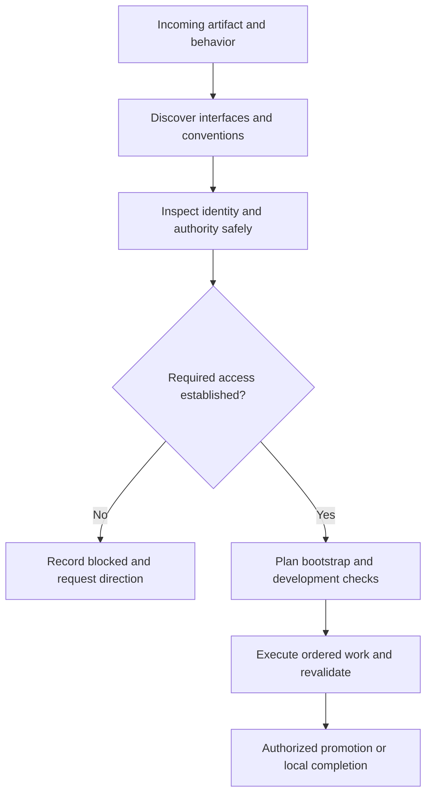

# Platform discovery and delivery readiness

Use this guide when the requested artifact lives in a hosted platform, remote
service, MCP-connected environment, or another destination outside the local
product tree. A local-only increment records that decision explicitly; it does
not invent a remote platform to fill a checklist. All records live in existing
Markdown state, not in a separate discovery database.

Navigator uses the generic result and durable-note binding in the
[navigator discovery adapter](research-loop.md#navigator-execution-mode-adapter).
Apply the investigation and authority questions here, but the typed machine
schema, frozen records, and guarded planning artifacts below belong to
managed/legacy compatibility runs, not navigator results.



## Discover before choosing a mechanism

Start with the requested artifact and actual environment, not a preferred stack.
Inspect available evidence such as MCP/resource inventories, repository
configuration, installed CLIs, platform SDKs, and primary documentation. These
are examples, not required interfaces or an exhaustive list. Record version and
source for the selected interface. Discovering an MCP name does not prove it is connected;
finding a CLI does not prove that the current account has permission. Do not
install a connector, change credentials, or create a remote target implicitly.
When the user's request or current task context authorizes bounded discovery
setup, a task-local temporary reader, SDK, skill, or test dependency may be
acquired for a named gap under the
[recursive-discovery rules](research-loop.md#recursive-discovery-and-experiments);
that is not a persistent integration, a credential grant, or a new writer.

An MCP server can be a gateway, not the whole system. Identify the system behind
it and the access actually needed for this task. If a relevant system has no
usable route, investigate whether a supported MCP server, existing API/CLI/SDK,
or authorized browser session could supply the missing observation or operation;
these are examples of possible routes, not an exhaustive list.
Compare coverage, publisher/provenance, authentication, data exposure, maintenance
and verification against existing tools. Registry presence is a lead, not trust
or access proof. Record adopt/pilot/defer/reject and why in survey/research prose.
Recommend adding a connector only for a concrete gap. The existing discovery-setup
authorization governs a temporary reader; a persistent installation, credential
grant, or persistent configuration needs authorization covering that change, but
not a repeat request when it is already granted. A browser is not a bypass for a
blocked writer or missing permissions. Keep optional alternatives outside the
selected required inventory until explicitly selected.

Follow the relevant gateway's actors and contracts as described in
[recursive discovery](research-loop.md#recursive-discovery-and-experiments).
Local and remote boundaries need the same evidence discipline; discovering a
second gateway is not permission to invoke it or traverse unrelated accounts.

Research the destination's language, metadata/schema, module boundaries,
registration or bootstrap, generated/reserved files, syntax validation,
applicable invocation or interaction contracts, deployment/package mechanics,
and real acceptance path. Keep the compact decision and source pointers in the survey; expand
uncertain facts through the existing research convergence loop. Required
unknowns remain unresolved rather than guessed.

For each artifact, preserve a single writer from the surveyed interfaces.
An unavailable required writer can be named in the inventory solely to bind a
blocked declaration; its name is not evidence that it is installed or usable.
Reader and validator tools can differ from that writer. A writer failure is not
permission to switch to a second mutation mechanism.

## Safe observations and authority

### Markdown machine schema

New managed or legacy runs require `machine.platform_discovery` in `environment.md`:

```json
{
  "version": 1,
  "applicable": false,
  "rationale": "This increment changes only a local product tree.",
  "platforms": []
}
```

When applicable is true, `platforms` is nonempty. Each row contains all of the
following fields. Values must be grounded in the current request and evidence;
the field list is not permission to manufacture observations.

| Field | Shape and meaning |
| --- | --- |
| `id`, `artifact`, `writer` | Nonempty strings; compact unique platform ID; artifact/writer match an existing `machine.exclusive` row. |
| `interfaces` | Nonempty array of selected, required `{kind,name,version,reference,status}` routes; status `ready` or `blocked`, other fields nonempty strings. The writer matches one selected interface name. Optional unavailable alternatives belong in prose, not this required set. |
| `identity` | `{expected_role,observed_role,safe_probe,status}`; nonempty strings and status `ready` or `blocked`. For a blocked observation, explicitly say it is not established; do not invent a role. |
| `authority` | `{required,rationale,status}`; Boolean required, nonempty rationale; required uses `observed` or `blocked`, not-required uses `not-required`. |
| `bootstrap` | `{mode,step_id,prerequisites,validation}`; mode `none`, `dag`, `outer-before`, or `blocked`; step ID only for DAG, otherwise null; string-list prerequisites (empty for none, nonempty for required setup); nonempty validation or reason. |
| `development_validation` | `{decision,step_id,environment,expected_outcome}`; decision `required`, `not-applicable`, or `blocked`; step ID only for required, otherwise null; environment role for required, null for not-applicable; nonempty expected outcome or explicit no-work reason. |
| `promotion` | `{mode,target,step_id,verification}`; mode `none`, `dag`, `outer-loop`, or `blocked`; step ID only for DAG, otherwise null; target for selected promotion, null for none; nonempty verification or explicit no-work reason. |
| `revalidate_at` | Required canonical triggers `cold-resume` and `before-external-operation`; also `before-promotion` for selected DAG/outer-loop promotion. |
| `blocked_paths` | String list; nonempty aggregate narrative explaining blocked routes when any capability, identity, authority or delivery route is blocked; otherwise empty. The validator checks that distinction, not exhaustive per-route semantic coverage. |

Step IDs refer to the later existing dependency DAG, not a parallel plan. Survey
checks the declaration; sequence checks producer existence, route placement and
dependency ordering. Prepare/publish recheck frozen declarations and route
consistency, **not live access**; the host must perform the safe current probe.

Record the expected target role, observed role, and a documented non-mutating
identity/readiness probe. Use non-secret role aliases, never credentials,
account addresses, session IDs, or secret resource identifiers. Preserve the
observation's as-of context in the evidence narrative. A planned probe is not
an observed result; tool availability is not mutation authorization.

Use [early access readiness](research-loop.md#early-access-readiness): after a
safe existing-connection probe identifies a concrete user authentication need,
prompt promptly and retain the request/recheck condition in existing Markdown.
Do not delay a known request until release or mistake setup/network failure for
missing authentication. Keep current prerequisites distinct from disclosed
downstream access needs.

Known credential patterns in platform strings and common environment fields
are rejected without echoing their values. Cold environment projections also
redact recognized credential-bearing strings defensively. This is not an
exhaustive secret scanner: host-provided prose, results and logs still require
careful non-secret authoring. Ordinary documentation URLs and role aliases are
allowed; credential URLs, signed access URLs and literal authentication tokens
are not safe evidence references.

If the task requires unavailable access, keep the platform applicable and mark
the relevant capability/authority blocked. Do not relabel it local-only to pass
validation. The script checks record shape and route consistency; it cannot
independently certify the truth of the host's observations or infer permission
from a role label.

### Frozen interface identity handoff

The survey owns selected platform and interface identity. A later versioned
research context may reference a selected interface only by its frozen
`{platform_id, name}` pair, then add bounded role, invocation, state, failure,
and source links in `research-evidence.md`. It must not create a second platform
inventory, revise `environment.md`, change the selected writer, or turn a planned
safe probe into an observation. With discovery setup authorized by the request or
current task context, a temporary reader may add source or probe evidence without
changing that frozen inventory or writer. If an interface or role is unavailable,
preserve a blocked reference and its revalidation trigger.

Environment roles are task labels with permitted actions and isolation facts,
not an assumed dev/stage/prod ladder. One isolated local environment can satisfy
multiple labels when its evidence supports that decision; a production-only
connection is not a test fixture. Investigate meaningful differences without
forcing infrastructure parity. [Twelve-Factor's dev/prod discussion](https://www.12factor.net/dev-prod-parity)
is a useful prompt for differences, not a requirement to provision three
environments. For connected tool boundaries, use the selected version's
[MCP tools contract](https://modelcontextprotocol.io/specification/2025-11-25/server/tools)
and its authority guidance as evidence anchors rather than treating a tool name
or annotation as a safe writer.

At cold resume and immediately before an external operation, recheck the
selected interface, non-secret target role and required authority with the
documented safe probe. Never execute a probe merely because a tool description
suggests it is harmless. A changed or failed result triggers a carry-forward
observation, pending-only replan when compatible, or a pause for new authority.
It cannot silently rewrite the frozen baseline.

### Action-bound probe attestations

Fresh runs declare `platform_revalidation_protocol_version: 1`. For selected
outer-before `prepare`, outer-loop `publish`, and DAG-bound `implement` or
`improve-apply` routes, the current packet adds `platform_revalidation` to the
ordinary result. No additional CLI or separate state file is required.
Large requirement sets use `context --section platform-revalidation` with the
ordinary Unicode/digest pagination. It returns every script-selected binding
and the current action ID, not observed probe results. The packet may show a
bounded **sample** result: retrieve all requirement pages and supply every
required row before completing; omitted sample rows are never waived.
The context's `route` is informational, not a result field. Build each result
using the eight-field shape below, taking `action_id` from the context record
and adding the actual observed evidence/status rather than submitting the
requirement object as if it were a completed observation.

Each row has exactly `platform_id`, `trigger`, `action_id`,
`environment_sha256`, `observed_role`, `status`, `evidence`, and
`performed_before_operation`. Copy the packet's binding values. Supply one row
per required platform/trigger, `status: "ready"`, an observed role matching the
declared expected role, a non-secret evidence reference, and
`performed_before_operation: true` **only if it actually happened**. Every
selected external route needs `before-external-operation`; promotion also
needs `before-promotion`. Missing, duplicate, stale, mismatched or non-ready
attestations cannot complete that action. Stop and seek direction if the safe
probe fails or requires new authority.

Accepted results persist in `results/<action>.md`; preparation and publication
records retain the corresponding result too. The preparation-readiness
objective reviews the original accepted operation evidence: its Apply passes
must not rewrite that attestation or repeat the operation, and its finalization
does not claim a new probe. A cold process cannot be detected reliably, so
`cold-resume` remains a host re-probe obligation before the next external use.

This is an enforced **receipt requirement**, not script execution of probes or
independent proof of their result/timing. Access can change after a probe.
Unmapped external work still requires safe host checks and correct discovery/
DAG routing; a missing mapping is not an exemption or authorization. Existing
runs without the marker keep their earlier callback shape; an explicitly
invalid marker is rejected, never silently treated as legacy.

## Bootstrap, validation, and publication are different obligations

For navigator runs, use the [environment lifecycle policy](environment-lifecycle.md)
and ordered work-item binding; the lifecycle/schema routes below belong to the
recorded managed/legacy protocol and are not navigator result fields.

Bootstrap establishes prerequisites such as project structure, target binding,
configuration and an isolated development area. Development validation proves
the implemented behavior through the required real boundary. Publication
promotes the result to the authorized delivery target; it is not synonymous
with a local Git commit or merge.

Use existing lifecycle routes, not a hidden second scheduler:

- No setup needed: explain why.
- DAG setup: name a preparation producer and make dependent work consume it.
- Outer-before setup: keep it limited to authorized environmental preparation;
  product changes remain explicit DAG work.
- Development checks: name their producer, environment role and expected
  outcome. Place them after bootstrap and before any dependent publication.
- Publication: explicitly choose none, DAG, outer-loop, or blocked. A DAG
  publication must depend on its prerequisites; outer publication cannot
  retroactively satisfy acceptance needed before outer quality.

Do not mandate separate development, staging and production accounts. Determine
which isolation is necessary, available and authorized. Record cleanup/data
constraints and rollback in the associated plan and checks. Missing isolation
that is necessary for safe work is a blocker, not a reason to write to production.

## Hypothetical trace

Input: “Build an app in my hosted developer environment.” Survey discovers a
documented CLI and an MCP reader, then records their versions and responsibilities.
If the supplied account lacks confirmed write authority, the record stays
applicable but blocked; no initialize or publish operation follows. Once access
is safely established and authorized, sequencing names bootstrap, app changes,
real-boundary tests and conditional promotion producers. Each cold packet
rehydrates the recorded facts and directs the next action. This is generic
platform reasoning, not a claim that any particular live service was tested.
