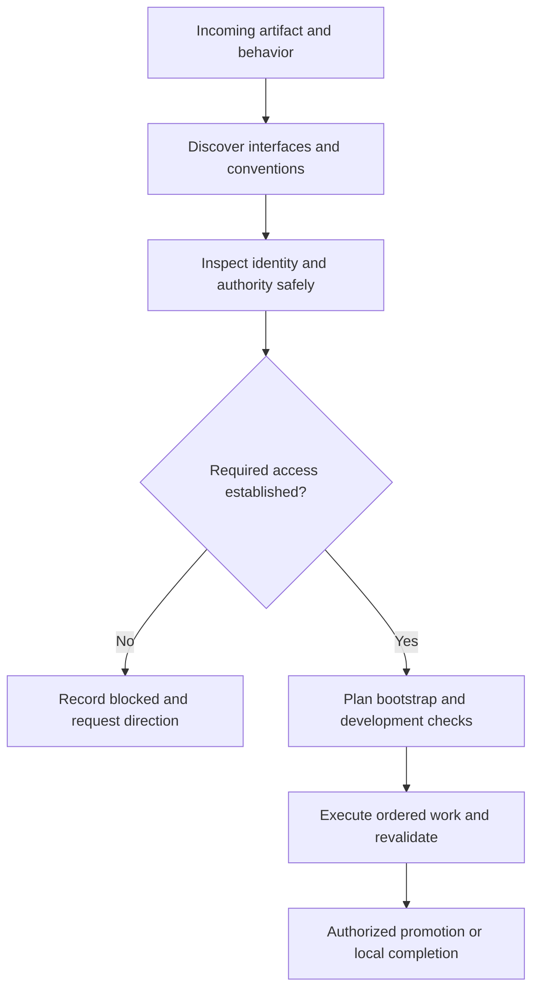

# Platform discovery and delivery readiness

Use this guide when the requested artifact lives in a hosted platform, remote
service, MCP-connected environment, or another destination outside the local
product tree. A local-only increment records that decision explicitly; it does
not invent a remote platform to fill a checklist. All records live in existing
Markdown state, not in a separate discovery database.



## Discover before choosing a mechanism

Start with the requested artifact and actual environment, not a preferred stack.
Inspect available MCP/resource inventories, repository configuration, installed
CLIs, platform SDKs, and primary documentation. Record version and source for
the selected interface. Discovering an MCP name does not prove it is connected;
finding a CLI does not prove that the current account has permission. Do not
install a connector, change credentials, or create a remote target implicitly.

Research the destination's language, metadata/schema, module boundaries,
registration or bootstrap, generated/reserved files, syntax validation,
client–service invocation, deployment/package mechanics, and real acceptance
path. Keep the compact decision and source pointers in the survey; expand
uncertain facts through the existing research convergence loop. Required
unknowns remain unresolved rather than guessed.

For each artifact, preserve a single writer from the surveyed interfaces.
An unavailable required writer can be named in the inventory solely to bind a
blocked declaration; its name is not evidence that it is installed or usable.
Reader and validator tools can differ from that writer. A writer failure is not
permission to switch to a second mutation mechanism.

## Safe observations and authority

### Markdown machine schema

New runs require `machine.platform_discovery` in `environment.md`:

```json
{
  "version": 1,
  "applicable": false,
  "rationale": "This increment changes only a local product tree.",
  "platforms": []
}
```

When applicable is true, `platforms` is nonempty. Each row contains all of the
following fields. Values must be grounded in the current request and evidence;
the field list is not permission to manufacture observations.

| Field | Shape and meaning |
| --- | --- |
| `id`, `artifact`, `writer` | Nonempty strings; compact unique platform ID; artifact/writer match an existing `machine.exclusive` row. |
| `interfaces` | Nonempty array of selected, required `{kind,name,version,reference,status}` routes; status `ready` or `blocked`, other fields nonempty strings. The writer matches one selected interface name. Optional unavailable alternatives belong in prose, not this required set. |
| `identity` | `{expected_role,observed_role,safe_probe,status}`; nonempty strings and status `ready` or `blocked`. For a blocked observation, explicitly say it is not established; do not invent a role. |
| `authority` | `{required,rationale,status}`; Boolean required, nonempty rationale; required uses `observed` or `blocked`, not-required uses `not-required`. |
| `bootstrap` | `{mode,step_id,prerequisites,validation}`; mode `none`, `dag`, `outer-before`, or `blocked`; step ID only for DAG, otherwise null; string-list prerequisites (empty for none, nonempty for required setup); nonempty validation or reason. |
| `development_validation` | `{decision,step_id,environment,expected_outcome}`; decision `required`, `not-applicable`, or `blocked`; step ID only for required, otherwise null; environment role for required, null for not-applicable; nonempty expected outcome or explicit no-work reason. |
| `promotion` | `{mode,target,step_id,verification}`; mode `none`, `dag`, `outer-loop`, or `blocked`; step ID only for DAG, otherwise null; target for selected promotion, null for none; nonempty verification or explicit no-work reason. |
| `revalidate_at` | Required canonical triggers `cold-resume` and `before-external-operation`; also `before-promotion` for selected DAG/outer-loop promotion. |
| `blocked_paths` | String list; explain blocked routes when any capability, identity, authority or delivery route is blocked; otherwise empty. |

Step IDs refer to the later existing dependency DAG, not a parallel plan. Survey
checks the declaration; sequence checks producer existence, route placement and
dependency ordering. Prepare/publish recheck frozen declarations and route
consistency, **not live access**; the host must perform the safe current probe.

Record the expected target role, observed role, and a documented non-mutating
identity/readiness probe. Use non-secret role aliases, never credentials,
account addresses, session IDs, or secret resource identifiers. Preserve the
observation's as-of context in the evidence narrative. A planned probe is not
an observed result; tool availability is not mutation authorization.

If the task requires unavailable access, keep the platform applicable and mark
the relevant capability/authority blocked. Do not relabel it local-only to pass
validation. The script checks record shape and route consistency; it cannot
independently certify the truth of the host's observations or infer permission
from a role label.

At cold resume and immediately before an external operation, recheck the
selected interface, non-secret target role and required authority with the
documented safe probe. Never execute a probe merely because a tool description
suggests it is harmless. A changed or failed result triggers a carry-forward
observation, pending-only replan when compatible, or a pause for new authority.
It cannot silently rewrite the frozen baseline.

## Bootstrap, validation, and publication are different obligations

Bootstrap establishes prerequisites such as project structure, target binding,
configuration and an isolated development area. Development validation proves
the implemented behavior through the required real boundary. Publication
promotes the result to the authorized delivery target; it is not synonymous
with a local Git commit or merge.

Use existing lifecycle routes, not a hidden second scheduler:

- No setup needed: explain why.
- DAG setup: name a preparation producer and make dependent work consume it.
- Outer-before setup: keep it limited to authorized environmental preparation;
  product changes remain explicit DAG work.
- Development checks: name their producer, environment role and expected
  outcome. Place them after bootstrap and before any dependent publication.
- Publication: explicitly choose none, DAG, outer-loop, or blocked. A DAG
  publication must depend on its prerequisites; outer publication cannot
  retroactively satisfy acceptance needed before outer quality.

Do not mandate separate development, staging and production accounts. Determine
which isolation is necessary, available and authorized. Record cleanup/data
constraints and rollback in the associated plan and checks. Missing isolation
that is necessary for safe work is a blocker, not a reason to write to production.

## Hypothetical trace

Input: “Build an app in my hosted developer environment.” Survey discovers a
documented CLI and an MCP reader, then records their versions and responsibilities.
If the supplied account lacks confirmed write authority, the record stays
applicable but blocked; no initialize or publish operation follows. Once access
is safely established and authorized, sequencing names bootstrap, app changes,
real-boundary tests and conditional promotion producers. Each cold packet
rehydrates the recorded facts and directs the next action. This is generic
platform reasoning, not a claim that any particular live service was tested.
