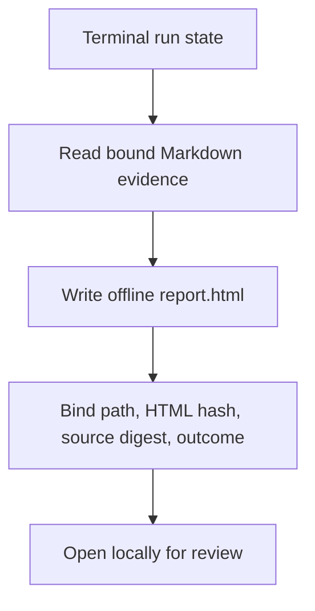

# Offline terminal report

ShipLoop writes `report.html` with the same atomic Markdown transaction that
reaches `done` or `halted`. `shiploop report --run-dir <run>` performs a
presentation-only regeneration for a terminal run. It rewrites derived HTML and
its integrity metadata without changing product work or the recorded terminal
outcome, but it does increment the run revision and append a
`report-regenerated` history event. The report reads existing Markdown evidence,
never becomes a second state owner, and cannot infer success from an LLM claim
or a green-looking page.

## Lifecycle

Generation occurs only after a terminal outcome. The normal terminal transition
generates the report as part of its durable write. A later presentation-only
`report --run-dir <run>` may regenerate the view for an already terminal run;
it refuses an active or paused run. Regeneration does not advance a stage,
alter product files, create a worktree, or change the recorded outcome. Because
the CLI records its new revision and history event, repeated CLI regenerations
need not be byte-identical. Pure rendering is deterministic for unchanged
effective Markdown sources.

`state.md.report` is deliberately compact: relative path `report.html`, its
SHA-256, a digest of the Markdown evidence used to render it, terminal outcome,
evidence-completeness flag, and renderer schema version. The HTML is derived
and disposable; `state.md`, receipts, results, checks, and certificates remain
authoritative. A missing, altered, unsafe, stale, or inconsistent report fails
the complete-report consistency check rather than upgrading evidence.

## Content and boundaries

The self-contained `report.html` leads with a short TL;DR and makes it possible
to diagnose what happened without reloading the whole run into an LLM context:

- terminal outcome: completed, halted, or otherwise unfinished; never label an
  incomplete run as delivered;
- actual stage sequence: a history action ID is the cursor persisted after its
  event, not the action completed by that event. Show step or iteration IDs
  only when explicit durable records contain them; never infer them from a
  cursor or event text;
- ready evidence: the table shows a recorded pre-edit contract check when one
  is present. Otherwise it may show only a finalized step-plan certificate
  reference; that reference is not full certificate validation or a claim of a
  bound `planning-verify` result, and neither form says the step was done;
- done evidence: final verification result and its required case/lint evidence,
  kept distinct from the later local merge record and from any external
  deployment claim;
- check summaries, current limitations, known blockers, observed versus planned
  outcomes, and links or relative paths to the underlying Markdown evidence;
- carry-forward obligations and generic ShipLoop improvement proposals, marked
  as scheduled/proposed rather than silently completed.

The report must say when evidence is unavailable, failed, blocked, stale,
host-reported, or not run. It is not an oracle for semantic correctness,
meaningful test selection, remote system state, user acceptance, or a deployed
effect. It must not expose secrets, credential-bearing URLs, raw sensitive logs,
or an executable remote resource. Offline means no network requests, scripts,
or external assets are necessary to open the file.

## Verification expectations

1. A complete run renders a local report with the same terminal outcome and a
   source digest bound in `state.md`.
2. A halted/incomplete run renders a conspicuous unfinished TL;DR and does not
   imply final verification or merge occurred.
3. Ready evidence, done evidence, merge evidence, and host-reported deployment
   evidence remain separately labelled.
4. Pure rendering is deterministic for unchanged effective Markdown sources.
   CLI regeneration records a new revision and `report-regenerated` history
   event, while leaving the run's phase, stage, action, and product worktree
   untouched.
5. The command refuses nonterminal runs and the HTML has no network URLs or
   embedded executable content.
