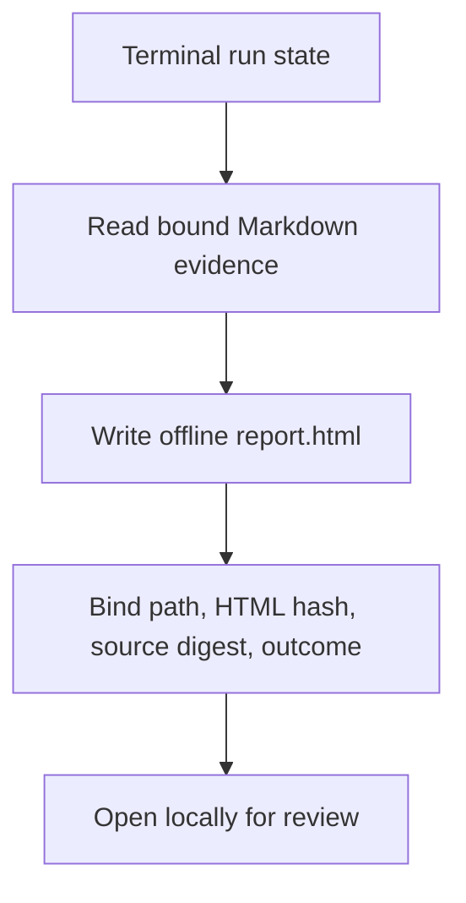

# Offline terminal report

ShipLoop writes `report.html` with the same atomic Markdown transaction that
reaches `done` or `halted`. `shiploop report --run-dir <run>` performs a
presentation-only regeneration for a terminal run: it rewrites derived HTML and
its integrity metadata but never changes workflow evidence or outcome. The
report reads existing Markdown evidence, never becomes a second state owner,
and cannot infer success from
an LLM claim or a green-looking page.

## Lifecycle

Generation occurs only after a terminal outcome. The normal terminal transition
generates the report as part of its durable write. A later presentation-only
`report --run-dir <run>` may regenerate the view for an already terminal run;
it refuses an active or paused run. Regeneration does not advance a stage,
alter product files, create a worktree, or change the recorded outcome.

`state.md.report` is deliberately compact: relative path `report.html`, its
SHA-256, a digest of the Markdown evidence used to render it, terminal outcome,
evidence-completeness flag, and renderer schema version. The HTML is derived
and disposable; `state.md`, receipts, results, checks, and certificates remain
authoritative. A missing, altered, unsafe, stale, or inconsistent report fails
the complete-report consistency check rather than upgrading evidence.

## Content and boundaries

The self-contained `report.html` leads with a short TL;DR and makes it possible
to diagnose what happened without reloading the whole run into an LLM context:

- terminal outcome: completed, halted, or otherwise unfinished; never label an
  incomplete run as delivered;
- actual stage sequence and action/step/iteration identifiers, including
  deviations, pauses, repairs, and abandoned plan passes where recorded;
- ready evidence: the initial `step-plan-finalize` certificate and its bound
  `planning-verify` result, showing that a step was ready to implement rather
  than that it was done;
- done evidence: final verification result and its required case/lint evidence,
  kept distinct from the later local merge record and from any external
  deployment claim;
- check summaries, current limitations, known blockers, observed versus planned
  outcomes, and links or relative paths to the underlying Markdown evidence;
- carry-forward obligations and generic ShipLoop improvement proposals, marked
  as scheduled/proposed rather than silently completed.

The report must say when evidence is unavailable, failed, blocked, stale,
host-reported, or not run. It is not an oracle for semantic correctness,
meaningful test selection, remote system state, user acceptance, or a deployed
effect. It must not expose secrets, credential-bearing URLs, raw sensitive logs,
or an executable remote resource. Offline means no network requests, scripts,
or external assets are necessary to open the file.

## Verification expectations

1. A complete run renders a local report with the same terminal outcome and a
   source digest bound in `state.md`.
2. A halted/incomplete run renders a conspicuous unfinished TL;DR and does not
   imply final verification or merge occurred.
3. Ready evidence, done evidence, merge evidence, and host-reported deployment
   evidence remain separately labelled.
4. Regeneration at a terminal state is deterministic for unchanged source
   Markdown and leaves the run's phase, stage, action, and product worktree
   untouched.
5. The command refuses nonterminal runs and the HTML has no network URLs or
   embedded executable content.
