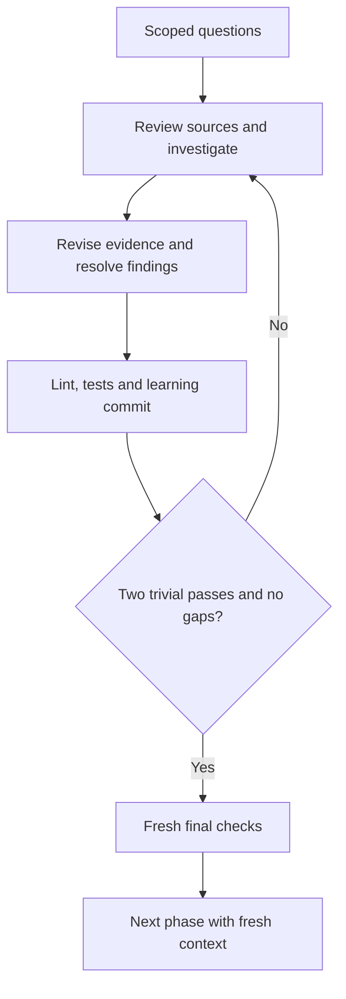

# Iterative environmental and best-practice research

Research is a delivery activity with its own evidence and stopping condition,
not a one-shot report or a request to repeat the same answer. Start from the
incoming prompt, surveyed environment, available spec and recorded discoveries.
Follow the printed action; retain everything needed by the next iteration in
Markdown. Read only the section the current packet selects.



## Draft

Identify the environmental conditions and best-practice decisions that could
change the approach, feasibility, behavior, tests or deployment. Convert them
into a bounded question inventory. Scope the inventory to this task; do not
research every technology, invent an unnecessary environment, or impose a stack.

For each question, distinguish:

- what the user requires, with a prompt/spec reference;
- what the environment currently does, with direct evidence;
- what a source recommends, with applicability and contrary evidence;
- what remains unknown or requires a user decision.

Research begins with `body` and `research_state` in the normal Markdown result.
The script maintains `research.md` and `research-evidence.md` as candidate
components; host-authored result drafts belong in the printed inbox. The typed
legacy evidence structure is shown below. For a versioned run, use the packet's
extended template and the required
[result shape](research-result-schema.md#result-shape) and
[replacement rules](research-result-schema.md#replacement-rules), not this
legacy-only example. Those sections define every row shape, allowed enum and
stable-identity/link rule; no validator source inspection should be necessary.

```json
{
  "questions": [
    {
      "id": "Q-1",
      "question": "Which invocation boundary must the client use?",
      "origin": "Prompt R-1 and survey invocation uncertainty",
      "status": "resolved",
      "answer": "Use the documented service-visible operation and error envelope.",
      "sources": ["SRC-1"],
      "revalidate": "Recheck if the deployed interface version or client changes.",
      "rationale": "The documented boundary matches the requested client and current service."
    }
  ],
  "sources": [
    {
      "id": "SRC-1",
      "reference": "Safe primary-document or repository reference",
      "authority": "primary",
      "version_or_observed_at": "Exact inspected version or observation timestamp",
      "supports": "The exposed operation, input shape and error envelope",
      "limitations": "Does not prove live credential availability or a deployed result"
    }
  ]
}
```

Use stable IDs. Question status is `resolved`, `open`, `blocked`, or
`not-applicable`; source authority is `primary`, `local`, `secondary`, or `probe`.
`origin` explicitly references the prompt, spec or discovery that raised the
question. Preserve prior question and source IDs across application; changing a
source reference/authority needs a new ID rather than repurposing the old one.
A resolved question needs source support. An irrelevant question needs a concrete
inapplicability rationale. An open/blocked question records the gap in `answer`;
it cannot be hidden by removing its ID or declaring the pass trivial. Local-only
work can use actual repository/runtime evidence; no external-search quota or
third-party tool is mandatory. No relevant uncertainty still requires an explicit
bounded applicability review, not a fabricated source or silent empty result.

### Versioned system-context links

New runs that declare `system_context_protocol_version: 1` extend only their
`research_state`; older runs keep the exact two-key `questions`/`sources` shape.
The extension adds `parents`, `contract_refs`, `role_refs`, and `interface_refs`
to every question, plus one `system_context` record with a version, scope,
rationale, observations, roles, interfaces, and interactions. The detailed
model stays in `research.md` and `research-evidence.md`; packets carry only a
bounded selected projection and its evidence locator.

Use stable IDs and validate every source, parent, role, interface, and contract
reference. Question parents are acyclic. Contract/question links are reciprocal.
An interface that represents a surveyed platform names its frozen
`{platform_id, name}` identity rather than copying or changing the survey.
Roles record permitted actions and isolation without forcing a `dev`, `stage`,
or `prod` taxonomy. Include observed or explicitly blocked/not-applicable
code, state, system, and environment-role observations; unavailable evidence is
not permission to call a boundary irrelevant.

Each relevant interaction records caller/callee interfaces, operation,
input/output shape, state and failure semantics, supported SDK/client idiom,
risk, depth rationale, sources, questions, and affected consumer steps. Follow
causal boundaries as far as risk requires: a simple local call may stop with a
reason, while retries, duplicate effects, cancellation, partial commit, or role
differences need the relevant downstream state/service boundary. A numeric depth
claim is never evidence. Required unresolved interactions or their open/blocked
questions prevent research finalization; do not replace them with a future
consumer dependency or an invented probe.

Use the selected primary contract for an operation. The
[MCP tools specification](https://modelcontextprotocol.io/specification/2025-11-25/server/tools)
is an example of why operation/result/error envelopes need explicit evidence;
[MCP security guidance](https://modelcontextprotocol.io/docs/2025-11-25/tutorials/security/security_best_practices)
illustrates that an adapter boundary does not grant authority; and
[Google AIP-194](https://google.aip.dev/194) illustrates why retry ownership and
idempotency must come from the actual API contract. These are investigation
anchors, not a mandate to install an MCP server or adopt an RPC design.

## Recursive discovery and experiments

Start with the task's affected flows, not a fixed number of hops. Read the repo
README and existing applicable AGENTS.md, architecture/design/environment notes
and local skills before rediscovering their subject. Record absence or stale
claims explicitly. Recheck volatile facts; documentation is not live access proof.

For each relevant system, including the world behind an MCP gateway, ask:

- Who produces input, invokes operations, consumes results or receives secondary
  effects? Include people, jobs, services and external actors on both sides.
- Where is state stored and who owns it? Trace data format/schema, source of
  truth, lifecycle/retention, consistency and migration/compatibility boundaries.
- What sequence, library/client convention, event or protocol connects actors?
  Follow validation, async completion, retry/deduplication, partial failure and
  recovery to the actual durable or user-visible effect.
- Which identity and permissions apply at each hop? Distinguish tenant/account
  roles, delegated authority, sensitive data crossing boundaries and auditability.
  Upstream authentication does not prove downstream permission or safe isolation.
- Does this system call another system or gateway whose contract could change
  the required behavior, tests, deployment or chosen approach? Investigate that
  boundary, using existing question parents/interaction links and source IDs.

For each explored branch, give a stopping reason in `depth_rationale` and the
report: the in-scope effect and important failure/security semantics are backed
by inspected evidence, or an explicit open/blocked question names what is missing.
Reuse already-inspected nodes when paths reconverge or cycle. Do not follow every
unrelated integration or inspect private account contents simply to enumerate
them. Reopen a branch when new evidence could materially change the plan. A
bounded local function may need one trace; a multi-service write may need several
trust and persistence boundaries. Complexity must match actual scope and risk.

If observation is inaccessible, compare available MCP/API/CLI/SDK/browser routes
using [platform discovery](platform-discovery.md#discover-before-choosing-a-mechanism).
No route found is a recorded gap, not evidence that the system has no behavior.

Use a small experiment when it can settle a consequential uncertainty better
than more reading. Before running, name the question/hypothesis, independent
expected outcomes, what result would change the plan, permitted target/role,
isolated fixture, effects, limits and cleanup/recovery. Prefer non-mutating
inspection, then a bounded authorized sandbox probe. Never test on production
because it is the only available target. Capture actual positive/negative/unknown
outcomes, access/observation date, version and limitations as existing `probe`
sources; do not record secrets or treat a planned experiment as evidence.
Stop on unexpected effects or missing authority. A material finding goes back
through the existing review/plan/apply loop and resets convergence.

Repeat consequential investigation in each research review: seek an overlooked
actor, downstream effect, conflicting source or disproving experiment. An unchanged
blocker stays open, while two fully checked trivial passes can finish only with
no required unresolved questions. No recursive sub-loop, new journal or numeric
depth quota is needed. Carry durable reusable conclusions to the existing plan,
knowledge/outer-work records and scoped product documentation tasks; never write
product docs during a research-only action or hand-edit frozen environment state.

## Decision boundaries

Classify the next useful action in the existing question's `answer`,
`rationale` and `revalidate` fields; these are not new status values or another
journal. Keep the distinction visible in the report and improvement plan:

- **Researchable unknown:** name the missing fact, the relevant repository or
  primary contract, a permitted probe and what observation would settle it.
  Investigate or independently recheck it, including consequential downstream
  behavior justified by the selected scope and risk.
- **Owner decision or authority:** name the precise policy, target, role or
  permission needed, and its consequence. Retain `open`/`blocked` status and
  request direction; use the existing pause route when progress depends on it.
  More public-document reading cannot establish account access or select the
  owner's policy. Do not invent a default or relabel the gap not-applicable.
- **Later-phase implementation:** when the underlying contract is established,
  record the known requirement and its downstream consumer (behavior/spec/test
  planning or an existing handoff route). Do not implement it during research.
  A genuinely unanswered prerequisite remains open; calling it future work
  does not resolve it or permit research finalization.

Derive safety expectations that hold independently of a missing policy. For
example, whatever identity or retention policy the owner selects, an unauthorized
state mutation must not be reported as accepted. Record that expectation and
its basis without claiming an identity scheme was selected or a security test
passed. Reserve the detailed test matrix for behavior/spec and the test phases.
Do not grow an unselected optional feature just to make its research exhaustive.

Each review distinguishes **new discoveries** from **unchanged blockers**.
Open/blocked questions still reset the current convergence streak even if this
pass found nothing new. Two quiet reviews with a missing owner decision are not
two successful trivial passes. Use the existing gates, result records and
carry-forward/outer-work routes; do not add a nested investigation engine.

## Review

Each pass reads its current question/source records, finding ledger, selected
candidate pages and required Git history. Use `next`, `context` and `history`;
do not load every old research report. Perform a new investigation or independent
recheck of the important conclusions, not merely a rewrite of prior prose.

Cover every research rubric key with a concise evidence-based explanation:

| Key | Question to answer in this pass |
|---|---|
| `prompt_coverage` | Which requirements/spec clauses/discoveries drive the inventory, and are any omitted or invented? |
| `environment_conditions` | What runtime, resource, data, concurrency, persistence, configuration and failure conditions actually matter? |
| `source_quality` | Do inspected sources directly support each conclusion at the relevant version/environment? |
| `contradictions` | Which sources, observations or requirements disagree, and what evidence or decision resolves the disagreement? |
| `best_practices` | Which alternatives fit local constraints, and what are their benefits, costs, failure modes and adoption reasons? |
| `access_readiness` | Are authorized roles, safe probes and prerequisite availability understood without recording secrets? |
| `invocation_contracts` | Are relevant client/service operations, envelopes, serialization and error/async behavior established on both sides? |
| `test_deploy_feasibility` | Which local, browser, service or API checks are required and possible in the intended environment? |
| `remaining_unknowns` | Which material questions remain, what should be investigated next, and what requires user direction? |

Start broad enough to identify plausible alternatives, then investigate the
highest-risk gaps deeply. Inspect relevant local contracts and current primary
documentation; use secondary/community reports to generate leads and failure
hypotheses, not as sole proof of a capability. Seek evidence that could disprove
the favored answer. Distinguish independent corroboration from copied sources.
Record what each safe probe or source actually establishes, including null or
negative results and why an alternative was rejected.

Use the existing planning result contract: `findings` with stable IDs and
material/trivial severity, the complete `coverage_review` object, `test_review`
and `learnings`. Plan every unresolved finding, then supply the updated complete
report and `research_state` at application. Research changes remain candidates
until checks and audit commits establish convergence.

The complete replacement result is an on-disk artifact, not a requirement to
paste the entire report or inventory into the model context. For large candidates,
read bounded relevant sections and assemble the replacement in the printed host
inbox from the current Markdown using scoped edits or local transformation
scripts. Do not edit script-owned candidates directly. Preserve untouched
records and stable IDs, then validate the assembled result. Never omit evidence
to fit the context window or rely on remembered records from a prior iteration.

## Evidence and freshness

Source identity and observation time serve different purposes. Prefer an exact
commit, release, document revision or other immutable identifier for stable
claims. Record when a volatile condition was observed and its safe point-of-use
revalidation trigger. The script's finalization time is when the checkpoint was
recorded, not proof that every remote source was freshly inspected then.

Treat a new/changed conclusion, newly discovered material question, environment
constraint, incompatibility, or test/deploy feasibility gap as material. A small
text edit can change the entire decision. Non-semantic report cleanup or a source
observation/version refresh that changes no conclusion may be trivial. The script
conservatively treats additions or edits to question records, source identities,
support or limitations as material, even if the host labels them trivial.
Unavailable evidence is not evidence that nothing material remains; record the
gap and pause as needed.

Each research iteration requires real candidate-bound lint and tests covering the
packet's exact `research evidence` acceptance. Useful checks include question/source
referential integrity, missing applicability/revalidation policy, contradictions
detectable from a structured model, and the expected results of safe local probes.
Test the asserted contract, not only file existence. Manual source interpretation
is host-reported evidence, not executable proof or a passed remote acceptance test.
Reconcile the report's required case map with the repeatable checks: every
required case needs an expected outcome and current execution evidence. Label
historical/manual observations separately; a passing subset does not validate
the whole case map or excuse an unavailable required check.

Use a distinct verbose audit-only commit per completed planning pass with the
recorded learnings. Two consecutive fully checked trivial-only passes, no open
questions/findings, and fresh final checks permit finalization. Apply trivial
fixes before the checks. A repeated action, failed probe, exhausted budget or
iteration cap never counts as another successful pass.

Keep secret values, credential-bearing URLs, account addresses and raw sensitive
responses out of reports, results and logs. Research does not authorize installing
tools, changing credentials/configuration, running destructive experiments or
publishing. Missing user policy is not resolvable by additional web citations.

## Later discoveries

Research completion accepts a versioned evidence baseline, not a permanent claim
that discovery is over. Every implementation review explicitly assesses whether
its current scope needs new investigation:

```json
{
  "research_assessment": {
    "status": "required",
    "summary": "A newly observed boundary invalidates the current assumption.",
    "evidence": ["Safe reference to the retained observation"],
    "questions": ["Which supported behavior applies at this boundary?"]
  }
}
```

Statuses are `not-needed`, `resolved`, `required`, or `blocked`. Explain why no
research is needed when that is the decision. Required/blocked investigation is
material and cannot leave the improvement loop unresolved. Retain the answer,
evidence and revalidation policy when resolving it; repeat review and checks.
`resolved` means investigation was completed in this pass and still resets the
trivial streak. In a later pass, use `not-needed` when rechecking the existing
evidence reveals no new investigation need; explain why it remains applicable.
Every status requires a summary; all except `not-needed` require nonempty
`evidence` and `questions` lists. These are safe references and question text,
not an invitation to copy raw source output into the result.
Use the existing carry-forward checkpoint for facts other iterations need.

| Discovery location | Required route |
|---|---|
| Before any execution receipt | `revisit --to research` archives the old research and downstream planning, preserves the survey, and reconverges. A changed survey contract uses `--to survey`. |
| Within the active step's approved scope | Investigate during its ordinary Improve loop; unresolved research is material and resets convergence. |
| Required by future pending steps | Carry a `research`-domain `pending-replan` discovery. Post-inner maps it to an explicit `activity: research` producer, and every affected consumer must transitively depend on that producer. |
| Incompatible requirement, permission or completed-work assumption | Pause for direction. Research evidence is not authority to rewrite the approved baseline. |

A research DAG step names its checkable report/decision artifact in `produces`.
Its review supplies the full research rubric in `research_review` as well as the
ordinary execution fields. The step must pass the normal lint/tests,
carry-forward, verbose commit, two-trivial-pass, final-verify and merge gates.
Following steps consume the report and scoped knowledge with fresh context.
Mapping a research obligation means **scheduled**, not answered or verified.
In `pending_obligation_map`, a research obligation's `{id, steps}` entry lists
only the research producer IDs in `steps`. The script derives affected pending
consumers and checks their transitive dependencies separately; do not list those
consumers as research producers.

Generic improvements to ShipLoop belong in `shiploop-improvements.md`, separate
from product research and without permission to self-modify the harness.

## Basis and limits

Adaptive investigation and persistent artifacts are supported by
[Anthropic's research-system engineering experience](https://www.anthropic.com/engineering/multi-agent-research-system).
It also reports coordination and token costs, so parallel investigation is a
choice for independent questions, not a requirement for every pass.
[Self-Refine](https://arxiv.org/abs/2303.17651) reports task-specific improvements
from revision, while [intrinsic self-correction research](https://arxiv.org/abs/2310.01798)
shows important limits without external feedback. These motivate evidence-backed
iteration, not a guarantee of completeness or this exact two-pass threshold.
The threshold is ShipLoop's explicit operational stopping rule; semantic
adequacy, source interpretation and live-source truth still require judgment.
