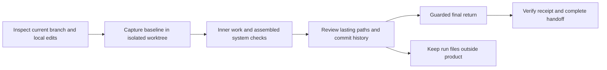

# Isolate a run; return only lasting work

This policy applies to new `workspace start` runs (`navigator-worktree`, navigator
protocol 3). Direct `init`, saved navigator-v1/v2, managed and legacy runs keep
their existing behavior; do not retrofit an active run or claim that those routes
have this helper's return gate. The SDLC graph and Improve ownership are unchanged.



## Entry, identity and storage

Use the selected package's `shiploop workspace start --repo SOURCE
--workspace-root EXTERNAL --prompt='<new incoming request>'`. Choose a new,
dedicated external directory outside the source checkout and Git metadata. It
must survive context resets. Do not use an automatically purged temporary path
for a real long-lived run. The helper creates:

```text
EXTERNAL/
  workspace.md       original checkout/branch and baseline; script-owned
  worktree/          execution checkout for all product changes
  run/               navigator state, prompts/results, notes, HTML report
  return-plan.md     candidate-bound path review; host supplies dispositions
  return-receipt.md  script-owned actual integration outcome
```

The packet's repository is the **execution checkout**. `workspace.md` is the
source of truth for the original checkout and branch; do not choose `main`,
`origin/main`, another checkout or a remote merely because it seems conventional.
The helper uses a separate `codex/shiploop-…` branch. It does not pull or push.
The private baseline remains reachable locally through that branch. Never use
`git push --all`, wildcard refspecs, or publish the private workspace branch as a
shortcut; those operations can disclose previously uncommitted inputs. Push
only the intended reviewed product branch when authorized. Worktrees share Git
objects/configuration; they are not security isolation from repository tooling.
The helper disables hooks for its own Git commands and rejects configured custom
clean/smudge/process filters rather than assuming a lossless snapshot round trip.
Use the packet's ordinary `next --run-dir EXTERNAL/run` for same-run recovery;
do not initialize a fresh run when an operation's outcome is uncertain.

Before starting, inspect applicable repository instructions, branch/status,
ignored/untracked inputs and any branch-triggered automation. Track actual
environment isolation separately: a worktree is not a remote sandbox, separate
database, safe deployment target or grant of deployment authority.

Current tracked working content is the starting candidate, including staged
and unstaged edits. The source index and working files are preserved. Needed
**non-ignored untracked files** require explicit repeated
`--include-untracked=<repo-relative-file>` selection. This includes useful
untracked project documentation when appropriate. Do not indiscriminately copy
untracked files: they may be credentials or scratch. Ignored files are not
imported; establish authorized environment prerequisites separately. Paths and
hashes are evidence, not permission to expose their contents.

The helper may create a private snapshot commit to establish that dirty
baseline. It is not a user product commit, permission to commit the source's
edits, or proof that those edits were reviewed. A dirty baseline is never
fast-forwarded into the original branch by this helper. Unsupported Git states
remain blocked; do not use stash, reset, clean, force or a different baseline to
make the error disappear. Prepare failures retain their owned evidence for
inspection rather than deleting potentially useful work.

This first guarded mode requires a named branch with a commit. It refuses
unresolved conflicts, submodules, sparse/split indexes, assume-unchanged or
skip-worktree entries, custom Git filters, and tracked protected runtime paths.
Existing unsupported repositories need an explicitly planned safe alternative;
do not silently bypass the guard by changing Git configuration or using direct
mode. Source-index checking is conservative: even an external metadata refresh
may require reconciliation rather than being treated as unchanged staging.

## What persists versus what stays in the run

| Keep in product when relevant and reviewed | Keep outside product commits/return |
| --- | --- |
| Implemented code, tests, intentional fixtures, manifests and configuration | Navigator state, inbox/results, action packets and control manifests |
| README, AGENTS, maintained environment/design/decision documents | Scratch plans, raw transcripts, debug dumps, temporary test output and caches |
| SHIPLOOP.md index and reusable local skills | Generated per-run HTML achievement report, review logs and receipts |
| Explicitly requested product deliverables or curated regression evidence | Credentials, cookies, tokens, raw private payloads and auth screenshots |

Classification is semantic. The script rejects known runtime paths and requires
an explicit disposition for candidate paths; it cannot recognize every temporary
file or decide whether an otherwise ordinary `notes.md` is useful product
documentation. Declare additional run-specific transient paths with `--exclude`
at start. Preserve pre-existing tracked files rather than silently deleting them.
If an existing tracked path conflicts with the transient policy, resolve that
classification with the user instead of silently stripping baseline content.

Never commit the whole checkout blindly. Use scoped product commits and retain
key learnings in their messages, as the Improve policy requires. Store detailed
review/evidence records under `EXTERNAL/run`; link rather than copy them into the
repo. Promote necessary lasting facts into maintained docs before return, so
deleting a historical run later would not erase the project's operating knowledge.
Historical artifact links may be unavailable on another machine; the index must
still contain usable durable document links and enough rationale to stand alone.

## Inner assembly and final return

The INNER `integrate` action combines worker changes **inside the execution
checkout**. It does not merge into the original branch after each item. All
remaining items, system tests, outer Improve and authorized release work use
the same assembled candidate. Recheck any integration-affected behavior.

Protocol 3 defers the once-only source return until the final `handoff` Improve
child has completed and its evidence receipt is ready. Review the final return
plan, perform the authorized return, then import that child. Earlier producers
and unfinished children cannot return the candidate; no subsequent producer
can silently change a returned candidate. The return command validates the
child completion and successful final disposition without advancing the graph.

During discovery and prepare, determine whether returning to the original branch
itself triggers CI/deployment or another material effect, and whether that return
is a prerequisite for a required consumer check. At release planning, revalidate
the finding against the selected candidate and authority. For v3, use an authorized
delivery/verification route from the execution checkout when available. If source
return is a prerequisite for a required consumer check, record that unresolved
ordering boundary and keep the run incomplete for reconciliation; do not claim a
pre-return check observed the later effect or bypass the final return guard. Legacy
v1/v2 retain their earlier release-or-handoff return route.
The helper never grants deployment, push or branch-policy authority. Source
return is not evidence that a hosted consumer has been updated.

1. Run the packet's `workspace plan-return --workspace-root EXTERNAL` command.
   It binds a Markdown path review to the current candidate. Review **every**
   disposition: `keep` for intended lasting work, `exclude` for transient work.
   Pending decisions or an attempt to keep a forbidden runtime path block return.
   Changed candidates require a fresh plan; do not edit hashes to bypass it.
2. Run `workspace return --workspace-root EXTERNAL` only after that review,
   current checks, and any required authority. The helper rechecks branch,
   baseline, source state, candidate and plan before mutating the source.
3. Distinguish the result:
   - **Clean start:** a committed, clean, reviewed candidate can fast-forward
     into the exact original branch. Reachable candidate history is checked too:
     a transient file committed then deleted still must not enter branch history.
     The helper never silently squashes, rewrites history or commits unreviewed
     files. If the reviewed plan excludes paths or the candidate is uncommitted,
     it returns only kept working-tree changes instead, explicitly without a
     merge/commit. Known protected runtime history is refused outright.
   - **Dirty start:** only the selected delta relative to the captured working
     baseline returns to the original working tree. Its original index is
     unchanged, its original work stays present, and no baseline commit is merged.
     This is a **working-tree return, not a Git merge or commit**. Any later commit
     that includes existing user work requires the appropriate scope and review.
   - **Nothing to return:** record a verified `no-change-return`, preserving the
     checkout. Do not manufacture a commit/merge or fail by applying an empty patch.
4. Retain the receipt, recover the current packet and complete remaining duties
   before its exact callback. Handoff's `done` is rejected without a current
   verified receipt. Script checks do not replace semantic review or tests.

For example, if `game.js` has a staged change and a further unstaged change,
ShipLoop begins with their combined working contents in isolation. It adds the
requested drag behavior there. Return applies that new delta while leaving the
source's staged content exactly as it was; no unrelated original edit is staged
or committed. A new source edit made during the run blocks the return rather
than getting overwritten or silently accepted as a new baseline.

## Recovery and limits

No automatic cleanup: keep the worktree, private branch, run report and receipts
available for inspection/recovery. Cleanup is a separate authorized operation,
only after checking no unique work remains. Never delete user source files to
force a clean return. A repeated return must reconcile its receipt and actual
source/candidate effects; it must not apply the patch twice.

Source/index/branch drift, path collisions, changed candidates, unsupported Git
states or transient history require resolution before completion. After a
return, further product changes invalidate its evidence; do not reuse the old
receipt. Stop and reconcile the intended integration rather than rewriting the
manifest baseline. External actors must not edit the source during the guarded
operation; repository tools cannot lock out arbitrary editors. Preserve partial
operation evidence on unexpected failures and inspect actual effects before retry.

Every worktree packet and final report names `return-receipt.md` and asks the
read-only `completed_receipt_snapshot` display validator for a current result.
A matching receipt shows its actual `returned` status and return kind; a missing,
stale, invalid, busy, or recovery-pending result is **not currently verified**.
This is a live view of the source and candidate, not a field copied into navigator
state or a new return operation. The terminal `completed_receipt` guard retains
its crash-transaction recovery behavior; the display validator requires an
already-stable workspace and does not add a write, change the graph, or parse an
accepted summary.
Accepted transition summaries remain historical host reports and cannot make a
stale receipt current again.

This is a local Git safety boundary, not a sandbox/security boundary or a
guarantee that an LLM categorized every file correctly. The existing Improve
campaign must challenge that categorization and the tests' adequacy.

## Why this is necessary

Git worktrees have their own HEAD and index: adding a worktree from HEAD does
not import the source's uncommitted content. Git also warns that dirty merges
can be difficult to recover. These are reasons to snapshot explicitly and
preserve the source index, not to auto-stash user work. See the official
[worktree documentation](https://git-scm.com/docs/git-worktree) and
[merge preconditions](https://git-scm.com/docs/git-merge#_pre_merge_checks).
