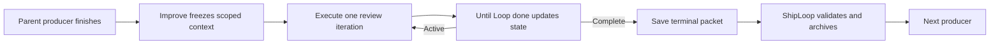
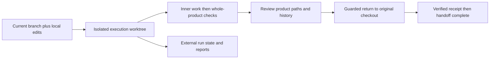
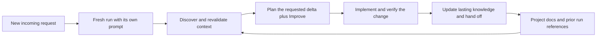
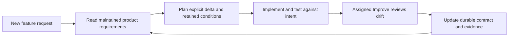
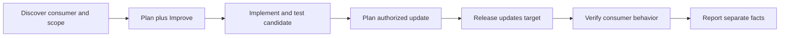
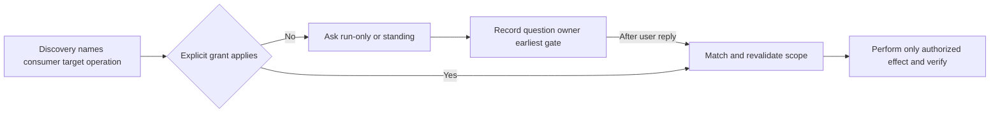
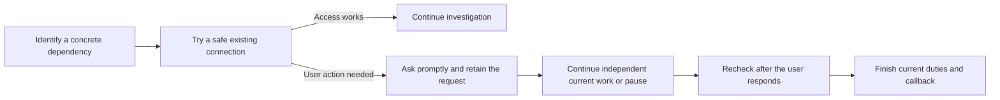
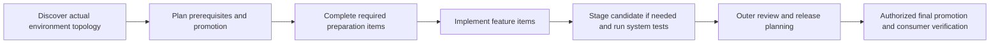
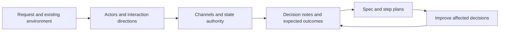

# ShipLoop navigator 0.33.1

ShipLoop's invoking conversation owns navigation, acceptance and delivery. New
runs record `delegation: inline`, so that conversation also executes every
assignment. It clears once per work item at the `select-work` packet (through a
callable host reset, or the printed pause plus a host `/clear` or fresh
conversation and the Recovery and Resume commands), continues each later INNER stage in the
same context, and runs each bound Improve invocation through the selected
Improve skill in the exact Child workspace without Ask Agent, native workers, an
extra worktree or `host-owner.md`; its reviews and checks run there too, with no
reviewer or test-runner agent unless the user asks for independent review. The
boundary is per work item because a model
cannot clear its own conversation: in the [clear-ledger study](https://github.com/whichguy/skill-craft/blob/59be9b8232e34dc00ae777052a608a13967ffab2/docs/shiploop-clear-ledger-experiments-2026-09-21.md#live-ledger-study-september-21-2026)
each packet-text variant produced a verified fresh entry in 0 of 2 cases, while
external host `/clear` worked in 3 of 3 resets.

`--delegation ask-agent` at `workspace start` or `init` opts a new run into the
delegated route. For a new
ephemeral Improve invocation, the selected `improve-agent` skill starts one
fresh native worker through Ask Agent's explicit consumer-owned workspace route,
and that worker runs `/improve` inline. The
worker executes the entire loop in the already-bound candidate; the parent
collects and verifies it, then performs the guarded final return when required.
`shiploop delegation --run-dir RUN --set inline|ask-agent` switches an existing
run from its next issued action; see the [command reference](#command-reference).
Read [Improve context ownership](references/improve-context.md) for capability,
exclusive writer, interruption and retention rules. A worktree alone does not
create a separate model session. Shell model-CLI launching belongs only to the external
E2E harness, not normal ShipLoop CLI operation. Optional bound implementation
chains, available only on ask-agent runs, may still use a selected compatible
Ask-Agent adapter through host-native delegation; inline runs execute reviewed
steps directly in the main conversation. The `shiploop` CLI never launches a
model: the former `drive` command and model transports are removed. The optional
[keepalive](#keepalive-keep-a-run-moving) driver, `scripts/shiploop-drive`, is a
separate script you start yourself.

Install and update ShipLoop and its selected Improve dependency through your
host's configured marketplace. Keep one discovered installation of each skill;
a development checkout is source code, not an additional installed copy. Do not
add same-name skill-directory links alongside marketplace packages. Open a fresh
host session after an update so it loads the selected package's current card.

New runs use navigator protocol 4: the script persists and traverses the SDLC
graph and issues one producer prompt at a time. After a planning result or the
last carry-forward it parks that parent action for the selected actual Improve
skill; every other result advances directly. The script owns navigation; the
model is a library call that performs the current step and runs the printed
callback. Improve follows the Until Loop runtime bound by
its selected card and owns its own iterations, evidence, and convergence. The
script imports one accepted child result before choosing the next producer; it
does not recreate Improve's review logic, phases, counters, or policy in a
ShipLoop prompt.

Every run includes experiment-informed Plan Improve and a guarded return to the
earliest invalidated planning stage; there is no protocol selector.
Read [experiments during planning](references/planning-experiments.md) for effects,
evidence, budget limitations and recovery. No separate experiment loop is added.

- [Navigator guide and flat SDLC diagram](references/navigator.md)
- [Graph dry-run commands and examples](references/graph-dry-run.md)
- [Skill entrypoint](SKILL.md)
- [Isolated workspace and artifact return policy](references/workspace-lifecycle.md)
- [Delivery-authority readiness](references/delivery-authority.md)
- [README-led current-system baseline and planning handoff](references/current-system-baseline.md)
- [House style: evidenced conventions and per-item exemplar match contracts](references/house-style.md)
- [Optional parallel or serial implementation chains](references/parallel-chain.md) — on
  a `delegation: ask-agent` run, bind the selected Plan Dispatcher/Ask-Agent
  packages to one current implementation action; `chain bind` refuses a fresh
  binding on an inline run, which executes its reviewed steps directly. New
  chains use the per-step managed-workspace flow only. The Ask-Agent helper
  must declare the full current capability set (helper-managed-worktree,
  prepared-inspection, returned-commit-delivery, fingerprint-bound-close,
  ignored-output-report); there is no version floor. Its helper identity and
  selected package bytes are frozen for the run; caller-prepared worktrees are
  not supported.
  The Dispatcher must advertise `planning_context: "shiploop-planning-artifacts/v1"`
  and `graph_validation: "execution-graph/v1"`; [chain preflight](references/parallel-chain.md#planning-artifact-handoff)
  rejects invalid graphs before binding. Initial steps and their graph must
  complete the planning Improve loop; later material revisions require review.
  Both execution modes prepare through the selected Ask-Agent workspace helper.
  Parallel mode grants native launches. `chain bind --mode serial` executes one
  ready step in the main context, with a managed preparation receipt and no
  native handle. Neither mode adopts an arbitrary caller-created worktree.
  The parent imports worker results, verifies the current combined candidate,
  integrates and accepts the exact attempt, then refills safe ready capacity
  before helper-owned cleanup. Accepted is the sole stored done state; the
  derived `completion` view lists done/not-done. `chain done` is the one
  verified settlement transition. Read-only `chain history` and `chain pending`
  expose timestamped evidence, unfinished steps, dependencies and capacity.
  Final completion requires all contributions integrated and cleanup resolved.
  Superseded managed attempts remain an explicit retained-workspace blocker;
  their unsuccessful work is not silently discarded. A pre-v6 binding is
  refused on every chain operation; preserve its worktrees and ledger and bind
  a new managed chain. Binding schema v6 records this capability proof and lifecycle;
  its number is independent of the selected Ask-Agent package version.

The planning-artifact handoff published at `c33a103` and its bounded native
Codex Ask-Agent `A/B → C` pilot were verified; see the [Native Ask-Agent
pilot](https://github.com/whichguy/skill-craft/blob/c33a103cd394506de680bd574ff5b5ef6b8b1de7/docs/shiploop-planning-artifact-handoff-plan-2026-09-19.md#native-ask-agent-pilot).
The goal-field omission was tested separately after that pilot. This evidence
does not establish installed or marketplace activation, other-host behavior, or
general Ask-Agent protocol compatibility. Binding a skill card freezes its
bytes; it does not establish semantic protocol compatibility.

`init` and `workspace start` create navigator protocol 4 runs with `delegation:
inline`; `--delegation ask-agent` opts in to the delegated route.
A retry cannot change the setting; use `shiploop delegation` instead. Protocol
4 is the only protocol: a saved navigator v1/v2/v3, managed or legacy run
is refused with an error naming it (see
[saved runs the current code cannot load](#saved-runs-the-current-code-cannot-load)).
The skill uses `workspace start` for new Git-backed work and direct `init` for
explicit in-place/non-Git use.
Navigation completion records the host's declared result; it does not certify
tests or deployment. Workspace-mode completion additionally requires its actual
local return receipt, not just a host assertion that integration happened.

## Keepalive: keep a run moving

A host ends its turn when the model decides to, even while the run has work it
can do. Keepalive hooks ask `shiploop hook-status` at each turn end and, while the
run is active and progressing, refuse the stop and name the run's next command.
A marketplace install of the ShipLoop plugin brings the hooks with it for Claude
Code, Codex (approve them once when Codex asks) and Cursor. Grok never runs
plugin hooks, so ShipLoop writes `~/.grok/hooks/shiploop-keepalive.json` itself
the first time it runs under Grok; new Grok sessions load it. A skill-directory
install adds them with
`scripts/shiploop-hook install --host HOST` (the only route for OpenCode);
`install.sh` never writes host hook config.

- Only one session per run, its owner, is kept alive; a parallel worker or a
  second terminal on the same run is let go. Ownership passes on when the
  owner's turn ends.
- A user stops the run by asking to stop or pause; a question about the loop does
  not stop it. `SHIPLOOP_KEEPALIVE=off` disables the hooks.
- For unattended runs, `scripts/shiploop-drive --host HOST --run-dir RUN -- HOST_ARGS`
  starts or resumes host sessions until the run is done, paused, blocked or stuck.
  Cursor (`cursor-agent -p`) and OpenCode (`opencode run`) need it; their headless
  modes cannot be kept going from inside.

Details, host table and decision log: [keepalive](references/keepalive.md).

## Navigator: producer, Improve child, then transition

The [navigator guide](references/navigator.md) draws this producer, Improve and
routing pattern and the [whole-run map](references/navigator.md#whole-run-map)
of the prelude, per-item inner loop and outer loop, with their gates and
loops.

Planning results (`spec`, `test-strategy`, `plan`, `step-plan`, `test-spec`,
`system-test-author`, `release-plan`) and the successful `carry-forward` that
leaves no work item pending follow this sequence; every other producer result is
accepted on its own checks and the script selects the next producer directly
(see the skill card's "When Improve runs"). The 34 producers' full flat
order is: `intake`, `discovery`, `research`, `spec`, `test-strategy`, `plan`,
`prepare`; then, for each ready item, `select-work`, `step-plan`, `test-spec`,
`baseline`, `test-author`, `test-red`, `implement`, `test-green`, `test-refine`,
`regression`, `document`, `skill-assess`, `skill-validate`, `static-checks`,
`verify`, `integrate`, `integration-verify`, `carry-forward`; then
`system-test-author`, `system-test`, `product-acceptance`, `release-plan`,
`release-check`, `release`, `release-verify`, `operations`, and `handoff`.

`skill-validate`, preparation, release, and operations still produce a reviewed
result when they are inapplicable; they record a concrete N/A disposition rather
than disappearing from the graph. `test-red` records an expected failure for the
specified missing behavior and must not make production edits to turn it green.
Release and verification never replay an uncertain external operation merely to
make traversal continue.

[Reusable product skills](references/testing-and-documentation.md#reusable-product-skills)
stay in the product repository. `discovery` inspects the local index before
planning; each `step-plan` rereads it for skills learned by earlier items.
Prefer unchanged reuse with supported inputs/defaults, then a compatible local
update, or a separate skill when contracts differ. `skill-assess` captures new
learnings; `skill-validate` checks changed and retained uses. Carry selected-skill
references into Improve's host-authored contract and maintain the repository index
at `carry-forward`. This uses ordinary evidence/plan notes and work-item context;
it adds no global installation or skill-specific runtime schema. Fresh-reader
reuse remains untested until a reader actually finds and applies the local skill.

Testing builds a [repeatable repository suite](references/repeatable-test-suites.md).
Initial planning selects or revalidates the harness and focused/smoke/full commands.
Each INNER change considers setup, test, teardown, and suite inclusion; stateless
cases need no artificial lifecycle. Share expensive fixtures only when tests cannot
interfere, otherwise isolate them. Retain cases and rerun instructions beyond the
run, and include tests, fixtures and suite wiring in their actual Improve review.
Plan local and remote execution explicitly. Where the remote framework requires
in-system tests, retain their definitions and authorized setup/invocation/cleanup
route; unavailable remote checks remain unrun even when local tests pass.

At initialization, `--improve-skill=ABSOLUTE_SELECTED_SKILL_CARD` may bind the
actual card. If omitted, the first checkpoint remains pending until the packet
instructs the owner to use `improve-bind --action ... --skill-card ...`. The
packet is authoritative for argument values and recovery. It then supplies one
actual Improve handoff; a recorded child is resumed through its own state, and
`improve-complete` imports matching successful completion evidence once. New
children commit verified scoped improvements in their bound worktree under
the selected Improve policy, unless an explicit user or repository no-commit
override applies. The parent verifies the commit evidence and owns integration;
a child commit alone does not prove caller delivery. ShipLoop's `state.md` remains SDLC-state authority;
the selected Until Loop runtime remains child-execution authority.

### Current Improve and Until Loop binding

The canonical Improve package bundles Until Loop **0.5.0**, pinned to
upstream commit `5df2a2feef4d80b93ca3c8a749d7d265c082d376`. Its default child uses
`scripts/until_loop_ephemeral.py`; the package provenance manifest records the
copied source hashes. The explicit selected card determines this binding. An
ambient same-named skill or an older `scripts/until-loop` on `PATH` cannot select
the child runtime. Changing an external Until Loop installation alone does not
refresh Improve's bundled copy.



The host saves complete raw `start`, `next` and `done` JSON responses at
`<workspace>/.shiploop-improve/<parent-run-id>/<action>/packet.json`. This file
is a receipt and recovery locator, not another loop controller. Until Loop owns
one independent temporary file for the active child. Separate parents/actions
have separate receipts and runtime files; overlapping product edits still need
coordination. ShipLoop excludes `.shiploop-improve` from product return and
commits, and likewise excludes `.until-loop` state that an external Until Loop
installation may create in the workspace.
For the final worktree handoff, untracked receipt files remain in the execution
worktree with an `exclude` return-plan disposition so import can read them after
product return. Staging, committing or placing them in candidate history still
blocks return. Generate the return plan after the terminal packet is saved:
earlier active-packet bytes would make that plan stale.

The child freezes the exact parent binding line in `context.request`, scope,
commit policy, environment, and resource locators for the original request,
parent state, latest packet and return instructions. Every `done` report provides
a replacement `handoff`. Thus a compacted host can read the latest full packet,
recover an active child through its exact `next_argv`, execute the returned work,
and submit the exact `done_argv`. It does not remember or choose the next state.
Relevant resources still have to be available; a locator does not embed their
contents or grant authority to change them.

For example, with `required_trivial_reviews: 2`, a material repair reported as
`non-trivial` leaves the streak at zero. A qualifying `trivial` review raises it
to one and returns another active action. A second trivial self-pass raises it
to two; with `exit_assessment: satisfied`, Until Loop returns `status: complete`
and deletes its temporary file. These are three separate execution/report
cycles. The LLM judges the evidence and classification; the runtime applies the
counter and transition. ShipLoop validates the terminal packet's parent/workspace
identity, context and gate, then archives it as `improve/<action>/terminal.json`
alongside two distinct final review files and current check evidence. Only an
accepted import releases the parent action. Duplicate matching parent callbacks
remain idempotent.

**Failure boundary:** an active, stopped, foreign, malformed or missing terminal
receipt cannot advance the parent. If a process loses terminal stdout after the
runtime deletes its state, neither `next` nor a missing file proves success:
leave the parent incomplete. There is deliberately no second state journal or
automatic replacement child. Save stdout directly or through a JSON-aware
runner; manually rewriting returned JSON risks destroying the only receipt.
The importer verifies structure, identity and evidence-file availability; it
does not independently prove the truth of the LLM's review claims.

Only the ephemeral runtime is supported. A selected card whose bound runtime is
not `scripts/until_loop_ephemeral.py` (for example a durable Until Loop package
or the older example layout) is refused with an error; nothing is converted.
Already bound children are not migrated when a package changes: a
binding/version mismatch requires access to the original selected package.

The real-CLI composition tests in `test/shiploop-actual-improve-cli.test.py`
exercise the material/trivial/trivial sequence, cold packet recovery, terminal
cleanup, rejected imports and final workspace return. Their judgments are
synthetic protocol fixtures, not evidence of live model review quality.

## Worktree isolation and artifact-safe return



Start once with the selected package's CLI:

```sh
python3 "$CLI" workspace start --repo "$REPO" \
  --workspace-root "$WORKSPACE_ROOT" --prompt='<new request>'
```

Choose a dedicated durable external workspace directory, for example a fresh
`<repo-parent>/.shiploop-runs/<request-name>`, outside the product repository.
The script records the actual starting branch and captures tracked working
content, including unstaged edits, without changing the source index. Needed
non-ignored untracked inputs must be named with `--include-untracked`; ignored
credentials/caches are not copied. It does not default to `main`, pull, push,
stash, reset, or commit the original checkout to make isolation possible.

The returned packets point to the execution checkout at `WORKSPACE_ROOT/worktree`
and navigator state at `WORKSPACE_ROOT/run`. `workspace.md` records source and
baseline provenance. Work and INNER integration stay in the execution checkout;
the original branch receives nothing after an individual item. System checks
and outer Improve evaluate the assembled candidate before final return.

At the planned final integration boundary, the packet supplies `workspace
plan-return` and `workspace return`. Review the candidate-bound Markdown plan's
path dispositions: keep intended code/tests/configuration and maintained project
knowledge; exclude transient output. The helper blocks pending/stale decisions,
known runtime paths, source drift and unsafe merges. For a clean start it also
checks reachable commit paths, so committing then deleting a runtime artifact
does not hide it from the return guard.

| Starting checkout | Result of guarded return |
| --- | --- |
| Clean | A clean, committed, reviewed worktree branch can fast-forward the exact original branch. |
| Staged/unstaged work or selected untracked inputs | Return only the new baseline-relative working-tree delta. Original staged content is unchanged; no private snapshot commit or automatic product commit enters the original branch. |
| Reviewed exclusions or an uncommitted candidate | Return only kept working-tree changes, even for a clean start. Excluded artifacts and their commits do not enter the original branch. This is not a merge/commit. |
| No kept changes or new history to integrate | Record `no-change-return`; do not manufacture a merge or commit. |
| Changed source, unsafe history, stale plan or unresolved collision | Refuse the return and retain both checkouts for reconciliation. Do not force/reset/stash. |

For example, staged plus unstaged edits to `game.js` become the worktree's
starting contents. New drag behavior is implemented and checked there. Return
adds that new delta to the original working file while keeping its original
index exactly intact. This is explicitly reported as a working-tree return,
**not a Git merge or commit**. The helper does not silently decide to commit the
user's earlier edits merely because ShipLoop used them as context.

Durable README/environment/design/decision updates and `SHIPLOOP.md` belong in
the reviewed product set. Run prompts/results, scratch, raw logs, credentials,
return manifests and the generated HTML achievement report do not. Reports stay
under external run storage; reusable facts are promoted into project docs. The
host must judge ambiguous/custom artifacts—the guard cannot infer their meaning.

Handoff cannot declare completion without a current verified return receipt.
The navigator performs its source return at release or handoff once no
Improve child is active. Earlier or unfinished work cannot return. A product
change committed after the return goes back as a follow-up return from the
previous receipt, by the same route; source drift since that receipt blocks it.
If branch integration activates deployment, plan it as an authorized release
operation from the execution checkout where possible; a required source-return
prerequisite remains incomplete for reconciliation. Verify effects separately.
A local return never proves remote
delivery. All source documentation intended for return must be finalized before
the return; subsequent changes require renewed validation and a follow-up return.
Worktrees and run records are retained, not automatically deleted.
Never push all workspace branches: a local private baseline may contain earlier
uncommitted inputs. Push only the intended reviewed branch when authorized.

See [workspace lifecycle](references/workspace-lifecycle.md) for exact storage,
review duties, recoverability and unsupported-state boundaries.
Focused checks: `python3 test/shiploop-workspace.test.py`.

## Navigator task entry and recovery

The navigator makes per-item execution ownership explicit. Before stage work, use `workspace start` once for new Git-backed work (`init`
for explicitly selected direct mode), or use `next` to
recover the same existing run, then verify the printed original goal and
repository. `next` rereads saved state; it does not advance the graph.

Each navigator packet provides absolute CLI, repository, and run-directory
locators plus an exact `Recovery command:`. Preserve those in host-owned durable
handoff material, but do not copy the current node, action ID, result path,
status, or successor as graph authority. A fresh host recovers with that command,
reads one current packet and its relevant references, and performs only that
action. The run owner alone submits its callback and consumes the returned
packet; a delegated worker does not initialize a child run or advance the parent.

After interruption, call `next`, inspect durable evidence and actual effects,
then reconcile what has already happened before continuing. A paused or blocked
packet waits for its stated condition and printed `resume` command; halted or
done packets stop. A missing or relocated locator must recover the same run and
task/repository identity or remain incomplete, never become a replacement `init`.
The script does not retain the host handoff, launch a fresh model, reset a model
context, or force a host to use its tools. See the [Navigator recovery contract](references/navigator.md#recover-one-existing-run).

## New feature, retained project knowledge, fresh run



A new ShipLoop invocation for a later feature must not resume the previous
feature's prompt. Keep the same original repository, preserve its prior runs,
and start the new request in a fresh dedicated external workspace. For example,
after a run completed “create a checkers game,” use a new sibling workspace
`.shiploop-runs/drag-animation-01` for “make checkers visually drag.” The
host supplies the new incoming text verbatim to `workspace start` (or `init`
in direct mode). `next` is exclusively
same-run recovery; it is not a new-feature entrypoint.

The script refuses an existing-run `init` whose prompt or explicitly supplied
repository differs from the saved identity. It preserves existing state and
directs the caller to a fresh `--run-dir`. A matching retry is idempotent,
including on a completed run: it remains complete and does not replay work.
Even identical wording needs a fresh run if it is genuinely a separate request.
Recorded execution protocols/options are not changed by re-entry.

Every navigator packet supplies the absolute repository `SHIPLOOP.md` knowledge
index locator and the [cross-run knowledge policy](references/project-knowledge.md).
The index is ordinary host-maintained Markdown, not another scheduler or a copy
of run state. It points to existing environment, architecture/design/decision,
testing and deployment documents plus useful historical run/report references.
Stable knowledge lives in repository documents outside disposable run storage;
the index need not duplicate their contents. Preserve existing index content and
repository conventions. No particular environment-document filename is required.

| Existing phase | Cross-run responsibility |
| --- | --- |
| Intake and discovery | Read README/AGENTS, the index if present, relevant environment/decision documents and known prior-run artifacts. Verify applicability against current code/targets; record reused facts, sources, stale facts and gaps. A missing index does not mean an empty repo. |
| Research, specification and its Improve review | Challenge the context assessment and resolve consequential unknowns. Preserve applicable accepted product conditions without replaying old task scope. |
| Overall and step planning, and their Improve reviews | Plan only the new delta from verified existing behavior; reference applicable persistent decisions and new checks in work-item context. |
| Document and carry-forward | Incrementally update reusable knowledge and its index; keep observed facts, proposed changes and pending outer work distinct. |
| Handoff | Reconcile knowledge with final outcomes, retain provenance and relevant run/report locators, and verify useful knowledge survives beyond temporary run notes. |

In the checkers example, discovery reuses the existing game's deployment target,
design rationale and test setup after appropriate revalidation; planning adds
drag behavior to the existing game. It does not rebuild the game, copy old work
items, replay a deployment, or treat earlier tests as proof the new feature works.
If the old environment points at a removed sandbox or conflicts with the current
request, record the discrepancy and resolve the relevant prerequisite before
dependent work. Earlier approvals do not automatically authorize new writes.

This keeps the graph and Markdown state schema unchanged. Scripts enforce run
identity and expose stable references; hosts perform reads, curate the project
knowledge and judge applicability. Packet locators and synthetic routing tests
do not prove an LLM consulted the files or that historical remote facts are current.
From the source checkout, run `python3 test/shiploop-cross-run.test.py` for the
focused regression checks.

## Product requirements that survive every feature run



The current request defines the **change**; it does not erase unrelated accepted
behavior. The first run establishes or locates the maintained product contract.
Every later run reads the relevant contract and cross-cutting conditions, even
when old run folders and conversations are unavailable. A first ShipLoop run
against an existing product documents only the touched scope rather than
inventing a new whole-system specification from code.

| Material | Home and authority |
| --- | --- |
| Accepted logical requirements | Reuse the existing maintained spec, requirements, API or policy document. If none is suitable, use **`docs/requirements.md`**. An existing tiny README contract is sufficient; do not create a duplicate. |
| Project introduction | README summarizes the product and links to its contract. It is the front door, not another copy of detailed requirements. |
| Recovery/discovery index | `SHIPLOOP.md` links to the actual requirements home and other lasting knowledge. No new state cursor or duplicated spec. |
| Implementation and evidence | Code and concise comments explain how/why; tests check independent expected outcomes. Passing code/tests cannot redefine approved intent. |
| This change's execution | Run-local spec, plan, prompts and receipts remain historical or recovery records. They must not be the only home of a condition needed by future runs. |

Keep observable behavior, invariants, state transitions, negative cases and
material constraints with stable headings/IDs, short rationale/change sources,
and test pointers. Distinguish accepted intent from design choices, proposals,
observed behavior and verification status. Reasonable defaults can be chosen
within scope without being mislabeled as explicit user requirements.
Review **preserve / add / modify / retire** for affected
conditions; keep unrelated sections and meaningful subclauses intact. No new
formal schema, required database, DAG node or duplicate Improve loop is added.

[Requirements definition](references/requirements-definition.md) is an explicit
activity within discovery, research, and spec. It screens relevant performance,
reliability, security/privacy, accessibility, compatibility, operations, and
maintainability conditions; records operating conditions and observable criteria;
and maps new and preserved requirements to verification. Existing specs and
policies remain the baseline. Current explicit user instructions supersede only
conflicting older clauses; silence preserves unaffected conditions. Missing
targets remain open rather than becoming invented defaults. Navigator packets
expose this guidance for fresh and resumed work.

For example, a notes app may require "confirm deletion; cancel leaves the note
and list unchanged." A later search feature must retain both clauses. A request
to preserve notes across refresh deliberately replaces an earlier reset rule,
but does not remove deletion safeguards or local-only privacy. A test that passes
while deleting immediately is a conflict to investigate, not permission to
rewrite the requirement. Missing consequential intent stays a visible gap.

Existing spec/planning, test, document/carry-forward, acceptance and handoff
stages perform this work. Their assigned **actual Improve** campaigns review
drift within the candidate's scope. Shared navigator packets, including fresh
and recovered Improve handoffs, print the
[Maintained requirements policy](references/project-knowledge.md#maintained-product-requirements).
Hosts retain requirement/test locators in work-item context and child notes;
scripts provide routes, not proof that a model read or preserved every condition.
Keep maintained docs in the product return, outside transient run storage, so
the next invocation can recover intent without replaying the previous request.

### Correlated references across skills and prompts

The [reference handoff map](references/project-knowledge.md#reference-handoffs-and-destinations)
names each artifact's home, writer and downstream readers. It distinguishes
package guidance from product requirements, current-run notes and Improve child
state. Current navigator packets route to this same map; they do not invent another requirements registry.

For example, when the accepted rule lives in `docs/product-rules.md#deletion`,
planning retains that section and its test selector in work-item context. The
producer includes those locators and relevant run evidence in `evidence_refs`;
the host passes them into the selected Improve skill's existing contract prose
and review notes. Its bound Until Loop runtime persists that contract for child
recovery. ShipLoop imports completion evidence, not a new product specification.
This last transfer is a host duty, not an automatic semantic guarantee.

[Backchain planning guidance](references/backchain-planning.md#navigator-planning)
uses the same outcome/source/test mapping in the relevant planning and review
packets. It is ShipLoop's planning checklist, not a second standalone planning
run; a Backchain call uses only the `source-aware-native` route.
Keep product-document links portable across worktree return; verify destination
files and anchors, distinguish planned tests from evidence, and repair affected
links together when an authorized change moves a destination. Improve/Until Loop
remain standalone skills; neither acquires a dependency on ShipLoop's filenames.

## Per-item navigator ownership

The same `state.md` stores the root's global status, queue and `work_index`,
plus an `inner_loops` record for each entered work item. While W2 is active, root stays at `inner-loop` with no action; W2 owns the
current inner stage and parent action. A completed W1 remains `done` with no
action. At an Improve checkpoint the script parks that action while its actual
Improve child runs.

After `carry-forward` is accepted (and, for the last item, its Improve child is
imported), the script selects the next item's `select-work`, or returns
ownership to `system-test-author` after the final item. The
[navigator ownership guide](references/navigator.md#one-shared-inner-graph-and-per-item-records)
explains the shared cursor boundary. ShipLoop stores the actual child binding
and imports its outcome; the selected Improve skill and its bound Until Loop
runtime own child iterations. ShipLoop has no second review counter.

## Improve discovery and planning before proceeding

The navigator applies the actual-skill handoff to the planning stages (spec, test
strategy, plan, step plan, test spec, system-test authoring and release plan) and
to the last carry-forward, whose review covers all executed steps before OUTER
work. See the skill card's "When Improve runs" section. The producer callback first saves its attempt. The next
packet binds or resumes the selected Improve skill; the graph advances only
when that skill completes and the bound outcome is imported. Read the actual
selected skill's instructions for its review, history, evidence and commit
policy. ShipLoop does not reproduce those instructions as its own campaign.

For example, Improve may find an omitted API consumer in a spec result, repair
the requirement and test implications, and perform its required subsequent
reviews. The parent remains at `spec` until the child completion is imported;
then the script returns the `test-strategy` producer. An incomplete child stays
pending.

## Consumer delivery: an incremental feature must reach its intended user



The consumer may be an existing hosted page, API caller, local CLI user, library
consumer, or documentation reader. A Git commit is not automatically that
boundary. Discovery and planning distinguish a genuinely new product from an
existing system and identify how the requested change becomes usable. Explicit
source-only work is valid; an ambiguous hosted-feature request needs a scope
decision, not an invented local-only completion criterion.

Improve reviews the original outcome as well as the generated plan: **if every
step succeeds, will the intended user actually receive the requested behavior?**
The actual selected Improve skill performs that review through
its bound Until Loop runtime. Its own convergence policy remains authoritative;
ShipLoop adds neither an internal review graph nor a second review counter.

For a new run, `workspace start --delivery-contract` (or `init --delivery-contract`) enables an **opt-in
declaration guard**. The script retains the accepted delivery contract in the
existing authoritative `state.md` ledger and reprints it with pending checks
and evidence references after a context reset. Full contract corrections and
partial observations are distinct: a partial result cannot erase requirements.
Even an explicitly source-only contract needs a required local consumer-behavior
check; no remote activation does not mean no verification.
The normal completion template supplies the binding; the host does not calculate
another cursor or successor. See the [contract, examples, and recovery rules](references/consumer-delivery.md).

| Boundary | Required distinction |
| --- | --- |
| Discovery / plan | Intended consumer, target, needed operation, authority source, and expected behavior. |
| System test / release planning | Current pre-update checks versus checks that need the updated consumer. |
| Release | Update effect and target/candidate identity, including an evidenced already-current target. |
| Release verify | Actual required consumer behavior; source matching or a URL alone is insufficient. |
| Handoff / HTML | What was implemented, updated, identity-checked, behavior-verified, and left unresolved. |

For example, an incremental visual change to an existing hosted game may require
an approved private source update without any public or versioned deployment.
The existing release action owns that update. If it succeeds but the browser
reaches a login screen, preserve the update evidence and leave visual behavior
unverified; do not retry the write merely to obtain another receipt or report
the feature complete. Resolve access within authority, then resume verification.

The guard checks declared coverage, consistency, and bindings. It does **not**
authenticate approval, inspect a live target, execute tests, or prove an evidence
claim true. Required but unauthorized/unverified is incomplete, not N/A. A repo
file grants no permission merely because an agent wrote it. New authority,
public access, credentials, and unrelated targets remain outside the packet's
power. Old unmarked runs retain their existing schemas; the option cannot
silently enable on resume. Default adoption is separate from this pilot.

## Delivery authority readiness: ask early, reuse narrowly



This is ordinary navigator guidance for any necessary external operation, with
or without `--delivery-contract`; it does not add a phase, parser, automatic
deployment, or new authority store. At discovery, once the consumer,
target/account, and operation are concrete, check for an explicit applicable
grant. If it is missing, ask promptly rather than waiting for `release`: name
the operation, target/account, environment, exclusions, expected effect, and
whether approval is for this run or standing. Silence, a login, an old one-off
approval or receipt, and agent-authored policy are not grants.

Record the assessment in the canonical current-run
[`notes/environment-lifecycle.md`](references/environment-lifecycle.md#durable-record-and-responsibility)
note and point ordinary result `evidence_refs` to it. Include necessity, the
consumer/target/account/operation match inputs, actual sources/current binding
evidence, the grant or outstanding question with owner/earliest gate, and
required effect, identity, and behavior evidence. This is not a new ledger or
proof that a claimed grant or observation is authentic.

Once the missing question has been recorded, do not ask it again on every
action. Discovery and other independent authorized work may continue; the gap
blocks at the earliest dependent write or `release-plan`, not merely because it
exists. After the user replies, recover the current action if needed, record the
answer, finish its assigned Improve work, and use its normal callback. A reply
does not create a new phase or itself complete the current action.

A standing policy is reusable only when it still matches product and consumer,
target/account, operation, environment/access, exclusions, its user approval
reference, and current revocation/expiry state. It must also cover the current
effect without broader access, data exposure, or security impact. The current
request can narrow or override a standing permission: an explicit source-only
request wins over a policy that otherwise permits a private sync. An ordinary
new feature behavior within the unchanged approved scope needs no repeat
approval; ask again only when changed effects fall outside that scope. Keep a
standing policy in an existing repository-owned `SHIPLOOP.md`, `AGENTS.md`, or
deployment document linked from the knowledge index, never solely in run notes.

For example, an existing policy may permit a user-approved standing sync of the
current candidate to one private development account, excluding public release.
For a source-only request, do not sync despite that permission. For a request to
make the private page usable, revalidate the exact account, environment, and
exclusions, then perform the unchanged in-scope sync without seeking a duplicate
approval. If the sync succeeds but the browser reaches login, preserve the sync
and identity evidence, mark behavior blocked, and report the feature unverified.
Do not automatically repush merely to create another receipt; restore suitable
access and verify the same candidate, or replan if scope/target/authority changes.

The optional declaration guard maps these same facts to its existing contract
fields and checks declarations rather than approval authenticity. It remains
opt-in and cannot be silently enabled for an existing run. See
[delivery-authority readiness](references/delivery-authority.md) for the full
current-run and durable-policy record.

## Lightweight checks, browser evidence when needed

Prefer `curl` or an existing HTTP/API client when it can prove the required
outcome. Choose tools by evidence coverage and overhead, not by a fixed ladder.
Always consider Chrome DevTools, browser automation or an equivalent available
browser surface for rendered behavior, interactions, or browser-specific auth
such as session/SSO/MFA flows. No new browser integration is required by default.

Discovery and test planning establish the target, intended user role, expected
behavior and access prerequisites. INNER/system/release verification uses that
selection and revisits it when observations change. A JSON response contract
may need only curl; checkers dragging needs an actual browser interaction.
HTTP 200 on a login page is not app success, and a curl redirect does not prove
that an authorized browser cannot reach the app. Inspect that route or retain
the required check as blocked; do not hide the gap with a lighter but insufficient
test. Successful deployment and browser verification remain separate evidence.

Each navigator packet links the [shared testing guide](references/testing-and-documentation.md#lightweight-and-browser-checks).
Use supported authentication, ask for necessary user action early, and keep
cookies, tokens and browser auth state out of commands, reports and Git. This
changes prompt guidance and reference routing, not the state graph or permissions.

## Early authentication without premature sign-in requests



Discovery performs this checkpoint after identifying the relevant system and
environment, before deeper research needs its access. The same policy applies
when later research or an Improve campaign discovers a new required boundary.
Do not request sign-in for every available connector or speculative technology.
Reuse a current successful probe; do not prompt on every iteration.

If an existing-connection read reports an expired session, ask the user promptly
to reconnect through the supported provider/host surface. Name the non-secret
target/role, attempted check, needed action, earliest blocked activity, and work
that can continue. A missing tool or a network failure is not an auth diagnosis;
a wrong role may need an administrator rather than another login. Do not test
write permission by publishing, and never collect credentials in chat or notes.

For example, a hosted-app change can continue local code inspection during
discovery while a known development-account login is pending, provided that
inspection does not depend on the missing remote facts. Independent work stays
within the current action; it does not allow coding early or skipping graph
stages. Only its completed callback lets the script advance. The plan's Improve
review checks that each concrete external dependency has access evidence or a disclosed
access/setup requirement with an owner and gating stage. Step and release
planning recheck stale or changed access, not blindly reuse an old login.
Connector access and the browser user's access can require separate checks.

The host retains the request, disposition and recheck condition in an existing
run note, carries its locator through dependent results and work-item context,
and avoids duplicate requests. After a user reply, recover/resume the current
packet as needed and retry the safe read. A reply or successful login alone does
not complete discovery: finish its duties, then use the packet's current
callback. Required current access remains incomplete
if verification fails; downstream-only requirements need not block independent
work and cannot silently become N/A.

Every navigator packet links the [shared access-readiness policy](references/research-loop.md#early-access-readiness),
including cold paused/blocked packets. Scripts own those locators and the
existing transitions; the host owns probes and timely questions. No new graph
node, auth schema, OAuth client, or grant is introduced, and the script does not
certify that a host performed authentication. Sign-in is not deployment authority.

## Prepare the development area, then promote the result



This is a responsibility view, not a new graph. Some work is entirely local;
other systems use sandbox/prod, dev/stage/prod, ephemeral previews, or a different
promotion route. Discover the real one and reuse it where appropriate. A branch
or worktree isolates source changes, not necessarily remote data or services.
Read deployment automation too: commit/push/merge can trigger an external update.

| Point in the existing navigator | Responsibility |
| --- | --- |
| `discovery` and `research` | Identify where code is edited, built, run, tested and consumed; inspect existing areas, access, isolation, baseline behavior, deployment triggers and promotion rules. Do not provision during investigation. |
| `test-strategy`, `plan` and their Improve reviews | Plan readiness checks, environment preparation, candidate staging and final promotion before feature coding. Put required setup producers before their consumers in `work_items`, with definitions of ready/done and authority. |
| Preparation work item through INNER | Perform only authorized setup; verify the intended target, binding, isolation and baseline; document its receipt and complete Improve before dependent feature work begins. An already-ready environment needs no artificial setup item. |
| Feature work and `carry-forward` | Recheck applicable readiness, use only the planned workspace/target, and retain newly discovered staging/migration/approval requirements in the shared environment note. |
| `system-test`, `product-acceptance` | Use the planned candidate and environment, inspect real readiness/check evidence, and reconcile pending deployment work. A required test deployment must already have an explicit producer; do not improvise a production update to make tests run. |
| `release-plan`, `release`, `release-verify`, `handoff` | Read the retained route, plan and execute only remaining authorized hops, preserve candidate identity and partial receipts, verify the final consumer, and report cleanup ownership and unresolved work. |

For example, a sandbox/prod app might plan `PREP` (ready the authorized sandbox),
`FEATURE` (implement and verify the change there), and, only if needed, `STAGE`
(install the candidate in the selected test area). The script completes each
item before selecting its successor. Outer system tests then inspect the
prepared candidate; release planning reviews production promotion and its
approval, release performs it when authorized, and release verification checks
the production consumer. Sandbox success alone is not production success or
permission. This is an illustrative sequence, not a report of a live deployment.

Every packet prints the canonical run-note path `notes/environment-lifecycle.md`,
even after later work items or a cold restart. When relevant, retain setup facts,
receipts and pending outer requirements there, or point it to adequate existing
environment/deployment documentation without copying its body. Dependent
results/work items also carry useful evidence locators. No empty note is needed
for irrelevant local-only work. A fresh context can find and update it without
duplicating requests; an absent expected note is a gap. Missing coding isolation blocks
dependent code changes; a release-only staging requirement need not block
independent local work. Never silently substitute production for a missing test
area or clone sensitive production data into a sandbox.

The [shared environment lifecycle policy](references/environment-lifecycle.md)
defines these boundaries. Navigator uses existing ordered work items, **not a
new outer-before node**; scripts enforce their declared order, while the host
must identify all required setup and establish real readiness. No automatic
provisioning, deployment authority, new schema, or environment-name convention is
introduced.

## Agentic duties within a work item

Existing stages now explicitly challenge acceptance examples and test quality,
assign ownership when work is delegated, diagnose persistent failures with
small experiments, and select operational checks for the changed boundaries.
Available independent review covers the final candidate; integration refreshes
affected reviews and checks. Consequential learnings remain scoped until shared
adoption is justified by representative regression evidence and existing authority.
See [stage responsibilities and an integration example](references/navigator.md#agentic-responsibilities-inside-existing-stages).
Each Improve child runs independently under its parked parent action and is
imported once.

## Bounded recursive discovery

The [service discovery guide](references/service-discovery.md#select-scope) maps
affected UI/business flows to actual service capabilities and existing remote
state. It covers zero-copy/cache choices, permission-aware invalidation, durable
async cooperation, and reuse of owned observability for local or remote systems.
Decisions, prerequisites, affected files and checks travel through maintained
project notes, the existing knowledge index, and work-item context. The navigator
routes readers to these notes; it does not prove their semantic correctness or
remote access. [Salesforce](references/platforms/salesforce.md) is an example,
not a required stack. Local/stateless work can record a short no-change outcome.

Discovery follows task-relevant boundaries behind an MCP or other gateway and
screens message passing, client connections, service authentication, design,
client-side libraries, storage, caching, and security. Existing platform
facilities, libraries, and patterns are the default reuse candidates. A new
mechanism needs evidence of a substantial task-relevant improvement.

When authorized by the task, the host can acquire a temporary skill, MCP, SDK,
or dev/test dependency for a specific observation, establish its actual access,
and run a discriminating experiment. It retains unresolved access and labels
source inspection, local tests, service reads, and deployed-user evidence
separately. A catalog alone does not establish target access.

The shared default allowance is 15 active minutes / 64 observable host actions,
at most two capability candidates and three experiments. New exploration stops
at 13 minutes or 56 actions, reserving two minutes / eight actions to record
findings and clean up. These are host-followed instructions, not a script
watchdog. Resuming the same investigation does not refill its allowance.

Navigator discovery and research packets select the
[shared discovery policy](references/research-loop.md#recursive-discovery-and-experiments)
and [navigator adapter](references/research-loop.md#navigator-execution-mode-adapter).
Later product/outer Improve packets select them for consequential new findings.
The host stores evidence, reuse decisions, open gaps, and remaining allowance in
durable notes referenced by its generic result. Unaccepted draft + pause retains
the action; an accepted blocker report creates a new action at the same stage.

### Plan actor interactions before choosing channels

Discovery and planning use the
[interaction design guide](references/behavioral-requirements.md#actors-channels-and-state-ownership)
to connect actor needs to interface and state decisions:



Identify people/services/systems, who initiates or receives each interaction,
its channel and observable effect, and where authoritative versus presentation
state belongs. Prefer existing capabilities; justify a new mechanism with a real
requirement or gap. For example,
a single-browser in-memory Tic-Tac-Toe game can handle moves locally even when
the page is hosted. Separate-browser multiplayer needs an agreed shared-state
contract. A message service needs an explicit sender/recipient path and a clear
distinction between acceptance and delivery; it does not automatically need a
queue or bidirectional connection.

Discovery retains the rationale, sources and unresolved questions in existing
notes. Spec/global planning and step planning read those locators, carry them in
affected work-item context, and derive relevant success/failure cases. Improve
rechecks affected decisions and updates the same notes. Fresh navigator producer
and child packets include the guide locator; the child carries relevant locators
into its own contract.
This adds design guidance, **not** a new stage, state field, or script claim that
the architecture has been proven correct. Simple cases need only a short trace;
shared-state, security and delivery complexity must be justified by the spec.

## Saved runs the current code cannot load

ShipLoop 0.24.0 keeps only navigator protocol 4 (execution modes
`navigator` and `navigator-worktree`). Navigator v1/v2/v3 and the former managed
and legacy stage machine are removed, together with their commands, embedded
Improve policy and compatibility documentation. Every verb refuses a saved run
it cannot load, with an error that names the recorded protocol or mode, or the
unexpected or missing `state.md` keys (for example a run without its
`delegation` key). Nothing is converted, migrated or partly resumed. Keep the old
run directory as evidence and start the same request again with a fresh
`--run-dir` or `--workspace-root`; product commits and worktrees are unaffected.

## Command reference

The compact stdout packet is authoritative for the current action; its first
line after the header is the one legal callback. The command surface is:

```sh
# Start a navigator protocol 4 run
shiploop workspace start --repo REPO --workspace-root ROOT [--improve-skill ABSOLUTE_SKILL_CARD] [--include-untracked=PATH]... [--exclude=PATH]... [--delivery-contract] [--delegation=inline|ask-agent] [--lint=fix|report|off] --prompt=TEXT
shiploop workspace plan-return --workspace-root ROOT
shiploop workspace return      --workspace-root ROOT
shiploop init     --repo REPO [--run-dir RUN] [--improve-skill ABSOLUTE_SKILL_CARD] [--delivery-contract] [--delegation=inline|ask-agent] [--lint=fix|report|off] --prompt=TEXT
# Reread the current packet; never advances
shiploop next     --run-dir RUN
shiploop report   --run-dir RUN
# Callbacks the packet prints
shiploop complete --run-dir RUN --action ACTION --result RESULT.md
shiploop improve-bind --run-dir RUN --action ACTION --skill-card ABSOLUTE_SKILL_CARD
shiploop improve-complete --run-dir RUN --action ACTION --result SKILL_COMPLETION.md
shiploop improve-reconcile --run-dir RUN --action ACTION --result RECONCILIATION.md
# Run control
shiploop pause    --run-dir RUN --reason=TEXT
shiploop resume   --run-dir RUN
shiploop halt     --run-dir RUN --reason=TEXT
shiploop delegation --run-dir RUN --set=inline|ask-agent   # from the next issued action
shiploop lint-mode --run-dir RUN --set=fix|report|off      # later lint passes
shiploop lint     --run-dir RUN --action ACTION [--show --part N [--rerun N | --gate N]]   # report-only rerun
# Implementation chains within the current implement action (ask-agent runs)
shiploop chain {bind,planning-inputs,next,history,pending,claim,start,launched,import-handoff,prepare,done,retry,packet,cleanup,finish} ...
# Keepalive (see references/keepalive.md)
shiploop hook-status --run-dir RUN                        # read-only JSON; never locks or writes
scripts/shiploop-hook install|status|uninstall --host HOST [--dry-run]
scripts/shiploop-drive --host HOST --run-dir RUN [--max-sessions N] [--session-timeout S] [-- HOST_ARGS]
# Inspection without project work
shiploop graph-dry-run [--list] [--scenario NAME | --script STEPS.json] [--delegation=inline|ask-agent] [--format=summary|json|markdown]
```

`chain` subcommands are packet-issued on `delegation: ask-agent` runs; see
[parallel implementation chains](references/parallel-chain.md). Without
`--mode`, a new binding is parallel and a replay keeps its recorded mode.
`delegation` applies from the next issued action; the pending action and its
Improve checkpoint keep their issued route. It is refused on halted or done runs;
setting the recorded value is a no-op.
`lint-mode` changes the run's script-owned lint option (new runs record `fix`;
a saved run without it is refused) and is refused on halted or done runs.
`lint` reruns the pass report-only for the current action, or `--show` prints
one part of a stored record (`--gate N` for implement gate pass N); it exits 0
clean, 1 with new findings or an uncovered file, 3 when it could not run, and
ShipLoop never gates on that exit code. The implement gate runs its own pass on
`complete`. See
[lint catalog](references/lint-catalog.md).
`graph-dry-run --list` prints the scenarios;
`--delegation` selects the simulated route (inline by default). See
[graph dry runs](references/graph-dry-run.md).

The packet is authoritative for `complete`, `improve-bind`, `improve-complete`
and `improve-reconcile` arguments and for recovery. A parent imports only
matching accepted child evidence and never replaces a blocked child with a
hand-written review loop outside the selected Improve skill. `scripts/shiploop-next`
and `scripts/shiploop-complete` are thin wrappers around `next` and `complete`;
they refuse another verb passed as their first argument.

`TEXT` is literal data: use one `--name=value` argument, including with
structured argv. In a shell single-quote it, escaping embedded `'` as `'\''`.
For example `--reason='--help'` records that literal reason instead of parsing
it as an option. Never paste raw requests into double-quoted shell source.
Use absolute paths for `--result` when the working directory is ambiguous.

`report` prints the derived HTML report with the same escaped progress snapshot
the packets carry. Automatic `report.html` persistence is limited to done and
halted runs. The report is a derived view, not workflow state or proof of
semantic acceptance.

## Maintainer map and verification

The entry [SKILL.md](SKILL.md) is intentionally small. Human explanation lives
here; stage guidance lives under `references/`; scripts own state, navigation,
packets and gates. The scripts return the prompt for the current step and the
model performs that one step; a routing decision belongs in a script, not in
prompt guidance. Update documentation against actual routing, not a desired
phase diagram.

| Question | Decisive implementation |
|---|---|
| What action runs next, and what must a completion prove? | [Navigator graph, validation, packets and dispatch](scripts/shiploop_navigator.py), [stage prompts and reference catalog](scripts/shiploop_navigator_v3_prompts.py), the [CLI entry and run lock](scripts/shiploop) and its [verb routing](scripts/shiploop_protocol.py). |
| How is an Improve child bound, completed and imported? | [Standalone Improve binding and import](scripts/shiploop_standalone_improve.py). |
| What persists across a cold context? | [Markdown transactions](scripts/shiploop_store.py) and the [state-file guide](references/state-files.md). |
| How does isolated work return to the source checkout? | [Workspace start, return plan and guarded return](scripts/shiploop_workspace.py). |
| How are consumer-delivery declarations checked? | [Consumer-delivery contract](scripts/shiploop_consumer_delivery.py). |
| How does the navigator rerun invalidated planning? | [Planning revision archives](scripts/shiploop_planning_revision.py). |
| How do implementation chains run? | [Chain bridge](scripts/shiploop_chain.py), [Git](scripts/shiploop_chain_git.py), [handoff](scripts/shiploop_chain_handoff.py), [ledger](scripts/shiploop_chain_ledger.py) and [planning inputs](scripts/shiploop_planning_context.py). |
| How are routes inspected without project work? | [Graph dry run](scripts/shiploop_navigator_dry_run.py). |
| What does the script-owned lint pass run, fix and record? | [Lint pass and implement gate](scripts/shiploop_lint.py) and its [lint catalog](references/lint-catalog.md). |

In the **skill-craft source checkout**, not an installed package, the stable
verification entrypoint is:

```sh
bash test/run-all.sh --group shiploop
```

Focused examples:

```sh
python3 test/shiploop-navigator-v3.test.py
python3 test/shiploop-improve-schedule.test.py
python3 test/shiploop-delegation.test.py
python3 test/shiploop-reference-routing.test.py
```

A green synthetic walk establishes the exercised local navigator behavior, not
production acceptance, research quality or an actual remote deployment. For
README changes, also check internal anchors, packaged relative links, Mermaid
rendering and agreement with the current packet vocabulary.
In the source checkout, `skills/shiploop/` is canonical and
`plugins/shiploop/` is release output that only `scripts/release.py` writes.
After an edit, add `changes/shiploop/<slug>.md` and check a build of the
current source:

```sh
python3 scripts/build-packages.py "$(mktemp -d)/build"
git diff --check
```

Do not run `sync-plugin-views.sh` or commit `plugins/` or catalogs. Do not use
documentation validation as a reason to initialize a real run, start standalone
Until Loop, install an integration, change persistent configuration, or publish
a product.

## Related references

- [Navigator guide](references/navigator.md): graph, packets, result contract,
  recovery, progress reporting and per-item records.
- [Graph dry runs](references/graph-dry-run.md): synthetic route and prompt
  inspection.
- [Improve context ownership](references/improve-context.md): inline and
  ask-agent Improve routes, exclusive writer and recovery.
- [State-file guide](references/state-files.md): durable run files and their
  readers.
- [Workspace lifecycle](references/workspace-lifecycle.md): isolated start and
  guarded return.
- [Backchain planning in ShipLoop](references/backchain-planning.md): selective
  native outcome/dependency guidance mapped to current ShipLoop Markdown, not a
  runtime dependency or new result schema.
- [Execution planning](references/execution-planning.md): initial repository
  baseline, step microplans, baseline tests and migrations, and cold-start
  evidence.
- [Research and recursive discovery](references/research-loop.md#recursive-discovery-and-experiments):
  scoped investigation, early access readiness, experiments and reuse.
- [Carry-forward checkpoint](references/carry-forward.md): post-item mapping
  and future-work revision.
- [Testing and documentation contract](references/testing-and-documentation.md):
  stage readiness, case records, surface selection, documentation and
  deployment evidence.
- [Repeatable test suites](references/repeatable-test-suites.md): harness
  selection and test decisions carried through stages.
- [Global system-test catalog](references/system-tests.md): catalog shape,
  placement and pre/post-deployment sequencing.
- [Behavioral requirements contract](references/behavioral-requirements.md):
  evidence-led discovery, product flows and states, `R-/F-/T-` traceability and
  model-to-case links.
- [Consumer delivery](references/consumer-delivery.md) and
  [delivery authority](references/delivery-authority.md): opt-in delivery
  declarations and early authority questions.
- [Host matrix](references/host-matrix.md): host-specific invocation
  constraints; it is a reference, not mutable run state.
- [Lint catalog](references/lint-catalog.md): the script-owned lint passes and
  implement gate, the discovered linters, safety pins and catalog data.

If this guide and the current packet differ, follow the packet, preserve the
evidence, and record the documentation issue as a ShipLoop improvement proposal.
