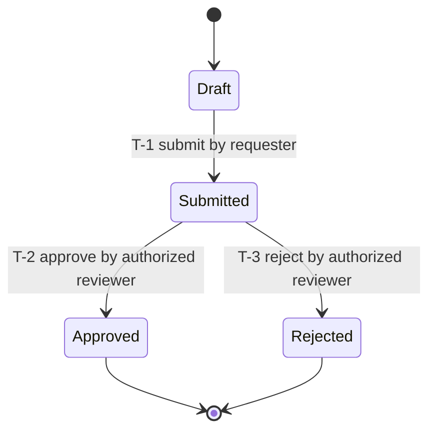
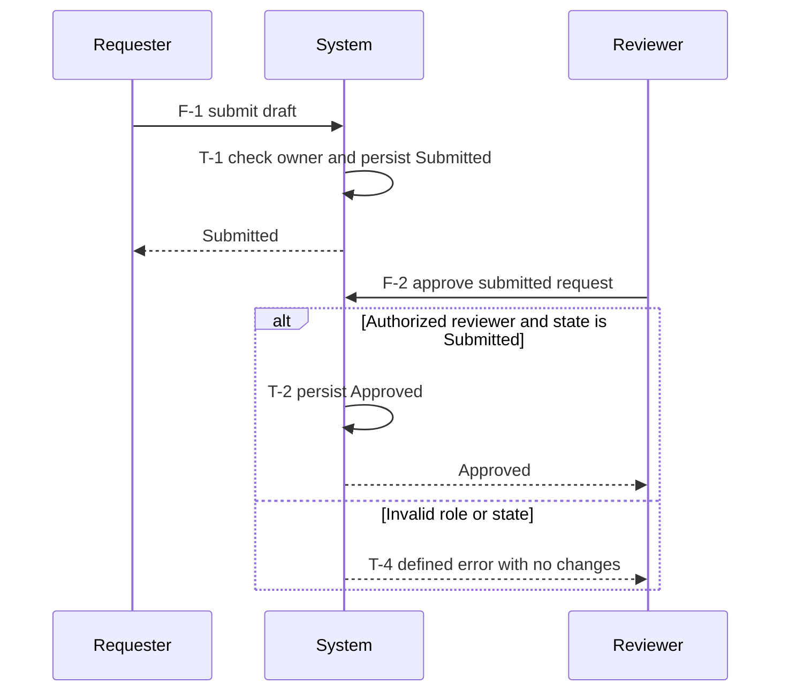

# Behavioral requirements contract

These are stack-neutral semantic modeling duties. The spec producer and its
Improve review apply them; neither automatically proves semantic completeness.
Read the packet-selected
section, then only the linked model/source sections needed for this action.
Model the **requested product's behavior**, not ShipLoop's workflow or task DAG.

## Discovery and research

Start from the incoming request recorded in `state.md` (`prompt`), not recalled chat.
Split it into atomic requirements with stable `R-` IDs and exact source pointers.
Record actors/roles, entities, system and external boundaries, ownership, initial
conditions, intended outcomes, non-goals, and unknowns. Distinguish user-required
behavior, observed existing behavior, evidence-derived constraints, proposals,
and unresolved decisions. Existing code is evidence, not authority to override a
requested change. Do not translate vague language into invented business policy.
Read the applicable [maintained product requirements](project-knowledge.md#maintained-product-requirements)
before deriving a delta. Historical run scope is not a new instruction, but
unaffected accepted conditions remain part of the product contract.
Apply [requirements definition](requirements-definition.md) during discovery,
research, and spec: inspect existing specs and quality policies, reconcile the
current change, and define applicable non-functional criteria without inventing
targets. Carry preserved quality conditions into the affected model and checks.

At `discovery`, identify modeling scope and high-risk questions, and inventory
the existing flows, state owners, persistence/communication boundaries,
entrypoints, tests, and documentation in the discovery note. At `research`,
investigate the uncertainties and retain findings in the research result body.
Discovery and research do not authorize product edits or deployment.
[Research](research-loop.md) retains stable questions and source evidence in
its run note before the spec drafts behavior. When a new source or environmental
discovery changes the assumptions before execution, investigate it and revisit
the dependent spec and plan instead of reusing stale proof.

Research deeply where behavior is uncertain or consequential:

1. Trace each requested outcome forward from its trigger through relevant
   callers, public boundaries, services/jobs, state writes, and external effects;
   trace backwards from the observable outcome to its prerequisites. Read the
   actual implementation, tests, docs, and relevant Git history when they exist.
2. For each high-risk transition, investigate success **and** failure/recovery:
   who owns the state; when a change becomes durable; what is atomic; what an
   acknowledgment proves; and what can happen if interruption occurs between
   operations. Research ordering, retries, duplicate events, permissions, and
   concurrency where the requested system makes them relevant.
3. Verify uncertain external behavior against primary documentation for the
   actual platform/version and exposed contract. For a client–service flow,
   resolve both invocation sides before authoring calls; an internal function
   signature does not prove the public operation exists. Use safe, authorized,
   non-destructive probes where documentation and implementation disagree.
4. Record compact evidence entries: source/path and symbol or section, version
   or revision where relevant, the `R-/F-/T-` rule supported or contradicted,
   what was observed versus inferred, and any remaining assumption/question.
   Research external references only when relevant; do not manufacture sources
   or require internet research for behavior fully established locally.
5. Resolve contradictions explicitly. A materially ambiguous rule—such as who
   wins a cancellation/completion race—needs user direction if neither the
   request nor established contract determines it. Pause before freezing a spec
   that depends on it; do not mark a guessed policy as validated.

Completion means the in-scope behavior can be specified and checked, with sources
for consequential rules and explicit exclusions. It does not mean reading every
file or exploring infinite paths. A simple/stateless transformation still needs
an input-to-output flow and error contract; record why a lifecycle state model
is unnecessary. Do not invent queues, services, or states to fill a template.

## Requirements definition

Read the [existing-spec and non-functional requirements guide](requirements-definition.md)
for this action's applicable slice. Discovery locates accepted specs and quality
policies; research resolves consequential unknowns; spec reconciles preserved,
added, modified, or retired clauses and defines verifiable quality criteria.
Explicit current user requirements supersede conflicting older clauses while
unaffected conditions remain. Later clarifications need their user source/basis;
agent notes and observed implementation cannot redefine accepted intent.
Planning and tests retain applicable new and preserved criteria, operating
conditions, verification methods, and source/test locators. Assigned reviews
check omissions, material conflicts, and unresolved targets before dependent
work. Use existing result fields and correction routes, preserving frozen
baselines and unrelated document content; no additional phase is introduced.

## Actors, channels, and state ownership

During discovery, spec development, global planning, and step planning, design
the interactions needed for the **current request in the actual environment**.
Revisit affected decisions during Improve and integration; reuse established
decisions when their assumptions still hold. This is a proportional design
assessment, not a requirement to add a server, queue, broker, or transport.

For service-backed flows, select the relevant [service discovery sections](service-discovery.md#select-scope)
to establish current remote state, cache freshness and authorization, asynchronous
completion, and owned observability. Carry their accepted contracts and checks
into this behavior model; a transport choice alone does not establish them.

1. **Actors and direction:** identify the relevant people, services, devices,
   and external systems, their roles and trust boundaries. Trace who initiates,
   who receives, who responds or is notified, and the intended observable effect.
   Consider user-to-system, system-to-system, and system-to-user interactions
   only where applicable. Distinguish product-runtime actors from development
   tools: an MCP used to deploy an app need not be part of its runtime.
2. **Channel per hop:** choose a suitable path for each interaction, preferring
   existing capabilities: local event/function call, request/response, or
   asynchronous message or notification. Add a new mechanism only for a
   demonstrated requirement or gap. State whether a return path is needed and
   what acknowledgment means; accepting a request is not proof its recipient
   observed the result.
   Let required latency/freshness, delivery expectations, offline behavior,
   privacy, platform capabilities, and operating cost drive relevant tradeoffs.
   Words such as “live” or “message” do not by themselves require sockets,
   polling, a queue, or bidirectional communication.
3. **State and authority:** separate transient presentation state from the
   authoritative domain state. Identify who may read or change it, its lifetime,
   whether independent clients must agree, and whether recovery needs durable
   storage. Local memory can be sufficient for a single-context interaction;
   hosting the page remotely does not make every action a server operation.
   Separate-browser shared state needs an explicit coordination/conflict rule,
   but not necessarily a new dedicated server. Sharing, durability, and trust
   are separate decisions: recovering after a client disconnect does not alone
   require saved games or survival of an authority/service restart. Define the
   required lifetime and recovery boundary. Conversely, one client can still
   require service-side authority for sensitive or consequential operations.
4. **Consequences and checks:** describe the happy path and material alternatives
   with expected outcomes. Where the chosen boundary makes them relevant, check
   invalid/unauthorized actions, stale or concurrent changes, duplicate/out-of-order
   messages, disconnect/reconnect, retries, and partial delivery. Distinguish
   delivery, persistence, and display evidence. Do not manufacture distributed
   failure cases for a local-only flow. Investigate unresolved choices only as
   deeply as their impact on this spec warrants; use bounded experiments when
   they could change the decision.

Keep a compact actor → interaction/channel → state owner → observable outcome
trace, the chosen rationale, consequential alternatives, evidence, and open
questions in **existing** discovery/design/spec notes. For a small change, a
paragraph may suffice. Carry their path/section locators into the plan and
affected work-item context; read and revalidate them at step planning and affected
Improve reviews. Update the existing notes when learning changes the decision,
and preserve reusable conclusions in project documentation for later runs.
Use the active protocol's existing result/evidence fields; no new ledger,
mandatory table, state schema, or graph stage is needed.

### Incoming events, connections, and state agreement

For the affected interaction, inspect the existing entrypoints, protocols,
state/storage contracts and observations. Specify the delta: preserve, reuse,
change or reconcile; include older producers/consumers and persisted work where
affected. Apply only the following relevant questions, in the existing notes:

- Identify non-user initiators too: services, peers, devices, scheduled work and
  lifecycle signals. Distinguish commands/queries, reported facts, snapshots,
  deltas and invalidation hints. Name payload/schema, origin and authorized scope;
  a claimed source/account in a message is not authentication or authorization.
- Separate event/operation identity, correlation, resource revision and replay
  position. Define acknowledgment meaning, ordering scope, duplicate/stale input,
  unknown outcomes, retry/cancellation and partial effects. Received, accepted,
  committed, synchronized and displayed are different milestones; record only
  those needed. If acknowledgment transfers responsibility for durable work,
  establish that acceptance boundary first; cover crashes before/after commit and
  acknowledgment, including restart of accepted but unprocessed work. Bind retry identity to authorized
  scope and original intent; handle non-atomic effects with the actual recovery
  rule rather than an unqualified exactly-once claim.
- For connections/subscriptions, cover applicable admission/authentication,
  subscription, readiness, loss, reconnect/resubscribe, resynchronization and
  cleanup. Connected does not imply current data. Define missed-event recovery,
  expired-cursor fallback and the snapshot-to-live boundary where relevant;
  prevent old-session/account callbacks from affecting a replacement session.
  Check actual host protocol, proxy, execution and background-lifecycle limits.
- Identify the UI/consumer read source, mutation authority, allowed writers,
  durability and identity scope separately. For clients, distinguish presentation,
  drafts, cached data, pending intent and confirmed state without requiring a
  store per role. Define local-versus-shared confirmation, freshness, conflict
  policy, restart/offline recovery and account/permission changes where needed.
  Preserve newer drafts against late acknowledgments or remote updates.
- Plan bounded capacity and failure/recovery ownership where relevant: slow
  consumers, bursts, exhausted retries, invalid input or overlapping scheduled
  work. Combining visual notifications does not authorize dropping domain events.
  Record the observable result for each consumer, including headless consumers;
  background work promised independently of a screen must have an owner that
  operates without that screen. Local/stateless work need not invent queues,
  persistence, connections, brokers or distributed failure cases.

Use the existing sequence/transition and test records for these decisions. Reuse
current supported mechanisms; neither these questions nor a message-format
standard prescribe an event bus, global handler, transport or new ShipLoop state.

### UI-specific planning

When a human-facing surface is affected, retain all three UI planning views in
an existing design/spec document and link the applicable sections from the
project knowledge index and feature context:

| View | Planning decisions |
| --- | --- |
| Components | Existing primitives/compositions and examples; responsibilities, input/event contracts, variants and visible states; keyboard/touch/focus/accessibility behavior. |
| Interaction model | Human journeys and intent plus machine-originated updates; navigation, validation, local/shared state transitions, feedback, conflict/recovery actions and behavior with the UI absent. |
| Branding / skin | Existing typography, semantic color/spacing/motion tokens, imagery, density and adaptive layout; preserved identity and intentional visual changes. |

Inspect prior design and actual code/behavior before proposing a redesign.
Distinguish accepted requirements from observed practice or defects. Reuse an
adequate premise and specify the feature delta; missing design documents do not
mean a new product. Preserve platform conventions on web/native/mobile clients.

At the first consequential UI decision, discover, read and apply suitable design
guidance available through the current host's capability/skill discovery (such
as frontend-design). Record its actual identity/version or content digest and
applicable decisions. Do not wait until post-implementation skill assessment.
An absent optional skill uses repository guidance and this section as fallback;
do not install a skill, hard-code host paths or claim unexecuted skill use.

Push hard for the most polished, elegant and richly interactive experience the
target can deliver within the user's goals and accepted scope. A bare functional
screen is incomplete; reuse should raise quality, not set the ceiling. Plan
distinctive visual hierarchy, polished reusable components, responsive
composition, complete loading/empty/error/success states and task-specific rich
interactions: direct manipulation, inline editing, live preview, keyboard
paths and animated state transitions. Scale ambition back only for a stated user
constraint, a target limit or accessibility, and record which. For meaningful async
activity, map trigger -> truthful state -> cue/status -> outcome/recovery.
Use expressive, purposeful motion to communicate pending work, accepted confirmation or a
relevant remote change; preserve focus, input and reading position. Distinguish
saved locally, queued and confirmed where applicable. A timer or completed
animation cannot confirm domain success or own required domain processing.
Define interruption/supersession, event-burst coalescing, accessible status and
reduced-motion alternatives. Keep unresolved failures and necessary actions
available beyond a transient toast; apply pause/dismiss/update controls where
needed. Avoid replaying stale success animations after resume.

Evaluate the existing UI toolkit first, then suitable alternatives such as
Bootstrap or a runtime-appropriate Material implementation only for an actual
gap. Record the exact package/version, required capabilities and tradeoff.
Check build versus deployed runtime, framework/DOM ownership, asset/font/module
delivery, CSP, routing/embedding, native lifecycle, accessibility, performance
and maintenance/licensing where relevant. Resolve consequential uncertainty
with a bounded production-artifact probe in the target; a preview proves only
the constraints it reproduces. Do not silently weaken host policies or migrate
frameworks solely for appearance; an evidenced interaction or design-system gap
can justify a compatible, scoped upgrade.

At consequential UI planning decisions, use the current tooling inventory to
compare reusing existing capability, evolving it, and a credible upgrade or new
tool where it materially improves the intended experience. Reuse the strongest
existing components, tokens, assets, interactions and motion before rebuilding.
Do not treat a merely adequate baseline as the ceiling. Record a compact decision
in the existing design basis: desired experience and concrete interactions;
viable alternatives and selected approach; rough effort/cost range or relative
size with assumptions and uncertainty; expected user benefit; compatibility,
performance/accessibility and maintenance impact; and the check or bounded probe
that would resolve a consequential unknown. Do not fabricate package capabilities,
estimates or tool availability. A new dependency remains a candidate until its
fit is established; a local preview does not establish deployed compatibility.

Apply relevant principles from respected primary design guidance, such as
[Google Material's expressive-design research](https://design.google/library/expressive-material-design-google-research),
[the Gemini team's evolving visual language](https://design.google/library/gemini-ai-visual-design),
or the target platform's human-interface guidance. Identify the source and the
principle applied, adapting it to the product's identity and journeys rather
than copying a brand or adding a provider dependency. Expressive hierarchy,
direct feedback and purposeful motion must preserve clarity and control.

Extend the established application architecture and design, build, test and
browser facilities. Do not create a parallel UI stack or duplicate harness to
demonstrate polish. An isolated design comparison or probe must feed its accepted
result back into the existing specification, components and verification path.
Feature planning reuses the accepted decision and estimates only its affected
delta; reconsider shared choices when a new opportunity or evidence warrants it.

### Allocate UI decisions to their planning owner

Apply this subsection only when a human-facing surface is affected; a headless
service or CLI without such a surface does not need UI premises or a design skill.
During initial architecture and environment evaluation, establish or augment the
shared component, interaction/state and skin premises before features rely on
them. Apply the [UI ambition and tooling decision](#ui-specific-planning) at
that scope. Connect requested user and machine outcomes to the actual toolkit,
asset/runtime, storage, transport and lifecycle capabilities they need. An
available API or library is an option, not a requirement to expose every action.
For an existing product, retain adequate foundations and identify only the
changed assumptions and affected consumers.

Global planning maps those decisions to the existing
[preparation producers and readiness checks](environment-lifecycle.md#plan-preparation-before-its-first-consumer):
name who supplies a missing capability, which item needs it first, and the
observation that will establish readiness. Preserve unresolved decisions and
target-specific verification gaps; a rendered screen does not establish storage,
identity, transport or background-lifecycle capability.

At step planning, reopen the applicable shared premises and specify only the
selected item's interaction delta, component states, visual changes and checks.
Do not absorb other items from the original request or add user journeys because
the service supports them. Reuse unchanged architecture; re-evaluate an affected
premise when current target evidence or the feature's needs contradict it.

If the missing prerequisite is outside the selected item's authorized work,
name its owner or the missing ownership decision and use the packet's blocked
or correction route before dependent work. Describe the supplier's required
evidence without inventing its unresolved contract or protocol. A future
"obtain capability" bullet
is insufficient when it has no supplier or place in the delivery plan. A
preparation item may plan to produce its own output; do not require that output
before its authorized setup work. Keep independent ready features separate.
The normal Improve handoff reviews decisions at this same planning level;
intake may retain questions for research, and planning checks remain proposed
until the responsible execution stage runs them.

When review changes a premise or dependency order, use the existing result and
reference handoff to identify the reviewed replacement and its precedence; update
item contexts only where the current stage owns them. Preserve immutable producer
evidence as historical. If a source update is forbidden, keep it pending and
make the correction locator explicit instead of presenting an obsolete plan as
current.

### Review, evidence, and reuse

Carry compact baseline/delta, interaction/state/connection and applicable UI
premise locators into global planning, each affected feature and its existing
Improve review. Review the decisions automatically at the normal handoff; do
not add a second invocation, graph node, review counter or nested campaign.
Check whether worthwhile polish and interaction improvements were considered,
their estimates and selected reuse/upgrade path are credible, and the existing
architecture and verification facilities remain authoritative.
During planning, review the specification and proposed checks; do not implement
future features or demand rendered proof before the UI exists. Later checks
verify the actual receiving, processing, state and consumer outcome separately,
including rendered/accessibility/motion evidence when applicable. A screenshot
cannot prove reconciliation or animation timing, and headless processing cannot
prove a required UI updated. A feature with no UI still needs its applicable
interaction contract; it needs no visual-design exercise.

Revalidate affected decisions, use current evidence and preserve unresolved gaps.
Keep reusable decisions in repository-owned documents, with a short summary and
exact source/section locators in each affected work-item context and result
evidence_refs for cold recovery. Include planned check locators, selected design
guidance identity/version or digest, and the normal Improve handoff; a vague
"see above" or a path relative to some other workspace is not a usable locator.

These are hypothetical applicability examples, not prescribed architectures:

| Requested behavior | Proportionate starting decision | An important check |
| --- | --- | --- |
| Two people take turns on one browser's in-memory Tic-Tac-Toe board; no saved games | UI events update local game state and render locally; no per-move server call needed. | Legal/illegal moves and game-over outcomes; refresh behavior matches the stated lifetime. |
| Players share a match from different browsers | Establish shared authority, move validation, synchronization, and conflict/recovery rules using suitable existing capabilities; local UI state can remain local. | Concurrent/stale moves do not create divergent accepted boards; reconnect recovers the agreed state. |
| A user requests a message, or an external service sends a notification to a user | Trace sender → receiving service → recipient/channel and any needed reply; choose immediate or delayed delivery from the actual contract. | Acceptance versus delivery/display is explicit; permissions and duplicate/failure behavior are covered where relevant. |

## Behavior model

Reconcile this run's model with the repository's
[maintained product requirements](project-knowledge.md#maintained-product-requirements):
preserve, add, modify or retire affected conditions with an explicit basis.
Keep lasting accepted intent outside this run's model; preserve the current
protocol's existing freeze/revision rules rather than silently altering its baseline.

At `spec`, retrieve the incoming prompt, discovery and research results
in bounded sections. Store the proposed product behavior in the result `body`:
a requirement index, sequence flows, state inventory, transition ledger, and
case mapping. Use compact Markdown tables and Mermaid diagrams where they make
ordering or state changes clearer. Use consistent IDs and terminology across
diagrams, tables, tests, and implementation; a pretty diagram alone is not a spec.
Apply [Discovery and research](#discovery-and-research) to unresolved rules before
accepting them. Write the model with its acceptance decisions; the spec's
Improve review then challenges it. R/F/T model records remain Markdown
prose, not an invented model schema.

### Sequence flows

Give every distinct required user/system journey an `F-` ID linked to its `R-`
requirements. Document actors/components, trigger and preconditions, ordered
messages/actions, sync versus async boundaries, input/output semantics, state
changes, and final observable outcome. Include relevant alternative branches,
guards, failure responses, timeout, cancellation, cleanup, compensation, and
recovery paths. Cross-reference transition IDs at state-changing messages.
Split large flows by meaningful boundary and link them; do not hide alternatives
in an unlabeled “error” branch. Record environment and real versus simulated
dependencies in the associated cases. Reuse the actual invocation contract.

### States and transitions

Inventory each relevant stateful entity separately. For each state give its
meaning, invariant, owner, durable versus transient status, and initial/terminal
role. Name hierarchy, concurrent dimensions, and cross-entity invariants when
needed; avoid an unnecessary Cartesian product of all possible system states.

Use a transition ledger as the detailed complement to each state diagram:

| Field | Required content for an applicable transition |
| --- | --- |
| Identity and origin | Stable `T-` ID; `R-` requirement and `F-` flow IDs; source or explicit decision. |
| Before | Entity/state owner, source state or explicit state set, relevant data invariant. |
| Trigger and guard | Event and actor; permission, data/time preconditions; mutually exclusive guard or explicit selection priority. |
| Operation | Ordered actions, persistence boundary, side effects, entry/exit behavior where applicable. |
| After and observation | Destination or unchanged state; invariant; caller-visible output/error and relevant time bound. |
| Failure and recovery | Failure point, retained/partial effects, retry/idempotency, timeout, compensation or operator action as applicable. |
| Validation | Stable case IDs, expected state/output/effect, selected test surface; later link actual evidence separately. |

Model required valid transitions **and** behavior for invalid/forbidden events.
For each relevant state/event class, record transition, guarded rejection,
documented ignore/no-op, or unresolved rule. A rejection/ignore must specify
whether data or external effects remain unchanged. Do not assume a self-loop
means no-op: exit/re-entry or repeated side effects may matter. Distinguish
termination from a state that still accepts retry, read, or cleanup events.

Audit these event families for relevance, documenting exclusions with reasons:

- normal entry/progression/completion; invalid input and unauthorized actors;
- boundary/empty values; duplicate/repeated requests and idempotent replay;
- timeout, bounded retries/exhaustion, cancellation, and resumption/restart;
- partial persistence or external-effect failure, cleanup/compensation, recovery;
- concurrent actors, stale/out-of-order callbacks, conflicting updates;
- relevant lifecycle initialization, shutdown, deletion, migration or expiry.

Enumerate all **required in-scope** transitions; partition equivalent states,
events, and guard boundaries explicitly. List omissions/unknowns rather than
claiming all possible paths are proven. Cover interactions between partitions
where they carry risk. For a stateless component, document the applicability
decision and equivalent valid/invalid input-output cases instead of a fake
persistent lifecycle.

On every planning review, perform [Traceability and review](#traceability-and-review).
Material unresolved requirements block freeze; `checkable: true` is not evidence
that a semantic completeness review occurred.

## Traceability and review

Include the applicable [maintained product requirements](project-knowledge.md#maintained-product-requirements)
and their negative/state-transition subclauses in affected checks and Improve
reviews. Carry requirement/test locators into step context; update the durable
home for accepted changes without deriving normative intent from observed bugs.

Retrieve only the current requirement/flow/transition slice and adjacent affected
paths from the durable behavior model, spec/draft, research, plan and current
step. Never assume the
previous prompt's mental model survives. Read the accepted spec, research and
plan results the packet names in `state.md` and their linked notes, and during
execution the current item's step-plan and test-decision sources. The accepted
spec records the approved baseline; current observations are retrieved
separately and must not silently redefine its acceptance.

Use this breadth audit on every spec and plan review and every affected Improve
cycle; at `product-acceptance`, reconcile the whole in-scope model:

1. **Prompt to outcome:** every `R-` requirement has a flow/outcome, relevant
   transitions, and acceptance cases, or a justified non-behavioral applicability
   note. Every modeled feature traces back to scope, not an invented expansion.
2. **Structural coverage:** every modeled state is reachable or explicitly
   justified; every nonterminal has a defined way forward/recovery; guards cover
   relevant boundaries and conflicts; transitions preserve stated invariants.
   Identify dead ends, missing actors/events, and inconsistent names.
3. **Negative and temporal coverage:** inspect forbidden/no-op events and each
   applicable failure/recovery family from the behavior model. Review important
   multi-transition sequences and cross-entity races, not only isolated edges.
   State coverage alone is not transition coverage; transition coverage alone
   does not establish every meaningful sequence or concurrency interleaving.
4. **Tests and evidence:** map required `R-/F-/T-` IDs to stable case IDs with
   preconditions/events and explicit expected state, output, errors and effects.
   Select browser/service/API surfaces by risk and actual environment. Keep
   expected outcomes separate from observed status/revision/evidence; required
   failed, blocked, or unrun cases remain unfinished.
5. **Documentation consistency:** reconcile diagrams, ledger, concise function
   contracts, README usage/recovery guidance and tests. A missing transition or
   misleading behavior contract is material even when fixing it is a tiny edit.
   Record changed IDs and implications, or a specific no-change rationale.

Carry this model through the existing stages:

| Stage | Durable action |
| --- | --- |
| `discovery`, `research` | Inventory existing flows, state owners and boundaries; investigate uncertain or consequential behavior without product edits. |
| `spec` and its Improve review | Write the model, challenge clarity/consistency/feasibility, and settle it before planning. |
| `test-strategy`, `plan` | Map the behavior/test/documentation outputs and dependencies into ordered work items. Put contract, environment and deployment prerequisites before their consumers. Keep product behavior order distinct from the work queue. |
| `step-plan`, `test-spec` | Select the item's slice, cases and expected transitions/effects before code. |
| `implement` | Implement the active slice, cases, and enduring product diagrams/ledger where needed; compare with the accepted spec, not an improvised model. |
| `test-green`, `regression`, `verify` | Run lint and all required checks, compare expected transitions/effects with observations. Do not silently adjust expectations to match failures. |
| `carry-forward` | Distill new observations with source, scope, revalidation guidance and impact. Revise only future work within the accepted spec; incompatible contracts pause. |
| `product-acceptance` | Reconcile end-to-end flows and state interactions across items with whole-product evidence; corrective work returns through `replan` and new work items. |
| `handoff` | Link the behavior model and case evidence, naming scope/exclusions and unresolved limitations honestly. Generic harness proposals stay separate. |

If learning contradicts accepted scope/acceptance, stop and seek direction, not a
silent spec edit. Future-queue revision cannot change accepted acceptance. Never
invent a rewind command or directly modify authority files to bypass the
protocol.
During execution, preserve the observation in the
[project knowledge checkpoint](carry-forward.md), including what it contradicts
and which consumers are affected. The separate living ledger preserves learning
without falsely certifying a replacement spec or hiding a changed assumption.
Use the [execution research assessment](research-loop.md#later-discoveries) for
new unanswered questions: investigate current-scope gaps in the current stage
or its Improve review, or add a research item before affected future consumers. Material
environmental/behavior uncertainty cannot be classified as non-semantic polish.

Persist compact source/decision summaries and IDs in the result `summary` and
the run notes its `evidence_refs` name. Before
implementation, the spec/plan holds the proposed model. Plan enduring product
model docs as worktree artifacts; link their current sections/revisions after
creation. Keep essential rules and unresolved decisions inline in authoritative
Markdown so deleting a draft or clearing context loses no decision. Large
diagrams and evidence can be linked/paged; an ephemeral draft-only link is not
durable state. Do not dump all histories or the human-oriented ShipLoop README
into every action packet. Scripts preserve accepted results and enforce the
graph's transitions; they do not determine transition coverage or meaning
automatically.

## Worked example

This deliberately small **hypothetical** input fixes its policy explicitly:
“A requester may submit their own draft once. An authorized reviewer may approve or
reject a submitted request. Approval/rejection is terminal. Invalid or repeated
commands return an error without changes.” Persistence failure and concurrent
review policy are still questions to resolve before a production spec freezes.

`R-1` covers submission; `R-2` covers reviewer decisions; `R-3` covers rejected
commands. `F-1` is submission and `F-2` is a reviewer decision.

The sequence shows one slice, not all of `F-2`: rejection uses `T-3`. The ledger
must also describe `T-4` invalid-event classes that a state diagram can omit.
For example, `TC-4 / R-3 / T-4`: given Approved, when approve repeats, expect the
defined invalid-state error, state Approved, and no additional side effects.
Observed status is **not run** until evidence exists. A real spec must resolve
the exact error, persistence, and race questions before declaring checkability.

## Design basis

Adopt the modeling concepts, not a runtime or technology dependency. The
[W3C SCXML core constructs](https://www.w3.org/TR/scxml/#CoreConstructs) distinguish
states, events, guarded transitions and actions, including hierarchy and parallel
states. ShipLoop does not impose SCXML execution semantics on a product.
The [ISTQB Foundation syllabus, section 4.2.4](https://istqb.org/wp-content/uploads/2024/11/ISTQB_CTFL_Syllabus_v4.0.1.pdf)
distinguishes state and transition coverage and describes invalid transitions;
this motivates a ledger alongside diagrams, not a claim of exhaustive testing.
Use [Mermaid state notation](https://mermaid.js.org/syntax/stateDiagram.html) and
[sequence notation](https://mermaid.js.org/syntax/sequenceDiagram.html) as optional
portable Markdown illustrations. Research depth follows behavior risk; full
formal modeling or enumerating every interleaving is not mandated.

For channel tradeoffs, the [Microsoft event-driven architecture guide](https://learn.microsoft.com/en-us/azure/architecture/guide/architecture-styles/event-driven)
describes producers, consumers, and channels, and cautions against adding
asynchronous infrastructure when simple request/response meets the requirements.
Use that tradeoff as a design question, not a dependency or vendor preference.
